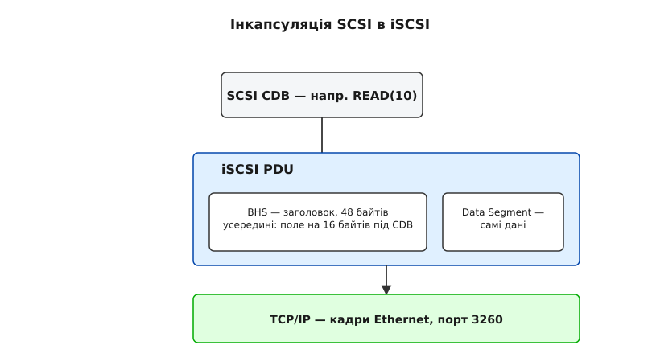

# iSCSI: SCSI поверх TCP — сесії, IQN і портали

<details><summary>Що треба знати перед читанням</summary>

- Базові принципи роботи мереж TCP/IP.
- Розуміння того, що таке блочний пристрій і чим він відрізняється від файлової системи (наприклад, NFS чи SMB).
- Загальне уявлення про архітектуру SCSI (ініціатор, таргет, LUN, команди CDB).

</details>

Уявіть, що у вас є сервер бази даних, якому катастрофічно не вистачає дискового простору, а локальні слоти для дисків уже вичерпано. Ви маєте інший сервер, що буквально переповнений вільними дисками. Як передати цей дисковий простір першому серверу так, щоб база даних «бачила» його як звичайний локальний сирий диск, форматувала у власну файлову систему й працювала з ним безпосередньо? Традиційно для цього будували окремі дорогі мережі Fibre Channel. Але чи можна використати вже існуючу гігабітну Ethernet-мережу? Саме цю проблему вирішує iSCSI — протокол, що інкапсулює команди SCSI безпосередньо в TCP/IP, дозволяючи монтувати диски через звичайну мережу так, ніби вони фізично підключені до вашої материнської плати.

iSCSI (Internet Small Computer Systems Interface) перетворив Ethernet на магістраль для мереж зберігання даних (SAN). Він дозволяє комп'ютерам спілкуватися з пристроями зберігання блочного рівня на великих відстанях, використовуючи стандартне обладнання (комутатори, маршрутизатори, мережеві карти) замість спеціалізованих і дорогих компонентів.

## Від SCSI до iSCSI: інкапсуляція команд

Щоб зрозуміти iSCSI, слід пригадати архітектуру SCSI. В основі SCSI лежить обмін командами — Command Descriptor Blocks (CDB). Ці блоки містять інструкції на кшталт «прочитати 5 блоків, починаючи з адреси 1024». У традиційному SCSI ці команди передаються по паралельному кабелю або SAS (Serial Attached SCSI). 

iSCSI бере ті самі блоки CDB і загортає їх у спеціальний формат — Protocol Data Unit (PDU). Потім ці PDU надсилаються через звичайні TCP-з'єднання (зазвичай на порт 3260). 

Це означає, що ядро операційної системи (наприклад, Linux) генерує стандартні команди SCSI. Перехоплювати їх нікому не треба: підсистема iSCSI стоїть для SCSI-рівня ядра рівно там, де для локального диска стояв би драйвер контролера, — вона штатно отримує готовий CDB, пакує його в TCP і відправляє по мережі. На іншому кінці мережі пристрій зберігання розпаковує ці пакети, отримує початковий CDB і виконує його, ніби він надійшов по звичайному SCSI-кабелю.



*Сама команда нікуди не зникає й ні на що не перекладається: CDB лягає в поле всередині заголовка PDU, а сегмент даних везе те, що читають чи пишуть. Для диска на тому кінці це та сама команда, що прийшла б кабелем.*

Що саме лежить у заголовку PDU, з яких полів він складається і як за ними впізнають відповідь на свою команду — [розбір формату PDU](topic:sys-unix/iscsi-in-linux/api-iscsi-pdu.md).

## Ініціатор та Таргет

В архітектурі iSCSI існують дві основні ролі, які спілкуються між собою:

1.  **Ініціатор (Initiator):** Це клієнт. Сервер, якому потрібен дисковий простір. Ініціатор «ініціює» підключення та надсилає SCSI-команди (запити на читання/запис). У Linux найпопулярнішим програмним ініціатором є `open-iscsi` (демон `iscsid`). Він працює частково в просторі користувача (для управління сесіями та конфігурацією) та частково в ядрі (модуль `scsi_transport_iscsi` та `iscsi_tcp` для фактичної передачі даних).
2.  **Таргет (Target):** Це сервер зберігання. Він надає дисковий простір (фізичні диски, RAID-масиви, логічні томи LVM або навіть просто великі файли), приймає SCSI-команди від ініціатора й повертає результати чи дані. У сучасному ядрі Linux стандартним таргетом є підсистема LIO (Linux-IO Target), керування якою здійснюється через утиліту `targetcli`.

## IQN: Як знайти один одного

У звичайній IP-мережі машини ідентифікуються за IP-адресами. Проте iSCSI потребує власної системи ідентифікації, оскільки один фізичний сервер (з однією IP-адресою) може мати кілька незалежних ініціаторів або таргетів. Тому iSCSI використовує спеціальні імена — iSCSI Qualified Names (IQN).

Формат IQN чітко регламентований:
`iqn.yyyy-mm.naming-authority:unique-name`

Наприклад: `iqn.2003-01.org.linux-iscsi.storage:disk1`

-   `iqn`: Префікс, що вказує на тип імені.
-   `yyyy-mm`: Рік і місяць, коли організація (`naming-authority`) зареєструвала свій домен або почала використовувати iSCSI.
-   `naming-authority`: Обернене доменне ім'я організації (наприклад, `com.example`).
-   `unique-name`: Унікальний ідентифікатор конкретного таргета або ініціатора в межах цієї організації.

Кожен ініціатор має свій IQN (зазвичай генерується під час встановлення ОС у файлі `/etc/iscsi/initiatorname.iscsi`), і кожен таргет також має свій IQN. Під час встановлення з'єднання вони обмінюються цими іменами для взаємної ідентифікації.

Звідки взявся сам протокол і чому його зустріли зі скепсисом — [історія появи стандарту](topic:sys-unix/iscsi-in-linux/hist-iscsi-standard.md).

## Портали, Сесії та З'єднання

Мережева архітектура iSCSI має кілька рівнів абстракції, що забезпечують гнучкість і надійність:

**Портал (Portal):**
Це точка входу в мережу. Портал визначається комбінацією IP-адреси та TCP-порту. Наприклад, `192.168.1.100:3260`. Таргет може слухати на кількох порталах одночасно (наприклад, для резервування через різні фізичні мережеві карти). Група порталів, що надають доступ до одного таргета, називається Target Portal Group (TPG); таргет може мати кілька таких груп. Прив'язка тут жорстка: усі з'єднання однієї сесії мусять іти до порталів однієї TPG — між двома групами сесія не розтягується.

**З'єднання (Connection):**
Це фактичне TCP-з'єднання між порталом ініціатора та порталом таргета.

**Сесія (Session):**
Сесія — це логічний зв'язок між ініціатором і таргетом. Одна сесія може складатися з одного або кількох TCP-з'єднань (Multiple Connections per Session — MC/S). Стандарт передбачає MC/S заради пропускної здатності та відмовостійкості, але ініціатор `open-iscsi` його так і не реалізував: у Linux сесія має рівно одне з'єднання. Тому резервування шляхів роблять поверхом вище — кілька окремих сесій через різні мережеві карти, зведені в один пристрій засобами device-mapper (dm-multipath).

## LUN: Логічний пристрій

Коли ініціатор підключається до таргета, таргет може надавати йому не один диск, а кілька. Кожен такий диск називається LUN (Logical Unit Number). Це просто номер, який ідентифікує конкретний логічний том у межах таргета. 

Наприклад, таргет `iqn.2026-08.com.storage:db` може надавати:
- LUN 0: Том для операційної системи.
- LUN 1: Том для файлів бази даних.
- LUN 2: Том для журналів транзакцій.

Операційна система ініціатора побачить кожен LUN як окремий блочний пристрій (наприклад, `/dev/sdb`, `/dev/sdc`, `/dev/sdd`).

## Життєвий цикл підключення: Discovery та Login

Процес підключення ініціатора до таргета складається з двох основних етапів.

### 1. Discovery (Виявлення)

Перш ніж підключитися до конкретного таргета, ініціатор повинен дізнатися, які саме таргети йому доступні. Найчастіше для цього використовується протокол SendTargets.

Ініціатор встановлює коротку TCP-сесію з порталом таргета (його IP-адресою) і надсилає команду `SendTargets=All`. Таргет відповідає списком усіх доступних IQN таргетів і порталів, через які до них можна підключитися.

Утиліта `iscsiadm` дозволяє виконати цей процес:
```bash
iscsiadm -m discovery -t sendtargets -p 192.168.1.100
```
Ця команда збереже інформацію про знайдені таргети у внутрішню базу даних `open-iscsi` (зазвичай у `/var/lib/iscsi/nodes`).

### 2. Login (Вхід)

Після виявлення ініціатор ініціює сесію з конкретним таргетом (Login Phase). Під час цього етапу відбувається:
-   **Автентифікація — перша стадія логіну:** Зазвичай використовується CHAP (Challenge-Handshake Authentication Protocol). Таргет надсилає випадковий виклик, ініціатор повертає хеш від цього виклику разом зі спільним секретом — сам пароль мережею не йде. Можлива як одностороння (таргет перевіряє ініціатора), так і двостороння (Mutual CHAP) автентифікація.
-   **Узгодження параметрів — друга стадія:** Лише після успішної автентифікації сторони домовляються про максимальний розмір PDU, контрольні суми та решту функцій. Порядок саме такий: спершу довести право входу, потім домовлятися про режим роботи.

Підключення (логін) до знайденого таргета:
```bash
iscsiadm -m node -T iqn.2026-08.com.storage:disk1 -p 192.168.1.100 -l
```
Якщо вхід успішний, ядро Linux зареєструє нові SCSI-пристрої, і в `dmesg` з'являться повідомлення про нові диски `/dev/sdX`.

Щоб відключитися (logout), використовують прапорець `-u`:
```bash
iscsiadm -m node -T iqn.2026-08.com.storage:disk1 -p 192.168.1.100 -u
```

Другий бік цієї пари — сервер, що віддає диск: [покрокове налаштування таргета на LIO](topic:sys-unix/iscsi-in-linux/proj-iscsi-target-setup.md).

## Робота з пристроєм

Після успішного підключення новий пристрій з'являється в системі. Наприклад, `/dev/sdb`. Операційна система працює з ним абсолютно так само, як із фізичним локальним диском:
- Можна створити таблицю розділів (GPT/MBR) за допомогою `fdisk` або `parted`.
- Можна створити файлову систему (`mkfs.ext4`, `mkfs.xfs`).
- Можна додати його як Physical Volume до LVM.
- Можна змонтувати його в директорію (`mount /dev/sdb1 /mnt/data`).

Ядро самостійно транслює всі операції читання/запису у SCSI CDB, передає підсистемі iSCSI, яка пакує їх у TCP і відправляє на таргет. Прозорість — головна перевага iSCSI. Програми рівня користувача навіть не знають, що диск насправді розташований в іншій кімнаті чи будівлі.

## Проблеми та оптимізація iSCSI в Linux

Оскільки iSCSI працює поверх TCP/IP, продуктивність безпосередньо залежить від якості мережі.

**Мережеві затримки (Latency):**
SCSI спочатку розроблявся для коротких кабелів з мікросекундними затримками. Коли затримка зростає до мілісекунд (що типово для маршрутизованих IP-мереж), продуктивність блочного I/O може різко падати, особливо для випадкового дрібного читання/запису. Тому iSCSI зазвичай використовують у локальних мережах (LAN) або через спеціалізовані виділені канали.

**Jumbo Frames:**
Стандартний розмір корисного навантаження кадру Ethernet (MTU) — 1500 байт. Для передачі великих блоків даних (наприклад, 8 КБ або 64 КБ на один SCSI-запит) TCP змушений розбивати їх на багато дрібних пакетів. Це навантажує процесор: на той самий кілобайт даних припадає більше пакетів, а отже більше переривань і більше роботи TCP/IP-стека. Увімкнення Jumbo Frames (розмір MTU 9000 байт) на комутаторах та мережевих картах дозволяє передавати більше даних в одному пакеті, суттєво знижуючи навантаження на CPU та підвищуючи пропускну здатність.

**Апаратне розвантаження (TOE і iSCSI HBA):**
Деякі дорогі мережеві карти мають функцію TCP Offload Engine (TOE), яка бере на себе обробку TCP/IP, звільняючи центральний процесор. Існують також спеціалізовані iSCSI HBA (Host Bus Adapters), які на апаратному рівні обробляють не лише TCP/IP, але й сам протокол iSCSI. З погляду ОС, такий адаптер виглядає як звичайний SCSI-контролер. Проте сучасні багатоядерні процесори стали настільки потужними, що програмний iSCSI (через `open-iscsi`) працює надзвичайно ефективно, і спеціалізовані HBA використовуються рідше.

## Висновки

Протокол iSCSI зробив мережі зберігання даних доступними для будь-якої інфраструктури, що має IP-мережу. Завдяки абстракціям IQN, порталів та LUN, він дозволяє гнучко розподіляти дисковий простір. У Linux завдяки зрілості інструментів на кшталт `open-iscsi` та `LIO`, налаштування iSCSI стало стандартним і надійним рішенням для віртуалізації, баз даних і кластерних систем.

> [!NOTE]
> Слід пам'ятати, що iSCSI забезпечує доступ на рівні *блоків*, а не на рівні файлів. Якщо ви підключите один iSCSI LUN одночасно до двох різних серверів і змонтуєте там звичайну файлову систему (наприклад, ext4), вона дуже швидко пошкодиться, оскільки кожне ядро кешуватиме метадані, не знаючи про зміни іншого. Для одночасного доступу потрібні спеціальні кластерні файлові системи, такі як OCFS2, GFS2 або VMFS (у випадку VMware).
