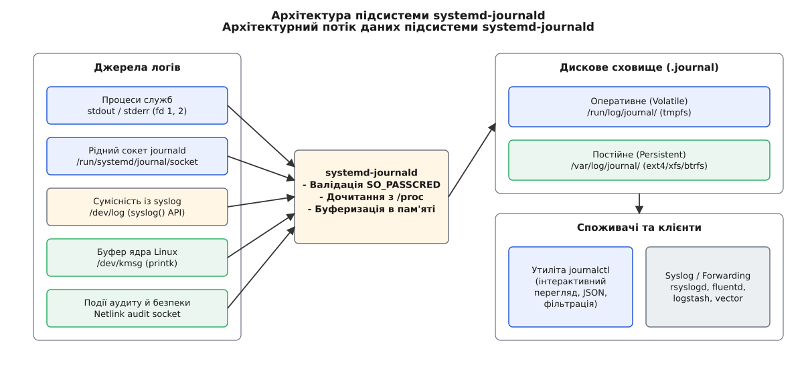
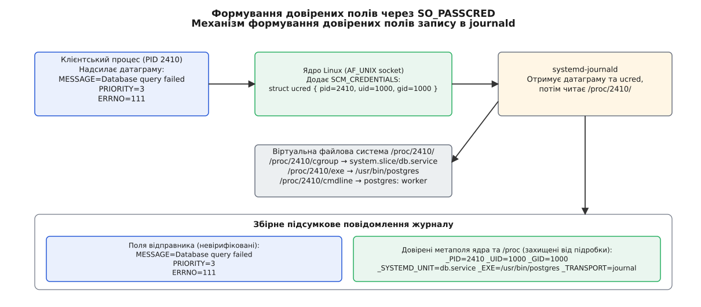
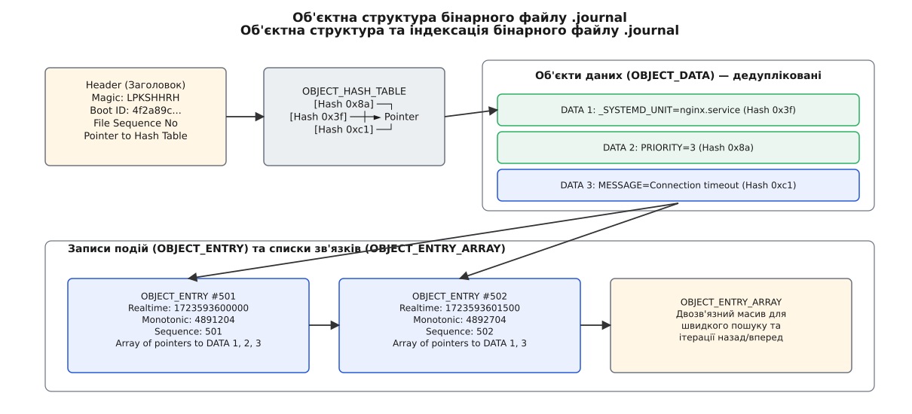
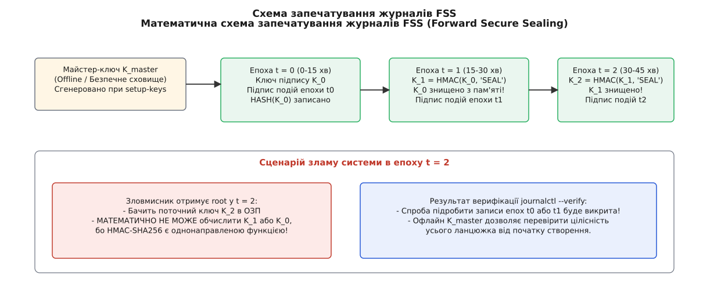
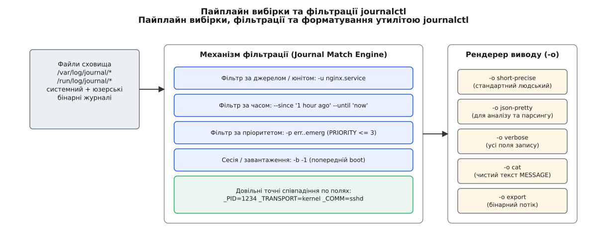

# Логування у systemd: підсистема journald та інструмент journalctl

<preknowlist>
- [systemd: юніти, залежності, цілі](root:sys-unix/systemd-model) — концепція юнітів, управління службами та контрольними групами.
- [Сокети домену Unix і передача дескрипторів](root:sys-unix/unix-domain-sockets) — передача датаграм Unix domain socket та отримання SO_PASSCRED.
- [Файловий дескриптор](root:sys-unix/file-descriptor) — механізм успадкування та перенаправлення стандартних потоків виводу.
- [cgroups: облік і обмеження ресурсів](root:sys-unix/cgroups-resource-model) — об'єднання процесів служби у єдину ієрархічну групу.
</preknowlist>

О третій годині ночі високонавантажений веб-сервер перестає відповідати на запити. Системний адміністратор відкриває традиційний текстовий журнал `/var/log/syslog` і бачить суцільний потік із сотень тисяч нерозбірливих рядків, де вивід п'ятдесяти паралельних робочих процесів перемішано без мікросекундних міток часу, а рядок `sshd[1187]: Accepted publickey` міг бути згенерований будь-яким непривілейованим скриптом через командний інструмент `logger`. Спроба знайти першопричину падіння за допомогою `grep` вимагає складних регулярних виразів, які мовчки ламаються при найменшій зміні формату текстового виводу.

Текстова модель логування, створена в 1980-х роках для послідовного запуску демонів, виявилася непридатною для сучасних багатоядерних операційних систем із динамічним паралельним запуском служб. Для розв'язання цієї проблеми в складі системного менеджера systemd було створено централізовану підсистему логування `systemd-journald` та інструмент аналізу `journalctl`.


*Архітектура підсистеми systemd-journald: від вхідних сокетів та буфера ядра до дискового сховища й утиліти journalctl.*

Глибинні причини відходу від класичної схеми `syslog.conf` та історичні етапи формування сучасних системних журналів розкрито в [історичному огляді еволюції системних журналів](root:sys-unix/journalctl-and-journald-conf-operation/hist-syslog-to-journald.md).

## Архітектурне місце journald у системі init

Підсистема `systemd-journald` (від англ. *journal* — журнал) є низькорівневим системним демоном, що запускається на самому початку фази завантаження операційної системи. На відміну від сторонніх сервісів, journald починає працювати ще у середовищі тимчасової файлової системи `initramfs`, що дозволяє збирати повідомлення про ініціалізацію обладнання, завантаження драйверів ядра та монтування кореневого диска.

Управління демоном здійснюється за допомогою чотирьох спеціалізованих юнітів systemd:
1. `systemd-journald.service`: основний процес демона, що відповідає за обробку датаграм, індексацію, ротацію та запис на диск.
2. `systemd-journald.socket`: датаграмний сокет Unix домену `/run/systemd/journal/socket`, який створюється PID 1 systemd до запуску самого демона. Це гарантує, що жодне повідомлення від інших служб не втратиться під час перезапуску або збою journald — датаграми накопичуються в буфері сокета ядра (параметр `ReceiveBuffer=8M`).
3. `systemd-journald-dev-log.socket`: сокет сумісності `/run/systemd/journal/dev-log`, на який посилається класичний `/dev/log`.
4. `systemd-journald-audit.socket`: сокет типу Netlink для перехоплення подій підсистеми Linux Audit.

Фазовий перехід під час завантаження системи розгортається у два етапи:
- **Фаза initramfs та оперативної пам'яті (Volatile phase)**: до монтування фізичного диска journald записує об'єкти у тимчасову файлову систему в ОЗП `/run/log/journal/<machine-id>/`.
- **Фаза злиття після переходу на root (Root Switch & Flush phase)**: коли PID 1 монтує постійну дискову файлову систему `/var`, запускається служба `systemd-journal-flush.service`. Вона надсилає демону сигнал `SIGUSR1`, спонукаючи його перенести всі накопичені в пам'яті бінарні записи із `/run/log/journal/` у постійне сховище `/var/log/journal/` та відкрити файли на фізичному накопичувачі.

Демон journald підтримує п'ять незалежних каналів збору інформації:
- **Рідний протокол journald**: високоефективний binary-safe протокол передачі ключ-значення через сокет `/run/systemd/journal/socket`.
- **Сумісність із syslog**: перехоплення викликів стандартної функції `syslog()` C-бібліотеки через сокет `/run/systemd/journal/dev-log`.
- **Стандартний вивід процесів (`stdout`/`stderr`)**: при запуску звичайного юніта systemd PID 1 створює сокетну пару через `socketpair()` або `pipe()`, підключає один кінець до файлових дескрипторів 1 (`STDOUT_FILENO`) та 2 (`STDERR_FILENO`) створеного процесу, а інший кінець передає journald. Програма може виконувати звичайний `printf()` чи `std::cout`, а journald автоматично перетворює кожен рядок на структурований запис.
- **Буфер ядра Linux (`/dev/kmsg`)**: читання повідомлень ядра (включаючи вивід `printk`), що дозволяє об'єднати логи ядра та системних служб у єдиний хронологічний потік із збереженням монотонного часу ядра.
- **Аудит безпеки**: збір подій підсистеми Linux Audit через сокет `NETLINK_AUDIT`.

## Анатомія структурованого запису та перевірка відправника

Фундаментальною відмінністю journald є відмова від збереження логу як монолітного текстового рядка. Кожна подія в журналі є канонічним словником названих полів виду `ІМ'Я_ПОЛЯ=значення`.

Записи розділяються на дві зони довіри:
- **Поля відправника**: формуються самою програмою. Вони містять текст повідомлення (`MESSAGE`), числовий пріоритет (`PRIORITY`), код помилки (`ERRNO`), а також інформацію про вихідний код (`CODE_FILE`, `CODE_LINE`, `CODE_FUNC`).
- **Довірені метаполя (Trusted Metadata Fields)**: автоматично додаються ядром Linux та демоном journald. Вони завжди починаються з символу підкреслення `_` (наприклад `_PID`, `_UID`, `_GID`, `_SYSTEMD_UNIT`, `_COMM`, `_EXE`, `_CMDLINE`, `_SYSTEMD_CGROUP`, `_SYSTEMD_SLICE`).


*Схема формування довірених полів: ядро Linux додає ucred до датаграми, а journald дочитає метадані з /proc.*

Механізм гарантії автентичності працює так. Коли процес надсилає датаграму в сокет journald, ядро Linux через опцію сокета `SO_PASSCRED` додає до пакету допоміжні дані (англ. *ancillary data*) `SCM_CREDENTIALS` із заповненою структурою `struct ucred`:

```c
struct ucred {
    pid_t pid; /* Ідентифікатор процесу-відправника */
    uid_t uid; /* Ефективний ідентифікатор користувача */
    gid_t gid; /* Ефективний ідентифікатор групи */
};
```

Отримавши датаграму, journald зчитує `_PID`, `_UID` та `_GID` безпосередньо з байтів ядра. Цю інформацію клієнтський процес підробити не спроможний.

Одразу після цього journald звертається до віртуальної файлової системи ядра `/proc/<PID>/` і зчитує:
- `/proc/<PID>/cgroup`: визначає точну контрольну групу cgroups v2, з якої зчитується назва юніта `_SYSTEMD_UNIT` (наприклад `nginx.service`), назва зрізу `_SYSTEMD_SLICE` (наприклад `system.slice`) та точний шлях cgroup `_SYSTEMD_CGROUP`.
- `/proc/<PID>/exe`: визначає канонічний абсолютний шлях до виконуваного файлу `_EXE` (через розкриття символьного посилання).
- `/proc/<PID>/cmdline`: визначає повний рядок аргументів запуску `_CMDLINE`.
- `/proc/<PID>/comm`: визначає коротку назву команди `_COMM`.

Слід враховувати межу довіри та можливу гонитву умов (англ. *race condition*): поля `_PID`, `_UID` та `_GID` є абсолютно надійними, оскільки зафіксовані ядром у момент відправки датаграми. Проте якщо короткоживучий процес відправив лог і негайно завершився до того, як journald встиг зчитати `/proc/<PID>/`, похідні поля `_EXE` та `_CMDLINE` можуть бути відсутніми.

Рідний протокол journald підтримує передачу великих двійкових блоків. Якщо повідомлення перевищує розмір буфера сокета (8 МБ), клієнт створює анонімний файл у пам'яті за допомогою `memfd_create()`, записує туди дані, запечатує файл від змін викликом `fcntl(fd, F_ADD_SEALS, F_SEAL_SEAL)` і передає сам дескриптор через виклик `sendmsg()` із типом `SCM_RIGHTS`.

Повний перелік системних полів, розкладка native-протоколу та виклики C/C++ API детально описані в [описі інтерфейсу системного журналу](root:sys-unix/journalctl-and-journald-conf-operation/api-sd-journal.md).

## Внутрішня бінарна структура файлів `.journal` та індексація

Журнальні файли зберігаються на диску в бінарному форматі з розширенням `.journal`. Відмова від тексту на користь бінарної структури забезпечує три переваги: дедуплікацію повторюваних значень, високу швидкість запису та довільний доступ (англ. *random access*) без сканування всього файлу за допомогою пам'ятного відображення `mmap()`.


*Внутрішня об'єктна структура файлу .journal: дедупліковані об'єкти даних та масиви індексних покажчиків.*

Файл `.journal` складається з заголовка (`Header`) та послідовності бінарних об'єктів п'яти основних типів:

1. **`Header`**: містить сигнатуру magic `LPKSHHRH`, 128-бітний `boot_id` сесії завантаження, `machine_id`, покажчики на хеш-таблиці, послідовні номери та кількість об'єктів.
2. **`OBJECT_DATA`**: зберігає унікальне значення конкретного поля (наприклад `_SYSTEMD_UNIT=nginx.service`). Якщо тисяча записів поспіль належать юніту `nginx.service`, рядок зберігається на диску лише **один раз**. Усі записи посилаються на цей єдиний об'єкт `OBJECT_DATA` через 64-бітні дискові зміщення (зсуви). Хеш значення обчислюється за допомогою MurmurHash2 або SipHash.
3. **`OBJECT_ENTRY`**: являє собою конкретну подію. Містить 64-бітну часову мітку реального часу (Realtime Clock, UTC), 64-бітну мітку монотонного годинника (Monotonic Clock), послідовний номер (Sequence Number) та масив покажчиків на відповідні об'єкти `OBJECT_DATA`.
4. **`OBJECT_HASH_TABLE`**: хеш-таблиця на основі хеш-значень полів. Дозволяє за `O(1)` знайти об'єкт `OBJECT_DATA` за його значенням.
5. **`OBJECT_ENTRY_ARRAY`**: двосторонній зв'язаний списковий масив покажчиків. Дозволяє миттєво здійснювати ітерацію записів назад і вперед для конкретного поля без читання сторонніх даних.

Зберігання журналів розділено на дві системи:
- **Тимчасове сховище (Volatile)**: каталог `/run/log/journal/`. Зберігається в оперативній пам'яті (tmpfs) і використовується під час раннього завантаження або на системах без енергонезалежного накопичувача.
- **Постійне сховище (Persistent)**: каталог `/var/log/journal/`. Створюється на фізичному диску (ext4, xfs, btrfs).

У конфігураційному файлі `/etc/systemd/journald.conf` параметр `Storage=auto` автоматично перемикає запис із `/run` на `/var`, як тільки каталог `/var/log/journal/` стає доступним для запису.

Конкретний приклад реалізації власного читача бінарних об'єктів мовами C та C++ подано в [проектній практиці розбору логів systemd](root:sys-unix/journalctl-and-journald-conf-operation/proj-journalctl-emulator.md).

## Захист цілісності журналів (FSS — Forward Secure Sealing)

У класичних текстових журналах зловмисник, здобувши привілеї `root`, міг легко вилучити або відредагувати рядки логів за минулі дні за допомогою текстового редактора або `sed`, не залишивши жодних слідів втручання.

Для захисту від модифікації минулих записів у journald впроваджено криптографічний механізм **FSS (Forward Secure Sealing — пряме запечатування)**.


*Схема запечатування журналів FSS: однонаправлене оновлення ключів епох та знищення попередніх секретів із пам'яті.*

Принцип роботи FSS базується на криптографічних епохах (часових інтервалах тривалістю 15 хвилин):
1. За допомогою команди `journalctl --setup-keys` адміністратор генерує пару ключів: майстер-ключ `K_master` (який виводиться на екран і зберігається офлайн) та початковий ключ підпису `K_0`.
2. На початку кожної епохи `t` демон journald обчислює новий ключ епохи за рекурентною формулою:

```text
K_{t+1} = HMAC-SHA256(K_t, "systemd-journald-fss-advance")  [однонаправлений перехід]
```

3. **Головне правило**: одразу після обчислення `K_{t+1}` попередній ключ `K_t` безповоротно вилучається з оперативної пам'яті викликом `explicit_bzero()`.
4. Усі об'єкти журналів епохи `t` об'єднуються у бінарне хеш-дерево Меркла (Merkle Tree), корінь якого підписується поточним ключем `K_t`.

Якщо зловмисник зламує систему в епоху `t = 2`, він знаходить у пам'яті лише ключ `K_2`. Оскільки HMAC-SHA256 є однонаправленою функцією, зловмисник **математично нездатний** обчислити минулі ключі `K_1` або `K_0`. Отже, він не може підробити підписи минулих записів `E_0` чи `E_1`. Будь-яка зміна минулих байтів зробить підпис недійсним при перевірці командою `journalctl --verify`.

Математичну модель, формальні рівняння та криптографічне доведення неможливості фальсифікації розкрито в [математичній вставці Forward Secure Sealing](root:sys-unix/journalctl-and-journald-conf-operation/math-journal-fss-sealing.md).

## Клієнтський інструмент journalctl: навігація та фільтрація

Оскільки файли `.journal` є бінарними, пряме читання їх утилітами `cat` чи `less` неможливе. Для взаємодії зі сховищем використовується утиліта `journalctl`.


*Пайплайн вибірки, фільтрації та форматування виводу утиліти journalctl.*

### Базові варіанти фільтрації

Утиліта journalctl підтримує комбінування фільтрів за логічною схемою «AND» (при переліку різних полів) та «OR» (при повторі одного поля):

- **Фільтрація за юнітом**:
  `journalctl -u nginx.service` — показує логи лише вказаної служби.
  `journalctl -u nginx.service -u postgresql.service` — показує логи обох служб (логічне OR).
- **Фільтрація за сесією завантаження**:
  `journalctl -b 0` або `journalctl -b` — логи поточного сеансу завантаження.
  `journalctl -b -1` — логи попереднього сеансу завантаження (корисно після аварійного перезавантаження).
- **Фільтрація за пріоритетом**:
  `journalctl -p err` або `journalctl -p 3` — виводить лише повідомлення з пріоритетом `err`, `crit`, `alert`, `emerg`.
  `journalctl -p warning..err` — виводить діапазон пріоритетів.
- **Фільтрація за часом**:
  `journalctl --since "2026-08-13 00:00:00" --until "2026-08-13 12:00:00"`
  `journalctl --since "1 hour ago"`
- **Фільтрація за довільними метаполями**:
  `journalctl _PID=2410` — логи конкретного процесу.
  `journalctl _TRANSPORT=kernel` — лише логи ядра Linux (аналог `dmesg`, доступний як `journalctl -k`).
  `journalctl _UID=1000` — логи всіх процесів конкретного користувача.

### Формати виводу (-o / --output)

За допомогою прапорця `-o` утиліта дозволяє трансформувати бінарні об'єкти у потрібний формат:

- `journalctl -o short-precise`: стандартний формат із мікросекундною точністю часових міток.
- `journalctl -o verbose`: повне розгортання всіх полів запису (включаючи довірені метаполя ядра).
- `journalctl -o json-pretty`: структурований вивід у форматі JSON. Якщо поле містить двійкові байти, які не є UTF-8 текстом, journalctl конвертує значення у масив чисел-байтів.
- `journalctl -o cat`: друкує лише чистий текст поля `MESSAGE` без часових міток та імен процесів.
- `journalctl -o export`: бінарний потік у форматі Native Journal Export (використовується для передачі логів мережею через `systemd-journal-remote`).

### Моніторинг та обслуговування

- **Стрімінг у реальному часі**:
  `journalctl -f` — відстежує нові записи в режимі реального часу (подібно до `tail -f`).
- **Аналіз дискового простору**:
  `journalctl --disk-usage` — показує поточний обсяг, зайнятий журнальними файлами.
- **Очищення та вакуумація (Vacuuming)**:
  `journalctl --vacuum-size=1G` — вилучає найстаріші файли логів, поки загальний розмір не зменшиться до 1 ГБ.
  `journalctl --vacuum-time=2weeks` — вилучає логи, старіші за 2 тижні.
- **Перевірка цілісності**:
  `journalctl --verify` — перевіряє цілісність усіх бінарних файлів логів на відсутність пошкоджень або модифікацій.

## Конфігурація та оптимізація journald.conf

Основний конфігураційний файл підсистеми розташовано за шляхом `/etc/systemd/journald.conf`. Додаткові налаштування рекомендується розміщувати у вигляді окремих `.conf` файлів у каталозі `/etc/systemd/journald.conf.d/`.

### Ключові параметри керування диском та обмеженнями

```ini
[Journal]
# Режим зберігання: auto, persistent, volatile, none
Storage=persistent

# Стиснення великих полів (xz, lz4, zstd)
Compress=yes

# Захист цілісності FSS
Seal=yes

# Обмеження дискового простору для /var/log/journal
SystemMaxUse=4G
SystemKeepFree=1G
SystemMaxFileSize=128M

# Обмеження дискового простору для /run/log/journal (ОЗП)
RuntimeMaxUse=100M

# Захист від шторму логів (Rate Limiting)
RateLimitIntervalSec=30s
RateLimitBurst=10000

# Перенаправлення повідомлень
ForwardToSyslog=no
ForwardToKMsg=no
ForwardToConsole=no
ForwardToWall=yes
```

Значення параметрів обмеження:
- `SystemMaxUse=`: абсолютна верхня межа дискового простору під логи у `/var/log/journal`. При досягненні цього ліміту journald автоматично запускає ротацію й вилучає найстаріші `.journal` файли.
- `SystemKeepFree=`: мінімальний обсяг вільного дискового простору, який journald зобов'язаний залишати іншим службам системи.
- `RateLimitIntervalSec=` та `RateLimitBurst=`: механізм захисту від шторму логів (англ. *log storm*). Якщо одна служба намагається згенерувати понад 10000 записів за 30 секунд, journald тимчасово припиняє приймати логи від цієї служби й додає рядок `Suppressed 5412 messages from nginx.service`.

### Журнальні простори імен (Journal Namespaces)

Для високонавантажених або багатокористувацьких систем (multi-tenant environments) systemd підтримує журнальні простори імен (англ. *Journal Namespaces*). Це дозволяє відокремити логи окремих критичних служб (наприклад база даних PostgreSQL або веб-сервер) від загально системного журналу.

Створення простору імен виконується так:
1. Створюється файл конфігурації `/etc/systemd/journald@database.conf`.
2. У unit-файлі служби вказується директива `LogNamespace=database`.
3. Система запускає окремий екземпляр демона `systemd-journald@database.service`, який записує логи у dedicated каталог `/var/log/journal/<machine-id>.database/`.
4. Перегляд логів вказаного простору імен виконується командою `journalctl --namespace=database`.

> 🔧 **Навіщо це у реальній розробці.**
> Усі сучасні серверні додатки та контейнеризовані мікросервіси в Linux розробляються за принципом Twelve-Factor App (розділ XI «Logs»). Додаток не повинен турбуватися про відкриття файлів логів, їх ротацію чи стиснення. Достатньо писати структуровані повідомлення у звичайні потоки `stdout` та `stderr`. Підсистема `systemd-journald` самостійно перехопить ці потоки, прив'яже до них надійні метадані ядра (`_PID`, `_SYSTEMD_UNIT`, `_UID`), збереже у високошвидкісному бінарному індексованому сховищі та забезпечить миттєву фільтрацію інструментом `journalctl`.
