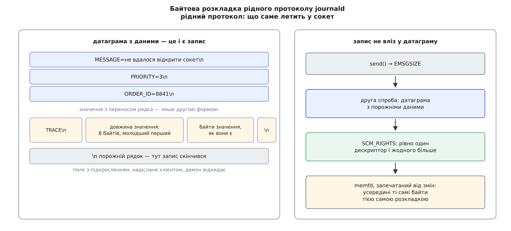

# 📋 Контракт journald: сокети, байти запису, каталог полів, важелі

Це повний опис того, як із `systemd-journald` розмовляють ззовні: куди надсилати, як розкласти запис у байти, які поля бувають і хто має право їх ставити, за якими межами демон мовчки викине запис, і що саме міняють параметри `journald.conf` та формати виводу `journalctl`. Потрібне тому, хто пише відправника чи читача журналу без бібліотеки, а також тоді, коли запис не з’явився й треба знати, на якому з правил він спіткнувся.

## Куди надсилати

| адреса | тип | хто пише | `_TRANSPORT` |
|---|---|---|---|
| `/run/systemd/journal/socket` | AF_UNIX, `SOCK_DGRAM` | рідний протокол: `sd_journal_send()` і все, що складає байти самотужки | `journal` |
| `/run/systemd/journal/dev-log`, на нього вказує символьне посилання `/dev/log` | AF_UNIX, `SOCK_DGRAM` | `syslog(3)`, `logger`, будь-яка давня програма | `syslog` |
| `/run/systemd/journal/stdout` | AF_UNIX, `SOCK_STREAM` | вивід і потік помилок служб; сокет підставляє сам systemd | `stdout` |
| `/dev/kmsg` | символьний пристрій, демон читає його сам | ядро, якщо `ReadKMsg=yes` | `kernel` |
| `AF_NETLINK`, родина `NETLINK_AUDIT` | сокет netlink, демон приєднується сам | підсистема аудиту, якщо `Audit=yes` | `audit` |
| — | — | сам демон про себе: придушення темпу, ротація, старт | `driver` |

Обидва датаграмні сокети відкриває не демон, а systemd — юнітами `systemd-journald.socket` і `systemd-journald-dev-log.socket` — і передає вже готовими. Наслідок практичний: поки демон перезапускається, надіслане не губиться, воно чекає в черзі сокета. Параметри там такі: права `0666` (писати може будь-хто), `PassCredentials=yes` і `PassSecurity=yes` — саме звідси беруться `_PID`, `_UID`, `_GID` і `_SELINUX_CONTEXT`, — а буфер приймання `ReceiveBuffer=8M`.

Одну адресу легко сплутати з входом: `/run/systemd/journal/syslog` — це **вихід**. У нього journald пересилає копію, коли ввімкнено `ForwardToSyslog=`, а слухає його класична реалізація syslog через юніт `syslog.socket`.

## Байтова розкладка рідного запису

Правил рівно три.

1. Одна датаграма несе один запис. Ніякого заголовка, довжини чи контрольної суми навколо нього немає.
2. Пару «поле=значення», у значенні якої немає переносу рядка, серіалізують як `ІМ’Я=значення` й завершують байтом `\n`.
3. Якщо у значенні є `\n` — або воно взагалі не текст, — обов’язкова друга форма: `ІМ’Я`, байт `\n`, беззнакова 64-бітна довжина little-endian, самі байти, ще один `\n`. Знака рівності в цій формі немає: саме його відсутність до кінця рядка й каже розбирачеві, що далі йде довжина.

Порожній рядок кінчає запис; усе, що йде за ним у тій самій датаграмі, до цього запису вже не належить.

```
4d 45 53 53 41 47 45 3d …     MESSAGE=не вдалося відкрити сокет
0a                            \n
50 52 49 4f 52 49 54 59 3d 33 PRIORITY=3
0a                            \n
54 52 41 43 45                TRACE          ← знака «=» немає
0a                            \n
1f 00 00 00 00 00 00 00       довжина 31, молодший байт першим
…                             31 байт значення, як вони є
0a                            \n
0a                            \n  ← порожній рядок: запис скінчився
```



*Друга форма потрібна лише там, де значення не влазить у рядок; решта запису лишається простим текстом, який видно `strace`.*

Найкоротший коректний відправник обходиться без бібліотеки:

```c
int s = socket(AF_UNIX, SOCK_DGRAM | SOCK_CLOEXEC, 0);
struct sockaddr_un a = { .sun_family = AF_UNIX,
                         .sun_path = "/run/systemd/journal/socket" };
const char *e = "MESSAGE=привіт із голого сокета\n"
                "PRIORITY=6\n"
                "ORDER_ID=8841\n";
sendto(s, e, strlen(e), MSG_NOSIGNAL, (struct sockaddr *) &a, sizeof a);
```

Порожнього рядка наприкінці тут не треба: межу запису вже провела межа датаграми.

Два обмеження на вміст. Ім’я поля з підкресленням на початку демон від клієнта відкидає — такі імена він ставить сам. Значень він не перевіряє взагалі: якщо в `PRIORITY=` покласти слово, воно так і ляже в журнал, і на цьому спіткнеться вже читач.

## Коли запис не влазить

Датаграма більша за буфер сокета відмовляє з `EMSGSIZE`. Тоді ті самі байти кладуть у [безіменний файл у пам’яті](root:sys-unix/memfd-create) — це файловий дескриптор без імені у файловій системі, вміст якого можна необоротно закрити від змін «печатками», — і передають демонові сам дескриптор [службовим повідомленням сокета](root:sys-unix/unix-domain-sockets/api-ancillary-data.md) (там же — точна розкладка `cmsghdr`, `CMSG_SPACE` і `SCM_RIGHTS`).

```c
/* 1. файл у пам’яті з тими самими байтами й тією самою розкладкою */
int fd = memfd_create("journal-entry", MFD_ALLOW_SEALING | MFD_CLOEXEC);
write(fd, buf, len);

/* 2. печатки: не зросте, не вкоротшає, не зміниться, печаток не додати */
fcntl(fd, F_ADD_SEALS,
      F_SEAL_SHRINK | F_SEAL_GROW | F_SEAL_WRITE | F_SEAL_SEAL);

/* 3. датаграма з ПОРОЖНІМИ даними й одним дескриптором у службовій частині */
union { struct cmsghdr h; char b[CMSG_SPACE(sizeof(int))]; } c = {};
struct msghdr mh = { .msg_iov = NULL, .msg_iovlen = 0,
                     .msg_control = c.b, .msg_controllen = sizeof c.b };
struct cmsghdr *cm = CMSG_FIRSTHDR(&mh);
cm->cmsg_level = SOL_SOCKET;
cm->cmsg_type  = SCM_RIGHTS;
cm->cmsg_len   = CMSG_LEN(sizeof fd);
memcpy(CMSG_DATA(cm), &fd, sizeof fd);
sendmsg(s, &mh, MSG_NOSIGNAL);
```

Специфікація вимагає, щоб memfd був **повністю запечатаний**, і це не церемонія: демон читає файл уже після надсилання, тож без печаток відправник міг би підмінити вміст під час читання. Які саме печатки що забороняють — [окремий опис](root:sys-unix/memfd-create/api-memfd-and-seals.md).

Дозволені рівно два різновиди датаграми: з даними й без дескрипторів або без даних і з рівно одним дескриптором. Решту поєднань — і дані, і дескриптор; ні того, ні того; більш ніж один дескриптор — демон мовчки ігнорує.

## Потік виводу: сім рядків заголовка

З’єднавшись із `/run/systemd/journal/stdout`, клієнт спершу надсилає сім рядків налаштування, кожен завершений `\n`, і лише потім — самі повідомлення.

| № | рядок | значення |
|---|---|---|
| 1 | ідентифікатор | ляже в `SYSLOG_IDENTIFIER`; порожній рядок — без нього |
| 2 | ім’я юніта | `_SYSTEMD_UNIT` для записів про чужу службу; приймається лише від root |
| 3 | пріоритет | десяткове число «засіб · 8 + важливість», як у syslog |
| 4 | `1` або `0` | чи читати на початку рядка префікс на кшталт `<3>` і брати важливість звідти |
| 5 | `1` або `0` | пересилати в syslog |
| 6 | `1` або `0` | пересилати в буфер ядра |
| 7 | `1` або `0` | пересилати на консоль |

Далі кожен рядок стає окремим записом, а все з’єднання дістає спільний `_STREAM_ID`. Чим рядок закінчився, видно з `_LINE_BREAK`: для звичайного переведення рядка поле не ставлять узагалі, а решта випадків — `nul` (байт `\0`), `line-max` (рядок довший за `LineMax=` і його розрізали), `eof` (з’єднання закрилося на півслові), `pid-change` (у тому самому потоці заговорив інший процес).

## Каталог полів

**Ставить відправник.** Жодне з цих полів не перевіряють — це самоопис.

| поле | значення |
|---|---|
| `MESSAGE` | текст для людини; єдине, що `journalctl` показує без додаткових ключів |
| `MESSAGE_ID` | 128-бітний ідентифікатор різновиду події, малими шістнадцятковими без розділювачів |
| `PRIORITY` | `0`…`7`, від `emerg` до `debug` |
| `CODE_FILE`, `CODE_LINE`, `CODE_FUNC` | місце в коді; `sd_journal_send()` проставляє їх сам із макросів компілятора |
| `ERRNO` | значення `errno` десятковим |
| `SYSLOG_FACILITY`, `SYSLOG_IDENTIFIER`, `SYSLOG_PID`, `SYSLOG_TIMESTAMP` | сумісність зі [старим протоколом](root:sys-unix/syslog-protocol), де важливість і засіб упаковано в одне число, а відправник називає себе тегом |
| `SYSLOG_RAW` | початковий рядок syslog цілком, з усім, що демон із нього вийняв |
| `DOCUMENTATION` | посилання зі схемою `http`, `https`, `file`, `man` або `info` |
| `TID` | номер потоку всередині процесу |
| `UNIT`, `USER_UNIT`, `INVOCATION_ID`, `USER_INVOCATION_ID` | юніт і цикл його запуску, коли пишуть **про** юніт, а не **від** нього |

Окрема родина `OBJECT_*` — для випадку, коли одна програма пише про іншу. Досить поставити `OBJECT_PID=`, і решту — `OBJECT_UID`, `OBJECT_GID`, `OBJECT_COMM`, `OBJECT_EXE`, `OBJECT_CMDLINE`, `OBJECT_SYSTEMD_UNIT` — демон дочитає з `/proc` сам, тобто зробить для «об’єкта» те саме, що робить для відправника. Так пише `systemd-coredump`, додаючи ще `COREDUMP_UNIT` і `COREDUMP_USER_UNIT`.

**Ставить демон.** Ім’я починається з підкреслення; надіслане клієнтом відкидають.

| поле | звідки береться |
|---|---|
| `_PID`, `_UID`, `_GID` | облікові дані, які ядро доклало до датаграми — найтвердіше, що є в записі |
| `_COMM`, `_EXE`, `_CMDLINE` | `/proc/<pid>/`, прочитаний уже після приходу датаграми |
| `_CAP_EFFECTIVE` | чинний набір [повноважень](root:sys-unix/capabilities) процесу, шістнадцятковою маскою |
| `_AUDIT_SESSION`, `_AUDIT_LOGINUID` | сеанс аудиту й користувач, з якого сеанс почався |
| `_SYSTEMD_CGROUP` | шлях [контрольної групи](root:sys-unix/cgroups-resource-model) процесу; з нього розібрано все наступне |
| `_SYSTEMD_UNIT`, `_SYSTEMD_SLICE`, `_SYSTEMD_USER_UNIT`, `_SYSTEMD_USER_SLICE`, `_SYSTEMD_SESSION`, `_SYSTEMD_OWNER_UID` | приналежність запису в моделі systemd |
| `_SYSTEMD_INVOCATION_ID` | конкретний цикл запуску юніта — відрізняє два запуски однієї служби |
| `_SELINUX_CONTEXT` | мітка безпеки відправника |
| `_BOOT_ID`, `_MACHINE_ID`, `_HOSTNAME` | увімкнення, машина, ім’я вузла |
| `_TRANSPORT` | одне з `journal`, `syslog`, `stdout`, `kernel`, `audit`, `driver` |
| `_STREAM_ID`, `_LINE_BREAK` | лише для `_TRANSPORT=stdout` |
| `_SOURCE_REALTIME_TIMESTAMP`, `_SOURCE_BOOTTIME_TIMESTAMP` | найраніший достовірний час події в джерела — коли джерело його передало (наприклад, позначкою в рядку syslog) |
| `_NAMESPACE`, `_RUNTIME_SCOPE` | простір імен журналу; `initrd` або `system` |

**Поля ядра** — лише в записів звідти: `_KERNEL_DEVICE` (перед номером пристрою стоїть `b` для блокового, `c` для символьного, `n` для мережевого, `+підсистема:назва` для решти), `_KERNEL_SUBSYSTEM`, `_UDEV_SYSNAME`, `_UDEV_DEVNODE`, `_UDEV_DEVLINK` (може траплятися кілька разів).

**Адресні поля** з двома підкресленнями у файлі не зберігаються — їх додає серіалізатор, коли віддає запис назовні.

| поле | значення |
|---|---|
| `__CURSOR` | непрозорий рядок, що однозначно вказує саме на цей запис |
| `__REALTIME_TIMESTAMP` | настінний час, мікросекунди від початку епохи UTC |
| `__MONOTONIC_TIMESTAMP` | [монотонний час](root:sys-unix/kernel-timekeeping), мікросекунди; має сенс лише в парі з `_BOOT_ID` |
| `__SEQNUM`, `__SEQNUM_ID` | порядковий номер запису й ідентифікатор нумерації, у межах якої номер щось означає |

## Межі

| межа | значення | що буває при перевищенні |
|---|---|---|
| `DATA_SIZE_MAX` | 768 МіБ на одне поле | запис відкинуто цілком |
| `ENTRY_SIZE_MAX` | 770 МіБ на весь запис | те саме |
| `ENTRY_SIZE_UNPRIV_MAX` | 32 МіБ на весь запис від відправника без повноважень | те саме |
| `ENTRY_FIELD_COUNT_MAX` | 1024 поля в записі | те саме |
| `LineMax=` | 48K на рядок у потоці виводу | рядок розрізано, `_LINE_BREAK=line-max` |
| `ReceiveBuffer=` | 8M на сокеті | `EMSGSIZE` на надсиланні, далі шлях через memfd |

> 🔧 **Навіщо це.** Дві різні стелі на розмір запису — не примха. Демон мусить потримати весь запис у пам’яті, поки його розбирає; якби кожен охочий міг надіслати 770 МіБ, кількох таких датаграм вистачило б, щоб вичерпати пам’ять машини самим лише журналюванням. Привілейованому відправникові стеля лишається високою, бо він і так має важчі способи нашкодити — а йому вона справді потрібна: `systemd-coredump` кладе в журнал стек аварії, який буває величезним.

## Формати виводу

| `-o` | що дає |
|---|---|
| `short` (типовий) і родина `short-full`, `short-iso`, `short-iso-precise`, `short-precise`, `short-monotonic`, `short-delta`, `short-unix` | рядок на запис у стилі класичного syslog; різняться лише виглядом позначки часу |
| `with-unit` | як `short-full`, але попереду стоїть ім’я юніта, а не тег syslog |
| `verbose` | усі поля запису як є |
| `export` | потік для перенесення й резервних копій |
| `json` | по одному об’єкту JSON на рядок |
| `json-pretty` | те саме, розкладене на кілька рядків |
| `json-seq` | об’єкт JSON, перед ним байт-роздільник `0x1E`, після нього — переведення рядка |
| `json-sse` | загорнуте у формат Server-Sent Events |
| `cat` | лише `MESSAGE`, без жодних службових даних, навіть без часу |

`--output-fields=` звужує набір полів (діє на `verbose`, `export`, усі різновиди `json` і `cat`), а `-x` доклеює до запису довший опис із каталогу — знайдений за `MESSAGE_ID`.

Формат `export` варто знати окремо, бо він дзеркальний до надсилання: та сама розкладка `ПОЛЕ=значення\n` для тексту й `ПОЛЕ\n` + 64-бітна довжина + байти + `\n` для решти, а межа між записами — порожній рядок. Текстову форму дістає лише те, що є коректним UTF-8 і не містить керівних байтів, окрім табуляції. Різниця з надсиланням одна: на початку кожного запису стоять адресні поля `__CURSOR`, `__REALTIME_TIMESTAMP`, `__MONOTONIC_TIMESTAMP`, `__SEQNUM`. Тому потік `export` розбирається тим самим кодом, що й приймає записи, і його можна перелити в журнал іншої машини без утрат.

У JSON утрати можливі, і про них треба знати наперед. Значення, яке не є придатним текстом, стає масивом чисел `0…255` — по числу на байт. Поле, що трапилося в записі кілька разів, стає масивом значень, а не останнім із них. Надто велике поле серіалізатор може пропустити: ім’я лишиться, значення буде `null`.

## Важелі journald.conf

| параметр | типове значення | що робить |
|---|---|---|
| `Storage=` | `persistent`; значення обирають при збиранні, і чимало збірок лишають `auto` | `volatile` — лише `/run/log/journal`; `persistent` — `/var/log/journal` із відходом у `/run`, поки диск недоступний; `auto` — сталий, якщо каталог `/var/log/journal` уже існує; `none` — не зберігати нічого, лише пересилати |
| `Compress=` | так, поріг 512 байтів | стискати значення полів, більші за поріг |
| `Seal=` | так | дописувати печатки, якщо заведено ключ |
| `SplitMode=` | `uid` | чи заводити окремий файл на кожного користувача |
| `SyncIntervalSec=` | 5 хв | коли скидати на носій; після повідомлення рівня `crit`, `alert` або `emerg` скидання відбувається негайно й безумовно |
| `RateLimitIntervalSec=`, `RateLimitBurst=` | 30 с, 10000 | вікно й межа записів на службу в ньому |
| `SystemMaxUse=`, `SystemKeepFree=` | 10% ФС (не більш як 4G), 15% ФС (не більш як 4G) | стеля для `/var/log/journal` і скільки місця лишити вільним |
| `SystemMaxFileSize=`, `SystemMaxFiles=` | ⅛ від `SystemMaxUse` (не більш як 128M), 100 | коли починати новий файл і скільки файлів тримати |
| `RuntimeMaxUse=` та решта `Runtime*` | ті самі числа | те саме для `/run/log/journal` |
| `MaxFileSec=`, `MaxRetentionSec=` | місяць, `0` (вимкнено) | ротація за віком файлу й викидання записів, старших за строк |
| `ForwardToSyslog=`, `ForwardToKMsg=`, `ForwardToConsole=`, `ForwardToWall=` | ні, ні, ні, так | куди паралельно віддавати копію |
| `MaxLevelStore=`, `MaxLevelSyslog=`, `MaxLevelKMsg=`, `MaxLevelConsole=`, `MaxLevelWall=` | `debug`, `debug`, `notice`, `info`, `emerg` | стеля важливості окремо для кожного напрямку |
| `LineMax=` | 48K | найдовший рядок у потоці виводу |
| `ReadKMsg=`, `Audit=` | так, так | чи вичитувати `/dev/kmsg` і чи вмикати аудит |

Параметри читають із `/etc/systemd/journald.conf` і додатків у `journald.conf.d/`; для іменованого простору імен — з `journald@<ім’я>.conf`. Зміни підхоплює `systemctl restart systemd-journald`, а межі місця перевіряються не одразу, а на найближчій ротації.
