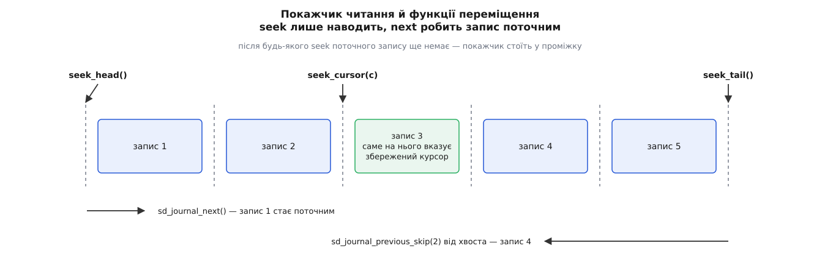
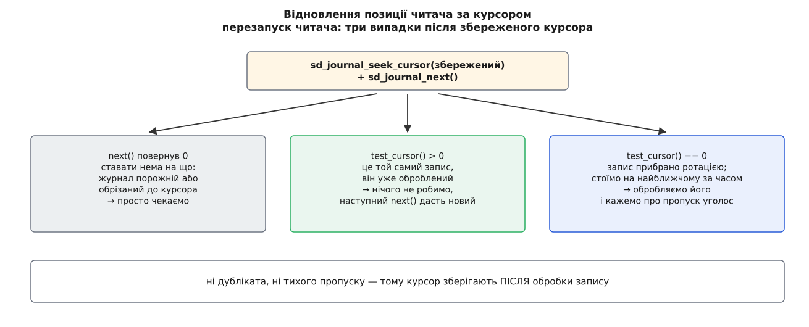

# ⚙️ Читач журналу, що переживає власний перезапуск

Служба вичитує записи з журналу й віддає їх кудись іще — у сховище на сусідній машині, у систему сповіщень, у лічильник помилок. Раз на тиждень її перезапускають: оновлення пакета, перезавантаження, падіння. І саме з перезапуску росте головна вимога: читач має продовжити рівно там, де спинився, — не прогледівши жодного запису й не відправивши жодного двічі.

Конвеєр `journalctl -f | …` цього не вміє, і не через недбалість. Після перезапуску йому нема чим назвати місце, на якому він спинився: у текстовому потоці такої назви просто немає. Лишається сказати або «за останні п'ять хвилин» — і втратити все, якщо пауза була довшою, або «спочатку» — і надіслати ту саму помилку тисячу разів. Бібліотека `sd-journal` таку назву має.

## Три речі, яких немає в текстовому потоці

Це той самий інтерфейс на C, яким користується сам `journalctl`, і дає він рівно три речі.

**Умова добору працює покажчиком, а не переглядом.** `sd_journal_add_match` — не фільтр, накладений на потік записів. Бібліотека знаходить у файлі об'єкт даних для цього значення й іде його власним ланцюгом записів. Умова не здешевлює читання — вона змінює те, що взагалі читається.

**Курсор.** Непрозорий рядок, який називає один конкретний запис і переживає і перехід на новий файл, і злиття кількох журналів. Його можна покласти на диск.

**Дескриптор, що стає готовим, коли журнал змінився.** Поки не відбувається нічого, читач спить у `poll()` і не коштує ані такту.

## Де стоїть покажчик читання

Три різні непорозуміння з цією бібліотекою знімає одна модель. Позиція читача живе **між** записами, а не на них. Усі `sd_journal_seek_*` лише ставлять покажчик у потрібний проміжок і **не роблять жодного запису поточним** — про це в довідці сказано окремо й наголошено. Поточним запис стає лише кроком: `sd_journal_next` чи `sd_journal_previous` повертають, на скільки записів вдалося зрушити, і нуль означає «далі нічого немає».



*Звідси все й випливає: після `seek_tail` крок уперед не дає нічого, бо за останнім записом порожньо, — і йти треба назад.*

Тому початковий показ «останніх ста записів» пишеться так: `sd_journal_seek_tail`, а потім `sd_journal_previous_skip(j, 100)` — один виклик відступає назад одразу на сто записів і повертає, скільки їх насправді знайшлося. Із цієї ж моделі випливає й пастка перезапуску: після `sd_journal_seek_cursor` перший же крок уперед ставить вас **на той самий запис**, який курсор називає, — тобто на вже оброблений.

## Умови: І за замовчуванням, АБО за іменем поля

Окремі умови бібліотека складає за правилом, яке легко проґавити. Умови на **різні** поля з'єднуються через І, умови на **те саме** поле — через АБО. Тобто набір із двох `_SYSTEMD_UNIT=` і чотирьох `PRIORITY=` уже означає «(перший юніт або другий) і (важливість 0…3)» — нормальну кон'юнктивну форму, і писати для неї нічого не треба.

`sd_journal_add_disjunction` потрібен лише там, куди це правило не дістає: коли АБО має з'єднати групи, що згадують **різні** поля — скажімо, «(цей юніт і важливість не нижче за помилку) АБО (будь-який запис із цим `MESSAGE_ID`)». Виклик проводить межу: усе, додане до нього, з'єднується через АБО з усім, доданим після. `sd_journal_add_conjunction` робить те саме поверхом вище — з'єднує через І вже цілі такі групи.

## Програма

```c
/* journal-forward.c — читач журналу, що продовжує з того самого місця.
   cc journal-forward.c $(pkg-config --cflags --libs libsystemd) -o journal-forward */
#define _GNU_SOURCE
#include <errno.h>
#include <fcntl.h>
#include <stdio.h>
#include <stdlib.h>
#include <string.h>
#include <time.h>
#include <unistd.h>
#include <systemd/sd-journal.h>

#define STATE_FILE "/var/lib/journal-forward/cursor"
#define BACKLOG    100u          /* скільки минулих записів показати на першому запуску */

/* ── курсор на диску: спершу в сусідній файл, потім перейменування ────────── */
static int cursor_save(const char *cursor) {
        char tmp[] = STATE_FILE ".XXXXXX";
        int r = 0;

        int fd = mkostemp(tmp, O_CLOEXEC);
        if (fd < 0)
                return -errno;

        size_t len = strlen(cursor);
        if (write(fd, cursor, len) != (ssize_t) len || fsync(fd) < 0)
                r = -errno;
        close(fd);

        if (r == 0 && rename(tmp, STATE_FILE) < 0)
                r = -errno;
        if (r < 0)
                unlink(tmp);
        return r;
}

static char *cursor_load(void) {
        FILE *f = fopen(STATE_FILE, "re");
        if (!f)
                return NULL;

        char *line = NULL;
        size_t n = 0;
        ssize_t got = getline(&line, &n, f);
        fclose(f);

        if (got <= 0) {
                free(line);
                return NULL;
        }
        line[strcspn(line, "\n")] = '\0';
        return line;
}

/* ── добір: (nginx АБО postgresql) І (важливість 0…3) ─────────────────────── */
static int add_matches(sd_journal *j) {
        static const char *const units[] = {
                "_SYSTEMD_UNIT=nginx.service",
                "_SYSTEMD_UNIT=postgresql.service",
        };
        int r;

        for (size_t i = 0; i < sizeof units / sizeof *units; i++) {
                r = sd_journal_add_match(j, units[i], 0);   /* 0 — довжину візьме strlen */
                if (r < 0)
                        return r;
        }
        for (int prio = 0; prio <= 3; prio++) {
                char m[32];
                snprintf(m, sizeof m, "PRIORITY=%d", prio);
                r = sd_journal_add_match(j, m, 0);
                if (r < 0)
                        return r;
        }
        return 0;
}

/* ── значення поля КОПІЮЄМО: вказівник від get_data живе лише до
      наступного звертання до журналу ─────────────────────────────────────── */
static int field_copy(sd_journal *j, const char *name,
                      char *buf, size_t cap, size_t *len) {
        const void *d;
        size_t l, prefix = strlen(name) + 1;    /* бібліотека віддає «ІМ'Я=значення» */

        int r = sd_journal_get_data(j, name, &d, &l);
        if (r < 0)
                return r;                       /* -ENOENT — поля в записі просто немає */
        if (l < prefix)
                return -EBADMSG;

        l -= prefix;
        if (l > cap)
                l = cap;                        /* обрізаємо, а не псуємо пам'ять */
        memcpy(buf, (const char *) d + prefix, l);
        *len = l;
        return 0;
}

static int printable(const char *s, size_t n) {
        for (size_t i = 0; i < n; i++)
                if ((unsigned char) s[i] < 0x20 && s[i] != '\t')
                        return 0;
        return 1;
}

static void handle(sd_journal *j) {
        char unit[64] = "?", msg[8192], when[32] = "невідомо";
        size_t unit_len = 1, msg_len = 0;
        uint64_t usec = 0;

        if (sd_journal_get_realtime_usec(j, &usec) >= 0) {
                time_t t = (time_t) (usec / 1000000);
                struct tm tm;
                if (gmtime_r(&t, &tm))
                        strftime(when, sizeof when, "%Y-%m-%dT%H:%M:%S", &tm);
        }
        field_copy(j, "_SYSTEMD_UNIT", unit, sizeof unit, &unit_len);
        field_copy(j, "MESSAGE", msg, sizeof msg, &msg_len);

        if (printable(msg, msg_len))
                printf("%s.%06u  %.*s  %.*s\n", when, (unsigned) (usec % 1000000),
                       (int) unit_len, unit, (int) msg_len, msg);
        else
                printf("%s.%06u  %.*s  <%zu двійкових байтів>\n", when,
                       (unsigned) (usec % 1000000), (int) unit_len, unit, msg_len);
}

/* ── місце старту. on_entry == 1: покажчик УЖЕ стоїть на записі,
      який належить обробити, — тобто перший next() робити не треба ────────── */
static int position(sd_journal *j, const char *cursor, int *on_entry) {
        int r;

        *on_entry = 0;

        if (!cursor) {                                  /* перший запуск за життя */
                r = sd_journal_seek_tail(j);
                if (r < 0)
                        return r;
                r = sd_journal_previous_skip(j, BACKLOG);
                if (r < 0)
                        return r;
                *on_entry = r > 0;                      /* r — скільки реально відступили */
                return 0;
        }

        r = sd_journal_seek_cursor(j, cursor);
        if (r < 0)
                return r;
        r = sd_journal_next(j);                         /* seek навів, next ставить */
        if (r < 0)
                return r;
        if (r == 0)
                return 0;                               /* ставати нема на що — чекаємо */

        if (sd_journal_test_cursor(j, cursor) > 0)
                return 0;                               /* той самий запис, уже оброблений */

        fprintf(stderr, "збережений запис уже прибрано — можливий пропуск\n");
        *on_entry = 1;                                  /* стоїмо на необробленому */
        return 0;
}

int main(void) {
        sd_journal *j = NULL;
        char *cursor = cursor_load();
        int on_entry = 0, r;

        r = sd_journal_open(&j, SD_JOURNAL_LOCAL_ONLY | SD_JOURNAL_SYSTEM);
        if (r < 0)
                goto fail;

        sd_journal_set_data_threshold(j, 0);    /* інакше довгі значення мовчки обріже */

        r = add_matches(j);
        if (r < 0)
                goto fail;
        r = position(j, cursor, &on_entry);
        if (r < 0)
                goto fail;

        for (;;) {
                if (on_entry)
                        on_entry = 0;                   /* запис уже під пальцем */
                else {
                        r = sd_journal_next(j);
                        if (r < 0)
                                goto fail;
                        if (r == 0) {                   /* кінець — засинаємо до змін */
                                r = sd_journal_wait(j, (uint64_t) -1);
                                if (r < 0)
                                        goto fail;
                                if (r == SD_JOURNAL_INVALIDATE && cursor) {
                                        r = position(j, cursor, &on_entry);
                                        if (r < 0)
                                                goto fail;
                                }
                                continue;
                        }
                }

                handle(j);                              /* тут запис іде споживачеві */

                free(cursor);
                cursor = NULL;
                r = sd_journal_get_cursor(j, &cursor);  /* і лише ПІСЛЯ цього — курсор */
                if (r < 0)
                        goto fail;
                r = cursor_save(cursor);
                if (r < 0)
                        fprintf(stderr, "курсор не збережено: %s\n", strerror(-r));
        }

fail:
        fprintf(stderr, "журнал: %s\n", strerror(-r));
        sd_journal_close(j);
        free(cursor);
        return 1;
}
```

Уся бібліотека тримається однієї домовленості: успіх — нуль або додатне число, невдача — від'ємний код помилки з `errno`, тому `strerror(-r)` тут не описка.

## Чому це не дає ні дублікатів, ні тихих пропусків

Функція `position` розбирає три випадки, і кожен із них справді трапляється.



*`sd_journal_test_cursor` існує саме для середньої гілки: курсорні рядки не порівнюють як текст, бо той самий запис може мати кілька різних курсорів.*

Ключова тут середня гілка. Крок уперед після `seek_cursor` ставить нас на запис, який курсор називає, — а він уже оброблений минулого разу. Ми його не чіпаємо: наступний крок циклу дасть перший необроблений. Права гілка — коли того запису вже немає, бо прибирання знесло цілий файл. Бібліотека тоді ставить покажчик на найближчий за часом наступний, і `test_cursor` повертає нуль. Цей запис обробити треба, а про дірку — сказати вголос: пропуск справжній, але видимий, і зробив його не читач.

Лишається питання порядку, і воно важить більше за весь інший код. Курсор зберігають **після** того, як запис пішов споживачеві, а не до. Тоді падіння між цими двома діями означає, що запис повториться, — гарантія «щонайменше раз» ([а їх усього три, і вибір між ними — окрема розмова](root:sf-distributed/delivery-guarantees): щонайбільше раз, щонайменше раз, фактично раз). Зворотний порядок дав би «щонайбільше раз» — тобто тихо втрачений запис саме тоді, коли він потрібен. Із двох бід вибирають повтор, а споживача роблять таким, щоб повтор його не псував.

## Дві різні новини від журналу

`sd_journal_wait` повертає не «щось сталося», а що саме сталося, і різниця тут не церемоніальна.

`SD_JOURNAL_APPEND` — до кінця журналу дописано нові записи. Робити нічого не треба: черговий крок уперед їх побачить.

`SD_JOURNAL_INVALIDATE` — змінився **набір файлів**, за якими читач стежить. Файл додали або прибрали: сталася ротація, з'явився журнал іще одного користувача, привезли журнал із сусідньої машини. Небезпека тонка: читач бачить не файл, а злиття всіх файлів за часом, тож у щойно доданому файлі можуть виявитися записи, які за часом стоять **перед** нашою позицією. Крок уперед їх не покаже ніколи. Тому надійна відповідь на `INVALIDATE` — стати за збереженим курсором наново, тобто в те місце, до якого точно все оброблено; у програмі це та сама `position`.

Зауважте, чого в цьому переліку немає: перехід на новий файл журналу окремої обробки не потребує взагалі. Курсор називає запис, а не зміщення у файлі, і бібліотека сама тримає злитий погляд — саме тому читати файли журналу власноруч не варто навіть із доброї нагоди.

Коли читач має жити всередині наявного циклу подій, замість `sd_journal_wait` беруть дескриптор — [звичайний спосіб чекати на багато джерел одразу](root:sys-unix/select-poll-epoll):

```c
int      fd     = sd_journal_get_fd(j);      /* усередині — inotify на теки журналу */
int      events = sd_journal_get_events(j);  /* що саме чекати в poll() */
uint64_t deadline;
sd_journal_get_timeout(j, &deadline);        /* межа за монотонним годинником */

/* … poll(), і після КОЖНОГО пробудження: */
int news = sd_journal_process(j);            /* NOP / APPEND / INVALIDATE */
```

Дескриптор — це [спостереження за змінами у файловій системі](root:sys-unix/inotify-and-fanotify), і сама можливість дешево спати впирається в дрібницю: демон пише записи через відображення файлу в пам'ять, а таких записів inotify не помічає. Тому після кожної порції він смикає файл `ftruncate` до його ж поточного розміру — рівно щоб подія народилася. А `sd_journal_get_timeout` існує тому, що inotify працює не на кожній файловій системі: там бібліотека мусить час від часу прокидатися сама.

## Ціна й пастки

Очікування безкоштовне: поки журнал мовчить, процес спить на дескрипторі. Один запис коштує проходу по стільки ланцюгах, скільки в доборі різних полів, плюс розпакування **лише тих** значень, які ви попросили, — поля, про які ви не питали, не коштують нічого. Найдорожче в цьому циклі — не журнал, а запис курсора: файл і перейменування на кожен запис. Тому в реальному постачальнику курсор зберігають пачками, раз на сотню записів або раз на секунду, — і чесно розуміють, що вікно можливого повтору виросло рівно до розміру пачки.

**Права мовчать.** Файли журналу належать `root:systemd-journal` з правами `0640`, а на теку `/var/log/journal/<machine-id>` додано [списки доступу](root:sys-unix/acl-and-xattr) для груп `adm` і `wheel` — це прописано в типових правилах `tmpfiles.d` самого systemd. Пастка в тому, що `sd_journal_open` **мовчки пропускає** файли, які не вдалося відкрити: недостатньо прав — і ви отримуєте не помилку, а порожній журнал і вічний нуль від кроку вперед. Для служби це один рядок у юніті — `SupplementaryGroups=systemd-journal`.

**Значення бувають двійковими.** У полі journald тримає байти, а не рядок: там законно трапляються переноси, а в теорії й нульовий байт. Тому `sd_journal_get_data` віддає вказівник і довжину, а `%s` на цьому вказівнику — помилка на порожньому місці. Сам `journalctl -o json` виходить із цього так: значення, яке не є текстом, він друкує масивом чисел-байтів.

**Вказівник живе недовго.** Пам'ять, на яку показує `get_data`, — [ділянка файлу, відображена в адресний простір лише для читання](root:sys-unix/mmap-model), і чинна вона тільки до наступного звертання до журналу. Два `get_data` поспіль — і перший вказівник уже несправжній. Саме тому в програмі значення копіюються одразу.

**Довгі значення обрізає.** Типова межа — 64 КіБ на поле: бібліотека виходить із того, що клієнтові цікавий початок, і не розпаковує решту. Для читача, який пересилає записи далі, це тиха втрата даних, тож `sd_journal_set_data_threshold(j, 0)` тут не тонке налаштування, а вимога.

**Настінний час не впорядковує.** `sd_journal_get_realtime_usec` — годинник, який може стрибнути назад. Друкувати його людині — правильно, будувати на ньому порядок чи межі — ні; для цього є курсор.

**Збереження курсора має бути неподільним.** Обірваний на середині запис у файл стану дає зіпсований курсор, і наступний `seek_cursor` поверне `-EINVAL`. Звідси запис у тимчасовий файл і перейменування; строго кажучи, після перейменування варто скинути на носій ще й каталог — [запис у файл і запис на диск досі різні події](root:sys-unix/page-cache-durability).

**Лінкування.** Заголовок `<systemd/sd-journal.h>`, бібліотека `libsystemd`, прапорці — через `pkg-config --cflags --libs libsystemd`; пакет зветься `libsystemd-dev` у Debian і `systemd-devel` у Fedora. Програми, які мають працювати й там, де systemd немає, бібліотеку не лінкують, а підвантажують на ходу — і тихо вимикають підтримку журналу, коли її не знайшли.
