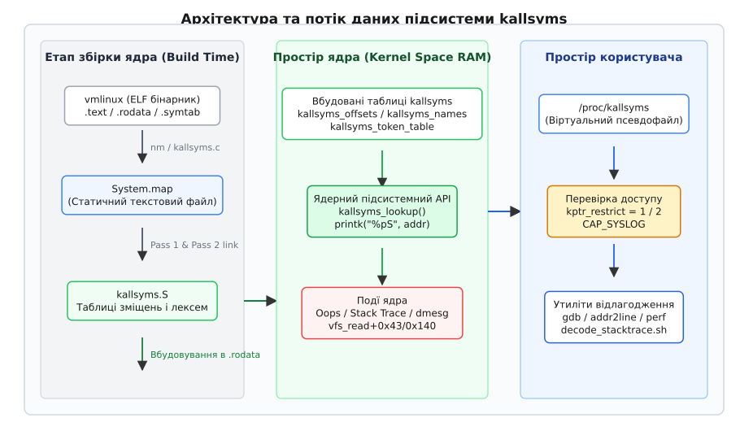
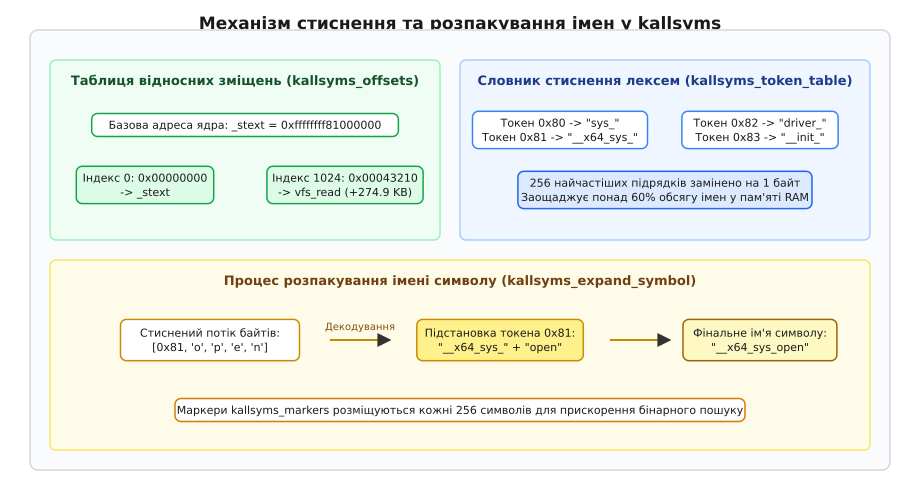

# kallsyms: імена символів усередині ядра, System.map і %pS

<preknowlist>
- [Ядро й простір користувача](topic:sys-unix/kernel-and-userspace) — границя виконання, кільця привілеїв та віртуальний адресний простір ядра.
- [Монолітне ядро з модулями](topic:sys-unix/monolithic-with-modules) — статичне ядро vmlinux та завантажувані модулі .ko.
- [Журнал ядра: printk](topic:sys-unix/kernel-log-printk) — кільцевий буфер системних повідомлень dmesg та кольорові рівні логування.
- [Oops і паніка ядра](topic:sys-unix/kernel-oops-panic) — дамп регістрів, трасування стека (Call Trace) та обробка аварійних ситуацій.
</preknowlist>

Під час спрацювання апаратного збою, розіменування нульового вказівника чи критичної помилки у режимі ядра центральний процесор фіксує стан регістрів та лічильника інструкцій у вигляді сирих 64-бітних числових адрес пам'яті (наприклад, `0xffffffff81234567`). Для апаратури числовий вказівник (англ. *pointer*, від англ. *pointer* — вказівник, покажчик) — це єдиний спосіб адресації комірок оперативної пам'яті, проте для системного інженера це число не несе жодної семантики. Без таблиці, яка пов'язує фізичні або віртуальні адреси з ідентифікаторами вихідного коду, розбір аварійного дампу вимагає виснажливого ручного аналізу ассемблерного лістингу зкомпільованого бінарного файлу.

У звичайних програмах простору користувача таблиця символів (від грец. *σύμβολον* — знак, прикмета) зберігається у секціях `.symtab` та `.strtab` файлу ELF у вигляді масиву структур `Elf64_Sym`. Для економії обсягу дискового простору та оперативної пам'яті бінарні файли користувацького простору часто піддаються процедурі очищення (strip), а резолвінг адрес під час відлагодження покладається на зовнішні файли символів (наприклад, `gdb` або сервери `debuginfod`). У ядрі операційної системи такий підхід неприйнятний: коли ядро зазнає краху (Oops або Kernel Panic), зовнішній відлагоджувач може бути недоступним, а файлова система — пошкодженою або ще не змонтованою. Ядру необхідний власний, вбудований та стійкий до аварій механізм перетворення адрес на імена функцій під час виконання.

Цю задачу в сучасній операційній системі Linux розв'язує підсистема **kallsyms** (від англ. *kernel all symbols* — усі символи ядра) у поєднанні зі статичними картами `System.map`, форматерами системного журналу `%pS` та засобами регулювання доступу `kptr_restrict`.

---

## Від 64-бітної адреси пам'яті до імені функції

Віртуальний адресний простір ядра Linux на 64-бітних архітектурах (x86_64, ARM64) займає канонічну верхню половину пам'яті (від `0xffff880000000000` до `0xffffffffffffffff`). Простір розділено на спеціалізовані зони: канонічне пряме відображення фізичної пам'яті (direct mapping), діапазон `vmalloc`, пам'ять ядерних модулів (`MODULES_VADDR`) та область виконуваного коду ядра `.text`. Коли програма користувацького простору здійснює системний виклик `read()`, виконання переходить через вентиль переривання або інструкцію `SYSCALL` у точку входу ядра. Усі функції ядра, глобальні структури та завантажені драйвери розміщуються у цій верхній області адрес.

Коли стається аварійна зупинка або помилка адресації, процесор зберігає у стек адресу інструкції (на регістрі `RIP` у x86_64 або `PC` в ARM64), на якій виник збій. Обробник паніки ядра зчитує вказівники кадрів стека за допомогою розпакувальника стека (ORC unwinder або Frame Pointer unwinder) і формує трасування стека (Call Trace). Якщо ядро позбавлене засобів трансляції адрес, у системний журнал потрапляє лише числовий дамп:

```
Call Trace:
 [<ffffffff81234043>]
 [<ffffffff81234120>]
 [<ffffffff81002080>]
```

Для того щоб перетворити число `0xffffffff81234043` на зрозумілу конструкцію `vfs_read+0x43/0x140`, система повинна виконати дві послідовні математичні та пошукові операції:
1. Знайти символ, інтервал адрес якого `[start_addr, start_addr + size)` охоплює дане число.
2. Обчислити зміщення в байтах від початку функції: `offset = target_addr - start_addr`.

Реалізація цієї трансляції пройшла шлях від статичних зовнішніх файлів до складних стиснених структур даних у пам'яті RAM, докладніше про що викладено в [історії еволюції kallsyms](topic:sys-unix/kallsyms-and-system-map/hist-kallsyms-evolution.md).

---

## Статична таблиця символів: System.map

Файл `System.map` — це статичний текстовий файл, який генерується під час збірки ядра Linux. Утиліта `nm` (з пакету GNU Binutils) або скрипт `scripts/mksysmap` аналізує зкомпільований, але ще не очищений бінарний файл ядра `vmlinux` і витягує з нього адреси всіх глобальних та локальних символів.

### Скрипт компонування vmlinux.lds.S та якірні символи

Під час компонування об'єктних файлів ядра компоновщик `ld` користується скриптом компонування `arch/x86/kernel/vmlinux.lds.S`. Цей скрипт визначає точний порядок розміщення секцій у пам'яті та створює спеціальні якірні символи, які позначають межі структур і виводяться у `System.map`:

- `_stext` та `_etext`: позначають точний початок і кінець виконуваної секції коду `.text`.
- `__start_rodata` та `__end_rodata`: позначають межі секції даних лише для читання `.rodata`.
- `_sdata` та `_edata`: межі секції ініціалізованих глобальних даних `.data`.
- `__bss_start` та `_ebss` (або `_end`): межі секції неініціалізованих даних `.bss`.

### Формат та класифікація символів у System.map

Кожен рядок файлу `System.map` містить три колонки, розділені пробілами:

```
ffffffff81000000 T _stext
ffffffff81000100 t startup_64
ffffffff81123400 T vfs_read
ffffffff82401000 D sys_call_table
ffffffff82c05120 B jiffies
```

1. **Адреса символу:** 64-бітна шістнадцяткова віртуальна адреса, за якою символ розміщений у компоновці ядра `vmlinux`.
2. **Однобуквений код типу символу:** Літера визначає секцію ELF-файлу та рівень видимості символу.
3. **Ім'я символу:** Ідентифікатор функції або змінної у мові C.

Коди типів символів поділяються за правилом регістру: **велика літера** означає глобальний (експортований) символ, **мала літера** — локальний (з оголошенням `static`) символ:

- **`T` / `t`** (*Text*): Код функцій, розміщений у виконуваній секції `.text`.
- **`D` / `d`** (*Data*): Ініціалізовані глобальні та статичні змінні у секції `.data`.
- **`B` / `b`** (*BSS*): Неініціалізовані змінні у секції `.bss` (при старті заповнюються нулями).
- **`R` / `r`** (*Read-only*): Дані лише для читання у секції `.rodata` (рядкові літерали, таблиці констант).
- **`A`** (*Absolute*): Абсолютні значення (константи, які не змінюються при зміщенні секцій).
- **`W` / `w`** (*Weak*): Слабі символи, які можуть бути перекриті під час лінкування.

### Обмеження System.map у сучасних системах

Історично `System.map` розміщувався у каталозі `/boot/System.map-$(uname -r)` і використовувався системним демоном `klogd` для підстановки імен у логи. Однак у сучасній архітектурі Linux `System.map` не може слугувати основним джерелом спостережуваності з двох причин:

1. **Відсутність символів завантажуваних модулів (`.ko`):** Файл `System.map` створюється на етапі компіляції базового ядра. Коли користувач завантажує модуль драйвера (наприклад, `ext4.ko` або `nvidia.ko`), ядро виділяє під нього пам'ять динамічно у діапазоні `MODULES_VADDR`. Адреси функцій модуля відсутні у статичному `System.map`.
2. **Конфлікт із KASLR:** Рандомізація адресного простору ядра KASLR (англ. *Kernel Address Space Layout Randomization*) при кожному завантаженні додає випадковий зсув до базової адреси ядра. Адреси у `System.map` залишаються статичними (фіксованими при збірці), тоді як виконання в RAM відбувається зі зсувом.

Через це `System.map` сьогодні використовується переважно автономними інструментами аналізу дампів пам'яті (`crash`, `gdb`, `drgn`) для первинного визначення точок входу нерандомізованого образу.

---

## Динамічна система kallsyms: Таблиці всередині ядра

Конфігураційна опція ядра `CONFIG_KALLSYMS=y` вбудовує таблицю символів безпосередньо у простір пам'яті ядра під час збірки. Це робить ядро повністю автономним: воно здатно виконувати трансляцію адрес у логи незалежно від наявності файлів на диску чи стану користувацького простору.


*Архітектура kallsyms: генерація таблиць при збірці vmlinux та її використання у ядрі.*

### Двопрохідна збірка ядра (Two-Pass Linkage)

Процес вбудовування таблиці символів у бінарний файл `vmlinux` створює циркулярну залежність: щоб створити таблицю адрес функцій ядра, потрібно вже мати зібране ядро, але додавання самої таблиці всередину ядра змінює адреси всіх функцій, що йдуть за нею.

Система збірки ядра `kbuild` розв'язує цю проблему за допомогою двопрохідного (іноді трипрохідного) компонування через утиліту `scripts/kallsyms.c`:

1. **Перший прохід (Pass 1):** Компоновщик `ld` створює тимчасовий ELF-файл `vmlinux`. Утиліта `scripts/kallsyms` аналізує таблицю символів цього бінарника і генерує ассемблерний файл `kallsyms.S`, який містить стиснені масиви адрес та імен.
2. **Другий прохід (Pass 2):** Ассемблерний файл `kallsyms.S` компілюється в об'єктний файл `kallsyms.o` і повторно лінкується разом з усім кодом ядра у фінальний `vmlinux`.
3. **Третій прохід (Pass 3, за потреби):** Якщо додавання секцій `kallsyms` у другому проході змінило розмір ядра і призвело до зміщення адрес інструкцій, запуск повторюється до досягнення повної ідентичності адрес між проходами.

### Структури даних kallsyms у секції `.rodata`

Вбудована підсистема kallsyms складається з кількох паралельних масивів, розміщених у секції даних лише для читання:

```c
/* Концептуальне представлення масивів у kallsyms.S */
extern const unsigned long kallsyms_addresses[] __attribute__((weak));
extern const int kallsyms_offsets[] __attribute__((weak));
extern const unsigned long kallsyms_num_syms;
extern const u8 kallsyms_names[];
extern const u8 kallsyms_token_table[];
extern const u16 kallsyms_token_index[];
extern const unsigned long kallsyms_markers[];
```

#### 1. Відносні зміщення `kallsyms_offsets` замість 64-бітних адрес
За замовчуванням при включенні `CONFIG_KALLSYMS_BASE_RELATIVE=y` ядро не зберігає абсолютні 64-бітні адреси. Натомість воно зберігає відносну базову адресу `kallsyms_relative_base` (координату `_stext`) та 32-бітні знакові зміщення від неї у масиві `kallsyms_offsets[]`.

Це розв'язує дві задачі:
- **Скорочення обсягу пам'яті:** Кожен елемент масиву адрес займає 4 байти замість 8 байтів, заощаджуючи близько 50% обсягу таблиці адрес.
- **Сумісність із KASLR:** При завантаженні ядра зі зсувом KASLR підсистема додає зсув лише до `kallsyms_relative_base`, а масив відносних зміщень лишається незмінним.

#### 2. Префіксне стиснення імен (Token Compression)
Збереження десятків тисяч рядкових імен у сирому вигляді вимагало б понад 2 МБ RAM. Утиліта `kallsyms.c` застосовує алгоритм частевого префіксного стиснення (англ. *compression*, від лат. *compressio* — стиснення):
- Усі імена функцій аналізуються, і визначаються 256 найчастіших підрядків (лексем/токенів), таких як `"sys_"`, `"__x64_sys_"`, `"driver_"`, `"init_"`.
- Створюється словник `kallsyms_token_table` з 256 елементів та масив зміщень `kallsyms_token_index`.
- У масиві імен `kallsyms_names` кожен найчастіший підрядок замінюється єдиним байтом-токеном (значення від `0x00` до `0xFF`).


*Схема стиснення імен лексем та відносного адресування в kallsyms_offsets.*

#### 3. Маркери індексації `kallsyms_markers`
Оскільки імена у `kallsyms_names` мають змінну довжину через стиснення, для знаходження N-го символу довелося б послідовно декодувати всі попередні N-1 імен. Щоб уникнути повільного лінійного пошуку `O(N)`, ядро створює масив `kallsyms_markers`, який зберігає точні байтові зміщення у масиві `kallsyms_names` через кожні 256 символів. Це дозволяє виконувати швидкий бінарний пошук `O(log N)`.

---

## Інтерфейс простору користувача `/proc/kallsyms` та безпека

Для інспектування символів з простору користувача ядро надає віртуальний псевдофайл `/proc/kallsyms`. На відміну від статичного `System.map`, вміст `/proc/kallsyms` генерується на льоту за допомогою шару `seq_file` і включає:
1. Усі статичні та глобальні символи ядра `vmlinux`.
2. Діючі адреси функцій та змінних усіх динамічно завантажених модулів ядра (`.ko`). Символи модулів містять квадратні дужки з назвою модуля наприкінці рядка:

```
ffffffffc0201000 t ext4_mkdir [ext4]
ffffffffc0201500 T ext4_read_node [ext4]
```

### Механіка роботи seq_file при читанні /proc/kallsyms

Коли інструмент моніторингу (`cat`, `bpftrace` або `perf`) відкриває `/proc/kallsyms` і викликає системний виклик `read()`, шар VFS передає управління ітераторам `seq_file`:
- `s_start()`: знаходить перший символ у масивах `kallsyms` або в списку модулів `modules`.
- `s_next()`: переходить до наступного індексу символу.
- `s_show()`: розпаковує ім'я через `kallsyms_expand_symbol()`, перевіряє права доступу `kptr_restrict` і форматує рядок у буфер користувача.
- `s_stop()`: вивільняє тимчасові ресурси обходу.

### Вплив конфігурацій `CONFIG_KALLSYMS_ALL`

За замовчуванням (`CONFIG_KALLSYMS=y`) ядро включає до таблиці лише функції (виконуваний код із секції `.text`). Якщо ядро зібране з прапором `CONFIG_KALLSYMS_ALL=y`, таблиця доповнюється всіма даними: глобальними та статичними змінними, структури даних та змінними для кожного процесора (per-CPU). Це збільшує розмір ядра приблизно на 1.5–3 МБ, але дає повну картини при налагодженні.

### Рубільник безпеки sysctl `kernel.kptr_restrict`

Оскільки знання точних адрес функцій ядра у пам'яті дозволяє зловмисникам конструювати експлойти підвищення привілеїв (атаки ROP та обхід KASLR), Linux надає механізм маскування адрес через sysctl `/proc/sys/kernel/kptr_restrict`:

```bash
cat /proc/sys/kernel/kptr_restrict
```

- **`0` (Без обмежень):** Усі користувачі бачать дійсні 64-бітні адреси пам'яті ядра у `/proc/kallsyms`.
- **`1` (За замовчуванням):** Адреси приховуються (виводяться як нулі `0000000000000000`) для процесів без привілейованих прав `CAP_SYSLOG` або `CAP_SYS_ADMIN`. Дійсні адреси бачить лише суперкористувач `root`.
- **`2` (Максимальний захист):** Адреси маскуються нулями для **всіх** процесів користувацького простору без винятку, включаючи `root`.

Приклад виводу `/proc/kallsyms` для ззвичайного користувача при `kptr_restrict = 1`:

```
0000000000000000 T sys_open
0000000000000000 T vfs_read
0000000000000000 t ext4_mkdir [ext4]
```

---

## Специфікатори форматування printk: %pS, %ps та %pB

Під час запису повідомлень у системний журнал через `printk()` або `pr_info()` ядро підтримує розширений набір специфікаторів формату вказівника `%p`. Замість виводу сирого числа форматер `vsprintf.c` звертається до підсистеми kallsyms і автоматично перетворює адресу на текстовий рядок.

### Внутрішня послідовність викликів при друку %pS

Коли в коді викликається `printk("Called from %pS\n", ptr)`, ланцюжок виконання виглядає так:

```
printk()
  → vprintk_store()
    → vsprintf()
      → pointer() [розпізнає модифікатор 'S']
        → symbol_string()
          → kallsyms_lookup(addr, &size, &offset, &modname, namebuf)
            → seq_buf_printf("name+0x%lx/0x%lx [mod]", ...)
```

### Основні специфікатори символів

- **`%pS` (Symbol with Offset):** Виводить ім'я символу, зміщення у байтах від початку функції, загальний розмір функції та ім'я модуля.
  - *Формат виводу:* `vfs_read+0x43/0x140` або `ext4_mkdir+0x12/0x80 [ext4]`
  - *Приклад:* `pr_info("Caller: %pS\n", __builtin_return_address(0));`
- **`%ps` (Symbol Short):** Виводить лише ім'я символу без зміщення, розміру та імені модуля.
  - *Формат виводу:* `vfs_read`
- **`%pB` (Backtrace Symbol):** Спеціальний специфікатор для друку кадрів стека викликів. Він віднімає 1 байт від переданої адреси перед розшуком. Це необхідно тому, що адреса повернення у стеку вказує на інструкцію, наступну за `CALL`, а помилка могла статися на самій інструкції `CALL`. Зсув на -1 гарантує знаходження правильної функції.
- **`%pSR` (Symbol Raw):** Виводить ім'я символу без обробки випрямлення та символів модулів.

Повний перелік системних викликів, функцій та прапорців форматування викладено в [довіднику API kallsyms та специфікаторів %pS](topic:sys-unix/kallsyms-and-system-map/api-kallsyms-kernel-surface.md).

---

## Програмний API ядра та зсув безпеки у версії Linux 5.7

Усередині ядра розробники модулів та підсистем спостережуваності можуть шукати адреси та імена програмно за допомогою функцій header-файлу `<linux/kallsyms.h>`.

### Функція `kallsyms_lookup()`

Перетворює адресу на ім'я символу та заповнює атрибути:

```c
const char *kallsyms_lookup(unsigned long addr,
                            unsigned long *symbolsize,
                            unsigned long *offset,
                            char **modname,
                            char *namebuf);
```

### Деекспорт `kallsyms_lookup_name()` у Linux 5.7 (2020)

До версії ядра Linux 5.7 функція `kallsyms_lookup_name()` була експортована для всіх модулів через `EXPORT_SYMBOL_GPL`:

```c
unsigned long addr = kallsyms_lookup_name("sys_call_table");
```

Це дозволяло будь-якому завантажуваному модулю ядра дізнатися адресу будь-якої неекспортованої функції або внутрішньої таблиці ядра. Модулі зловмисників (руткіти) масово використовували цю функцію для знаходження `sys_call_table` та підміни вказівників системних викликів (хукінгу).

У травні 2020 року у версії Linux 5.7 розробники ядра видалили `EXPORT_SYMBOL_GPL(kallsyms_lookup_name)`. Починаючи з цієї версії, зовнішні модулі більше не можуть викликати `kallsyms_lookup_name()` напряму під час лінкування.

Сучасні легітимні підсистеми (наприклад, `kprobes` або `ftrace`) розв'язують цю задачу через власні зареєстровані обробники. Практичну реалізацію пошуку неекспортованих символів у сучасних ядрах наведено в [проєкті реалізації аналізатора символів kallsyms](topic:sys-unix/kallsyms-and-system-map/proj-kallsyms-symbol-resolver.md).

---

## Декодування зміщень інструкцій при аваріях (Oops Decoding)

Коли ядро зазнає збою, у `dmesg` виводиться аварійний дамп Oops. Найважливішою частиною цього дампу є Call Trace.

Приклад виводу кадру стека:

```
Call Trace:
 <TASK>
 page_fault_oops+0x171/0x4e0
 do_user_addr_fault+0x63/0x6b0
 exc_page_fault+0x77/0x170
 asm_exc_page_fault+0x26/0x30
 RIP: 0010:vfs_read+0x43/0x140
 </TASK>
```

Аналіз рядка `vfs_read+0x43/0x140`:
- **`vfs_read`**: Назва функції, де сталася помилка.
- **`0x43`**: Зміщення в байтах (67 байтів) від початку функції `vfs_read` до точної машинної інструкції, яка викликала збій.
- **`0x140`**: Загальний розмір функції `vfs_read` у байтах (320 байтів).

### Обчислення точного рядка коду мови C

Знаючи зміщення `0x43`, розробник може знайти точний рядок у вихідних файлах мови C за допомогою відлагоджувального бінарника `vmlinux` (зкомпільованого з `CONFIG_DEBUG_INFO=y`).

#### Метод 1: Математичний розрахунок + addr2line

1. Знаходимо базову нерандомізовану адресу функції `vfs_read` у вихідному `vmlinux` за допомогою `nm`:
   ```bash
   nm vmlinux | grep "T vfs_read"
   # Вивід: ffffffff81234000 T vfs_read
   ```
2. Обчислюємо точну адресу інструкції шляхом додавання зміщення:

```
Адреса = 0xffffffff81234000 + 0x43
       = 0xffffffff81234043      [додавання зміщення 0x43 до базової адреси vfs_read]
```

3. Викликаємо `addr2line`:
   ```bash
   addr2line -e vmlinux 0xffffffff81234043
   # Вивід: fs/read_write.c:450
   ```

#### Метод 2: Автоматизовані скрипти ядра

У дереві джерел ядра Linux наявні утиліти для автоматичного декодування:

```bash
# Декодування одного символу зі зміщенням
./scripts/faddr2line vmlinux vfs_read+0x43/0x140

# Автоматичне декодування всього логу dmesg
./scripts/decode_stacktrace.sh vmlinux < oops.log
```

Скрипт `decode_stacktrace.sh` самостійно розбирає адреси, враховує зміщення модулів та виводить точні назви файлів C і номери рядків для кожного кадру стека.

---

> 🔧 **Навіщо це.**
> Знання підсистеми `kallsyms` та вміння декодувати зміщення `%pS` є фундаментальною навичкою інженера системного рівня. При аналізі аварійних збоїв серверів у продакшні (Kernel Panic, Oops), пост-мортем аналізі дампів пам'яті через `crash`, створенні eBPF-програм спостережуваності та розробці драйверів `kallsyms` перетворює сирі 64-бітні числа пам'яті RAM на точну карту виконання вихідного коду операційної системи.

---

## Висновки

1. **System.map** — це статичний текстовий файл збірки ядра, який описує базовий образ `vmlinux`, але безпорадний перед завантажуваними модулями `.ko` та зсувами KASLR.
2. **kallsyms** — це вбудована у `.rodata` автономна динамічна система символів ядра, яка використовує відносні 32-бітні зміщення та 8-бітове префіксне стиснення імен для збереження обсягу RAM.
3. **`/proc/kallsyms`** надає інтерфейс до символів ядра та модулів у просторі користувача, захищений рубільником sysctl `kernel.kptr_restrict` для запобігання атакам ROP.
4. Специфікатори **`%pS`** та **`%pB`** у `printk` забезпечують автоматичне форматування адрес у виді `функція+зміщення/розмір [модуль]` з урахуванням зсувів KASLR.
5. Деекспорт **`kallsyms_lookup_name()`** у ядрі 5.7 підвищив безпеку системи, заблокувавши для сторонніх модулів можливість неконтрольованого пошуку та підміни внутрішніх структур ядра.
