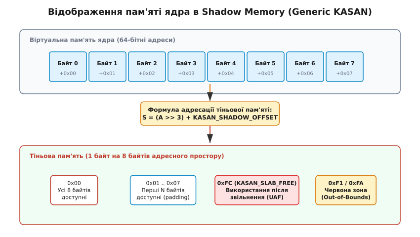
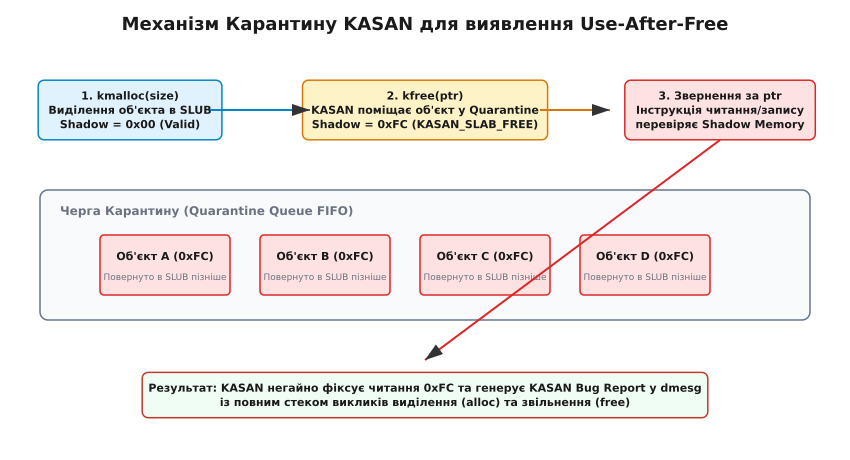
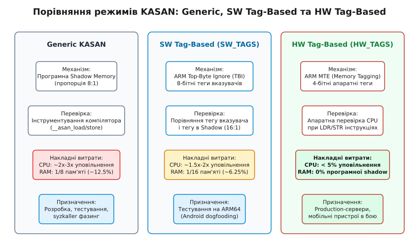

# Kernel Address Sanitizer (KASAN)

<preknowlist>
- [Ядро й простір користувача](root:sys-unix/kernel-and-userspace) — розмежування привілейованого та користувацького просторів пам'яті.
- [Монолітне ядро з модулями](root:sys-unix/monolithic-with-modules) — виділення та управління пам'яттю у монолітному ядрі.
- [Core Dump](root:sys-unix/core-dump) — механізм аналізу аварійних дампів та стека викликів.
</preknowlist>

Виділення динамічної пам'яті у ядрі операційної системи виконується без жодних систем захисту у часі виконання: помилка виходу за межі буфера чи звернення до звільненого об'єкта не перехоплюється процесором, а мовчки руйнує сусідні структури даних підсистеми SLUB, спричиняючи приховані збої або аварійну зупинку ядра через години після фактичного порушення. У мові C відсутні вбудовані перевірки меж масивів чи контролю часу життя вказівників. Якщо код драйвера записує дані на кілька байтів далі виділеного буфера, цей запис перезаписує заголовки сусіднього об'єкта ядра — наприклад, лічильники посилань або вказівники на таблиці функцій.

Kernel Address Sanitizer (KASAN) є динамічним санітайзером пам'яті, вбудованим у ядро Linux, який перехоплює кожне звернення до віртуальної пам'яті ядра й перевіряє його легітимність безпосередньо у момент виконання інструкції. При виявленні будь-якого некоректного доступу KASAN негайно зупиняє операцію та генерує детальний звіт у системний журнал `dmesg` із повним стеком викликів місця виділення, звільнення та помилкового читання чи запису.

## 1. Першопричини та анатомія псування пам'яті в ядрі

Операційна система Linux виконується у привілейованому режимі супервізора процесора (`ring 0` в архітектурі x86_64 або EL1 в ARM64). У цьому режимі апаратний захист сторінок пам'яті розділяє віртуальний простір лише на дві концептуальні зони: простір користувача (`userspace`) та простір ядра (`kernelspace`). Усередині простору ядра будь-яка інструкція має повний доступ до всього діапазону адресної пам'яті ядра. Тут відсутні внутрішні апаратні бар'єри між різними модулями, драйверами та підсистемами.

### 1.1 Внутрішній макет SLUB-алокатора та псування сусідніх об'єктів

Управління динамічною пам meттю ядра покладено на сторінковий алокатор `page_alloc` та алокатор об'єктів `SLUB` (Simple List of Unused Blocks). Коли підсистема ядра звертається до функції `kmalloc(32, GFP_KERNEL)`, SLUB шукає вільну сторінку у відповідному кеші `kmalloc-32`. Сторінка розділяється на рівні слоти розміром по 32 байти кожен.

Для забезпечення високої швидкості виділення нерозподілені слоти об'єднуються у зв'язаний список за допомогою вказівника на наступний вільний елемент (`freelist pointer`), який зберігається безпосередньо усередині самого вільного об'єкта.

```
+--------------------------------+--------------------------------+--------------------------------+
|      Об'єкт A (32 байти)       |      Об'єкт B (32 байти)       |      Об'єкт C (32 байти)       |
| [Полезные данные структуры Kernel] | [Полезные данные структуры Kernel] | [freelist ptr -> Next Free Slot] |
+--------------------------------+--------------------------------+--------------------------------+
```

Якщо підсистема отримуює вказівник на `Об'єкт A` і через помилку у циклі записує 40 байтів замість 32, останні 8 байтів перезаписують початок `Об'єкта B`. У випадку, коли `Об'єкт B` містить вказівник на функцію (наприклад, `struct file_operations *f_op`), наступний виклик цієї функції здійснить стрибок за довільною пошкодженою адресою. Це спричиняє мгновенний Kernel Panic або створює можливість для виконання довільного коду з правами `root`.

Якщо ж `Об'єкт B` був вільним, вихід за межі зіпсує `freelist pointer`. При наступному виклику `kmalloc()` алокатор прочитає пошкоджений вказівник і виділить слот за довільною адресою пам meті ядра, що призведе до хаотичного руйнування структур даних під час подальшої роботи.

### 1.2 Сценарій Use-After-Free (UAF) та проблема висячих вказівників

Ще більшу небезпеку становить помилка **Use-After-Free (UAF)**. Сценарій UAF розгортається у чотири послідовні етапи:
1. **Виділення:** Підсистема виділяє об'єкт пам'яті `ptr = kmalloc(...)` і зберігає його адресу у глобальній структурі або контексті пристрою.
2. **Вивільнення:** Підсистема звільняє пам meть через `kfree(ptr)`, але через помилку в логіці не обнуляє значення вказівника `ptr` (утворюється «висячий вказівник» — dangling pointer).
3. **Повторне виділення (Reallocation):** Алокатор SLUB повертає цю саму фізичну ділянку пам meті іншому компоненту ядра (наприклад, мережевому стеку) для створення нового об'єкта `new_obj`.
4. **Незаконний доступ:** Перша підсистема звертається за застарілим вказівником `ptr->field = 100`, модифікуючи поля `new_obj`.

Без спеціальних інструментів відстежити першопричину UAF майже неможливо, оскільки пошкодження виявляється набагато пізніше місця помилкового звільнення. Інформацію про історію розвитку інструментів аналізу та впровадження KASAN у ядро Linux викладено в деталізованому огляді 📜 [Історія та еволюція KASAN у ядрі Linux](root:sys-unix/kasan-kernel-address-sanitizer/hist-kasan-evolution.md).

## 2. Концепція Shadow Memory та адресація (Generic KASAN)

Основою роботи класичного режиму Generic KASAN є концепція **тіньової пам'яті (Shadow Memory)**. Ідея полягає у виділенні окремого регіону адресної пам'яті ядра, у якому кожен байт відстежує стан доступності прямокутника з 8 байтів основної адресної пам'яті ядра.

### 2.1 Математичне відображення та формула адресації

Оскільки байти основної пам'яті ядра вирівняні по межі 8 байтів (64-бітне слово), 3 молодших біти будь-якої вирівняної адреси завжди дорівнюють нулю. Це дозволяє використовувати простий побітовий зсув вправо на 3 біти (що еквівалентно діленню на `2³ = 8`) для знаходження відповідного зсуву у тіньовій пам'яті.

Формула обчислення адреси тіньового байта `S` для кожної віртуальної адреси ядра `A` має вигляд:

```
S = (A >> 3) + KASAN_SHADOW_OFFSET
```

Константа `KASAN_SHADOW_OFFSET` обирається під час компіляції та конфігурації ядра для кожної архітектури так, щоб уся тіньова пам'ять розміщувалася у єдиному неперервному діапазоні віртуальних адрес. Наприклад, для архітектури x86_64 значення `KASAN_SHADOW_OFFSET` зазвичай становить `0xdffffc0000000000`.

Для перевірки адреси `A` компілятор вставляє швидкі обчислення:
1. Базовий зсув: `A >> 3`.
2. Додавання константи offset: отримуємо адресу байта `S`.
3. Зчитування значення за адресою `S` і порівняння його з нулем.

```
Основна пам'ять ядра (64-бітні адреси):
[ Байт 0 ][ Байт 1 ][ Байт 2 ][ Байт 3 ][ Байт 4 ][ Байт 5 ][ Байт 6 ][ Байт 7 ]
       \      \      \      \      \      \      \      /
        \      \      \      \      \      \      \    /
         +--------------------------------------------+
                               | (A >> 3) + KASAN_SHADOW_OFFSET
                               v
Тіньова пам'ять (Shadow Memory):
                        [ 1 Тіньовий Байт ]
```


*Принцип відображення 8 байтів віртуального адресного простору ядра в 1 байт тіньової пам'яті у Generic KASAN.*

### 2.2 Семантика та кодування байтів тіньової пам'яті

Значення байта тіньової пам'яті описує стан доступності відповідного 8-байтного блоку основної пам'яті:

- **`0x00`**: Усі 8 байтів повністю доступні для читання та запису.
- **`0x01` .. `0x07`**: Лише перші `k` байтів (де `k ∈ [1, 7]`) є доступними, а решта `8 - k` байтів є недоступними (отруєними). Це виникає, коли виділяється структура даних, розмір якої не кратний 8 байтам (наприклад, масив з 13 байтів займає 8 байтів у першому блоці — shadow = `0x00`, та 5 байтів у другому блоці — shadow = `0x05`).
- **Від'ємні значення / Значення зі встановленим старшим бітом (`>= 0x80`)**: Усі 8 байтів є недоступними (отруєними — poisoned).

Для точної діагностики KASAN використовує різні кодові значення отруйних байтів (redzones):

| Значення тіньового байта | Символічний маркер | Опис стану та причини недоступності |
| :--- | :--- | :--- |
| `0xF1` | `KASAN_KMALLOC_REDZONE` | Ліва червона зона навколо об'єкта `kmalloc` |
| `0xF2` | `KASAN_KMALLOC_FREE` | Звільнений об'єкт `kmalloc` |
| `0xF3` | `KASAN_KMALLOC_PAGE_REDZONE` | Червона зона сторінкового алокатора |
| `0xF5` | `KASAN_GLOBAL_REDZONE` | Червона зона навколо глобальної змінної ядра |
| `0xF8` | `KASAN_STACK_LEFT` | Ліва червона зона фрейму функції на стекі |
| `0xFA` | `KASAN_STACK_RIGHT` | Права червона зона фрейму функції на стекі |
| `0xFB` | `KASAN_USE_AFTER_SCOPE` | Змінна стека вийшла з області видимості |
| `0xFC` | `KASAN_SLAB_FREE` | Об'єкт SLUB звільнено (перебуває у карантині UAF) |
| `0xFE` | `KASAN_VMALLOC_INVALID` | Невиділена сторінка у регіоні `vmalloc` |

Вичерпні відомості про конфігурування цих параметрів та аннотування власного коду містить 📋 [Інтерфейс конфігурації, boot-параметрів та аннотацій KASAN](root:sys-unix/kasan-kernel-address-sanitizer/api-kasan-config.md).

## 3. Інструментування компілятора та підсистем пам'яті

Для того щоб KASAN виявляв некоректні звернення, необхідна співпраця двох компонентів: компілятора (GCC або Clang) та підсистеми управління пам meттю ядра (SLUB/page_alloc).

### 3.1 Вставка перевірок компілятором та інлайн-асемблер

Під час компіляції ядра з прапорцем `CONFIG_KASAN=y` компілятор застосовує спеціальний pass (`-fsanitize=kernel-address`). Перед кожною інструкцією, яка виконує читання або запис у пам'ять, компілятор вставляє перевірку тіньового байта.

Розглянемо, у що перетворюється звичайна C-інструкція зчитання 4 байтів `int val = *ptr;` на рівні асемблерних інструкцій x86_64 у режимі `CONFIG_KASAN_INLINE=y`:

```assembly
; Вхід: %rax містить віртуальну адресу ptr
movq    %rax, %rbx
shrq    $3, %rbx                    ; rbx = ptr >> 3
movzbl  0xdffffc0000000000(%rbx), %ecx ; ecx = shadow_byte
testb   %cl, %cl                    ; Перевірка чи shadow_byte == 0
jnz     .Lkasan_check_fail          ; Якщо не 0 -> розширена перевірка або report

.Lkasan_check_pass:
movl    (%rax), %edx                ; Основне читання виконається лише після успіху
```

У режимі `CONFIG_KASAN_OUTLINE=y` компілятор замість вбудовування вищенаведеного коду генерує простий виклик функції `call __asan_load4`, що зменшує розмір вихідного бінарника ядра на 15–20%, але додає накладні витрати на виклик функцій.

### 3.2 Червоні зони (Redzones) та алокатор SLUB

Для виявлення помилок виходу за межі буфера (**Out-of-Bounds**) алокатор SLUB при увімкненому KASAN модифікує макет виділення об'єктів. Навколо кожного об'єкта додаються так звані **червоні зони (redzones)** — додаткові поля розширювального бадді-паддінгу, які позначаються у тіньовій пам'яті як отруєні (`0xF1`).

```
+------------------+-----------------------+------------------+
| Ліва Червона Зона|   Корисне навантаження | Права Червона Зона|
|   (KASAN 0xF1)   |  Об'єкта (Shadow 0x00)|   (KASAN 0xF1)   |
+------------------+-----------------------+------------------+
```

Якщо код намагається зчитати елемент поза межами виділеного об'єкта, інструкція потрапляє у праву червону зону, де тіньовий байт дорівнює `0xF1`, що негайно активує `kasan_report()`.

### 3.3 Черга Карантину (Quarantine Queue) та збереження стеків

Найбільшою практичною складністю у виявленні **Use-After-Free** є швидка повторна реалокація пам'яті. Якщо після виклику `kfree(ptr)` алокатор SLUB негайно поверне ту саму адресу наступному виклику `kmalloc()`, застарілий вказівник буде зчитано без помилки, адже пам meть знову стане доступною (`shadow = 0x00`).

Для запобігання цьому KASAN реалізує дволанкову систему **Карантину (Quarantine)**:
1. **Per-CPU карантин:** При виклику `kfree(ptr)` об'єкт не повертається у вільний список SLUB, а розміщується у локальному кільцевому буфері поточного ядра CPU (`struct qlist_head`).
2. **Глобальний карантин:** Коли локальний буфер заповнюється до ліміту (наприклад, 1 МБ), об'єкти переміщуються у глобальну чергу карантину.
3. **Отруєння кодом `0xFC`:** KASAN отруює тіньову пам'ять об'єкта маркером `0xFC` (`KASAN_SLAB_FREE`).
4. **Збереження відпечатка стека (Stack Depot):** KASAN знімає поточний стек викликів (`kasan_save_stack`) і зберігає його ідентифікатор (`handle`) метаданих об'єкта SLUB. Це дозволяє при подальшому помилковому доступі вивести у звіт повний стек викликів функції, яка виконала `kfree()`.

Об'єкт залишається у карантині доти, доки сукупний обсяг карантинної пам meті не перевищить визначений ліміт (зазвичай 1/32 від обсягу операційної пам'яті). Лише після цього найстаріші об'єкти вивільняються і повертаються до SLUB.


*Схема роботи черги Карантину KASAN під час звільнення пам'яті та виявлення звернень Use-After-Free.*

### 3.4 Захист стека та регіону vmalloc

Окрім динамічних об'єктів SLUB, KASAN захищає локальні змінні на стекі та неперервні віртуальні регіони `vmalloc`:

- **Інструментування стека (`CONFIG_KASAN_STACK=y`):** Компілятор під час побудови прологу функції додає червоні зони навколо кожної локальної змінної на стекі. При вході у функцію інструкції записують маркер `0xF8` (`KASAN_STACK_LEFT`) та `0xFA` (`KASAN_STACK_RIGHT`) у відповідні байти тіньової пам'яті стека, а при виході з функції знімають отруєння (`0x00`). Якщо функція звертається до масиву на стекі за межами його розміру, KASAN негайно генерує звіт `stack-out-of-bounds`.
- **Захист vmalloc (`CONFIG_KASAN_VMALLOC=y`):** При виклику `vmalloc()` ядро виділяє неперервний діапазон віртуальних сторінок. KASAN динамічно заповнює відповідні сторінки тіньової пам'яті через `kasan_populate_vmalloc()`. Захисні сторінки (`guard pages`) між регіонами `vmalloc` позначаються кодом `0xFE` (`KASAN_VMALLOC_INVALID`).

## 4. Режими KASAN: Generic, SW Tag-Based та HW Tag-Based

З розвитком ядра Linux KASAN отримав три принципово різні режими роботи, призначені для різних сценаріїв використання.


*Структурне порівняння триріччя режимів KASAN: Generic, Software Tag-Based та Hardware Tag-Based.*

### 4.1 Generic KASAN
- **Базовий механізм:** Програмна тіньова пам'ять у пропорції 8:1 + інструментування компілятора.
- **Підтримувані архітектури:** x86_64, arm64, powerpc, riscv, s390.
- **Витрати ресурсів:** Вимагає 12.5% (1/8) всієї RAM ядра під Shadow Memory. Уповільнює виконання CPU у 2–3 рази.
- **Сфера застосування:** Тестові сервери, розробка драйверів, автоматичний фазинг за допомогою Syzkaller.

### 4.2 Software Tag-Based KASAN (SW_TAGS)
- **Базовий механізм:** Спирається на апаратну функцію **Top-Byte Ignore (TBI)** в архітектурі ARM64. Старший 8-бітний байт (біти 56–63) 64-бітного вказівника ігнорується процесором при трансляції адрес. KASAN використовує ці 8 біт для збереження псевдовипадкового «тегу» (кольору) об'єкта.
- **Тіньова пам'ять:** Пропорція 16:1 (1 байт тіньової пам meті описує 16 байтів RAM і зберігає 8-бітний тег).
- **Перевірка:** При зверненні компілятор порівнює тег зі старшого байта вказівника `(ptr >> 56)` із тегом, записаним у тіньовій пам meті для цієї адреси. Якщо теги не збігаються — виявлено некоректний доступ!
- **Витрати ресурсів:** Вимагає лише 6.25% (1/16) RAM. Уповільнює CPU у 1.5–2 рази.
- **Сфера застосування:** Тестування ядер Linux на мобільних ARM64-пристроях (Android dogfooding).

### 4.3 Hardware Tag-Based KASAN (HW_TAGS / ARM MTE)
- **Базовий механізм:** Використовує апаратне розширення **ARMv8.5-A Memory Tagging Extension (MTE)**.
- **Апаратні теги:** Процесор підтримує 4-бітні теги для кожного 16-байтного гранула фізичної пам meті, які зберігаються у спеціальній виділеній системній пам'яті DRAM.
- **Відсутність програмного інструментування:** Компілятору більше не потрібно вставляти операції порівняння `__asan_load`. Процесор при виконанні звичайних інструкцій `LDR` та `STR` на апаратному рівні за 1 такт порівнює тег адреси у вказівнику з апаратним тегом пам meті.
- **Апаратні інструкції:** Для маніпуляцій з тегами процесор надає спеціальні інструкції `IRG` (Insert Random Tag), `STG` (Store Allocation Tag) та `LDG` (Load Allocation Tag). Ядро регулює поведінку MTE через системний регістр `TCO` (Tag Check Override).
- **Витрати ресурсів:** Уповільнення CPU менше 5%, витрати RAM на програмну тіньову пам'ять дорівнюють 0%.
- **Сфера застосування:** Виробничі (production) сервери, хмарні інфраструктури та серійні smartphones.

## 5. Анатомія звіту KASAN у dmesg

Коли KASAN виявляє порушення, він видає у системний журнал `dmesg` деталізовану інформацію. Практичний приклад створення модуля ядра з помилкою UAF та повний розбір його роботи наведено у матеріалі ⚙️ [Практичний розбір помилок пам'яті через KASAN](root:sys-unix/kasan-kernel-address-sanitizer/proj-kasan-uaf-demo.md).

Типовий звіт KASAN складається з трьох критично важливих блоків:

1. **Опис помилки та точна інструкція:**
   ```text
   BUG: KASAN: use-after-free in driver_read+0x42/0x100 [my_driver]
   Read of size 4 at addr ffff888102a3c010 by task my_process/1234
   ```
   Тут вказано конкретну функцію `driver_read`, зсув інструкції, розмір доступу (4 байти) та тип помилки (`use-after-free`).

2. **Стеки викликів Алокації та Звільнення (Allocated & Freed Stack Traces):**
   ```text
   Allocated by task 1200:
    kasan_save_stack+0x22/0x50
    __kasan_kmalloc+0x82/0x90
    driver_open+0x35/0x80 [my_driver]

   Freed by task 1205:
    kasan_save_stack+0x22/0x50
    kfree+0x92/0x220
    driver_release+0x40/0x90 [my_driver]
   ```
   Ці два стеки дозволяють розробнику миттєво зрозуміти, яка саме підсистема виділила об'єкт і де саме його було помилково звільнено.

3. **Дамп тіньової пам'яті (Memory state around the buggy address):**
   ```text
   Memory state around the buggy address:
    ffff888102a3bf80: fc fc fc fc fc fc fc fc fc fc fc fc fc fc fc fc
   >ffff888102a3c000: fc fc [fc] fc fc fc fc fc fc fc fc fc fc fc fc fc
                               ^
   ```
   Квадратні дужки `[fc]` вказують на конкретний тіньовий байт адреси, де сталося порушення, підтверджуючи стан об'єкта в карантині.

## 6. Порівняння KASAN з іншими діагностичними санітайзерами ядра

Для повноти картини спостережуваності ядра Linux важливо розуміти межі застосування KASAN у порівнянні з сусідніми інструментами аналізу:

- **KCSAN (Kernel Concurrency Sanitizer):** Призначений для виявлення станів гонитви за даними (**Data Races**) у багатопотоковому виконанні. На відміну від KASAN, KCSAN не відстежує межі буферів, а виявляє відсутність блокувань при одночасному доступі.
- **KMEMLEAK (Kernel Memory Leak Detector):** Відстежує витоки пам'яті (незвільнені об'єкти), скануючи віртуальну пам'ять ядра за принципом garbage collector. KMEMLEAK шукає втрачені вказівники, але не виявляє виходи за межі масивів.
- **LOCKDEP (Lock Dependency Validator):** Перевіряє коректність ієрархії взаємних блокувань (mutex/spinlocks) і попереджає про ризики виникнення мертвих блокувань (**Deadlocks**).

> 🔧 **Навіщо це.**
> У розробці драйверів та низькорівневих модулів ядра KASAN є першою лінією захисту від важковиявлюваних багів. Вмикання `CONFIG_KASAN=y` на етапі CI/CD та інтеграція з фазером Syzkaller дозволяє автоматично виявляти та виправляти баги UAF та OOB ще до того, як вони потраплять у стабільне ядро та спричинять аварійні паніки або безпекові інциденти у продакшн-системах.
