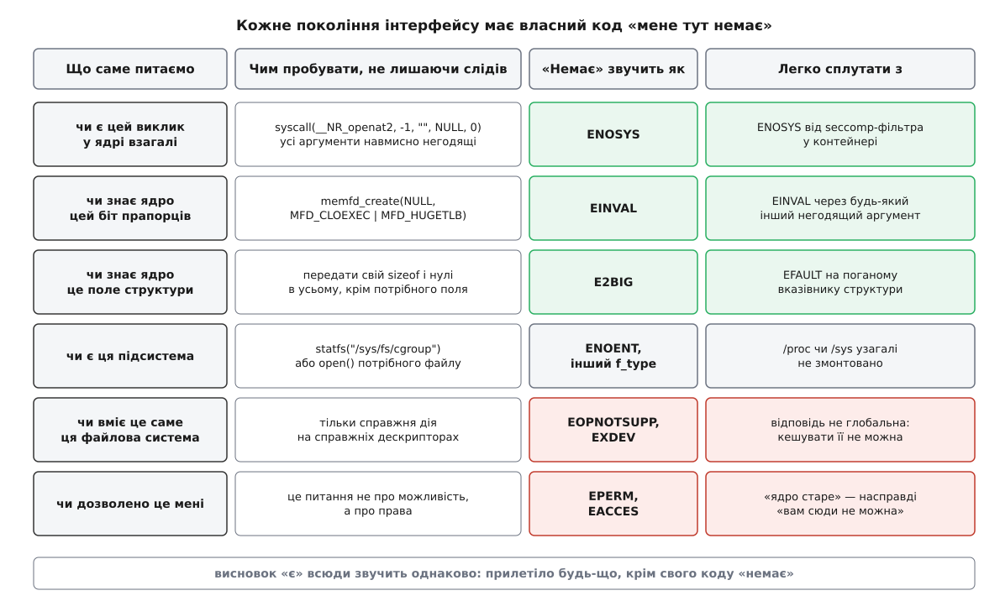
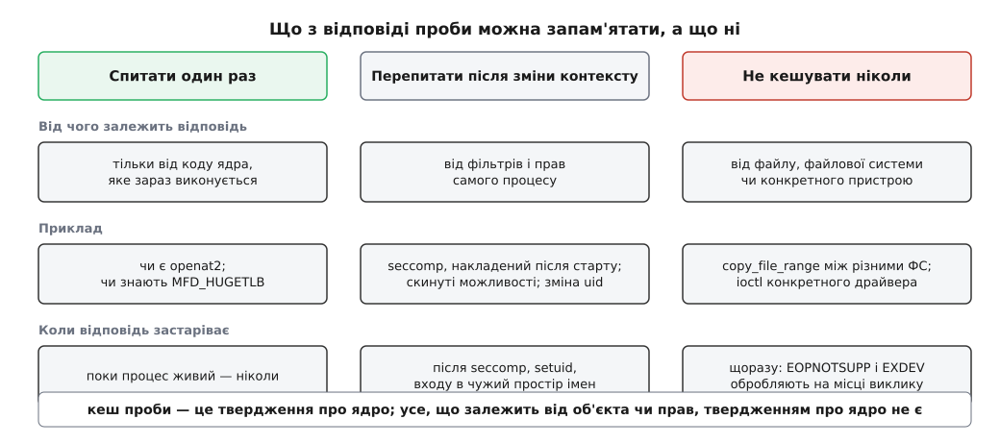

# ⚙️ Проба замість питання: як з'ясувати, що вміє саме це ядро

Ядро не має виклику «перелічи, що ти вмієш», тому програма, яка хоче нову можливість і мусить запускатися й на старих системах, з'ясовує це єдиним доступним способом — робить пробний виклик і читає код помилки; тут зібрано робочі проби для всіх поколінь інтерфейсів ядра й пастки, на яких у цьому місці обпікалися glibc, Docker і runc.

<preknowlist>
- [Системний виклик: як програма просить ядро](root:sys-unix/syscall-mechanics) — номер виклику в регістрі, перехід пасткою, назад — одне ціле число.
- [errno та POSIX-коди помилок](root:sf-apps/errno) — від'ємне значення від ядра libc обертає на `-1` і код у `errno`; це єдиний канал, яким ядро пояснює відмову.
- [libc як шлюз до ядра](root:sys-unix/libc-as-gateway) — між вашим рядком коду й ядром стоїть бібліотека, і вона не завжди прозора.
- [seccomp: фільтрація системних викликів](root:sys-unix/seccomp-filter-mechanism) — процесові можна нав'язати фільтр, який відповідатиме замість ядра.
</preknowlist>

## Чому номер версії — не відповідь

Найочевидніший хід — узяти `uname()`, розібрати рядок на кшталт `6.6.0` і звіритися з таблицею «що коли з'явилося». Хід хибний, і не з міркувань чистоти: номер бреше трьома незалежними способами.

**Дистрибутиви переносять нове в старе.** Red Hat прямо попереджає, що базовий номер угорі рядка версії не є обіцянкою поведінки незміненого ядра з тим самим номером: протягом життя випуску в ту саму гілку переносять зміни з набагато новіших ядер. Ядро з написом `4.18` може вміти те, чого немає у ванільному `5.0`. Це не аномалія, а звичайний спосіб життя [ядра, яке постачають окремо від решти системи](root:sys-unix/kernel-vs-distribution).

**Номер можна просто підмінити.** У Linux є прапорець особистості `UNAME26`: запустіть `setarch --uname-2.6 ./program`, і програма побачить у `uname()` версію, що починається з 2.6. Прапорець існує саме для того, щоб обманювати програми, які надто розумно розбирають номер.

**Половина можливостей — це конфігурація, а не номер.** Підсистему можна вимкнути під час збирання ядра, і жодна таблиця версій цього не покаже.

Отже, питати нема кого. Лишається зробити те, що хочеш, і подивитися, що прилетіло назад.

## Кожне покоління має власний код «мене тут немає»

Ядро не оголошує можливостей, зате чесно повідомляє про відмову, і код відмови різний залежно від того, якого віку інтерфейс ви питаєте.

Виклику, якого в ядрі немає, відповідає `ENOSYS`. Це не випадковість: усі порожні клітинки таблиці системних викликів заповнені посиланням на заглушку `sys_ni_syscall`, яка просто повертає `-ENOSYS`; те саме ядро віддає й на номер, що вийшов за межі таблиці. Виклик, який є, але не знає нового біта прапорців, відповідає `EINVAL` — за умови, що інтерфейс спроєктовано правильно й невідомі біти він відкидає. Структура, першим полем якої йде її розмір, відповідає `E2BIG`, коли ви передали більше, ніж ядро розуміє, і в зайвому хвості є ненульові байти. Можливість, оформлена як файл у [/proc](root:sys-unix/proc-reading-process-and-kernel-state) чи [/sys](root:sys-unix/pseudo-filesystems), відповідає `ENOENT`.

Поруч є два коди, які виглядають як відмова, але означають зовсім інше. `EOPNOTSUPP` і `EXDEV` кажуть «ця файлова система чи ця пара файлів так не вміє» — і завтра, на іншому шляху, та сама програма отримає успіх. `EPERM` і `EACCES` кажуть «уміє, але не вам». Жодне з цього не є твердженням про вік ядра.



*Висновок «є» у всіх рядках формулюється однаково й навмисно: прилетіло будь-що, крім свого коду «немає». Саме таке формулювання переживає перевірки, які додадуть у ядро завтра.*

## Каркас: спитати один раз і не наслідити

Проба коштує системного виклику, тож у гарячому місці її не роблять двічі. Але кеш проби має дві неочевидні вимоги.

```c
#define _GNU_SOURCE
#include <errno.h>
#include <fcntl.h>
#include <sys/mman.h>
#include <sys/statfs.h>
#include <sys/syscall.h>
#include <unistd.h>

/* Клітинка стану: 0 — ще не питали, 1 — є, -1 — немає. */
static int probe_once(int *slot, int (*probe)(void))
{
    int v = __atomic_load_n(slot, __ATOMIC_ACQUIRE);
    if (v == 0) {
        int saved = errno;          /* проба не має права псувати чужий errno */
        v = probe() ? 1 : -1;
        errno = saved;
        __atomic_store_n(slot, v, __ATOMIC_RELEASE);
    }
    return v > 0;
}
```

Перша вимога — **не чіпати `errno`**. Проба ховається всередині вашої бібліотеки й може спрацювати будь-де, зокрема між чужим невдалим викликом і чужим `perror`. Виклик, який мовчки затирає `errno`, перетворює далеке налагодження на вгадування.

Друга вимога тонша: тут навмисно **немає замка**. Два потоки можуть увійти в пробу одночасно й обидва зробити той самий системний виклик — і це нічого не псує, бо відповідь у них однакова, а атомарний запис не дає побачити напівзаписане число. Замок коштував би дорожче, ніж зайва проба раз на життя процесу; це рідкісний випадок, коли [гонитва є безпечною](root:sf-tasks/thread-safety) не через щастя, а за побудовою.

## Три проби, по одній на покоління

**Покоління перше: виклику може взагалі не бути.** Тут відповідь дає `ENOSYS`, а завдання проби — дістатися диспетчера викликів і не зробити при цьому нічого.

```c
/* Заголовки старої системи можуть не знати номера. Номер СВІЙ на кожній
   архітектурі: на mips до нього ще додається 4000 (o32), 5000 (n64)
   або 6000 (n32) — звіряйтеся з таблицею своєї, не переписуйте наосліп. */
#ifndef __NR_openat2
#  if defined(__x86_64__) || defined(__i386__) || \
      defined(__aarch64__) || defined(__riscv)
#    define __NR_openat2 437
#  endif
#endif

static int probe_openat2(void)
{
#ifdef __NR_openat2
    /* Дескриптора -1 не існує, а розмір 0 менший за будь-яку відому версію
       struct open_how — ядро, яке знає виклик, відкине це з EINVAL, ще
       нічого не прочитавши з нашої пам'яті й нічого не відкривши. */
    long r = syscall(__NR_openat2, -1, "", (void *) 0, (size_t) 0);
    return !(r == -1 && errno == ENOSYS);
#else
    return 0;
#endif
}

static int slot_openat2;
int have_openat2(void) { return probe_once(&slot_openat2, probe_openat2); }
```

`openat2` тут не випадковий: у glibc для нього досі немає обгортки, тож `syscall()` — не хитрість, а єдиний спосіб. І зверніть увагу на порядок перевірок усередині ядра: розмір структури воно звіряє **першим**, до `copy_struct_from_user`, тому нульовий вказівник у третьому аргументі безпечний.

**Покоління друге: виклик є, а біт прапорців новий.** Відповідь дає `EINVAL`, і проба тут значно підступніша, бо `EINVAL` — найзагальніший код у Linux. Треба знайти набір аргументів, за яких усі інші причини для `EINVAL` виключені.

```c
#ifndef MFD_HUGETLB
#  define MFD_HUGETLB 0x0004U       /* з'явився в ядрі 4.14 */
#endif

static int probe_memfd_hugetlb(void)
{
    /* memfd_create перевіряє прапорці ДО того, як читати ім'я, тож нульовий
       вказівник гарантує: файлового об'єкта не виникне за жодних обставин. */
    int fd = memfd_create(NULL, MFD_CLOEXEC | MFD_HUGETLB);
    if (fd >= 0) { close(fd); return 1; }   /* не станеться, але хай буде */
    if (errno == ENOSYS)
        return 0;                  /* виклику немає взагалі — прапорця й поготів */
    return errno != EINVAL;        /* EINVAL = біта не знають; решта = знають */
}
```

Два рядки тут варті окремої уваги. Перший — перевірка на `ENOSYS`: проба прапорця мовчки припускає, що виклик існує, і на ядрі, старшому за сам `memfd_create` (до 3.17), формулювання «усе, крім `EINVAL`» відповіло б «біт є». Перевірка покоління завжди передує перевірці прапорця.

Другий — саме формулювання `errno != EINVAL` замість очевиднішого `errno == EFAULT`. На ядрі, яке знає `MFD_HUGETLB`, прапорці проходять, ім'я не читається, і назад справді приходить `EFAULT`. Але в ядрі 6.3 перед читанням імені з'явилася ще одна перевірка: якщо `vm.memfd_noexec` виставлено в 2, виклик без `MFD_NOEXEC_SEAL` відхиляють із `EACCES`. Проба, написана як `errno == EFAULT`, почала б на нових ядрах відповідати «немає» — рівно навпаки до правди. Проба, написана як «усе, крім свого коду відмови», пережила появу перевірки, якої на момент її написання не існувало.

**Покоління третє: можливість — це файл.** Тут проба взагалі не системний виклик у звичному сенсі, а погляд у [псевдофайлову систему](root:sys-unix/pseudo-filesystems).

```c
#ifndef CGROUP2_SUPER_MAGIC
#  define CGROUP2_SUPER_MAGIC 0x63677270   /* байти "cgrp" */
#endif

static int probe_cgroup2(void)
{
    struct statfs sf;
    if (statfs("/sys/fs/cgroup", &sf) != 0)
        return 0;                  /* точки монтування немає — відповіді немає */
    return sf.f_type == CGROUP2_SUPER_MAGIC;
}
```

Так з'ясовують, що [cgroups](root:sys-unix/cgroups-resource-model) працюють у другій версії, — і так само роблять справжні системні служби. Пастка тут своя: у змішаній конфігурації друга версія висить збоку, у `/sys/fs/cgroup/unified`, а всередині контейнера дерево може бути підмінене зовсім. Проба-файл питає не ядро, а те, що змонтовано в цьому [просторі імен](root:sys-unix/namespaces), і плутати ці два питання не варто.

## Те, що кешувати не можна

Три проби вище дають відповіді, справедливі для всього процесу. Але є цілий клас можливостей, де сама постановка «чи вміє ядро» безглузда, бо відповідь залежить від конкретних файлів. Класичний випадок — `copy_file_range`: він з'явився в 4.5, копії між різними файловими системами навчився робити в 5.3, а в 5.19 умови знову звузили — тепер це вдається, лише коли обидві системи одного типу й самі це підтримують.

```c
static ssize_t copy_plain(int in, int out, size_t len)
{
    char buf[32768];
    size_t done = 0;
    while (done < len) {
        size_t want = len - done;
        if (want > sizeof buf) want = sizeof buf;
        ssize_t got = read(in, buf, want);
        if (got < 0) { if (errno == EINTR) continue; return -1; }
        if (got == 0) break;                        /* кінець файлу */
        for (ssize_t off = 0; off < got; ) {
            ssize_t put = write(out, buf + off, (size_t) (got - off));
            if (put < 0) { if (errno == EINTR) continue; return -1; }
            off += put;
        }
        done += (size_t) got;
    }
    return (ssize_t) done;
}

static ssize_t copy_chunk(int in, int out, size_t len)
{
    static int worth_trying = 1;    /* кешуємо ЛИШЕ «виклик є в цьому ядрі» */

    if (__atomic_load_n(&worth_trying, __ATOMIC_RELAXED)) {
        ssize_t n = copy_file_range(in, NULL, out, NULL, len, 0);
        if (n >= 0)
            return n;
        switch (errno) {
        case ENOSYS:                /* цього ядра виклик не має — назавжди */
            __atomic_store_n(&worth_trying, 0, __ATOMIC_RELAXED);
            break;
        case EXDEV:                 /* різні файлові системи */
        case EOPNOTSUPP:            /* саме ця система так не вміє */
        case EINVAL:                /* напр. вихідний дескриптор із O_APPEND */
            break;                  /* ця пара не вміє — наступна може вміти */
        default:
            return -1;              /* справжня помилка: ховати її не можна */
        }
    }
    return copy_plain(in, out, len);
}
```

Тут відкат на `read`/`write` правомірний, і важливо розуміти чому. Він дає той самий результат — байт у байт таку саму копію; різниця лише в ціні: `copy_file_range` міг би обійтися посиланням усередині файлової системи або перекласти копіювання на сервер, а ручний цикл справді тягне дані через простір користувача. Відкат, який зберігає обіцянку й програє тільки в швидкості, — нормальна інженерія. Відкат, який тихо дає **інший** результат, відкатом не є, і в такому разі чесніше відмовитися з помилкою.



*Межа проходить не по «дорого/дешево», а по тому, про що саме твердить відповідь. Кеш проби — це твердження про ядро; усе, що залежить від об'єкта чи прав, твердженням про ядро не є.*

## Пастки

**`ENOSYS` не завжди приходить від ядра.** У контейнері між вами й ядром стоїть seccomp-фільтр, і на цьому в 2021 році послідовно спіткнулися два випуски glibc. Спершу 2.33 почала пробувати `faccessat2`, а типовий профіль Docker відповідав на невідомий виклик `EPERM` — glibc бачила не «немає», а «заборонено», відкату не робила й повертала помилку; потім 2.34 так само наштовхнулася на `clone3` і перестала створювати потоки в контейнерах Fedora 35. Лікували обидва рази однаково: runc почав чіпляти до кожного профілю крихітну програму-заглушку, що повертає `ENOSYS` для будь-якого номера, більшого за всі згадані у профілі, — тобто для всього, що з'явилося після написання профілю. Звідси два висновки. Якщо ви пишете пісочницю, невідомий виклик має відповідати `ENOSYS`, а не `EPERM`. Якщо ви пишете пробу, `ENOSYS` для вас усе одно правильна відповідь: користуватися ним ви таки не можете, а чому саме — вам байдуже.

**`EPERM` теж може означати «немає» — і вгадувати не можна.** Спокуса дописати `errno == EPERM` до умови проби велика й хибна: `EPERM` буває справжнім, і тоді ви мовчки підете на повільний шлях там, де треба було голосно поскаржитися на права.

**Обгортки в libc може не бути — а може бути надто багато.** У `openat2` обгортки немає досі. А `copy_file_range` обгортку має від glibc 2.27, і до 2.30 ця обгортка ще й **емулювала** виклик у просторі користувача, коли ядро його не мало. Тобто на glibc 2.28 проба «чи є `copy_file_range`» відповіла б «є» навіть на ядрі 4.4. Проба міряє не ядро як таке, а те, до чого дотягується ваш виклик — разом із усім, що [libc](root:sys-unix/libc-as-gateway) вирішила зробити по дорозі.

**Проба не має нічого по собі лишати.** Кожна з проб вище влаштована так, що не створює ні файлу, ні дескриптора, ні запису в журналі. Коли інертних аргументів не існує — коли єдиний спосіб дізнатися це справді щось зробити, — пробу виносять у дитину після [fork](root:sys-unix/fork-semantics) і читають лише її код виходу: усе, що дитина зіпсує, помре разом із нею.

**Порядок перевірок усередині ядра — деталь реалізації.** Проби другого покоління спираються на те, що прапорці звіряють раніше за все інше. Це правда для `memfd_create` і для `openat2`, це перевіряється в джерелах — і це може змінитися. Формулювання «усе, крім свого коду відмови» тим і добре, що витримує додану попереду перевірку з іншим кодом; але додану попереду перевірку, яка теж повертає `EINVAL`, воно не витримає, і жодне формулювання не витримає. Там, де ціна помилки висока, надійніше не синтетична проба, а спроба зробити справжню роботу з відкатом.

**Іноді проби не існує в принципі.** Якщо інтерфейс мовчки ковтає невідомі біти прапорців — як це робить `openat`, — дізнатися його вік неможливо: успіх нічого не означає. Це не привід шукати хитрощі, а привід зрозуміти, що тут потрібен новий виклик; саме тому поруч із `openat` стоїть `openat2`. Упізнати ситуацію «проби не буде» — теж частина роботи.

**Відкат, який ніколи не виконувався, зламаний.** Найпідступніша пастка — не в самій пробі, а в тому, що на машині розробника вона завжди відповідає «є», і гілка для старих ядер не виконується жодного разу за все життя проєкту. Перевіряти її є чим: у util-linux від версії 2.40 є команда `enosys`, яка накладає на дитину seccomp-фільтр і змушує названі виклики відмовляти з `ENOSYS`.

```
$ enosys -s copy_file_range ./mytool src dst    # проганяє повільну гілку
$ enosys -s openat2 -s statx ./mytool           # кілька викликів одразу
```

Один рядок у наборі тестів — і код для десятилітнього ядра перестає бути мертвим.

## Скільки це коштує

Ціна самої проби мізерна й легко рахується.

```
один системний виклик, що впав на першій перевірці   ≈ 0.3–0.5 мкс
проб на процес                                        = кількість можливостей
подальші звертання                                    = атомарне читання int, ≈ 1 нс
пам'ять                                               = 4 байти на можливість
```

Тобто вся схема коштує кілька мікросекунд одноразово. Небезпечна тут не ціна, а два способи її втратити: проба без кешу всередині гарячого циклу перетворює кожну ітерацію на системний виклик, а проба, зроблена надто рано — до накладання seccomp-фільтра чи до зміни користувача, — дає відповідь, яка вже не стосується того процесу, що ви маєте зараз.

Останнє, що варто закласти в конструкцію: **напрямок помилки**. Проба може помилитися в обидва боки, і ці боки нерівноцінні. Хибне «немає» коштує вам швидкості: програма піде повільнішим шляхом і зробить те саме. Хибне «є» коштує правильності: ви покличете те, чого немає, і в найкращому разі впадете, а в найгіршому — тихо втратите гарантію, заради якої все й затівалося. Тому кожну проектну неоднозначність — незнайомий код помилки, підозрілий `EPERM`, нерозпізнану конфігурацію — розв'язують на користь «немає». Втрачена швидкість помітна й лагодиться; втрачена гарантія не помітна ніколи.

## Джерела

- [openat2(2), Linux manual page](https://man7.org/linux/man-pages/man2/openat2.2.html) — «glibc provides no wrapper for openat2()»; `EINVAL`, коли `size` менший за будь-яку відому версію `struct open_how`; `E2BIG` для непідтримуваного розширення.
- [fs/open.c, torvalds/linux](https://github.com/torvalds/linux/blob/master/fs/open.c) — `SYSCALL_DEFINE4(openat2)`: перевірка `usize < OPEN_HOW_SIZE_VER0` стоїть перед `copy_struct_from_user`.
- [memfd_create(2), Linux manual page](https://man7.org/linux/man-pages/man2/memfd_create.2.html) — виклик від ядра 3.17, `MFD_HUGETLB` від 4.14; `EINVAL` — «flags included unknown bits», `EFAULT` — «the address in name points to invalid memory».
- [mm/memfd.c, torvalds/linux](https://github.com/torvalds/linux/blob/master/mm/memfd.c) — перевірка прапорців і `check_sysctl_memfd_noexec()` (повертає `-EACCES`) стоять перед `strnlen_user()`.
- [Introduction of non-executable mfd, kernel.org](https://docs.kernel.org/userspace-api/mfd_noexec.html) — рівні `vm.memfd_noexec`; на рівні 2 виклик без `MFD_NOEXEC_SEAL` відхиляють.
- [copy_file_range(2), Linux manual page](https://man7.org/linux/man-pages/man2/copy_file_range.2.html) — копії між різними ФС від 5.3 і звуження умов у 5.19; емуляція в glibc 2.27–2.29 і її вилучення в 2.30.
- [seccomp: prepend -ENOSYS stub to all filters, opencontainers/runc#2750](https://github.com/opencontainers/runc/pull/2750) — чому `EPERM` як типова відповідь був помилкою і як заглушка повертає `ENOSYS` для номерів, більших за всі згадані у профілі.
- [seccomp filter breaks latest glibc by blocking clone3 with EPERM, moby/moby#42680](https://github.com/moby/moby/issues/42680) — розбір поломки glibc 2.34 у контейнерах.
- [Workaround seccomp() issue with faccessat2(), libc-alpha](https://public-inbox.org/libc-alpha/YECaCn0st2ij3iMl@pevik/T/) — та сама історія роком раніше, з `faccessat2` і glibc 2.33.
- [setarch(8), Linux manual page](https://man7.org/linux/man-pages/man8/setarch.8.html) — `--uname-2.6` вмикає особистість `UNAME26`, і `uname()` починає повідомляти версію 2.6.
- [enosys(1), Linux manual page](https://man7.org/linux/man-pages/man1/enosys.1.html) — «execute a child process for which certain syscalls fail with errno ENOSYS»; команда з util-linux 2.40.
- [The Linux kernel, Red Hat Enterprise Linux documentation](https://docs.redhat.com/en/documentation/red_hat_enterprise_linux/9/html/managing_monitoring_and_updating_the_kernel/assembly_the-linux-kernel_managing-monitoring-and-updating-the-kernel) — базовий номер версії не описує всіх змін: у ту саму гілку переносять зміни з новіших ядер. *Статус: документація постачальника, підтверджує практику саме RHEL.*
