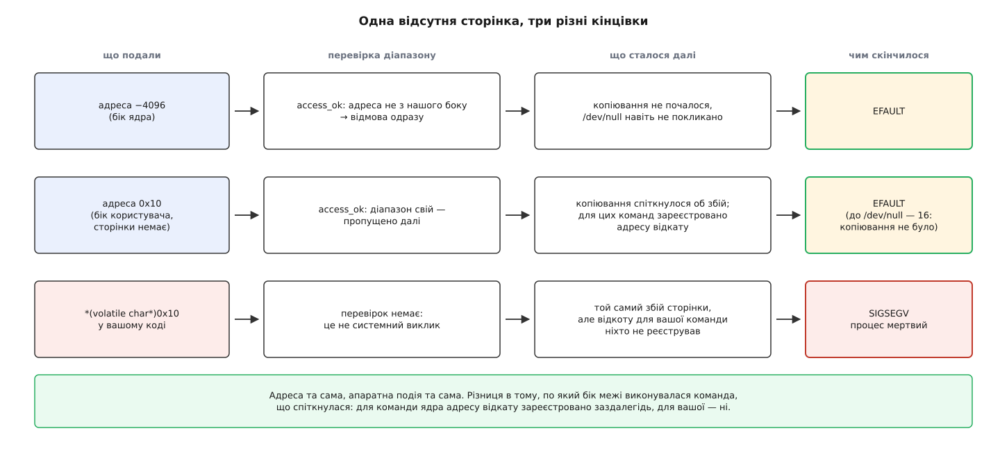
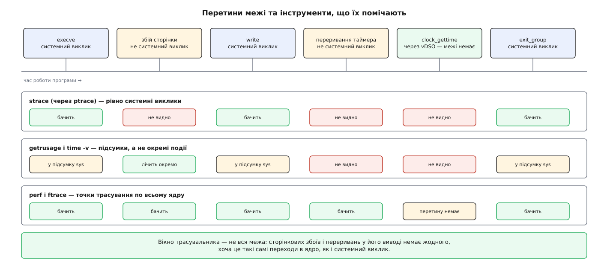

# ⚙️ Межа на дотик: виміряти її ціну, наштовхнутися на неї вказівником і перелічити перетини

Три коротких досліди мовою C та кілька команд оболонки, після яких межа між ядром і простором користувача перестає бути схемою на малюнку: у неї з'являється ціна в наносекундах, власний різновид помилки, який не вбиває, і точний, до одного рядка, перелік перетинів.

<preknowlist>
- [Системний виклик](topic:hw-arch/system-call) — команда-пастка, що воднораз піднімає рівень привілею й передає керування в наперед призначену ядром точку.
- [Файловий дескриптор](topic:sys-unix/file-descriptor) — маленьке ціле число, яким процес називає відкритий об'єкт; дескриптор 1 — стандартний вивід.
- [Віртуальний адресний простір](topic:sf-os/virtual-address-space) — набір сторінок, відображених саме для цього процесу; адреси поза ним не існує, хоч число й записується.
- [Сторінковий збій](topic:sf-os/page-fault) — апаратна подія, коли команда звернулася за адресою, для якої немає готового відображення; далі вирішує ядро.
- [Сигнал](topic:sys-unix/signal-model) — спосіб, яким ядро повідомляє процесові про подію, зокрема про його власну фатальну помилку.
</preknowlist>

Потрібні лише Linux, `gcc` і `strace`; усе збирається одним рядком `gcc -O2 -o ім'я ім'я.c` і запускається від звичайного користувача. Жоден дослід нічого не псує — найгірше, що станеться, це один навмисно вбитий процес.

## Дослід 1. Виростити sys-час із нічого

**Задача.** Записати ті самі 64 мебібайти й змусити один і той самий обсяг роботи коштувати то двадцять п'ять секунд, то чотири десяті мілісекунди — не змінюючи ані байта даних, ані пристрою призначення.

**Ідея.** Роботи тут насправді немає. Писати будемо у `/dev/null`, а цей пристрій влаштовано так, що його обробник запису не читає буфера взагалі: він повертає задану кількість байтів і на цьому все. Отже, все, що ми поміряємо, — це чистий перетин межі без жодного корисного змісту. Загальний обсяг лишається сталим, а міняється розмір шматка на один `write` — тобто **кількість перетинів**. Якщо межа має ціну, `sys`-час має виявитися просто добутком цієї ціни на кількість переходів.

```c
/* border1.c — та сама робота, різна кількість перетинів межі.
 * gcc -O2 -o border1 border1.c     запуск: ./border1 <розмір шматка в байтах>
 */
#define _GNU_SOURCE                 /* getrusage і RUSAGE_* без сюрпризів */
#include <stdio.h>
#include <stdlib.h>
#include <string.h>
#include <time.h>
#include <unistd.h>
#include <fcntl.h>
#include <sys/resource.h>

static double tv(const struct timeval *t) { return t->tv_sec + t->tv_usec / 1e6; }

int main(int argc, char **argv)
{
    const size_t TOTAL = 64u << 20;                  /* 64 МіБ у кожному прогоні */
    size_t chunk = (argc > 1) ? strtoul(argv[1], NULL, 0) : 1;
    if (chunk == 0 || TOTAL % chunk) {
        fprintf(stderr, "розмір шматка має націло ділити 64 МіБ\n");
        return 1;
    }

    char *buf = malloc(chunk);
    memset(buf, 'x', chunk);         /* торкаємося сторінок ЗАЗДАЛЕГІДЬ, поза виміром */

    int fd = open("/dev/null", O_WRONLY);
    if (fd < 0) { perror("/dev/null"); return 1; }

    struct rusage r0, r1;
    struct timespec w0, w1;
    getrusage(RUSAGE_SELF, &r0);
    clock_gettime(CLOCK_MONOTONIC, &w0);

    for (size_t done = 0; done < TOTAL; done += chunk)
        if (write(fd, buf, chunk) != (ssize_t) chunk) { perror("write"); return 1; }

    clock_gettime(CLOCK_MONOTONIC, &w1);
    getrusage(RUSAGE_SELF, &r1);

    double wall = (w1.tv_sec - w0.tv_sec) + (w1.tv_nsec - w0.tv_nsec) / 1e9;
    unsigned long calls = TOTAL / chunk;

    printf("шматок %-6zu перетинів %9lu  user %.3f  sys %7.3f  wall %8.4f  %5.0f нс/перетин\n",
           chunk, calls,
           tv(&r1.ru_utime) - tv(&r0.ru_utime),
           tv(&r1.ru_stime) - tv(&r0.ru_stime),
           wall, wall * 1e9 / calls);
    return 0;
}
```

Що виходить на одній конкретній машині — сучасний x86-64 із увімкненими пом'якшеннями апаратних вразливостей:

```
$ for n in 1 8 64 512 4096 65536; do ./border1 $n; done
шматок 1      перетинів  67108864  user 0.512  sys  24.913  wall  25.4810    380 нс/перетин
шматок 8      перетинів   8388608  user 0.064  sys   3.121  wall   3.1900    380 нс/перетин
шматок 64     перетинів   1048576  user 0.008  sys   0.389  wall   0.3990    381 нс/перетин
шматок 512    перетинів    131072  user 0.000  sys   0.049  wall   0.0501    382 нс/перетин
шматок 4096   перетинів     16384  user 0.000  sys   0.004  wall   0.0064    391 нс/перетин
шматок 65536  перетинів      1024  user 0.000  sys   0.000  wall   0.0004    391 нс/перетин
```

Останній стовпчик і є відповіддю: він майже не змінюється. Скільки б байтів ми не просили записати, один перехід у ядро й назад коштує ті самі неповні чотириста наносекунд. Уся різниця між першим і останнім рядком — це різниця в кількості переходів, і вона тягне майже на п'ять порядків:

```
перетинів = 64 МіБ / шматок
sys ≈ перетинів · ціна_перетину

шматок 1      67 108 864 · 380 нс ≈ 25.5 с
шматок 64      1 048 576 · 380 нс ≈ 0.40 с
шматок 65536       1 024 · 380 нс ≈ 0.0004 с
```

Абсолютні числа належать одній машині — ваші будуть інші, надто якщо пом'якшення вимкнено. Стала тут форма залежності, а не значення: `sys`-час пропорційний **кількості** перетинів і майже не залежить від того, скільки байтів кожен із них ніс. Саме тому вся інженерія навколо вводу-виводу зводиться до одного руху — зменшити кількість переходів, а не здешевити кожен.

Тепер варто перевірити протилежне твердження — що ціна перетину все ж таки трохи росте з обсягом. Замініть `/dev/null` на звичайний файл: там ядро **справді копіює** байти з вашого буфера у [кеш сторінок](topic:sys-unix/page-cache-durability), і на великих шматках до сталої ціни переходу додасться час копіювання, пропорційний довжині. Обидва доданки видно нарізно саме тому, що `/dev/null` дав нам чистий нуль другого з них.

### Пастки виміру

**Буферизація в бібліотеці ховає межу цілком.** Замініть `write(fd, buf, chunk)` на `fwrite(buf, 1, chunk, f)` — і скільки б ви не дрібнили шматок, кількість перетинів не зміниться: [стандартна бібліотека](topic:sys-unix/libc-as-gateway) складає ваші байти у власний буфер (типово кілька кілобайтів) і йде до ядра, лише коли той переповнився. Побачити це можна одразу:

```
$ strace -c -e trace=write ./border1-fwrite 1
% time     seconds  usecs/call     calls    errors syscall
------ ----------- ----------- --------- --------- ----------------
100.00    0.011903           0     16384           write
```

Шістнадцять тисяч перетинів замість шістдесяти семи мільйонів — і жодного рядка коду про це. Звідси й наслідок для вимірів: якщо в циклі, який ви міряєте, стоїть `printf`, ви міряєте бібліотеку, а не межу.

**Роздільність обліку часу — не мікросекунда.** Поля `ru_utime` і `ru_stime` записані з точністю до мікросекунди, але ця точність нічого не обіцяє: типове ядро [набирає час процесу вибірково](topic:sys-unix/cpu-time-accounting) — на кожному перериванні таймера воно дивиться, у якому режимі застало процесор, і дописує цілий тик тому режимові. Тик — це 1/HZ, тобто здебільшого 4 мс (HZ=250) або 1 мс (HZ=1000). Тому нуль в останніх рядках таблиці означає не «безплатно», а «коротше за роздільність»; і тому ж `user`-стовпчик у першому рядку не варто читати як точний час вашого циклу. Правило просте: якщо прогін коротший за кілька сотень тиків, `sys` і `user` не міряють нічого — довіряйте `wall` із [монотонного годинника](topic:sf-apps/monotonic-vs-wall-time) або збільшуйте кількість повторень.

**Холодний кеш і холодна частота.** Коли перепишете дослід на справжній файл, перший прогін буде повільніший за решту: сторінки ще не в кеші, і читання чекає на диск. Це видно навіть на око — `real` виросте, а `sys` майже ні, бо очікування на пристрій не є ані вашим часом, ані часом ядра. Щоб міряти холодний випадок навмисно, кеш скидають записом у [керівний файл `/proc`](topic:sys-unix/pseudo-filesystems) (`echo 3 > /proc/sys/vm/drop_caches` від адміністратора); щоб міряти теплий — просто відкидають перший прогін. Із того самого роду перша тисяча ітерацій узагалі будь-якого циклу: процесор ще не підняв частоту, і [керування частотою й напругою](topic:hw-arch/dvfs) додасть вам десятки відсотків розкиду між прогонами.

**Не міряйте нічого під трасувальником.** Про це — третій дослід; зараз досить знати, що `strace` подорожчує кожен перетин на порядки, тож `strace -c` годиться рахувати виклики, а не хронометрувати їх.

## Дослід 2. Той самий вказівник: помилка чи смерть

**Задача.** Узяти одну адресу, за якою в процесі нічого немає, і подати її ядру — а потім розіменувати самому. Обидва рази це та сама адреса, та сама відсутня сторінка й та сама апаратна подія. Наслідки протилежні.

**Ідея.** Ядро отримує вказівник від недовіреної сторони й тому ставиться до нього як до звичайного аргументу, що підлягає перевірці. Перевірок насправді дві, і вони різні за природою — саме тому в досліді чотири рядки, а не один. Спершу дешева перевірка діапазону: чи лежить адреса взагалі по боці користувача. Потім — саме копіювання, яке ядро виконує особливою процедурою, для команд якої заздалегідь зареєстровано адресу відкату. Якщо сторінки немає, апаратура здійме сторінковий збій, обробник побачить, що збій стався на команді з відкатом, і замість убивати когось поверне «стільки байтів скопіювати не вдалося». Це число й перетворюється на `EFAULT`.

```c
/* border2.c — одна погана адреса з трьох боків.  gcc -O2 -o border2 border2.c */
#define _GNU_SOURCE
#include <stdio.h>
#include <string.h>
#include <errno.h>
#include <fcntl.h>
#include <unistd.h>

static void probe(const char *what, int fd, const void *p, size_t n)
{
    errno = 0;
    ssize_t r = write(fd, p, n);
    /* мітку друкуємо ОСТАННЬОЮ: ширина поля рахує байти, а кирилиця в UTF-8
       займає по два — вирівняти можна лише те, що ліворуч від неї */
    printf("r=%4zd  errno=%2d %-11s  %s\n",
           r, errno, r < 0 ? strerror(errno) : "-", what);
}

int main(void)
{
    char *nopage  = (char *) 0x10L;       /* адреса з діапазону користувача, сторінки немає */
    char *notours = (char *) -4096L;      /* адреса взагалі не з нашого боку межі          */

    int null = open("/dev/null", O_WRONLY);
    int file = open("border2.out", O_WRONLY | O_CREAT | O_TRUNC, 0644);
    if (null < 0 || file < 0) { perror("open"); return 1; }

    probe("нема сторінки -> /dev/null, 16 Б", null, nopage,  16);
    probe("нема сторінки -> файл, 16 Б",      file, nopage,  16);
    probe("нема сторінки -> файл, 0 Б",       file, nopage,   0);
    probe("не наш бік -> /dev/null, 16 Б",    null, notours, 16);

    fflush(stdout);                       /* ← приберіть цей рядок і перечитайте пастки */

    volatile char *self = (volatile char *) nopage;
    printf("а тепер розіменуємо самі: %d\n", (int) *self);
    return 0;
}
```

```
$ ./border2 ; echo "код виходу: $?"
r=  16  errno= 0 -            нема сторінки -> /dev/null, 16 Б
r=  -1  errno=14 Bad address  нема сторінки -> файл, 16 Б
r=   0  errno= 0 -            нема сторінки -> файл, 0 Б
r=  -1  errno=14 Bad address  не наш бік -> /dev/null, 16 Б
Segmentation fault (core dumped)
код виходу: 139
```

Чотири рядки — чотири різні відповіді на одну адресу, і кожен щось каже про те, як улаштована перевірка.

**Перший рядок несподіваний найбільше: погана адреса пройшла.** `/dev/null` не читає буфера, тому копіювання не було, тому не було чого й ламатися. Звідси перший висновок: `EFAULT` — не результат окремої «перевірки вказівника на вході в ядро». Він народжується там, де ядро **справді торкається** вашої пам'яті, і ніде більше.

**Другий рядок — те, що очікували.** Той самий вказівник, той самий розмір, інший призначений об'єкт: звичайний файл, а туди байти треба скопіювати по-справжньому. Копіювання спіткнулося об відсутню сторінку, відкотилося й обернулося на `-1` та `EFAULT`.

**Третій рядок показує, що нуль байтів скасовує все.** Копіювати нема чого — немає й помилки; `write` повертає нуль. Тому нульовий результат `write` ніколи не є підтвердженням, що вказівник справний.

**Четвертий рядок — та сама дешева перевірка діапазону, яка спрацювала до всього іншого.** Адреса `-4096` лежить по боці ядра, і `vfs_write` відсіює її одним порівнянням, ще не дійшовши до `/dev/null`. Порівняння перевіряє лише те, з якого боку межі адреса, — не те, чи є за нею сторінка. Ось чому воно пропустило `0x10`.

І, нарешті, останній рядок виводу. Та сама відсутня сторінка, та сама апаратна подія — але команда, що спричинила збій, належить вашій програмі, і жодного відкату для неї ніхто не реєстрував. Обробникові збою немає куди повернути помилку, тож він робить єдине, що лишається: надсилає процесові `SIGSEGV`, а той за типовою дією вбиває процес і [лишає аварійний дамп](topic:sys-unix/core-dump).



*Три рядки — три різні кінцівки для однієї адреси. Перші два розрізняє лише те, як далеко по ланцюжку встигло дійти звернення; третій у цей ланцюжок узагалі не входить — і саме тому кінчається сигналом, а не кодом помилки.*

Що ядро таки помітило падіння, видно збоку — якщо ввімкнено `debug.exception-trace` (у більшості дистрибутивів так):

```
$ dmesg | tail -1
border2[24817]: segfault at 10 ip 000055f0c1e0a1b9 sp 00007ffd3c2f5a10 error 4 in border2
```

`at 10` — це наша адреса `0x10`. Ядро знає точну адресу, точну команду й точний стек; воно просто не має права вигадати за вас, що з цим робити.

### Пастки

**Буфер `stdout` живе по вашому боці й гине разом із процесом.** Приберіть `fflush` і перенаправте вивід у файл — файл лишиться порожнім, хоча на терміналі ті самі чотири рядки видно чудово. Причина рівно в межі: на терміналі бібліотека буферує порядково й віддає кожен рядок ядру одразу; у файл вона буферує повністю, і все написане досі лежить у пам'яті процесу, яку `SIGSEGV` знищує. Байти, які вже перетнули межу, переживають смерть процесу; байти, які до неї не дійшли, — ні. Це не дрібниця налагодження, а той самий поділ, тільки з іншого боку.

**Чому `0x10` гарантовано порожня.** Ядро не дозволяє непривілейованому процесові відображати найнижчі адреси — межу задає `vm.mmap_min_addr` (у більшості дистрибутивів 65536, подекуди 4096). Зроблено це саме проти таких помилок у самому ядрі: якби нульову сторінку можна було зайняти, розіменування `NULL` усередині ядра стрибало б у підготовлений зловмисником код. Якщо десь `vm.mmap_min_addr` дорівнює нулю, дослід треба переписати на адресу, яку ви самі звільнили через `munmap`.

**Порядок перевірок обманює.** Спробуєте те саме на закритому дескрипторі — отримаєте `EBADF`, а не `EFAULT`: справність дескриптора ядро перевіряє раніше за буфер. Перевіряйте по одному припущенню за раз.

**Обробник `SIGSEGV`, який повертається, зациклює програму.** Спокуса перехопити сигнал і «жити далі» велика, але повернення з обробника означає повторне виконання тієї самої команди — з тим самим результатом, і так нескінченно. Осмислено це лише тоді, коли обробник встиг відобразити потрібну сторінку. І пам'ятайте, що [в обробнику дозволено викликати далеко не все](topic:sys-unix/async-signal-safety): `printf` там не місце, `write` — можна.

**Частково погана область — це не обов'язково `EFAULT`.** Якщо буфер починається на відображеній сторінці, а закінчується на відсутній, копіювання встигає перенести початок і зупиниться на збої. Що ядро поверне — короткий запис чи помилку, — залежить від конкретного шляху вводу-виводу; стандарт цього не визначає. Не будуйте нічого на вгаданій поведінці: [короткий результат `write` треба обробляти завжди](topic:sys-unix/eintr-and-restart), хай би що його спричинило.

## Дослід 3. strace як опис межі, а не програми

**Задача.** Отримати перелік перетинів для трьох програм: тієї, що три секунди рахує; тієї, що десять мільйонів разів питає, котра година; і тієї, що не робить нічого, крім перетинів. Відповіді мають розійтися від нуля до десятків тисяч, хоча всі три на око однаково зайняті.

**Ідея.** Трасувальник системних викликів працює не «спостереженням за програмою». Він через [ptrace](topic:sys-unix/ptrace-model) просить ядро спиняти процес рівно на вході в ядро й на виході з нього. Тому його вивід — це буквально протокол межі: усе, що всередині програми, для нього невидиме за побудовою, а все, що перетнуло межу, потрапляє в протокол обов'язково. Це робить його ідеальним інструментом для нашого питання й геть непридатним для деяких інших.

```c
/* border3.c — три секунди роботи й жодного перетину.  gcc -O2 -o border3 border3.c */
#include <stdio.h>

int main(void)
{
    volatile long s = 0;                  /* volatile, інакше -O2 викине цикл цілком */
    for (long i = 0; i < 1000000000L; i++) s += i;
    printf("%ld\n", s);
    return 0;
}
```

```
$ time ./border3
499999999500000000
real  0m2.914s   user  0m2.911s   sys  0m0.001s

$ strace -c ./border3
% time     seconds  usecs/call     calls    errors syscall
------ ----------- ----------- --------- --------- ----------------
 28.13    0.000201          14        14           mmap
 17.20    0.000123          20         6           openat
 13.15    0.000094          10         9           mprotect
  ...
------ ----------- ----------- --------- --------- ----------------
100.00    0.000715                    58         3 total
```

П'ятдесят вісім перетинів — і жоден із них не належить нашому циклу. Усі вони припадають на запуск: [динамічний завантажувач](topic:sys-unix/dynamic-loader) шукає кеш бібліотек, відкриває `libc.so.6`, відображає її сегменти, наприкінці — один `write` із результатом і `exit_group`. Три секунди обчислень для трасувальника просто не існують. Стовпчик `seconds` теж читайте буквально: це час **усередині ядра**, 0.0007 с проти майже трьох секунд роботи програми.

Зворотний бік того самого — межа, якої немає там, де її очікуєш:

```c
    struct timespec ts;
    for (int i = 0; i < 10000000; i++) clock_gettime(CLOCK_MONOTONIC, &ts);
```

```
$ strace -c -e trace=clock_gettime ./border-clock
% time     seconds  usecs/call     calls    errors syscall
------ ----------- ----------- --------- --------- ----------------
------ ----------- ----------- --------- --------- ----------------
100.00    0.000000                     0           total
```

Десять мільйонів викликів — нуль перетинів. Ядро відображає в кожен процес маленьку спільну бібліотеку, [vDSO](topic:sys-unix/vdso), і читання часу виконується з неї як звичайна функція, беручи опорні мітки зі сторінки, доступної лише на читання. Побачити її можна прямо в карті пам'яті процесу: `grep vdso /proc/self/maps`. Тут корисно й перевірити джерело часу — якщо в `/sys/devices/system/clocksource/clocksource0/current_clocksource` стоїть не лічильник тактів процесора, vDSO чесно піде в ядро, і нулі в таблиці зміняться на десять мільйонів.

Тепер протилежна крайність — програма, що майже нічого не робить, крім перетинів:

```
$ strace -c ./border1 4096
% time     seconds  usecs/call     calls    errors syscall
------ ----------- ----------- --------- --------- ----------------
 98.71    0.009142           0     16384           write
  0.72    0.000067          13         5           openat
  ...
------ ----------- ----------- --------- --------- ----------------
100.00    0.009262                 16442         3 total
```

Розмір шматка тут не 1, і не з ліні: шістдесят сім мільйонів перетинів під трасувальником розтяглися б хвилин на п'ятнадцять — про причину нижче.

Ось де трасувальник на місці: він відповідає на питання «скільки разів ця програма зверталася до ядра й до кого саме» точно й без здогадів. Саме тому перше корисне питання про дивну поведінку — «покажи мені перетини»: якщо потрібного виклику в переліку немає, програма навіть не намагалася; якщо він є й повернув помилку, домовлятися треба з ядром, а не з кодом.

### Пастки

**Ціна трасування — не відсотки, а рази.** Кожен перетин під `ptrace` перетворюється на дві зупинки трасованого процесу, і на кожній ядро перемикається на процес-трасувальник і назад. Порівняйте самі:

```
$ time ./border1 4096                       real 0m0.007s
$ time strace -o /dev/null ./border1 4096   real 0m0.212s
```

Тридцятикратне вповільнення на шістнадцяти тисячах викликів; на мільйонах воно розтягнеться на хвилини. Із цього два наслідки: хронометрувати під трасувальником не можна взагалі, а програми з жорсткими таймаутами під ним поводяться інакше — те, що встигало, перестає встигати.

**Без `-f` дітей не видно.** `strace ./script.sh` покаже `fork` і `execve`, а далі — тишу: трасується той процес, якого запустили, а не дерево. Для конвеєрів і оболонок `-f` обов'язковий, і разом із ним варто брати `-e trace=…`, щоб не втопитися.

**Трасувальник бачить не всі перетини.** Він бачить рівно системні виклики. Сторінкові збої, апаратні переривання, витіснення планувальником — це теж переходи в ядро, і в його виводі їх немає жодного. Побачити їх можна іншими засобами: `/usr/bin/time -v`, `getrusage` або [підсистемою perf](topic:sys-unix/perf-events), яка знімає і виклики, і збої, і переривання.



*Кожен інструмент прорізає в межі власне вікно. Найпоширеніша помилка — вважати вікно трасувальника всією межею й дивуватися, чому час «зник» між `user` і `sys`.*

## Перетини, яких не показав жоден із трьох дослідів

Останній дослід виправляє картинку, яку три перші могли залишити: ніби перетнути межу можна тільки навмисно, системним викликом. Найчастіший перетин у житті програми — сторінковий збій, і жодного рядка коду про нього ви не пишете.

```c
/* border4.c — 65 536 перетинів межі, яких strace не покаже.  gcc -O2 -o border4 border4.c */
#define _GNU_SOURCE
#include <stdio.h>
#include <sys/mman.h>
#include <sys/resource.h>

int main(void)
{
    size_t len = 256u << 20;                              /* 256 МіБ */
    char *p = mmap(NULL, len, PROT_READ | PROT_WRITE,
                   MAP_PRIVATE | MAP_ANONYMOUS, -1, 0);   /* один системний виклик */
    if (p == MAP_FAILED) { perror("mmap"); return 1; }

    struct rusage r0, r1;
    getrusage(RUSAGE_SELF, &r0);
    for (size_t i = 0; i < len; i += 4096) p[i] = 1;      /* торкаємося кожної сторінки */
    getrusage(RUSAGE_SELF, &r1);

    printf("дрібних збоїв %ld, великих %ld\n",
           r1.ru_minflt - r0.ru_minflt, r1.ru_majflt - r0.ru_majflt);
    return 0;
}
```

```
$ ./border4
дрібних збоїв 65538, великих 0
$ strace -c ./border4 2>&1 | grep -ci fault
0
```

Один `mmap` — і шістдесят п'ять тисяч переходів у ядро, кожен із яких знайшов вільну сторінку, обнулив її, вписав у таблицю сторінок і повернувся, щоб апаратура повторила ту саму команду вже успішно. [Відображення пам'яті](topic:sys-unix/mmap-model) не «виділяє пам'ять» — воно обіцяє, а платить за обіцянку кожен перший дотик. Через це, до речі, і працює обман із вимірами: програма, що виділила гігабайт і нічого не торкнулася, коштує майже нуль, а та сама програма після першого проходу — гігабайт.

Одна поправка, яка легко з'їдає результат: якщо ввімкнено прозорі великі сторінки (`cat /sys/kernel/mm/transparent_hugepage/enabled`), ядро віддасть анонімне відображення шматками по 2 МіБ, і збоїв буде не 65 538, а близько 128. Число впаде вп'ятсот разів, хоча в коді не зміниться нічого — саме тому лічильник збоїв варто читати разом із тим, як налаштована машина.

## Джерела

- [write(2), Linux manual page](https://man7.org/linux/man-pages/man2/write.2.html) — `EFAULT`: «buf is outside your accessible address space».
- [fs/read_write.c, torvalds/linux](https://github.com/torvalds/linux/blob/master/fs/read_write.c) — `vfs_write`: `if (unlikely(!access_ok(buf, count))) return -EFAULT;` — саме та дешева перевірка діапазону.
- [drivers/char/mem.c, torvalds/linux](https://github.com/torvalds/linux/blob/master/drivers/char/mem.c) — `write_null` повертає `count`, не торкаючись буфера; звідси успіх поганої адреси в першому рядку досліду 2.
- [vdso(7), Linux manual page](https://man7.org/linux/man-pages/man7/vdso.7.html) — перелік символів vDSO на x86-64 і причина її існування.
- [time(7), Linux manual page](https://www.man7.org/linux/man-pages/man7/time.7.html) — значення HZ (100, 250, 1000) і роздільність тика.
- [getrusage(2), Linux manual page](https://man7.org/linux/man-pages/man2/getrusage.2.html) — `ru_utime`, `ru_stime`, `ru_minflt`, `ru_majflt`; частину полів Linux не веде взагалі.
- [getpid(2), Linux manual page](https://man7.org/linux/man-pages/man2/getpid.2.html) — glibc кешувала PID від 2.3.4 до 2.24 включно, з 2.25 кеш прибрано; корисно пам'ятати, коли міряєте «найдешевший системний виклик».
- [mmap_min_addr, Debian Wiki](https://wiki.debian.org/mmap_min_addr) — чому нижні адреси заборонено відображати й які типові значення.
- [Brendan Gregg. KPTI/KAISER Meltdown Initial Performance Regressions](https://www.brendangregg.com/blog/2018-02-09/kpti-kaiser-meltdown-performance.html) — виміри того, як пом'якшення подорожчали саме перетин межі. *Статус: опубліковані виміри конкретних систем, не константа архітектури.*
