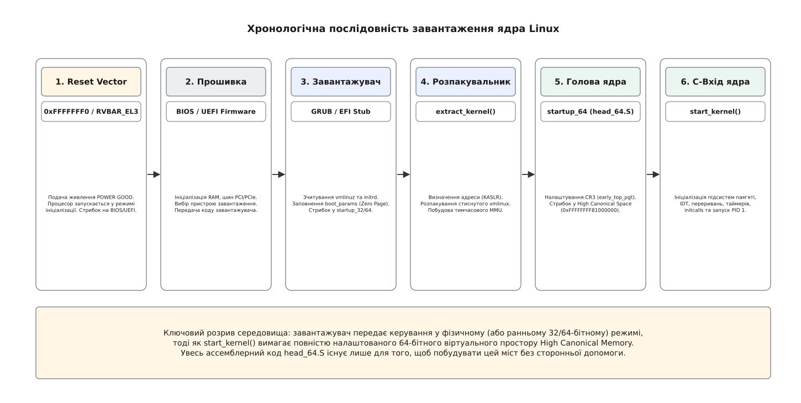
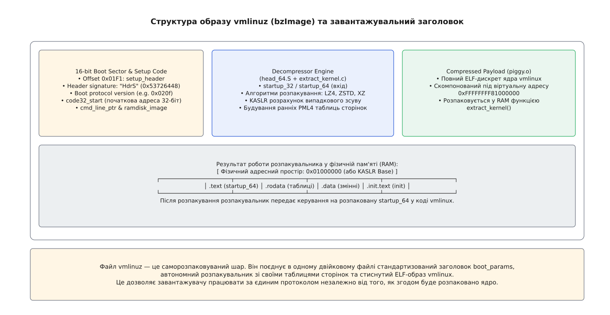
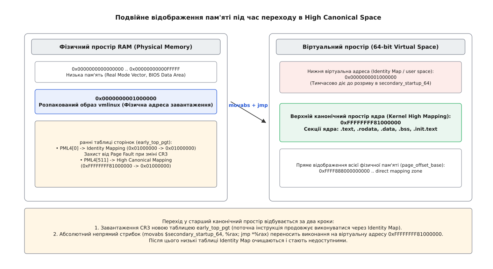

# Завантаження ядра: від вектора скидання процесора до start_kernel

<preknowlist>
- [Ланцюг завантаження](root:sys-unix/boot-chain) — від прошивки до першого процесу керування передають по черзі, і кожна ланка знає лише свого наступника.
- [Завантажувач і командний рядок ядра](root:sys-unix/bootloader-and-cmdline) — завантажувач готує пам'ять, передає структурами параметри й передає керування на точку входу.
- [ELF: сегменти, секції, точка входу](root:sys-unix/elf-structure) — розміщення коду в пам'яті, віртуальні адреси й точки виконання.
- [Прошивка UEFI](root:sys-unix/uefi-firmware) — робота прошивки в 64-бітному режимі та передача Boot Services / EFI Handover Protocol.
- [Таблиці сторінок і підсистема MMU](root:sf-os/paging-and-mmu) — віртуальна пам'ять, трансляція адрес і багаторівневі таблиці сторінок.
- [Ядро й простір користувача](root:sys-unix/kernel-and-userspace) — межа між привілейованим кодом ядра та звичайними програмами.
</preknowlist>

Сигнал живлення `POWER GOOD` подано на лінію скидання процесора, і кристал транзисторів починає свій найперший такт. У цей момент у оперативній пам'яті (RAM) немає жодної інструкції ядра Linux, підсистема віртуальної пам'яті вимкнена, кеші процесора L1/L2/L3 неініціалізовані, а в реєстрах центрального процесора записано апаратний стан за замовчуванням. Менше ніж за секунду на цій самій машині запрацює 64-бітне ядро з тисячами потоків, багатством пристроїв і повністю ізольованою віртуальною пам'яттю.

Перехід від найпершого електричного стану силікону до виконання C-коду функції `start_kernel()` є складним ланцюгом передачі керування між апаратурою, прошивкою, завантажувачем та ассемблерним заголовком ядра. Головна проблема цього переходу полягає в глибокому розриві між середовищем, у якому запускається процесор, і середовищем, якого вимагає ядро. Завантажувач залишає процесор у фізичному або ранньому віртуальному адресному просторі, тоді як ядро Linux скомпоноване для виконання у верхній канонічній віртуальній пам'яті (High Canonical Address Space) за адресою `0xFFFFFFFF81000000`. Усе розпакування та початковий ассемблерний код ядра існують лише для того, щоб побудувати цей міст без жодної зовнішньої допомоги.



*Завантаження ядра складається з шести послідовних фаз: від апаратного вектора скидання процесора через прошивку, завантажувач та розпакувальник до першої C-функції start_kernel().*

## 1. Апаратний вектор скидання (Reset Vector)

Під час подачі живлення або апаратного перезавантаження материнська плата утримує лінію `RESET` процесора в активній напрузі доти, доки джерело живлення не стабілізує вихідні напруги і не виставить сигнал `POWER GOOD`. Коли лінія `RESET` відпускається, процесор виконує внутрішній мікрокод апаратної ініціалізації регістрів (Hardware Reset State).

На архітектурі x86_64 процесор після скидання починає працювати у так званому реальному режимі ініціалізації (Real Mode). Апаратний стан регістрів задається кремнієм наступним чином:

```
CR0 = 0x60000010 (Paging Disabled, Protection Disabled)
CS  = 0xF000 (Base = 0xFFFF0000, Limit = 0xFFFF)
IP  = 0xFFF0
EIP = 0x0000FFF0
```

Хоча програміст у 16-бітному режимі бачить у регістрі CS значення `0xF000`, а в IP — `0xFFF0`, прихована частина сегментного регістра CS (Shadow Descriptor Cache або Descriptor Cache) ініціалізується базовою адресою `0xFFFF0000`. Фізична адреса першої виконаної інструкції обчислюється апаратно:

```
Physical Address
= CS.Base + EIP             [сегментна адресація x86: сума базової адреси та зсуву]
= 0xFFFF0000 + 0x0000FFF0   [підстановка апаратних початкових значень після зняття RESET]
= 0xFFFFFFF0                [результат: фізична адреса вектора скидання за 16 байтів до 4 ГБ]
```

Адреса `0xFFFFFFF0` називається **вектором скидання x86** (Reset Vector). Вона лежить рівно за 16 байтів до верхньої межі 4 Гігабайтів 32-бітного фізичного простору. Системна плата відображає мікросхему спадкового BIOS або UEFI Flash ROM саме в цю верхню область пам'яті. За цією адресою завжди лежить інструкція далекого безумовного стрибка (`jmp far`), яка переносить виконання на початок процедур перевірки обладнання (POST — Power-On Self-Test).

Під час запуску багатопроцесорних систем (SMP — Symmetric Multiprocessing) фізичний сигнал `RESET` приходить на всі ядра одночасно. Проте лише одне ядро обирається як **основний завантажувальний процесор** (BSP — Bootstrapping Processor). Вибір відбувається за допомогою опитування вбудованого контролера переривань APIC (Local APIC): ядро, яке першим зчитує прапор `BSP` у специфічному регістрі моделі `MSR IA32_APIC_BASE` (біт 8), продовжує виконання вектора скидання, тоді як усі інші ядра (AP — Application Processors) переходять у стан пасивного очікування (Wait-For-SIPI State) до отримання міжпроцесорного переривання запусків від ядра.

Прошивка BIOS чи UEFI виконує перевірку контрольних сум оперативної пам'яті, тестує шини PCI Express, ініціалізує графічний адаптер і готує таблиці опису обладнання ACPI (Advanced Configuration and Power Interface). Після цього прошивка опитує конфігурацію пристроїв завантаження (жорсткі диски, NVMe-накопичувачі, мережеві адаптери) і знаходить перший завантажувальний сектор або виконувальний EFI-файл завантажувача.

Для архітектури ARM64 поняття вектора скидання є аналогічним, але реалізоване через специфічний регістр `RVBAR_EL3` (Reset Vector Base Address Register). При знятті сигналу скидання процесор ARM64 починає виконання з адреси, вказаної у `RVBAR_EL3` (зазвичай `0x00000000`), знаходячись на найвищому рівні привілеїв EL3 (Exception Level 3 / Secure Monitor). У подальшому прошивка ARM Trusted Firmware (ATF) переводить процесор у режим EL2 (Hypervisor Mode) або EL1 (Kernel Mode) і готує середовище для завантаження ядра Linux.

Докладніше про те, як 16-бітні обмеження перших процесорів 8086 сформували протоколи завантаження та як вентиль A20 тривалий час залишався головним бар'єром пам'яті, описано в [Історія x86: від вектора 8086 і лінії A20 до EFI Stub](root:sys-unix/kernel-boot-process-from-reset-vector-to-start-kernel/hist-real-mode-legacy-boot.md).

## 2. Передача естафети: завантажувач та Zero Page

Прошивка (BIOS або UEFI) проводить ініціалізацію контролера пам'яті, оперативної пам'яті, шин PCI Express та периферії, знаходить пристрій завантаження і передає керування завантажувачу (GRUB2, systemd-boot або EFI Stub).

Завдання завантажувача — прочитати з диска файл ядра `vmlinuz` (або `bzImage`), покласти його у RAM, виділити пам'ять під тимчасовий файловий корінь `initramfs` та підготувати структуру даних **`boot_params`**, також відому як Zero Page.



*Образ vmlinuz поєднує в собі 16-бітний/32-бітний заголовок boot_params, автономний код розпакування та стиснуте ядро vmlinux.*

Файл `vmlinuz` не є монолітним виконуваним файлом. Це двошаровий масив: на початку файла лежить 16-бітний/32-бітний заголовок і код розпакувальника, а в середині — стиснутий алгоритмом ZSTD або LZ4 бінарний образ самого ядра `vmlinux`.

Завантажувач зчитує заголовок ядра `setup_header` за зсувом `0x01F1` у файлі і перевіряє магічну сигнатуру `"HdrS"` (`0x53726448`). Якщо сигнатура збігається, завантажувач заповнює наступні обов'язкові параметри у Zero Page:

1. **`cmd_line_ptr`**: 32-бітна або 64-бітна фізична адреса текстового рядка командного рядка ядра (наприклад, `root=/dev/nvme0n1p2 ro quiet console=ttyS0,115200n8`).
2. **`ramdisk_image`** та **`ramdisk_size`**: фізична адреса та розмір завантаженого в пам'ять архіву `initramfs`. Завантажувач обирає адресу розміщення initramfs так, щоб вона не перевищувала ліміт `initrd_addr_max` (зазвичай `0x7FFFFFFF` / 2 ГБ у 32-бітному режимі або довільна 64-бітна адреса в сучасних версіях протоколу).
3. **`e820_table`**: таблиця фізичної мапи пам'яті E820, що описує придатні для використання ділянки RAM, зарезервовані зони BIOS, регіони ACPI NVS та енергонезалежну пам'ять NVDIMM.
4. **`screen_info`**: структура параметрів відеорежиму (VESA VBE або UEFI GOP - Graphics Output Protocol), включаючи базову фізичну адресу лінійного відеобуфера `lfb_base`, роздільну здатність екрана та бітову глибину кольору.

Якщо завантаження здійснюється на сучасній UEFI-системі через **Linux EFI Boot Stub**, ядро запускається безпосередньо прошивкою UEFI як 64-бітний виконуваний файл PE/COFF. У цьому випадку `efi_pe_entry` викликає функції UEFI Boot Services (`GetMemoryMap()`, `AllocatePages()`), самостійно будує структуру `boot_params` у пам'яті, після чого викликає `ExitBootServices()`, щоб припинити роботу сервісів прошивки і звільнити зайву пам'ять для ядра.

Повний перелік полів, прапорів завантаження та зсувів структури Zero Page міститься у [Специфікація boot_params та setup_header](root:sys-unix/kernel-boot-process-from-reset-vector-to-start-kernel/api-boot-params-header.md). Перевірити валідність цих даних та прочитати заголовок з довільного файла ядра можна за допомогою утиліти з [Парсер заголовка bzImage / vmlinuz](root:sys-unix/kernel-boot-process-from-reset-vector-to-start-kernel/proj-parse-vmlinuz-header.md).

Після підготовки Zero Page завантажувач записує її фізичну адресу в регістр `rsi` (або `x0` на ARM64) і виконує безумовний стрибок на точку входу розпакувальника `code32_start` (зазвичай `0x100000` / 1 МБ) або через EFI Handover Protocol.

> 🔧 **Навіщо потрібен шар розпакування.**
> Образ ядра `vmlinux` у нестисненому вигляді разом із таблицями відлагодження може важити понад 50–100 Мегабайтів. Завдяки декомпресору `vmlinuz` займає лише 10–15 Мегабайтів на диску, що прискорює читання з повільних носіїв у кілька разів. Окрім декомпресії, цей код визначає випадкову адресу розміщення ядра в RAM для захисту KASLR (Kernel Address Space Layout Randomization) та готує перші таблиці сторінок.

## 3. Робота автономного розпакувальника (`extract_kernel`)

Керування потрапляє на першу інструкцію розпакувальника — точку входу `startup_32` або `startup_64` у файлі `arch/x86/boot/compressed/head_64.S`.

У цей момент процесор виконує код у нижній пам'яті. Код розпакувальника мусить бути повністю самодостатнім: він не має у своєму розпорядженні ані готових таблиць сторінок ядра, ані стандартної бібліотеки C, ані працюючих системних викликів.

Розпакувальник виконує наступні підготовчі дії:

1. **Вимкнення переривань та скидання прапорів**: виконання інструкцій `cli` (Clear Interrupt Flag) та `cld` (Clear Direction Flag), щоб гарантувати, що жодне апаратне переривання не зіб'є виконання до ініціалізації IDT.
2. **Перевірка релокації (KASLR)**: якщо в конфігурації ядра увімкнено KASLR, розпакувальник опитує генератор випадкових чисел (RDRAND або таймер TSC) і знаходить вільний діапазон у фізичній пам'яті, куди буде розпаковано ядро.
3. **Побудова ранніх таблиць сторінок для 64-бітного режиму**: якщо завантажувач передав керування у 32-бітному режимі, `head_64.S` створює мінімальні таблиці сторінок (PML4, PUD, PMD), вмикає розширення фізичних адрес `CR4.PAE = 1`, встановлює біт Long Mode у специфічному регістрі моделі `MSR IA32_EFER.LME = 1` та вмикає сторінкову адресацію `CR0.PG = 1`.
4. **Перехід у 64-бітний Long Mode**: через далеке повернення `lretq` процесор завантажує 64-бітний CS-селектор і опиняється у повноцінному 64-бітному режимі.

Після налаштування стек переноситься у тимчасовий буфер, і виконується виклик C-функції `extract_kernel()` з файла `arch/x86/boot/compressed/misc.c`:

```c
asmlinkage __visible void *extract_kernel(void *rmode, unsigned char *heap,
                                  unsigned char *input_data,
                                  unsigned long input_len,
                                  unsigned long output,
                                  unsigned long output_len)
{
    /* 1. Налаштувати рання консоль друку (earlyprintk / serial) */
    sanitize_boot_params(rmode);
    
    /* 2. Знайти випадкове місце для KASLR */
    choose_random_location((unsigned long)input_data, input_len,
                           &output, output_len, &virt_addr);

    /* 3. Розпакувати стиснутий payload (piggy.o) у фізичну пам'ять */
    __decompress(input_data, input_len, NULL, NULL, output, output_len,
                 NULL, error);

    /* 4. Повернути фізичну адресу розпакованого коду vmlinux */
    return (void *)output;
}
```

Під час виконання `__decompress()` викликається вибрана під час конфігурації ядра функція розпакування (ZSTD, LZ4, XZ або GZIP). Декомпресор зчитує вхідні байти з `piggy.o` та записує розпаковані секції ядра безпосередньо у фізичну пам'ять за адресою `output` (зазвичай `0x01000000` / 16 Мегабайтів або KASLR-зсувом).

Розпакований код являє собою справжній виконуваний ELF-образ ядра `vmlinux`. Розпакувальник завершує свою роботу і виконує безумовний стрибок на розпаковану інструкцію `startup_64` у `arch/x86/kernel/head_64.S`.

## 4. Вхід у необмежене ядро (`head_64.S`)

Точка входу `startup_64` у файлі `arch/x86/kernel/head_64.S` — це найперший ассемблерний код **розпакованого ядра**.

У цей момент виникає фундаментальне просторове роздвоєння:
- Компонувальник (linker) зібрав код `vmlinux` розраховуючи, що всі символи та функції лежать у верхньому канонічному просторі віртуальних адрес `0xFFFFFFFF81000000`.
- Процесор зараз виконує ці інструкції за їхньою **фізичною адресою** в RAM (наприклад, `0x01000000` або KASLR-базою).

Якщо зараз використати інструкцію з прямою адресацією символу (наприклад, `call start_kernel`), процесор спробує виконати код за адресою `0xFFFFFFFF81000000`. Якщо таблиці сторінок ще не налаштовані на цю адресу, процесор негайно згенерує фатальну помилку Третьої Спадкової Помилки (Triple Fault) і перезавантажить систему.

Щоб розв'язати цю суперечність, `head_64.S` будує ранню таблицю сторінок `early_top_pgt` за принципом **подвійного відображення** (Identity + High Canonical Mapping).



*Таблиця early_top_pgt одночасно відображає низькі фізичні адреси самі на себе (Identity Map) та на верхній канонічний простір ядра.*

Як видно зі схеми, рання таблиця сторінок `early_top_pgt` заповнюється двома ключовими записами:

1. **Identity Mapping (`PML4[0]`)**: відображає віртуальну адресу `0x0000000001000000` на фізичну адресу `0x01000000`. Це необхідно для того, щоб інструкція, яка виконується в момент запису в регістр `CR3`, не викликала Page Fault, оскільки її поточна адреса в лічильнику інструкцій (PC) залишається валідною у нижньому адресному просторі.
2. **Kernel High Mapping (`PML4[511]`)**: відображає віртуальну адресу `0xFFFFFFFF81000000` на ту саму фізичну адресу `0x01000000`.

Для відображення великих обсягів коду ядро використовує 2-мегабайтні сторінки (Huge Pages), що дозволяє заповнити лише рівні PML4, PUD та PMD, не витрачаючи пам'ять на окремі таблиці PTE.

Детальний бітовий розрахунок зсувів, індексів масок та математичний розбір трансляції адрес наведено у [Розрахунок раннього транслятора адрес і таблиць сторінок](root:sys-unix/kernel-boot-process-from-reset-vector-to-start-kernel/math-early-paging-layout.md).

Код ассемблера завантажує адресу `early_top_pgt` у керівний регістр `CR3`:

```assembly
/* Завантаження фізичної адреси ранньої PML4 в CR3 */
movq %rax, %cr3
```

Після цього процесор може звертатися до ядра за обома адресами. Тепер робиться вирішальний абсолютний непрямий стрибок у верхній простір пам'яті:

```assembly
/* Завантаження віртуальної адреси функції secondary_startup_64 у RAX */
movabs $secondary_startup_64, %rax
/* Стрибок за віртуальною адресою 0xFFFFFFFF81000000... */
jmp *%rax
```

Щойно інструкція `jmp *%rax` виконується, лічильник інструкцій процесора (RIP) опиняється в області `0xFFFFFFFF81xxxxxx`. Перший процес завантаження остаточно перейшов у віртуальний простір ядра.

Опинившись у верхній пам'яті, код `secondary_startup_64` виконує фінальне прибирання:
- Очищає запис `PML4[0]`, знищуючи Identity Mapping, щоб простір користувача випадково не міг зчитувати код ядра через низькі адреси.
- Скидає буфер трансляції адрес (TLB) за допомогою перезавантаження `CR3` або інструкцій `invlpg`.
- Налаштовує перший стек ядра, вказуючи регістр `rsp` на область `init_thread_union + THREAD_SIZE`.
- Налаштовує глобальну таблицю дескрипторів (GDT) ядра та завантажує регістр `GDTR`.
- Скидає регістр прапорів `RFLAGS` у 0.

## 5. Фінальний крок: передача керування в `start_kernel()`

Після налаштування стека та віртуальної пам'яті ассемблерний код `head_64.S` викликає першу C-функцію архітектурної ініціалізації `x86_64_start_kernel()`:

```c
asmlinkage __visible void __init x86_64_start_kernel(char *realmode_data)
{
    /* 1. Очистити секцію BSS (Uninitialized Data) */
    memset(__bss_start, 0, __bss_stop - __bss_start);

    /* 2. Скопіювати boot_params із низької пам'яті у безпечну область ядра */
    copy_bootdata((char *)realmode_data);

    /* 3. Налаштувати ранню глобальну таблицю дескрипторів (GDT) та IDT */
    switch_to_new_gdt(0);

    /* 4. Передати керування в архітектурно-незалежну функцію start_kernel() */
    start_kernel();
}
```

Коли керування входить у функцію `start_kernel()` у файлі `init/main.c`, стан системи характеризується наступними апаратними та програмними факторами:

- **Переривання вимкнені (`cli`)**: жоден апаратний таймер чи пристрій ще не може перервати потік виконання.
- **MMU увімкнений**: процесор працює в 64-бітному режимі з таблицями сторінок `early_top_pgt`.
- **Працює лише один процесор (BSP — Bootstrapping Processor)**: усі інші ядра CPU (AP — Application Processors) перебувають у стані пасивного очікування (Halt / INIT IPI).
- **Немає жодного процесу та планировщика**: потік виконання спирається на стек `init_task` (PID 0, idle process).

Усередині `start_kernel()` послідовно виконуються такі ключові етапи:
1. `setup_arch(&command_line)` — розбір архітектурних параметрів, ініціалізація `memblock` та E820.
2. `trap_init()` та `init_IRQ()` — підготовка векторів переривань IDT та контролерів APIC/IO-APIC.
3. `mm_init()` — перехід від раннього розподільника `memblock` до повноцінного Buddy Allocator та Slab/Slub allocators.
4. `time_init()` — калібрування таймерів TSC, HPET та clockevents.
5. `arch_call_rest_init()` -> `rest_init()` — створення перших ядерних потоків `kernel_init` (PID 1) та `kthreadd` (PID 2).

З цієї миті починається підсистема initcalls, яка завершиться моментом, коли процес PID 1 виконає виклик `execve()` і передасть керування першій програмі простору користувача — **`/sbin/init` або `systemd`**.
