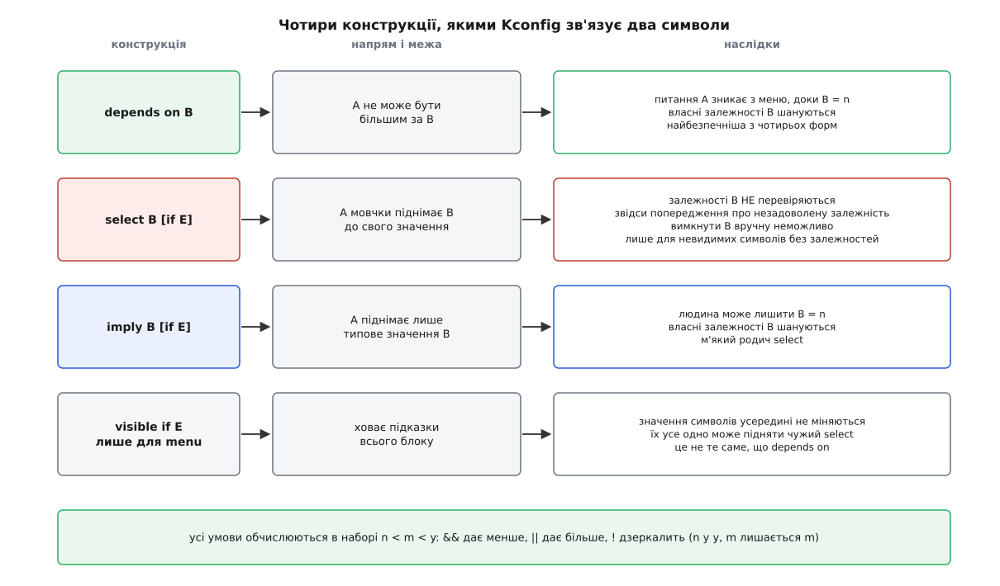

# 📋 Мова Kconfig і цілі `make`: повний перелік конструкцій

Ця довідка тримає в одному місці те, що доводиться шукати наново щоразу: усі записи й атрибути мови, якою в дереві ядра оголошено перемикачі, правила обчислення умов у наборі `n < m < y`, форму рядків файлу `.config` і перелік цілей `make` разом зі змінними оточення, які на них впливають. Потрібна вона в мить, коли треба не зрозуміти задум, а написати правильний рядок у власному `Kconfig` чи згадати, чим `oldconfig` відрізняється від `olddefconfig`.

Усе описане звірено з деревом ядра станом на серпень 2026 року; там, де конструкція з'явилася або зникла недавно, версію названо окремо.

## Записи: із чого складається файл Kconfig

Файл `Kconfig` — плаский текст із записів. Кожен новий запис завершує попередній; вкладеність задають не дужки, а блоки `menu` та `if`.

| запис | форма | що робить |
|---|---|---|
| `config` | `config <СИМВОЛ>` + атрибути | оголошує символ; у `.config` він стане рядком `CONFIG_<СИМВОЛ>` |
| `menuconfig` | `menuconfig <СИМВОЛ>` + атрибути | те саме, але підказує фронтендові показати підпорядковані символи окремим списком; ті мусять мати `depends on` на цей символ, інакше вкладеності не вийде |
| `choice` … `endchoice` | блок із `config`-записів усередині | група взаємовиключних варіантів, з якої вмикають рівно один; самому блоку дозволено лише `prompt`, `default`, `depends on` і `help` |
| `menu` … `endmenu` | `menu "<підказка>"` + блок | меню; самому блоку дозволено лише залежності й `visible if` |
| `if` … `endif` | `if <вираз>` + блок | дописує `<вираз>` до залежностей усього, що всередині |
| `comment` | `comment "<текст>"` | рядок-пояснення; його бачить людина в меню, і він же потрапляє у вихідні файли |
| `source` | `source "<шлях>"` | читає інший файл; шлях — від кореня дерева, дозволено підставляння змінних виду `$(SRCARCH)` |
| `mainmenu` | `mainmenu "<підказка>"` | заголовок вікна фронтенда; трапляється лише в кореневому `Kconfig` |

Ось як ці записи виглядають разом:

```
mainmenu "Моя підсистема"

menu "Драйвери шини"
	visible if EXPERT

config MYBUS
	tristate "Підтримка MYBUS"
	depends on PCI
	help
	  Кілька рядків довідки з відступом більшим, ніж у слова help.

if MYBUS

config MYBUS_DEBUG
	bool "Налагоджувальні перевірки"
	depends on DEBUG_KERNEL

choice
	prompt "Режим передавання"
	default MYBUS_DMA

config MYBUS_DMA
	bool "DMA"

config MYBUS_PIO
	bool "PIO"

endchoice

endif # MYBUS

comment "Апаратне прискорення недоступне: потрібен CRYPTO"
	depends on !CRYPTO

endmenu
```

## Типи символів

Тип оголошують одним словом; ним же зазвичай одразу задають підказку.

| тип | набір значень | рядок у `.config` | що з'явиться в `autoconf.h` |
|---|---|---|---|
| `bool` | `n`, `y` | `CONFIG_X=y` або `# CONFIG_X is not set` | `#define CONFIG_X 1` — або нічого |
| `tristate` | `n`, `m`, `y` | `CONFIG_X=m` | `#define CONFIG_X_MODULE 1` |
| `string` | текст | `CONFIG_X="-mykernel"` | `#define CONFIG_X "-mykernel"` |
| `hex` | шістнадцяткове число | `CONFIG_X=0x1000000` | `#define CONFIG_X 0x1000000` |
| `int` | десяткове число | `CONFIG_X=64` | `#define CONFIG_X 64` |

Три наслідки з цієї таблиці.

Стан `m` існує лише тоді, коли ввімкнено символ, позначений атрибутом `modules` — у дереві ядра це `CONFIG_MODULES`. Вимкніть його, і всі `tristate` по всьому дереву поводяться як `bool`, бо [окремих файлів `.ko`, які довантажують у вже запущене ядро](topic:sys-unix/kernel-modules), просто не буде кому вантажити.

У логічних виразах символ типу `string`, `hex` чи `int` завжди дає `n`. Тобто `depends on MYSTRING` — не «якщо рядок непорожній», а тверде `n`; порівнювати такі символи можна лише явно, через `=` або `<`.

Обмеження `range` застосовне тільки до `int` і `hex`; на `string` його немає взагалі.

## Атрибути запису

| атрибут | форма | дія |
|---|---|---|
| тип із підказкою | `bool "<текст>"`, `tristate "<текст>"`, `int "<текст>"` … | оголошує тип і одразу задає підказку |
| `prompt` | `prompt "<текст>" ["if" <вираз>]` | підказка окремим рядком; **символ без підказки невидимий** — його значення визначають тільки інші символи |
| `default` | `default <вираз> ["if" <вираз>]` | значення, якщо людина не відповіла; записів `default` може бути кілька, діє **перший видимий** |
| `def_bool`, `def_tristate` | `def_bool <вираз> ["if" <вираз>]` | тип і `default` одним рядком; підказки не дає, тож символ виходить невидимим |
| `depends on` | `depends on <вираз>` | ховає питання, доки вираз `n`, і ставить **стелю** значенню символу |
| `select` | `select <СИМВОЛ> ["if" <вираз>]` | зворотна залежність: піднімає названий символ до свого значення |
| `imply` | `imply <СИМВОЛ> ["if" <вираз>]` | слабка зворотна залежність: піднімає лише типове значення |
| `visible if` | `visible if <вираз>` | **лише для `menu`**: ховає підказки всього блоку, значень не змінює |
| `range` | `range <низ> <верх> ["if" <вираз>]` | межі для `int` і `hex`; межі теж можна задавати символами |
| `help` | `help` і далі текст з більшим відступом | довідка; межу блоку визначає відступ |
| `modules` | `modules` | оголошує цей символ тим, що вмикає третій стан для всього дерева |
| `transitional` | `transitional` | символ читають зі старого `.config`, але **в новий не пишуть**; крім `help`, інших атрибутів мати не може |

Кілька уточнень, без яких таблиця бреше.

`default` не прив'язаний до місця оголошення: типове значення символу дозволено дописати з іншого файлу, і в дереві так роблять, коли архітектура хоче іншого типового значення, ніж загальний код. Якщо видимих `default` кілька, працює перший за порядком читання файлів, а не «найточніший».

Типове значення нового символу, коли `default` не написано взагалі, — `n`. Документація ядра пояснює це буквально одним реченням: щоб збірка не розпухала; нові символи цього правила міняти не мусять.

`transitional` — наймолодший атрибут, він з'явився у 6.18 і розв'язує одну вузьку задачу: перейменування символу так, щоб не поламати чужих конфігурацій. Старий символ лишають у дереві з єдиним словом `transitional`, а новий отримує `default OLD_NAME`; тоді `olddefconfig` перенесе відповідь зі старого імені на нове, а в записаний файл старе ім'я вже не потрапить. Першим його вжитком у дереві стало перейменування `CFI_CLANG` на `CFI`, коли ядро почало готуватися до підтримки контролю потоку керування ще й у GCC.

## Чотири способи зв'язати два символи

Плутанина між `depends on`, `select` та `imply` — головне джерело зіпсованих конфігурацій, тож варто бачити їх поруч.



*Чотири конструкції розв'язують чотири різні задачі: обмежити згори власне значення, підняти чуже, підказати чуже й прибрати блок з очей. Плутають зазвичай другу з першою — і саме звідти беруться конфігурації, яких не мало б існувати.*

Ті самі відмінності коротко, для запису `A`, що згадує символ `B`:

| конструкція | що змінює | залежності `B` шануються | людина може лишити `B = n` |
|---|---|---|---|
| `depends on B` | тільки власне значення `A`: ставить йому стелю | так — `A` не зможе піднятися вище за `B` | так |
| `select B` | піднімає `B` до значення `A` | **ні** | ні |
| `imply B` | піднімає типове значення `B` | так | так |
| `visible if E` | тільки видимість блоку | — | так, значень не чіпає взагалі |

Коли `select` порушив залежності цілі, Kconfig друкує попередження й **не спиняє роботи** — збірка впаде пізніше, на лінкуванні, і зовсім в іншому місці. Форма попередження стала, і її варто впізнавати:

```
WARNING: unmet direct dependencies detected for USB_ULPI_BUS
  Depends on [n]: USB_SUPPORT [=n]
  Selected by [y]:
  - PHY_QCOM_QUSB2 [=y] && ARCH_QCOM [=y]
```

Читається так: символ `USB_ULPI_BUS` вимагає `USB_SUPPORT`, якого немає, — але `PHY_QCOM_QUSB2` увімкнув його своїм `select`, не спитавши нікого. Щоб таке попередження стало помилкою й зупинило роботу, є змінна `KCONFIG_WERROR`.

## Обчислення виразів

Граматика виразу, за спаданням пріоритету:

```
<вираз> ::= <символ>                      (1)
          | <символ> '='  <символ>        (2)
          | <символ> '!=' <символ>        (3)
          | <символ> '<'  <символ>        (4)
          | <символ> '>'  <символ>        (4)
          | <символ> '<=' <символ>        (4)
          | <символ> '>=' <символ>        (4)
          | '(' <вираз> ')'               (5)
          | '!' <вираз>                   (6)
          | <вираз> '&&' <вираз>          (7)
          | <вираз> '||' <вираз>          (8)
```

| правило | результат |
|---|---|
| (1) сам символ | його значення; символ типу `string`, `hex` чи `int` дає `n` |
| (2) `=` | `y`, якщо рядкові подання рівні, інакше `n` |
| (3) `!=` | `n`, якщо рівні, інакше `y` |
| (4) `<` `>` `<=` `>=` | `y` або `n`; два числові символи порівнюються як числа, решта — як рядки |
| (5) дужки | змінюють порядок обчислення |
| (6) `!` | `2 − вираз`: `n` стає `y`, `y` стає `n`, `m` лишається `m` |
| (7) кон'юнкція | менше з двох значень |
| (8) диз'юнкція | більше з двох значень |

Уся арифметика тримається на тому, що три значення впорядковані, а два двомісні оператори — це просто мінімум і максимум на цьому порядку:

```
n = 0        m = 1        y = 2

!n = y       !m = m       !y = n

  A && B  =  min(A, B)          A || B  =  max(A, B)

  &&   n    m    y              ||   n    m    y
  n    n    n    n              n    n    m    y
  m    n    m    m              m    m    m    y
  y    n    m    y              y    y    y    y
```

`depends on` не просто ховає питання — воно ставить символові стелю, і саме звідси беруться найчастіші непорозуміння.

**Умова: символ `FOO` оголошено `tristate`, у нього `depends on BAR`, і `BAR=m`.**

```
стеля для FOO   = значення виразу «BAR» = m
дозволено FOO   = n, m
заборонено FOO  = y — у меню такого варіанта просто не запропонують
```

Причина фізична: вбудований в образ код не має чим викликати функцію з модуля, бо в мить лінкування того модуля в образі немає. Тому й потрібна ідіома `depends on BAR || !BAR`: при `BAR=n` вираз дає `y` і стелі нема, при `BAR=y` теж `y`, а при `BAR=m` стеля опускається до `m`.

## Викинуті конструкції

Старі приклади й старі поради живуть довго, тож ось те, чого писати вже не можна.

| що | навіщо було | стан |
|---|---|---|
| `boolean` | давній синонім `bool` | прибрано з мови; писати `bool` |
| `optional` у `choice` | дозволяв не вибрати жодного варіанта | прибрано у 6.10; замість нього до блоку додають явний варіант-порожняк на кшталт `LTO_NONE` чи `DEBUG_INFO_NONE` |
| `option allnoconfig_y` | символ ставав `y` навіть при `allnoconfig` | прибрано разом з останнім вжитком |
| `option env="ІМ'Я"` | втягував змінну оточення в символ | замінено прямим підставлянням `$(ІМ'Я)` у виразах |
| `option defconfig_list` | перелік файлів-заготовок | замінено змінною оточення `KCONFIG_DEFCONFIG_LIST` |
| `option modules` | позначка символу `MODULES` | тепер це власний атрибут `modules` без слова `option` |

## Формат `.config`

Файл навмисно примітивний, і кожне правило в ньому має свою причину.

| форма рядка | значення |
|---|---|
| `CONFIG_X=y` | символ увімкнено; для `tristate` буває ще `=m` |
| `# CONFIG_X is not set` | на питання **відповіли** `n` — це не те саме, що відсутність рядка |
| відсутність рядка | питання ще не ставили; саме за цією різницею `oldconfig` знає, про що питати |
| `CONFIG_X="текст"` | рядкове значення; усередині лапок `"` і `\` екрановані зворотною похилою |
| `CONFIG_X=64`, `CONFIG_X=0x1000000` | числове значення в десятковій або шістнадцятковій формі |
| `#` з довільним текстом | назва меню або запис `comment` з дерева питань |

Шапку пише сам Kconfig, і вона теж інформативна:

```
#
# Automatically generated file; DO NOT EDIT.
# Linux/x86 6.16.0 Kernel Configuration
#
CONFIG_CC_VERSION_TEXT="gcc (GCC) 14.2.1"
CONFIG_CC_IS_GCC=y
CONFIG_GCC_VERSION=140201
```

Рядки з `#` угорі називають архітектуру й версію дерева, з яким цей файл узгоджено. Далі одразу йдуть символи, яких ніхто не обирав: Kconfig сам питає компілятор про його можливості й записує відповіді як звичайні перемикачі. Тому `.config`, перенесений на машину з іншим компілятором, після `make oldconfig` зміниться навіть тоді, коли ви не торкнулися жодного питання.

Ім'я `.config` — типове, його перебиває `KCONFIG_CONFIG`. Попередній вміст фронтенди зберігають поруч як `.config.old`; саме цю пару без аргументів порівнює `diffconfig`.

**Мінімальна форма.** `make savedefconfig` пише файл `./defconfig`, у якому лишаються тільки рядки, що відрізняються від типових значень. Рядок `# CONFIG_X is not set` у ньому з'являється лише там, де типовим було `y` чи `m`, а ви відповіли `n`. Наскільки файл схудне, залежить від бази: `defconfig` плати — це сотні рядків замість десяти тисяч, дистрибутивна конфігурація лишається великою, бо тисячі драйверів у ній свідомо виставлено в `m`. В обох випадках у файлі немає жодного рядка, якого ніхто не обирав, — тому саме його кладуть у git поруч із кодом.

## Що народжується з `.config`

Крок `make syncconfig` перекладає відповіді на мови всіх, хто збиратиме. Робиться це самою збіркою, руками цю ціль викликати не треба.

| файл | для кого | вміст |
|---|---|---|
| `include/generated/autoconf.h` | компілятор C | `#define` на кожен установлений символ |
| `include/config/auto.conf` | `make` | ті самі значення у вигляді змінних `make` |
| `include/config/auto.conf.cmd` | `make` | перелік усіх прочитаних файлів `Kconfig` — щоб правка будь-якого з них сама запустила переконфігурування |
| `include/config/<символ>` | `fixdep` | порожній файл-позначка на кожен символ; змінився символ — оновилася лише його позначка |
| `include/generated/rustc_cfg` | `rustc` | ті самі значення у вигляді прапорців `--cfg` |

Шляхи перших двох і останнього перебиваються змінними `KCONFIG_AUTOHEADER`, `KCONFIG_AUTOCONFIG` і `KCONFIG_RUSTCCFG`.

Ключова дрібниця перекладу в C: значення `m` дає **інше ім'я макроса**. `CONFIG_FOO=y` породжує `#define CONFIG_FOO 1`, а `CONFIG_FOO=m` — `#define CONFIG_FOO_MODULE 1`. Через це [звичайна перевірка препроцесора](topic:sf-lang/preprocessor-macros) `#ifdef CONFIG_FOO` мовчки хибна для всього, що зроблено модулем, і саме тому в ядрі є три окремі макроси:

```c
IS_ENABLED(CONFIG_FOO)   /* 1 при y і при m */
IS_BUILTIN(CONFIG_FOO)   /* 1 лише при y    */
IS_MODULE(CONFIG_FOO)    /* 1 лише при m    */
```

Ті самі три випадки в коді на Rust розрізняють не окремими макросами, а значенням:

```rust
#[cfg(CONFIG_FOO)]        // увімкнено: y або m
#[cfg(CONFIG_FOO = "y")]  // лише вбудовано
#[cfg(CONFIG_FOO = "m")]  // лише модулем
#[cfg(not(CONFIG_FOO))]   // вимкнено
```

А в `make` те саме значення підставляють просто в ім'я змінної:

```make
obj-$(CONFIG_FOO)		+= foo.o
foo-$(CONFIG_FOO_DEBUG)		+= debug.o
```

## Цілі `make`

### Правити наявну конфігурацію руками

| ціль | фронтенд |
|---|---|
| `config` | послідовне опитування рядок за рядком; жодних залежностей, працює будь-де |
| `menuconfig` | текстове меню — найуживаніше; пошук за символом відкриває клавіша `/` |
| `nconfig` | новіший текстовий фронтенд: підказки на функційних клавішах, довідка й пошук просто у вікні |
| `xconfig` | віконний фронтенд на Qt |
| `gconfig` | віконний фронтенд на GTK+ |

### Створити конфігурацію з нуля

| ціль | що дає |
|---|---|
| `defconfig` | заготовку, яку супровідники архітектури вважають розумною типовою |
| `<ім'я>_defconfig` | названу заготовку з `arch/<архітектура>/configs/<ім'я>_defconfig` |
| `alldefconfig` | усі символи в їхні типові значення |
| `allnoconfig` | усе, що можна, у `n` |
| `allyesconfig` | усе, що можна, у `y` |
| `allmodconfig` | усе, що вміє бути модулем, у `m` |
| `randconfig` | випадкові відповіді — головний інструмент пошуку сполучень, які не складаються |
| `tinyconfig` | найменше ядро, яке взагалі складається: `allnoconfig` плюс фрагменти `kernel/configs/tiny*.config` |

### Перенести конфігурацію на нове дерево

| ціль | що робить |
|---|---|
| `oldconfig` | бере наявний `.config` і питає **лише** про символи, яких у ньому не було |
| `olddefconfig` | те саме, але нові символи мовчки беруть типові значення; саме її беруть у скрипти, бо вона нічого не питає |
| `listnewconfig` | тільки перелічує нові символи, нічого не питаючи й нічого не змінюючи |
| `helpnewconfig` | те саме, але з довідкою до кожного нового символу |
| `syncconfig` | розкладає `.config` по згенерованих файлах; ціль службова, запускається збіркою сама |

### Змінити відповіді гуртом

| ціль | що робить |
|---|---|
| `yes2modconfig` | усе, що можна, з `y` у `m` — так зменшують образ, переносячи код в окремі файли на диску |
| `mod2yesconfig` | усе, що можна, з `m` у `y` — так позбуваються залежності від файлів `.ko` під час старту |
| `mod2noconfig` | усе, що можна, з `m` у `n` |
| `localmodconfig` | лишає ввімкненим лише те, що завантажене **просто зараз**; решту вимикає |
| `localyesconfig` | те саме, але вціліле переводить у `y` |

Дві змінні, без яких `localmodconfig` майже непридатний:

```sh
# збірка не на тій машині, для якої ядро: список модулів знято заздалегідь
make LSMOD=/шлях/до/збереженого/lsmod localmodconfig

# лишити цілі піддерева, навіть якщо звідти зараз нічого не завантажено
make LMC_KEEP="drivers/usb:drivers/gpu/drm" localmodconfig
```

Обмеження випливає із самого способу: конфігурацію зводять до знімка того, що працювало в одну конкретну мить. Пристрій, не ввімкнений тоді, драйвера в цьому ядрі не матиме — тому для машини, куди ще щось під'єднуватимуть, `LMC_KEEP` обов'язковий.

### Зберегти, долити, перевірити

| ціль | що робить |
|---|---|
| `savedefconfig` | пише мінімальний файл `./defconfig` |
| `<ім'я>.config` | доливає готовий фрагмент до поточної конфігурації й доганяє `olddefconfig` |
| `testconfig` | ганяє власні тести Kconfig (потрібні `python3` і `pytest`) |

Готові фрагменти лежать у `kernel/configs/`, і кожен вмикається однією командою виду `make debug.config`:

| фрагмент | що вмикає |
|---|---|
| `debug.config` | загальний набір налагоджувальних перевірок |
| `x86_debug.config` | те саме, що стосується саме x86 |
| `hardening.config` | набір захисних заходів |
| `kvm_guest.config` | усе потрібне ядру, що працюватиме гостем KVM |
| `xen.config` | те саме для Xen |
| `rust.config` | підтримку Rust |
| `nopm.config` | вимикає керування живленням |
| `tiny.config`, `tiny-base.config` | основа для `tinyconfig` |

## Змінні оточення

| змінна | дія |
|---|---|
| `KCONFIG_CONFIG` | ім'я файлу конфігурації замість `.config` |
| `KCONFIG_DEFCONFIG_LIST` | перелік файлів, з яких брати основу, коли `.config` ще немає |
| `KCONFIG_OVERWRITECONFIG` | не розривати символічне посилання, коли `.config` є посиланням кудись інде |
| `KCONFIG_WARN_UNKNOWN_SYMBOLS` | попереджати про кожен нерозпізнаний символ у вхідному файлі |
| `KCONFIG_WARN_CHANGED_INPUT` | попереджати, коли задане людиною значення змінилося після розв'язання залежностей |
| `KCONFIG_WERROR` | вважати попередження помилками |
| `CONFIG_` | префікс імен у записаному файлі; типово `CONFIG_`, і міняють його лише чужі проєкти, що взяли Kconfig собі |
| `KCONFIG_ALLCONFIG` | файл із наперед заданими значеннями для цілей `all*config` і `randconfig` |
| `KCONFIG_SEED` | ціле число — зерно генератора для `randconfig`; без нього береться поточний час |
| `KCONFIG_PROBABILITY` | розподіл випадкових відповідей у `randconfig` |
| `KCONFIG_NOSILENTUPDATE` | заборонити тихе оновлення конфігурації: вимагати явної команди |
| `KCONFIG_AUTOCONFIG` | шлях до `auto.conf` замість типового `include/config/auto.conf` |
| `KCONFIG_AUTOHEADER` | шлях до `autoconf.h` замість типового `include/generated/autoconf.h` |
| `KCONFIG_RUSTCCFG` | шлях до `rustc_cfg` замість типового `include/generated/rustc_cfg` |

**`KCONFIG_ALLCONFIG` докладніше.** Змінна працює двома способами. Як ім'я файлу — бере значення звідти. Як прапорець (порожнє значення або `1`) — шукає файл `all{yes,mod,no,def,random}.config` під ту ціль, якою її викликали, а не знайшовши, пробує `all.config`. Значення з такого файлу проходять звичайну перевірку залежностей, тобто це не спосіб обійти правила, а спосіб зафіксувати кілька відповідей і дати Kconfig дорахувати решту:

```sh
# вимкнути все, крім перелічених у mini.config відповідей
KCONFIG_ALLCONFIG=mini.config make allnoconfig
```

**`KCONFIG_PROBABILITY` докладніше.** Змінна перекошує розподіл випадкових відповідей і має три форми — `N`, `N:M` і `N:M:L`, де всі числа в межах від 0 до 100. Приклади з документації читаються самі:

```
не задано      50 : 50   для bool        33 : 33 : 34   для tristate
N = 10         10 : 90   для bool         5 :  5 : 90   для tristate
N:M = 15:25    40 : 60   для bool        15 : 25 : 60   для tristate
N:M:L=10:15:15 10 : 90   для bool        15 : 15 : 70   для tristate
```

Разом із `KCONFIG_SEED` це дає відтворюваний `randconfig`: та сама пара чисел дасть ту саму конфігурацію, а отже, знайдену ваду збірки зможе повторити хтось інший.

## `merge_config.sh`: накласти латку на конфігурацію

Скрипт `scripts/kconfig/merge_config.sh` бере базовий файл і по черзі накладає на нього фрагменти — файли з кількох рядків у форматі `.config`. Пізніший фрагмент перебиває раніший, і про кожне таке перебиття скрипт попереджає.

```
Usage: merge_config.sh [OPTIONS] [CONFIG [...]]
```

| ключ | дія |
|---|---|
| `-m` | тільки злити фрагменти у файл; `make` не запускати |
| `-n` | доганяти `allnoconfig` замість типового `alldefconfig` |
| `-r` | показати зайві рядки — ті, що повторюють уже наявне значення |
| `-y` | при суперечці між `y` і `m` перемагає `y` |
| `-O <тека>` | куди покласти згенеровані файли; документація радить натомість задавати `KCONFIG_CONFIG` |
| `-s` | суворий режим: аварія, якщо фрагмент перевизначає вже задане значення |
| `-Q` | не друкувати попереджень про перевизначені значення |
| `-h` | довідка |

Мінімальний робочий виклик — базова конфігурація плюс два власні фрагменти:

```sh
scripts/kconfig/merge_config.sh \
    arch/arm64/configs/defconfig \
    my-debug.config \
    my-net.config
```

Без ключа `-m` скрипт наприкінці сам запускає `make alldefconfig`, підклавши зліплений файл через `KCONFIG_ALLCONFIG`, — тобто на виході виходить не купка рядків, а готовий узгоджений `.config`, у якому всі залежності дораховано.

Сам фрагмент — звичайний текст того самого формату:

```
# my-debug.config
CONFIG_DEBUG_INFO_DWARF5=y
CONFIG_KASAN=y
# CONFIG_DEBUG_INFO_REDUCED is not set
```

## `diffconfig`: побачити різницю двома очима

Звичайний `diff` на двох файлах `.config` тоне в перестановках і коментарях меню. Скрипт `scripts/diffconfig` показує саме зміни значень:

```
Usage: diffconfig [-h] [-m] [<config1> <config2>]
```

Без аргументів порівнює `.config.old` із `.config` — тобто відповідає на питання «що я щойно наробив у `menuconfig`». Ключ `-m` друкує результат у вигляді, придатному просто подати як фрагмент `merge_config.sh`.

Форма виводу:

```
-EXT2_FS_XATTR  n
 CRAMFS  n -> y
 EXT2_FS  y -> n
 LOG_BUF_SHIFT  14 -> 16
 PRINTK_TIME  n -> y
```

Мінус на початку рядка означає, що символ зник зовсім, плюс — що з'явився новий; рядки без знаку показують змінене значення, старе стоїть ліворуч стрілки.

## Наскрізний мінімальний приклад

Чотири символи, які разом показують усе назване: тристановий видимий, тристановий невидимий, числовий із межами й двопозиційний.

```
# drivers/mybus/Kconfig
config MYBUS
	tristate "Підтримка шини MYBUS"
	depends on PCI
	select MYBUS_RINGBUF
	help
	  Драйвер шини MYBUS. Обраний модулем, стане mybus.ko.

config MYBUS_RINGBUF
	tristate
	help
	  Внутрішній кільцевий буфер. Підказки не має, у меню не з'являється:
	  його вмикають тільки через select — саме такі символи для нього й годяться.

config MYBUS_QUEUE_LEN
	int "Довжина черги запитів"
	depends on MYBUS
	range 8 4096
	default 64

config MYBUS_DEBUG
	bool "Перевірки цілісності черги"
	depends on MYBUS && DEBUG_KERNEL
```

Відповіді, які з цього виходять, якщо обрати модуль і не вмикати перевірок:

```
CONFIG_MYBUS=m
CONFIG_MYBUS_RINGBUF=m
CONFIG_MYBUS_QUEUE_LEN=64
# CONFIG_MYBUS_DEBUG is not set
```

Другий рядок ніхто не писав руками: `select MYBUS_RINGBUF` підняв кільцевий буфер до значення `MYBUS`, тобто до `m`. Був би `MYBUS` вбудований, буфер теж став би `y` — інакше вбудованому кодові не було б звідки взяти його функції в мить лінкування.

Далі `syncconfig` перекладає це на мову збірки:

```c
/* include/generated/autoconf.h */
#define CONFIG_MYBUS_MODULE 1
#define CONFIG_MYBUS_QUEUE_LEN 64
/* про CONFIG_MYBUS_DEBUG рядка немає взагалі */
```

І збірка вмикає код двома різними важелями — цілим файлом і окремою гілкою:

```make
# drivers/mybus/Makefile
obj-$(CONFIG_MYBUS)		+= mybus.o
mybus-y				:= core.o queue.o
mybus-$(CONFIG_MYBUS_DEBUG)	+= check.o
```

```c
q->len = CONFIG_MYBUS_QUEUE_LEN;

if (IS_ENABLED(CONFIG_MYBUS_DEBUG))
	verify_queue(q);
```

Останні два рядки можна було б написати й через `#ifdef CONFIG_MYBUS_DEBUG` — двійковий результат вийшов би той самий, але гілка перестала б проходити через компілятор. Чому ядро радить саме `IS_ENABLED`, розібрано в [самій статті](topic:sys-unix/kernel-config-and-build).
