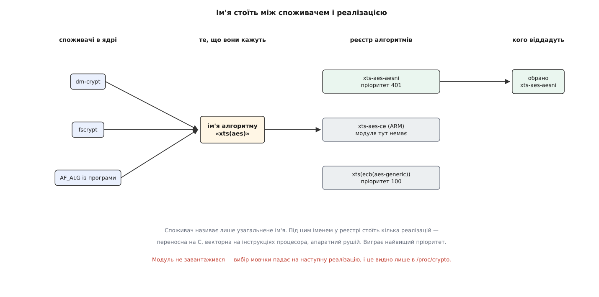
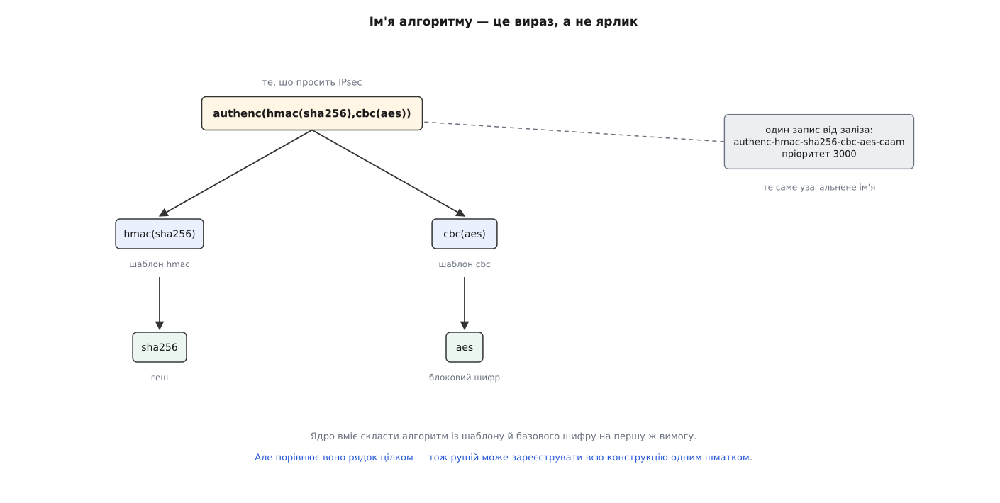
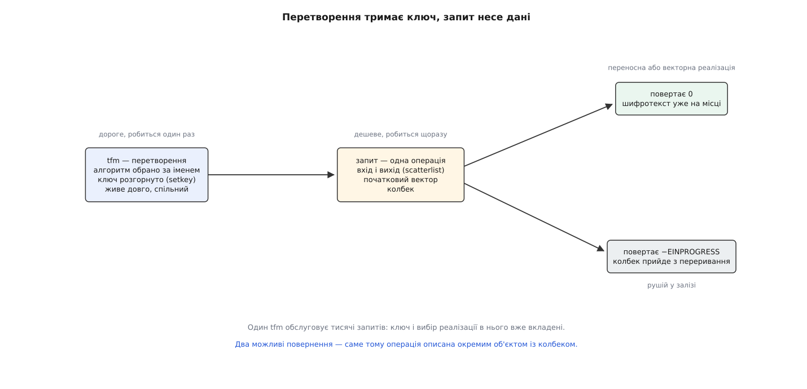

# Криптографічна підсистема ядра: імена алгоритмів і трансформації

<preknowlist>
- [Ядро й простір користувача](topic:sys-unix/kernel-and-userspace) — код ядра виконується в іншому режимі процесора й з іншою пам'яттю, ніж програми; усередині ядра немає бібліотек, до яких звикла програма.
- [Модулі ядра: завантаження, параметри, залежності](topic:sys-unix/kernel-modules) — шматок коду ядра може доєднуватися на ходу й під час завантаження оголошувати, що він уміє.
- [Блоковий шифр](topic:sf-security/block-cipher) — оборотне перетворення блока сталої довжини під ключем; режими зчеплення надбудовуються над ним і самі шифру не належать.
- [Криптографічні гешфункції](topic:sf-security/cryptographic-hash) — стискання потоку довільної довжини у значення сталої довжини, з якого не відновити вхід.
- [DMA і відображення буферів у ядрі](topic:sys-unix/dma-and-buffers) — пристрій читає й пише пам'ять сам, тому буфер для нього описують не вказівником, а переліком фізичних сторінок.
- [Переривання, softirq і робочі черги](topic:sys-unix/interrupts-bottom-halves) — код ядра виконується в різних контекстах, і не в кожному з них дозволено засинати чи чіпати стан процесора.
- [SIMD і векторизація](topic:hw-arch/simd-vectorization) — окремі регістри процесора, що обробляють кілька значень одним тактом; їхній стан належить перерваній програмі.
</preknowlist>

## Скільки в системі шифрувальників

Порахуймо, скільки разів на звичайному ноутбуці з Linux шифрування відбувається **всередині ядра**, поки людина просто читає пошту. Системний розділ лежить під [прозорим шифруванням блокового пристрою](topic:sys-unix/dm-crypt) — кожен сектор проходить через AES. Домівка може бути під [шифруванням файлової системи](topic:sys-unix/fscrypt) — ще один потік AES, з іншими ключами. Wi-Fi шифрує кадри. Робочий тунель [IPsec](topic:sys-unix/ipsec-xfrm) шифрує й підписує пакети. Коли система вантажила драйвер, вона перевірила [підпис модуля](topic:sys-unix/module-signing) — це вже асиметрична криптографія. І це не рахуючи браузера, який робить своє TLS у просторі користувача.

Тепер порахуймо з іншого боку — скільки в тій самій машині **реалізацій AES**. Є переносна на C, з таблицями підстановок; вона працює всюди. Є реалізація на інструкціях AES-NI, які процесор Intel має з 2010 року, — вона на порядок швидша. На плáті ARM замість неї були б інструкції ARMv8 Crypto Extensions або окремий блок у мікросхемі, що шифрує самостійно й спілкується з ядром через переривання. У серверах трапляється карта-прискорювач, яка вміє одразу «зашифрувати й порахувати код автентичності» одним запитом.

Скільки споживачів, стільки й реалізацій — і жоден зі споживачів не має права знати, яка з них є на цій машині. Якби dm-crypt викликав функцію з AES-NI напряму, він не зібрався б для ARM; якби він викликав переносну — на серверах би простоював прискорювач; а поява нового рушія вимагала б правки в кожному споживачі окремо. Потрібна точка розв'язки: місце, де споживач каже, **чого хоче**, а не **хто це зробить**.

## Рядок замість вказівника

У ядрі цією точкою став звичайний рядок символів. Споживач пише:

```c
tfm = crypto_alloc_skcipher("xts(aes)", 0, 0);
```

і отримує готовий до роботи об'єкт, не назвавши жодного модуля, жодної функції й жодної марки заліза.

З іншого боку тієї самої межі кожна реалізація під час завантаження реєструє себе — і подає **два** імені. Узагальнене (`cra_name`) — це «що я вмію»: `xts(aes)`. Конкретне (`cra_driver_name`) — це «хто саме я»: `xts-aes-aesni`. Плюс число `cra_priority`.

Два імені потрібні тому, що на одне питання є кілька відповідей. Споживач просить узагальнене, і ядро перебирає всі зареєстровані під ним реалізації, беручи ту, у якої пріоритет найвищий. Драйверне ім'я лишається для випадків, коли потрібна саме певна реалізація й ніяка інша: набір тестів `tcrypt` проганяє кожну окремо; адміністратор обходить рушій, у якому знайшли ваду; хтось міряє швидкість переносної проти апаратної на тій самій машині.

Увесь цей реєстр видно ззовні як звичайний файл:

```
name         : xts(aes)
driver       : xts-aes-aesni
module       : aesni_intel
priority     : 401
refcnt       : 4
selftest     : passed
internal     : no
type         : skcipher
async        : yes
blocksize    : 16
min keysize  : 32
max keysize  : 64
ivsize       : 16

name         : xts(aes)
driver       : xts(ecb(aes-generic))
module       : kernel
priority     : 100
selftest     : passed
type         : skcipher
async        : no
```

Два записи, одне узагальнене ім'я, різниця в пріоритеті вчетверо. Той, хто попросив `xts(aes)`, дістав перший і про існування другого не дізнався.



*Ім'я стоїть між споживачем і реалізацією: споживач знає лише його, реалізації змагаються пріоритетом.*

> 🔧 **Навіщо це.** Коли на новій платі раптом «просів» дисковий ввід-вивід, дивитися треба не в dm-crypt, а в `/proc/crypto`: якщо під `xts(aes)` лишився самий запис із пріоритетом 100, апаратний модуль просто не завантажився, і весь потік іде переносною реалізацією на C. Жодних змін у налаштуванні шифрування при цьому не видно — вибір відбувся мовчки, у реєстрі.

## Ім'я, яке розбирається на частини

`xts(aes)` виглядає як домовленість між людьми — мовляв, дужки читаються «режим XTS поверх AES». Але ядро справді розбирає цей рядок як вираз.

Причина суто арифметична. Режимів зчеплення близько десятка, блокових шифрів теж близько десятка. Писати «CBC поверх AES», «CBC поверх Serpent», «CTR поверх AES» окремими алгоритмами — це сотня реалізацій, дев'яносто з яких є копіями тієї самої петлі з іншим викликом усередині. Отже, режим має бути окремим кодом, який приймає будь-який блоковий шифр, — **шаблоном**. А назва результату складається з назв частин.

Поки ніхто не просив `cbc(twofish)`, такого алгоритму в реєстрі немає. Перший запит не знаходить готового запису, зате знаходить шаблон `cbc` і базовий шифр `twofish` — і ядро **інстанціює** алгоритм: створює екземпляр шаблону з підставленим усередину шифром, реєструє його й віддає споживачеві. Цим займається `cryptomgr`, і саме тому вміст `/proc/crypto` на живій системі змінюється: там осідає те, що хтось попросив.

Дужки вкладаються без обмежень, і кожна пара має сенс:

```
hmac(sha256)                            код автентичності на базі гешу
authenc(hmac(sha256),cbc(aes))          шифрування плюс автентичність — те, що просить IPsec
rfc4106(gcm(aes))                       той самий AEAD, але з розкладкою nonce за RFC 4106
essiv(cbc(aes),sha256)                  CBC, у якого початковий вектор породжений із номера сектора
```

Останній приклад показує, наскільки далеко це заходить: `essiv` — це не режим шифрування, а спосіб виготовити початковий вектор, і його теж оформили шаблоном, щоб dm-crypt і fscrypt не робили того самого у себе. Обгортку додали в ядро 5.4 у 2019 році — її написав Ард Бісгевел (Ard Biesheuvel) з Linaro саме для того, щоб на ARM цілу конструкцію можна було виконати одним прискореним шматком коду замість двох окремих викликів.



*Ім'я — це дерево шаблонів над базовими алгоритмами; але реєстр порівнює рядок цілком, тож те саме ім'я може мати й нескладеного власника.*

Ось найважливіший наслідок граматики, і він не очевидний. Шаблон **дозволяє** складати композицію з частин, але нічого не зобов'язує: реєстр порівнює рядки цілком. Тому карта-прискорювач має право зареєструвати `authenc(hmac(sha256),cbc(aes))` одним записом із пріоритетом 3000 — і виконувати всю конструкцію одним зверненням до заліза, замість трьох окремих програмних кроків. Споживач просить те саме ім'я, не міняє жодного рядка коду й навіть не дізнається, що всередині більше немає ні `hmac`, ні `cbc`.

## Чому одного інтерфейсу мало

Досі ми говорили лише про добір реалізації. Але зашифрувати сектор і порахувати геш файлу — це операції з різною **формою**, і однією функцією їх не накрити.

Блоковий шифр із режимом бере вхід і віддає вихід тієї самої довжини; йому потрібні ключ і початковий вектор, а працює він порціями. Геш бере потік довільної довжини й віддає значення сталої — а отже, мусить тримати проміжний стан між порціями, і виклик природно розпадається на «почати», «додати ще», «завершити». Автентифіковане шифрування ([AEAD](topic:sf-security/authenticated-encryption)) взагалі не вкладається ні в перше, ні в друге: частину даних воно шифрує, іншу лише автентифікує, довжина виходу більша за довжину входу на розмір тега, а остання дія при розшифруванні — порівняння тега за сталий час, після якого результат або віддають, або відкидають цілком.

Тому підсистема пропонує не один інтерфейс, а сімейство типів перетворення, кожен зі своїм набором викликів: `skcipher` для симетричних шифрів, `shash` і `ahash` для гешів (синхронний і асинхронний), `aead`, `akcipher` і `sig` для асиметричних операцій, `kpp` для узгодження ключів, `rng` для генераторів, `acomp`/`scomp` для стиснення — так, стиснення живе в тому самому реєстрі, бо задача в нього та сама: багато реалізацій, серед них апаратні, і треба обрати кращу.

Точний перелік типів із їхніми викликами, набором готових шаблонів і значенням полів у `/proc/crypto` винесено окремо: [довідка інтерфейсу криптопідсистеми](topic:sys-unix/kernel-crypto-api/api-crypto-transforms.md) — таблиця типів, функції виділення й роботи для кожного, прапорці `type`/`mask` та їхній зміст.

## Два об'єкти: перетворення й запит

Виклик `crypto_alloc_skcipher` повертає не функцію й не буфер, а об'єкт **перетворення** — transformation, звідси й скорочення `tfm`, що трапляється в коді ядра на кожному кроці. У ньому осіла вся дорога робота: обраний алгоритм, при потребі інстанційований шаблон, захоплений канал заліза і, після `setkey`, розгорнутий ключ — для AES це розклад раундів, який рахують один раз, а не на кожен блок.

Одна операція описується окремим об'єктом — **запитом**. У ньому лежить те, що змінюється щоразу: звідки взяти дані, куди покласти, скільки їх, який початковий вектор — і функція, яку викликати після завершення.

Розділення на два об'єкти виглядає зайвою церемонією рівно доти, доки не згадати, що реалізація може бути залізом. Звернення до карти-прискорювача — це покласти дескриптор у чергу й піти; результат прийде з перериванням через десятки мікросекунд, а то й пізніше. Функція, яка «просто повертає шифротекст», примусила б ядро крутитися в очікуванні на процесорі, який тим часом міг би робити щось корисне.

Тому контракт побудовано навпаки: асинхронність є основою, а синхронність — окремим випадком. Виклик шифрування повертає `0`, якщо все вже зроблено; `-EINPROGRESS`, якщо роботу прийнято й колбек буде згодом; `-EBUSY`, якщо черга заповнена — і тоді з прапорцем `CRYPTO_TFM_REQ_MAY_BACKLOG` запит усе ж стає в чергу очікування, а без цього прапорця його доводиться повторювати самому.



*Дорога частина живе в tfm і перевикористовується; кожен запит несе тільки своє — і два можливі шляхи повернення результату.*

Коду, який справді хоче зачекати, ядро дає місток поверх цього контракту:

```c
DECLARE_CRYPTO_WAIT(wait);
struct crypto_skcipher *tfm;
struct skcipher_request *req;
int err;

tfm = crypto_alloc_skcipher("xts(aes)", 0, 0);
if (IS_ERR(tfm))
        return PTR_ERR(tfm);

err = crypto_skcipher_setkey(tfm, key, 64);   /* два ключі по 32 байти */
if (err)
        goto out_free_tfm;

req = skcipher_request_alloc(tfm, GFP_KERNEL);
if (!req) {
        err = -ENOMEM;
        goto out_free_tfm;
}

skcipher_request_set_callback(req,
        CRYPTO_TFM_REQ_MAY_BACKLOG | CRYPTO_TFM_REQ_MAY_SLEEP,
        crypto_req_done, &wait);
skcipher_request_set_crypt(req, sg_in, sg_out, len, iv);

err = crypto_wait_req(crypto_skcipher_encrypt(req), &wait);
```

`crypto_wait_req` дивиться на повернене значення: `0` — просто віддає його, `-EINPROGRESS` або `-EBUSY` — засинає, доки `crypto_req_done` не розбудить. Синхронне очікування збудоване поверх асинхронного контракту, а не навпаки — тому програмна реалізація не платить нічого, а апаратна працює без переробок у споживачі.

Робочий модуль ядра, що робить це від початку до кінця — з підготовкою буферів, обробкою всіх трьох повернених значень і типовими пастками — розібрано окремо: [шифрування у власному модулі ядра](topic:sys-unix/kernel-crypto-api/proj-tfm-in-module.md).

## Дані передають не вказівником

У виклику вище дані задані не парою «вказівник, довжина», а структурами `sg_in`/`sg_out` — списками розсіяних сегментів пам'яті (scatterlist). Причина в тому, звідки дані беруться: запит до блокового пристрою вже описаний переліком сторінок, мережевий пакет розкиданий фрагментами, а на іншому кінці стоїть залізо, якому для DMA потрібні саме фізичні сторінки. Складати все це в один суцільний буфер — зайве копіювання того самого обсягу, який ми щойно збиралися зашифрувати.

Звідси пастка, на якій горять усі, хто пише свій перший код із криптопідсистемою: буфер у стеку або отриманий через `vmalloc` подавати не можна. За такою адресою `virt_to_page()` не знаходить потрібної сторінки — у `vmalloc` вона фізично є, але проста арифметика веде не до неї, — і навіть якщо переносна реалізація на C з таким буфером упорається, апаратна на іншій машині зіпсує дані або відмовить. Це не примха реалізації, а прямий наслідок того, що виконавцем може бути пристрій.

## Чому в реєстрі трапляється cryptd

Швидка реалізація AES на x86 користується векторними регістрами, а вони належать перерваній програмі: перш ніж їх чіпати, ядро мусить зберегти чужий стан (`kernel_fpu_begin`) і потім повернути. Це можна не в кожному контексті виконання, і набір дозволених контекстів з роками змінювався.

Розв'язок, який видно в `/proc/crypto`, такий: сама векторна реалізація реєструється як внутрішня — `__xts-aes-aesni` з позначкою `internal : yes`, і просто так її не візьмеш. Назовні виставлено обгортку, яка перевіряє контекст: де векторні регістри чіпати можна, вона виконує роботу одразу, а де не можна — передає запит у `cryptd`, робочу чергу, що виконає його вже в контексті потоку. Саме тому поруч трапляється запис із драйверним іменем на кшталт `cryptd(__xts-aes-aesni)`, який ніхто напряму не просив: він з'явився як частина цієї конструкції.

Той самий механізм пояснює, навіщо в `crypto_alloc_skcipher` є ще два аргументи — `type` і `mask`. Ними споживач звужує вибір: наприклад, вимагає реалізацію без асинхронності, якщо працює там, де ніхто не зможе його розбудити. Не вказав нічого — дістав найшвидшу з наявних, якою б вона не була.

## Алгоритм не працює, поки не склав іспит

Реєстрація не робить алгоритм доступним одразу. Після неї `cryptomgr` проганяє його на відомих тестових векторах — відомий вхід, відомий ключ, відомий очікуваний вихід, — і лише після успіху позначає придатним; у `/proc/crypto` це поле `selftest`. Реалізацію, що тесту не пройшла, споживачеві не віддадуть.

Крок виглядає надмірним, доки не згадати, скільки різних авторів зареєстровано в одному реєстрі: переносний код ядра, векторні реалізації під кожну архітектуру, драйвери рушіїв від різних виробників. Помилка в будь-якому з них не проявиться як збій — вона проявиться як тихо неправильний шифротекст, який запишуть на диск і не зможуть прочитати назад. Автоматична перевірка на вході — єдиний спосіб не дізнатися про це через півроку. У режимі FIPS ставлення ще суворіше: провал тесту зупиняє систему.

## Той самий реєстр назовні

Оскільки реєстр уже вміє добирати найкращу реалізацію й знає про залізо, було б марнотратно тримати його лише для ядра. З ядра 2.6.38 (2011) реєстр доступний програмам через окрему родину сокетів `AF_ALG`:

```c
struct sockaddr_alg sa = {
        .salg_family = AF_ALG,
        .salg_type   = "skcipher",
        .salg_name   = "xts(aes)",
};
int tfmfd = socket(AF_ALG, SOCK_SEQPACKET, 0);
bind(tfmfd, (struct sockaddr *)&sa, sizeof(sa));
setsockopt(tfmfd, SOL_ALG, ALG_SET_KEY, key, 64);
int opfd = accept(tfmfd, NULL, 0);
```

Модель повторено один в один: прив'язаний сокет — це `tfm` (тип перетворення, ім'я алгоритму, ключ), а сокет, отриманий з `accept`, — це запит, у який дані пишуть і з якого читають результат.

Виграш очевидний: програма дістає апаратний прискорювач без власного драйвера й без залежності від криптобібліотеки. Але й ціна очевидна: кожна порція проходить через системний виклик і копіювання. На дрібних порціях це програш проти бібліотеки в просторі користувача, яка викличе ту саму інструкцію AES-NI без жодного переходу в ядро. `AF_ALG` виграє там, де є справжній окремий рушій і великі порції даних.

## Де реєстр зайвий

Та сама логіка діє й усередині ядра. Коли потрібно перевірити один геш SHA-256 або зашифрувати короткий заголовок сталим алгоритмом, виділення `tfm`, збирання запиту й опис буфера списком сегментів коштують більше, ніж сама криптографія. Тому в ядрі поруч із реєстром живе бібліотечний шар — прямі функції для кількох конкретних алгоритмів, без імен, пріоритетів і добору.

Межа між ними проходить по питанню, чи є взагалі що обирати. Реєстр потрібен там, де реалізацій багато, серед них апаратні, і вибір мусить статися на живій машині. Бібліотека — там, де алгоритм визначений наперед і замінювати його ніхто не збирається. Шлях, яким підсистема прийшла до цієї межі, — від першої версії 2002 року, написаної під потреби IPsec, через переписування заради апаратних рушіїв, — розказано окремо: [дві криптопідсистеми Linux](topic:sys-unix/kernel-crypto-api/hist-two-crypto-apis.md).
