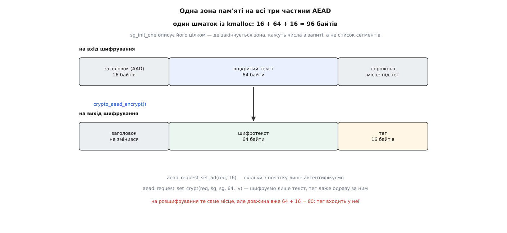

# ⚙️ Шифруємо буфер у власному модулі ядра: gcm(aes) від alloc до free

Це повний завантажуваний модуль ядра, який бере шматок пам'яті, шифрує його автентифікованим шифром `gcm(aes)`, розшифровує назад і показує, як ядро ловить підміну одного біта. Сотня рядків — і в кожному другому є спосіб помилитися так, що компілятор промовчить, а зламається воно на чужій машині.

## Що робимо

Беремо 96 байтів: 16 байтів заголовка, який треба лише автентифікувати, 64 байти тексту, який треба сховати, і 16 байтів, куди ляже тег. Тег — це те, чим [автентифіковане шифрування](root:sf-security/authenticated-encryption) відрізняється від простого шифрування: одна операція дає і таємницю, і доказ цілісності, а на зворотному ході тег звіряють і при розбіжності відкидають усе. Ціна — вихід довший за вхід рівно на розмір тега, і місце під нього доводиться передбачити наперед, бо збільшити буфер посеред операції нікому.

## Буфер, який можна віддати залізу

Дані сюди подають не парою «вказівник і довжина», а через `struct scatterlist` — перелік фізичних сторінок. Причина в тому, що виконавцем може виявитися не процесор, а окремий рушій, який читає пам'ять сам, і тоді потрібні саме сторінки, придатні для [DMA](root:sys-unix/dma-and-buffers). Звідси єдина вимога до буфера: під його адресою мусить бути справжня `struct page`, яку `virt_to_page()` знайде за простою арифметикою.

Цій вимозі відповідає пам'ять із [слабового алокатора](root:sys-unix/kernel-memory-slab) — `kmalloc()` віддає шматок із прямого відображення, фізично суцільний, тож увесь наш буфер описується одним сегментом. Не відповідають дві інші звички. Пам'ять з [`vmalloc()`](root:sys-unix/vmalloc-kernel-mappings) суцільна лише у віртуальних адресах, а її сторінки розкидані по фізичній пам'яті — арифметика `virt_to_page()` на ній вказує на чужу сторінку. І масив у стеку: з ядра 4.9 стек потоку на x86-64 сам є `vmalloc`-відображенням (`CONFIG_VMAP_STACK`), тобто рівно тим самим випадком. Коли зібрано з `CONFIG_DEBUG_SG`, `sg_set_buf()` ловить це на місці — там стоїть `BUG_ON(!virt_addr_valid(buf))`; без цієї опції нічого не кричить, і в список сегментів тихо лягає чужа сторінка.

Зворотний бік правила теж варто назвати, бо його зазвичай переносять надто широко: у стеку не можна тримати **дані, описані scatterlist**. Ключ, початковий вектор і структуру очікування — можна: їх передають звичайними вказівниками. Макрос `DECLARE_CRYPTO_WAIT` навіть побудовано на `COMPLETION_INITIALIZER_ONSTACK`, тобто він розрахований саме на стек.

Заголовок і текст лежать в одному шматку не для краси. AEAD-запит приймає **один** список сегментів на обидві частини, а межу між ними задає окреме число — скільки байтів від початку лише автентифікують. Двох окремих вказівників тут не передбачено. Вихід описують так само, і найпростіше подати той самий список двічі: тоді шифрування відбувається на місці, а тег дописується одразу за текстом — рівно в ті 16 байтів, які ми залишили порожніми.



*Список сегментів описує весь буфер цілком — а що в ньому заголовок, що текст і де починається тег, підсистема дізнається з двох чисел у запиті.*

> 🔧 **Навіщо це.** Помилка з буфером не схожа на помилку. Модуль зібрався, `insmod` пройшов, на ноутбуці з переносною реалізацією все навіть могло колись працювати — а на платі з апаратним рушієм той самий код зашифрує чужу сторінку або поверне сміття. Тому перше, що варто перевірити в чужому криптокоді ядра, — звідки взявся буфер.

## Модуль

Дороге робиться один раз і на початку: перетворення, ключ, запит, буфер. Далі йдуть чотири однакові за формою операції, тому їх винесено в одну функцію — так видно, що саме доводиться задавати наново перед кожною. Усі вказівники ініціалізовані нулем, а вихід один: `goto out` із будь-якого місця веде до звільнення, і воно спокійно переживає `NULL`.

```c
// SPDX-License-Identifier: GPL-2.0
#include <linux/module.h>
#include <linux/slab.h>
#include <linux/scatterlist.h>
#include <linux/random.h>
#include <crypto/aead.h>

#define AAD_LEN  16      /* заголовок: автентифікуємо, але не ховаємо */
#define MSG_LEN  64
#define TAG_LEN  16      /* повний тег GCM */
#define IV_LEN   12      /* nonce GCM */

static const u8 msg[MSG_LEN] = "kernel crypto api demo: gcm(aes) over one kmalloc buffer";

/* Одна операція. Усе, що змінюється між викликами, задаємо наново. */
static int gcm_op(struct aead_request *req, struct scatterlist *sg,
                  struct crypto_wait *wait, const u8 *nonce, u8 *iv,
                  unsigned int cryptlen, bool encrypt)
{
        memcpy(iv, nonce, IV_LEN);            /* iv реалізація має право переписати */
        aead_request_set_ad(req, AAD_LEN);
        aead_request_set_crypt(req, sg, sg, cryptlen, iv);

        return crypto_wait_req(encrypt ? crypto_aead_encrypt(req)
                                       : crypto_aead_decrypt(req), wait);
}

static int __init gcmdemo_init(void)
{
        struct crypto_aead *tfm;
        struct aead_request *req = NULL;
        struct scatterlist sg;
        DECLARE_CRYPTO_WAIT(wait);             /* на стеку — і це правильно */
        u8 key[32], nonce[IV_LEN], iv[IV_LEN];
        u8 *buf = NULL;
        int err;

        tfm = crypto_alloc_aead("gcm(aes)", 0, 0);
        if (IS_ERR(tfm))
                return PTR_ERR(tfm);

        pr_info("gcmdemo: impl=%s ivsize=%u\n",
                crypto_tfm_alg_driver_name(crypto_aead_tfm(tfm)),
                crypto_aead_ivsize(tfm));

        if (crypto_aead_ivsize(tfm) != IV_LEN) {   /* розмір питають, а не знають */
                err = -EINVAL;
                goto out;
        }

        err = crypto_aead_setauthsize(tfm, TAG_LEN);
        if (err)
                goto out;

        get_random_bytes(key, sizeof(key));
        err = crypto_aead_setkey(tfm, key, sizeof(key));
        memzero_explicit(key, sizeof(key));    /* розгорнутий ключ уже всередині tfm */
        if (err)
                goto out;

        req = aead_request_alloc(tfm, GFP_KERNEL);
        if (!req) {
                err = -ENOMEM;
                goto out;
        }
        aead_request_set_callback(req,
                CRYPTO_TFM_REQ_MAY_BACKLOG | CRYPTO_TFM_REQ_MAY_SLEEP,
                crypto_req_done, &wait);

        buf = kmalloc(AAD_LEN + MSG_LEN + TAG_LEN, GFP_KERNEL);
        if (!buf) {
                err = -ENOMEM;
                goto out;
        }
        memset(buf, 0xa5, AAD_LEN);
        memcpy(buf + AAD_LEN, msg, MSG_LEN);
        memset(buf + AAD_LEN + MSG_LEN, 0, TAG_LEN);
        sg_init_one(&sg, buf, AAD_LEN + MSG_LEN + TAG_LEN);

        get_random_bytes(nonce, sizeof(nonce));

        err = gcm_op(req, &sg, &wait, nonce, iv, MSG_LEN, true);
        if (err)
                goto out;
        pr_info("gcmdemo: ct  %*ph\n", 16, buf + AAD_LEN);
        pr_info("gcmdemo: tag %*ph\n", TAG_LEN, buf + AAD_LEN + MSG_LEN);

        err = gcm_op(req, &sg, &wait, nonce, iv, MSG_LEN + TAG_LEN, false);
        if (err)
                goto out;
        pr_info("gcmdemo: back \"%s\"\n", (char *)(buf + AAD_LEN));

        /* Шифруємо ще раз — той самий nonce тут лише тому, що і текст, і ключ ті самі.
           У житті повторення nonce під тим самим ключем руйнує захист GCM. */
        err = gcm_op(req, &sg, &wait, nonce, iv, MSG_LEN, true);
        if (err)
                goto out;
        buf[0] ^= 0x01;                        /* один біт заголовка */
        err = gcm_op(req, &sg, &wait, nonce, iv, MSG_LEN + TAG_LEN, false);
        pr_info("gcmdemo: tampered AAD -> %d\n", err);
        err = (err == -EBADMSG) ? 0 : -EIO;
out:
        aead_request_free(req);   /* спершу запити: жоден не в польоті */
        crypto_free_aead(tfm);    /* тепер відпущено посилання на реалізацію */
        kfree_sensitive(buf);     /* там лежав відкритий текст */
        return err;
}

static void __exit gcmdemo_exit(void) { }

module_init(gcmdemo_init);
module_exit(gcmdemo_exit);
MODULE_DESCRIPTION("gcm(aes) end-to-end through the kernel crypto API");
MODULE_LICENSE("GPL");
```

## Збірка й вивід

Збирається як звичайний [позадеревний модуль](root:sys-unix/kernel-modules) — kbuild викликають із теки зібраного ядра, а свою теку подають параметром `M`:

```makefile
obj-m += gcmdemo.o
KDIR ?= /lib/modules/$(shell uname -r)/build

all:
	$(MAKE) -C $(KDIR) M=$(CURDIR) modules
clean:
	$(MAKE) -C $(KDIR) M=$(CURDIR) clean
```

Рядок `MODULE_LICENSE("GPL")` тут не формальність: `crypto_alloc_aead` та решта експортовані як `EXPORT_SYMBOL_GPL`, і з іншою ліцензією модуль не пройде навіть `modpost`. Результат читаємо в [журналі ядра](root:sys-unix/kernel-log-printk):

```
$ make && sudo insmod gcmdemo.ko
$ sudo dmesg | tail -5
[ 8123.442017] gcmdemo: impl=generic-gcm-aesni ivsize=12
[ 8123.442031] gcmdemo: ct  7d 3a c1 05 b8 e2 44 9f 10 6c 2b d7 8a 33 f1 4e
[ 8123.442036] gcmdemo: tag 5c 90 ab 12 e4 77 68 0d 3f b5 c6 21 9a 8e 47 d2
[ 8123.442041] gcmdemo: back "kernel crypto api demo: gcm(aes) over one kmalloc buffer"
[ 8123.442046] gcmdemo: tampered AAD -> -74
```

`-74` — це `-EBADMSG`: тег не збігся, бо ми перевернули біт у заголовку, який хоч і не шифрується, а в підрахунок тега входить. Зверніть увагу на `impl=`: ім'я ми просили узагальнене, а дістали конкретну реалізацію, обрану за нас.

Ще одна дрібниця, помітна лише за першим запуском: якщо потрібного алгоритму в реєстрі ще немає, `crypto_alloc_aead()` не здається одразу — вона просить довантажити модуль і чекає на це. Отже, виділення перетворення саме по собі здатне заснути, і робити його треба там, де спати дозволено.

## Три відповіді на один виклик

`crypto_aead_encrypt()` повертає не лише «зроблено». Нуль означає, що шифротекст уже в буфері. `-EINPROGRESS` — що роботу взяли й колбек прийде пізніше. `-EBUSY` — що черга виконавця повна, і ось тут ховається різниця, яку легко не помітити: сенс цього значення залежить від прапорця `CRYPTO_TFM_REQ_MAY_BACKLOG`. З ним запит усе одно поставили — у чергу очікування, — і колбек буде. Без нього переповнення означає відмову (спільна черга ядра повертає в цьому разі `-ENOSPC`), і чекати нема на що.

`crypto_wait_req()` обидва ненульові випадки трактує однаково — засинає на `wait_for_completion()`. Тому вона правильна лише в парі з `MAY_BACKLOG`: поставити її на запит, який могли відкинути, — це заснути назавжди. Прокидання влаштоване через [механізм завершення](root:sys-unix/kernel-wait-queues), і сама `crypto_wait_req()` після пробудження скидає його назад, тож той самий `wait` служить наступній операції — але тільки після того, як попередня завершилася.

Колбек, до речі, можуть викликати двічі: коли відкладений запит нарешті беруть у роботу, `crypto_req_done()` отримує `-EINPROGRESS` і мовчки виходить, а будить лише другий виклик — уже з підсумком.

## Те саме на xts(aes)

Симетричний шифр без автентичності — це інший тип перетворення й трохи інша арифметика:

```c
struct crypto_skcipher *tfm = crypto_alloc_skcipher("xts(aes)", 0, 0);
u8 key[64];                                    /* два ключі AES-256 підряд */
u8 iv[16];                                     /* і його перепишуть */
u8 *buf = kmalloc(512, GFP_KERNEL);            /* вихід рівно такий, як вхід */

sg_init_one(&sg, buf, 512);
skcipher_request_set_callback(req, CRYPTO_TFM_REQ_MAY_BACKLOG |
                                   CRYPTO_TFM_REQ_MAY_SLEEP,
                             crypto_req_done, &wait);
skcipher_request_set_crypt(req, &sg, &sg, 512, iv);
err = crypto_wait_req(crypto_skcipher_encrypt(req), &wait);
```

Немає заголовка, немає тега, довжина виходу дорівнює довжині входу — і немає `-EBADMSG`: підмінений шифротекст просто розшифрується у сміття, яке ніхто не позначить як сміття. Ключ тут подвійний, тому його довжина мусить бути парною; у режимі FIPS ядро ще й відмовить із `-EINVAL`, якщо обидві половини однакові.

## Пастки, на яких компілятор мовчить

**Початковий вектор — параметр «туди й назад».** Реалізації симетричних шифрів дописують у нього стан після останнього блока, щоб наступний виклик міг продовжити ланцюг. Другий виклик із тим самим масивом стартує вже не з того, що ви туди поклали. Саме тому в модулі вище є окремий `nonce`, з якого перед кожною операцією роблять свіжу копію.

**Повторне використання запиту.** Об'єкт запиту не одноразовий, але й не запам'ятовує нічого корисного між викликами: перед кожною операцією треба заново задати `set_crypt` (буфери, довжину, вектор) і `set_ad`. Колбек і прапорці лишаються, тож їх повторювати не треба. Чого не можна робити взагалі — чіпати запит, який ще в польоті.

**Спати там, де не можна.** `GFP_KERNEL`, `CRYPTO_TFM_REQ_MAY_SLEEP` і `crypto_wait_req()` — усі троє означають «я маю право заснути». У [обробнику переривання чи під спінлоком](root:sys-unix/interrupts-bottom-halves) це неправда, і ядро скаже це вголос через `might_sleep`. Робочий підхід там інший: виділити `tfm` і запит наперед у контексті процесу, брати пам'ять як `GFP_ATOMIC`, зняти `MAY_SLEEP` і забрати результат справжнім колбеком, не чекаючи на нього. А якщо чекати всередині все ж мусиш, реалізацію звужують ще на виділенні — `crypto_alloc_aead("gcm(aes)", 0, CRYPTO_ALG_ASYNC)` відкидає все асинхронне, і тоді відповідь завжди приходить одразу.

**Звільнення в неправильному порядку.** `crypto_free_aead()` не просто віддає пам'ять — вона відпускає посилання на реалізацію й затирає структуру. Якщо якийсь запит ще виконується, його колбек прийде до вже знищеного перетворення. Правило просте: спочатку переконатися, що в польоті нікого, потім звільняти запити, потім перетворення.

**Забуте звільнення.** `tfm` тримає посилання на модуль своєї реалізації, тож після забутого `crypto_free_aead()` `rmmod aesni_intel` відмовиться працювати, а `refcnt` у `/proc/crypto` покаже зайву одиницю — це найшвидший спосіб знайти витік.

**Ключ, що лишився в пам'яті.** Свою копію сирого ключа затирайте `memzero_explicit()`: звичайний `memset` перед звільненням компілятор має право викинути як мертвий запис. Про решту підсистема дбає сама — і `crypto_destroy_tfm()`, і звільнення запиту зроблені через `kfree_sensitive()`, тож розгорнуті раундові ключі не лишаються в купі. Для власного буфера з відкритим текстом `kfree_sensitive()` теж доречніший за `kfree()`.

**Довіра до виходу невдалого розшифрування.** Коли `crypto_aead_decrypt()` повернула `-EBADMSG`, у буфері вже лежить «розшифроване» — GCM спершу знімає шифр, а тег звіряє наприкінці. Цей вміст не є даними: його треба відкинути цілком, а не розбирати «хоч щось».
