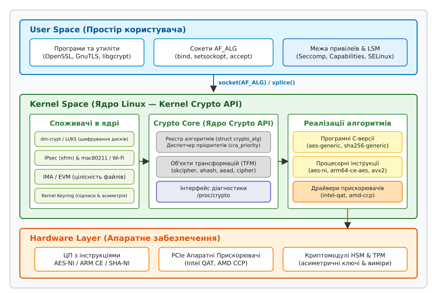
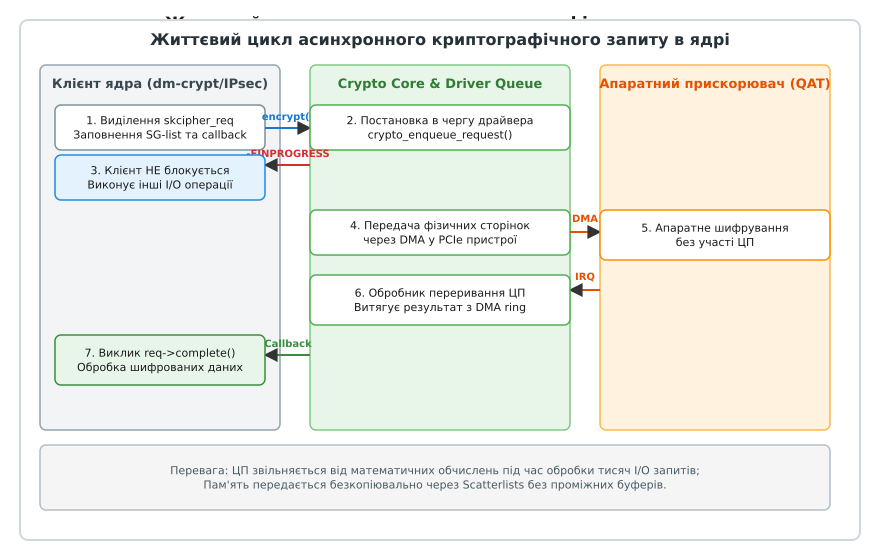

# Криптографічний API ядра (Kernel Crypto API)

<preknowlist>
- [Концепції ядра Linux](topic:sys-unix/kernel-and-userspace) — взаємодія між простором користувача та ядра, системні виклики та VFS.
- [Системний виклик](topic:sys-unix/syscall-mechanics) — механізм передачі управління від користувацького процесу до ядра.
- [Монолітне ядро з модулями](topic:sys-unix/monolithic-with-modules) — як ядро динамічно завантажує реалізації алгоритмів.
- [Можливості (capabilities)](topic:sys-unix/capabilities) — обмеження прав та привілеїв під час роботи з системними ресурсами та сокетами.
- [Сховище ключів (Keyring)](topic:sys-unix/kernel-keyring-internals-and-lsm) — збереження секретних ключів та управління їхнім життєвим циклом у ядрі.
- [Каркас LSM (Linux Security Modules)](topic:sys-unix/lsm-framework) — перевірка прав доступу під час створення сокетів та викликів криптографічних функцій.
- [seccomp: фільтрація системних викликів](topic:sys-unix/seccomp-filter-mechanism) — обмеження доступу до сокетного сімейства AF_ALG у пісочницях.
</preknowlist>

Коли підсистема `dm-crypt` зашифровує кожен сектор диска на накопичувачі NVMe зі швидкістю кількох гігабайтів на секунду або стек IPsec обробляє 100-гігабітний потік мережевих пакетів, пряме вшивання алгоритмів шифрування у вихідний код споживачів паралізує систему. Без єдиного криптографічного фреймворку додавання нового алгоритму вимагає перекомпіляції всього ядра, апаратні прискорювачі лишаються незадіяними, а ключі шифрування опиняються незахищеними перед атаками за побічними каналами. Криптографічний API ядра Linux (Kernel Crypto API) розв'язує цю проблему шляхом повного відокремлення споживачів криптографії від конкретних реалізацій через динамічний реєстр алгоритмів та ізольовані об'єкти трансформацій.

---

## 1. Архітектура та розмежування привілеїв у ядрі

Linux Kernel Crypto API побудований на принципі суворого розмежування двох ролей: **споживачів** (покупців послуг шифрування) та **провайдерів** (реалізаторів криптографічних алгоритмів). Споживач ядра ніколи не викликає математичні функції шифрування чи хешування напряму. Замість цього він запитує в криптографічного ядра трансформацію за її логічним ім'ям (наприклад, `"gcm(aes)"`), а ядро підбирає найбільш ефективну реалізацію на основі пріоритетів та апаратних можливостей поточного процесора.


*Загальна архітектура Crypto API: від користувацьких сокетів AF_ALG до апаратних PCIe-прискорювачів*

Фреймворк ділиться на три логічні шари:

1. **Frontend (Інтерфейс споживачів):** Набір спеціалізованих макросів та системних функцій (`crypto_alloc_skcipher()`, `crypto_alloc_ahash()`, `crypto_alloc_aead()`), які використовують інші ядерні підсистеми:
   - **`dm-crypt` / LUKS:** Прозоре шифрування дискових блоків і розділів при розміщенні на фізичних накопичувачах.
   - **IPsec (`xfrm`) & `mac80211`:** Захист пакетів на мережевому рівні (Network Layer) та кадрів Wi-Fi на канальному (Link Layer).
   - **`IMA/EVM` (Integrity Measurement Architecture / Extended Verification Module):** Перевірка цифрових підписів та обчислення хешів файлів перед їх виконанням.
   - **`Kernel Keyring`:** Перевірка асиметричних цифрових підписів та розшифрування секретних ключів системи.
   - **`fscrypt`:** Пофайлове й покаталогове шифрування у файлових системах `ext4`, `f2fs` та `ubifs`.
2. **Core (Криптографічне ядро):** Диспетчер, що утримує динамічний реєстр алгоритмів, керує життєвим циклом об'єктів трансформацій (TFM), обробляє запити на завантаження модулів та розподіляє навантаження між чергами пристроїв.
3. **Backend (Провайдери алгоритмів):** Безпосередні реалізації математичних алгоритмів. Вони поділяються на універсальні C-версії (наприклад, `aes-generic`), архітектурні оптимізації на асемблері (`aes-ni`, `arm64-ce-aes`, `sha256-avx2`) та драйвери зовнішніх апаратних сопроцесорів (Intel QAT, AMD CCP).

З погляду безпеки та моделей привілеїв, Kernel Crypto API працює у захищеному режимі супервізора (Ring 0). Ядерні буфери, які підсистема виділяє на замовлення користувацького процесу (передусім контексти сокетів `AF_ALG`), позначаються прапорцем `GFP_KERNEL_ACCOUNT`: витрати такої пам'яті лягають на cgroup-ліміт конкретного контейнера, тож процес не здатен виснажити пам'ять ядра поза власним лімітом. Захисту самого ключа це не дає — лише межу обсягу. Для обнулення секретних даних ядро використовує функцію `memzero_explicit()`, яка гарантує, що компілятор не вилучить очищення пам'яті в ході оптимізацій (dead-code elimination), як це часто відбувається зі звичайним `memset()`.

Крім того, ключі та контексти трансформацій живуть у звичайній ядерній пам'яті (slab), а вона не витісняється у swap узагалі — на відміну від буфера в користувацькому процесі, який без `mlock()` може опинитися на диску у відкритому вигляді. Жодного окремого «закріплення сторінок» для цього не потрібно. А от стійкість до атак за часом виконання (timing attacks) фреймворк не гарантує — вона залежить від конкретної реалізації: табличний `aes-generic` уразливий до вимірювання кешу, тому для чутливих випадків у ядрі є окрема реалізація з фіксованим часом (`aes-ti`), а інструкції AES-NI константні за побудовою.

---

## 2. Еволюція та історичні передумови

📜 Докладніше про історію виникнення підсистеми під час розробки IPsec у ядрі 2.5 та її трансформацію описано в [Від фрагментованого шифрування 1990-х до підсистеми Crypto API](topic:sys-unix/kernel-crypto-framework/hist-ipsec-crypto-birth.md).

Створення уніфікованого Crypto API дозволило консолідувати криптографічні ресурси ядра та замінити розрізнені реалізації шифрів єдиною перевіреною інфраструктурою з можливістю гарячої заміни реалізацій.

---

## 3. Фундаментальні абстракції: Алгоритми (`struct crypto_alg`) та Трансформації (TFM)

Центральною ідеєю Crypto API є чітке розмежування між статичним описом алгоритму та динамічним екземпляром його виконання.

### 3.1. Алгоритми (`struct crypto_alg`)

Алгоритм у ядрі — це пасивний опис криптографічного методу. Він реєструється драйвером при завантаженні і описується структурою `struct crypto_alg` з заголовка `<linux/crypto.h>`:

```c
struct crypto_alg {
    struct list_head    cra_list;
    struct list_head    cra_users;
    
    u32                 cra_flags;
    unsigned int        cra_blocksize;
    unsigned int        cra_ctxsize;
    unsigned int        cra_alignmask;
    
    int                 cra_priority;
    refcount_t          cra_refcnt;
    
    char                cra_name[CRYPTO_MAX_ALG_NAME];
    char                cra_driver_name[CRYPTO_MAX_ALG_NAME];
    
    const struct crypto_type *cra_type;
    struct module       *cra_module;
};
```

Ключові поля структури:
- **`cra_name`:** Стандартна текстова назва алгоритму чи режиму (наприклад, `"aes"` або `"cbc(aes)"`).
- **`cra_driver_name`:** Унікальне ім'я конкретного драйвера (наприклад, `"aes-generic"`, `"aes-ni"`, `"qat_aes"`).
- **`cra_priority`:** Числове значення пріоритету (наприклад, 100 для універсального C-коду, 300 для AES-NI, і ще вище — для драйверів PCIe-прискорювачів). Ядро завжди обирає драйвер із найвищим пріоритетом.
- **`cra_flags`:** Бітова маска особливостей алгоритму: `CRYPTO_ALG_ASYNC` для асинхронних реалізацій; молодші біти під маскою `CRYPTO_ALG_TYPE_MASK` кодують сам тип (`skcipher`, `ahash`, `aead`); `CRYPTO_ALG_INTERNAL` позначає реалізацію, доступну лише як складник шаблону, а не споживачеві напряму.
- **`cra_alignmask`:** Маска вирівнювання адреси пам'яті. Якщо вхідний буфер даних не відповідає `cra_alignmask`, Crypto API автоматично виділяє тимчасовий вирівняний буфер і копіює дані в нього, запобігаючи фатальним помилкам апаратури (bus fault на строгих архітектурах).

Коли споживач запитує алгоритм, якого наразі немає у пам'яті, криптографічне ядро використовує функцію `crypto_alg_mod_lookup()`. Вона через `request_module()` запускає користувацький `modprobe` із запитом на модуль за псевдонімом `crypto-<name>`. Це забезпечує прозоре автозавантаження потрібних ядерних модулів (наприклад, `cbc.ko` чи `aesni_intel.ko`) без втручання споживача.

### 3.2. Трансформації (TFM)

Трансформація (TFM, Transformation Object) — це активний об'єкт (екземпляр алгоритму), виділений для конкретного сеансу шифрування. TFM створюється викликом функцій сімейства `crypto_alloc_*`:

```c
struct crypto_skcipher *tfm;
tfm = crypto_alloc_skcipher("cbc(aes)", 0, 0);
if (IS_ERR(tfm)) {
    pr_err("Не вдалося виділити трансформацію: %ld\n", PTR_ERR(tfm));
    return PTR_ERR(tfm);
}
```

Об'єкт TFM утримує:
1. Внутрішній контекст сесії (`cra_ctxsize`), включаючи розгорнуті раундові ключі.
2. Вказівники на функції швидкого виклику (function pointers), що дозволяє уникати пошуку в глобальному реєстрі під час кожної операції.
3. Посилання на модуль ядра провайдера, що запобігає вивантаженню модуля (`rmmod`) під час активного шифрування.

Параметри ключа встановлюються один раз на рівні TFM за допомогою функції `crypto_skcipher_setkey(tfm, key, keylen)`. При цьому ядро виконує перевірку ключа на відповідність обмеженням алгоритму (наприклад, перевірка слабких ключів в DES або перевірка належності довжини AES до 16, 24 або 32 байтів). Сам об'єкт TFM є потокобезпечним (thread-safe) для читання, але для кожного нового запиту на шифрування формується окремий об'єкт запиту.

---

## 4. Синхронна та асинхронна моделі виконання

Ядро Linux працює в умовах екстремальних навантажень I/O, де затримка в кілька мікросекунд може заблокувати роботу усієї системи. Тому Crypto API підтримує дві фундаментально різні моделі обробки даних: синхронну та асинхронну.

### 4.1. Синхронний інтерфейс (`shash`, `cipher`)

Синхронний інтерфейс застосовується, коли операція виконується обчислювальними ядрами процесора миттєво. Наприклад, підсистема `shash` (Synchronous Hash) виконує послідовність викликів `crypto_shash_init()`, `crypto_shash_update()` та `crypto_shash_final()` безпосередньо у контексті поточного виклику без виділення проміжних асинхронних структур та без повернення управління до повного обчислення.

### 4.2. Асинхронний інтерфейс (`ahash`, `skcipher`, `aead`)

Асинхронний інтерфейс орієнтований на високу пропускну здатність та використання апаратних сопроцесорів (Intel QAT, AMD CCP). Клієнт формує об'єкт запиту (наприклад, `struct skcipher_request`), який інкапсулює:
- Вказівник на TFM.
- Вектор ініціалізації (IV).
- Функцію зворотного виклику (`crypto_completion_t`) та користувацький контекст.
- **Scatterlist (`struct scatterlist`):** Структуру даних, що описує несуміжні фрагменти фізичної пам'яті.


*Життєвий цикл асинхронного запиту: безкопіювальна передача через DMA та сповіщення через переривання*

Передача вхідних буферів через Scatterlist (SG-list) є критично важливою: вона дозволяє DMA-контролерам апаратного прискорювача зчитувати дані безпосередньо з фізичних сторінок оперативної пам'яті (Direct Memory Access) без додаткового копіювання буферів усередині ядра. Списки розсіювання-збирання зв'язуються макросами `sg_init_table()` та `sg_chain()`, створюючи єдиний неперервний ланцюг обробки для великих обсягів даних.

При виклику асинхронної функції `crypto_skcipher_encrypt(req)` можливі три результати:

```c
int ret = crypto_skcipher_encrypt(req);
if (ret == 0) {
    /* Операція виконана миттєво (synchronous fast-path) */
} else if (ret == -EINPROGRESS) {
    /* Запит поставлено в чергу апаратури; чекаємо на callback */
} else if (ret == -EBUSY) {
    /* Чергу переповнено: із CRYPTO_TFM_REQ_MAY_BACKLOG запит став у резервну чергу,
       без цього прапорця його відкинуто — надсилати треба повторно */
} else {
    /* Виникла помилка шифрування */
}
```

При поверненні `-EINPROGRESS` потік ядра не блокується, а продовжує обробку інших завдань. Коли PCIe-карта завершує обчислення, вона генерує апаратне переривання (MSI-X), і обробник переривання викликає callback `req->base.complete(&req->base, err)`. Повернення `-EBUSY` означає, що черга переповнена, а доля запиту залежить від прапорця `CRYPTO_TFM_REQ_MAY_BACKLOG`: із ним запит покладено в резервну чергу і клієнтові досить призупинити надсилання нових завдань до звільнення ресурсів (backpressure), без нього запит просто відкинуто — клієнт мусить надіслати його ще раз.

---

## 5. Взаємодія з простором користувача: сокети `AF_ALG` та контур безпеки

📋 Системні структури, прапорці контрольних повідомлень та коди помилок викладено у [Інтерфейс сокетів AF_ALG та структури контрольних повідомлень](topic:sys-unix/kernel-crypto-framework/api-af-alg.md).

⚙️ Практичний код обчислення хешів та розшифрування на C та C++ з використанням RAII наведено у [Практична робота з AF_ALG із користувацького простору](topic:sys-unix/kernel-crypto-framework/proj-af-alg-crypto.md).

Інтерфейс **`AF_ALG`** (Address Family Algorithm, сокетний домен 38 або `PF_ALG`) надає доступ до підсистеми Kernel Crypto API з простору користувача. Замість дублювання криптографічного коду у користувацьких бібліотеках (OpenSSL, GnuTLS), програма відкриває сокет `socket(AF_ALG, SOCK_SEQPACKET, 0)`, передає структуру `struct sockaddr_alg` через `bind()`, налаштовує ключ через `setsockopt()` та отримує робочий дескриптор через `accept()`.

### Модель безпеки, розмежування привілеїв та захист у пісочницях

Доступ користувацьких процесів до сокетів `AF_ALG` регулюється кількома рівнями захисту Linux:

1. **Права доступу та LSM (Linux Security Modules):** Створення сокетів `AF_ALG` перевіряється хуками SELinux (`socket_create`) та AppArmor. Політика може заборонити конкретному сервісу відкривати криптографічні сокети.
2. **Прив'язка ключів через `Kernel Keyring` (`ALG_SET_KEY_BY_KEY_SERIAL`):** Програми можуть передавати сесійні ключі у сокет `AF_ALG` безпосередньо з підсистеми `Kernel Keyring` за ідентифікатором ключа `key_serial_t` — опція з'явилася у ядрах 6.x, до того ключ можна було подати лише байтами через `ALG_SET_KEY`. Ядро вимагає права пошуку на ключ (`KEY_NEED_SEARCH`), інакше повертає `-EPERM`. Байти ключа копіюються з keyring просто в ядерний контекст і взагалі не проходять через адресний простір процесу — їх не видно ні в дампі пам'яті, ні у трасі системних викликів.
3. **Фільтрація через `seccomp BPF`:** У пісочницях (sandboxes) контейнерів (Docker, containerd, systemd-nspawn) системний виклик `socket()` з аргументом `domain = AF_ALG` (38) нерідко заблокований за замовчуванням. Це зменшує поверхню атак на ядро, унеможливлюючи експлуатацію потенційних уразливостей у завантажувальних криптографічних модулях ядра.
4. **Обмеження ресурсів (cgroups):** Робочі дескриптори сокетів виділяють ядерні буфери трансформацій з прапорцем `GFP_KERNEL_ACCOUNT`. Це означає, що спроба користувацького процесу виснажити пам'ять ядра шляхом масового відкриття сокетів `AF_ALG` обмежиться лімітом `memory.max` поточного cgroup-контейнера, спричинивши спрацювання OOM Killer для цього процесу, а не збій усієї операційної системи.
5. **Безкопіювальний обмін через `splice()`:** При обробці великих файлів користувацький процес може передавати дані у робочий сокет `op_fd` безпосередньо з файлового конвеєра за допомогою виклику `splice()`. При цьому ядро перенаправляє сторінки `struct pipe_buffer` у списки розсіювання-збирання `scatterlist` криптографічного провайдера без копіювання байтів у користувацький буфер пам'яті.

---

## 6. Апаратне прискорення, пріоритети та діагностика `/proc/crypto` та Netlink

Під час завантаження системи ядро Linux виконує автоматичне інспектування можливостей центрального процесора (через `CPUID` на x86 чи регістри ідентифікації на ARM). Якщо процесор підтримує спеціалізовані інструкції (AES-NI, VAES, SHA-NI, ARMv8 Cryptography Extensions), ядро автоматично завантажує відповідні асемблерні модулі (наприклад, `aesni_intel`).

Для зовнішніх прискорювачів (Intel QuickAssist Technology — QAT) драйвер реєструє свої реалізації з пріоритетом, свідомо вищим за будь-яку програмну чи процесорну реалізацію — у QAT це чотиризначне значення.

Інформацію про всі зареєстровані алгоритми та поточний стан підсистеми можна отримати з віртуального файлу `/proc/crypto`:

```text
name         : gcm(aes)
driver       : generic-gcm-aesni
module       : aesni_intel
priority     : 400
refcnt       : 2
selftest     : passed
internal     : no
type         : aead
async        : yes
blocksize    : 1
ivsize       : 12
maxauthsize  : 16
```

Значення полів діагностики:
- **`driver`:** Точне ім'я реалізації. Тут увесь режим GCM зібрано в одному модулі `aesni_intel` на інструкціях AES-NI та PCLMULQDQ. Коли ж режим складено шаблоном із двох окремих драйверів, ім'я показує саму композицію — наприклад, `gcm_base(ctr(aes-aesni),ghash-clmulni)`, де другий компонент рахує множення Галуа.
- **`priority`:** Значення 400 означає, що дана реалізація буде обрана першочергово порівняно з `aes-generic` (пріоритет 100).
- **`selftest`:** Значення `passed` підтверджує, що драйвер успішно пройшов самотестування на відомих тестових векторах (Known Answer Tests — KAT, стандарти FIPS 140-2 / FIPS 140-3) при реєстрації.
- **`async`:** Вказує, чи обробляється алгоритм асинхронно (`yes`/`no`).

Крім читання `/proc/crypto`, ядро підтримує інтерфейс `NETLINK_CRYPTO` (підсистема Netlink, модуль `crypto_user`). Через нього системні утиліти можуть динамічно опитувати реєстр алгоритмів, отримувати повний перелік завантажених трансформацій, додавати або видаляти зареєстровані алгоритми під час виконання; на будь-яку зміну реєстру потрібна можливість `CAP_NET_ADMIN`.

Якщо під час аналізу з'ясовується, що високонавантажений тунель IPsec чи `dm-crypt` використовує драйвер `aes-generic`, це свідчить про те, що відповідний модуль прискорення (`aesni_intel`) відсутній у системному `initramfs` або заблокований у `modprobe.blacklist`.

---

## 7. Розробка та реєстрація власного криптопровайдера

Для розробників модулів ядра реєстрація власного криптографічного алгоритму вимагає заповнення відповідної структури та виклику функції реєстрації. Нижче наведено завершений модуль ядра, який реєструє синхронний алгоритм хешування `shash`.

```c
#include <linux/module.h>
#include <linux/kernel.h>
#include <linux/crypto.h>
#include <crypto/internal/hash.h>
#include <linux/unaligned.h>  /* до ядра 6.12 заголовок звався <asm/unaligned.h> */

struct my_digest_ctx {
    u32 state;
    u64 count;
};

static int my_hash_init(struct shash_desc *desc)
{
    struct my_digest_ctx *ctx = shash_desc_ctx(desc);
    ctx->state = 0x811c9dc5; /* FNV offset basis */
    ctx->count = 0;
    return 0;
}

static int my_hash_update(struct shash_desc *desc, const u8 *data, unsigned int len)
{
    struct my_digest_ctx *ctx = shash_desc_ctx(desc);
    unsigned int i;
    for (i = 0; i < len; i++) {
        ctx->state ^= data[i];
        ctx->state *= 0x01000193; /* FNV prime */
        ctx->count++;
    }
    return 0;
}

static int my_hash_final(struct shash_desc *desc, u8 *out)
{
    struct my_digest_ctx *ctx = shash_desc_ctx(desc);
    put_unaligned_le32(ctx->state, out);
    return 0;
}

static struct shash_alg my_shash_alg = {
    .digestsize = 4,
    .descsize   = sizeof(struct my_digest_ctx),
    .init       = my_hash_init,
    .update     = my_hash_update,
    .final      = my_hash_final,
    .base       = {
        .cra_name        = "myfnv1a",
        .cra_driver_name = "myfnv1a-generic",
        .cra_priority    = 100,
        .cra_blocksize   = 1,
        .cra_module      = THIS_MODULE,
    }
};

static int __init my_crypto_provider_init(void)
{
    int err = crypto_register_shash(&my_shash_alg);
    if (err)
        pr_err("Помилка реєстрації myfnv1a: %d\n", err);
    else
        pr_info("Криптопровайдер myfnv1a успішно зареєстровано\n");
    return err;
}

static void __exit my_crypto_provider_exit(void)
{
    crypto_unregister_shash(&my_shash_alg);
    pr_info("Криптопровайдер myfnv1a вивантажено\n");
}

module_init(my_crypto_provider_init);
module_exit(my_crypto_provider_exit);

MODULE_LICENSE("GPL");
MODULE_DESCRIPTION("Приклад власного криптографічного провайдера для Kernel Crypto API");
```

---

> 🔧 **Навіщо це.**
> Розуміння архітектури Kernel Crypto API необхідне для проектування високонавантажених та захищених Linux-систем. Воно дозволяє системним адміністраторам діагностувати падіння продуктивності дискових та мережевих підсистем через неправильно підібрані драйвери шифрування, а розробникам — створювати безпечні додатки, які використовують FIPS-сертифіковане апаратне прискорення ядра через сокети `AF_ALG` без розкриття секретних ключів у пам'яті користувацьких процесів.

---

## Висновок

Kernel Crypto API є фундаментальною підсистемою ядра Linux, яка об'єднує гнучкість динамічної реєстрації алгоритмів із високою продуктивністю апаратного прискорення та суворим розмежуванням привілеїв. Абстракції TFM, використання асинхронних запитів із векторами Scatterlist та сокетний інтерфейс `AF_ALG` роблять ядерну криптографію надійним фундаментом для захисту даних як усередині ядра (`dm-crypt`, IPsec, IMA/EVM), так і в просторі користувача.
