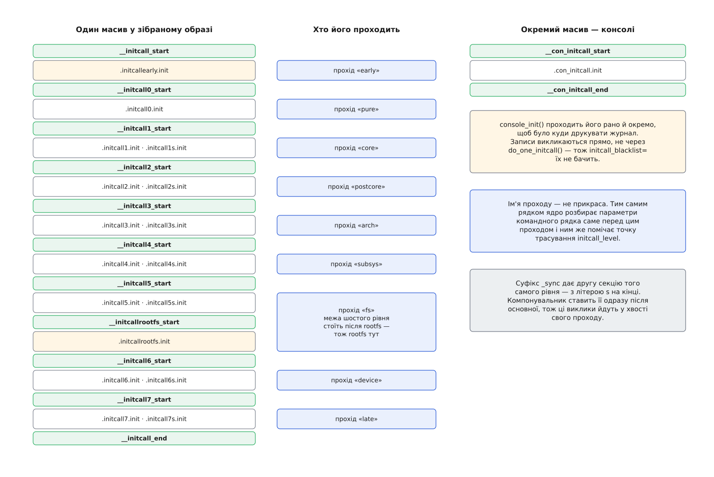

# 📋 initcall: макроси, секції, межі та параметри

Механізм initcall не має функції, яку можна викликати: назовні в нього стирчать самі імена — імена макросів, секцій, символів-меж і параметрів командного рядка. Нижче зібрано їх усі за ядром Linux 6.x: що пишуть у джерелі, у яку секцію воно потрапляє, який прохід це виконає, чим на нього вплинути ззовні й що з цього видно в журналі та в трасуванні.

## Тип запису

```c
typedef int (*initcall_t)(void);

#ifdef CONFIG_HAVE_ARCH_PREL32_RELOCATIONS
typedef int initcall_entry_t;          /* 4 байти: знаковий зсув */
#else
typedef initcall_t initcall_entry_t;   /* повний покажчик */
#endif

static inline initcall_t initcall_from_entry(initcall_entry_t *entry);
extern int do_one_initcall(initcall_t fn);
```

Сама функція ініціалізації не приймає нічого й повертає `int` — нуль або від'ємний код помилки. У масиві лежить не вона, а **запис** про неї, і тип цього запису залежить від архітектури.

Там, де компілятор уміє 32-бітні відносні переміщення, макрос кладе в секцію асемблерний рядок `.long fn - .` — чотири байти відстані від місця запису до функції. Адресу з такого запису дістає `offset_to_ptr()` однією дією додавання:

```
адреса функції = адреса самого запису + знакове 32-бітне значення в ньому
```

На решті архітектур у секції лежить звичайний покажчик, і `initcall_from_entry()` просто його розіменовує. Обидві гілки дають той самий `initcall_t`, тож код старту різниці не бачить.

## Макроси й секції

| Макрос | Секція | Прохід |
| --- | --- | --- |
| `early_initcall(fn)` | `.initcallearly.init` | `early` — окремий, до підняття решти процесорів |
| `pure_initcall(fn)` | `.initcall0.init` | `pure` |
| `core_initcall(fn)` | `.initcall1.init` | `core` |
| `core_initcall_sync(fn)` | `.initcall1s.init` | `core`, у хвості |
| `postcore_initcall(fn)` | `.initcall2.init` | `postcore` |
| `postcore_initcall_sync(fn)` | `.initcall2s.init` | `postcore`, у хвості |
| `arch_initcall(fn)` | `.initcall3.init` | `arch` |
| `arch_initcall_sync(fn)` | `.initcall3s.init` | `arch`, у хвості |
| `subsys_initcall(fn)` | `.initcall4.init` | `subsys` |
| `subsys_initcall_sync(fn)` | `.initcall4s.init` | `subsys`, у хвості |
| `fs_initcall(fn)` | `.initcall5.init` | `fs` |
| `fs_initcall_sync(fn)` | `.initcall5s.init` | `fs`, у хвості |
| `rootfs_initcall(fn)` | `.initcallrootfs.init` | `fs`, після всіх записів рівня `fs` |
| `device_initcall(fn)` | `.initcall6.init` | `device` |
| `device_initcall_sync(fn)` | `.initcall6s.init` | `device`, у хвості |
| `late_initcall(fn)` | `.initcall7.init` | `late` |
| `late_initcall_sync(fn)` | `.initcall7s.init` | `late`, у хвості |
| `console_initcall(fn)` | `.con_initcall.init` | окремий, усередині `console_init()` |

Три рівні `_sync`-двійника не мають: `pure`, `early` і `rootfs`. Секцію `.initcallrootfss.init` сценарій компонування все одно зберігає — вона виходить із того самого шаблону, що й решта, — але макроса, який туди щось покладе, у ядрі немає. Рівень `rootfs` — це місце розпакування [початкового образу пам'яті](topic:sys-unix/initramfs): тимчасового кореня, який ядро тримає в пам'яті, доки не знайде справжній.

Три записи в джерелі — не окремі рівні, а псевдоніми:

| Запис | Чому дорівнює |
| --- | --- |
| `__initcall(fn)` | `device_initcall(fn)` |
| `module_init(fn)`, зібране всередину образу | `__initcall(fn)`, тобто рівень `device` |
| `module_init(fn)`, зібране [модулем](topic:sys-unix/kernel-modules) | псевдонім `init_module` — жодної секції initcall |

## Символи-межі

Межі проставляє сценарій компонування, і в ньому ж видно, чому рівень `rootfs` не є повноцінним:

```c
/* include/asm-generic/vmlinux.lds.h */
#define INIT_CALLS_LEVEL(level)                          \
                __initcall##level##_start = .;           \
                KEEP(*(.initcall##level##.init))         \
                KEEP(*(.initcall##level##s.init))

#define INIT_CALLS                                       \
                __initcall_start = .;                    \
                KEEP(*(.initcallearly.init))             \
                INIT_CALLS_LEVEL(0)                      \
                ...                                      \
                INIT_CALLS_LEVEL(5)                      \
                INIT_CALLS_LEVEL(rootfs)                 \
                INIT_CALLS_LEVEL(6)                      \
                INIT_CALLS_LEVEL(7)                      \
                __initcall_end = .;
```

Символи оголошені так:

```c
/* include/linux/init.h */
extern initcall_entry_t __initcall_start[];
extern initcall_entry_t __initcall0_start[];   /* … і так до __initcall7_start */
extern initcall_entry_t __initcall_end[];
extern initcall_entry_t __con_initcall_start[], __con_initcall_end[];
```

Кожен прохід — це рух від однієї межі до наступної:

| Прохід | Ім'я проходу | Від | До |
| --- | --- | --- | --- |
| до SMP | `early` | `__initcall_start` | `__initcall0_start` |
| рівень 0 | `pure` | `__initcall0_start` | `__initcall1_start` |
| рівень 1 | `core` | `__initcall1_start` | `__initcall2_start` |
| рівень 2 | `postcore` | `__initcall2_start` | `__initcall3_start` |
| рівень 3 | `arch` | `__initcall3_start` | `__initcall4_start` |
| рівень 4 | `subsys` | `__initcall4_start` | `__initcall5_start` |
| рівень 5 | `fs` | `__initcall5_start` | `__initcall6_start` |
| рівень 6 | `device` | `__initcall6_start` | `__initcall7_start` |
| рівень 7 | `late` | `__initcall7_start` | `__initcall_end` |
| консолі | `console` | `__con_initcall_start` | `__con_initcall_end` |

Вісім числових імен ядро тримає масивом `initcall_level_names[]`; `early` і `console` — просто рядки в місцях своїх викликів.

Символ `__initcallrootfs_start` в образі теж є, бо `INIT_CALLS_LEVEL(rootfs)` його емітує. Але масив `initcall_levels[]`, за яким ходить цикл проходів, його не містить — тож діапазон проходу `fs` тягнеться аж до `__initcall6_start` і накриває записи `rootfs` собою.



*Записи rootfs лежать усередині діапазону проходу «fs» не за домовленістю, а буквально: наступна межа стоїть після них.*

## do_one_initcall()

```c
int do_one_initcall(initcall_t fn);
```

| Крок | Дія |
| --- | --- |
| 1 | звірити `fn` із чорним списком; збіг — повернути `-EPERM`, функцію не викликавши |
| 2 | точка трасування `initcall_start` |
| 3 | `ret = fn()` |
| 4 | точка трасування `initcall_finish` |
| 5 | якщо `preempt_count()` змінився — відновити його, додати до повідомлення `preemption imbalance` |
| 6 | якщо переривання лишилися вимкненими — увімкнути їх, додати `disabled interrupts` |
| 7 | за непорожнього повідомлення — `WARN(…, "initcall %pS returned with %s\n", fn, msgbuf)` |

Повернене значення функція віддає нагору без змін, і далі доля цього числа різна. Цикл проходів на нього не дивиться зовсім. А `do_init_module()` викликає init-функцію модуля тим самим `do_one_initcall()` — і результат перевіряє. Звідси несиметрія, яку легко прийняти за випадковість: та сама помилка в тому самому коді зупиняє завантаження модуля, але у вбудованій збірці минає без жодного сліду в журналі.

## Параметри командного рядка

Усі три параметри ядро бере з [рядка, отриманого від завантажувача](topic:sys-unix/bootloader-and-cmdline) — того самого, який передають через конфігурацію GRUB чи прошивки.

| Параметр | Значення | Що робить |
| --- | --- | --- |
| `initcall_debug` | без аргументу | друкувати кожен виклик і його тривалість |
| `initcall_blacklist=<ім'я>[,<ім'я>…]` | імена функцій через кому | не викликати перелічені initcall-и |
| `deferred_probe_timeout=<секунди>` | десяткове ціле | скільки чекати на відкладені прив'язки драйверів |

`initcall_debug` оголошено як `core_param(initcall_debug, initcall_debug, bool, 0644)`, тож той самий прапорець видно файлом `/sys/module/kernel/parameters/initcall_debug`. Друкувальні зворотні виклики реєструються один раз, під час старту ядра, — тому, щоб бачити рядки й для модулів, які завантажать пізніше, параметр треба задати саме в командному рядку.

`initcall_blacklist=` потребує `CONFIG_KALLSYMS`; без нього ядро пише в журнал `initcall_blacklist requires CONFIG_KALLSYMS`, і параметр не діє. Порівняння дослівне, за іменем символу без зсуву. Для функції з модуля ядро спершу відрізає хвіст `[ім'я_модуля]`, тож імена init-функцій модулів у списку теж працюють.

`deferred_probe_timeout=` перекриває типове значення з `CONFIG_DRIVER_DEFERRED_PROBE_TIMEOUT` — нуль у збірці без модулів, десять із модулями. Поки час не вийшов, `driver_deferred_probe_check_state()` повертає `-EPROBE_DEFER`, і [прив'язка драйвера до пристрою](topic:sys-unix/driver-probe-and-binding) лишається відкладеною спробою. Коли вийшов — повертає `-ETIMEDOUT` (модулі є) або `-ENODEV` (модулів немає), а на кожен пристрій, що досі в черзі, друкує `deferred probe pending: <причина>`.

> 🔧 **Навіщо це.** Два з трьох параметрів тримаються на таблиці імен символів в образі ядра. `%pS` без неї надрукує голу адресу, а чорний список узагалі не працюватиме — порівнювати буде нічого. Тож перш ніж шукати ім'я винуватця, варто впевнитися, що ядро зібрано з `CONFIG_KALLSYMS`: інакше обидва інструменти мовчки віддадуть менше, ніж від них чекають.

## Рядки в журналі

```c
printk(KERN_DEBUG "calling  %pS @ %i\n", fn, task_pid_nr(current));
printk(KERN_DEBUG "initcall %pS returned %d after %lld usecs\n", fn, ret, …);
```

```
calling  ehci_hcd_init+0x0/0x9c @ 1
initcall ehci_hcd_init+0x0/0x9c returned 0 after 1836 usecs
```

Дві прогалини після `calling` — не помилка форматування, а вирівнювання під ширше слово `initcall`. Число після `@` — ідентифікатор потоку, що виконує прохід. Тривалість між двома рядками — мікросекунди, і саме за нею шукають, куди пішли секунди завантаження. Рівень обох рядків — `KERN_DEBUG`, тож на консолі їх видно лише за достатньо високого порогу [журналу ядра](topic:sys-unix/kernel-log-printk), тимчасом як `dmesg` покаже їх завжди.

## Точки трасування

| Точка | Аргументи | Формат |
| --- | --- | --- |
| `initcall_level` | `const char *level` | `level=%s` |
| `initcall_start` | `initcall_t func` | `func=%pS` |
| `initcall_finish` | `initcall_t func, int ret` | `func=%pS ret=%d` |

Живуть вони в `/sys/kernel/tracing/events/initcall/` і від `initcall_debug` не залежать: у збірці з увімкненими [точками трасування](topic:sys-unix/ftrace-kernel-tracing) `do_trace_initcall_start` — це просто інша назва для `trace_initcall_start`. Параметр `initcall_debug` лише чіпляє до цих точок зворотні виклики, які друкують.

`initcall_level` спрацьовує один раз на початку кожного проходу, і рядків там рівно десять: `early`, вісім числових імен рівнів і `console`. Прохід консолей викликає свої записи прямо, а не через `do_one_initcall()`, — тому точки трасування він дає повністю, а чорний список на нього не діє взагалі.

## На що спиратися не можна

Порядок усередині одного рівня інтерфейсом не є: його задає порядок об'єктних файлів у збірці, і жодне ім'я його не фіксує.

Назви секцій теж сталими не є. За `CONFIG_LTO_CLANG` кожен initcall дістає власну підсекцію з унікальним ідентифікатором у назві, а правильний порядок цих підсекцій виписує в згенерований сценарій компонування окремий скрипт збірки, `scripts/generate_initcall_order.pl`. Розбір образу за іменами `.initcall4.init` у такій збірці нічого не знайде.
