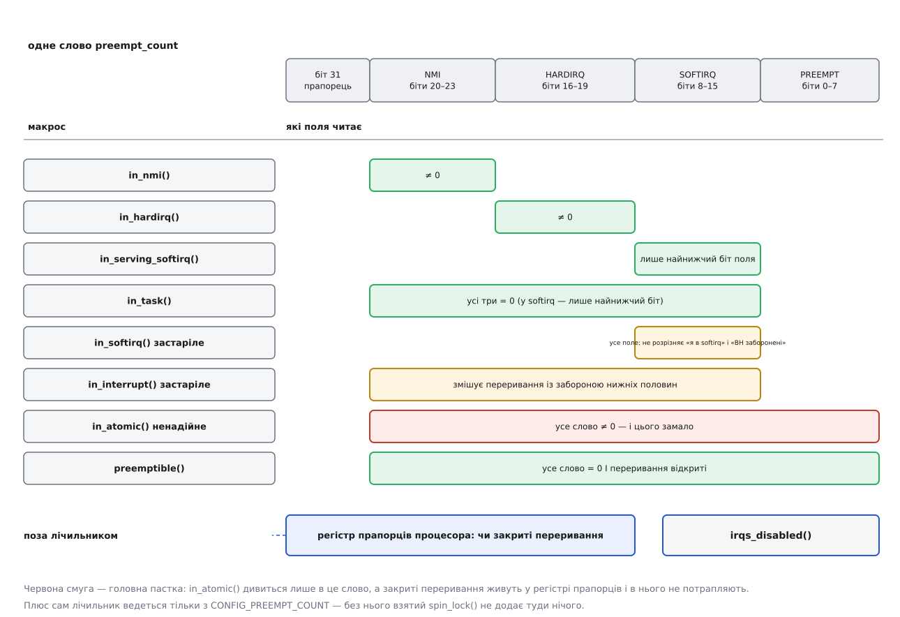

# 📋 Примітиви синхронізації ядра: контракт кожного

Кожен замок ядра — це не лише спосіб захистити дані, а ще й обіцянка: звідки його вільно брати, чи має право чекання заснути, що він робить із лічильником контексту й хто саме має право його віддати. Ці обіцянки ніде не перевіряються в мить виклику — компілятор пропустить будь-яку, — тому тут вони зібрані в таблиці: приходьте з готовим питанням «а це мені звідси можна» і забирайте відповідь.

Усе нижче стосується внутрішніх примітивів ядра: заголовки з `include/linux/`, виклики з коду модуля чи драйвера. Сигнатури звірені з деревом Linux станом на 2026 рік; там, де інтерфейс за останні роки змінювався, версію названо окремо.

## Три питання, на які відповідає контракт

Питання перше — **чи спить**. Примітив, який може заснути, законний лише в контексті задачі, і ця межа непрохідна.

Питання друге — **що він зробить із `preempt_count`**. Взявши спін-замок, ви змінюєте контекст самі собі: усе, що виконується далі, вже атомарне, і сон у ньому заборонений так само, як в обробнику переривання.

Питання третє — **хто має право звільнити**. Замки з власником вимагають, щоб віддала та сама задача; примітиви без власника (семафор, завершення) саме тому й існують, що дозволяють іншого звільнювача.

## Звідки законно кликати

Стовпці — контекст виклику. «Задача» тут означає код у контексті задачі **без** узятого спін-замка й без заборони витіснення; узятий спін-замок переводить вас у стовпець «атомарний контекст задачі».

| примітив | спить | задача | задача під спін-замком | softirq | обробник переривання | NMI |
|---|---|---|---|---|---|---|
| `raw_spinlock_t` | ні | так | так | так | так | так, але лише замок, який більше ніде не беруть |
| `spinlock_t` | ні (під `PREEMPT_RT` — так) | так | так | так | так | ні |
| `rwlock_t` | ні (під `PREEMPT_RT` — так) | так | так | так | так | ні |
| `seqlock_t`, читання | ні | так | так | так | так | ні, крім `seqcount_latch` |
| `seqlock_t`, письмо | ні | так | так | так | так | ні |
| `local_lock_t` | ні (під `PREEMPT_RT` — так) | так | так | так | так, варіантом `_irqsave` | ні |
| `struct mutex` | **так** | так | **ні** | **ні** | **ні** | ні |
| `struct rw_semaphore` | **так** | так | **ні** | **ні** | **ні** | ні |
| `struct semaphore`, `down()` | **так** | так | **ні** | **ні** | **ні** | ні |
| `struct semaphore`, `up()` і `down_trylock()` | ні | так | так | так | так | ні |
| `completion`, очікування | **так** | так | **ні** | **ні** | **ні** | ні |
| `completion`, `complete()` | ні | так | так | так | так | ні |
| `atomic_t` | ні | так | так | так | так | так |
| `rcu_read_lock()` | ні | так | так | так | так | так |
| `synchronize_rcu()` | **так** | так | **ні** | **ні** | **ні** | ні |
| `call_rcu()`, `kfree_rcu()` | ні | так | так | так | так | ні |

Три місця в цій таблиці варто прочитати двічі.

**`mutex_trylock()` не спить — і все одно заборонений в обробнику.** Спокуса очевидна: якщо функція повертає нуль замість того, щоб чекати, чому б не покликати її з тасклета? Бо м'ютекс записує **власника**, а власником може бути тільки задача; в обробнику переривання власником запишеться випадкова жертва, у чиєму контексті ми опинилися, і звільнити замок правильно вже не зможе ніхто. Документація ядра каже про це прямо: м'ютекси не вживають у контексті апаратних і програмних переривань, зокрема в тасклетах і таймерах.

**Семафор і завершення розділені навпіл.** Чекати можна лише з задачі, а сповіщати — звідки завгодно, крім немаскованого переривання: і з тіла softirq, і з обробника переривання. Це не хиба інтерфейсу, а його суть: обидва примітиви існують саме для випадку «одна сторона чекає, інша сповіщає з переривання».

**Стовпець NMI майже весь читається одним правилом.** Немаскована подія приходить навіть тоді, коли переривання закриті, — отже, вона може застати на цьому ж ядрі процесора того самого власника посеред ділянки, і чекання буде вічним. Правило звідси таке: **безумовно законні в NMI лише атомарні операції, буфери свого ядра процесора й `rcu_read_lock()`**; усе, що всередині бере хоч якийсь замок, безпечне рівно доти, доки цього замка ніколи не тримають на тому самому ядрі поза NMI — саме тому «так» у рядку `raw_spinlock_t` іде із застереженням, а `complete()`, `up()` і `call_rcu()`, які теж беруть усередині замок, у цьому стовпці стоять із «ні». Читання `seqlock_t` не бере замка й не спить, але потрапляє в ту саму пастку з іншого боку: якщо немаскована подія застала те саме ядро процесора всередині `write_seqlock()`, цикл `read_seqretry()` не завершиться ніколи, бо письменник спинений і дописати йому нема коли. Для читання, яке має працювати й з NMI, ядро тримає окремий різновид — `seqcount_latch` (на ньому побудовано `ktime_get_mono_fast_ns()`). Практика ж уся зводиться до одного: у коді NMI роблять мінімум, а решту віддають назовні через `irq_work`.

## Що кожен виклик робить із `preempt_count`

Лічильник контексту — одне слово при кожній задачі, поділене на поля. Праворуч у таблиці — поле, у яке виклик додає, і на скільки. Числа подано в значеннях самого слова, тож «одиниця поля» в кожного своя: `1` для `PREEMPT`, `0x100` для `SOFTIRQ`, `0x10000` для `HARDIRQ`, `0x100000` для `NMI`.

| виклик | поле `preempt_count` | скільки | ще й переривання |
|---|---|---|---|
| `preempt_disable()` | `PREEMPT` | `+1` | — |
| `spin_lock()`, `read_lock()`, `write_lock()` | `PREEMPT` | `+1` | — |
| `spin_lock_bh()` | `SOFTIRQ` і `PREEMPT` | `+0x200` і `+1` | — |
| `spin_lock_irq()` | `PREEMPT` | `+1` | закриває беззастережно |
| `spin_lock_irqsave(&l, flags)` | `PREEMPT` | `+1` | закриває, стан зберігає у `flags` |
| `local_bh_disable()` | `SOFTIRQ` | `+0x200` | — |
| виконання тіла softirq | `SOFTIRQ` | `+0x100` | — |
| вхід в обробник переривання | `HARDIRQ` | `+0x10000` | — |
| немасковане переривання | `NMI` | `+0x100000` | — |
| `local_lock()` | `PREEMPT` | `+1` | — |
| `local_lock_irqsave(&l, flags)` | `PREEMPT` | `+1` | закриває зі збереженням |
| `rcu_read_lock()` без `CONFIG_PREEMPT_RCU` | `PREEMPT` | `+1` | — |
| `rcu_read_lock()` із `CONFIG_PREEMPT_RCU` | **жодного** — рахує `current->rcu_read_lock_nesting` | — | — |
| `mutex_lock()`, `down_read()`, `down()` | **жодного** | — | — |

Асиметрія `+0x200` і `+0x100` у полі `SOFTIRQ` — не примха. Найнижчий біт поля означає «я **всередині** тіла softirq», а `local_bh_disable()` додає одразу два, тобто «нижні половини заборонені, але я не в жодній із них». Саме тому `in_serving_softirq()` дивиться лише на цей найнижчий біт і чесно відрізняє одне від одного, а `in_softirq()` дивиться на все поле й відповідає одразу на два різні питання — за що його й позначено застарілим.

Друга асиметрія важливіша: **закриті переривання в лічильник не потрапляють узагалі**. Вони живуть у регістрі прапорців процесора, і жодне поле цього слова про них не знає. Звідси й обмеження всіх перевірок, що читають лише лічильник.

## Макроси перевірки контексту: який каже правду



*Смуга праворуч показує, які поля слова читає макрос. Верхні чотири рядки відповідають на питання «у якому я контексті» і роблять це чесно. Червоний рядок — на питання «чи можна тут спати», і на нього цим словом відповісти неможливо: закриті переривання лежать поза лічильником, а без `CONFIG_PREEMPT_COUNT` у нього не потрапляє навіть узятий спін-замок.*

| макрос | що обчислює | на що чесно відповідає | застереження |
|---|---|---|---|
| `in_nmi()` | `NMI ≠ 0` | «я в немаскованому перериванні» | надійний |
| `in_hardirq()` | `HARDIRQ ≠ 0` | «я в обробнику апаратного переривання» | надійний; під `PREEMPT_RT` більшість обробників винесено в потоки, тож там він поверне «ні» там, де звичайне ядро сказало б «так» |
| `in_serving_softirq()` | найнижчий біт `SOFTIRQ` | «я всередині тіла softirq» | надійний |
| `in_task()` | `NMI`, `HARDIRQ` і найнижчий біт `SOFTIRQ` — усі нулі | «мене покликали з задачі, а не з переривання» | надійний **на це питання**; він нічого не каже про те, чи можна тут спати — задача під спін-замком теж `in_task()` |
| `in_softirq()` | усе поле `SOFTIRQ` | двозначний: «я в softirq **або** нижні половини просто заборонені» | **позначений застарілим у `preempt.h`** |
| `in_interrupt()` | `NMI`, `HARDIRQ`, усе поле `SOFTIRQ` | те саме змішування | **позначений застарілим у `preempt.h`** |
| `in_atomic()` | усе слово `≠ 0` | нічого певного | **ненадійний**: не бачить закритих переривань; без `CONFIG_PREEMPT_COUNT` не бачить навіть узятого спін-замка |
| `preemptible()` | лічильник `= 0` **і** переривання відкриті | «тут можна перемкнути задачу» | правдивий, доки ведеться лічильник |
| `irqs_disabled()` | регістр прапорців | «переривання закриті» | надійний, але про лічильник не знає нічого |

Старе ім'я `in_irq()` із сучасних ядер прибрано — на його місці `in_hardirq()`.

Далі — не питання, а **позначки контракту**. Вони не повертають відповіді для гілки, вони оголошують, чого функція вимагає від того, хто її кличе:

| позначка | що оголошує | коли справді перевіряє |
|---|---|---|
| `might_sleep()` | «мене можна кликати лише звідти, де вільно спати» | з `CONFIG_DEBUG_ATOMIC_SLEEP`; без нього лишається точкою добровільного витіснення |
| `might_sleep_if(cond)` | те саме, але за умовою (типово — за прапорцями виділення пам'яті) | так само |
| `cant_sleep()` | зворотне: «сюди не можна з місця, де сплять» | з `CONFIG_DEBUG_ATOMIC_SLEEP` |
| `might_fault()` | «я звертаюся в простір користувача, а це може дати сторінковий збій і сон» | з налагоджувальними пунктами |
| `lockdep_assert_held(&lock)` | «на вході цей замок уже мусить бути взятий» | з `CONFIG_LOCKDEP` |
| `lockdep_assert_irqs_disabled()` | «на вході переривання мусять бути закриті» | з `CONFIG_LOCKDEP` |

Різниця між двома таблицями — не стилістична, а та, заради якої вони й розділені. **Питати контекст, щоб змінити поведінку, — помилка; оголошувати вимогу до контексту — норма.** Функція, яка гілкується за `in_atomic()`, поводиться по-різному залежно від того, хто її покликав, і зламається на тій конфігурації ядра, де лічильник не ведеться. Функція, яка починається з `might_sleep()` і `lockdep_assert_held()`, поводиться однаково завжди, а неправильного викликача називає на ім'я в журналі.

## Спін-замки: сигнатури

Заголовок — `linux/spinlock.h`. Тип `spinlock_t`, для коду, який мусить крутитися за будь-якого складання, — `raw_spinlock_t` із дзеркальним набором `raw_spin_*`.

```c
DEFINE_SPINLOCK(name);                 /* статично */
spin_lock_init(&lock);                 /* динамічно, обов'язково до першого взяття */

void spin_lock(spinlock_t *lock);
void spin_lock_bh(spinlock_t *lock);           /* + заборона нижніх половин */
void spin_lock_irq(spinlock_t *lock);          /* + закриття переривань, беззастережне */
void spin_lock_irqsave(spinlock_t *lock, unsigned long flags);   /* макрос: flags — вихідний */

void spin_unlock(spinlock_t *lock);
void spin_unlock_bh(spinlock_t *lock);
void spin_unlock_irq(spinlock_t *lock);
void spin_unlock_irqrestore(spinlock_t *lock, unsigned long flags);

int  spin_trylock(spinlock_t *lock);           /* 1 — узяли, 0 — зайнято */
int  spin_trylock_bh(spinlock_t *lock);
int  spin_trylock_irqsave(spinlock_t *lock, unsigned long flags);

void spin_lock_nested(spinlock_t *lock, int subclass);  /* два замки одного класу — для lockdep */
int  spin_is_locked(spinlock_t *lock);         /* лише для налагодження */
void assert_spin_locked(spinlock_t *lock);
```

Правило пар тут суворе й невзаємозамінне: `_bh` віддають через `_bh`, `_irq` через `_irq`, `_irqsave` через `_irqrestore` **із тією самою змінною** `flags`.

Про `flags` варто сказати окремо, бо тут ламаються найчастіше. Це `unsigned long` — не `int` і не `u32`; на 64-бітних архітектурах вужчий тип відрізає половину слова прапорців. Це **локальна змінна на стеку** — не поле структури й не глобальна: у неї пише і з неї читає одна й та сама ділянка, і жоден інший потік не має її бачити. І це **вхідний-вихідний параметр макроса**, а не значення: передати `flags` у сусідню функцію, щоб та зробила `spin_unlock_irqrestore()`, — типовий спосіб отримати відкриті переривання не там, де очікували.

Різниця між `spin_lock_irq()` і `spin_lock_irqsave()` — у здатності вкладатися одне в одного. Перший наприкінці відкриває переривання беззастережно, тому законний тільки там, де ви напевно знаєте, що вони були відкриті. Другий відновлює саме той стан, який був, тому вкладається сам у себе — і саме тому в чужому коді трапляється майже завжди він.

Читання-письмо (`rwlock_t`, заголовок `linux/rwlock.h`, підтягується через `spinlock.h`) має дзеркальний набір: `read_lock()`, `write_lock()`, `read_trylock()`, `write_trylock()` — усі з тими самими суфіксами `_bh`/`_irq`/`_irqsave`, ініціалізація `DEFINE_RWLOCK(name)` або `rwlock_init(&lock)`. Тільки користі з нього мало: посібник ядра каже, що `rwlock_t` трохи повільніший за звичайний замок і на практиці рідко себе виправдовує. Коли читачів справді набагато більше за письменників, беруть не його, а seqlock або RCU.

> 🔧 **Навіщо це.** Під `PREEMPT_RT` `spinlock_t` і `rwlock_t` перетворюються на сплячі замки на основі `rt_mutex`, витіснення не забороняють, а суфікси `_irq` і `_irqsave` перестають закривати переривання процесора. Писати ці суфікси й далі потрібно — вони узгоджують порядок узяття для перевірки, — але код, що спирався саме на побічну дію «сюди не втрутиться обробник», під реальночасовим ядром ламається без жодного повідомлення. Справжнім спін-замком за будь-якого складання лишається тільки `raw_spinlock_t`, і документація ядра радить брати його лише в критичному ядерному коді й низькорівневій обробці переривань ([витісненість ядра](topic:sys-unix/kernel-preemption) — які моделі витіснення бувають, чим `PREEMPT_RT` відрізняється від решти й що в ньому стає потоком).

## Сплячі замки: сигнатури

```c
/* м'ютекс — linux/mutex.h */
DEFINE_MUTEX(name);                    mutex_init(&m);
void mutex_lock(struct mutex *m);
int  mutex_lock_interruptible(struct mutex *m);   /* 0 або -EINTR */
int  mutex_lock_killable(struct mutex *m);        /* 0 або -EINTR, лише смертельний сигнал */
void mutex_lock_io(struct mutex *m);              /* очікування рахується як iowait */
int  mutex_trylock(struct mutex *m);              /* 1 — узяли; НЕ з переривання */
void mutex_unlock(struct mutex *m);               /* лише власник */
bool mutex_is_locked(struct mutex *m);            /* лише для налагодження */
int  atomic_dec_and_mutex_lock(atomic_t *cnt, struct mutex *m);

/* семафор читання-письма — linux/rwsem.h */
DECLARE_RWSEM(name);                   init_rwsem(&sem);
void down_read(struct rw_semaphore *sem);
int  down_read_interruptible(struct rw_semaphore *sem);
int  down_read_killable(struct rw_semaphore *sem);
int  down_read_trylock(struct rw_semaphore *sem);      /* 1 — узяли */
void up_read(struct rw_semaphore *sem);
void down_write(struct rw_semaphore *sem);
int  down_write_killable(struct rw_semaphore *sem);
int  down_write_trylock(struct rw_semaphore *sem);
void up_write(struct rw_semaphore *sem);
void downgrade_write(struct rw_semaphore *sem);        /* письменник стає читачем без розриву */
void down_read_non_owner(struct rw_semaphore *sem);    /* виняток; див. нижче */
void up_read_non_owner(struct rw_semaphore *sem);

/* лічильний семафор — linux/semaphore.h */
DEFINE_SEMAPHORE(name, n);             sema_init(&sem, n);
void down(struct semaphore *sem);
int  down_interruptible(struct semaphore *sem);        /* 0 або -EINTR */
int  down_killable(struct semaphore *sem);
int  down_trylock(struct semaphore *sem);              /* 0 — УЗЯЛИ, ненуль — зайнято */
int  down_timeout(struct semaphore *sem, long jiffies);/* 0 або -ETIME */
void up(struct semaphore *sem);
```

Значення, що повертають, тут неоднорідні, і на цьому спотикаються: `spin_trylock()` і `down_read_trylock()` повертають **1 при успіху**, а `down_trylock()` — **0 при успіху**. Це давня незручність, яку не виправляють, щоб не переписувати тисячі викликів; єдиний захист — читати сигнатуру, а не покладатися на здоровий глузд.

Права на звільнення в цих трьох різні, і саме різниця пояснює, навіщо в ядрі тримають усі три.

**М'ютекс** веде власника. Звідси набір правил: тримає одна задача; звільняє лише власник; повторне взяття тим самим власником заборонене; звільнити двічі не можна; задача не має права завершитися з узятим м'ютексом; пам'ять під узятим замком не звільняють і взятий замок не переініціалізовують. Ці ж правила дають і вигоду — власника видно, тож на нього можна перекласти пріоритет чекача, а поки він виконується на іншому ядрі процесора, претендентові вигідніше покрутитися, ніж засинати.

**Семафор читання-письма** тримається тих самих правил за замовчуванням, але має вузьку щілину: пара `down_read_non_owner()` / `up_read_non_owner()` дозволяє звільнити з іншої задачі. Коментар у заголовку ядра просить уникати її й радить у таких випадках правильну абстракцію — завершення.

**Лічильний семафор власника не має взагалі.** Заголовок каже про це прямо: на відміну від м'ютексів, семафор може звільнити не той потік, який його брав, а `down_trylock()` і `up()` вільно кликати з переривання. Плата — саме та, через яку його в новому коді не радять: без власника неможливо передати пріоритет, тож під `PREEMPT_RT` семафор лишається дірою в успадкуванні пріоритетів ([інверсія пріоритетів](topic:sf-os/priority-inversion) — чому низькопріоритетна задача під замком блокує високопріоритетну і чим це лікують).

**Різниця між `_interruptible` і `_killable` вирішується не смаком.** Перший прокидається від будь-якого сигналу, тож викликач мусить уміти акуратно згорнутися й повернути `-ERESTARTSYS`. Другий прокидається лише від смертельного сигналу — це те, що ставлять на шляхах, де перервати посеред роботи небезпечно, але лишити процес невбиваним теж не можна.

## Не-замки: завершення й атомарні лічильники

```c
/* завершення — linux/completion.h */
DECLARE_COMPLETION(name);              init_completion(&c);
DECLARE_COMPLETION_ONSTACK(name);      /* для змінної на стеку: правильно для lockdep */
void reinit_completion(struct completion *c);          /* перед повторним ужитком */

void          wait_for_completion(struct completion *c);
int           wait_for_completion_interruptible(struct completion *c);
int           wait_for_completion_killable(struct completion *c);
unsigned long wait_for_completion_timeout(struct completion *c, unsigned long jiffies);
long          wait_for_completion_interruptible_timeout(struct completion *c, unsigned long j);
void          wait_for_completion_io(struct completion *c);      /* облік як iowait */

void complete(struct completion *c);       /* будить ОДНОГО чекача; можна з переривання */
void complete_all(struct completion *c);   /* будить усіх і лишає стан «уже сталося» */
bool try_wait_for_completion(struct completion *c);   /* не спить */
bool completion_done(struct completion *c);           /* не спить */
```

Варіанти з часом повертають **скільки часу лишилося**: нуль означає, що вичерпали, і це єдиний спосіб відрізнити «дочекалися» від «здалися». `complete_all()` відрізняється від `complete()` не кількістю розбуджених, а слідом: після нього завершення лишається в стані «подія вже сталася», тож усі, хто прийде пізніше, пройдуть без очікування — доки хтось не покличе `reinit_completion()`.

Атомарні операції (`linux/atomic.h`) працюють без будь-якого контексту, і саме тому ними користуються там, де замок неможливий.

```c
atomic_t counter = ATOMIC_INIT(0);

int  atomic_read(const atomic_t *v);            /* READ_ONCE — упорядкування НЕ дає  */
void atomic_set(atomic_t *v, int i);            /* WRITE_ONCE — так само             */

void atomic_inc(atomic_t *v);                   /* без повернення → НЕвпорядковані   */
void atomic_add(int i, atomic_t *v);
bool atomic_dec_and_test(atomic_t *v);          /* 1, якщо стало нулем               */
bool atomic_add_unless(atomic_t *v, int a, int u);

int  atomic_inc_return(atomic_t *v);            /* із поверненням → ПОВНІ бар'єри    */
int  atomic_fetch_add(int i, atomic_t *v);
int  atomic_cmpxchg(atomic_t *v, int old, int new);
bool atomic_try_cmpxchg(atomic_t *v, int *old, int new);

/* послаблені різновиди тих самих операцій */
atomic_inc_return_relaxed(v);  atomic_fetch_add_acquire(i, v);  atomic_fetch_add_release(i, v);
smp_mb__before_atomic();  smp_mb__after_atomic();   /* добудувати бар'єр до невпорядкованої */
```

Правило впорядкування записане в `Documentation/atomic_t.txt` одним рядком і варте того, щоб його пам'ятати дослівно: операції з поверненням значення впорядковані повністю, операції без повернення — не впорядковані взагалі. Тобто `atomic_inc()` гарантує лише неподільність самого збільшення й нічого не каже про порядок сусідніх доступів до пам'яті; коли порядок потрібен, беруть різновид із поверненням або добудовують бар'єр явно ([упорядкування пам'яті та бар'єри](topic:sf-tasks/memory-ordering-barriers) — чому процесор і компілятор переставляють доступи й що саме забороняє бар'єр).

`atomic_t` — це знаковий `int`; окремих беззнакових різновидів немає, бо ядро складається з `-fno-strict-overflow`, тож переповнення поводиться як доповняльний код. Для ширших лічильників є `atomic_long_t` і `atomic64_t`.

## Читання без замка: seqlock, RCU, local_lock

```c
/* послідовний замок — linux/seqlock.h */
DEFINE_SEQLOCK(sl);                    seqlock_init(&sl);

unsigned seq;                           /* читач */
do {
    seq = read_seqbegin(&sl);
    /* тут читаємо — і НІЧОГО не робимо з прочитаним */
} while (read_seqretry(&sl, seq));

write_seqlock(&sl);   /* письменник: бере вбудований спін-замок */
write_sequnlock(&sl);
/* із суфіксами: write_seqlock_bh / _irq / _irqsave — правила ті самі, що в spin_lock */
read_seqlock_excl(&sl);   /* читач, який не хоче повторювати: бере той самий спін-замок */
```

Контракт читача seqlock жорсткіший, ніж здається. Усередині спроби дані можуть бути **напівзаписані**: вказівник — уже новий, а довжина — ще стара. Тому в цій ділянці не можна ані спати, ані ділити на прочитане число, ані переходити за прочитаним вказівником, ані робити щось незворотне. Правильний зразок — скопіювати значення в локальні змінні, вийти з циклу і аж тоді щось із ними робити. Письменник же бере звичайний спін-замок, тож усі його обмеження — це обмеження `spin_lock` із відповідним суфіксом.

```c
/* RCU — linux/rcupdate.h */
rcu_read_lock();                    /* законний будь-де, зокрема в NMI */
p = rcu_dereference(gp);            /* читати вказівник тільки так */
/* ... користуємося p; спати тут НЕ можна ... */
rcu_read_unlock();

rcu_assign_pointer(gp, new);        /* письменник підміняє вказівник */
synchronize_rcu();                  /* СПИТЬ: лише контекст задачі */
call_rcu(&old->rcu, free_cb);       /* відкладене звільнення; можна з атомарного контексту */
kfree_rcu(old, rcu);                /* те саме для простого kfree */

int idx = srcu_read_lock(&ss);      /* різновид, у ділянці якого спати МОЖНА */
srcu_read_unlock(&ss, idx);         /* повернути рівно той індекс, що дали */
```

Найчастіша помилка з RCU — заснути всередині ділянки читання: узяти там м'ютекс, виділити пам'ять з `GFP_KERNEL` або скопіювати щось у простір користувача. Коли сон усередині справді потрібен, беруть SRCU — окремий різновид саме для цього. І окремо: покладатися на те, що ядро складене без витісненості й тому ділянка читання «і так атомарна», не можна — довідник RCU попереджає, що такий код зламається, щойно ввімкнуть `CONFIG_PREEMPT_RCU`, де ділянку читання можна витіснити ([RCU: читання без замків і відкладене звільнення](topic:sys-unix/rcu-read-copy-update) — як письменник підміняє версію структури й чому старий примірник звільняють не одразу).

```c
/* дані свого ядра процесора — linux/local_lock.h */
static DEFINE_PER_CPU(local_lock_t, llock) = INIT_LOCAL_LOCK(llock);
static DEFINE_PER_CPU(unsigned long, hits);

local_lock(&llock);            /* звичайне ядро — preempt_disable(),
                                  PREEMPT_RT   — спін-замок цього ядра */
this_cpu_inc(hits);
local_unlock(&llock);
/* різновиди: local_lock_irq / local_lock_irqsave / local_trylock — і дзеркальні unlock */
```

Відповідність, яку варто тримати в голові: у звичайному ядрі `local_lock()` — це рівно `preempt_disable()`, `local_lock_irq()` — `local_irq_disable()`, `local_lock_irqsave()` — `local_irq_save()`. Виграш не в машинному коді, якого немає, а в записаному намірі: замість голого `preempt_disable()`, від якого читач мусить самотужки здогадуватися, що саме тут захищають, стоїть замок з іменем, який перевіряє `lockdep` і який під реальночасовим ядром стає справжнім замком свого ядра процесора ([дані свого ядра процесора](topic:sys-unix/per-cpu-data) — навіщо ядро тримає окремий примірник структури на кожне ядро процесора й чому міграція задачі ламає такий захист).

## Обов'язкові пари ініціалізації

Жоден із цих примітивів не можна брати неініціалізованим — навіть якщо пам'ять під ним занулена. Причина не в самих полях, а в тому, що динамічна ініціалізація ще й заводить окремий **клас замка** для `lockdep`: без цього перевірка порядку взяття або зіллє різні замки в один клас, або промовчить.

| тип | статично | у структурі, що виділяється | заголовок |
|---|---|---|---|
| `spinlock_t` | `DEFINE_SPINLOCK(name)` | `spin_lock_init(&x)` | `linux/spinlock.h` |
| `raw_spinlock_t` | `DEFINE_RAW_SPINLOCK(name)` | `raw_spin_lock_init(&x)` | `linux/spinlock.h` |
| `rwlock_t` | `DEFINE_RWLOCK(name)` | `rwlock_init(&x)` | `linux/rwlock.h` |
| `seqlock_t` | `DEFINE_SEQLOCK(name)` | `seqlock_init(&x)` | `linux/seqlock.h` |
| `seqcount_t` | `SEQCNT_ZERO(name)` | `seqcount_init(&x)` | `linux/seqlock.h` |
| `struct mutex` | `DEFINE_MUTEX(name)` | `mutex_init(&x)` | `linux/mutex.h` |
| `struct rw_semaphore` | `DECLARE_RWSEM(name)` | `init_rwsem(&x)` | `linux/rwsem.h` |
| `struct semaphore` | `DEFINE_SEMAPHORE(name, n)` | `sema_init(&x, n)` | `linux/semaphore.h` |
| `struct completion` | `DECLARE_COMPLETION(name)` | `init_completion(&x)`, далі `reinit_completion(&x)` | `linux/completion.h` |
| `atomic_t` | `ATOMIC_INIT(0)` | `atomic_set(&x, 0)` | `linux/atomic.h` |
| `local_lock_t` | `DEFINE_PER_CPU(local_lock_t, x) = INIT_LOCAL_LOCK(x)` | `local_lock_init(&x)` | `linux/local_lock.h` |
| RCU | ініціалізації не потребує | — | `linux/rcupdate.h` |

Два підводні камені саме тут.

**`DECLARE_COMPLETION_ONSTACK()` — не косметика.** Завершення, оголошене звичайним макросом на стеку, дає `lockdep` неправильний ключ класу: об'єкт живе рівно один виклик, а клас лишається назавжди. Різниця видно тільки на ядрі з увімкненою перевіркою — і саме там її й ловлять.

**`DEFINE_SEMAPHORE()` змінив сигнатуру.** До ядра 6.3 включно макрос брав саме ім'я й давав двійковий семафор із лічильником 1; починаючи з 6.4 він вимагає другого аргументу — початкового значення лічильника. Код, перенесений з давнішого дерева, тут просто не збереться, і це найдешевша з можливих поломок.

## Прапорці складання, які роблять перевірки видимими

| символ | що вмикає | що ловить | ціна |
|---|---|---|---|
| `CONFIG_PREEMPT_COUNT` | саме ведення лічильника | без нього всі перевірки контексту брешуть | немає; обирається з `PREEMPTION` і з `DEBUG_ATOMIC_SLEEP` |
| `CONFIG_DEBUG_ATOMIC_SLEEP` | перевірки в `might_sleep()` і `cant_sleep()` | сон у атомарному контексті — з іменем файлу й рядком | помірна |
| `CONFIG_PROVE_LOCKING` | `lockdep` | цикл у порядку взяття замків; замок, узятий і в перериванні, і без `irqsave`; сплячий замок під спін-замком | велика: тримають на стенді, не на бойовій машині |
| `CONFIG_DEBUG_SPINLOCK` | перевірки спін-замків у роботі | неініціалізований замок, подвійне звільнення, звільнення чужим | помірна |
| `CONFIG_DEBUG_MUTEXES` | перевірки м'ютексів | звільнення не власником, повторне взяття, вихід задачі з узятим замком | мала |
| `CONFIG_DEBUG_RWSEMS` | перевірки `rw_semaphore` | невідповідність власника при звільненні | мала |
| `CONFIG_DEBUG_LOCK_ALLOC` | стеження за життям замків | звільнення пам'яті, у якій лежить узятий замок | помірна |
| `CONFIG_PROVE_RCU` | `lockdep` для RCU | `rcu_dereference()` поза ділянкою читання | помірна |
| `CONFIG_DEBUG_PREEMPT` | перевірки лічильника | від'ємне значення, `smp_processor_id()` у витіснюваному коді | помітна |
| `CONFIG_LOCK_STAT` | статистику в `/proc/lock_stat` | не помилки, а вартість: де саме змагаються | велика |

Робочий мінімум для того, хто пише модуль, — три перші рядки разом: `PROVE_LOCKING`, `DEBUG_ATOMIC_SLEEP` і `DEBUG_SPINLOCK`. Вони ловлять помилку в момент першої ж можливості, а не тоді, коли збіг у часі нарешті стався на чужій машині.

## Мінімальний правильний зразок

Один пристрій, чотири різні потреби — і чотири різні примітиви, кожен на своєму місці:

```c
#include <linux/completion.h>
#include <linux/interrupt.h>
#include <linux/mutex.h>
#include <linux/slab.h>
#include <linux/spinlock.h>

struct my_dev {
    spinlock_t         lock;      /* список чіпає обробник → спін-замок       */
    struct list_head   events;
    struct mutex       cfg_lock;  /* налаштування чіпає лише задача → м'ютекс */
    struct dev_config  cfg;
    struct completion  done;      /* задача чекає, обробник сповіщає          */
    atomic_t           dropped;   /* лічильник із будь-якого контексту        */
};

static int dev_init(struct my_dev *d)
{
    spin_lock_init(&d->lock);
    INIT_LIST_HEAD(&d->events);
    mutex_init(&d->cfg_lock);
    init_completion(&d->done);
    atomic_set(&d->dropped, 0);
    return 0;
}

/* Шлях задачі. Виділення — ЗА межами замка: kmalloc(GFP_KERNEL) має право заснути. */
int dev_push(struct my_dev *d, u32 code)
{
    struct event *e = kmalloc(sizeof(*e), GFP_KERNEL);
    unsigned long flags;                      /* локальна, unsigned long      */

    if (!e)
        return -ENOMEM;
    e->code = code;

    spin_lock_irqsave(&d->lock, flags);       /* цей замок бере й обробник    */
    list_add_tail(&e->node, &d->events);
    spin_unlock_irqrestore(&d->lock, flags);
    return 0;
}

/* Шлях обробника. Переривання вже закриті — досить spin_lock(). */
static irqreturn_t dev_irq(int irq, void *arg)
{
    struct my_dev *d = arg;
    struct event *e = kmalloc(sizeof(*e), GFP_ATOMIC);   /* не GFP_KERNEL!    */

    if (!e) {
        atomic_inc(&d->dropped);              /* законно навіть звідси        */
        return IRQ_HANDLED;
    }
    e->code = read_status(d);

    spin_lock(&d->lock);
    list_add_tail(&e->node, &d->events);
    spin_unlock(&d->lock);

    complete(&d->done);                       /* сповістити — можна; узяти    */
    return IRQ_HANDLED;                       /* м'ютекс — ні                 */
}

/* Довга робота під сплячим замком — лише з контексту задачі. */
int dev_reconfigure(struct my_dev *d, const struct dev_config *new_cfg)
{
    if (mutex_lock_interruptible(&d->cfg_lock))
        return -ERESTARTSYS;

    d->cfg = *new_cfg;
    apply_config(d);                          /* може чекати на апаратуру     */

    mutex_unlock(&d->cfg_lock);               /* звільняє той самий, хто брав */
    return 0;
}
```

Читати цей зразок варто не як «правильний код», а як чотири окремі рішення. Спін-замок узято тому, що структуру чіпає обробник; `_irqsave` — тому, що з боку задачі переривання відкриті; `GFP_ATOMIC` в обробнику — тому, що `GFP_KERNEL` дозволяє заснути; м'ютекс — тому, що `apply_config()` довга й до неї не дотягується жоден обробник.

## Часті пастки

| що написали | на що розраховували | що вийшло насправді |
|---|---|---|
| `int flags;` перед `spin_lock_irqsave()` | зберегти стан переривань | на 64 бітах зрізали половину слова прапорців; відновлення дає непередбачуваний стан |
| `flags` полем структури або глобальною | те саме | інша задача перезаписала вашу копію між взяттям і звільненням |
| `spin_lock_irq()` у функції, яку кличуть із закритими перериваннями | коротше й дешевше | наприкінці переривання відкрилися посеред чужої критичної ділянки |
| `mutex_trylock()` із тасклета — «він же не спить» | обійти заборону м'ютекса | заборона не про сон, а про власника: власником не може бути обробник |
| `kmalloc(GFP_KERNEL)` під спін-замком | звичне виділення | `might_sleep()` спрацював; треба `GFP_ATOMIC` або винести виділення за замок |
| `mutex_unlock()` з обробника переривання | «звільнити з переривання» | м'ютекс так не вміє: віддає лише той, хто взяв, а взяти міг лише задача; це вміють `semaphore` і `completion` |
| гілка `if (in_atomic()) ... else ...` | «поводитися розумно за контекстом» | у ядрі без `PREEMPT_COUNT` під спін-замком поверне нуль — і код засне |
| `mutex_lock()` усередині `rcu_read_lock()` | «ділянка ж коротка» | сон у ділянці читання RCU; для цього випадку є SRCU |
| читач seqlock узявся обробляти дані до `read_seqretry()` | «дані вже прочитані» | вони могли бути напівзаписані: новий вказівник зі старою довжиною |
| `preempt_disable()` замість `local_lock()` | «те саме, тільки без обгортки» | під `PREEMPT_RT` захисту не стало, а намір ніде не записаний |
| `DEFINE_SEMAPHORE(sem)` на ядрі 6.4 і новішому | двійковий семафор | не збереться: макрос вимагає другого аргументу |
| `DECLARE_COMPLETION()` для змінної на стеку | коротший запис | `lockdep` дістав ключ класу від об'єкта, який живе один виклик |

Спільне в цих дванадцяти рядках одне: жоден із них не ловиться читанням коду й майже жоден — звичайним тестуванням. Усі вони ловляться ядром, складеним із перевірками, — і саме тому тримати такий стенд дешевше, ніж будь-яка з цих помилок у роботі.
