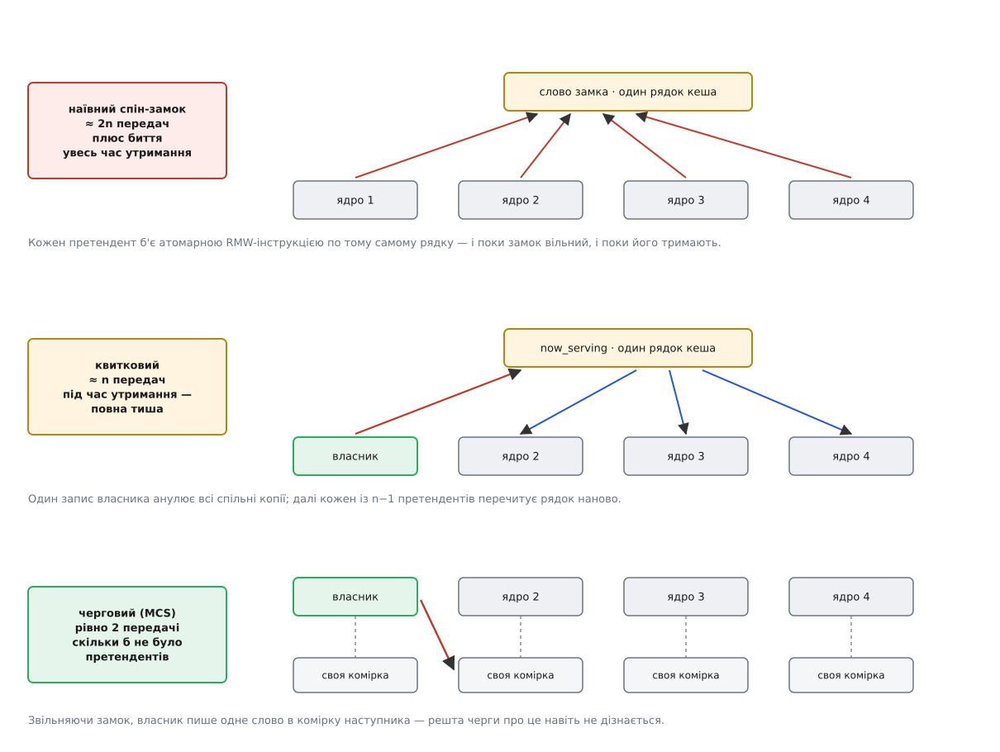
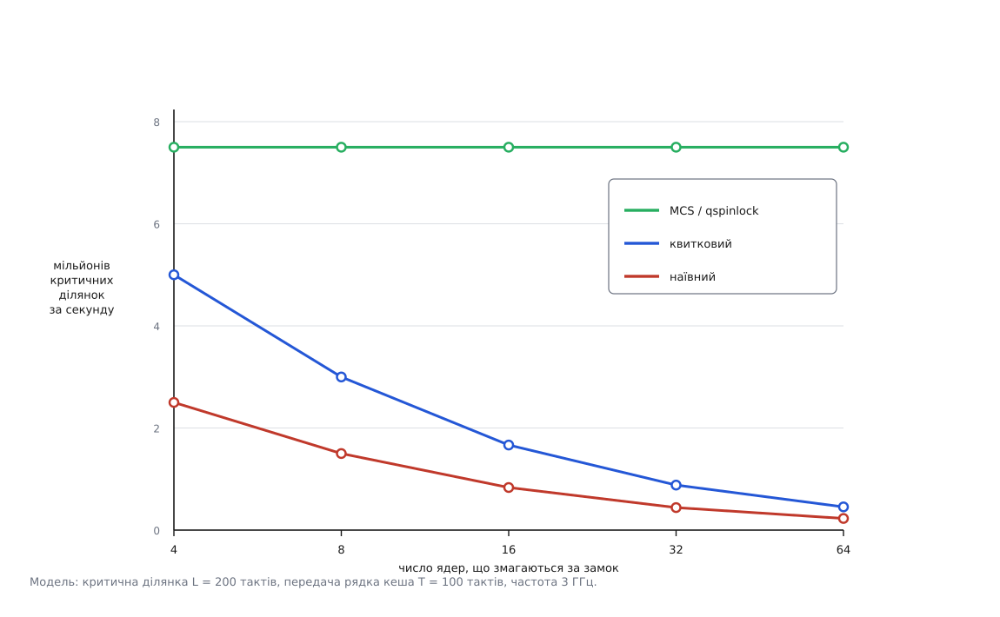

# 🧮 Скільки коштує змагання за замок

Замок сам по собі нічого не сповільнює — сповільнює його трафік когерентності, і цей трафік можна порахувати в тактах. Нижче — модель на двох параметрах, з якої випливають три числа: чому наївне крутіння дає квадратичний ріст витрат, чому справедливий квитковий замок квадратичності не прибирає, і чому лише перехід на чергу робить вартість передачі сталою.

## Одиниця вартості

Уся арифметика тримається на трьох правилах, які дає протокол когерентності ([протокол когерентності кешу](root:hw-arch/cache-coherence-protocol)):

1. Рядок кеша може бути **у виключному володінні лише одного ядра**. Атомарна операція читання-зміни-запису вимагає саме такого володіння ([атомарність і гонки](root:sf-tasks/atomicity-races)).
2. Перенести це володіння з ядра на ядро коштує **T тактів**, і для одного рядка ці перенесення **не паралеляться**: у кожну мить рядок їде лише в один бік.
3. Читання, коли рядок уже лежить у власному кеші в стані «спільний», коштує **нуль** — жодного трафіку.

Третє правило — не дрібниця, а вододіл між поколіннями замків: спільне читання безкоштовне, спільний запис — ні.

Величину T міряють напряму: беруть два ядра й ганяють між ними один рядок кеша атомарним `cmpxchg`. На Intel Sapphire Rapids таке перекидання рядка **туди й назад** займає всередині сокета в середньому 59 нс, у найгіршій парі ядер — 81 нс, а між сокетами — 138 нс (виміри Chips and Cheese; статус: опубліковані незалежні виміри конкретного покоління, не універсальна константа). На 3 ГГц це 180 і 410 тактів на повний оберт, тобто на дві передачі. Далі беремо

```
T = 100 тактів   — усередині сокета
T = 200 тактів   — між сокетами (NUMA)
```

Округлення свідомо грубе: усе, що з нього вийде, різнитиметься між поколіннями замків у десятки разів, а такий розрив нечутливий до другої значущої цифри ([прикидка «на серветці»](root:sf-apps/back-of-envelope)).

Другий параметр — **L**, довжина самої критичної ділянки в тактах. Візьмімо L = 200: це приблизно вставка вузла у зв'язаний список — кілька записів по вказівниках і жодного походу в пам'ять. Типова коротка ділянка під спін-замком у ядрі.

## Правило, з якого все випливає

Замок серіалізує роботу за побудовою: критичні ділянки йдуть одна за одною. Отже, пропускна здатність усієї структури — це просто зворотна величина часу на один цикл «передати замок + відпрацювати ділянку»:

```
цикл(n) = L + N(n)·T
X(n)    = f / цикл(n)          ядер, що змагаються — n; f — частота
```

Уся різниця між поколіннями замків сидить в одному місці — у функції **N(n)**, числі перенесень рядка, які лягають на одну передачу замка. Порахуймо її для кожного покоління.



*Ліворуч — вартість, праворуч — механізм, з якого вона береться. Червоні стрілки — перенесення рядка на запис, сині — перечитування. У третьому рядку червона стрілка одна, і другого рядка стрілок там немає взагалі.*

## Покоління перше: наївне крутіння

```c
static void tas_lock(int *lock)
{
    while (xchg(lock, 1))
        ;                       /* кожен оберт — атомарний ЗАПИС у спільний рядок */
}
```

Кожен оберт циклу вимагає рядок у виключне володіння. Наслідків два, і другий гірший за перший.

**Перший: трафік не спиняється, поки замок тримають.** Претенденти не знають, що замок зайнятий, доки не спробують; кожна спроба тягне рядок до себе. За час утримання L рядок устигає перелетіти L/T разів, і жодне з цих перенесень нічого не дає. Це чиста втрата пропускної здатності міжз'єднання — тієї самої, якою власник у цю мить возить **свої дані**.

**Другий: власник стоїть у черзі за власним замком.** Щоб замок відпустити, треба записати в те саме слово, тобто теж забрати рядок. У момент звільнення на цей рядок уже чекає n−1 незадоволених запитів. Запит власника стає в ту саму чергу й чекає близько (n−1)·T. Потім, коли звільнення нарешті лягло, хвиля недовиконаних RMW спрацьовує — і переможець може виявитися останнім у ній.

Складаємо:

```
N_наїв(n) ≈ 2n + L/T
             ↑     ↑
             │     └── спалене під час утримання
             └──────── хвиля до звільнення і хвиля після нього
```

Дешевий і давно відомий півзахід — перевірити перед спробою: крутитися на **читанні**, і лише коли замок здається вільним, бити атомарною операцією.

```c
static void ttas_lock(int *lock)
{
    for (;;) {
        while (READ_ONCE(*lock))
            cpu_relax();        /* рядок лежить «спільним» у всіх — трафіку нуль */
        if (!xchg(lock, 1))
            return;             /* дорога спроба — лише коли є надія */
    }
}
```

Це прибирає доданок L/T: поки замок тримають, панує тиша. Але хвилю на звільненні не прибирає — усі бачать зміну одночасно й одночасно кидаються бити по рядку. Лишається N ≈ 2n.

Головний висновок цього покоління — не в константі, а в **степені**. На одну передачу замка припадає Θ(n) перенесень; щоб пропустити крізь замок усіх n претендентів, треба n передач, тобто

```
Σ = Θ(n) · n = Θ(n²) перенесень рядка на «розсмоктування» черги з n
```

Плюс несправедливість, яку модель узагалі не описує: у наївного замка немає жодної гарантії, кому дістанеться рядок. Взявшись 2008 року за цю проблему, Нік Піґґін вимірював на восьмиядерному (двосокетному) Opteron різницю до **двох разів** у часі виконання між потоками, а окремі потоки вигравали замок до **мільйона** разів поспіль, поки сусід голодував (LWN, лютий 2008; статус: опублікований вимір автора латки).

## Покоління друге: квиток

```c
struct ticket_lock { u16 next, owner; };

static void ticket_lock(struct ticket_lock *l)
{
    u16 t = xadd(&l->next, 1);          /* атомарно взяти номерок */
    while (READ_ONCE(l->owner) != t)
        cpu_relax();                    /* далі — самі читання */
}

static void ticket_unlock(struct ticket_lock *l)
{
    WRITE_ONCE(l->owner, l->owner + 1); /* викликати наступний номер */
}
```

**Справедливість тут доводиться, а не сподівається.** Три кроки.

*Номерки різні й відповідають порядку приходу.* `xadd` атомарна, отже, її виконання лінеаризується: якщо операція претендента i лягла раніше за операцію претендента j, то tᵢ < tⱼ, і рівних номерків не буває.

*Усередині завжди не більше одного.* Поле `owner` монотонно зростає рівно на одиницю за вихід, тож кожне значення воно набуває щонайбільше раз; увійти дозволено лише власникові точно цього номерка.

*Черга FIFO, і чекання обмежене.* Претендент із номерком t входить рівно після того, як сталося t − s₀ виходів, де s₀ — значення `owner` у мить його приходу. Отже, попереду в нього стоїть скінченне, наперед відоме число — саме ті, хто прийшов раніше. Голодування неможливе за побудовою, а найгірше чекання **обчислюється**: (t − s₀)·(L + N·T). Саме ця обчислюваність, а не швидкість, потрібна реальночасовим складанням ядра.

Тепер вартість. Під час утримання — тиша: усі крутяться на читанні `owner`, рядок лежить спільним у всіх кешах, трафіку нуль. На звільненні власник пише — це анулює n−1 спільних копій, і кожен претендент мусить рядок перечитати:

```
N_квит(n) ≈ n          (одне анулювання + n−1 перечитувань)
```

І ось непроста частина. Порівняно з наївним замком константа впала вдвічі, зникли марні оберти під час утримання, з'явилася доведена справедливість — але **степінь той самий**. На одну передачу лишається Θ(n), на всю чергу — Θ(n²). Квитковий замок розв'язав задачу голодування; задачу масштабування він не розв'язував і не міг: усі досі крутяться на **одному слові**, а слово живе в одному рядку, а рядок може бути лише в одному місці. Саме тому знадобилося третє покоління — не тому, що друге зробили погано.

## Покоління третє: черга

Ідея належить Джонові Меллору-Краммі та Майклові Скоттові (ACM Transactions on Computer Systems, лютий 1991; за цю роботу вони отримали премію Дейкстри 2006 року — статус: встановлений факт). Претендент більше не дивиться на спільне слово: він стає у зв'язаний список і крутиться на **власній комірці**, до якої більше ніхто не звертається.

```c
struct mcs_node { struct mcs_node *next; int locked; };

static void mcs_lock(struct mcs_node **tail, struct mcs_node *me)
{
    me->next = NULL;
    me->locked = 1;
    struct mcs_node *prev = xchg(tail, me);   /* стати в хвіст: 1 перенесення */
    if (!prev)
        return;                               /* черга була порожня — замок наш */
    WRITE_ONCE(prev->next, me);
    while (READ_ONCE(me->locked))             /* крутимось на СВОЄМУ рядку */
        cpu_relax();
}

static void mcs_unlock(struct mcs_node **tail, struct mcs_node *me)
{
    if (!READ_ONCE(me->next)) {
        if (cmpxchg(tail, me, NULL) == me)
            return;                           /* наступника немає */
        while (!READ_ONCE(me->next))
            cpu_relax();                      /* наступник уже в хвості, ще не дописався */
    }
    WRITE_ONCE(me->next->locked, 0);          /* одне слово в комірку наступника */
}
```

Рахуємо перенесення на одну передачу замка. Власник пише в `locked` наступника — рядок цієї комірки лежить у кеші наступника, тож його треба забрати: **одне** перенесення. Наступник бачить зміну й перечитує: **друге**. Усе.

```
N_MCS = 2      незалежно від n
```

Постановка в чергу теж коштує — `xchg` по вказівнику хвоста — але це **одне перенесення на один прихід**, а не на кожну передачу; в амортизованому підрахунку воно додає сталу, а не множник. Θ(1) на передачу, Θ(n) на всю чергу замість Θ(n²).

Умова, без якої все це розсипається: комірка кожного претендента мусить лежати **в окремому рядку кеша**. Дві комірки в одному рядку — і сусіди знову анулюють копії одне одному, тобто повертається трафік, від якого ми тікали ([хибне спільне використання кеш-лінії](root:hw-arch/false-sharing)). Тому вузли черги в ядрі вирівняні по рядку, а не спаковані щільно.

У Linux це `qspinlock` Ваймана Лонга — MCS, стиснутий у чотири байти, щоб не роздути кожен `spinlock_t` у ядрі; увімкнений на x86 з версії 4.2 (2015). Автори тоді ж зазначали, що помітний виграш проти квиткового замка починається на машинах щонайменше з чотирьох сокетів — і зараз ми побачимо чому.

## Числа

**Умова: L = 200 тактів, T = 100 тактів (у межах сокета), f = 3 ГГц. Рахуємо цикл = L + N·T і пропускну здатність X = f / цикл.**

```
n = 4
  наївний    N = 2·4 + 2 = 10   цикл = 200 + 1000  = 1200 тактів  X = 2.50 млн/с
  квитковий  N = 4              цикл = 200 + 400   =  600 тактів  X = 5.00 млн/с
  MCS        N = 2              цикл = 200 + 200   =  400 тактів  X = 7.50 млн/с

n = 16
  наївний    N = 34             цикл = 200 + 3400  = 3600 тактів  X = 0.83 млн/с
  квитковий  N = 16             цикл = 200 + 1600  = 1800 тактів  X = 1.67 млн/с
  MCS        N = 2              цикл =               400 тактів  X = 7.50 млн/с

n = 64
  наївний    N = 130            цикл = 200 + 13000 = 13200 тактів X = 0.23 млн/с
  квитковий  N = 64             цикл = 200 + 6400  =  6600 тактів X = 0.45 млн/с
  MCS        N = 2              цикл =                400 тактів X = 7.50 млн/с
```

Три речі, які з цієї таблиці варто витягти.

**Частка корисної роботи.** Із 13 200 тактів наївного циклу на 64 ядрах сама вставка у список забирає 200 — це **1.5 %**. Решта 98.5 % процесор витрачає на возіння одного рядка кеша між ядрами. У квиткового — 3 %. У MCS — 50 % на будь-якому числі ядер, бо знаменник не росте.

**Додавання ядер зменшує пропускну здатність.** Перехід із 4 ядер на 64 — це в шістнадцять разів більше заліза й у **одинадцять разів менше** виконаних критичних ділянок за секунду (2.50 → 0.23). Це не «поганий приріст», це від'ємний приріст: система працює тим гірше, чим більше в неї ядер. Тут корисно бачити межу з [законом Амдала](root:sf-algorithms/amdahls-law): у ньому послідовна частка лише **обмежує** прискорення згори, крива виходить на поличку й на ній лишається. Щоб крива пішла **вниз**, потрібен доданок, який сам росте з n, — і трафік когерентності є рівно таким доданком.

**Між сокетами все подвоюється — крім MCS.** Підставмо T = 200 при n = 64: наївний дає цикл 26 000 тактів (0.115 млн/с), квитковий — 13 000 (0.23 млн/с), а MCS — 600 (5.0 млн/с). Розрив між першим і третім поколіннями росте з 33 до 43 разів. Ось чому виграш `qspinlock` видно насамперед на багатосокетних машинах: там дорожчає саме те T, на яке в MCS помножено сталу двійку, а в решти — n ([нерівномірний доступ до пам'яті (NUMA)](root:hw-arch/numa)).



*Зелена лінія горизонтальна не тому, що MCS швидший, а тому, що його вартість не залежить від n. Дві інші криві падають — і падають приблизно однаково, бо в обох знаменник лінійний за n.*

## Скільки ядер витримає замок

Поки замок не насичений, нічого з описаного вище не видно: черги немає, передавати нема кому, і найгірша реалізація поводиться не гірше за найкращу. Питання, отже, в тому, з якого числа ядер починається різниця. Нехай кожне ядро в циклі робить W тактів своєї роботи, а потім бере замок. Коли замок насичений, система віддає одну критичну ділянку за (L + N·T) тактів, а кожному ядру дістається одна з n таких — тобто цикл ядра розтягується до n·(L + N·T). Замок ще **не** є вузьким місцем, доки

```
(n − 1)·(L + N(n)·T) ≤ W
```

**Умова: W = 40 000 тактів (≈13 мкс власної роботи між взяттями замка), L = 200, T = 100.**

```
MCS:        N = 2, стала
            (n − 1)·400 = 40 000
            n = 101

квитковий:  N = n
            (n − 1)·(200 + 100n) = 40 000
            100n² + 100n − 40 200 = 0  →  n² + n − 402 = 0
            n = (−1 + √1609) / 2 = 19.6

наївний:    N = 2n + 2
            (n − 1)·(200n + 400) = 40 000
            200n² + 200n − 40 400 = 0  →  n² + n − 202 = 0
            n = (−1 + √809) / 2 = 13.7
```

Той самий код, та сама робота, той самий замок за призначенням — і стеля **13, 19 або 101 ядро** (найбільше ціле, яке ще вкладається в нерівність) залежно від того, як саме реалізовано чекання. Різниця не в мікрооптимізації, а в тому, що у двох випадках знаменник росте разом із n, а в третьому — ні.

## Коли крутіння дешевше за перемикання

Досі ми рахували вартість самого замка. Лишається питання, яке стоїть перед кожним, хто чекає: крутитися чи заснути ([перемикання контексту](root:sf-os/context-switch))?

Вартість сну — це **S**, повний обіг «зняти задачу з процесора й повернути назад». Пряма частина (збереження й відновлення регістрів, перемикання таблиць сторінок, робота планувальника) — порядку мікросекунди; непряма (холодні L1, L2 і TLB після повернення) буває в кілька разів більшою. Візьмімо S ≈ 6 000 тактів ≈ 2 мкс на 3 ГГц і триматимемо в голові, що це **оцінка порядку величини**, а не константа: вона залежить від машини, від того, чи ввімкнено пом'якшення спекулятивних атак, і від того, скільки кешу задача встигла нагріти.

Вартість крутіння — це D, очікуване чекання. Претендент, що приходить до зайнятого замка, у середньому стає всередину черги:

```
D ≈ (n / 2) · (L + N·T)
```

І тепер важливе розрізнення, без якого порівняння виходить неправильним. **Режими два, і в них різні величини порівнюються.**

*Машині є що робити.* Тоді сон віддає процесор іншій задачі, і сон коштує S тактів процесорного часу незалежно від того, скільки триває чекання. Крутіння коштує рівно D тактів, спалених намарно. Крутитися варто, доки **D < S**.

*Машині більше нема чого робити.* Тоді звільнене крутінням ядро однаково простоювало б, і порівнювати треба не процесорний час, а власну затримку задачі: крутіння впускає її через D, сон — через D + S (розбудити теж треба). Крутіння виграє **завжди**; програє воно тут лише в енергоспоживанні.

**Умова: перший режим, MCS-замок (N = 2, тобто L + N·T = L + 200), S = 6 000 тактів. Питаємо: до якої довжини критичної ділянки крутіння виправдане?**

```
(n / 2)·(L + 200) < 6 000
L < 12 000/n − 200

n =  2   →  L <  5 800 тактів  ≈ 1.9 мкс
n =  8   →  L <  1 300 тактів  ≈ 0.43 мкс
n = 16   →  L <    550 тактів  ≈ 0.18 мкс
n = 64   →  L <   −12.5        порогу немає
```

Останній рядок не помилка й читається буквально: на 64 претендентах черга сама по собі довша за перемикання контексту, і крутитися невигідно навіть за **нульової** критичної ділянки. Поріг «крутитися чи спати» — не властивість ділянки, а властивість пари «ділянка + число претендентів», і другий член валить його швидше за перший.

> 🔧 **Навіщо це.** Правило «під спін-замком роби якнайменше» звучить як стильова порада, а насправді це нерівність L < 2S/n − N·T, розв'язана відносно L. Спін-замок у ядрі не має права заснути — отже, з усіх величин у ній L єдина, якою автор коду справді розпоряджається. Звідси й практика: під замком міняють вказівники й лічильники, а все, що довше — розбір буфера, виклик драйвера, виділення пам'яті, — виносять за дужки, бо кожна зайва сотня тактів множиться на половину числа ядер у системі.

Той самий поріг мусить перевіряти й сплячий замок — і Linux перевіряє його, не вимірюючи L взагалі. `mutex_lock()` спершу крутиться, але доти, доки **власник біжить на якомусь процесорі**: якщо він виконується, він, найпевніше, скоро вийде з ділянки, і D мале. Щойно власника знято з процесора, чекання стає щонайменше плановим квантом — тобто наперед більшим за S, — і претендент негайно засинає. Це та сама нерівність, лише розв'язана через доступний факт замість невимірюваної величини. А самі оптимістичні крутії при цьому стоять у **MCS-черзі** — інакше механізм, придуманий для пришвидшення, відтворив би на вході в м'ютекс рівно ту квадратичність, задля втечі від якої MCS і придумали.
