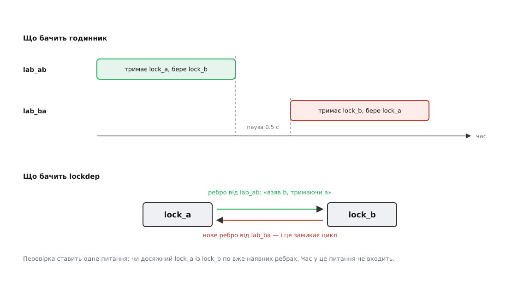
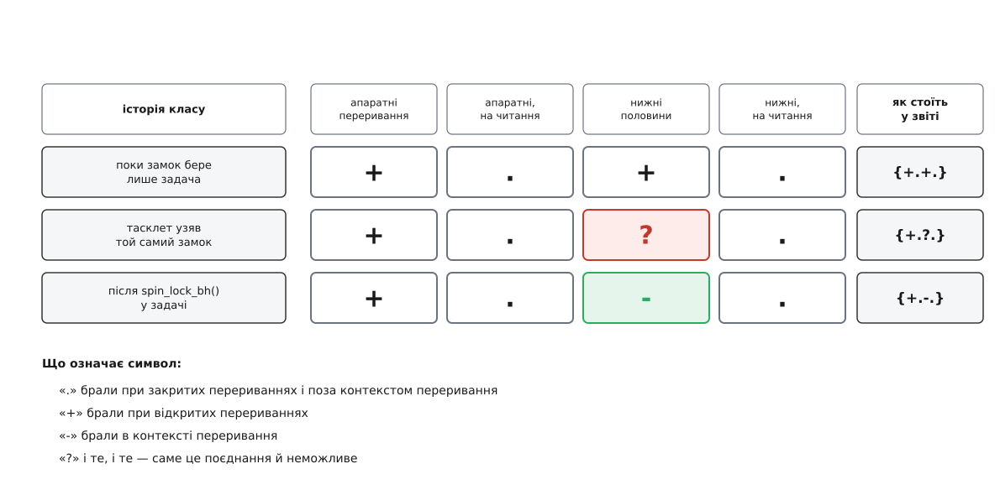

# ⚙️ Зробити дедлок навмисне: модуль ядра і повний розбір звіту lockdep

Це лабораторна робота: невеликий модуль ядра, який свідомо бере два спін-замки у зворотному порядку, і рядок за рядком розібраний звіт, що на цьому вилітає в журнал. Сенс вправи не в тому, щоб подивитися на страшне, а в тому, щоб один раз прочитати звіт `lockdep` цілком — маючи відповідь у руках. Наступного разу такий самий звіт прийде з чужої підсистеми й без підказок, і єдине, що вас урятує, — знання, у які саме три рядки дивитися.

Вправ буде дві. Перша — зворотний порядок двох замків. Друга — асиметрія за контекстом: той самий замок беруть із задачі й із тасклета, і механізм повідомляє про це зовсім іншим звітом, який читається за іншою схемою.

## Стенд і одна умова, яку легко проґавити

Потрібне ядро, зібране з `CONFIG_PROVE_LOCKING`. Дистрибутивні ядра його майже ніколи не мають — ціна завелика для машини, що працює, — тож або окремий налагоджувальний варіант ядра, якщо ваш дистрибутив такий постачає, або власне складання. Перевіряється одним рядком:

```sh
$ zgrep -E 'CONFIG_(PROVE_LOCKING|LOCKDEP|DEBUG_LOCK_ALLOC)=' /proc/config.gz
CONFIG_PROVE_LOCKING=y
CONFIG_LOCKDEP=y
CONFIG_DEBUG_LOCK_ALLOC=y
```

(на дистрибутивах без `/proc/config.gz` те саме шукають у `/boot/config-$(uname -r)`).

Другий, надійніший доказ — сама наявність файлів у `/proc`, які створює лише вбудований механізм ([псевдофайлові системи: /proc як інтерфейс до ядра](topic:sys-unix/proc-reading-process-and-kernel-state) — це не файли на диску, а живі значення, які ядро малює на кожне читання):

```sh
$ grep -E 'lock-classes|dependencies|dependency chains' /proc/lockdep_stats
 lock-classes:                        1487 [max: 8192]
 direct dependencies:                 9032 [max: 32768]
 indirect dependencies:              43127
 all direct dependencies:           218904
 dependency chains:                  12760 [max: 65536]
```

Вправу робимо у віртуальній машині, і не лише через страх зламати робочу систему. Причина глибша, і вона визначає весь спосіб роботи з `lockdep`: **після першого ж звіту механізм вимикається до перезавантаження**. Виявивши суперечність, він скидає внутрішній прапорець `debug_locks`, і всі наступні перевірки замків просто перестають виконуватися. Логіка тут своя: граф уже суперечливий, довіряти подальшим висновкам не можна, а сипати каскадом похідних звітів — тільки заважати. Перевіряється це тим самим файлом:

```sh
$ grep debug_locks /proc/lockdep_stats
 debug_locks:                            0
```

Нуль означає, що механізм мовчить не тому, що все гаразд, а тому, що вже здався. Звідси робочий цикл усієї лабораторної: **один звіт — одне перезавантаження**. Дві наші вправи неможливо провести за одне завантаження машини, і саме тому модуль отримає параметр вибору режиму.

## Чому механізм спрацює, хоча потоки не перетнуться в часі

Перш ніж писати код, варто зрозуміти, чого саме ми домагаємося, — інакше вправа зведеться до «запустив, побачив, злякався».

Дедлок як подія — це збіг у часі: двоє тримають по замку й чекають одне на одного ([дедлок: коло очікування, що не розривається саме](topic:sf-tasks/deadlock)). Спіймати такий збіг тестуванням майже неможливо: вікно — десятки наносекунд, і на іншій машині, з іншим числом ядер, воно може не відкритися ніколи. Тому `lockdep` полює не на подію, а на її передумову.

Ключів до механізму три.

**Клас, а не примірник.** Механізм веде облік не окремих замків, а їхніх *класів*. Клас народжується там, де замок оголошено або ініціалізовано: і `DEFINE_SPINLOCK(foo)`, і `spin_lock_init(&x->lock)` створюють у цьому місці власний статичний ключ, а отже, всі замки, ініціалізовані **тим самим рядком коду**, потрапляють в один клас. Тисяча структур драйвера з полем `lock` дадуть тисячу замків і рівно один клас. Ім'я класу теж береться звідти — це буквально текст аргументу макроса. Саме тому в справжніх звітах трапляються імена на кшталт `&sb->s_type->i_mutex_key`: ніхто їх не вигадував, це вихідний текст, збережений препроцесором.

**Ребро, а не збіг.** Щоразу, коли ядро бере замок класу Y, уже тримаючи замок класу X, у граф лягає ребро X → Y — і лежить там до перезавантаження. До ребра прикріплюється знімок стека виклику: де саме це сталося.

**Питання досяжності.** Перед тим як додати ребро X → Y, механізм ставить одне питання: чи досяжний X із Y по вже наявних ребрах? Це звичайний пошук у ширину орієнтованим графом ([пошук у ширину](topic:sf-algorithms/breadth-first-search) — обхід по рівнях від початкової вершини, який знаходить найкоротший шлях за кількістю ребер, і саме тому знайдений ланцюжок у звіті буде найкоротшим із можливих). Якщо відповідь «так», нове ребро замкне цикл — і механізм видає звіт замість того, щоб ребро додати.

З третього пункту й випливає головне: **час не бере участі в перевірці взагалі**. Достатньо, щоб обидві послідовності колись виконалися — хоч із інтервалом у хвилину, хоч на різних ядрах процесора, хоч у різні епохи життя машини. Наша вправа саме на цьому й побудована: два потоки навмисно рознесені в часі так, що перетнутися не можуть фізично, і звіт однаково буде.



*Угорі — вісь часу: другий потік стартує аж тоді, коли перший уже все відпустив, тож жодного збігу немає. Унизу — граф класів: перший потік залишив по собі ребро, і друге ребро його замикає. Перевірка дивиться тільки в нижню половину малюнка.*

Тут-таки видно й межу методу, про яку варто пам'ятати з першого дня: механізм знає лише про ті шляхи, які справді пробігли. Не викликали функцію — ребра немає, і мовчання нічого не доводить. Тому `lockdep` не заміняє тестів, а множить їхню цінність: тест, який просто пройшов, під таким ядром додатково засвідчує, що всі порядки замків на пройдених шляхах узгоджені між собою й з усім рештою ядра.

## Модуль

Код нижче — повний і робочий. Мова тут не обирається: це код ядра, який працює з примітивами ядра, отже — C.

```c
// SPDX-License-Identifier: GPL-2.0
#define pr_fmt(fmt) KBUILD_MODNAME ": " fmt

#include <linux/module.h>
#include <linux/kernel.h>
#include <linux/kthread.h>
#include <linux/sched.h>
#include <linux/spinlock.h>
#include <linux/completion.h>
#include <linux/interrupt.h>
#include <linux/delay.h>

static int mode = 1;
module_param(mode, int, 0444);
MODULE_PARM_DESC(mode, "1 — зворотний порядок замків, 2 — асиметрія за softirq");

static unsigned long work_done;      /* аби критична ділянка не була порожньою */

/* ── вправа 1: два замки у зворотному порядку ──────────────────────────── */

static DEFINE_SPINLOCK(lock_a);
static DEFINE_SPINLOCK(lock_b);
static DECLARE_COMPLETION(ab_done);

/* Потік, який відпрацював, не має права просто вийти: модуль можуть
   вивантажити, доки він ще всередині своєї функції. Тому чекаємо на
   kthread_stop() у ледачому сні, який нічого не коштує. */
static void park_until_stop(void)
{
    while (!kthread_should_stop())
        schedule_timeout_idle(HZ);
}

static int worker_ab(void *unused)
{
    spin_lock(&lock_a);
    spin_lock(&lock_b);          /* ребро lock_a → lock_b лягає в граф */
    work_done++;
    spin_unlock(&lock_b);
    spin_unlock(&lock_a);

    pr_info("ab: a→b пройшло тихо\n");
    complete(&ab_done);

    park_until_stop();
    return 0;
}

static int worker_ba(void *unused)
{
    wait_for_completion(&ab_done);   /* перший уже все відпустив */
    msleep(500);                     /* і ще пауза: перекриття неможливе */

    spin_lock(&lock_b);
    spin_lock(&lock_a);              /* ось на цьому рядку механізм і кричить */
    work_done++;
    spin_unlock(&lock_a);
    spin_unlock(&lock_b);

    pr_info("ba: b→a пройшло — і машина жива\n");

    park_until_stop();
    return 0;
}

/* ── вправа 2: той самий замок у задачі й у тасклеті ───────────────────── */

static DEFINE_SPINLOCK(shared_lock);

static void lab_tasklet_fn(struct tasklet_struct *t)
{
    spin_lock(&shared_lock);         /* контекст softirq */
    work_done++;
    spin_unlock(&shared_lock);
}
static DECLARE_TASKLET(lab_tasklet, lab_tasklet_fn);

static int worker_soft(void *unused)
{
    /* спершу — з контексту задачі, без жодної заборони нижніх половин */
    spin_lock(&shared_lock);
    work_done++;
    spin_unlock(&shared_lock);
    pr_info("soft: задача взяла замок звичайним spin_lock()\n");

    msleep(500);
    tasklet_schedule(&lab_tasklet);  /* тепер той самий замок — із softirq */

    park_until_stop();
    return 0;
}

/* ── збирання докупи ───────────────────────────────────────────────────── */

static struct task_struct *th1, *th2;

static int __init lab_init(void)
{
    if (mode == 1) {
        th1 = kthread_run(worker_ab, NULL, "lab_ab");
        if (IS_ERR(th1))
            return PTR_ERR(th1);

        th2 = kthread_run(worker_ba, NULL, "lab_ba");
        if (IS_ERR(th2)) {
            kthread_stop(th1);
            return PTR_ERR(th2);
        }
        return 0;
    }

    th1 = kthread_run(worker_soft, NULL, "lab_soft");
    return IS_ERR(th1) ? PTR_ERR(th1) : 0;
}

static void __exit lab_exit(void)
{
    if (th2)
        kthread_stop(th2);
    if (th1)
        kthread_stop(th1);
    tasklet_kill(&lab_tasklet);
    pr_info("вивантажуюсь, ділянок пройдено: %lu\n", work_done);
}

module_init(lab_init);
module_exit(lab_exit);
MODULE_LICENSE("GPL");
MODULE_DESCRIPTION("Навмисні порушення порядку замків для перевірки lockdep");
```

Кілька рішень у цьому коді варті пояснення, бо вони не косметичні.

**Чому два потоки ядра, а не дві звичайні функції.** Потік ядра (`kthread`) — це повноцінна задача з власним стеком і рядком у планувальнику, яку видно в `ps` за іменем ([потоки ядра: задачі без простору користувача](topic:sys-unix/kernel-threads)). Нам це потрібно з двох причин: щоб у звіті стояло впізнаване ім'я замість `modprobe`, і щоб дві послідовності справді належали різним задачам — інакше можна було б запідозрити, що механізм просто побачив вкладення в межах одного виклику.

**Чому `wait_for_completion()` і ще півсекунди зверху.** Це — суть демонстрації. Другий потік не почне свою частину, доки перший не звільнив обидва замки й не сповістив про це; пауза додана вже понад необхідне. Якщо після цього звіт усе одно приходить — жодне пояснення через «випадковий збіг» уже не проходить.

**Чому `park_until_stop()`.** Функція потоку живе в тексті модуля, а вивантаження цей текст звільняє. Якщо потік виходить сам собою, ніхто не засвідчує ядру, що він уже точно не всередині, — і `rmmod` цілком може висмикнути пам'ять з-під його останніх інструкцій. Тому потік не виходить, а паркується й чекає на `kthread_stop()`; цей виклик робить шлях вивантаження, і повертається він лише тоді, коли потік справді завершився. Дисципліна стандартна для будь-якого модуля з потоками, і порушують її навіть частіше, ніж порядок замків.

Складання й запуск — звичайні для позадеревного модуля ([модулі ядра: складання, завантаження, залежності](topic:sys-unix/kernel-modules)):

```make
obj-m += lockdep_lab.o
KDIR ?= /lib/modules/$(shell uname -r)/build

all:
	$(MAKE) -C $(KDIR) M=$(PWD) modules
clean:
	$(MAKE) -C $(KDIR) M=$(PWD) clean
```

```sh
$ make
$ grep 'direct dependencies' /proc/lockdep_stats   # запам'ятати число
 direct dependencies:                 9032 [max: 32768]
$ sudo insmod lockdep_lab.ko mode=1
$ dmesg | tail -60
```

Перше корисне спостереження безкоштовне: між `insmod` і звітом число прямих залежностей у `/proc/lockdep_stats` виросте — це і є те саме ребро `lock_a → lock_b`, покладене першим потоком.

## Звіт, рядок за рядком

Ось що з'явиться в журналі приблизно через півсекунди після завантаження. Адреси, зсуви й номери процесів у вас будуть інші, структура — та сама.

```
======================================================
WARNING: possible circular locking dependency detected
6.6.0-lockdep #1 Tainted: G           O
------------------------------------------------------
lab_ba/1487 is trying to acquire lock:
ffffffffc0a3d060 (lock_a){+.+.}-{2:2}, at: worker_ba+0x51/0xd0 [lockdep_lab]

but task is already holding lock:
ffffffffc0a3d020 (lock_b){+.+.}-{2:2}, at: worker_ba+0x3a/0xd0 [lockdep_lab]

which lock already depends on the new lock.


the existing dependency chain (in reverse order) is:

-> #1 (lock_b){+.+.}-{2:2}:
       lock_acquire+0xc7/0x2e0
       _raw_spin_lock+0x33/0x50
       worker_ab+0x35/0xd0 [lockdep_lab]
       kthread+0xe8/0x120
       ret_from_fork+0x2c/0x50
       ret_from_fork_asm+0x1a/0x30

-> #0 (lock_a){+.+.}-{2:2}:
       check_prev_add+0xeb/0xc50
       validate_chain+0x5cb/0x800
       __lock_acquire+0x84f/0x1150
       lock_acquire+0xc7/0x2e0
       _raw_spin_lock+0x33/0x50
       worker_ba+0x51/0xd0 [lockdep_lab]
       kthread+0xe8/0x120
       ret_from_fork+0x2c/0x50
       ret_from_fork_asm+0x1a/0x30

other info that might help us debug this:

 Possible unsafe locking scenario:

       CPU0                    CPU1
       ----                    ----
  lock(lock_b);
                               lock(lock_a);
                               lock(lock_b);
  lock(lock_a);

 *** DEADLOCK ***

1 lock held by lab_ba/1487:
 #0: ffffffffc0a3d020 (lock_b){+.+.}-{2:2}, at: worker_ba+0x3a/0xd0 [lockdep_lab]

stack backtrace:
CPU: 1 PID: 1487 Comm: lab_ba Tainted: G           O       6.6.0-lockdep #1
Hardware name: QEMU Standard PC (i440FX + PIIX, 1996), BIOS 1.16.3-2 04/01/2014
Call Trace:
 <TASK>
 dump_stack_lvl+0x5b/0x80
 check_noncircular+0x134/0x150
 __lock_acquire+0x84f/0x1150
 lock_acquire+0xc7/0x2e0
 _raw_spin_lock+0x33/0x50
 worker_ba+0x51/0xd0 [lockdep_lab]
 kthread+0xe8/0x120
 ret_from_fork+0x2c/0x50
 ret_from_fork_asm+0x1a/0x30
 </TASK>
```

Тепер по частинах.

**Заголовок.** `possible circular locking dependency` — слово `possible` тут не ввічливість і не невпевненість. Дедлока справді не сталося: обидва потоки добігли до кінця, машина жива, і `pr_info` з обох функцій ви побачите в журналі поруч зі звітом. Виявлено *можливість* — цикл у графі. Рядок нижче — версія ядра й прапорець забруднення. Він не порожній, і це нормально: літеру `O` ставить сам факт, що завантажено модуль, зібраний **поза деревом ядра**, — а наш саме такий, хоч би яку ліцензію він оголосив. `G` на першій позиції означає протилежне тому, чого лякаються: жодного пропрієтарного модуля немає, і цю літеру дає наш `MODULE_LICENSE("GPL")`. На роботу перевірки забруднення не впливає взагалі; воно лише попереджає того, хто читатиме звіт, що в ядрі є код не з дерева.

**Дві половини обвинувачення.** `is trying to acquire lock:` — те, що беруть зараз; `but task is already holding lock:` — те, що вже тримають. Обидва рядки побудовані однаково, і в них п'ять полів.

- `ffffffffc0a3d060` — адреса самого примірника замка. Стає в пригоді тоді, коли клас один, а примірників тисяча й треба зрозуміти, який саме об'єкт.
- `(lock_a)` — ім'я класу. Ось де окупається знання, звідки воно береться: це текст із `DEFINE_SPINLOCK(lock_a)`. Якби замок жив у структурі й ініціювався через `spin_lock_init(&d->lock)`, у дужках стояло б саме `&d->lock` — разом з амперсандом, точнісінько як у вихідному тексті.
- `{+.+.}` — історія вживання класу, чотири символи, до яких ми повернемося в другій вправі. Для звичайного замка, який беруть тільки з контексту задачі, це майже завжди `{+.+.}`.
- `-{2:2}` — рівень очікування: до якого ярусу примітивів належить замок. Ярусів кілька, і головні три — «сирий» спін-замок, звичайний спін-замок і сплячий замок; механізм окремо стежить, щоб під замком нижчого ярусу не брали замок вищого. Конкретні числа зсуваються залежно від `CONFIG_PROVE_RAW_LOCK_NESTING`, тож читати їх варто як ярус, а не як абсолютне значення: важливо, що обидва наші замки на одному ярусі.
- `at: worker_ba+0x51/0xd0 [lockdep_lab]` — функція, зсув у ній, розмір функції й модуль. Це вже готова адреса для `faddr2line`.

**Ключове речення.** `which lock already depends on the new lock.` — ось тут сказано все. Не «ви щойно зациклилися», а «замок, який ви тримаєте, *уже* залежить від того, який ви берете». Залежність існувала до вашої появи; ви лише спробували замкнути коло.

**Ланцюжок — найцінніша частина.** `the existing dependency chain (in reverse order) is:` і два записи, `-> #1` та `-> #0`. Це не одна історія, а дві різні, і плутати їх — головна помилка новачка.

Запис `-> #0` — це поточний стек: `worker_ba` бере `lock_a`. Угорі видно нутрощі механізму (`check_prev_add`, `validate_chain`) — той самий пошук у ширину, який щойно знайшов цикл.

Запис `-> #1` — стек **іншої сторони**, збережений раніше, коли ребро `lock_a → lock_b` тільки клали в граф. Тут стоїть `worker_ab`, потік, який давно все відпустив і мирно спить. І ось це — те, заради чого весь механізм існує. Зависла машина не сказала б вам про другого учасника нічого: ви мали б стек одного потоку й тишу. Механізм видає обидві сторони одразу, причому друга сторона могла виконатися хвилину тому, у зовсім іншій підсистемі, написаній іншими людьми.

**«Інша інформація».** Блок `Possible unsafe locking scenario:` — це **реконструкція**, а не запис подій. Ніхто цього не виконував; механізм намалював, як виглядав би збіг, якби він стався. Читається так: `CPU0` — це ви, той, хто звітує (взяли `lock_b`, хочете `lock_a`); `CPU1` — інша сторона з ребра (взяла `lock_a`, хоче `lock_b`). Рядки йдуть у хронологічному порядку зверху вниз, тож перехрестя видно оком. Напис `*** DEADLOCK ***` великими літерами стосується саме цієї вигаданої сцени, а не того, що сталося з машиною.

**Що тримають і звідки прийшли.** `1 lock held by lab_ba/1487:` — повний перелік замків, які задача тримає просто зараз. У нашому випадку один, у реальному коді їх буває чотири-п'ять, і тоді цей список важить не менше за все попереднє: він показує весь стос, у який ви вклали новий замок. Далі `stack backtrace:` — звичайний стек ядра ([як читати аварійні повідомлення ядра](topic:sys-unix/kernel-oops-panic)); у ньому важливий рядок `check_noncircular`, бо він і є доказом, що звіт народився з перевірки графа, а не з реальної аварії.

**Куди дивитися насамперед.** Три адреси, і цього достатньо в дев'яти випадках із десяти: `at:` у першому рядку, `at:` у другому й той кадр у записі `-> #1`, що належить вашому коду. Три рядки вихідного коду:

```sh
$ ./scripts/faddr2line /path/to/lockdep_lab.ko worker_ba+0x51/0xd0
worker_ba+0x51/0xd0:
worker_ba at lockdep_lab.c:55
```

Далі — рішення, яке механізм за вас не ухвалить: або обрати єдиний законний порядок і привести до нього обидві сторони, або пояснити механізмові, що ці замки насправді різні (про це в пастках нижче).

## Друга вправа: замок, узятий і в задачі, і в тасклеті

Перезавантажуємо машину — інакше `debug_locks` дорівнює нулю й нічого не станеться, — і вантажимо модуль з іншим режимом:

```sh
$ sudo insmod lockdep_lab.ko mode=2
```

Тепер порушення інше. Замок один, порядку немає взагалі, циклу теж. Проблема в тому, **звідки** його беруть. Задача бере `shared_lock` звичайним `spin_lock()`, не забороняючи нижніх половин. Тасклет бере той самий замок із контексту softirq. Якщо нижня половина запуститься на тому самому ядрі процесора саме тоді, коли задача тримає замок, вона почне крутитися й не зрушить ніколи: щоб замок звільнився, має добігти задача, а задача не побіжить, доки не добіжить softirq ([переривання, нижні половини й робочі черги](topic:sys-unix/interrupts-bottom-halves) — softirq не є задачею, планувальник не може його зняти).

Тут теж не потрібен збіг у часі. Механізм веде для кожного класу маску вживань і перевіряє її на суперечність.



*Чотири символи в дужках — це стисла історія класу: перша пара про апаратні переривання, друга про нижні половини; у кожній парі спершу звичайне взяття, потім взяття на читання. Три рядки — три моменти життя нашого замка: поки його бере лише задача, після взяття в тасклеті й після виправлення. «+» означає «брали, коли цей різновид переривань був увімкнений», «-» — «брали всередині такого переривання», а їхнє поєднання дає «?» — рівно ту асиметрію, з якої виростає глухий кут.*

Тасклет тут узятий тому, що це найкоротший шлях отримати справжній контекст softirq у навчальному модулі. У новому коді його вживати не варто — механізм тасклетів вважають застарілим; той самий контекст дає й звичайний таймер ядра, чий зворотний виклик теж виконується в softirq.

## Звіт про несумісний стан

```
================================
WARNING: inconsistent lock state
6.6.0-lockdep #1 Tainted: G           O
--------------------------------
inconsistent {SOFTIRQ-ON-W} -> {IN-SOFTIRQ-W} usage.
ksoftirqd/2/24 [HC0[0]:SC1[1]:HE1:SE0] takes:
ffffffffc0a3d0a0 (shared_lock){+.?.}-{2:2}, at: lab_tasklet_fn+0x1e/0x50 [lockdep_lab]
{SOFTIRQ-ON-W} state was registered at:
  lock_acquire+0xc7/0x2e0
  _raw_spin_lock+0x33/0x50
  worker_soft+0x2e/0xc0 [lockdep_lab]
  kthread+0xe8/0x120
  ret_from_fork+0x2c/0x50
  ret_from_fork_asm+0x1a/0x30
irq event stamp: 42117
hardirqs last  enabled at (42117): [<ffffffff81f2a1b3>] _raw_spin_unlock_irq+0x23/0x50
hardirqs last disabled at (42115): [<ffffffff81f1c8e2>] __schedule+0x9f2/0x1b40
softirqs last  enabled at (42096): [<ffffffff8113a6d1>] __local_bh_enable_ip+0x101/0x180
softirqs last disabled at (42109): [<ffffffff81f2f0a5>] run_ksoftirqd+0x25/0x50

other info that might help us debug this:
 Possible unsafe locking scenario:

       CPU0
       ----
  lock(shared_lock);
  <Interrupt>
    lock(shared_lock);

 *** DEADLOCK ***

no locks held by ksoftirqd/2/24.

stack backtrace:
CPU: 2 PID: 24 Comm: ksoftirqd/2 Tainted: G           O       6.6.0-lockdep #1
Hardware name: QEMU Standard PC (i440FX + PIIX, 1996), BIOS 1.16.3-2 04/01/2014
Call Trace:
 <TASK>
 dump_stack_lvl+0x5b/0x80
 mark_lock+0x6a3/0xd80
 __lock_acquire+0x726/0x1150
 lock_acquire+0xc7/0x2e0
 _raw_spin_lock+0x33/0x50
 lab_tasklet_fn+0x1e/0x50 [lockdep_lab]
 tasklet_action_common+0x14b/0x230
 __do_softirq+0x1a4/0x580
 run_ksoftirqd+0x25/0x50
 smpboot_thread_fn+0x2c1/0x430
 kthread+0xe8/0x120
 ret_from_fork+0x2c/0x50
 ret_from_fork_asm+0x1a/0x30
 </TASK>
```

Схема тут інша, і читається вона швидше.

**Діагноз стоїть одразу після заголовка.** `inconsistent {SOFTIRQ-ON-W} -> {IN-SOFTIRQ-W} usage.` Ліворуч — стан, зареєстрований раніше: «брали на запис, коли нижні половини були **ввімкнені**». Праворуч — те, що робиться зараз: «беруть на запис **усередині** нижньої половини». Кожен зі станів окремо цілком нормальний; неможливе саме їхнє поєднання, і механізм назвав обидва прямо.

**Хто звітує і в якому він стані.** `ksoftirqd/2/24` — потік ядра, який виконує відкладені нижні половини на другому ядрі процесора. Ім'я тут не гарантоване: тасклет міг запуститися й на виході з переривання, у контексті будь-якої задачі, якій не пощастило бігти на цьому ядрі, — і тоді в звіті стоятиме її ім'я. Далі — щільно спакований стан контексту, і його варто вміти читати:

```
[HC0[0]:SC1[1]:HE1:SE0]

HC0   Hardirq Context — ми всередині апаратного обробника? ні
[0]   глибина вкладення апаратних переривань: нуль
SC1   Softirq Context — ми всередині нижньої половини? так
[1]   глибина вкладення нижніх половин: одна
HE1   Hardirqs Enabled — апаратні переривання відкриті? так
SE0   Softirqs Enabled — нижні половини відкриті? ні
```

Тобто: ми не в апаратному обробнику, апаратні переривання відкриті, ми всередині нижньої половини, і нижні половини на цьому ядрі процесора закриті. Рівно те, чого й чекають від тасклета.

**Символ «?» — це діагноз, стиснутий до одного знаку.** У рядку `takes:` клас показано як `(shared_lock){+.?.}`. Третя позиція — це нижні половини, і в ній стоїть `?` замість звичного `+`. Значення символів у цих чотирьох позиціях офіційно таке: `.` — брали при закритих перериваннях і поза контекстом переривання; `+` — брали при відкритих перериваннях; `-` — брали в контексті переривання; `?` — брали в контексті переривання **і** брали при відкритих перериваннях. Тобто `?` в жодному разі не «невідомо» — це вже поставлений діагноз, який просто не має власного слова. Побачивши `?` у звіті, далі можна майже не читати: помилка саме ця.

**Стек іншої сторони.** `{SOFTIRQ-ON-W} state was registered at:` — знову подарунок від механізму: збережений стек того місця, де замок брали з увімкненими нижніми половинами. Це `worker_soft`, тобто наш винний рядок у контексті задачі.

**Позначки подій переривань.** Чотири рядки `irq event stamp` часто гортають, а вони корисні. Число в дужках — наскрізний лічильник подій увімкнення й вимкнення переривань, тож за ним видно **порядок**: `softirqs last disabled at (42109)` більше за `softirqs last enabled at (42096)`, отже нижні половини справді закриті зараз, і закрив їх `run_ksoftirqd`. Коли звіт незрозумілий, ці чотири рядки відповідають на питання «хто останній чіпав прапорці й де».

**Сценарій на одному ядрі процесора.** Тут `CPU0` без пари, а посеред нього — `<Interrupt>`. Механізм каже прямо: другий процесор не потрібен, вистачить одного, якщо переривання прийде посеред критичної ділянки. Це та сама асиметрія, тільки намальована.

**Виправлення й перевірка.** Суперник тут — нижня половина, не апаратний обробник, тож найдешевша достатня відповідь — `spin_lock_bh()` у шляху задачі:

```c
    spin_lock_bh(&shared_lock);      /* замість spin_lock() */
    work_done++;
    spin_unlock_bh(&shared_lock);
```

У тасклеті міняти нічого не треба: там нижні половини вже закриті самим фактом виконання. `spin_lock_irqsave()` теж прибрав би звіт, але закривав би ще й апаратні переривання — сильніше, ніж потрібно, і гірше для затримки всієї машини.

Після перезбирання й перезавантаження звіту не буде, а `debug_locks` у `/proc/lockdep_stats` лишиться одиницею. Той самий рядок і є вашим доказом: механізм не мовчить від безсилля, він працює й претензій не має.

## Що саме вмикати, скільки це коштує і чому таке ядро тримають на стенді

Для цієї роботи потрібен рівно один параметр складання:

```
CONFIG_DEBUG_KERNEL=y
CONFIG_PROVE_LOCKING=y
```

`CONFIG_PROVE_LOCKING` сам витягує за собою все інше: `LOCKDEP` (а з ним `STACKTRACE` і повну таблицю символів `KALLSYMS_ALL`), `DEBUG_LOCK_ALLOC`, `DEBUG_SPINLOCK`, `DEBUG_MUTEXES`, `PREEMPT_COUNT` і `TRACE_IRQFLAGS`. З цього списку й складається справжня ціна, і вона більша, ніж «трохи повільніші замки»:

- **Кожне взяття замка** стає викликом `lock_acquire()` з пошуком класу в хеш-таблиці, оновленням графа й перевіркою досяжності для кожного нового ребра.
- **Кожне нове ребро** зберігає знімок стека — саме тому потрібен `STACKTRACE`, і саме тому у звіті є стек іншої сторони.
- **Самі примітиви підмінені** налагоджувальними версіями: `DEBUG_SPINLOCK` і `DEBUG_MUTEXES` додають власні перевірки поверх усього названого.
- **Кожне вмикання й вимикання переривань** проходить через `TRACE_IRQFLAGS` — звідси й беруться ті чотири рядки `irq event stamp`.
- **Пам'ять** резервується статично, наперед, під стелі числа класів, ребер, ланцюжків і кадрів стека; поточні числа й стелі видно в `/proc/lockdep_stats`, а самі стелі задає `CONFIG_LOCKDEP_BITS`.

А от `CONFIG_DEBUG_LOCKDEP` — поширене непорозуміння. Його часто вмикають «щоб краще ловило», хоча в довідці написано просто: з ним «механізм залежностей робить додаткові перевірки під час роботи, **щоб налагоджувати сам себе**, ціною ще більших витрат». Він потрібен тому, хто підозрює помилку в самому `lockdep`, а не тому, хто шукає помилку у своєму драйвері. Для нашої роботи він зайвий. Так само окремим важелем стоїть `CONFIG_LOCK_STAT` — це вимірювання змагання за замки, тобто про швидкодію, а не про правильність.

Причин тримати таке ядро на стенді, а не в бою, три, і найочевидніша з них — найслабша.

Найочевидніша: воно повільне. Друга — те, з чого ми починали: **перший звіт вимикає перевірку до перезавантаження**. У бою це означає, що одне випадкове хибне спрацювання (а вони бувають — про це нижче) тихо знімає всю перевірку з машини на весь час її роботи, і ви про це не дізнаєтеся. Третя, найтонша: ядро з перевіркою — це *інше* ядро. Час проходження критичних ділянок помітно росте, вікна перегонів зміщуються, і частина справжніх часових помилок під ним просто перестає відтворюватися. Тому таке ядро — інструмент для правильності **порядку**, а не для полювання на перегони; для другого потрібні інші засоби.

> 🔧 **Навіщо це.** Найбільша практична вигода тут не в тому, щоб зловити свій дедлок. Вона в тому, що звіт приходить **без дедлока взагалі**. Отже, звичайні тести під таким ядром змінюють природу: пройдений тест перестає означати «цього разу не зламалося» й починає означати «на всіх шляхах, які пробігли, порядок замків узгоджений із рештою ядра». Тому найдешевше вкладення для будь-якої команди, що пише код ядра, — один вузол складання, який ганяє наявний набір тестів на ядрі з `CONFIG_PROVE_LOCKING`. Нових тестів писати не треба; треба лише інакше зібране ядро.

## Пастки, на які натрапляють одразу після першого успіху

**Один звіт на завантаження.** Виправили — перезавантажилися — перевірили. Спроба «полагодити все за один прогін» безглузда: після першого звіту решта просто не перевіряється.

**Хибне спрацювання через злиття класів.** Клас — це рядок ініціалізації, а не об'єкт. Два різні inode, дві різні структури драйвера, два вузли дерева належать одному класу, тож законне «взяти замок батька, потім замок дитини» механізм бачить як взяття класу під самим собою й видає `possible recursive locking detected`. Це не ваша помилка й не його — це межа обраного наближення. Відповідь — сказати вголос те, що ви й так знаєте: `spin_lock_nested()` або `mutex_lock_nested()` із номером підкласу, а коли об'єкти справді різні за роллю — `lockdep_set_class()`, який дає їм окремі класи. Правити треба саме анотацію, а не глушити перевірку: `lockdep_set_novalidate_class()` існує, але це відмова від перевірки цього замка назавжди.

**Не всі шляхи пробігли.** Тиша не є доказом. Ребро з'являється лише тоді, коли код виконався, тож рідкісні шляхи — обробка помилок, вивантаження модуля, відновлення після збою пристрою — під перевірку зазвичай не потрапляють. Це саме та частина коду, де порядок замків плутають найчастіше.

**Стелі можна вичерпати.** Повідомлення на кшталт `BUG: MAX_LOCKDEP_ENTRIES too low!` означає не помилку у вашому коді, а те, що граф не вліз у зарезервоване; лікується збільшенням `CONFIG_LOCKDEP_BITS`. Заразом варто знати, що вивантаження модуля «зчищає» його класи — лічильник `zapped classes:` у `/proc/lockdep_stats` після кожного `rmmod` росте.

**Названий клас може бути не вашим.** Механізм показує цикл, а не винного. Якщо хтось раніше поклав у граф ребро, що суперечить вашому, звіт покаже обидва, і рядок вашого коду цілком може виявитися бездоганним. Тому дивитися треба на обидві сторони — і на `-> #1` не менш уважно, ніж на `-> #0`.
