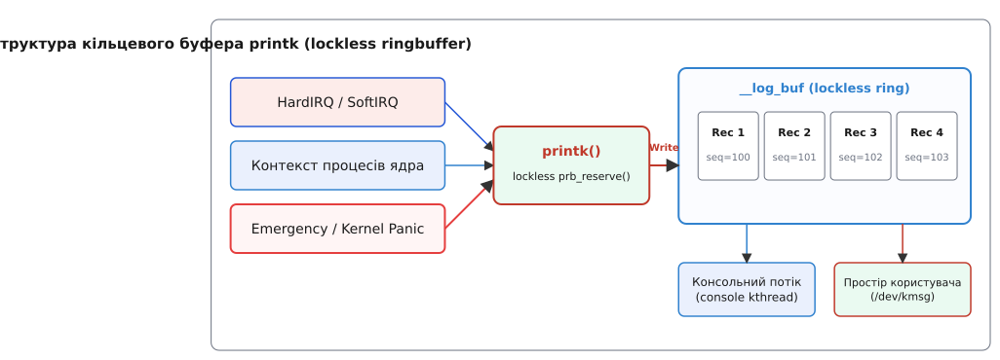
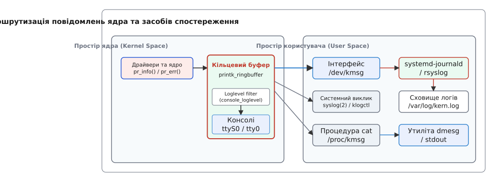

# Журнал ядра: printk, рівні важливості й dmesg

<details>
<summary>💡 Що варто знати наперед</summary>
<preknowlist>
- [Обробка переривань](topic:sys-unix/interrupts-bottom-halves) — асинхронні контексти виконання hardirq, у яких заборонено засинати та блокуватися.
- [Файлова система procfs](topic:sys-unix/proc-reading-process-and-kernel-state) — віртуальна файлова система для отримання стану ядра та налаштування sysctl.
- [Протокол Syslog](topic:sys-unix/syslog-protocol) — загальносистемний стандарт передачі та фільтрації повідомлень системних служб.
</preknowlist>
</details>

Коли звичайна програма у просторі користувача прагне вивести повідомлення про свій стан, вона кличе бібліотечну функцію `printf()`, яка під капотом звертається до системного виклику `write()` і передає байти у стандартний потік виводу (файловий дескриптор 1), прив'язаний до термінала. Проте коли сповістити про подію виникає потреба у **самого ядра Linux**, цей звичний механізм виявляється повністю непридатним. У ядра немає файлових дескрипторів (вони належать конкретним процесам), немає підключеної стандартної бібліотеки мови C (`libc`), а головне — ядро часто виконує код у жорстких контекстах переривань, де не існує поняття потоку, а будь-яка спроба заснути чи зачекати призводить до миттєвого падіння всієї системи.

Для розв'язання цієї проблеми ядро Linux володіє власною автономною підсистемою журналювання, центральним нервом якої є функція `printk()`. Вона забезпечує виконання двох протилежних завдань: миттєво й беззамокно зафіксувати повідомлення в пам'яті навіть із найглибшого апаратного переривання та безпечно передати це повідомлення на фізичні консолі й демонам простору користувача, не порушуючи детермінізму роботи процесорів.

Ця стаття розбирає повний шлях повідомлення ядра: від виклику `printk()` у коді драйвера до його збереження в кільцевому буфері, фільтрації за рівнями важливості, виводу на фізичні та мережеві консолі, аналізу через sysfs/procfs, трасування за допомогою ftrace та зчитування утилітою `dmesg` й демоном `systemd-journald`.

---

## 1. Чому ядру потрібен власний механізм друку

Уявімо випадок, коли драйвер мережевої карти отримує апаратне переривання від контролера (HardIRQ), оскільки фізичний кабель Ethernet було від'єднано. Драйвер виконує свій обробник переривання і мусить зафіксувати у системному лозі рядок `eth0: link down`.

Якби ядро намагалося вивести цей рядок на екран або записати у файл на диску за допомогою стандартних файлових викликів, виникло б кілька нездоланних архітектурних перешкод:

1. **Заборона блокування та сну (Non-blocking constraint):** Запис на диск або вивід у складний графічний фреймбуфер вимагає роботи файлової системи, блокового блоку I/O та планувальника процесів. Ця операція може тривати мілісекунди й вимагає переходу потоку у стан сплячки (sleep). У контексті апаратного переривання (hardirq) або в атомній секції під спінлоком планувальник вимкнено. Спроба заснути в цьому стані викликає фатальну помилку `scheduling while atomic` і призводить до Kernel Panic.
2. **Ризик взаємоблокувань (Deadlock hazards):** Якщо вивід повідомлення спрямовується на послідовний порт (serial console `ttyS0`), а замок цього порту в цей момент утримується іншим процесором (який якраз було перервано), спроба захопити цей замок спричиняє тупикове взаємоблокування: процесор назавжди зависає у чеканні самого себе.
3. **Робота під час критичних збоїв (Kernel Panic):** Якщо у ядрі трапилася критична помилка пам'яті (Kernel Oops) або спрацював таймер аварійної зупинки, більшість підсистем ядра вже нефункціональні. Механізм логування мусить залишатися працездатним навіть тоді, коли файлова система, мережевий стек і планувальник повністю мертві.

Через це підсистему `printk()` побудовано за фундаментальним принципом **розділення генерації та споживання лоגים (deferred output)**. 

Коли код ядра кличе `printk()`, функція не намагається негайно малювати пікселі на моніторі чи відправляти пакети по мережі. Вона виконує мінімальну атомарну роботу: бере рядок, додає до нього точну мітку часу та рівень важливості, кладе його у спеціальний буфер у оперативній пам'яті й негайно повертає керування процесору, витративши частки мікросекунди. А вже згодом окремі консольні драйвери та демони простору користувача у безпечному контексті зчитують цей буфер і відображають байти на пристроях.

---

## 2. Анатомія кільцевого буфера: `__log_buf` та структура lockless ringbuffer

Серцем підсистеми `printk` є глобальний кільцевий буфер пам'яті. Він виділяється під час завантаження ядра як суцільний масив у оперативній пам'яті.

### Пам'ять та семантика кільцевого переповнення
Розмір буфера визначається параметром конфігурації ядра `CONFIG_LOG_BUF_SHIFT`. Наприклад, значення `18` означає $2^{18}$ байтів, тобто 256 Кілобайтів. У сучасних дистрибутивах Linux це значення зазвичай дорівнює `19` або `20` (512 КБ або 1 МБ), а також може бути перевизначене під час завантаження параметром командного рядка `log_buf_len=4M`.

Кільцевий буфер володіє жорсткою семантикою перезапису: якщо обсяг згенерованих повідомлень перевищує розмір виділеної пам'яті, нові повідомлення починають перезаписувати найстаріші записи. Це свідомий архітектурний компроміс: ядро жертвує давньою історією завантаження задля того, щоб у пам'яті завжди зберігалися найновіші діагностичні події, які передували можливій аварії системи.

### Структура запису та метадані
Кожен запис у буфері — це не просто сирий рядок тексту. Підсистема `printk` загортає кожне повідомлення у структурований запис, що містить двійкові метадані:
- **`timestamp` (Мітка часу):** точний монотонний час ядра від моменту старту системи (число наносекунд `CLOCK_MONOTONIC`), зафіксований у момент виклику `printk()`.
- **`facility` (Категорія джерела):** кодує підсистему ядра, яка згенерувала повідомлення (за замовчуванням `0` для ядра).
- **`loglevel` (Рівень важливості):** ціле число від 0 до 7, яке позначає критичність події.
- **`seq` (Послідовний номер):** унікальний 64-бітний лічильник записів. Дозволяє процесам у просторі користувача виявляти пропуски логів при переповненні буфера.
- **`caller_id` (Контекст виклику):** ідентифікатор процесорного ядра або потоку (`task_struct`), який згенерував запис (наприклад, `T123` для PID 123 або `C0` для CPU #0).

Саме завдяки цим метаданим утиліта `dmesg` виводить час перед кожним рядком: `[ 123.456789] eth0: link down`. Цей час не вписує драйвер мережевої карти, його автоматично підставляє `printk` при формуванні запису в буфері.


*Рис. 1. Архітектура кільцевого буфера printk: простір ядра виконує беззамокний запис у буфер, після чого консольний потік та простір користувача паралельно зчитують повідомлення.*

### Еволюція синхронізації: від спінлока до lockless ringbuffer
Протягом десятиліть підсистема `printk` використовувала єдиний глобальний спінлок `logbuf_lock` для захисту буфера від одночасного запису з кількох ядер процесора. Проте зі зростанням кількості процесорних ядер це викликало важкі затримки та тупикові взаємоблокування (deadlocks) у системах реального часу.

Починаючи з ядра Linux 5.10, підсистему було повністю переписано на **беззамокний кільцевий буфер (lockless `printk_ringbuffer`)**, розроблений Джоном Огнессом. Нова структура розділена на два кільця: буфер дескрипторів фіксованого розміру та буфер даних. Всі операції виділення пам'яті та публікації записів виконуються за допомогою атомарних інструкцій процесора (`atomic_cmpxchg`) без використання будь-яких замків. Докладніше про передумови цієї революції та її вплив на ядра реального часу можна прочитати у вставці [історію еволюції синхронізації та переходу до lockless-буфера](topic:sys-unix/kernel-log-printk/hist-printk-lockless-evolution.md).

---

## 3. Рівні важливості (Loglevels), макроси виклику та механізми обмеження

Кожне повідомлення в ядрі має свій рівень важливості (severity loglevel). Рівень дозволяє ядру вирішити: чи варто негайно друкувати цей рядок на фізичний монітор або в серійний порт, чи достатньо мовчки покласти його в буфер для подальшого аналізу.

### Ієрархія рівнів важливості
Ядро Linux визначає 8 рівнів важливості, заданих макросами у заголовковому файлі `<linux/kern_levels.h>` від 0 до 7:

- `KERN_EMERG` (`"0"`): **Аварія (Emergency)** — система повністю непрацездатна. Зазвичай виводиться безпосередньо перед панікою ядра.
- `KERN_ALERT` (`"1"`): **Тривога (Alert)** — ситуація вимагає негайного втручання людини (наприклад, пошкодження базових структур даних ядра).
- `KERN_CRIT` (`"2"`): **Критично (Critical)** — критична апаратна або програмна помилка (наприклад, збій контролера NVMe, апаратний перегрів CPU).
- `KERN_ERR` (`"3"`): **Помилка (Error)** — помилка пристрою або драйвера, через яку операція не вдалася (наприклад, таймаут зчитування з диска).
- `KERN_WARNING` (`"4"`): **Попередження (Warning)** — нетипова подія, яка не є фатальною, але свідчить про потенційну проблему.
- `KERN_NOTICE` (`"5"`): **Примітка (Notice)** — нормальна, але штатна подія високої значущості (наприклад, підключення мережевого інтерфейсу).
- `KERN_INFO` (`"6"`): **Інформація (Info)** — стандартні інформаційні сповіщення (наприклад, виявлення нового USB-пристрою).
- `KERN_DEBUG` (`"7"`): **Відлагодження (Debug)** — деталізовані налагоджувальні повідомлення для розробників драйверів.

У мові C виклик `printk` традиційно записується так:
```c
printk(KERN_ERR "nvme: controller is dead\n");
```

Зверніть увагу: між `KERN_ERR` та рядком **немає коми**. У мові C макрос `KERN_ERR` визначено як рядковий літерал `"\0013"`, де `\001` — це символ ASCII SOH (Start of Heading), а `3` — номер логлевелу. Компілятор C автоматично склеює два сусідніх рядкових літерали у єдиний рядок `"\0013nvme: controller is dead\n"`. Під час виклику `printk` парсер ядра бачить префікс `\0013`, витягує рівень 3 і зрізає цей префікс перед збереженням тексту у буфер.

### Обгортки `pr_*` та `dev_*`
У сучасному коді ядра прямий виклик `printk()` замінюють зручними обгортками:
- `pr_err("msg\n")`, `pr_info("msg\n")`, `pr_warn("msg\n")` — лаконічні макроси для відповідних рівнів.
- `dev_err(dev, "msg\n")`, `dev_info(dev, "msg\n")` — макроси для розробників драйверів. Вони автоматично підставляють у текст повідомлення назву шини та пристрою з структури `struct device` (наприклад, `pci 0000:00:1f.6: reset failed`).

### Динамічне налагодження (Dynamic Debug)
Для повідомлень рівня `KERN_DEBUG` ядро підтримує механізм **Dynamic Debug (`CONFIG_DYNAMIC_DEBUG`)**. Він дозволяє вибирати, які саме виклики `pr_debug()` або `dev_dbg()` мають генерувати лог, а які повинні залишатися «німими».

Керування здійснюється через віртуальний файл `/sys/kernel/debug/dynamic_debug/control`. Інженер може увімкнути друк налагоджувальних повідомлень для конкретного файла ядра чи функції без перезбірки ядра:
```bash
# Увімкнути всі debug-логи у драйвері e1000e
echo "file drivers/net/ethernet/intel/e1000e/* +p" > /sys/kernel/debug/dynamic_debug/control
```

Прапорець `+p` наказує ядру динамічно активувати інструкцію друку у вибраному місці коду.

### Захист від шторму логів (Ratelimiting)
Якщо апаратний пристрій починає генерувати тисячі помилок на секунду (наприклад, «дребертить» мережевий кабель), неконтрольований виклик `printk` може повністю заповнити кільцевий буфер і спалити 100% ресурсів процесора.

Для захисту ядро надає механізм обмеження частоти (ratelimiting):
```c
if (printk_ratelimit()) {
    pr_err("e1000e: TX ring buffer full\n");
}
```
Або за допомогою готового макросу:
```c
pr_err_ratelimited("e1000e: TX ring buffer full\n");
```
Ядро дозволяє видрукувати певну кількість повідомлень (наприклад, 10), після чого пригнічує наступні повтори протягом налаштованого інтервалу (наприклад, 5 секунд), виводячи наприкінці рядок `printk: N messages suppressed`.

---

## 4. Маршрутизація на консолі та чотири числа `sysctl kernel.printk`

Покласти запис у буфер пам'яті — це лише перша частина роботи. Друга частина — вирішити, чи потрібно виводити це повідомлення на фізичні пристрої.

### Підсистема консолей (`struct console`)
У ядрі Linux існує поняття **консолі (`struct console`)**. Це абстрактна структура даних, що описує пристрій, здатен друкувати текстові байти. Кожен консольний драйвер реєструється у системі через функцію `register_console()` і заповнює обробник `.write()`:

```c
struct console {
    char name[16];
    void (*write)(struct console *co, const char *s, unsigned count);
    int (*setup)(struct console *co, char *options);
    short flags;
    short index;
    /* ... */
};
```

Типи консолей у ядрі:
- **Віртуальні консолі та Framebuffer (`tty0` / `tty1`):** друк на відеокарту чи дисплей.
- **Послідовні порти (`ttyS0`, `ttyUSB0`):** друк через апаратний UART.
- **Мережева консоль (`netconsole`):** відправка логів ядра по мережі через UDP без участі мережевого стека простору користувача.
- **Аварійні консолі (`earlycon` / `earlyprintk`):** низькорівневі пристрої виводу, які працюють до ініціалізації драйверів TTY.


*Рис. 2. Схема маршрутизації: повідомлення з кільцевого буфера проходять через фільтр console_loglevel на фізичні консолі та паралельно передаються в інтерфейси простору користувача.*

### Фільтр `console_loglevel`
Коли у кільцевий буфер додається новий запис, підсистема `printk` порівнює рівень важливості цього запису з поточною змінною ядра **`console_loglevel`**.

**Золоте правило фільтрації:** Повідомлення виводиться на консолі лише тоді, коли його рівень важливості **строго менший** за значення `console_loglevel`. 

Оскільки 0 означає найвищу важливість (`EMERG`), а 7 — найнижчу (`DEBUG`), чим менше число логлевелу, тим важливіше повідомлення.

### Чотири числа `/proc/sys/kernel/printk`
Параметри фільтрації логів налаштовуються через інтерфейс sysctl. Якщо прочитати вміст файлу `/proc/sys/kernel/printk`, ви побачите чотири числа:
```bash
$ cat /proc/sys/kernel/printk
4	4	1	7
```

Ці значення означають наступне (зліва направо):

1. **`console_loglevel` (Поточний рівень консолі = 4):** На фізичні консолі будуть виводитися лише повідомлення з рівнями 0, 1, 2 та 3 (`EMERG`, `ALERT`, `CRIT`, `ERR`). Повідомлення рівнів `WARNING` (4), `INFO` (6) та `DEBUG` (7) на екран не потраплять, а лишаться тільки в буфері.
2. **`default_message_loglevel` (Рівень за замовчуванням = 4):** Якщо у коді ядра викликати `printk("msg")` без префікса `KERN_*`, ядро автоматично присвоїть цьому повідомленню рівень 4 (`KERN_WARNING`).
3. **`minimum_console_loglevel` (Мінімальний рівень = 1):** Мінімальне значення, до якого привілейований процес може опустити `console_loglevel`.
4. **`default_console_loglevel` (Початковий рівень = 7):** Значення `console_loglevel`, яке встановлюється під час старту ядра, щоб під час завантаження системи виводити максимум інформації (`INFO`).

Щоб тимчасово пригнітити всі інформаційні повідомлення на екрані серійного порту, адміністратор може підняти поріг фільтрації:
```bash
# Показувати на консолі лише критичні помилки (рівні 0, 1, 2)
echo "3 4 1 7" > /proc/sys/kernel/printk
```

### Налаштування модуля sysfs та параметри bootcmd
Окрім procfs, підсистема `printk` експортує параметри через sysfs у директорії `/sys/module/printk/parameters/`:
- `/sys/module/printk/parameters/time` — вмикає або вимикає друк монотонних міток часу перед повідомленнями (`Y` або `N`).
- `/sys/module/printk/parameters/console_suspend` — визначає, чи потрібно заморожувати вивід на консолі під час переходу системи у режим сплячки (S3/Suspend).
- `/sys/module/printk/parameters/always_kmsg_dump` — принудительно зливає буфер `printk` у сховище `pstore` при будь-яких збоях.

Поведінку друку на консолі можна задати ще до старту ядра через командний рядок завантажувача (GRUB/systemd-boot):
- `loglevel=3` — встановлює початковий `console_loglevel` рівним 3.
- `quiet` — встановлює `console_loglevel=4` (приховує інформацію про завантаження драйверів).
- `debug` — встановлює `console_loglevel=10` (друкує геть усе, включаючи `KERN_DEBUG`).
- `ignore_loglevel` — повністю вимикає фільтрацію loglevel. Гарантує вивід 100% повідомлень ядра на консоль. Це незамінний параметр при відлагодженні падінь ядра на ранніх етапах завантаження.
- `console=ttyS0,115200n8` — перенаправляє вивід логів на перший послідовний порт із заданою швидкістю.
- `netconsole=@/eth0,514@192.168.1.100/` — відправляє логи ядра у вигляді UDP-пакетів на віддалений сервер логування.

---

## 5. Інтерфейси простору користувача: `/dev/kmsg`, `syslog(2)` та збір логів

Хоча фільтр `console_loglevel` відсікає неважливі повідомлення від екрана монітора, **у кільцевому буфері пам'яті зберігаються всі повідомлення**. Простір користувача мусить мати зручні способи зчитувати цей буфер для збереження логів у файли на диску.

Для цього ядро Linux надає три основні інтерфейси:

```
+------------------------------------------------------------------+
|                   Простір користувача (User Space)              |
|                                                                  |
|  +--------------------+   +------------------+   +------------+  |
|  | systemd-journald   |   | udev / rsyslog   |   | dmesg      |  |
|  +---------+----------+   +--------+---------+   +-----+------+  |
|            |                       |                   |         |
+------------|-----------------------|-------------------|---------+
             v                       v                   v
+------------------------------------------------------------------+
|  /dev/kmsg (multi-reader)   syslog(2) / klogctl   /proc/kmsg     |
|                                                                  |
|                   Простір ядра (Kernel Space)                    |
|                [ Кільцевий буфер printk_ringbuffer ]             |
+------------------------------------------------------------------+
```

### 1. Інтерфейс `/dev/kmsg` (Сучасний стандарт)
Символьний пристрій `/dev/kmsg` є головним сучасним інтерфейсом для роботи з логами ядра. На відміну від файлів у `/proc/`, він володіє критичними перевагами:
- **Багатопотоковість (Multi-subscriber):** Кожен процес, який виконує `open("/dev/kmsg")`, отримує власну незалежну позицію зчитування. Демон `systemd-journald`, аналізатор системних подій `udev` та утиліта `dmesg` можуть читати `/dev/kmsg` одночасно, не заважаючи один одному й не викрадаючи логів.
- **Послідовні номери та пропуски:** Запис повертає розширений заголовок у форматі `level,seq,nsec,flags;message\n`. Якщо кільцевий буфер переповнився і процес пропустив частину логів, наступний виклик `read()` повертає помилку `EPIPE`, чітко сповіщаючи демона про факт втрати даних.
- **Двосторонній зв'язок:** Процеси з привілеями `CAP_SYS_ADMIN` можуть писати у `/dev/kmsg`, додаючи власні повідомлення у журнал ядра (цим користується `systemd` під час завантаження).

Детальний опис бінарного формату рядків `/dev/kmsg`, системних кодів помилок та параметрів `syslog()` наведено у вставці [повний довідник структур даних /dev/kmsg та системного виклику syslog()](topic:sys-unix/kernel-log-printk/api-kmsg-and-syslog.md).

### 2. Системний виклик `syslog(2)` / `klogctl(3)`
Це старий системний виклик POSIX. Він дозволяє зчитати байти з буфера ядра у масив пам'яті простору користувача (команда `SYSLOG_ACTION_READ_ALL`). Утиліта `dmesg` традиційно використовує саме цей виклик для миттєвого отримання всього вмісту буфера.

### 3. Процедура `/proc/kmsg`
Застарілий віртуальний файл у `procfs`. Він підтримує лише однопотокове читання: зчитані з нього байти витісняються й видаляються з черги даного читача. У старих дистрибутивах Linux його тримав відкритим єдиний демон `klogd`.

### Демони логування: `systemd-journald` та `rsyslog`
У сучасних дистрибутивах Linux демон `systemd-journald` тримає відчиненим `/dev/kmsg` у режимі неблокуючого зчитування. Він зчитує нові повідомлення ядра, збагачує їх системними метаданими (назва юніта systemd, PID процесу) й зберігає у бінарних журналах `/var/log/journal/`. Звідти їх можна зручно фільтрувати утилітою `journalctl -k`.

Практичний приклад створення власного аналога демона логування наведено у вставці [демон спостереження за /dev/kmsg мовами C та C++](topic:sys-unix/kernel-log-printk/proj-kmsg-watcher.md).

---

## 6. Простеження підсистеми printk через ftrace та аналіз дампів Kdump

Для глибокої діагностики продуктивності підсистеми логування розробники ядра використовують механізми трасування та аналізу аварійних дампів.

### Трасування через ftrace та точечні точки (Tracepoints)
Підсистема `printk` інтегрована з глобальним трасувальником `ftrace`. У ядрі визначено спеціальну точку трасування `printk:console`, яка спрацьовує кожного разу, коли запис передається драйверам консолей.

Інженер може виміряти затримку виводу логів на консолі через файлову систему `tracefs`:
```bash
# Увімкнути трасування подій виводу на консоль
echo 1 > /sys/kernel/tracing/events/printk/printk_console/enable
cat /sys/kernel/tracing/trace_pipe
```

Це дозволяє точно зафіксувати, скільки наносекунд займає вивід кожного рядка на повільний послідовний порт або фреймбуфер.

### Витяг кільцевого буфера з дампів Kdump
Коли ядро падає внаслідок фатального панічного збою, механізм `kexec`/`kdump` завантажує спеціальне резервне ядро (crash kernel) для збереження дампа оперативної пам'яті (`vmcore`).

Утиліта аналізу дампів `crash` або `makedumpfile` знаходить у пам'яті вихідні символи `printk_rb_static` або `__log_buf` і дозволяє витягнути 100% останніх повідомлень навіть із повністю знищеної системи, яка не встигла зробити жодного виводу на консоль.

---

## 7. Аварійний друк, паніка ядра та збереження логів при збоях

Найважливіше випробування для підсистеми `printk` — це момент, коли система зазнає фатального збою (Kernel Panic або розвантаження через NMI).

Коли ядро викликає функцію `panic()`, стандартний асинхронний шлях виводу через фонові потоки більше не працює, бо планувальник процесора вимикається. У цей момент підсистема `printk` перемикається у спеціальний аварійний режим:

1. **`console_flush_on_panic()`:** Аварійне ядро обходить всі фільтри важливості й силою скидає вміст буфера логів на наявні апаратні консолі (насамперед у серійний порт `ttyS0`).
2. **Ранні консолі (`earlycon` / `earlyprintk`):** Під час початкового завантаження ядра повноцінні TTY-драйвери ще не проініціалізовано. Якщо ядро падає на 0.5 секунді завантаження, звичайний `printk` не зможе нічого вивести. Для цього використовують розробницькі параметри `earlycon` або `earlyprintk`. Вони звертаються до регістрів UART безпосередньо через MMIO або інструкції `in/out`, гарантуючи вивід образу паніки на серійну консоль.
3. **Механізм `pstore` та `ramoops`:** Якщо сервер перезавантажується після паніки, вміст оперативної пам'яті зазвичай втрачається. Підсистема `pstore` дозволяє записати останні 64 Кілобайти логу `printk` у спеціальну збережену область пам'яті (RAMOOPS), неволатильну пам'ять NVRAM або таблиці ACPI ERST. Після перезавантаження відновлений журнал ядра з'являється у файловій системі `/sys/fs/pstore/console-ramoops`, дозволяючи інженерам з'ясувати причину збою.

---

> 🔧 **Навіщо це в реальній розробці.**
>
> 1. **Діагностика фатальних падінь серверів:** На продакшн-серверах без графічної оболонки єдиним джерелом правди про відмову обладнання є лог ядра. Налаштування логування через послідовний порт (`console=ttyS0,115200`) або мережеву консоль (`netconsole`) дає змогу перехопити текст Kernel Panic навіть тоді, коли сервер миттєво перезавантажується.
> 2. **Налагодження embedded-драйверів:** Під час написання власних модулів ядра для embedded-пристроїв (ARM/RISC-V) макроси `pr_debug` та `dev_dbg` у поєднанні з `/sys/kernel/debug/dynamic_debug/control` дозволяють точково вмикати детальний вивід повідомлень конкретного драйвера на працюючій системі без потреби перезбирати модуль.
> 3. **Оптимізація часу завантаження:** Оцінка часу завантаження за допомогою `dmesg -T` або аналіз затримок `printk` дає змогу виявити драйвери, які надто довго ініціалізують пристрої під час старту ОС.

---

## Підсумок

Підсистема `printk` — це автономна кровоносна система логування ядра Linux. Спираючись на беззамокний кільцевий буфер пам'яті, вона дає змогу безпечно й миттєво фіксувати стан системи з будь-якого контексту виконання, включаючи апаратні переривання. Механізм рівнів важливості та налаштування `sysctl kernel.printk` гнучко відсікають шум на фізичних консолях, а структурований інтерфейс `/dev/kmsg` прокидає міст до простору користувача, де демони `systemd-journald` та утиліта `dmesg` перетворюють сирий потік на зручний інструмент спостереження за системою.
