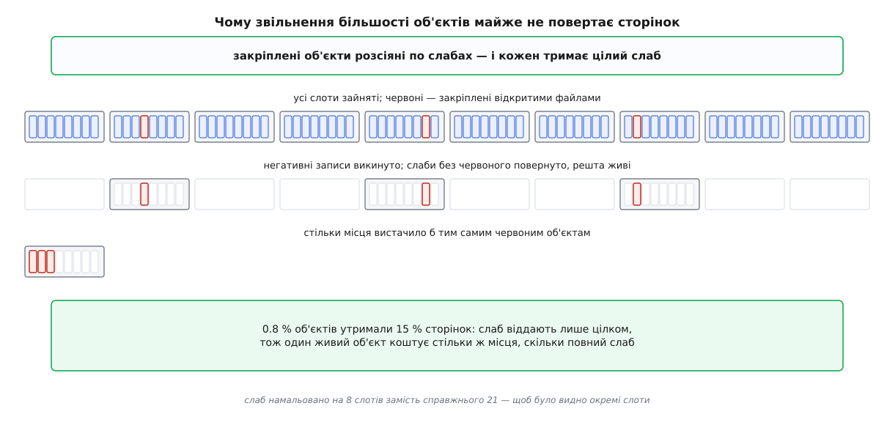

# ⚙️ Дослід із кешами ядра: порахувати, виростити, притиснути

Одна програма на C, яка на вашій власній машині показує чотири речі про пам'ять ядра: скільки в кешах об'єктів марного місця, як кеш імен виростає від самих лише невдалих пошуків, скільки з нього повертається під тиском проти примусового скидання, і чому наприкінці сторінки все одно не віддаються. Кожен крок — вимірювання, а не ілюстрація: числа беруться з `/proc`, і їх можна звірити з арифметикою слаба.

## Що саме перевіряємо

Про пам'ять ядра зазвичай знають одне число — рядок `Slab` у `/proc/meminfo`. Воно нічого не пояснює: не видно, чий це кеш, скільки з нього піде, якщо попросити, і скільки в ньому взагалі не використовується. Тому досліджуємо чотири окремі твердження, кожне з яких можна спростувати вимірюванням.

Перше: **місце в слабах губиться двома різними способами**, і вони мають різну природу. Хвіст слаба — байти, які не влізли в останній цілий слот, — не можна вжити ніколи, це чиста арифметика. Порожні слоти — нарізані, але зараз нічим не зайняті — це вже запас, який може знадобитися за мить. Одне число «зайнято стільки-то» змішує обидва, а лікуються вони по-різному.

Друге: **кеш записів каталогів росте від нічого**. Не від файлів, а від імен, яких немає: невдалий пошук лишає в пам'яті запис про те, що такого імені нема. Мільйон промахів має коштувати близько двохсот мегабайтів, і це має бути видно.

Третє: **тиск на пам'ять і примусове скидання дають різний результат**. Зменшувачі під тиском віддають частину, скидання — майже все. Різниця між цими двома числами і є та обережність, з якою ядро ставиться до власних кешів.

Четверте, найцікавіше: **звільнити об'єкти ≠ повернути сторінки**. Якщо жменя живих об'єктів розсіяна по слабах, то після звільнення всієї решти кількість сторінок під кешем впаде набагато менше, ніж кількість об'єктів. Це можна не тільки побачити, а й передбачити наперед формулою.

## Спільна частина: читання того, що система про себе розповідає

Файл `/proc/slabinfo` віддає по рядку на кеш. Формат другої версії такий (за `slabinfo(5)`):

```
slabinfo - version: 2.1
# name <active_objs> <num_objs> <objsize> <objperslab> <pagesperslab> : tunables <limit> <batchcount> <sharedfactor> : slabdata <active_slabs> <num_slabs> <sharedavail>
dentry            1081640 1092000    192   21    1 : tunables    0    0    0 : slabdata  52000  52000      0
```

Шість перших чисел — усе, що треба. Помноживши `num_slabs` на `pagesperslab` і на розмір сторінки, дістаємо, скільки пам'яті під цим кешем узагалі. Помноживши `objperslab` на `objsize`, дістаємо, скільки з одного слаба справді під об'єктами; різниця — хвіст. А `num_objs − active_objs` — це нарізані, але вільні слоти.

```c
/* slabwatch.c — дослід із кешами ядра
   зібрати:  cc -O2 -Wall -Wextra -o slabwatch slabwatch.c -lm            */
#define _GNU_SOURCE
#include <errno.h>
#include <fcntl.h>
#include <math.h>
#include <stdio.h>
#include <stdlib.h>
#include <string.h>
#include <time.h>
#include <unistd.h>
#include <sys/mman.h>
#include <sys/resource.h>
#include <sys/stat.h>

#define MAXC 1024

struct cache {
    char name[48];
    unsigned long active_objs, num_objs;
    unsigned long objsize, objperslab, pagesperslab;
    unsigned long active_slabs, num_slabs;
    unsigned long bytes;   /* усе, що під цим кешем                       */
    unsigned long tail;    /* хвости слабів — це не вживеться ніколи      */
    unsigned long idle;    /* нарізані, але порожні слоти                 */
};

static struct cache C[MAXC];
static int NC;
static unsigned long PAGE;

static double mib(unsigned long b) { return b / 1048576.0; }
static unsigned long sub(unsigned long a, unsigned long b) { return a > b ? a - b : 0; }

static int read_slabinfo(void)
{
    FILE *f = fopen("/proc/slabinfo", "r");
    if (!f) {
        fprintf(stderr, "/proc/slabinfo: %s (файл читає лише root)\n", strerror(errno));
        return -1;
    }
    char ln[512];
    NC = 0;
    while (fgets(ln, sizeof ln, f) && NC < MAXC) {
        struct cache c;
        memset(&c, 0, sizeof c);
        int n = sscanf(ln, "%47s %lu %lu %lu %lu %lu : tunables %*u %*u %*u"
                           " : slabdata %lu %lu",
                       c.name, &c.active_objs, &c.num_objs, &c.objsize,
                       &c.objperslab, &c.pagesperslab,
                       &c.active_slabs, &c.num_slabs);
        if (n != 8 || !c.objsize || !c.objperslab || !c.pagesperslab)
            continue;                    /* шапка й рядок із назвами полів */
        unsigned long slab = c.pagesperslab * PAGE;
        unsigned long used = c.objperslab * c.objsize;
        c.bytes = c.num_slabs * slab;
        c.tail  = c.num_slabs * sub(slab, used);
        c.idle  = sub(c.num_objs, c.active_objs) * c.objsize;
        C[NC++] = c;
    }
    fclose(f);
    return NC;
}

static unsigned long meminfo_kb(const char *key)     /* значення в кілобайтах */
{
    FILE *f = fopen("/proc/meminfo", "r");
    if (!f) return 0;
    char ln[256];
    size_t kl = strlen(key);
    unsigned long v = 0;
    while (fgets(ln, sizeof ln, f))
        if (!strncmp(ln, key, kl) && ln[kl] == ':') {
            v = strtoul(ln + kl + 1, NULL, 10);
            break;
        }
    fclose(f);
    return v;
}

static const struct cache *find_cache(const char *name)
{
    for (int i = 0; i < NC; i++)
        if (!strcmp(C[i].name, name)) return &C[i];
    return NULL;
}

/* один знімок стану названого кеша з підписом */
static struct cache snapshot(const char *tag, const char *cname)
{
    struct cache z;
    memset(&z, 0, sizeof z);
    if (read_slabinfo() < 0) exit(1);
    const struct cache *c = find_cache(cname);
    if (!c) {
        printf("%s: кеша «%s» у slabinfo немає (злився з іншим?)\n", tag, cname);
        return z;
    }
    z = *c;
    printf("%s: %s %lu об'єктів, %lu слабів (%.1f МіБ)"
           " | SReclaimable %.0f МіБ, Slab %.0f МіБ\n",
           tag, cname, z.active_objs, z.num_slabs,
           mib(z.num_slabs * z.pagesperslab * PAGE),
           meminfo_kb("SReclaimable") / 1024.0, meminfo_kb("Slab") / 1024.0);
    return z;
}
```

Читання `/proc` тут навмисно найпростіше, яке працює: числа беруться зі свіжого відкриття файлу щоразу, бо `/proc` — не файл на диску, а [згенерований на вимогу зріз стану ядра](root:sys-unix/proc-reading-process-and-kernel-state), і кешувати його вміст безглуздо.

## Крок перший: хто скільки марнує

Тепер найпростіший звіт — усі кеші, посортовані за абсолютною втратою.

```c
static int by_waste(const void *a, const void *b)
{
    const struct cache *x = a, *y = b;
    unsigned long wx = x->tail + x->idle, wy = y->tail + y->idle;
    return (wy > wx) - (wy < wx);
}

static int cmd_report(int top)
{
    if (read_slabinfo() < 0) return 1;
    unsigned long all = 0, alltail = 0, allidle = 0;
    for (int i = 0; i < NC; i++) {
        all += C[i].bytes; alltail += C[i].tail; allidle += C[i].idle;
    }
    qsort(C, NC, sizeof C[0], by_waste);

    /* шапку пишемо вручну: printf рахує ширину поля в БАЙТАХ,
       а кирилична літера в UTF-8 займає два — колонки б поїхали */
    puts("кеш                     об'єктів  розмір /слаб   слабів     усього"
         "    хвіст   простій   марно");
    for (int i = 0; i < NC && i < top; i++) {
        const struct cache *c = &C[i];
        printf("%-22s %10lu %7lu %5lu %8lu %10.1f %8.1f %9.1f %6.1f%%\n",
               c->name, c->active_objs, c->objsize, c->objperslab, c->num_slabs,
               mib(c->bytes), mib(c->tail), mib(c->idle),
               c->bytes ? 100.0 * (c->tail + c->idle) / c->bytes : 0.0);
    }
    printf("\nусього в slabinfo: %.0f МіБ, з них хвости %.0f МіБ,"
           " порожні слоти %.0f МіБ (%.1f %% марно)\n",
           mib(all), mib(alltail), mib(allidle),
           all ? 100.0 * (alltail + allidle) / all : 0.0);
    printf("meminfo: Slab %.0f МіБ = SReclaimable %.0f + SUnreclaim %.0f\n",
           meminfo_kb("Slab") / 1024.0, meminfo_kb("SReclaimable") / 1024.0,
           meminfo_kb("SUnreclaim") / 1024.0);
    return 0;
}
```

**Умова.** Робоча станція з 32 ГіБ пам'яті, ядро 6.8, сторінка 4096 байтів, після кількох годин збірок і одного обходу дерева файлів.

```
$ sudo ./slabwatch report 6
кеш                     об'єктів  розмір /слаб   слабів     усього    хвіст   простій   марно
ext4_inode_cache           302145    1072    15    21000      328.1      6.1      13.1    5.9%
kmalloc-1k                  39000    1024     8     6400       50.0      0.0      11.9   23.8%
dentry                    1081640     192    21    52000      203.1      3.2       1.9    2.5%
radix_tree_node             84000     576    28     3100       48.4      0.8       1.5    4.7%
inode_cache                 22300     632    25      900       14.1      0.5       0.1    4.4%
kmalloc-64                 141312      64    64     2300        9.0      0.0       0.4    4.0%

усього в slabinfo: 1284 МіБ, з них хвости 41 МіБ, порожні слоти 96 МіБ (10.7 % марно)
meminfo: Slab 1310 МіБ = SReclaimable 941 + SUnreclaim 369
```

Читати це варто по колонках, бо вони розповідають різні історії. У `ext4_inode_cache` більша частина втрати — це порожні слоти: 13 МіБ нарізаного, але не зайнятого місця, яке одразу піде в діло, щойно знадобиться новий inode. А хвіст там усього 6 МіБ, і саме тому, що ядро взяло під слаб не одну сторінку, а чотири: `15 × 1072 = 16080` з `16384`, тобто 304 байти залишку замість 880 при одній сторінці.

У `kmalloc-1k` картина інша й показова: хвоста немає взагалі — тисяча двадцять чотири ділить вісім кілобайтів націло, — а марно майже чверть, і вся вона в порожніх слотах. Це слід сплеску навантаження, який уже минув: слаби нарізані й лежать, чекаючи на наступний.

І тут-таки видно межу самого способу міряти: **справжня втрата `kmalloc` цим звітом не видима**. Кеш каже, що слот має 1024 байти, але не каже, скільки насправді попросив той, хто його взяв. Запит на 600 байтів отримав слот на 1024 і викинув 424 — у `slabinfo` це виглядає як цілком зайнятий слот. Тобто наш звіт бачить лише ту втрату, яку створює нарізка, і не бачить ту, яку створює округлення.

Останні два рядки не сходяться навмисно: 1284 МіБ, зібрані з `slabinfo`, проти 1310 МіБ у `meminfo`. Ці числа збирають різними шляхами — `meminfo` рахує байти, які справді списано на слаби, зокрема й ті, що прив'язані до контрольних груп по об'єктах, а не по сторінках. Розбіжність у два-три відсотки нормальна; розбіжність у рази означала б, що щось не так із припущенням про розмір сторінки.

## Крок другий: виростити кеш імен із нічого

Тепер найдешевший спосіб з'їсти двісті мегабайтів, не виділивши в програмі жодного байта.

Коли [розбір шляху](root:sys-unix/path-resolution) не знаходить імені, ядро запам'ятовує й це: у кеші з'являється **негативний запис** — «такого імені в цьому каталозі немає». Запис коштує рівно стільки ж, скільки звичайний, а число імен, яких немає, нічим не обмежене. Спроби завести межу на кількість негативних записів пропонують іще з 2017 року — і, за оглядом LWN 2020 року, жодна з них у ядро не ввійшла.

```c
static int cmd_grow(const char *dir, unsigned long n)
{
    int dfd = open(dir, O_RDONLY | O_DIRECTORY);
    if (dfd < 0) { fprintf(stderr, "%s: %s\n", dir, strerror(errno)); return 1; }

    struct cache a = snapshot("до", "dentry");

    char nm[64];
    struct stat st;
    unsigned long miss = 0;
    struct timespec t0, t1;
    clock_gettime(CLOCK_MONOTONIC, &t0);
    for (unsigned long i = 0; i < n; i++) {
        snprintf(nm, sizeof nm, "nx-%ld-%lu", (long)getpid(), i);
        if (fstatat(dfd, nm, &st, AT_SYMLINK_NOFOLLOW) < 0 && errno == ENOENT)
            miss++;
    }
    clock_gettime(CLOCK_MONOTONIC, &t1);
    double dt = (t1.tv_sec - t0.tv_sec) + (t1.tv_nsec - t0.tv_nsec) / 1e9;
    printf("%lu невдалих пошуків за %.2f с (%.0f тис./с)\n",
           miss, dt, miss / dt / 1000.0);

    struct cache b = snapshot("після", "dentry");
    close(dfd);

    unsigned long dobj = sub(b.active_objs, a.active_objs);
    unsigned long dpg  = sub(b.num_slabs * b.pagesperslab,
                             a.num_slabs * a.pagesperslab);
    printf("\nприріст: об'єктів +%lu, сторінок +%lu = %.1f МіБ\n",
           dobj, dpg, mib(dpg * PAGE));
    printf("на один запис вийшло %.1f Б при розмірі об'єкта %lu Б\n",
           dobj ? (double)dpg * PAGE / dobj : 0.0, b.objsize);
    return 0;
}
```

Два рішення в цьому циклі варті пояснення. По-перше, пошук іде через `fstatat` від дескриптора каталогу, а не через `stat` від повного шляху: [сімейство викликів «від каталогу»](root:sys-unix/at-family-syscalls) дозволяє відкрити каталог один раз і далі шукати в ньому по одному компоненту, замість того щоб щоразу проходити весь шлях від кореня. Так вимірюється саме те, що нас цікавить, а не робота обходу шляху. По-друге, у назву входить номер процесу — тому кожен запуск б'є в нові імена, а не в записи, які вже лежать у кеші після попереднього разу.

**Умова.** Каталог на ext4 (`~/slablab`), мільйон невдалих пошуків.

```
$ sudo ./slabwatch grow ~/slablab 1000000
до: dentry 187425 об'єктів, 9210 слабів (36.0 МіБ) | SReclaimable 412 МіБ, Slab 598 МіБ
1000000 невдалих пошуків за 2.41 с (415 тис./с)
після: dentry 1191306 об'єктів, 57020 слабів (222.7 МіБ) | SReclaimable 610 МіБ, Slab 797 МіБ

приріст: об'єктів +1003881, сторінок +47810 = 186.8 МіБ
на один запис вийшло 195.1 Б при розмірі об'єкта 192 Б
```

Числа сходяться з арифметикою слаба з точністю до десятих:

```
слотів у слабі:   4096 ÷ 192 = 21.33  → 21, хвіст 4096 − 21·192 = 64 Б
накладні витрати: 4096 ÷ (21·192) = 1.0159  → 1.6 %
виміряно:         195.1 ÷ 192     = 1.0161  → 1.6 %
```

Тобто мільйон імен, яких не існує, коштував 187 мегабайтів, і рівно 1.6 % із них — хвости слабів. Ніхто цієї пам'яті не просив: жодного `malloc`, жодного відкритого файлу, лише невдалі `stat`. `SReclaimable` виріс трохи більше (198 МіБ проти 187) — крім самих записів, обхід зачепив і сусідні кеші.

## Крок третій: попросити проти забрати

Тепер порівняємо два способи повернути цю пам'ять: чесний тиск і примусове скидання.

```c
static int drop_slab(void)          /* 2 — лише слабові кеші, без сторінкового */
{
    int fd = open("/proc/sys/vm/drop_caches", O_WRONLY);
    if (fd < 0) {
        fprintf(stderr, "drop_caches: %s (треба root)\n", strerror(errno));
        return -1;
    }
    sync();
    ssize_t w = write(fd, "2\n", 2);
    close(fd);
    if (w < 0) { perror("drop_caches"); return -1; }
    sleep(1);                       /* зменшувачам треба мить доробити */
    return 0;
}

static int cmd_squeeze(unsigned long want_mib)
{
    const size_t chunk = 512ul << 20;
    size_t n = (size_t)((want_mib + 511) / 512), got = 0;
    void **blk = calloc(n, sizeof *blk);
    if (!blk) return 1;

    unsigned long floor_kb = meminfo_kb("MemTotal") / 20;   /* 5 % — далі стоп */
    if (floor_kb < 256u * 1024) floor_kb = 256u * 1024;

    puts(" узято MemAvailable       dentry     слабів SReclaimable");
    for (size_t i = 0; i < n; i++) {
        void *m = mmap(NULL, chunk, PROT_READ | PROT_WRITE,
                       MAP_PRIVATE | MAP_ANONYMOUS | MAP_NORESERVE, -1, 0);
        if (m == MAP_FAILED) {
            fprintf(stderr, "mmap відмовив на %zu МіБ: %s\n",
                    got * 512, strerror(errno));
            break;
        }
        blk[got++] = m;
        for (size_t o = 0; o < chunk; o += PAGE)
            ((volatile char *)m)[o] = 1;     /* без запису сторінки не з'являться */

        if (read_slabinfo() < 0) break;
        const struct cache *d = find_cache("dentry");
        unsigned long avail = meminfo_kb("MemAvailable");
        printf("%6zu %12.0f %12lu %10lu %12.0f\n",
               got * 512, avail / 1024.0,
               d ? d->active_objs : 0, d ? d->num_slabs : 0,
               meminfo_kb("SReclaimable") / 1024.0);
        if (avail < floor_kb) {
            printf("вільного лишилося менш як %.0f МіБ — зупиняємось\n",
                   floor_kb / 1024.0);
            break;
        }
    }
    for (size_t k = 0; k < got; k++) munmap(blk[k], chunk);
    free(blk);
    return 0;
}
```

Цикл бере пам'ять шматками по 512 МіБ і **торкається кожної сторінки**: без запису відображення лишилося б обіцянкою, і жодного тиску не було б. Після кожного шматка знімається стан кеша — так видно не підсумок, а форму кривої.

```
$ sudo ./slabwatch squeeze 6144
 узято MemAvailable       dentry     слабів SReclaimable
   512         7428      1191340      57021          610
  1024         6910      1191338      57021          610
  1536         6398      1191330      57020          610
  2048         5884      1191301      57020          610
  2560         5372      1191284      57020          610
  3072         4860      1191140      57019          610
  3584         4348      1191062      57019          609
  4096         3858      1190974      57018          609
  4608         3402      1160880      56420          598
  5120         2840      1104512      55100          578
  5632         2366       880430      48210          521
  6144         1902       612300      39400          470
```

Форма кривої і є відповідь. Перші чотири гігабайти кеш не помічає взагалі: вільна пам'ять просто витрачається, і зменшувачів ніхто не турбує. Далі, коли вільного лишається менш як три з половиною гігабайти, кеш починає віддавати: спершу по два-три відсотки за кожні пів гігабайта, потім по п'ятій частині, а на останньому кроці — по третині. Це та сама наростальна наполегливість, з якою відбір щоразу піднімає вимогу: спершу в кеша просять частки відсотка, і лише коли легкі заходи не дали пам'яті, вимога зростає в рази.

Тепер друге число — для порівняння:

```
$ sudo ./slabwatch drop
до: dentry 612300 об'єктів, 39400 слабів (153.9 МіБ) | SReclaimable 470 МіБ, Slab 660 МіБ
після: dentry 24118 об'єктів, 5940 слабів (23.2 МіБ) | SReclaimable 210 МіБ, Slab 398 МіБ
```

Різниця промовиста. Тиск на шість гігабайтів забрав із кеша імен приблизно половину; примусове скидання забрало з того, що лишилося, ще 96 %. Тобто ядро **свідомо не викручує кеші досуха** навіть тоді, коли пам'яті вже бракує: воно вважає кеш імен корисним і торгується за нього. Скидання не торгується, і саме тому воно годиться лише як діагностичний доказ («цю пам'ять справді можна було звільнити»), а не як лікування: разом із мільйоном непотрібних записів воно викидає й ті кілька тисяч, якими система живе щохвилини, і наступні хвилини машина відпрацьовує це зверненнями до диска.

Тут-таки видно й дещо цікавіше. Після скидання лишилося 24 118 об'єктів у 5 940 слабах. Якби вони лежали щільно, вистачило б 1 149 слабів. Тобто навіть на «прибраному» кеші сторінок під ним у п'ять разів більше, ніж треба об'єктам. Це і є те, що ми зараз відтворимо навмисно.

## Крок четвертий: розсіяння, яке не дає віддати сторінки

Задум простий. Виростимо мільйон негативних записів, як раніше, але **рівномірно вкрапимо** між ними кілька тисяч записів, які викинути не можна — імена справжніх файлів, що лишаються відкритими. Відкритий файл тримає посилання на свій запис, і зменшувач його не забере. Потім скинемо кеш і подивимось, скільки сторінок повернулося.

Передбачити результат можна наперед. Слаб віддається сторінковому роздавачу лише тоді, коли **всі** його слоти вільні. Якщо закріплені записи розсіяні випадково й становлять частку `p` від усіх, то слаб на `k` слотів переживе скидання з імовірністю «в ньому є хоч один закріплений»:

```
частка закріплених:  p = 8000 ÷ 1007940 = 0.007937
слотів у слабі:      k = 21
слаб лишається:      1 − (1 − p)ᵏ = 1 − 0.992063²¹ = 1 − 0.8459 = 0.1541
з 48010 слабів:      48010 × 0.1541 = 7398
```

Менш ніж один відсоток об'єктів має втримати понад п'ятнадцять відсотків сторінок. Перевіряємо.

```c
static unsigned long raise_nofile(void)     /* м'яку межу піднімаємо до жорсткої */
{
    struct rlimit rl;
    if (getrlimit(RLIMIT_NOFILE, &rl) != 0) return 1024;
    rl.rlim_cur = rl.rlim_max;
    setrlimit(RLIMIT_NOFILE, &rl);
    if (getrlimit(RLIMIT_NOFILE, &rl) != 0) return 1024;
    if (rl.rlim_cur == RLIM_INFINITY || rl.rlim_cur > 262144) return 262144;
    return (unsigned long)rl.rlim_cur;
}

static int cmd_scatter(const char *dir, unsigned long neg, unsigned long pins)
{
    int dfd = open(dir, O_RDONLY | O_DIRECTORY);
    if (dfd < 0) { fprintf(stderr, "%s: %s\n", dir, strerror(errno)); return 1; }

    unsigned long cap = raise_nofile();
    if (pins + 64 > cap) pins = cap > 64 ? cap - 64 : 0;
    if (!pins || !neg) { fprintf(stderr, "обидва числа мають бути > 0\n"); return 1; }

    int *fds = calloc(pins, sizeof *fds);
    if (!fds) return 1;

    struct cache a = snapshot("до", "dentry");

    unsigned long step = neg / pins ? neg / pins : 1;   /* через скільки промахів */
    unsigned long got = 0;
    char nm[64];
    struct stat st;
    for (unsigned long i = 0; i < neg; i++) {
        snprintf(nm, sizeof nm, "nx-%ld-%lu", (long)getpid(), i);
        (void)fstatat(dfd, nm, &st, AT_SYMLINK_NOFOLLOW);      /* завжди ENOENT */
        if (i % step == 0 && got < pins) {
            snprintf(nm, sizeof nm, "pin-%ld-%lu", (long)getpid(), got);
            int fd = openat(dfd, nm, O_CREAT | O_RDONLY, 0600);
            if (fd >= 0) fds[got++] = fd;
            else pins = got;              /* дескрипторів більше не дадуть */
        }
    }

    struct cache b = snapshot("виросло", "dentry");
    unsigned long dobj  = sub(b.active_objs, a.active_objs);
    unsigned long dslab = sub(b.num_slabs, a.num_slabs);
    printf("\nстворено: %lu негативних записів + %lu відкритих файлів"
           " (закріп кожен %lu-й)\n", neg, got, step);
    printf("приріст dentry: об'єктів +%lu, слабів +%lu = %.1f МіБ\n",
           dobj, dslab, mib(dslab * b.pagesperslab * PAGE));

    if (drop_slab() == 0) {
        struct cache c = snapshot("після скидання", "dentry");
        unsigned long robj  = sub(c.active_objs, a.active_objs);
        unsigned long rslab = sub(c.num_slabs, a.num_slabs);
        printf("лишилось: об'єктів +%lu, слабів +%lu = %.1f МіБ\n",
               robj, rslab, mib(rslab * c.pagesperslab * PAGE));

        double pf = dobj ? (double)got / dobj : 0.0;
        double expect = dslab * (1.0 - pow(1.0 - pf, (double)b.objperslab));
        unsigned long ideal = (got + b.objperslab - 1) / b.objperslab;
        printf("\nочікувано за розсіянням: %.0f слабів"
               " (частка закріплених %.4f, слотів у слабі %lu)\n",
               expect, pf, b.objperslab);
        printf("щільно ті самі об'єкти зайняли б слабів: %lu"
               " — розсіяння коштує %.1f×\n",
               ideal, ideal ? (double)rslab / ideal : 0.0);
    }

    for (unsigned long k = 0; k < got; k++) close(fds[k]);
    for (unsigned long k = 0; k < got; k++) {
        snprintf(nm, sizeof nm, "pin-%ld-%lu", (long)getpid(), k);
        unlinkat(dfd, nm, 0);
    }
    free(fds);
    if (drop_slab() == 0) {
        struct cache d = snapshot("після прибирання", "dentry");
        printf("лишилось: об'єктів +%lu, слабів +%lu = %.1f МіБ\n",
               sub(d.active_objs, a.active_objs), sub(d.num_slabs, a.num_slabs),
               mib(sub(d.num_slabs, a.num_slabs) * d.pagesperslab * PAGE));
    }
    close(dfd);
    return 0;
}
```

Підняття межі на кількість відкритих файлів обов'язкове: типова м'яка межа в тисячу дескрипторів не дасть закріпити вісім тисяч записів. Піднімати можна тільки до жорсткої — це звичайна поведінка [лімітів ресурсів](root:sys-unix/resource-limits), і саме тому програма спершу пробує, а потім перечитує, скільки їй справді дозволили.

```
$ sudo ./slabwatch scatter ~/slablab 1000000 8000
до: dentry 183900 об'єктів, 9020 слабів (35.2 МіБ) | SReclaimable 405 МіБ, Slab 590 МіБ
виросло: dentry 1191840 об'єктів, 57030 слабів (222.8 МіБ) | SReclaimable 612 МіБ, Slab 798 МіБ

створено: 1000000 негативних записів + 8000 відкритих файлів (закріп кожен 125-й)
приріст dentry: об'єктів +1007940, слабів +48010 = 187.5 МіБ
після скидання: dentry 191942 об'єктів, 16410 слабів (64.1 МіБ) | SReclaimable 408 МіБ, Slab 592 МіБ
лишилось: об'єктів +8042, слабів +7390 = 28.9 МіБ

очікувано за розсіянням: 7398 слабів (частка закріплених 0.0079, слотів у слабі 21)
щільно ті самі об'єкти зайняли б слабів: 381 — розсіяння коштує 19.4×
після прибирання: dentry 184017 об'єктів, 9058 слабів (35.4 МіБ) | SReclaimable 404 МіБ, Slab 589 МіБ
лишилось: об'єктів +117, слабів +38 = 0.1 МіБ
```

Передбачення 7 398 проти виміряних 7 390 — розбіжність у тисячну частку. Це означає, що модель правильна: закріплені записи справді лягли по слабах приблизно випадково, і жодного іншого механізму, який утримував би сторінки, тут немає.



*Менш ніж один відсоток об'єктів утримав п'ятнадцять відсотків сторінок — бо слаб віддають тільки цілком.*

Останній рядок закриває доказ. Коли файли закрито й вилучено, а скидання повторено, від приросту лишається 38 слабів зі 48 010. Отже, сторінки не «зависли» й не «протекли» — вони весь час були заручниками восьми тисяч живих об'єктів, і повернулися тієї ж миті, коли останній заручник зник.

Це і є практичний висновок усього досліду: **у пам'яті ядра «звільнено об'єктів» і «повернуто пам'яті» — два різні числа**, і друге може бути в двадцять разів гірше за перше. Верхня межа цієї різниці — кількість слотів у слабі: гірше, ніж «один живий об'єкт на слаб», не буває.

> 🔧 **Навіщо це.** Коли на машині `SReclaimable` великий, а скидання кешів дає мало, ядро не поламане — це розсіяння. Для підозрілого кеша порахуйте, скільки слотів припадає на один зайнятий об'єкт: `num_slabs × objperslab ÷ active_objs`. Близько одиниці — кеш щільний, зменшувати його є сенс. Близько `objperslab` — у слабах сидять поодинокі живі об'єкти, і скільки не тисни, сторінок майже не додасться; шукати треба того, хто їх тримає.

## Головна функція

```c
static void usage(void)
{
    fputs("вжиток:\n"
          "  slabwatch report [скільки рядків]\n"
          "  slabwatch grow <тека> <скільки пошуків>\n"
          "  slabwatch squeeze <МіБ>\n"
          "  slabwatch drop\n"
          "  slabwatch scatter <тека> <негативних> <закріпити>\n", stderr);
}

int main(int argc, char **argv)
{
    PAGE = (unsigned long)sysconf(_SC_PAGESIZE);
    if (argc < 2) { usage(); return 2; }
    if (!strcmp(argv[1], "report"))
        return cmd_report(argc > 2 ? atoi(argv[2]) : 12);
    if (!strcmp(argv[1], "grow") && argc > 3)
        return cmd_grow(argv[2], strtoul(argv[3], NULL, 10));
    if (!strcmp(argv[1], "squeeze") && argc > 2)
        return cmd_squeeze(strtoul(argv[2], NULL, 10));
    if (!strcmp(argv[1], "drop")) {
        snapshot("до", "dentry");
        if (drop_slab() != 0) return 1;
        snapshot("після", "dentry");
        return 0;
    }
    if (!strcmp(argv[1], "scatter") && argc > 4)
        return cmd_scatter(argv[2], strtoul(argv[3], NULL, 10),
                           strtoul(argv[4], NULL, 10));
    usage();
    return 2;
}
```

## Що заважає повторити

**Файлову систему для дослідів треба вибирати.** Каталог має лежати на звичайній дисковій файловій системі — ext4, XFS, Btrfs. На `tmpfs` (зокрема `/dev/shm`) дослід із негативними записами просто не спрацює: пошук у файловій системі, яка цілком живе в пам'яті, позначає невдалий запис як такий, що не варто тримати в кеші, і той зникає одразу після звертання. Це видно в чинному коді ядра (`simple_lookup` у `fs/libfs.c` виставляє записові прапорець `DCACHE_DONTCACHE`), але перевіряти на слово не треба: запустіть `grow` на `/dev/shm` і на `~/slablab` та порівняйте приріст.

**Читати `slabinfo` можна лише від root, і це не безкоштовно.** Обмеження прав тут навмисне — за розкладкою кешів видно, що робить система. А ціна читання така: чинний розподілювач не тримає готового числа зайнятих об'єктів, воно збирається обходом списків часткових слабів кожного вузла пам'яті, і робиться це під замком того вузла. На машині з мільйонами об'єктів один такий обхід — це помітні мілісекунди, протягом яких виділення з тих кешів чекає. Тому не опитуйте `slabinfo` у щільному циклі: вимірювання зіпсує те, що міряє. Це загальна властивість такого роду вимірювань, і в [мікробенчмарках](root:sf-release/microbenchmarking) вона проявляється так само — порівнюйте прирости між двома знімками, а не абсолютні числа.

**Назва кеша може брехати.** Кеші з однаковим розміром слота й сумісними властивостями розподілювач зливає в один, тому рядок `kmalloc-192` може обслуговувати десяток непов'язаних типів, а шуканого імені може взагалі не виявитися в переліку. Скільки кешів злилося в один, показує `/sys/kernel/slab/<назва>/aliases`, а розділити їх на час дослідів дає завантажувальний параметр `slab_nomerge`. Кеш записів каталогів на типовій збірці лишається окремим, але покладатися на це не варто — програма й так чесно каже, коли не знайшла кеша на ім'я.

**Тиск пам'яттю небезпечний.** Команда `squeeze` бере справжні сторінки, і машина в цей момент по-справжньому близька до межі: [вбивця за браком пам'яті](root:sys-unix/overcommit-and-oom) може вибрати не нашу програму, а редактор, сеанс чи базу даних. Запобіжник у вигляді зупинки на п'яти відсотках вільного допомагає, але не рятує від сплеску чужого попиту. Правильний спосіб робити це на машині, якою дорожать, — замкнути тиск у [контрольній групі](root:sys-unix/cgroups-resource-model) з виставленою межею пам'яті: тоді відбір відбувається всередині групи, а решта системи його навіть не помічає.

**Стороннє навантаження зсуває все.** Будь-яка інша робота на машині теж створює й нищить записи каталогів: журнал служб, індексатор, будь-яка збірка. Мільйон наших записів на цьому тлі видно добре, а от розбіжність між передбаченням і виміром у частки відсотка — уже ні. Дослід має сенс на майже ненавантаженій машині, і навіть тоді порівнювати варто прирости, а не абсолютні значення.

**Числа залежать від збірки й від машини.** Скільки сторінок піде під слаб, розподілювач вирішує з огляду на кількість процесорів: на восьмиядерній машині запис каталогу лягає по 21 на одну сторінку, на шістдесятичотириядерній — по 42 на дві. Розмір самого запису теж відрізняється між версіями ядра. Тому не звіряйте свої числа з надрукованими тут — звіряйте їх із власною арифметикою, яку програма й друкує поруч. І ще одне: старий розподілювач, який тримав черги готових об'єктів на кожен процесор, прибрано з ядра у версії 6.8; на ядрах до неї частина об'єктів ховалася в тих чергах, і колонка «порожні слоти» показувала менше, ніж було насправді.

**Прибирати за собою обов'язково.** `scatter` створює тисячі справжніх файлів; програма вилучає їх сама, але якщо її вбити посередині, вони лишаться. Каталог для дослідів варто заводити окремий і вилучати цілком.
