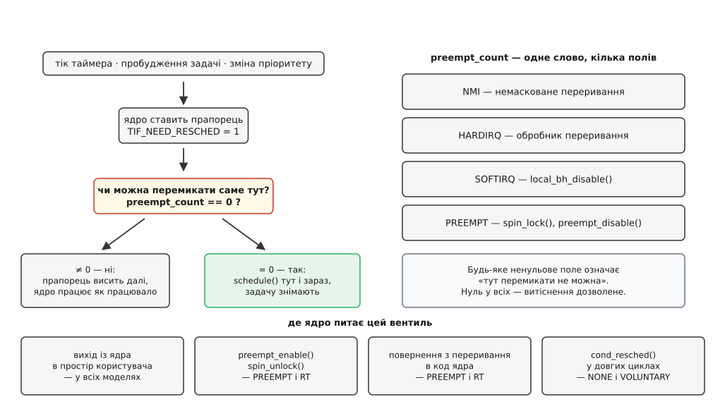
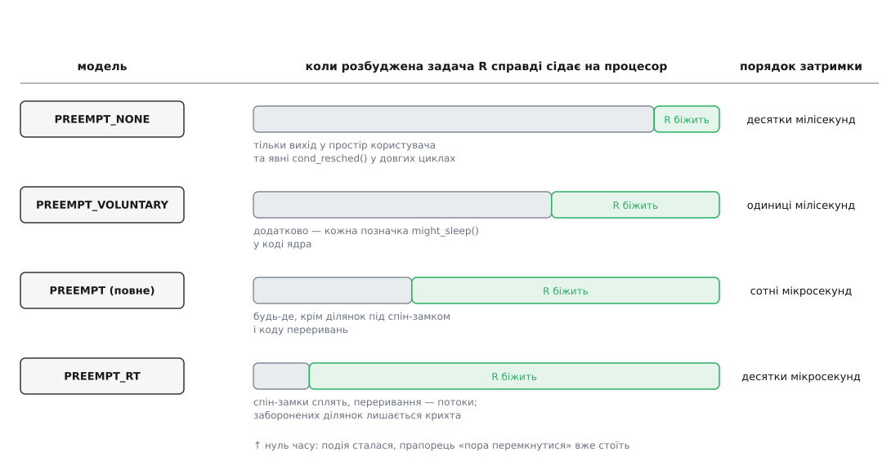
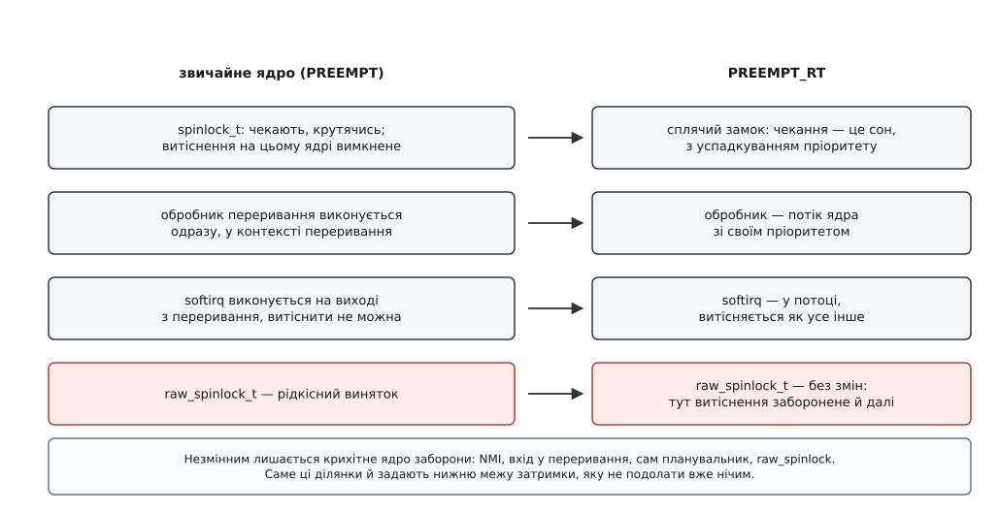
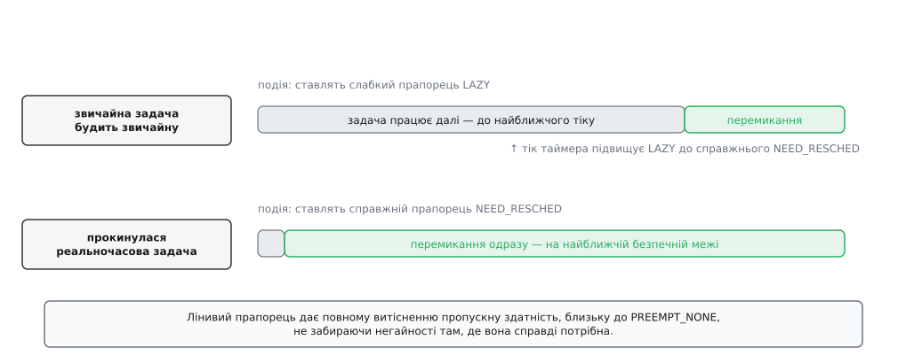

# Витісненість ядра: від PREEMPT_NONE до PREEMPT_RT

<preknowlist>
- [Планувальник: як ядро ділить час](topic:sys-unix/scheduler-model) — переривання таймера не перемикає задачу саме, а лише ставить прапорець «цю задачу пора зняти»; саме перемикання стається пізніше.
- [Ядро й простір користувача](topic:sys-unix/kernel-and-userspace) — код ядра виконується на тому самому процесорі, що й програми, лише в іншому режимі й на іншому стеку.
- [Системний виклик: як програма просить ядро](topic:sys-unix/syscall-mechanics) — задача, зайшовши в ядро, лишається тією самою задачею: ядро працює її руками й на її час.
- [Переривання](topic:hw-arch/interrupts) — апаратна подія силоміць забирає процесор у того, хто зараз біжить, і віддає його обробникові.
- [Перемикання контексту](topic:sf-os/context-switch) — щоб змінити задачу, треба зберегти регістри однієї й відновити регістри іншої; це коштує часу й холодить кеш.
- [Спін-замок](topic:sf-tasks/spinlock) — замок, на якому чекають, крутячись у порожньому циклі, а не засинаючи.
- [Пріоритети, nice і реальночасові класи](topic:sys-unix/priority-nice-realtime) — реальночасова задача витісняє будь-яку звичайну, щойно стане готовою.
- [Інверсія пріоритетів](topic:sf-os/priority-inversion) — важлива задача чекає на замок, який тримає неважлива.
</preknowlist>

## Вісім мілісекунд, яких не мало бути

Вимірювальний потік із класом `SCHED_FIFO` і пріоритетом 80 прокидається кожні 200 мкс і дивиться на годинник. Пам'ять прибита `mlockall`, а за пріоритетом він старший за все, що крутиться на цьому ядрі процесора. Типове запізнення — 12 мкс. Але раз на кілька хвилин у гістограмі з'являється стовпчик на восьми мілісекундах.

Пріоритети тут ні до чого: вища за нього задача в системі відсутня. Планувальник теж ні до чого: він побачив прокидання одразу й одразу вирішив, кого ставити на процесор. Річ у тім, що в ту мить, коли спрацював таймер, процесор виконував не програму. Він виконував **саме ядро** — якийсь сусідній процес, до вимірювань не причетний, попросив звільнити пів гігабайта пам'яті, і ядро сумлінно йшло по таблицях сторінок. Прапорець «треба перемкнути задачу» ядро поставило собі негайно. А перемкнути не змогло.

Ось про що ця стаття: **наскільки ядро дозволяє спинити саме себе на півдорозі**. Слово тут точніше, ніж здається: витіснення (англ. *preemption*, з середньолат. *praeemptio* — «купівля раніше за інших», право забрати те, на що претендує хтось інший) означає саме відібрання процесора в того, хто його не віддавав. Витіснити програму в просторі користувача просто — її можна зупинити на будь-якій інструкції, бо весь її стан лежить у регістрах і в її власній пам'яті. Витіснити ядро посеред роботи — питання зовсім іншої природи, бо ядро одне на всіх, його дані спільні, і чималий шматок його коду написано з мовчазним припущенням, що почате буде доведено до кінця тут-таки, на цьому ж процесорі.

Різні відповіді на це питання й дістали назви `PREEMPT_NONE`, `PREEMPT_VOLUNTARY`, `PREEMPT`, `PREEMPT_RT`. Це не рівні «швидкості» й не рівні «якості»: кожна модель — інша межа довіри до власного коду ядра.

## Чому ядро не можна спинити будь-де

Припустімо на мить, що ми дозволили перемикати задачі всередині ядра де завгодно, як у просторі користувача. Подивімося, що зламається — бо саме з цих поломок і виросла вся механіка.

**Перше: спін-замок перетворюється на пастку.** Ядро захищає короткі спільні структури спін-замком — тим, на якому не сплять, а крутяться в циклі, чекаючи, доки власник звільнить. Розрахунок простий: власник тримає замок кілька десятків наносекунд, тож чекати активно дешевше, ніж засинати й прокидатися.

Тепер витісніть власника. Задача A взяла спін-замок, і тут її знімають із процесора на користь задачі B — **на тому самому ядрі процесора**. B доходить до тієї самої структури й бере той самий замок: крутиться. Але A не звільнить його ніколи, бо A стоїть, а єдиний процесор, на якому вона могла б бігти, зайнятий тим, що крутить B. Це не рідкісна гонка, а гарантований глухий кут: обидві задачі чекають одна на одну назавжди.

Звідси випливає правило, з якого починається все інше: **взяття спін-замка мусить заборонити витіснення на цьому ядрі**. Настільки мусить, що на однопроцесорному ядрі, де замок захищати нема від кого, `spin_lock()` компілюється рівно в заборону витіснення й більше ні в що — і це найточніше свідчення того, від чого замок насправді боронить.

**Друге: дані «свого ядра процесора» перестають бути своїми.** Гарячі структури ядро тримає окремими примірниками на кожне ядро процесора, щоб не брати спільних замків узагалі. Код бере вказівник на свій примірник і працює з ним без жодного захисту — захистом слугує сам факт, що більше ніхто на це ядро процесора не претендує. Витісніть таку задачу, і планувальник цілком законно перенесе її на сусіднє ядро процесора: вона прокинеться там і продовжить писати за вказівником, який тепер веде в чужу структуру. Не гонка, не пошкодження — просто акуратний запис не туди.

**Третє: у контексті переривання нема кого перемикати.** Обробник переривання — не задача. У нього немає ані власного місця в черзі планувальника, ані права заснути: заснути означає віддати процесор і чекати на пробудження, а будити тут нема кого. Тому будь-яка спроба покликати планувальник із обробника — це не затримка, а руйнування системи.

Три різні поломки, одна спільна форма: у ядрі є ділянки, де перемикання задачі означає катастрофу, і межі цих ділянок відомі лише самому коду, що в них заходить. Отже, ядру потрібен спосіб сказати «зараз не можна» — і сказати так, щоб це вкладалося одне в одне, бо ділянки вкладаються: під спін-замком беруть другий спін-замок, а всередині може прийти переривання.

## Прапорець і лічильник

Механізм вийшов з двох чисел, і обидва живуть при задачі, а не при планувальнику.

Перше — **прапорець** `TIF_NEED_RESCHED`: «цю задачу треба зняти за першої нагоди». Його ставить будь-яка подія, що змінює розклад: тік таймера, який побачив, що поточна вичерпала свій відрізок; пробудження задачі, якій ядро винне більше; зміна пріоритету. Прапорець нічого не робить — він тільки констатує.

Друге — **лічильник причин не перемикати** (`preempt_count`). Це одне слово, поділене на поля: окреме поле рахує звичайні заборони (`preempt_disable()`, взяття спін-замка), окреме — заборону нижніх половин переривань (`local_bh_disable()`), окреме — вкладеність обробників апаратних переривань, окреме — немасковані переривання. Поля різні, а правило спільне й просте: **перемикати можна лише тоді, коли все слово дорівнює нулю**.



*Подія ставить прапорець, але не перемикає нічого. Перемикання стається пізніше, у місцях, де ядро питає вентиль: чи прапорець висить і чи лічильник заборон нульовий. Скільки таких місць вкомпільовано в ядро — це і є модель витіснення.*

Тепер найцікавіше: **де саме питають цей вентиль**. Найважливіше місце — не тік і не пробудження, а звільнення заборони:

```c
/* спрощено до суті — так виглядає вихід із ділянки, де витіснення заборонене */
static inline void preempt_enable(void)
{
    barrier();                        /* компілятор не сміє переносити код через межу */
    if (--current_thread_info()->preempt_count == 0 &&
        test_thread_flag(TIF_NEED_RESCHED))
        preempt_schedule();           /* саме тут задачу й знімуть */
}

void spin_unlock(spinlock_t *lock)
{
    release(lock);
    preempt_enable();                 /* остання заборона зникла — можна перемикати */
}
```

Це переставляє картину з ніг на голову. Не планувальник шукає моменту зняти задачу — сам код ядра, виходячи з небезпечної ділянки, перевіряє, чи не чекають на нього, і сам себе знімає з процесора. Прапорець, поставлений сто мікросекунд тому перериванням, спрацьовує в мить, коли остання заборона впала.

Одразу межа, без якої це стане джерелом помилок: **саме цю перевірку вкомпільовують лише у витісненому ядрі**. Під `PREEMPT_NONE` і `PREEMPT_VOLUNTARY` від `preempt_enable()` лишається бар'єр компілятора й зменшення лічильника — і більше нічого. А в ядрі, складеному без витісненості зовсім, не ведеться й сам лічильник: його вмикає або витісненість, або налагоджувальний пункт «ловити сон у забороненому контексті». Тобто нижче йдеться не про те, що моделі роблять із готовою перевіркою, а про те, які перевірки взагалі є в двійковому коді.

На x86 цю перевірку ще й склеїли в одну: прапорець тримають окремим бітом у тому самому слові `preempt_count`, і то в перевернутому вигляді, тож «лічильник нульовий і прапорець стоїть» перетворюється на одне порівняння цілого слова з нулем. Дрібниця, але вона показує, наскільки гаряче це місце: воно виконується мільйони разів на секунду.

> 🔧 **Навіщо це.** Звідси зрозуміле повідомлення `BUG: sleeping function called from invalid context`, на яке натикається кожен, хто пише модуль ядра. Виділення пам'яті з `GFP_KERNEL` має право заснути, а ви покликали його під спін-замком — тобто при ненульовому лічильнику. Ловить це не сам сон, а позначка `might_sleep()` на початку такої функції: вона дивиться на лічильник і кричить одразу, ще до того, як система справді зависне. Кричить, щоправда, лише в ядрі, складеному з `CONFIG_DEBUG_ATOMIC_SLEEP`: у звичайному дистрибутивному ядрі цієї перевірки немає, і про свою помилку ви дізнаєтеся не з повідомлення, а з поведінки машини — тож модулі ганяють саме на налагоджувальному ядрі. Тому в модулі під спін-замком беруть `GFP_ATOMIC`, а краще — виносять виділення за межі замка.

## Чим моделі різняться насправді

Досі описано сам механізм — прапорець і лічильник, — і він в усіх моделях той самий. Модель витіснення визначає **місця, де ядро цей вентиль питає**, — і тільки їх.

**`PREEMPT_NONE`.** Вентиль питають на виході з ядра в простір користувача й при добровільному засинанні. Усередині довгої операції ядра — ніде. Задача, що зайшла в системний виклик, іде своїм шляхом до кінця, скільки б той шлях не тривав.

Одне уточнення, без якого модель виглядає гіршою, ніж є. У довгих циклах ядра розставлені явні виклики `cond_resched()` — «якщо на мене чекають, спинюся тут добровільно». Саме вони й рятують `PREEMPT_NONE` від зовсім диких затримок: цикл, що обходить мільйон сторінок, кличе `cond_resched()` кожні кілька сотень сторінок.

**`PREEMPT_VOLUNTARY`** додає до цього ще один клас точок — уже наявні позначки `might_sleep()`. Вони й так стоять усюди, де функція має право заснути; отже, у цих місцях перемикання свідомо безпечне, залишається ним скористатися. Ціна нульова, бо позначки вже написані; виграш — сотні нових точок витіснення задарма.

**`PREEMPT`** (повне) додає одразу два класи місць. Перший — той самий `preempt_enable()` із коду вище: тепер звільнення останньої заборони справді перевіряє прапорець, тож кожен `spin_unlock()` у ядрі стає точкою витіснення. Другий і головний — перевірка **на поверненні з переривання в код ядра**. Досі, якщо переривання застало ядро за роботою, ядро після обробника поверталося туди, звідки його висмикнули, і йшло далі. Тепер воно перед поверненням дивиться на вентиль — і, якщо лічильник нульовий, перемикається негайно. Разом із тим `cond_resched()` тут стає порожнім місцем: коли витіснення можливе будь-де, розставляти йому окремі точки безглуздо.

**`PREEMPT_RT`** — не наступний щабель того самого, а зміна самих примітивів; ним займемося окремо.



*Сіре — час, який розбуджена задача R простоює, бо ядро зайняте чужою роботою й не дозволяє себе спинити. Зелене — коли вона нарешті біжить. Прапорець стоїть із нульового моменту в усіх чотирьох випадках; різниця тільки в тому, скільки місць ядро запитає вентиль.*

Порахуймо, що дає одна точка витіснення в довгому циклі.

**Звільнення двох гігабайтів анонімної пам'яті — цикл, що проходить таблиці сторінок (числа — порядок величини, не стала).**

```
сторінок              = 2 ГіБ / 4 КіБ = 2 · 1024 · 1024 КіБ / 4 КіБ = 524288
робота на сторінку    ≈ 60 нс
суцільний час у ядрі  = 524288 · 60 нс         ≈ 31 мс

без жодної точки перевірки:
    найгірша затримка ≈ 31 мс

з cond_resched() кожні 512 сторінок:
    крок              = 512 · 60 нс             ≈ 31 мкс
    найгірша затримка ≈ 31 мкс + ціна перемикання (одиниці мкс)
```

Тисячократна різниця не коштувала жодної додаткової роботи — лише перевірки прапорця раз на 512 сторінок. У цьому й сила явних точок і водночас їхня вада: вони працюють **рівно там, де хтось здогадався їх поставити**. Цикл, про який забули, лишається чорною дірою на всі свої мілісекунди, і знайти його можна лише вимірюванням.

Шлях, яким Linux ішов від «ядро — це одна велика критична секція» до сьогоднішнього стану, зайняв понад двадцять років і був суперечкою радше про принципи, ніж про код: [двадцять років боротьби за витісненість ядра](topic:sys-unix/kernel-preemption/hist-preemptible-kernel.md) — від Великого замка ядра й латки MontaVista до врочистого прийняття PREEMPT_RT у 2024 році.

## Чому не ввімкнути повне витіснення завжди

Якщо повна модель дає на два порядки кращу затримку, чому дистрибутиви для серверів десятиліттями складали ядро з `PREEMPT_NONE`? Бо витісненість не безплатна, і платить за неї пропускна здатність — трьома різними способами.

**Перше: сама механіка.** Кожен `spin_lock`/`spin_unlock`, кожен `preempt_disable`/`preempt_enable` перетворюється з нічого на операцію з лічильником і умовний перехід. Окремо це наносекунди, але місця ці найгарячіші в системі.

**Друге, і головне: витіснення власника замка.** Задача взяла **сплячий** м'ютекс — такий, витіснення при якому дозволене, — і тут її зняли. Тепер кожен, хто хоче цей м'ютекс, засинає й чекатиме, доки витіснену задачу знову пустять на процесор. Одне перемикання породжує ланцюжок із десятків інших, і жодне з них не робить корисної роботи. Ця біда пропорційна тому, наскільки охоче система перемикається, — тобто зростає рівно з витісненістю.

**Третє: холодний кеш.** Кожне зайве перемикання викидає з кешу робочий набір задачі, і наступні десятки мікросекунд вона повзе. Пряма ціна перемикання — одиниці мікросекунд; непряма — часто більша за пряму.

**Оцінка витрат: скільки коштує зайва витісненість (модель, яку треба міряти на своєму навантаженні).**

```
додаткових перемикань за секунду на ядро  N   (виміряти: рядок ctxt у /proc/stat — усі перемикання
                                               в системі — поділити на кількість ядер; на окрему
                                               задачу — nonvoluntary_ctxt_switches у /proc/<pid>/status)
пряма ціна одного перемикання             ≈ 2 мкс
непряма (холодний кеш)                    ≈ 2…10 мкс, залежно від робочого набору

втрата = N · (2 + 5) мкс        (пряма + типова непряма з інтервалу вище)
N = 1000 /с  →  7 мс/с  = 0.7 % часу ядра процесора
N = 5000 /с  →  35 мс/с = 3.5 %
```

Реальні заміри пропускної здатності між моделями зазвичай показують різницю в межах кількох відсотків, і знак цієї різниці залежить від навантаження: на потоковому вводі-виводі виграє модель із рідшим витісненням, на змішаному настільному — часом навпаки, бо менше задач стоять у чергах. Загальної відповіді немає, і саме тому вибір моделі десятиліттями лишався справою складача ядра, а не програміста.

## Одне ядро на всіх: PREEMPT_DYNAMIC

Модель обирали при складанні — і це створювало дистрибутивам незручність, з якої нема виходу. Одне й те саме двійкове ядро їде і на базу даних, і на ноутбук, і на звукову станцію; складати три різні ядра — це три гілки супроводу, три набори модулів, три черги оновлень безпеки.

`CONFIG_PREEMPT_DYNAMIC`, що з'явився в ядрі 5.12 (2021), прибрав цей вибір із часу складання. Хитрість у тому, що всі спірні місця — виклик `preempt_schedule()` на поверненні з переривання, тіло `cond_resched()`, поведінка `might_sleep()` — це не розгалуження, а окремі точки виклику. Їх реалізували **статичними викликами**: ядро при потребі переписує машинний код у цих точках, перетворюючи виклик на порожню інструкцію й навпаки. Ціна в робочому часі — нульова, бо порівнювати нема чого: коду просто немає.

Отже, модель стала налаштуванням. Параметр `preempt=none|voluntary|full` у командному рядку ядра обирає її при завантаженні (з ядра 6.13 у переліку з'явилося ще й `lazy`), а файл `/sys/kernel/debug/sched/preempt` — просто на ходу, під навантаженням, без перезавантаження. Рядок `PREEMPT_DYNAMIC` у виводі `uname -v` означає, що ваше ядро вміє так.

> 🔧 **Навіщо це.** Тепер перевірка гіпотези «нам заважає ядро, яке не дає себе спинити» коштує дві команди й не потребує ані складання, ані перезавантаження: подивитися на найгіршу затримку при `full`, записати `none` у той файл і подивитися ще раз. Якщо різниці немає — шукайте причину деінде: у перериваннях, у частоті процесора, у сторінкових збоях. Це рідкісний випадок, коли фундаментальне архітектурне рішення вимикається й вмикається як прапорець.

## Стеля повного витіснення

Повна модель дозволяє витісняти ядро всюди, крім ділянок, де лічильник ненульовий. Питання в тому, скільки таких ділянок і які вони завдовжки — бо саме найдовша з них і є ваша найгірша затримка.

Виявляється, довгих ділянок вистачає, і вони не там, де їх шукають.

**Ділянки під спін-замком.** Спін-замок задумувався як «кілька десятків наносекунд», але за тридцять років розвитку під ним опинилися й чималі шматки: обхід списку сторінок при звільненні пам'яті, робота з чергою пристрою, перебудова структур файлової системи. Кожен такий шматок — заборона витіснення від початку до кінця.

**Обробники переривань.** Обробник виконується поза чергою й поза пріоритетами: він не задача, і жодна реальночасова задача не має над ним переваги. Мережева карта, що видає сотні тисяч переривань на секунду, з'їдає ядро процесора цілком і без жодного дозволу.

**Нижні половини — softirq.** Довгу частину роботи переривання ядро відкладає в softirq, який виконується на виході з обробника, теж із забороненим витісненням. Під навантаженням softirq мережі може крутитися сотнями мікросекунд поспіль ([переривання, softirq і робочі черги](topic:sys-unix/interrupts-bottom-halves)).

**Ділянки з вимкненими перериваннями.** Найжорсткіше: тут не спрацює навіть таймер, тож поки триває ця ділянка, ядро не дізнається про подію взагалі.

Разом це дає стелю в сотні мікросекунд, а в поганому випадку — і в кілька мілісекунд, і жодна кількість точок перевірки її не знизить: точки перевіряють прапорець, а прапорець уже стоїть і чекає. Щоб пробити стелю, треба не додавати точки, а зробити так, щоб самі ці ділянки можна було витісняти. А для цього треба змінити те, чим вони є.

## PREEMPT_RT: змінити не місця, а самі примітиви

Ідея, з якої виріс `PREEMPT_RT`, у формулюванні звучить майже нахабно: якщо головна причина заборони — спін-замок, то нехай спін-замок перестане бути спін-замком.

Під `PREEMPT_RT` звичайний `spinlock_t` перетворюється на **сплячий замок**, побудований на тому самому механізмі, що й реальночасовий м'ютекс. Той, хто не дістав замка, більше не крутиться — він засинає й віддає процесор. Отже, ділянку під таким замком **можна витіснити**: власника можна зняти з процесора, і катастрофи не буде, бо претендент не крутиться на цьому ж ядрі, а спить.

Ціна цієї заміни очевидна, і ядро платить її свідомо: там, де раніше було десять наносекунд активного чекання, тепер може статися два перемикання контексту. Але сплячий замок приносить із собою й те, без чого реальний час не працює, — **успадкування пріоритету**: якщо на замок чекає важлива задача, власникові тимчасово піднімають пріоритет, щоб він швидше добіг до звільнення. Без цього ширше витіснення лише погіршило б справу, розтягнувши класичну інверсію пріоритетів на все ядро.

Другий стовп — **переривання стають потоками**. Замість того щоб виконувати обробник у контексті переривання, ядро лишає там крихітну частину (підтвердити апаратурі, що сигнал прийнято) і будить окремий потік ядра, який робить решту. А потік — це задача: у нього є пріоритет, його можна витіснити, він змагається за процесор нарівні з вашою реальночасовою задачею й програє їй, якщо вона важливіша. Мережева буря перестає бути стихійним лихом і стає задачею з пріоритетом.



*Ліворуч — те, що в звичайному ядрі створює ділянки з забороненим витісненням; праворуч — на що це перетворюється під PREEMPT_RT. Останній рядок — межа: там, де заборона справді неминуча, лишається окремий тип замка, і саме ці рідкісні ділянки задають нижню межу затримки.*

Ось тут і виникає найважливіша деталь усієї конструкції. Код, який справді не має права спати — сам планувальник, вхід у переривання, обробка немаскованих переривань, — не може користуватися сплячим замком: він же й реалізує сон. Для нього лишили окремий тип, `raw_spinlock_t`: справжній спін-замок зі справжньою забороною витіснення. Різниця з попереднім світом не в наявності такого замка, а в його **статусі**: раніше заборона витіснення була станом за замовчуванням, тепер вона — явно позначений, порахований і перевірений виняток. Двадцять років роботи над `PREEMPT_RT` — це насамперед праця перегляду тисяч місць із питанням «а цьому справді потрібен raw?».

Так само окремо позначили й те, що раніше висловлювалося просто забороною витіснення: захист даних свого ядра процесора отримав власний примітив (`local_lock`), який під звичайним ядром компілюється в ту саму заборону, а під `PREEMPT_RT` стає замком із власником. Наміри, які були неявними, стали записаними в типі.

Останнім упав `printk`. Друк у консоль виконувався в будь-якому контексті й тримав усе, поки повідомлення повзло в послідовний порт, — а це мілісекунди на рядок. Його довелося переписати, і саме він років десять лишався останнім, що заважало прийняти набір у головну гілку. Останній шматок цього переписування злили у вересні 2024 року, і ядро 6.12, що вийшло в листопаді, стало першим, у якому `CONFIG_PREEMPT_RT` є звичайним пунктом налаштування — для x86, x86-64, arm64 і RISC-V.

> 🔧 **Навіщо це.** Реальночасове ядро не робить систему швидшою — воно робить її **передбачуванішою**, і майже завжди коштує пропускної здатності. Ставити `PREEMPT_RT` на машину, яка молотить числа або роздає файли, — це заплатити відсотками продуктивності за властивість, яка вам не потрібна. Питання, на яке треба відповісти перед вибором, одне: чи є у вашій системі момент, після якого результат уже нікому не потрібен, і чи справді ціна його пропуску вища за ціну втраченої пропускної здатності.

## Чого PREEMPT_RT не обіцяє

Прийняття в головну гілку породило хвилю очікувань, і більшість із них хибна. Варто назвати межу прямо.

`PREEMPT_RT` дає **обмеженість, а не швидкість**. Він не пришвидшує ані обчислень, ані вводу-виводу; він робить так, що найгірший випадок відомий і невеликий. Середня затримка під ним часто навіть трохи гірша, ніж під повною моделлю, — це нормально й очікувано.

Далі, витісненість ядра — лише одна складова затримки, і в добре налаштованій системі часто не найбільша. Решта не має до моделі жодного стосунку:

- **сторінковий збій** у найгіршу мить — тому реальночасова програма прибиває пам'ять через `mlockall` і розігріває стек ще на старті ([сторінковий збій](topic:sf-os/page-fault));
- **частота процесора**, знижена енергозбереженням: пробудження на 800 МГц замість 4 ГГц — це вп'ятеро довший шлях до результату;
- **режим системного керування** (SMM) — код прошивки материнської плати, у який процесор заганяє окреме переривання SMI, без відома ядра взагалі; ловлять це окремим засобом `hwlatdetect`, і зробити з ними ядро нічого не може;
- **чужі задачі на тому ж ядрі процесора** — тому реальночасове ядро процесора відрізають від загального планування ([прив'язка задач до ядер](topic:sys-unix/cpu-affinity));
- **ваш власний код**, який десь узяв звичайний м'ютекс без успадкування пріоритету або зробив системний виклик, що може заснути.

Детермінізм — властивість системи цілком, а не пункт у налаштуваннях ядра. Модель витіснення прибирає одне джерело затримки, найбільше й найгірше кероване; решту доводиться прибирати вручну й перевіряти вимірюванням ([модель періодичних задач](topic:sf-tasks/real-time-systems)).

## Лінивий прапорець: як зникає сам вибір

Двадцять років моделі співіснували, бо компроміс здавався неминучим: або витісняємо охоче й платимо пропускною здатністю, або не витісняємо й платимо затримкою.

Придивившись, у цьому компромісі знайшли підміну. Прапорець `TIF_NEED_RESCHED` означав дві різні речі одразу. Одна — «прокинулася реальночасова задача, вона важливіша за все, знімайте негайно». Друга — «поточна задача вичерпала свій відрізок, за чесним рахунком настала черга сусіда». Терміновість у них різна на порядки: у першому випадку йдеться про мікросекунди, у другому — про те, що зайва мілісекунда не змінить нічого, бо це частка часу на довгому проміжку. Повна модель ставилася до обох однаково — і саме через друге, зовсім не термінове, вона й перемикалася безперервно, розтрачуючи пропускну здатність.

Розв'язок, що з'явився в ядрі 6.13 (2025), розділяє ці два значення на два прапорці. Звичайна задача, що витісняє звичайну, ставить **слабкий** прапорець `TIF_NEED_RESCHED_LAZY`: він каже «перемкнутися варто, але не негайно». Ядро на нього не реагує — крім однієї миті: на найближчому тіку таймера слабкий прапорець підвищують до справжнього, і перемикання відбувається. Затримка виходить у середньому пів тіку. Реальночасова ж і дедлайнова задачі, як і раніше, ставлять справжній прапорець — і забирають процесор у першій-ліпшій безпечній точці.



*Звичайне витіснення заради звичайної задачі відкладається до тіку — задача встигає доробити свій шматок роботи з теплим кешем і не тримає замків. Реальночасове пробудження нічого не відкладає: тут прапорець справжній, і перемикання стається за першої безпечної нагоди.*

Наслідок цього виявився ширшим за саму економію. Якщо повна модель тепер дає пропускну здатність, близьку до `PREEMPT_NONE`, то навіщо потрібні `PREEMPT_NONE` і `PREEMPT_VOLUNTARY`? А разом із ними — і сотні розкиданих по ядру викликів `cond_resched()`, кожен із яких є здогадом окремого розробника про те, де цикл буває довгим. Ці виклики завжди були латкою: вони переносять рішення, що належить планувальникові, у код файлової системи й драйверів, де воно то стоїть зайвим, то відсутнє там, де потрібне.

Розв'язка настала у вікні злиття 7.0, що відкрилося одразу після випуску 6.19 у лютому 2026 року (саме ядро 7.0 вийшло 12 квітня): на сучасних архітектурах — x86, arm64, RISC-V, PowerPC, s390 і LoongArch — `PREEMPT_NONE` і `PREEMPT_VOLUNTARY` зникли з вибору зовсім. Лишилося дві моделі: повна й лінива. Старі дві доживають свій вік на архітектурах, куди лінива ще не дійшла, а `cond_resched()` поступово прибирають із коду за непотрібністю.

Безболісно це не минулося. Одразу після виходу 7.0 з'явилися звіти про помітну втрату пропускної здатності там, де застосунок сам крутить власні спін-замки в просторі користувача (передусім бази даних): така програма розраховувала, що ядро не забере в неї процесор посеред короткої критичної ділянки, — і разом із `PREEMPT_NONE` втратила саме цю мовчазну умову. Слідом полетіли й пропозиції повернути стару модель. Тобто «зайве перемикання» коштує не лише кешу: воно буває принциповим для коду, який про моделі витіснення нічого не знає.

Отже, чотири моделі, які тридцять років були предметом вибору, зводяться до двох, і вибір стає значно простішим: **лінива** для всього звичайного, **повна плюс `PREEMPT_RT`** для того, що має строки.

## Як подивитися, що у вас

Модель складеного ядра видно найпростішим способом — у рядку версії:

```
$ uname -v
#1 SMP PREEMPT_DYNAMIC Thu Jul 10 12:00:00 UTC 2025
```

`PREEMPT_DYNAMIC` означає, що поточну модель обирають на ходу й прочитати її можна з `/sys/kernel/debug/sched/preempt`; `PREEMPT_RT` у тому ж рядку — що ядро складене з реальночасовим набором. Повний перелік того, що можна прочитати й перемкнути — від параметрів завантаження до вимикачів softirq і потокових обробників, — зібрано окремо: [важелі витісненості: конфігурація, параметри й файли](topic:sys-unix/kernel-preemption/api-preempt-controls.md).

Але жоден із цих написів не відповідає на єдине питання, яке насправді має значення: **яка ваша найгірша затримка й куди пішли її мілісекунди**. Тут допомагають лише вимірювання — і власна програма, і `cyclictest` із набору `rt-tests`, і трасувальник ядра, який покаже саме ту функцію, що тримала процесор надто довго ([ftrace і трасувальні точки](topic:sys-unix/ftrace-kernel-tracing)). Як це зробити руками — від найпростішого циклу з `clock_nanosleep` і гістограми до пошуку винуватця в трасі: [виміряти власну затримку й знайти винуватця](topic:sys-unix/kernel-preemption/proj-measure-latency.md).

Що з цього всього лишається, коли забути назви налаштувань? Витісненість ядра — не ручка гучності між «швидко» і «вчасно», а міра **чесності коду ядра щодо власних припущень**. `PREEMPT_NONE` довіряє коду ядра беззастережно: почав — доведи до кінця. Повна модель довіряє лише лічильникові заборон. `PREEMPT_RT` не довіряє й лічильникові: він вимагає, щоб кожна заборона була названа явно, окремим типом, і виправдана перед рецензентом. Двадцять років цієї роботи не додали до ядра нового алгоритму — вони перетворили мовчазне припущення «мене ніхто не спинить» на явну, порахувану й перевірену заяву. І саме тому найгірша затримка перестала бути тим, що дізнаєшся з вимірювань постфактум, і стала тим, що можна назвати наперед.
