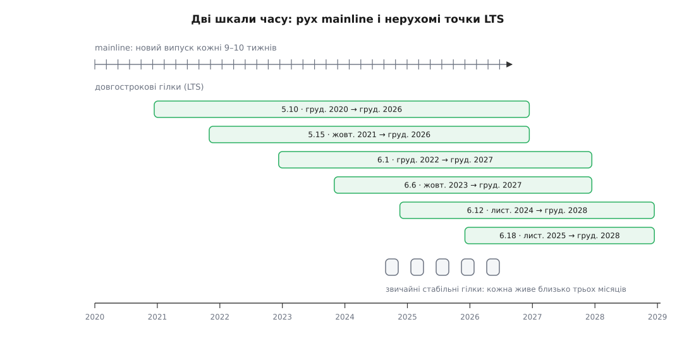

# Модель випусків ядра: вікно злиття, -rc і стабільні гілки

<preknowlist>
- [Ядро, дистрибутив і що між ними](topic:sys-unix/kernel-vs-distribution) — ядро розробляють і постачають окремо від решти системи, а дистрибутив бере його вже готовим і пакує під себе.
- [«Не ламати простір користувача»](topic:sys-unix/kernel-abi-stability) — обіцянка, що після оновлення ядра жодна вже зібрана програма не перестане працювати; поламане оновленням зветься регресією.
- [Монолітне ядро з модулями](topic:sys-unix/monolithic-with-modules) — увесь код ядра, разом із драйверами всього заліза, живе в одному дереві й випускається разом.
- [Гілки й історія в Git](topic:sys-ide/git-branching-and-history) — коміт, гілка, злиття, тег і двійковий пошук по історії.
- [Реліз-кандидат і заморозка](topic:sf-release/release-candidate-and-freeze) — навіщо перед випуском перестають додавати нове й лишають самі виправлення.
</preknowlist>

У випуску ядра 7.1, що вийшов 14 червня 2026 року, налічили 12 996 змін від 2 011 розробників — і 342 з них надіслали свою першу латку в ядро саме тоді. Цикл тривав дев'ять тижнів. Це двісті змін на день у дерево, яке того ж дня крутиться на мільярдах пристроїв — від телефона в кишені до біржового сервера, — і жодна з цих машин не має після оновлення виявити, що зникла мережа або не читається диск.

Дві вимоги тут не просто різні. Вони тягнуть у протилежні боки, і суперечність між ними не риторична, а механічна.

## Чому «швидко вливати» й «не ламати» не влазять в один потік

Проста на вигляд вимога — «вливати зміни швидко» — має неочевидний наслідок. Зміна в ядрі не вважається придатною, доки її не покрутили на справжньому залізі під справжнім навантаженням. Тестового стенда, який відтворив би все розмаїття машин світу, не існує й не може існувати: драйвер для рідкісного контролера перевірить лише той, у кого цей контролер є. Отже, щоб зміна довела свою придатність, її треба довезти до людей. А щоб довезти до людей, треба випустити.

І тут вмикається друга вимога. Випущене ядро — це те, що завантажується першим і тримає всю систему; зламане оновлення лишає не повідомлення про помилку, а чорний екран. [Правило «не ламати простір користувача»](topic:sys-unix/kernel-abi-stability) забороняє віддавати користувачам сире.

Виходить замкнене коло: сире не можна віддавати, а не віддавши — не дізнаєшся, чи воно сире. Те саме дерево має бути одночасно й майданчиком для експериментів, і продуктом.

Очевидний розв'язок — розділити дерево навпіл: в одній гілці бавимося, в іншій віддаємо людям. Так роблять у більшості проєктів, і саме так довго робили в Linux. Спробуймо простежити, чому це не спрацювало, — бо теперішня модель є прямою відповіддю на конкретні збитки того підходу, і без них вона виглядає довільним набором обрядів.

## Розділення за простором і чому воно розвалилося

До 2004 року номери ядра ділилися на парні й непарні. Парна друга цифра означала стабільну лінію для користувачів: 2.4 виходило, обростало виправленнями і не змінювалося по суті. Непарна означала лінію розробки: у 2.5 вливали все нове, ламали й переробляли, а користувачам радили туди не потикатися. Коли лінія розробки достатньо визрівала, її оголошували новою стабільною — 2.5 ставало 2.6, — і відкривали наступну непарну.

Схема виглядає бездоганно. На практиці вона дала три збитки, кожен з яких сам собою терпимий, а разом — ні.

**Злиття перетворилося на вибух.** Гілку 2.5 відкрили наприкінці 2001 року, а 2.6.0 вийшло в грудні 2003-го — понад два роки нарізного життя. За цей час обидві лінії розійшлися настільки, що звести їх докупи означало прийняти десятки тисяч змін одним рухом. Коли після такого злиття система починає падати, знайти винну зміну майже неможливо: двійковий пошук по історії дає раду з дрібними послідовними комітами, а не з двома роками, які приїхали разом.

**Стабільна лінія старіла швидше, ніж залізо.** Користувач 2.4 не міг увімкнути відеокарту, куплену торік: драйвер до неї існував — але в 2.5. Дистрибутиви розв'язали це так, як мусили: почали самотужки переносити тисячі латок із лінії розробки у свої збірки 2.4. Наслідок вийшов кумедний і сумний водночас — ядро, яке люди справді запускали, не збігалося з жодним випуском kernel.org. Кожен дистрибутив мав своє власне, і виправлення від однієї спільноти не годилося іншій.

**Кожну зміну доводилося супроводжувати двічі.** Виправлення вади треба було зробити для 2.5, а потім переписати під код 2.4, який відтоді вже поїхав в інший бік. Це не подвоєння роботи, а більше: чим далі розходилися гілки, тим дорожче коштувало перенесення.

19–20 липня 2004 року в Оттаві, перед щорічним симпозіумом, зібрався Kernel Summit — і присутні ухвалили рішення, якого майже ніхто не чекав: гілки 2.7 не буде. Розробка залишається в 2.6, випуски виходять кожні два-три місяці, а нове вливають туди ж, куди люди дивляться. [Як розробники дійшли до цього рішення, чим за нього заплатили і як за пів року по тому з'явилася перша стабільна гілка](topic:sys-unix/kernel-release-model/hist-two-branches.md) — історія варта окремої розповіді.

Суть переходу можна сформулювати одним рядком, і вона важливіша за всі подробиці: **розділяти почали не код, а час**. Гілка не може бути одночасно й сирою, й готовою. А одне дерево цілком може: спершу деякий час бути сирим, потім деякий час доводитися до ладу.

## Цикл: дві фази, у яких дозволено різне

Цикл ядра складається з двох фаз, і в кожну мить усі знають, у якій із них дерево перебуває.

**Вікно злиття** триває приблизно два тижні. Це єдиний час, коли в mainline — головну лінію, яку веде Лінус Торвальдс, — вливають нове: драйвери, підсистеми, зміни поведінки, усе, що накопичилося за попередній цикл. Темп у ці дні сягає близько тисячі латок на день.

**Фаза стабілізації** триває приблизно сім тижнів. Вікно зачиняється, виходить перший кандидат — `7.2-rc1`, — і відтоді до наступного випуску в дерево приймають **тільки виправлення того, що вже влито**. Нову функційність не приймають взагалі: вона чекає наступного вікна, скільки б не чекала.

Разом виходить дев'ять-десять тижнів, і одразу після випуску вікно відчиняється знову.


*Дві фази одного дерева: два тижні дозволено все, сім тижнів дозволено тільки лагодити. Випуск — це водночас і тег, і момент, коли відчиняється наступне вікно.*

Зверніть увагу, чим ця конструкція відрізняється від «гілки розробки». Гілка — це місце: щоб зміна перейшла з неї в продукт, її треба перенести. Фаза — це час: зміна нікуди не переїжджає, вона просто мусить встигнути. Ніякого злиття гілок наприкінці немає, а отже, немає й вибуху.

> 🔧 **Навіщо це.** Для того, хто пише код у ядро, з дискретності вікна випливає цілком конкретна дисципліна планування. Дата, коли ваша робота стане готовою, важить куди більше, ніж у проєкті з безперервним вливанням: там запізнення на день коштує день, тут — цілий цикл. Тому підсистемні супровідники закривають прийом у свої дерева не в день відкриття вікна, а за кілька тижнів до нього, і «встигнути» насправді означає «встигнути до тієї, ранішої межі».

**Латка готова 27 квітня 2026 року; вікно циклу 7.1 зачинилося 26-го.**

```
12.04.2026   вихід 7.0 — того ж дня відчиняється вікно 7.1
26.04.2026   вікно зачиняється, виходить 7.1-rc1
27.04.2026   латка готова — запізнилася на один день
14.06.2026   вихід 7.1 — латки в ньому немає
14.06.2026   відчиняється вікно 7.2 — латку нарешті вливають
~кінець серпня 2026   вихід 7.2 — латка доїхала до користувачів
```

Один день запізнення обернувся чотирма місяцями очікування. Це не вада моделі, а її ціна, свідомо сплачена: рівність фаз для всіх означає, що виняток не зробить ніхто й нікому.

## Що насправді відбувається у вікні злиття

Дванадцять тисяч змін за цикл — це більше, ніж може прочитати одна людина, навіть якщо не робити нічого іншого. Тому у вікні Лінус не читає латок. Він приймає **запити на злиття** від супровідників підсистем: кожен такий запит — це підписаний тег у чужому дереві плюс лист із описом, що там усередині.

Супровідник підсистеми, своєю чергою, теж не пише всього сам — він приймає латки від супровідників драйверів і від окремих розробників, читає їх, вимагає переробок і врешті ручається за результат своїм підписом. Ланцюжок `Signed-off-by:` під кожним комітом — це і є ця порука, записана в історію: кожен, хто пропустив зміну далі, назвався. [Як улаштовано рух змін від автора до головного дерева у відкритих проєктах](topic:sf-release/fork-and-upstream) — питання ширше за ядро, але саме ядро довело цю схему до масштабу, на якому вона взагалі помітна.

Отже, вікно — це не час, коли зміни розглядають. Це час, коли вже розглянуте **сполучають докупи**. Розгляд відбувся раніше й деінде.

І тут виникає наступне питання, без відповіді на яке два тижні виглядають нереально коротким строком. Дві підсистеми, кожна бездоганна сама собою, разом можуть не зібратися: одна прибрала функцію зі спільного заголовка, друга саме її й кличе. Такі поламки виявляються не в рецензії, а тільки при складанні. Якщо шукати їх усередині вікна, вікно перетвориться на налагоджування і два тижні розтягнуться на два місяці.

## linux-next: інтеграцію роблять до вікна

Розв'язок такий самий за духом, як і сама модель: перенести роботу в час, коли на неї є час.

У лютому 2008 року Стівен Ротвелл (Stephen Rothwell) — за задумом, який висловив Ендрю Мортон, — почав вести дерево `linux-next`. Щодня воно збирається наново: беруться `next`-гілки всіх підсистем, тобто рівно те, що їхні супровідники планують надіслати в наступне вікно, і зводяться в одне дерево. Конфлікт, який інакше сплив би у вікні, спливає в щоденному звіті — і його лагодять за місяці до того, як він стане проблемою.

Звідси й правило, яке тримає вікно коротким: **у вікні не приймають того, чого не було в linux-next**. Правило не технічне — його не перевіряє жодна програма; воно тримається на тому, що Лінус відмовляє в злитті з формулюванням «цього не було в next». Виняток він може зробити й сам, але саме як виняток, з поясненням.

Ротвелл вів це дерево вісімнадцять років і передав його Маркові Брауну (Mark Brown) 16 січня 2026 року. Робота ця, попри непомітність, і є причиною, чому релізи ядра виходять рівно кожні дев'ять-десять тижнів, а не «коли зберуться».


*Кожна стрілка — це чиясь порука за зміну. У зворотний бік, від стабільної гілки до mainline, стрілок немає навмисно: виправлення завжди йде спершу вгору.*

## Фаза -rc: як вирішують, що вже досить

Після зачинення вікна виходить `-rc1` (від *release candidate* — кандидат у випуски), а далі щотижня, зазвичай у неділю, — `-rc2`, `-rc3` і так далі. Кожен кандидат — це справжній тег у дереві, який можна зібрати й запустити; саме на них живуть ті, хто ловить регресії заздалегідь.

Приймають у цій фазі тільки виправлення, і що ближче до кінця, то суворіше. На `-rc2` ще пройде латка, яка лагодить давню ваду в драйвері; на `-rc7` пройде хіба що виправлення регресії, тобто того, що зламалося саме в цьому циклі.

А от коли саме випускати — не визначено календарем. Орієнтир простий: кількість змін у кожному наступному кандидаті має спадати. Якщо `-rc5` виявився більшим за `-rc4`, це означає, що цикл ще не зійшовся, і буде `-rc8`. Типова довжина — сім кандидатів; вісім трапляється регулярно, коли на цикл припадають свята або спливла велика регресія.

Тут варто назвати межу чесно, бо її часто розуміють неправильно. Випуск ядра **не означає «вад немає»**. Він означає рівно одне: серед відомих на цю мить регресій не лишилося невиправлених. Вади, про які ніхто ще не знає, лишаються всередині — і мусять лишатися, бо єдиний спосіб їх знайти — віддати ядро людям. Саме тому модель не може закінчуватися випуском: вона мусить мати продовження, у якому знайдене згодом виправляють для тих, хто вже поставив.

## Випуск як точка розгалуження

У день випуску відбуваються дві речі одночасно, і їхнє поєднання й породжує решту конструкції.

Перша: коміт позначають тегом `v7.1`, і цей тег заморожено назавжди. Друга: того ж дня відчиняється вікно циклу 7.2, і в mainline починають вливати нове.

Тепер уявіть користувача, який поставив 7.1 і за три тижні наштовхнувся на ваду. Виправлення для неї, звісно, зроблять — у mainline. Але mainline на той момент уже несе дві тисячі свіжих змін наступного циклу, і взяти звідти все заради одного виправлення означає взяти й весь непройдений ризик. Користувачеві потрібне протилежне: та сама 7.1, у якій змінилося рівно те, що було зламане.

Ось для чого існує **стабільна гілка**. Від тега `v7.1` відгалужується лінія, у якій ніколи не з'являється нічого нового: `7.1.1`, `7.1.2`, `7.1.3` — і кожен наступний номер означає лише «те саме плюс кілька виправлень». Третя цифра рахує випуски цієї лінії й більше нічого не значить.

## Правила стабільної гілки

Гілка, у яку можна класти будь-що, за пів року перестає бути стабільною. Тому правила прийому в неї записані й вузькі.

**Виправлення вже мусить бути в mainline.** Це головне правило, і його причина варта того, щоб її розгорнути. Припустімо, ми поклали виправлення тільки в `7.1.9`, оминувши головне дерево. Користувач, який згодом перейде з `7.1.9` на 7.2, **втратить** його — з його погляду оновлення зламає систему. Тобто порушення порядку «спершу вгору» породжує регресію, а регресія в ядрі неприпустима. Тому напрямок руху завжди один: у mainline, а звідти вниз у стабільні гілки.

**Виправлення має бути дрібним і безсумнівним.** Формальна межа — сто рядків разом із контекстом. Латка мусить лагодити справжню ваду: падіння, зависання, псування даних, вразливість або незручність із конкретним залізом. Не теоретичну проблему, не стиль, не переписування «на краще».

**Позначає латку сам автор.** Рядок `Cc: stable@vger.kernel.org` у mainline-латці означає «це треба й у стабільні»; після злиття команда стабільних гілок забирає її автоматично. Рядок `Fixes:` із хешем зламаного коміту каже, з якого моменту вада існує, — а отже, у які саме гілки виправлення потрібне.

**Частину виправлень добирає машина.** Автори позначають далеко не все, тому Саша Левін запустив AUTOSEL — відбір кандидатів серед комітів mainline, які на позначку схожі. Це евристика, і вона помиляється в обидва боки; тому дібране розсилають на кілька днів супровідникам, і будь-хто може сказати «не беріть це». Механізм чесно недосконалий, але без нього значна частина виправлень просто не доїжджала б.

Виходять стабільні випуски приблизно щотижня. Проміжок між розсилкою добірки на рецензію й тегом — близько двох діб: це і є весь час на заперечення.

## Скільки живе гілка й навіщо LTS

Звичайна стабільна гілка живе недовго: щойно виходить наступний mainline і його власна стабільна лінія стає на ноги, попередню оголошують закритою. Причина арифметична — кожна жива гілка вимагає, щоб хтось переносив у неї виправлення й перевіряв, що вони там складаються; тримати їх десяток одночасно нікому не під силу.

Але є ті, кому «оновлюйтеся раз на два місяці» не годиться взагалі: виробник маршрутизатора, автомобільна платформа, банківський сервер. Їм потрібна точка, яка не рухатиметься роками. Тому один випуск на рік оголошують **довгостроковим** (LTS, *long-term support*), і його гілку ведуть значно довше за решту.

Станом на серпень 2026 року живими довгостроковими гілками є 5.10 і 5.15 (обидві до грудня 2026-го), 6.1 і 6.6 (до грудня 2027-го), 6.12 і 6.18 (до грудня 2028-го). Дати ці не є обіцянкою на віки: оголошений строк неодноразово і скорочували, і продовжували — залежно від того, чи знаходяться люди й компанії, готові платити за супровід. Тому в довідці kernel.org коло дат стоїть слово *projected* — «очікуваний», і читати його варто буквально.



*Mainline — це рух; стабільні й довгострокові гілки — нерухомі точки, від яких відходять довгі лінії дрібних виправлень. Довжина смуги — це не якість коду, а наявність людей, готових його супроводжувати.*

Вибір «яку версію взяти» через це стає питанням не свіжості, а того, хто носитиме виправлення. Береш mainline — сам стежиш за циклом кожні дев'ять тижнів. Береш LTS — платиш тим, що нове залізо запрацює нескоро, і виграєш роками незмінного інтерфейсу. Це той самий вибір між каналами постачання, [що й у будь-якому іншому проєкті з кількома лініями підтримки](topic:sf-release/release-channels), просто на найбільшому з можливих масштабів.

## Номер версії, який навмисно нічого не означає

Рядок `7.1.3` розбирається так:

```
7        головний номер: міняється, коли другий стає незручно великим
7.1      випуск mainline: тег v7.1, заморожений назавжди
7.1.3    третій випуск стабільної гілки, що росте від 7.1
7.2-rc4  четвертий кандидат циклу 7.2 (мітки -rc немає у стабільних)
```

Головний номер підвищують не тоді, коли щось радикально змінилося, а тоді, коли друга цифра перестає вкладатися в голові. У травні 2011-го 2.6.39 стало 3.0 — заразом припала двадцята річниця Linux. У 2015-му 3.19 стало 4.0, у 2019-му 4.20 стало 5.0, у 2022-му 5.19 стало 6.0. Після 6.19 Лінус оголосив, що наступне ядро зветься 7.0, і пояснення дав те саме, що й попередніми разами: великі числа його плутають, пальців на руках і ногах уже не вистачає. Випуск 7.0 вийшов 12 квітня 2026 року.

Це не жарт і не недбалість, а прямий наслідок правила про сумісність. У [семантичному версіюванні](topic:sf-release/semantic-versioning) головна цифра означає «ми зламали сумісність, перевірте свій код». Ядро сумісність не ламає ніколи — отже, за цією логікою його головна цифра мала б навіки застигнути на одиниці, а вся інформація перекочувала б у другу. Номер, який не може нести свого змісту, чесніше зробити просто лічильником, ніж удавати, що він щось обіцяє.

Практичний висновок звідси такий: **більший номер означає «пізніше в часі», і більше нічого**. Ні «більше можливостей, які вам потрібні», ні «стабільніше», ні «безпечніше саме для вас».

## Що з усього цього стоїть за вашим `uname -r`

Команда `uname -r` на типовій машині показує щось на кшталт `6.8.0-52-generic`, і спокуса прочитати це як «у мене ядро 6.8.0» дуже велика. Насправді від випуску 6.8.0 з kernel.org там лишилася хіба основа: дистрибутиви беруть базовий випуск і докладають сотні власних змін — виправлення зі свіжіших гілок, драйвери під сертифіковане залізо, власні налаштування. Що саме всередині, каже [журнал змін пакунка ядра вашого дистрибутива, а не номер версії](topic:sys-unix/kernel-vs-distribution).

Із цим пов'язана друга, дедалі гучніша обставина. У лютому 2024 року проєкт ядра став власним CNA — організацією, яка сама видає номери CVE на свої вразливості. Логіка та сама, що й у решті моделі: раз виправлення однаково потрапляє у стабільну гілку, номер видають на нього, а не на розпливчастий опис проблеми. Наслідок вийшов приголомшливий за обсягом — близько півсотні CVE на тиждень, і 2025 року ядро стало найбільшим у світі видавцем цих номерів. Гнатися за окремими номерами при такому потоці безглуздо; [що це означає для того, хто мусить відповідати за безпеку системи](topic:sys-unix/kernel-cve-and-security-fixes) — окрема тема, але головний висновок передбачений самою моделлю: розумна політика тут одна — бути на свіжому випуску своєї стабільної гілки, а не вибирати з неї виправлення поштучно.

Коли ж вам потрібне конкретне виправлення й ви хочете знати, чи є воно у вас, питання зводиться до кількох команд над деревом ядра: знайти коміт, подивитися, у які теги він потрапив, і звірити зі своєю збіркою. [Як пройти цей шлях від опису вади до відповіді «у мене це вже полагоджено»](topic:sys-unix/kernel-release-model/proj-where-is-my-fix.md) — вправа, яка робить усю модель відчутною. Точні ж форми номерів, тегів і службових рядків у комітах зібрано окремо: [анатомія версії, теги релізів і рядки `Fixes:`/`Cc: stable`](topic:sys-unix/kernel-release-model/api-release-metadata.md).

## Чим за це заплачено

Модель, у якій немає довгих гілок, забирає в розробників одну звичну зручність — можливість робити велику річ довго й окремо.

Переписати підсистему за дев'ять тижнів здебільшого неможливо. Оскільки притулку у вигляді власної гілки на два роки більше немає, велику роботу мусять різати на скибки, кожна з яких сама собою збирається, працює й нічого не ламає. Наполовину переписана підсистема має жити в дереві поруч зі старою — під окремим параметром збірки або [під прапорцем, що вмикає нове лише тим, хто його попросив](topic:sf-release/feature-flags), — і так місяцями, доки скибок не набереться на цілу заміну. Це помітно дорожче, ніж написати все одразу й влити одним рухом.

Ціна ця, однак, розподілена не випадково. Її платять ті кілька десятків людей, які беруться за великі переробки, а виграють від неї всі, хто ядро просто запускає: історія лишається дрібнозернистою, тож винну зміну знаходять двійковим пошуком за десяток перезавантажень, а не тижнем розслідування. Модель випусків ядра — це не розклад, а спосіб зробити обіцянку «ми не ламаємо ваш простір користувача» посильною: вона перетворює нездійсненну вимогу «ніколи не помилятися» на здійсненну — «помилятися дрібно, помітно й у передбачуваний момент».
