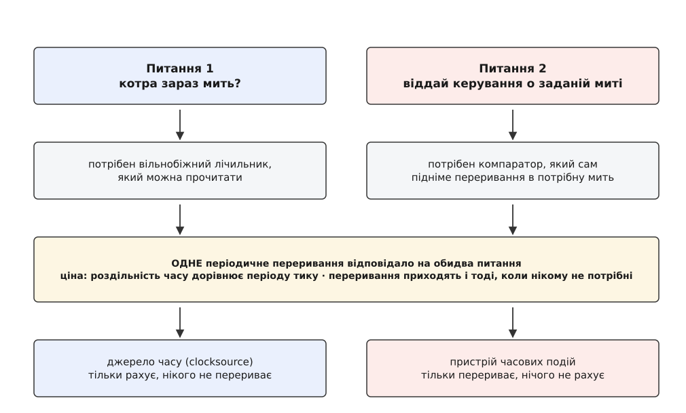
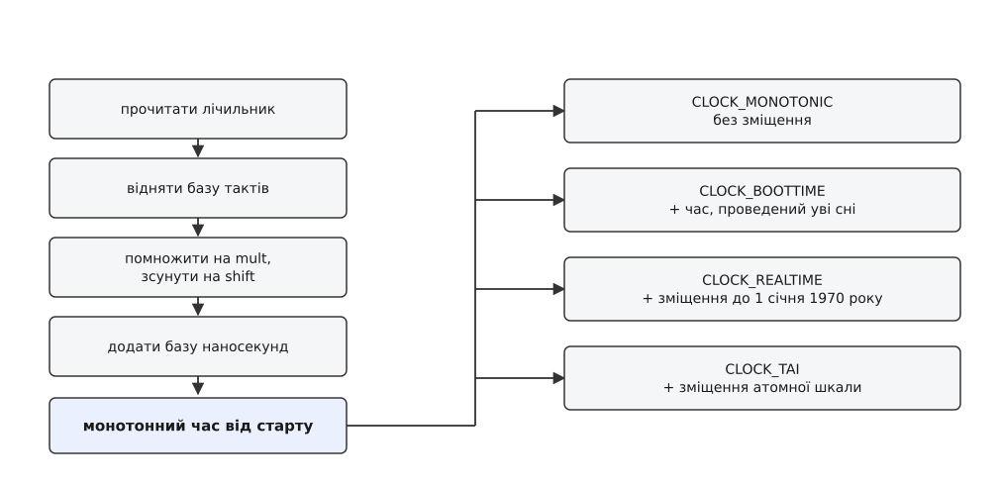
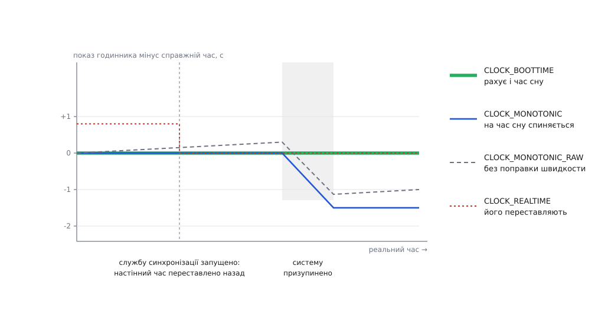
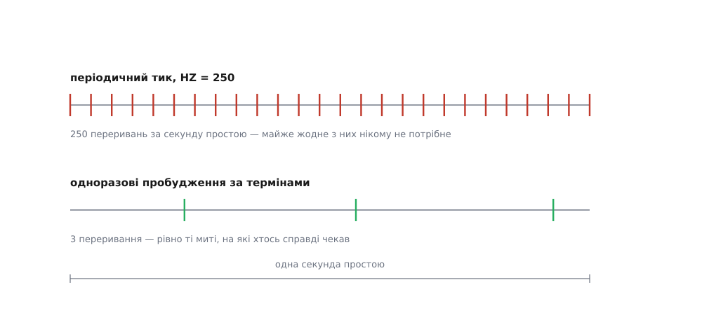

# Час у ядрі: тики, монотонний годинник і джерела часу

<preknowlist>
- [Ядро й простір користувача](topic:sys-unix/kernel-and-userspace) — код ядра і код програм виконуються в різних режимах процесора; програма не має прямого доступу до апаратури.
- [Системний виклик](topic:sys-unix/syscall-mechanics) — механізм, яким програма просить ядро зробити те, чого не може сама, і чому кожен такий перехід має відчутну ціну.
- [Переривання й нижні половини](topic:sys-unix/interrupts-bottom-halves) — пристрій може урвати виконання будь-якого коду й змусити процесор виконати обробник ядра.
- [Кварцовий резонатор](topic:hw-components/quartz-resonator) — частота кварцу стабільна лише в межах кількох десятків мільйонних часток і залежить від температури та віку.
</preknowlist>

Програма міряє, скільки тривала операція: питає час до, питає час після, віднімає — і отримує від'ємну тривалість. У коді помилки немає: обидва виклики правильні, віднімання правильне. Помилка в самому питанні. Програма спитала «котра зараз година», а хотіла знати «скільки минуло» — і між двома питаннями служба синхронізації перевела годинник на півсекунди назад.

Годинник, який можна перевести, і годинник, за яким міряють тривалість, — це різні годинники. У Linux вони справді різні, і їх не два, а більше півдесятка. Ця множина не примха: кожен із них існує тому, що якась із гарантій, потрібних одному споживачеві, несумісна з гарантією, потрібною іншому. Щоб побачити, звідки береться кожна з них, доводиться почати з того, що взагалі є в машині з приводу часу. А там немає нічого схожого на годинник.

## Що насправді дає залізо

У комп'ютері є генератор — кварцовий резонатор, який коливається з приблизно відомою частотою, — і є лічильники, які рахують ці коливання. Усе. З цього треба зробити і календарну дату, і мілісекундний таймер.

Із такої скупої основи одразу випливають два обмеження. По-перше, лічильник нічого не знає про дату: він каже лише «від моменту, коли мене запустили, минуло N імпульсів». По-друге, його швидкість відома тільки приблизно. Кварц у звичайній машині відхиляється від номіналу на десятки мільйонних часток, і це відхилення повзе з температурою: [точність у ppm](topic:hw-components/frequency-accuracy-ppm) на рівні 50·10⁻⁶ означає, що за добу годинник набирає до чотирьох секунд похибки. Тобто лічильник — не еталон, а показ, який доводиться постійно виправляти.

Тепер придивімося до того, чого від часу взагалі хочуть. Хочуть двох різних речей.

Перша: «котра зараз мить». На це відповідає читання — хтось виконується, звертається до лічильника й дивиться на число.

Друга: «віддай мені керування, коли настане мить X». На це читання не відповідає в принципі. Якщо процесор простоює, читати нікому; якщо він зайнятий чужим кодом, ніхто не перевірятиме лічильник за нас. Відповісти на друге питання може лише пристрій, який сам, без чиєїсь участі, підніме переривання в потрібну мить.

Це справді дві різні апаратні здатності: **вільнобіжний лічильник**, який можна прочитати, і **компаратор**, який порівнює лічильник із записаним у нього числом і в момент збігу перериває процесор. Деякі мікросхеми дають лише одне з двох, деякі — обидва.



*Читанням не можна нікого розбудити, а перериванням незручно міряти — тому одна апаратна ланка на дві задачі завжди була компромісом.*

## Тик: як з переривання зробили годинник

Перші машини, на яких виріс Unix, багатим вибором не тішили. PDP-11 мав годинник лінії живлення — плату KW11-L, яка перетворювала змінну напругу мережі на переривання й давала рівно те, що дає мережа: 60 імпульсів на секунду в Америці, 50 у Європі. Читаного лічильника не було. Була тільки друга здатність, та й та в найпростішій формі — переривання через рівні проміжки.

І з неї зробили годинник. Обробник переривання збільшував змінну на одиницю; коли змінна доходила до числа імпульсів у секунді, підвищувався лічильник секунд. У шостій редакції Unix ця змінна називалася `lbolt` — за поширеною версією, від *lightning bolt*, «блискавка». Годинник у системі — це змінна в пам'яті, яку хтось регулярно збільшує.

Тут ховається друга, не менш важлива роль того самого переривання. Момент тику — це момент, коли ядро **гарантовано отримує керування**, хоч би що виконував процесор. А отже, це природне місце для всієї періодичної роботи: перевірити, чи не вичерпав поточний процес свою частку процесора, чи не збіг чийсь таймаут, дописати статистику. Тик став одночасно годинником і серцебиттям ядра.

Linux успадкував цю конструкцію разом із назвою константи: лічильник тиків дістав власне ім'я `jiffies`, а частота тику так і лишилася `HZ` — задається при складанні ядра й на різних платформах і в різних конфігураціях становить 100, 250, 300 або 1000.

З того, що час — це лічена змінна, тягнеться низка наслідків, які видно й досі.

Роздільність усього, що пов'язане з часом, дорівнює одному тику. При `HZ=250` тик триває 4 мс, і сон на 0.5 мс просто не існує: він округлиться до найближчого тику. Точність вимірювання тривалости — та сама.

Лічильник переповнюється. На 32-бітній машині `jiffies` — 32-бітове число, і при `HZ=1000` воно робить повний оберт за 2³²/1000 секунд, тобто за 49.7 доби; при `HZ=100` — за 497 діб. Наївне порівняння `if (jiffies > deadline)` після переповнення дає протилежну відповідь, і машина, що безвідмовно пропрацювала півтора року, раптово вішає з'єднання. Ядро бореться з цим двома способами. Перший — порівнювати треба макросом `time_after(a, b)`, який рахує **знакову різницю**, а не порівнює числа: різниця залишається правильною й через переповнення, аби між подіями минуло менше половини оберту. Другий спосіб гарний своєю злістю: `jiffies` стартує не з нуля, а зі значення `-300*HZ`, тобто за п'ять хвилин до переповнення. Помилка, яка інакше чекала б своєї години рік і чотири місяці, спрацьовує на п'ятій хвилині першого ж запуску.

> 🔧 **Навіщо це.** Той самий прийом потрібен щоразу, коли ви міряєте час лічильником обмеженої розрядности — у прошивці мікроконтролера, у драйвері, у власному профайлері. Зберігати треба не «час події», а різницю, і рахувати її в знаковому типі тієї самої ширини. Тоді переповнення лічильника просто перестає бути подією: воно скорочується у відніманні.

## Чому тик перестав бути годинником

Конструкція «одне періодичне переривання на все» протрималася десятиліття, а потім її почали давити з двох боків одразу.

З одного боку — точність. Звук, мережа, вимірювання, керування — усе це потребує витримок помітно коротших за тик. Очевидний хід, підняти `HZ` до 1000, дає мілісекунду й одночасно вдесятеро більше переривань, кожне з яких витісняє кеш і забирає такти. А мілісекунда для багатьох задач усе одно завелика.

З другого боку — живлення. Ноутбук, який нічого не робить, отримує 250 переривань на секунду. Кожне з них витягає процесор із глибокого стану сну, де він майже не споживає струму, змушує розігнати такти й повернутися назад. Виходило, що найбільшим споживачем енергії в системі, яка нічого не робить, є механізм відліку того, що нічого не робиться.

Обидва тиски вказують на одне: дві роботи, які історично склеїв один пристрій, треба розділити. І Linux розділив їх на дві незалежні абстракції.

**Джерело часу** (англ. *clocksource*) — це читаний вільнобіжний лічильник із відомою частотою. Він відповідає лише на питання «скільки минуло». Він нічого не перериває.

**Пристрій часових подій** (англ. *clock event device*) — це програмований компаратор. Він відповідає лише на питання «віддай керування о такій-то миті». Він нічого не рахує.

Щойно роботи розділено, періодичний тик перестає бути необхідністю й стає **одним із способів** користуватися пристроєм подій: запрограмувати його на «зараз плюс 4 мс», і так щоразу. А роздільність часу перестає залежати від `HZ`, бо тепер вона береться з лічильника й вимірюється наносекундами.

Розділення робили поетапно й довго. Підсистема таймерів високої роздільности, `hrtimers`, яку створили Томас Ґляйкснер та Інґо Молнар, увійшла в ядро 2.6.16 у 2006 році; узагальнений шар пристроїв часових подій разом із безтиковим простоєм на x86 — у 2.6.21 навесні 2007-го. [Як саме тик з'явився, розрісся до суперечок про правильне значення HZ і зрештою став необов'язковим](topic:sys-unix/kernel-timekeeping/hist-tick-to-tickless.md) — окрема історія, у якій кожен наступний крок народжувався з виміряної ціни попереднього.

## Джерело часу: вимоги до лічильника

Не всякий лічильник годиться на роль джерела часу. Вимоги випливають із того, як його збираються вживати.

Він не має йти назад. Переповнення дозволене — але ядро мусить знати розрядність лічильника, щоб правильно віднімати через оберт; це та сама знакова різниця, тільки з явною маскою.

Його частота має бути відома й не мінятися на ходу. Лічильник, який пришвидшується разом із процесором, годинником бути не може.

Він має йти тоді, коли процесор спить. Інакше після кожного простою в часі з'явиться яма.

І його має бути дешево читати. Ось тут ховається головна практична різниця. HPET живе на шині й відображений у пам'ять, таймер ACPI — узагалі за портом вводу-виводу; одне таке читання коштує сотні наносекунд, а то й мікросекунду. Лічильник усередині процесора — TSC на x86, `CNTVCT` в архітектурних таймерах ARM — читається однією інструкцією за десятки тактів. Різниця між цими двома варіантами — це різниця між «час можна питати мільйон разів на секунду» і «не можна».

Історія TSC добре показує, як довго лічильник виборював право бути годинником. Спершу він порушував майже всі вимоги: рахував такти ядра, тому змінював швидкість разом із частотою процесора; зупинявся в глибокому сні; на різних ядрах мав різні значення; після пробудження з призупинення починав із нуля. Ядро йому не довіряло й брало повільний HPET. Потім у процесорах з'явилися властивості `constant_tsc` (лічильник іде зі сталою частотою незалежно від того, як розігнано ядро) і `nonstop_tsc` (не спиняється в станах сну) — і TSC став типовим джерелом часу на x86.

Довіра при цьому лишилася умовною. Ядро тримає **сторожа**: періодично звіряє TSC із повільним, але надійним джерелом, і якщо розбіжність виходить за допуск, друкує в журнал `clocksource: Marking TSC unstable` і перемикається на резервне джерело. Побачити картину можна прямо через [псевдофайлову систему](topic:sys-unix/sysfs-device-model):

```sh
$ cat /sys/devices/system/clocksource/clocksource0/available_clocksource
tsc hpet acpi_pm
$ cat /sys/devices/system/clocksource/clocksource0/current_clocksource
tsc
```

Розрядність джерела має ще один, менш очевидний наслідок. Порахуймо, як часто ядро **зобов'язане** зазирати в лічильник, щоб не проґавити оберт.

**Архітектурний таймер на 24 МГц із 32-бітним лічильником: гранична пауза між читаннями**

```
період одного імпульсу = 1 / 24·10⁶ Гц      = 41.67 нс
повний оберт лічильника = 2³² · 41.67 нс
                        = 4294967296 / 24·10⁶ с
                        = 178.96 с
```

Отже, система не має права провести без жодного погляду на годинник навіть три хвилини — інакше вона не відрізнить «минуло 5 секунд» від «минуло 3 хвилини й 5 секунд». Для 64-бітного TSC на 3 ГГц та сама межа становить 2⁶⁴/(3·10⁹) секунд, тобто близько 195 років, і практично не заважає. Ця нехитра арифметика ще спливе, коли йтиметься про те, чи може ядро замовкнути надовго.

## Від тактів до наносекунд

Лічильник рахує імпульси, а програми хочуть наносекунди. Перетворення напрошується очевидне: поділити кількість імпульсів на частоту. Але ділення — найдорожча арифметична операція процесора, а це перетворення виконується в кожному запиті часу, у планувальнику, у кожному записі трасування. Тому ядро ділення не робить взагалі.

Замість цього для кожного джерела часу заздалегідь обчислюють пару цілих чисел, і перетворення зводиться до множення та зсуву:

```
нс = (такти · mult) >> shift

де mult = (10⁹ · 2^shift) / частота
```

Ідея та сама, що в арифметиці з фіксованою комою: замість дробового коефіцієнта тримаємо його, помножений на 2^shift, а зайві розряди відрізаємо зсувом. Що більший `shift`, то точніший коефіцієнт — і то швидше добуток переповнює 64 біти. Через це вибір `shift` прямо пов'язаний із тим, як довго дозволено накопичувати такти між оновленнями. [Як обирають цю пару, скільки коштує округлення і звідки береться межа накопичення](topic:sys-unix/kernel-timekeeping/math-cycles-to-nanoseconds.md) — окрема арифметика з конкретними числами.

Важливіше за саму формулу те, **де** в ній сидить корекція. Служба синхронізації не переставляє час — вона каже ядру, що годинник поспішає, скажімо, на 12 мільйонних часток. Ядро реагує тим, що трохи зменшує `mult`. Той самий лічильник, та сама швидкість імпульсів — але кожен імпульс тепер оцінюється трохи дешевше, і час іде повільніше. Уся механіка плавного виправляння годинника — це редагування одного цілого числа.

Звідси, до речі, походить розрізнення двох монотонних годинників, до яких ще дійде черга: один рахується з виправленим `mult`, другий — із номінальним.

## Хто тримає поточний час

Читати лічильник із нуля щоразу не вийшло б: 32-бітове джерело давно б обернулося, а множник, який змінюється від корекцій, зробив би результат неоднозначним. Тому ядро тримає структуру-**хранитель часу**: у ній лежить час на момент останнього оновлення, значення лічильника на той самий момент, а також чинні `mult` і `shift`.

Прочитати час означає: узяти лічильник зараз, відняти збережене значення, перетворити різницю на наносекунди, додати до збереженого часу. Оновити — означає згорнути накопичену різницю в базу й застосувати те, що встигла попросити синхронізація. Оновлення відбувається на тику, а в безтиковому режимі — на найближчій події.



*Усі системні годинники — це одна база плюс різні сталі зміщення; тому вони не можуть розійтися між собою випадково.*

Читати цю структуру доводиться з будь-якого ядра процесора, одночасно, і з контекстів, де брати блокування не можна взагалі: з обробника переривання, з трасувальника, з немаскованого переривання. Блокування там означало б негайне зависання — трасувальник, який хоче поставити мітку часу, заблокував би сам себе.

Тому доступ побудовано без блокування читача, на **лічильнику версії**: той, хто пише, перед правкою робить лічильник непарним, після правки — парним і на одиницю більшим. Той, хто читає, знімає лічильник, читає дані, знімає лічильник ще раз — і якщо значення змінилося або було непарним, просто повторює спробу. Читач ніколи нікого не затримує й ніколи не засинає, а розплачується лише випадковим повтором. Цей прийом [загальновживаний і поза ядром](topic:sf-tasks/seqlock): він годиться скрізь, де читачів багато, писар один, а копіювати дані дешево.

## Чому годинників кілька

Тепер видно основу, і на ній кожен із системних годинників виводиться з конкретної потреби, а не з'являється зі списку.

З лічильника природно виходить **час від старту системи**, який ніколи не йде назад і ніколи не стрибає. Це `CLOCK_MONOTONIC`. Саме він потрібен, щоб міряти тривалість. Дві його властивості варто назвати чесно: він **виправляється** синхронізацією за швидкістю (той самий `mult`) і він **не йде, поки система призупинена** — з погляду цього годинника ноутбук із закритою кришкою просто не існував.

Друга властивість корисна не завжди. Таймаут сесії, будильник, перевірка «чи не пора оновити ключі» мають ураховувати час, проведений у [призупиненні](topic:sf-os/suspend-and-resume). Для цього є `CLOCK_BOOTTIME` (з'явився у 2.6.39): усе те саме, але з доданим часом сну.

Іноді потрібне протилежне — читати лічильник таким, яким він є, без жодних поправок синхронізації. Так міряють поведінку самого генератора або уникають того, щоб зовнішня служба впливала на вимір. Це `CLOCK_MONOTONIC_RAW` (2.6.28), який рахується з номінальним множником.

Людині ж потрібна дата, а дата — це не «скільки минуло», а «яка зараз мить за спільною шкалою». Такий годинник мусить бути **встановлюваним**: інакше його нізвідки взяти. А з того, що його можна встановити, автоматично випливає, що він може стрибнути й піти назад. Це `CLOCK_REALTIME`, і саме його не можна вживати для вимірювання тривалости.

Календарна шкала має ще одну ваду: у ній трапляються [високосні секунди](topic:hw-sensing/leap-second), через які одна й та сама позначка часу може статися двічі. Для тих, кому потрібна безперервна шкала, прив'язана до дати, є `CLOCK_TAI` (3.10) — той самий настінний час плюс стале зміщення від атомної шкали.

Нарешті, є споживачі, яким наносекунди не потрібні, а дешевизна потрібна дуже: запис у журнал, позначка часу файлу, груба перевірка «чи не застаріло». Для них є `CLOCK_REALTIME_COARSE` і `CLOCK_MONOTONIC_COARSE` (2.6.32), які **не читають лічильник узагалі** — віддають те, що записав хранитель часу на останньому оновленні. Роздільність — один тик, ціна — кілька наносекунд.



*Одна й та сама подія має різну позначку в різних годинниках — тому мішати їх в одному обчисленні не можна.*

Практичне правило з цього виходить коротке. Тривалість — тільки `CLOCK_MONOTONIC` (або `CLOCK_BOOTTIME`, якщо сон має рахуватися). Позначка часу, яку побачить людина, інша машина чи файлова система, — тільки `CLOCK_REALTIME`. Різниця двох значень різних годинників не означає нічого.

:::tabs
```c
#include <time.h>
#include <stdint.h>
#include <stdio.h>

void do_work(void);

/* Тривалість у наносекундах між двома знятими моментами. */
static int64_t elapsed_ns(const struct timespec *a, const struct timespec *b)
{
    return (int64_t)(b->tv_sec - a->tv_sec) * 1000000000LL
         + (int64_t)(b->tv_nsec - a->tv_nsec);
}

void measure(void)
{
    struct timespec t0, t1;

    clock_gettime(CLOCK_MONOTONIC, &t0);   /* не REALTIME */
    do_work();
    clock_gettime(CLOCK_MONOTONIC, &t1);

    printf("%lld нс\n", (long long)elapsed_ns(&t0, &t1));
}
```
```cpp
#include <chrono>
#include <print>

void do_work();

void measure()
{
    // steady_clock у libstdc++ — це саме CLOCK_MONOTONIC;
    // system_clock — CLOCK_REALTIME, і для тривалостей не годиться.
    const auto t0 = std::chrono::steady_clock::now();
    do_work();
    const auto t1 = std::chrono::steady_clock::now();

    std::println("{}", std::chrono::duration_cast<std::chrono::nanoseconds>(t1 - t0));
}
```
:::

> 🔧 **Навіщо це.** Плутанина цих двох годинників — одна з найчастіших причин «неможливих» звітів у продакшні: від'ємні тривалості в метриках, таймаут, що спрацьовує миттєво, кеш, який протухає на годину вперед. Усі вони з'являються разом і саме тієї хвилини, коли служба синхронізації вперше виправила час на щойно завантаженій машині.

## Звідки береться настінний час

На старті ядро має лічильник, який щойно почав із нуля, і жодного уявлення про дату. Дату треба звідкись узяти.

Її дає окрема мікросхема — годинник реального часу, який живиться від батарейки й має власний [годинниковий кварц на 32768 Гц](topic:hw-components/watch-crystal-rtc). Ядро читає його один раз під час завантаження й ставить `CLOCK_REALTIME`. Точність такого джерела скромна: роздільність — секунда, хід — десятки секунд за місяць. Далі час уточнює вже служба в просторі користувача, звіряючись [мережевим протоколом](topic:com-protocol/ntp-sync) із зовнішніми серверами, а ті, через ланцюжок, — з [атомними годинниками](topic:hw-sensing/atomic-clock).

Саме значення настінного часу в Unix — це кількість секунд, що минули від опівночі 1 січня 1970 року за UTC. Число просте й тим гарне: жодних часових поясів, жодного календаря всередині ядра, перетворення на дату — робота бібліотеки. Ціна простоти теж відома: у знаковому 32-бітному типі це число вичерпається 19 січня 2038 року. Ядро отримало системні виклики з 64-бітним часом для всіх 32-бітних архітектур у версії 5.1 (2019); [що саме довелося міняти й чому цього мало](topic:sys-unix/time-representation-y2038) — тема сама по собі.

## Дві форми виправляння: стрибок і підтягування

Служба синхронізації бачить, що системний час розходиться з еталонним. У неї є рівно два способи це виправити, і різниця між ними — це різниця між зламаною системою і працездатною.

**Стрибок** — виклик `clock_settime`, який миттєво переставляє `CLOCK_REALTIME` на правильне значення. Просто, точно й руйнівно: усе, що на цю мить міряло тривалість настінним годинником, отримає нісенітницю, а якщо стрибок був назад — то й від'ємну.

**Підтягування** — виклик `adjtimex`, який не чіпає поточного значення, а міняє **швидкість** ходу: годинник іде трохи швидше або трохи повільніше, доки розбіжність не всмокчеться. Технічно це вже описане редагування `mult`. Час при цьому не стрибає і не йде назад — він лише на частку відсотка «не такий», як номінальний.

За підтягування доводиться платити терпінням. Ядро не дає міняти швидкість більш ніж на 500 мільйонних часток.

**Скільки триває вбирання однієї секунди розбіжности**

```
гранична поправка = 500 ppm = 500·10⁻⁶ с за секунду
треба вбрати      = 1 с
час               = 1 / 500·10⁻⁶ = 2000 с ≈ 33 хв
```

Тому служби синхронізації поводяться однаково: велику розбіжність, яка накопичилася за час, поки машина була вимкнена, вони виправляють стрибком одразу після старту, а далі, у сталому режимі, тільки підтягують. Межу між «великою» і «малою» кожна кладе своєю: класичний `ntpd` переходить до стрибка, коли розбіжність перевищує 128 мс.

Ще одне джерело руху назад у настінного годинника — високосна секунда, яку зрідка вставляють у UTC, щоб атомна шкала не втекла від обертання Землі. Linux реалізує вставку тим, що наприкінці доби відсуває `CLOCK_REALTIME` на секунду назад, тож `23:59:59` трапляється двічі. Тобто в такий день настінний час немонотонний навіть без втручання адміністратора. Найгучніший наслідок цього стався 30 червня 2012 року: вставка секунди наштовхнулася на помилку у взаємодії підсистем `ntp` і `hrtimer`, і на безлічі серверів процеси зависли, з'ївши процесор на сто відсотків. Помилку виправили, а сам механізм зрештою визнали шкідливим: 2022 року Генеральна конференція мір і ваг ухвалила припинити вставляння високосних секунд до 2035 року.

## Скільки коштує запитати час

Запит часу — це [системний виклик](topic:sys-unix/syscall-mechanics), а системний виклик коштує перехід у режим ядра й назад: сотні наносекунд, а з увімкненими протидіями спекулятивним атакам — і більше. Для сервера, який ставить дві позначки часу на кожен запит, це вже помітна стаття витрат.

Але придивімося, що саме ядро робить у цьому виклику: читає лічильник, множить, зсуває, додає базу. Жодної привілейованої дії тут немає. Читання TSC не потребує нульового кільця, а база й множник — це просто числа.

Отже, переходити в ядро нема потреби. Ядро відображає в адресний простір кожного процесу сторінку з поточним знімком хранителя часу й невеликий шматок коду, який уміє його розгортати. Це [vDSO](topic:sys-unix/vdso). Виклик `clock_gettime` потрапляє туди, знімає лічильник версії, читає TSC, множить, зсуває, звіряє лічильник версії — і повертається, ні разу не перетнувши межу ядра. Замість сотень наносекунд — десятки.

Працює це не завжди. Якщо чинне джерело часу непридатне для читання з простору користувача — наприклад, ядро відступило на HPET або машина віртуальна й час дає гіпервізор — код у vDSO виявляє це й чесно робить справжній системний виклик. Знадвору нічого не змінюється, ціна зростає вдесятеро. Саме звідси береться загадкова картина в профайлі: той самий бінарник на одній машині витрачає на `clock_gettime` третину відсотка, а на іншій — п'ять відсотків.

Найдешевший варіант — грубі годинники: вони не читають лічильника взагалі, а віддають те, що лежить у знімку. Для позначки в журналі роздільність в один тик цілком годиться, а коштує вона стільки ж, скільки читання змінної з пам'яті. [Дослід, у якому всі ці варіанти зміряно на живій машині](topic:sys-unix/kernel-timekeeping/proj-clock-lab.md), показує розрив наочніше за будь-які загальні слова.

## Друга половина задачі: прокинутися вчасно

Читання часу — половина роботи підсистеми. Друга половина — вчасно віддати комусь керування, і тут ядро має справу з двома дуже різними за характером потребами.

Одні терміни майже ніколи не настають. Таймаут мережевого з'єднання, повторне надсилання пакета, сторож драйвера — їх заводять мільйонами, і переважна більшість скасовується раніше, ніж спрацює. Для них важлива дешевизна заведення й скасування, а точність не важлива: спізнитися на мілісекунду нічого не варте. Такі таймери живуть у [колесі таймерів](topic:sf-algorithms/timer-wheel) — структурі, побудованій на `jiffies`, де додавання й вилучення коштують сталий час.

Інші терміни настають завжди й мусять бути точними: `nanosleep`, [таймери процесу](topic:sys-unix/process-timers), витримки реального часу. Вони живуть у `hrtimers` — упорядкованій за часом структурі, ключем у якій є абсолютна мить у наносекундах, а не номер тику.

Саме найближчий термін із цієї другої структури й визначає, на коли програмувати пристрій часових подій. Тобто «наступне переривання» — це вже не вузол сітки з кроком 4 мс, а рівно та мить, коли комусь справді щось потрібно.

Коли точність не критична, ядро ще й **згортає** пробудження докупи: у кожного процесу є допуск таймера (типово 50 мкс, змінюється через `prctl(PR_SET_TIMERSLACK, …)`), у межах якого термін дозволено посунути, щоб кілька таймерів спрацювали за одне пробудження. Один вихід із глибокого сну замість трьох — це і є та енергія, заради якої все затівалося.

## Безтиковий режим

Тепер усі частини на місці, і остаточний крок стає очевидним: якщо переривання програмують на найближчий термін, то періодичний тик потрібен лише тоді, коли терміни справді є.

У режимі `NO_HZ_IDLE` процесор, у якого немає чого виконувати, вимикає періодичне переривання зовсім і програмує пристрій подій на найближчу відому подію. Якщо подій немає — на найдальшу мить, яку ще дозволяють дві обставини: розрядність лічильника джерела часу (ядро кладе межу з запасом — помітно ближче за повний оберт: для того самого 24-мегагерцового 32-бітного лічильника це близько 80 секунд, а не 179) і потреба зрідка оновлювати облік. Простій перестає коштувати переривань.

Режим `NO_HZ_FULL` (з'явився у 3.10) іде далі: тик можна прибрати й на **зайнятому** процесорі, якщо на ньому є рівно одна готова до виконання задача — переключати нема на кого, а отже, [планувальникові](topic:sys-unix/scheduler-model) нема про що питати. Це режим для затримкочутливих навантажень, де кожне переривання псує вимір. Платня подвійна: [облік процесорного часу](topic:sys-unix/cpu-time-accounting) стає приблизним, бо його вибірки прив'язані до тику, і принаймні один процесор у системі мусить тикати далі, обслуговуючи загальносистемну роботу.



*Безтиковий режим не робить переривання рідшими — він робить їх такими, яких справді хтось просив.*

Повністю тик не зникає ніколи, і причина не в упертості, а в трьох названих обставинах: базу хранителя часу треба поновити раніше, ніж обернеться лічильник; облік часу процесів вибирається на тику; сама можливість [витіснити задачу](topic:sys-unix/kernel-preemption) на зайнятому процесорі з кількома готовими задачами тримається на періодичній перевірці. Тик перестав бути годинником, але лишився серцебиттям — просто тепер це серцебиття за вимогою.

Уся ця будова — одна довга відповідь на те, що «час» у системі означає щонайменше три різні речі: показ лічильника, спільну для всіх шкалу дат і термін, на який хтось чекає. Показ дешевий і монотонний, шкалу доводиться постійно виправляти ззовні, а термін коштує переривання. Кожен системний годинник — це рішення, чим із трьох пожертвувати: `MONOTONIC` жертвує датою, `REALTIME` — монотонністю, грубі годинники — роздільністю, а безтиковий режим — точністю обліку. Програміст, який знає, чим саме пожертвувано в обраному ним годиннику, більше не дивується від'ємним тривалостям.
