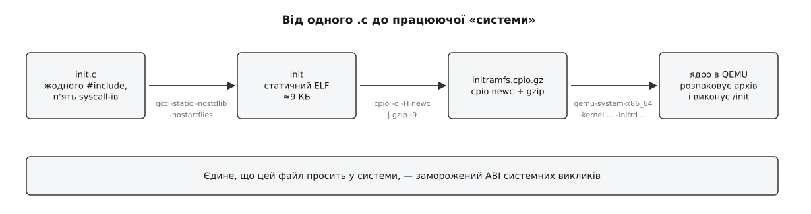
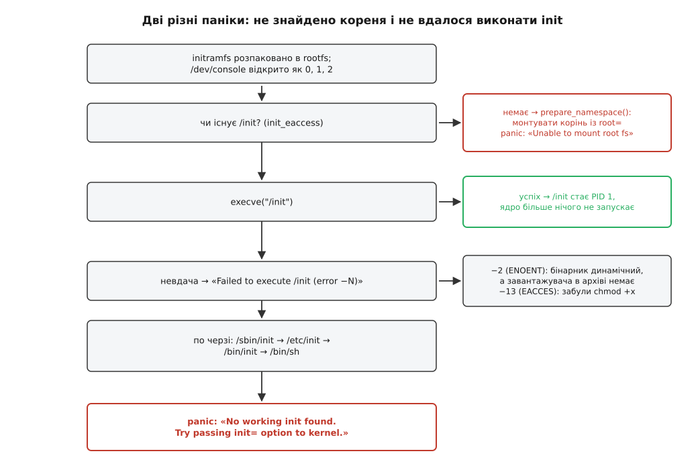

# ⚙️ Найменша «система»: ядро й один статичний файл

Тут ми зберемо систему з двох файлів — образу ядра та одного виконуваного файла — і запустимо її в QEMU. Сенс вправи не в мінімалізмі заради мінімалізму: коли навколо не лишилося нічого зайвого, кожна паніка ядра називає на ім'я рівно ту річ, якої бракує, і межа між ядром і всім іншим перестає бути схемою в тексті — вона стає рядком на екрані, який можна прочитати.

## Умова

Потрібно з голого дистрибутивного ядра дістати щось, що вмикається, вітається й вимикається. Дозволено: образ ядра, який уже лежить у `/boot`, і один-єдиний виконуваний файл, який ми напишемо самі. Заборонено все інше: жодної libc в системі, жодних утиліт, жодного `/etc`, жодного диска.

Робочі інструменти для збирання — `gcc`, `cpio`, `gzip` і `qemu-system-x86_64`; усі вони живуть на **вашій** машині, а не в тій системі, яку ми будуємо. Це важлива відмінність: підсистема, що будується, не має нічого, крім двох названих файлів.

## Ідея: ядро хоче рівно один файл

Наприкінці завантаження ядро робить дві речі, і другу з них ми зараз перехопимо.

Спершу воно розпаковує **initramfs** — cpio-архів, який завантажувач (у нашому випадку QEMU) поклав у пам'ять — у порожню кореневу файлову систему в оперативній пам'яті. Ця ФС уже існує до розпакування; ядро створює її саме, без будь-якого диска. Що таке initramfs і навіщо він потрібен справжнім дистрибутивам, розбирає [initramfs: тимчасовий корінь](root:sys-unix/initramfs) — коротко: це спосіб дати ядру трохи простору користувача **до** того, як стане доступним справжній корінь.

Далі ядро намагається виконати з цього кореня файл на ім'я `/init`. Ім'я не вгадується й не шукається — воно зашите в `init/main.c` одним рядком:

```c
static char *ramdisk_execute_command = "/init";
```

Змінити його можна параметром командного рядка ядра `rdinit=`; параметр `init=`, який згадують частіше, стосується іншого випадку — коли корінь монтують зі справжнього пристрою. Про те, звідки ядро взагалі бере ці параметри, — [завантажувач і командний рядок ядра](root:sys-unix/bootloader-and-cmdline).

Отже, увесь контракт мінімальної системи такий: **cpio-архів, у корені якого лежить виконуваний файл з іменем `init`**. Більше ядро не вимагає нічого.



*Три команди перетворюють один файл із текстом на щось, що завантажується.*

## Крок 1. Програма, яка нічого не просить

Найпростіший шлях — узяти звичайний `hello, world` і зібрати його з `-static`. Ми зробимо крок далі й напишемо файл, у якому немає **жодного** `#include`: тоді видно не тільки те, що бібліотека не потрібна під час запуску, а й те, що вона не потрібна взагалі.

Домовленість переходу в ядро на x86-64 коротка: номер виклику кладуть у `rax`, аргументи — по черзі в `rdi`, `rsi`, `rdx`, `r10`, `r8`, `r9`, тоді виконують інструкцію `syscall`. Процесор псує при цьому `rcx` і `r11` (кладе туди адресу повернення й прапорці), тому їх треба оголосити зіпсованими. Результат повертається в `rax`, від'ємне значення — це `-errno`. Механіку цього переходу докладно розбирає [системний виклик](root:sys-unix/syscall-mechanics).

```c
/* init.c — PID 1 без жодної бібліотеки: самі системні виклики.
   Номери — з arch/x86/entry/syscalls/syscall_64.tbl (x86-64). */
#define SYS_write       1
#define SYS_mkdir      83
#define SYS_mount     165
#define SYS_reboot    169
#define SYS_exit_group 231

static long sys(long n, long a, long b, long c, long d, long e)
{
    long ret;
    register long r10 __asm__("r10") = d;
    register long r8  __asm__("r8")  = e;
    __asm__ volatile ("syscall"
                      : "=a"(ret)
                      : "a"(n), "D"(a), "S"(b), "d"(c), "r"(r10), "r"(r8)
                      : "rcx", "r11", "memory");
    return ret;
}

static unsigned long slen(const char *s)
{
    unsigned long n = 0;
    while (s[n]) n++;
    return n;
}

static void say(const char *s)
{
    sys(SYS_write, 1, (long)s, (long)slen(s), 0, 0);
}

void _start(void)
{
    say("\n=== вітання від PID 1 ===\n");

    sys(SYS_mkdir, (long)"/proc", 0755, 0, 0, 0);
    if (sys(SYS_mount, (long)"proc", (long)"/proc", (long)"proc", 0, 0) == 0)
        say("/proc змонтовано\n");
    else
        say("/proc змонтувати не вдалося\n");

    say("вимикаюся\n");
    /* magic1 = 0xfee1dead, magic2 = 672274793 (0x28121969 — 28.12.1969) */
    sys(SYS_reboot, 0xfee1dead, 672274793, 0x4321FEDC, 0, 0);

    /* сюди не доходимо; але мовчки повертатися з _start не можна — нікуди */
    sys(SYS_exit_group, 1, 0, 0, 0, 0);
    for (;;) ;
}
```

Магічні числа в `reboot` — не забобон, а захист: ядро приймає виклик, лише якщо перший аргумент дорівнює `0xfee1dead`, а другий — одному з чотирьох дозволених значень. Основне з них, `672274793`, у шістнадцятковому вигляді читається як `0x28121969` — дата народження Торвальдса. Це буквально написано в `include/uapi/linux/reboot.h`; сенс перевірки в тому, щоб випадковий сміттєвий виклик не вимкнув машину.

Збирання:

```sh
$ gcc -O2 -static -nostdlib -nostartfiles -ffreestanding -fno-builtin \
      -o init init.c
$ ls -l init
-rwxr-xr-x 1 user user 9048 init
```

Кожен ключ тут щось прибирає. `-nostdlib` — не приліновувати libc. `-nostartfiles` — не приліновувати `crt1.o`, стартовий об'єктний файл, який зазвичай і містить справжню точку входу; без нього точкою входу стає наш `_start`. `-ffreestanding` і `-fno-builtin` кажуть компіляторові не вважати, що стандартні функції існують: інакше GCC має право впізнати цикл у `slen` як `strlen` і вставити виклик до бібліотеки, якої ми щойно позбулися.

Про те, що саме компонувальник записує у файл і звідки ядро дізнається адресу `_start`, — [ELF: сегменти, секції, точка входу](root:sys-unix/elf-structure).

## Крок 2. Архів, який ядро вміє розпаковувати

Тепер треба покласти цей файл туди, де ядро його шукає. Спокуса зробити диск із файловою системою є, але вона зайва: розпакувальник initramfs усередині ядра розуміє лише cpio родини «newc» (він же SVR4) — сам цей формат або його різновид із контрольною сумою, із необов'язковим стисненням. Це записано в документації ядра просто: буферний формат initramfs побудовано навколо форматів `newc` або `crc`, і створити такий архів можна звичайною утилітою `cpio`.

Вибір саме cpio, а не tar чи образу ext4, має причину. Розпакувальник мусить працювати в найранішому ядрі, коли ще немає ні блокових пристроїв, ні драйверів файлових систем, ні пам'яті, якою можна розкидатися. Формат `newc` — це послідовність заголовків із шістнадцяткових ASCII-чисел фіксованої довжини й тіл файлів; його читає невеликий скінченний автомат, який не потребує ні пошуку по архіву, ні таблиць. Стиснення (gzip і решта) розпаковувач ядра теж уміє сам.

```sh
$ mkdir -p root
$ cp init root/init
$ cd root
$ find . -print0 | cpio --null --create --format=newc --owner=0:0 \
      | gzip -9 > ../initramfs.cpio.gz
$ ls -l ../initramfs.cpio.gz
-rw-r--r-- 1 user user 4327 ../initramfs.cpio.gz
```

`--owner=0:0` тут не косметика: без нього всі файли в архіві дістануть ваш числовий ідентифікатор користувача, і в системі, де немає `/etc/passwd`, вони належатимуть неіснуючому нікому. Для PID 1 це поки що байдуже, але щойно з'явиться перевірка прав — почнуться загадки.

## Крок 3. Запуск

QEMU вміє завантажити образ ядра прямо, без завантажувача: ключ `-kernel` реалізує протокол завантаження Linux, а `-initrd` кладе наш архів у пам'ять і повідомляє ядру, де він лежить. Беремо ядро свого дистрибутива — воно нічим не гірше зібраного вручну.

```sh
$ qemu-system-x86_64 \
      -kernel /boot/vmlinuz-$(uname -r) \
      -initrd initramfs.cpio.gz \
      -append "console=ttyS0 panic=1" \
      -nographic -no-reboot -m 256M
```

`console=ttyS0` спрямовує повідомлення ядра в послідовний порт, а `-nographic` виводить цей порт у ваш термінал — інакше все відбувалося б у невидимому графічному вікні. `panic=1` каже ядру перезавантажитися через секунду після паніки, а `-no-reboot` перетворює цей перезапуск на вихід із QEMU: разом вони дають змогу спокійно прочитати текст паніки, замість дивитися на нескінченний цикл завантажень. Вийти з QEMU вручну можна Ctrl-A, тоді X.

На екрані буде приблизно таке:

```text
[    0.000000] Linux version 6.12.0-...
[    0.512340] Trying to unpack rootfs image as initramfs...
[    0.688901] Freeing initrd memory: 4K
[    0.913455] Run /init as init process

=== вітання від PID 1 ===
/proc змонтовано
вимикаюся
[    0.931002] reboot: Power down
$
```

Це вся система. Ядро, один файл на дев'ять кілобайтів — і робоча машина, яка вміє щось сказати й вимкнутися.

## Що з цього видно

### Дві різні паніки, і кожна каже, наскільки далеко дійшло ядро

Приберіть `init` з архіву й запакуйте порожню теку. Здавалося б, має бути «немає init». Насправді буде інше:

```text
[    0.9] VFS: Cannot open root device "" or unknown-block(0,0): error -6
[    0.9] Please append a correct "root=" boot option; here are the
          available partitions:
[    0.9] Kernel panic - not syncing: VFS: Unable to mount root fs on
          unknown-block(0,0)
```

Причину видно в коді. Перед тим як щось виконувати, ядро перевіряє, чи `/init` узагалі існує — викликом `init_eaccess`. Якщо файла немає, ядро вирішує, що ніякого раннього простору користувача йому не дали, обнуляє `ramdisk_execute_command` і йде звичайним шляхом: монтувати справжній корінь із того, що вказано в `root=`. Ми `root=` не вказали, диска в машині немає — звідси паніка про корінь, а не про init.

А тепер зробіть інакше: покладіть `init` в архів, але заберіть біт виконання (`chmod 644 root/init`). Файл існує, перевірка проходить, `execve` провалюється — і ядро говорить зовсім інше:

```text
[    0.9] Failed to execute /init (error -13)
[    0.9] Run /sbin/init as init process
[    0.9] Run /etc/init as init process
[    0.9] Run /bin/init as init process
[    0.9] Run /bin/sh as init process
[    0.9] Kernel panic - not syncing: No working init found.
          Try passing init= option to kernel. See Linux
          Documentation/admin-guide/init.rst for guidance.
```

Помітьте проміжні рядки. Коли `/init` не виконався, ядро не здається одразу: воно по черзі пробує `/sbin/init`, `/etc/init`, `/bin/init` і, останнім, `/bin/sh`. Лише коли всі п'ять шляхів провалилися, приходить паніка «No working init found». Той список — теж просто константи в `init/main.c`, а не якась глибша істина про Unix.



*Текст паніки — точний діагноз: одна означає «нема кореня», друга — «корінь є, але виконати з нього нема чого».*

> 🔧 **Навіщо це.** Обидві паніки щодня бачать люди, які ремонтують чужі машини. «Unable to mount root fs» майже завжди означає, що в initramfs не потрапив модуль контролера диска або файлової системи — ядро просто не дотяглося до кореня. «No working init found» означає протилежне: корінь змонтовано, з ним усе гаразд, зламано те, що на ньому лежить. Прочитати ці два рядки правильно — це половина ремонту.

### Чому статичний файл не просить libc — і чому «статичний» та «без libc» не одне й те саме

Наш `init` не звертається до жодної бібліотеки, бо звертатися нема до чого: між ним і ядром немає жодного посередника. Усе, на що він спирається, — номери системних викликів і розкладка аргументів по регістрах, тобто той самий договір, який ядро заморозило назавжди.

Але не переплутайте дві різні речі. Статично злінкований `hello, world` на glibc теж не просить libc **у системи** — він просто несе потрібний шматок libc усередині себе. Різницю добре видно за розміром:

| як зібрано | розмір `init` | що має бути в архіві додатково |
|---|---|---|
| `-nostdlib -nostartfiles` (наш) | ≈ 9 КБ | нічого |
| `-static` з musl | ≈ 30 КБ | нічого |
| `-static` з glibc | ≈ 800 КБ | нічого |
| звичайне динамічне збирання | ≈ 16 КБ | `ld-linux-x86-64.so.2` + `libc.so.6` ≈ 2 МБ |

Точні числа гуляють від версії до версії; важливий тут порядок величини й останній стовпчик. Перші три рядки — самодостатні файли, четвертий — ні. Що саме означає ця відмінність під час компонування, розбирає [статичне й динамічне лінкування](root:sys-unix/static-and-dynamic-linking).

### Що ламається на динамічному бінарнику

Зберіть звичайний динамічний `hello, world` — простим `gcc -o init hello.c`, без `-static` і без `-nostdlib`, — і покладіть його в архів під іменем `init`:

```text
[    0.9] Failed to execute /init (error -2)
[    0.9] Kernel panic - not syncing: No working init found. ...
```

Помилка −2 — це `ENOENT`, «немає такого файла». І це найзбивальніше повідомлення в усьому Linux, бо файл є, ви щойно самі його туди поклали.

Річ у тім, що ядро скаржиться не на нього. У динамічному ELF-файлі є сегмент `PT_INTERP` із зашитим абсолютним шляхом до інтерпретатора — `/lib64/ld-linux-x86-64.so.2`. `execve` читає цей шлях і намагається завантажити названий файл; його в архіві немає, і `ENOENT` — саме про нього. Той самий механізм породжує знамените «No such file or directory» при спробі запустити чужий бінарник на машині без потрібного завантажувача. Як цей завантажувач далі шукає й підв'язує бібліотеки, описано в темі [динамічний завантажувач](root:sys-unix/dynamic-loader).

Полагодити це можна, і сама процедура повчальна:

```sh
$ ldd init
        linux-vdso.so.1 (0x00007ffd...)
        libc.so.6 => /lib/x86_64-linux-gnu/libc.so.6
        /lib64/ld-linux-x86-64.so.2
$ mkdir -p root/lib64 root/lib/x86_64-linux-gnu
$ cp /lib64/ld-linux-x86-64.so.2            root/lib64/
$ cp /lib/x86_64-linux-gnu/libc.so.6        root/lib/x86_64-linux-gnu/
```

Зверніть увагу, чого це коштувало. Щоб запустити ту саму програму, довелося відтворити в архіві **шматок розкладки чужого дистрибутива** — теки з точними іменами, у точних місцях, із точними версіями файлів. Архів виріс із чотирьох кілобайтів до двох мегабайтів. І перенести його на машину з іншою libc уже не вийде. Саме про цю ціну йдеться, коли кажуть, що динамічний бінарник залежить не від ядра, а від дистрибутива.

## Пастки

**Немає `/dev` — і програма німа.** Ядро перед запуском init відкриває `/dev/console` і віддає його новому процесові як дескриптори 0, 1 і 2. Якщо відкрити нема чого, у журналі з'явиться `Warning: unable to open an initial console.`, init запуститься **без стандартних потоків** — і всі його `write` у дескриптор 1 мовчки провалюватимуться. Наш приклад працює тому, що ядро, зібране без власного `CONFIG_INITRAMFS_SOURCE`, несе всередині крихітний типовий архів (`usr/default_cpio_list`), у якому є рівно три записи: тека `/dev`, вузол `/dev/console` (символьний, 5:1) і тека `/root`. Цей вбудований архів розпаковують **перед** вашим, тому консоль зазвичай уже є. Покладатися на це не варто: надійніше покласти вузол самому. Звичайний `cpio` під непривілейованим користувачем такого не вміє — або `sudo mknod root/dev/console c 5 1`, або утиліта `usr/gen_init_cpio` з дерева ядра, яка збирає архів із текстового опису й уміє рядок `nod /dev/console 0600 0 0 c 5 1` без жодного root. Чому пристрій — це пара чисел, а не файл, розказує [файл пристрою](root:sys-unix/device-file-model).

**Немає `/proc` — і половина звичних речей не існує.** Поки init сам не змонтує `procfs`, у системі немає ні `/proc/self`, ні `/proc/meminfo`, ні даних, з яких будь-який `ps` малює список процесів. Це не «ядро приховало» — це псевдо-файлова система, яку хтось має змонтувати; так само `sysfs` у `/sys` і `devtmpfs` у `/dev`. Окремо варто знати, що автомонтування `devtmpfs` (`CONFIG_DEVTMPFS_MOUNT`) навмисно **не** діє для initramfs: у документації ядра прямо сказано, що при завантаженні через initramfs devtmpfs треба монтувати вручну. Про цю родину ФС — [псевдо-ФС: procfs, sysfs, tmpfs, devtmpfs](root:sys-unix/pseudo-filesystems).

**PID 1 не має права завершуватися.** Приберіть із коду виклик `reboot` — і замість тиші отримаєте:

```text
[    0.9] Kernel panic - not syncing: Attempted to kill init! exitcode=0x00000000
```

Код виходу нульовий, тобто програма завершилася **успішно** — і це все одно паніка. Ядро не має запасного плану: воно не вміє нікого перезапустити, бо перезапуск — це політика, а політику мав утілювати саме той процес, який щойно помер. Через це ж PID 1 живе за окремими правилами й для сигналів: ядро не доставляє йому сигнал, для якого не встановлено власного обробника. Практично це означає, що `kill -TERM 1` без обробника не робить нічого, а `kill -KILL 1` не працює взагалі — глобальному init не можна надіслати `SIGKILL` і `SIGSTOP` навіть від root. Що з цього випливає для справжніх init-систем, розбирає [роль init і особливість PID 1](root:sys-unix/init-and-pid1).

**Забутий `-static`.** Найчастіша й найшвидша помилка: збирали програму як завжди, отримали −2 і півгодини шукали неіснуючий файл. Правило просте — перш ніж пакувати архів, спитайте `ldd init`; відповідь `not a dynamic executable` означає, що все гаразд.

**PID 1 успадковує чужих дітей.** Наша програма нічого не породжує, тому проблеми не видно. Але щойно init когось запустить, він стає прийомним батьком для всіх осиротілих процесів у системі й зобов'язаний забирати їхні коди виходу викликом `wait`. Init, який цього не робить, повільно наповнює таблицю процесів зомбі — записами про мертвих, які нема кому прибрати. Це найпоширеніша вада саморобних PID 1, зокрема в контейнерах. Механіка — у темах [сироти й перепідпорядкування](root:sys-unix/orphan-reparenting) і [завершення, wait і зомбі](root:sys-unix/exit-wait-zombies).

**Ядро в QEMU — не те саме, що ядро на вашій машині.** Ми запускали дистрибутивний образ у віртуальній машині; QEMU без `-enable-kvm` емулює процесор програмно, і завантаження триває помітно довше, ніж на живому залізі. На поведінку нашого досліду це не впливає, але не дивуйтеся секундам замість мілісекунд. Про те, як залізо дає гостьовій системі виконуватися напряму, — [апаратна віртуалізація](root:hw-arch/hardware-virtualization).

## Куди це росте

Різниця між зібраним щойно й тим, що завантажується на справжньому сервері, — кількісна, а не якісна. Реальний initramfs дистрибутива влаштований точно так само: cpio-архів, у корені якого лежить `/init`. Просто там це не дев'ять кілобайтів, а десятки мегабайтів — скрипт оболонки або невеликий бінарник, поруч BusyBox чи набір GNU-утиліт, модулі ядра для контролерів дисків і кореневої ФС, засоби для LVM і шифрування. Робота того init теж одна: знайти й змонтувати справжній корінь, а тоді передати керування справжньому init, який на ньому лежить.

Наступний природний крок — покласти в архів статично зібраний BusyBox: один файл на кількасот кілобайтів, який під різними іменами вдає з себе кілька сотень [базових утиліт](root:sys-unix/gnu-userland), включно з оболонкою. Замініть `init` на скрипт, що монтує `/proc`, `/sys` і `/dev`, а тоді запускає `/bin/sh`, — і ви отримаєте систему, у якій уже можна працювати руками. Файлів у ній буде три.
