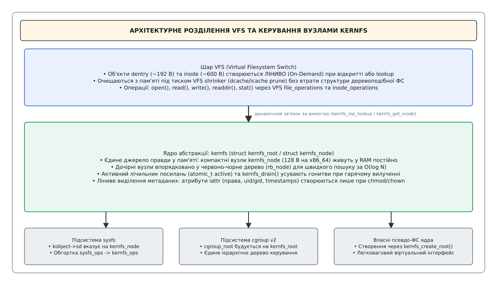
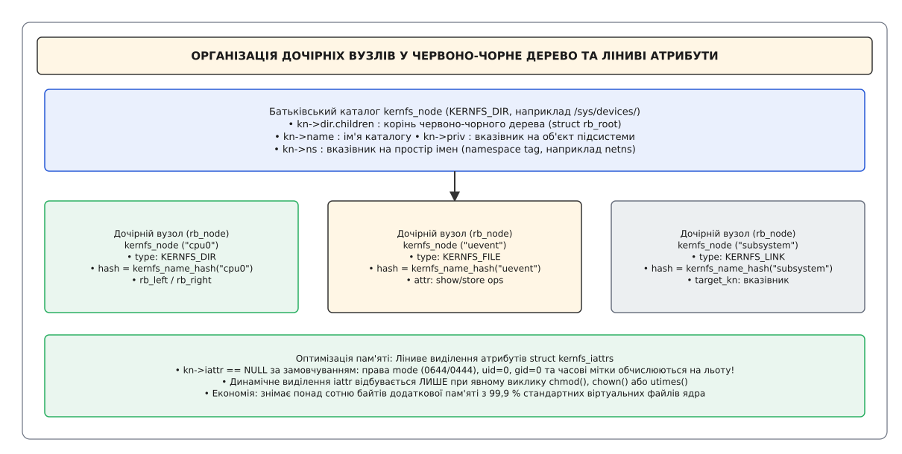
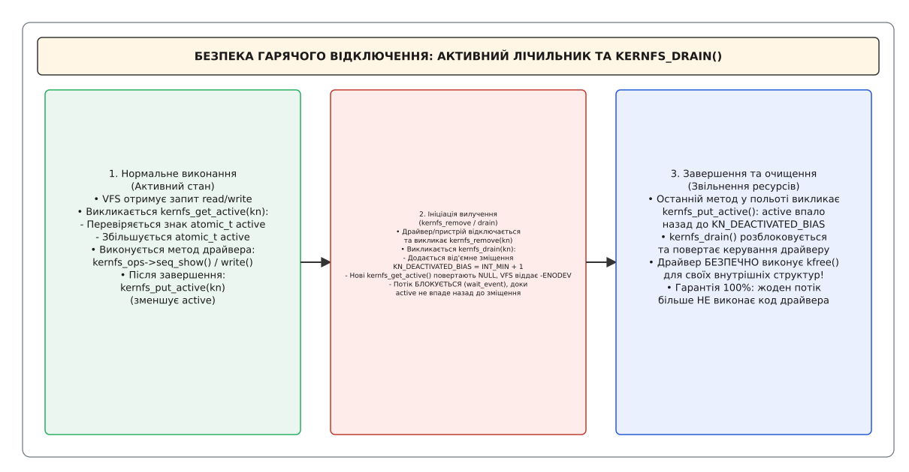

# Шар абстракції kernfs та його роль у розвантаженні VFS

<preknowlist>
- [VFS: спільний шар над файловими системами](root:sys-unix/vfs-layer) — абстракції `inode`, `dentry` та керування об'єктами файлової системи в пам'яті.
- [Файлова система sysfs, kobject та sysfs_dirent](root:sys-unix/sysfs-kobject-sysfs-dirent) — модель пристроїв ядра Linux та історія першої віртуальної файлової системи атрибутів.
- [Псевдо-ФС: procfs, sysfs, tmpfs, devtmpfs](root:sys-unix/pseudo-filesystems) — віртуальні файлові системи ядра без зберігання блоків на фізичних носіях.
</preknowlist>

У серверах високої щільності з тисячами мережевих пристроїв, PCI-контролерів та ізольованих контейнерів cgroups кожен віртуальний файл, що лежить на VFS напряму, коштує пари об'єктів у SLAB-кешах, які не витискаються у підкачку: `struct dentry` (~192 байти) та `struct inode` (від 560 до 640 байтів, залежно від конфігурації). На системі з 500 000 таких вузлів це близько 400 МБ пам'яті ядра, зайнятої назавжди, — навіть якщо жоден процес у просторі користувача ніколи не відкривав ані `/sys`, ані `/sys/fs/cgroup`. Сама sysfs цю ціну платити перестала ще у 2007 році, завівши собі окреме внутрішнє дерево вузлів; біда в тому, що завела вона його **лише для себе**. Файлова система контрольних груп `cgroupfs`, `debugfs` і решта псевдо-ФС і далі тримали ієрархію на `dentry` — кожна зі своїм кодом обходу каталогів, своїми блокуваннями і своєю, де вдалішою, де ні, обробкою гонитв (англ. *race conditions*), коли пристрій відключається просто посеред `read()` чи `write()`. Спроби розвантажити модуль без суворої синхронізації з VFS закінчувалися системною панікою на звільненому вказівнику.

Виокремлення уніфікованого шару абстракції **`kernfs`** розробником Теджуном Хео (Tejun Heo) у ядрах Linux 3.14 розв'язало ці проблеми, розвантаживши віртуальну файлову систему (VFS) та створивши єдиний, надійний фундамент для sysfs, cgroups v2 та нових псевдо-ФС ядра.

---

## Чому VFS потребує розвантаження: трагедія `dentry` та `inode` для віртуальних файлів

Віртуальна файлова система Linux (VFS) створювалася з розрахунком на класичні дискові файлові системи (ext4, xfs, btrfs), де дискові блоки зберігаються на фізичних носіях даних. У цій архітектурі об'єкти `dentry` кешують шляхи до файлів у списку `dcache`, а об'єкти `inode` зберігають метадані (права, розмір, часові мітки), зчитані з дискових блоків.

Однак у віртуальних файлових системах (`sysfs`, `cgroupfs`, `tracefs`) файлів на диску не існує. Кожен файл атрибута — це просто зручне текстове вікно до внутрішніх структур даних ядра (зокрема `struct device`, `struct kobject` чи `struct cgroup`).

Застосування стандартних VFS-структур до віртуальних файлів створює дві фундаментальні інженерні суперечності:

### 1. Непропорційна вартість пам'яті
Об'єкти VFS мають значні габарити через необхідність підтримки складної дискової логіки, вирівнювання сторінок та зворотних викликів RCU (англ. *Read-Copy-Update*):
- `struct dentry`: 192 байти (у 64-бітній архітектурі) + вкладені структури назви файла.
- `struct inode`: від 560 до 640 байтів залежно від конфігурації ядра.

Загальні постійні витрати пам'яті для одного віртуального файла сягають майже 800 байтів. У високомасштабованих системах із сотнями тисяч пристроїв це витягує сотні мегабайтів цінної оперативної пам'яті у SLAB-кешах, які неможливо витиснути у простір підкачки (swap).

### 2. Конфлікт життєвого циклу об'єктів (Shrinkers vs Hierarchy)
Коли у системі виникає дефіцит оперативної пам'яті, підсистема керування пам'яттю звертається до підсистеми VFS shrinkers із вимогою вилучити неактивні `dentry` та `inode` із кешів `dcache` та `icache`. Якщо віртуальна файлова система будує граф каталогів безпосередньо на `dentry`, вилучення `dentry` з пам'яті призводить до втрати інформації про зв'язки «батько-дитина» у дереві пристроїв ядра.

Механізм `kernfs` пропонує зміну парадигми: **дерево каталогів відокремлюється від VFS**.

Усередині ядра підтримується автономне, надзвичайно компактне дерево вузлів `struct kernfs_node`. Воно слугує єдиним джерелом правди про ієрархію віртуальних файлів. Об'єкти ж VFS (`dentry` та `inode`) взагалі **не створюються**, доки процес простору користувача не здійснить системний виклик `open()`, `stat()` або `readdir()`. Як тільки процес закриває файловий дескриптор, VFS shrinker може миттєво знищити `dentry` та `inode`, не порушуючи цілісності внутрішнього дерева `kernfs`.


*Шар kernfs підтримує компактне дерево kernfs_node у пам'яті ядра та створює об'єкти VFS dentry і inode лише за вимогою (on-demand).*

Докладний розбір еволюції від ранніх структур `sysfs_dirent` до уніфікованого шару `kernfs` наведено у вставці [📜 Історія еволюції від sysfs_dirent до kernfs](root:sys-unix/kernfs-vfs-abstraction-layer/hist-kernfs-evolution.md).

---

## Внутрішня анатомія `struct kernfs_node` та `struct kernfs_root`

Основою архітектури `kernfs` є дві головні структури: `struct kernfs_root` (представляє корінь всієї файлової системи) та `struct kernfs_node` (представляє окремий елемент дерева).

Лістинги нижче знято з `include/linux/kernfs.h` ядра 5.0 — межі варто тримати в голові. У 3.14 `kernfs_root` роздавав номери через `struct ida ino_ida`, не знав ні поколінь, ні `syscall_ops`, а сам вузол ніс просте поле `unsigned int ino`. Від 5.5 `union kernfs_node_id id` згорнули назад у звичайне `u64 id` (на 64-бітних `ino_t` це просто номер inode, на 32-бітних — молодші 32 біти номер, старші покоління).

`struct kernfs_root` описує глобальний стан змонтованого дерева:

```c
struct kernfs_root {
    struct kernfs_node  *kn;
    unsigned int        flags;
    struct idr          ino_idr;
    u32                 next_generation;
    struct kernfs_syscall_ops *syscall_ops;
    struct list_head    supers;   /* kernfs_super_info цього кореня */
    wait_queue_head_t   deactivate_waitq;
};
```

Кожен вузол системи описується структурою `struct kernfs_node`:

```c
struct kernfs_node {
    atomic_t            count;
    atomic_t            active;
    struct kernfs_node  *parent;
    const char          *name;
    struct rb_node      rb;
    const void          *ns;
    unsigned int        hash;
    union {                              /* безіменна: kn->dir, kn->attr, kn->symlink */
        struct kernfs_elem_dir      dir;
        struct kernfs_elem_symlink  symlink;
        struct kernfs_elem_attr     attr;
    };
    void                *priv;
    union kernfs_node_id id;
    unsigned short      flags;
    umode_t             mode;
    struct kernfs_iattrs *iattr;
};
```

Розглянемо ключові інженерні оптимізації, закладені у цю структуру:

### 1. Червоно-чорне дерево для обходу дочірніх вузлів (`rb`)
У ранніх версіях sysfs дочірні елементи каталогу нанизувалися на простий список через поле `s_sibling`. Пошук файла в каталозі з `N` атрибутами (наприклад, у підкаталозі пристрою PCI із сотнями конфігураційних атрибутів) означав лінійний перебір за `O(N)` — і те саме на кожному створенні вузла, бо ім'я треба звірити на унікальність. На системі з десятками тисяч блокових пристроїв це коштувало десятків секунд самої лише реєстрації.

Цю перебудову `kernfs` не винаходив — він її успадкував: на rb-дерева sysfs перевели ще на початку серії 3.x, спершу двома окремими вузлами (`inode_node` для номера inode і `name_node` для імені), згодом звівши їх до одного `s_rb`. Виокремлення `kernfs` лише перейменувало поле на `rb`.

Дочірні вузли каталогу висять на корені `kn->dir.children` (`struct rb_root`). Ключ порівняння тришаровий: спершу хеш `kn->hash` (він зліплений з імені, а засіяний тегом простору імен), на збігу хешів — сам вказівник `ns`, і лише потім рядок `kn->name`. Пошук виходить за логарифмічний час `O(log N)`, що знімає з `lookup` у великих каталогах саме ту вартість, яка колись робила гарячі підключення повільними.


*Організація дочірніх вузлів у червоно-чорне дерево rb_node, простори імен ns та ліниве виділення атрибутів iattr.*

### 2. Тегування просторів імен (`ns`)
Для забезпечення ізоляції у контейнерах (наприклад, у Docker чи LXC) один і той самий каталог `/sys/class/net` мусить показувати різні мережеві інтерфейси для різних мережевих просторів імен (netns). Без `kernfs` ядру довелося б створювати окремі копії дерева `dentry` для кожного контейнера.

У `kernfs` вузол містить тег простору імен `const void *ns`. При виконанні пошуку вузла `kernfs_find_ns()` ядро порівнює не лише назву файла, а й вказівник на поточний простір імен процесу. Це дозволяє прозоро показувати різні набори віртуальних файлів усередині єдиної загальної структури каталогів без додаткового виділення пам'яті.

### 3. Ліниве виділення атрибутів `iattr` (Lazy Metadata Allocation)
Більшість віртуальних файлів ядра мають стандартні права доступу (`0644` або `0444`), власника `root:root` (UID 0, GID 0) та однаковий час створення. Для 99,9 % файлів зберігання окремих полів `atime`, `mtime`, `ctime`, `uid` та `gid` є марнотратством.

У `kernfs` вказівник `kn->iattr` за замовчуванням дорівнює `NULL`. Права `mode` та база власника обчислюються на льоту із полів самого `kernfs_node`. Пам'ять під структуру `struct kernfs_iattrs` (вона вкладає в себе цілий `struct iattr` із трьома часовими мітками — понад сотню байтів) виділяється зі SLAB-кешу **лише тоді**, коли процес у просторі користувача явно викликає `chmod()`, `chown()` або `utimes()` над віртуальним файлом.

Повний список функцій, сигнатур та структур даних `kernfs` детально описано у довіднику [📋 Контракт API: структури, методи та функції kernfs](root:sys-unix/kernfs-vfs-abstraction-layer/api-kernfs-ops.md).

---

## Символічні посилання (`KERNFS_LINK`) та оптимізація покажчиків

У класичних файлових системах символічне посилання (symlink) зберігає рядок із текстовим шляхом до цільового файла (наприклад, `../devices/pci0000:00/0000:00:1f.2`). При виконанні системного виклику `readlink()` чи переході по посиланню VFS повинна парсити текстовий рядок шлях за шляхом, звертаючись до кешу `dcache`.

У шарі `kernfs` символічні посилання реалізовано через тип `KERNFS_LINK` з унікальною інженерною оптимізацією. Поле `kn->symlink.target_kn` містить **прямий вказівник у пам'яті** на цільовий об'єкт `struct kernfs_node`:

```c
struct kernfs_elem_symlink {
    struct kernfs_node  *target_kn;
};
```

### Переваги прямого посилання на вузол:
1. **Рядка шляху ніде не зберігається**: Текст на кшталт `../../devices/pci0000:00/0000:00:1f.2` не лежить у пам'яті — його щоразу відбудовує `kernfs_get_target_path()`, ідучи вгору по `parent` від посилання й від цілі до спільного предка. Простір користувача отримує звичайний relative-шлях у `readlink()`, а ядро не витрачає на кожне посилання окремого буфера і не має що синхронізувати, коли ціль перейменували чи перенесли.
2. **Гарантія відсутності «висячих» посилань**: При створенні посилання `kernfs_create_link()` викликає `kernfs_get(target)` — лічильник `target_kn->count` росте. Цільовий вузол не може бути звільнений із пам'яті, поки на нього існує хоча б одне символічне посилання в `kernfs`, тож `target_kn` ніколи не вказує в звільнену пам'ять.
3. **Деактивація ловиться на цілі, а не на посиланні**: Якщо цільовий пристрій вилучається через `kernfs_remove()`, сам перехід по посиланню ще може відбутися, але перше ж `open()`/`read()` цільового файла впирається в `kernfs_get_active()` і повертає `-ENODEV`. Гонитви на звільненій структурі драйвера не виникає навіть тоді, коли підсистема не встигла зняти посилання.

---

## Динамічне виділення номерів `inode` та підтримка NFS-експорту

Одне із прихованих інженерних завдань віртуальної файлової системи — забезпечення унікальності номерів `inode` (`ino_t`) для кожного вузла. У класичних файлових системах номер `inode` фізично записаний у структурі дискового блоку. У `kernfs` номери `inode` виділяються динамічно у просторі ядра.

Для керування діапазоном номерів `inode` структура `kernfs_root` містить розподільник ідентифікаторів `struct idr ino_idr`. Коли ядро створює новий `kernfs_node`, воно бере з нього черговий номер і доліплює до нього лічильник поколінь — разом виходить 64-бітний ідентифікатор `union kernfs_node_id` (32 біти `ino` + 32 біти `generation`):

```c
kn->id.ino        = idr_alloc_cyclic(&root->ino_idr, kn, 1, 0, GFP_ATOMIC);
kn->id.generation = root->next_generation;
```

### Переваги поля `generation`:
Поле `generation` слугує захистом від повторного використання номерів `inode` (англ. *stale file handle protection*). Номери з `ino_idr` рано чи пізно повертаються в обіг: пристрій відключили, вузол зник, а новий вузол дістав той самий `ino`. Локально це не страшно — відкритий дескриптор тримає власне посилання. Небезпека виникає там, де посилання на файл живе поза ядром: NFS-клієнт зберігає file handle і приходить із ним через години. Тому корені, підняті з прапорцем `KERNFS_ROOT_SUPPORT_EXPORTOP`, кладуть у handle обидві половини `union kernfs_node_id`; при поверненні handle ядро звіряє `generation`, і на розбіжності віддає `-ESTALE` (Stale File Handle) замість того, щоб мовчки підсунути чужий пристрій.

---

## Механізм гарантії безпеки при гарячому відключенні: `active` рефкаунтер та `kernfs_drain()`

Одним із найскладніших завдань у розробці ядерних файлових систем є захист від критичних умов гонитви (англ. *hot-unplug race conditions*).

Уявіть ситуацію:
1. Процес у просторі користувача відкриває файл атрибута пристрою `/sys/devices/pci0000:00/0000:00:1f.2/status` і викликає системний виклик `read()`.
2. Потік виконання VFS переходить у код драйвера і починає виконувати метод `show()`.
3. У цей самий момент користувач фізично виймає пристрій із слота розширення.
4. Драйвер пристрою отримує переривання про відключення, викликає `unregister_device()` і звільняє пам'ять своєї внутрішньої структури `struct my_driver_dev` за допомогою `kfree()`.
5. Потік системного виклику `read()`, який продовжує виконувати метод `show()`, намагається зчитати поле з уже звільненої пам'яті. **Результат: паніка ядра (Kernel Panic, Use-After-Free).**

Для розв'язання цієї проблеми у `kernfs` впроваджено **дворівневий підрахунок посилань**.

У структурі `kernfs_node` є два окремих атомарних лічильники:
- **`count`**: Керує виділенням пам'яті для самої структури `kernfs_node`. Пам'ять під `kernfs_node` залишається дійсною доти, доки `count > 0`.
- **`active`**: Керує можливістю виконання методів драйвера над payload-даними (`priv`).


*Механізм захисту від гонитви при вилученні вузла: деактивація через kernfs_drain та очікування завершення активних операцій.*

Послідовність роботи механізму `active` та виклику `kernfs_drain()` складається з трьох фаз:

### Фаза 1: Отримання активного посилання (`kernfs_get_active`)
Кожну операцію над файлом (`read`, `write`, `mmap`, `poll`) шар `kernfs` огортає парою `kernfs_get_active(kn)` / `kernfs_put_active(kn)` — і без успішного першого виклику до коду драйвера справа не доходить узагалі:

```c
struct kernfs_node *kernfs_get_active(struct kernfs_node *kn)
{
    if (unlikely(!kn))
        return NULL;

    if (!atomic_inc_unless_negative(&kn->active))
        return NULL;

    if (kernfs_lockdep(kn))
        rwsem_acquire_read(&kn->dep_map, 0, 1, _RET_IP_);

    return kn;
}
```

Уся перевірка тримається на знаку лічильника: `atomic_inc_unless_negative()` збільшує `active` на 1 лише тоді, коли значення невід'ємне. Якщо вузол активний, метод драйвера виконується безпечно, а після завершення виклику спрацьовує парна функція `kernfs_put_active(kn)`, яка зменшує `active`.

### Фаза 2: Деактивація вузла (`kernfs_drain`)
Коли драйвер пристрою вилучається із системи, він викликає `kernfs_remove(kn)`. Всередині цього виклику шар `kernfs` негайно запускає процедуру спорожнення `kernfs_drain(kn)`:

1. До значення лічильника `kn->active` додається від'ємне зміщення деактивації `KN_DEACTIVATED_BIAS`, визначене у `fs/kernfs/kernfs-internal.h` як `(INT_MIN + 1)` — одиниця додана навмисно, щоб компілятор не сварився на переповнення там, де це зміщення доводиться заперечувати. Лічильник стає різко від'ємним.
2. Після цього будь-які нові спроби викликати `kernfs_get_active()` з інших потоків **негайно відсіюються** — функція повертає `NULL`, а шар `kernfs` віддає у простір користувача `-ENODEV`.
3. Потік виконання `kernfs_drain()` засинає на черзі очікування `deactivate_waitq` і чекає, поки виклики `show()`/`store()`, що вже в польоті, не повернуть свої посилання, тобто поки `active` не впаде назад рівно до `KN_DEACTIVATED_BIAS`.

### Фаза 3: Безпечне очищення
Як тільки останній потік, що виконував `show()` у контексті свого системного виклику, доходить до `kernfs_put_active()`, лічильник `active` атомарно повертається до `KN_DEACTIVATED_BIAS` — і саме на цьому значенні `kernfs_put_active()` будить `deactivate_waitq`. Потік `kernfs_drain()` прокидається, і функція `kernfs_remove()` повертає керування драйверу.

Драйвер отримує **100% гарантію**: у момент повернення керування з `kernfs_remove()` жоден потік у ядрі більше не виконує і ніколи більше не виконає жодного рядка коду з його методів `kernfs_ops`. Драйвер може спокійно викликати `kfree()` для своїх структур даних без ризику виникнення Use-After-Free.

---

## Асинхронне сповіщення у просторі користувача: `kernfs_notify()`

Окрім синхронної обробки викликів `read` та `write`, підсистеми ядра мають регулярно сповіщати простір користувача про зміни стану пристроїв або перевищення лімітів ресурсів (наприклад, зміна температурного режиму у `hwmon` чи подія вичерпання пам'яті у cgroups v2).

Традиційне опитування (англ. *polling*) віртуальних файлів у циклі через `cat` створює колосальне навантаження на процесор. У `kernfs` впроваджено високоефективний асинхронний механізм `kernfs_notify(kn)`. Ось перша його половина — та, що будить `poll`:

```c
void kernfs_notify(struct kernfs_node *kn)
{
    struct kernfs_open_node *on;
    unsigned long flags;

    if (WARN_ON(kernfs_type(kn) != KERNFS_FILE))
        return;

    /* негайно копнути poll */
    spin_lock_irqsave(&kernfs_open_node_lock, flags);
    on = kn->attr.open;
    if (on) {
        atomic_inc(&on->event);
        wake_up_interruptible(&on->poll);
    }
    spin_unlock_irqrestore(&kernfs_open_node_lock, flags);

    /* далі — друга половина: вузол стає у список kernfs_notify_list
       і schedule_work() відкладає підняття fsnotify/inotify */
}
```

Розділення на дві половини не косметичне: `kernfs_notify()` викликають і з атомарного контексту, а `fsnotify` спати може, тож `inotify`-подія приходить не миттєво, а окремою роботою з черги. Читачі на `poll()`/`epoll_wait()` прокидаються одразу.

### Як це працює у системному програмуванні:
1. Демон у просторі користувача (наприклад, `systemd`, `udev` або `containerd`) відкриває файл атрибута і викликає системний виклик `poll()` чи `epoll_wait()`.
2. Шар `kernfs` реєструє чергу очікування у `poll_table`. Потік демона переходить у стан глибокого сну із нульовим споживанням CPU.
3. Коли модуль ядра викликає `kernfs_notify(kn)`, ядро атомарно збільшує ідентифікатор події `on->event` та розблоковує потік через `wake_up_interruptible()`.
4. Системний виклик `poll()` повертає прапорці `EPOLLPRI | EPOLLERR` поверх звичайної маски готовності. Демон миттєво зчитує новий стан через `read()`.

---

## Інтеграція з VFS та обробка файлових операцій

Ядро `kernfs` є повноцінним проміжним мостом між VFS та драйверами підсистем. Для інтеграції з VFS підсистема `kernfs` реєструє власні таблиці операцій суперблоку (`super_operations`), індексного вузла (`inode_operations`) та файла (`file_operations` — це і є `kernfs_file_fops`).

Послідовність створення об'єктів VFS при зверненні користувача за шляхом `/sys/devices/system/cpu/online`:

```
Потік користувача: open("/sys/devices/system/cpu/online", O_RDONLY)
  │
  ├── 1. VFS lookup в кеші dcache ──► (Промах, dentry не існує!)
  │
  ├── 2. VFS викликає kernfs_iop_lookup(dir_inode, dentry, flags)
  │      ├── Отримує батьківський kernfs_node (dir)
  │      ├── Виконує пошук "online" у rb_tree батька за O(log N)
  │      └── Знайдено target kn!
  │
  ├── 3. Інстанціація vfs inode: kernfs_get_inode(sb, kn)
  │      ├── Шукає наявний inode у таблиці хешів VFS за номером kn->id
  │      ├── Якщо не знайдено ──► виділяє новий struct inode зі SLAB
  │      └── Призначає операції: inode->i_fop = &kernfs_file_fops
  │
  ├── 4. Зв'язування: d_instantiate(dentry, inode)
  │
  └── 5. VFS open() ──► kernfs_fop_open()
         ├── Створює struct kernfs_open_file
         └── Призначає seq_file для обробки показу
```

### Передача файлових операцій через `kernfs_file_fops`

Коли процес простору користувача викликає `read()` над відкритим файловим дескриптором, виклик перехоплюється загальним методом `kernfs_fop_read()`. Сам він робить рівно одне — розводить потік на дві гілки за прапорцем, виставленим при створенні файла:

```c
static ssize_t kernfs_fop_read(struct file *file, char __user *user_buf,
                               size_t count, loff_t *ppos)
{
    struct kernfs_open_file *of = kernfs_of(file);

    if (of->kn->flags & KERNFS_HAS_SEQ_SHOW)
        return seq_read(file, user_buf, count, ppos);
    else
        return kernfs_file_direct_read(of, user_buf, count, ppos);
}
```

Зверніть увагу:
1. Активного посилання диспетчер **не бере** — його бере кожна гілка окремо, і саме там, де вже захоплено `of->mutex`. У гілці `seq_file` це робить `kernfs_seq_start()` (а `kernfs_seq_stop()` віддає), у прямій гілці — сама `kernfs_file_direct_read()`. Обидві на невдачі `kernfs_get_active()` віддають `-ENODEV`.
2. Якщо у драйвері визначено `seq_show`, шар `kernfs` прозоро спрямовує виклик у підсистему `seq_file`, яка сама бере на себе виділення сторінкових буферів, ітерації та захист від переповнення буфера.
3. Якщо визначено лише низькорівневий метод `read`, `kernfs` виділяє буфер, викликає `ops->read()` з контекстом `kernfs_open_file` і вже потім копіює результат у простір користувача через `copy_to_user()`. Драйвер сам у простір користувача не пише.

Після 5.10 обидві гілки переписано на ітератори: уже в 5.12 у `kernfs_file_fops` замість `.read`/`.write` стоять `.read_iter = kernfs_fop_read_iter` та `.write_iter`. Розподіл ролей — диспетчер без посилання, гілка з посиланням — лишився той самий.

---

## Простеження та діагностика kernfs у реальному часі

Власних точок простеження (tracepoints) `kernfs` не оголошує — у `/sys/kernel/tracing/events/` каталогу `kernfs` немає. Зате всі його вхідні функції — звичайні символи ядра, тож дивитися на них треба через `kprobe`/`kretprobe` за допомогою `bpftrace`, `trace-cmd` чи `ftrace`.

Найпоказовіший символ — експортований `kernfs_remove()`: саме він усередині блокується на `kernfs_drain()`, тож проміжок між входом і виходом і є часом очікування активних операцій:

```bash
# Скільки часу kernfs_remove() чекає на спорожнення вузла
sudo bpftrace -e '
kprobe:kernfs_remove {
    @start[tid] = nsecs;
    printf("DRAIN INITIATED: kn=%p\n", arg0);
}
kretprobe:kernfs_remove /@start[tid]/ {
    printf("DRAIN COMPLETED: %d us\n", (nsecs - @start[tid]) / 1000);
    delete(@start[tid]);
}
'
```

Така діагностика дозволяє виявляти застряглі фонові файлові операції у просторі користувача, які блокують розвантаження модулів ядра або зупиняють процеси вилучення контейнерів у Kubernetes.

---

## Підсистеми на базі `kernfs`: `sysfs`, `cgroup` v2 та нові псевдо-ФС

Завдяки універсальності та високій ефективності `kernfs` став уніфікованим стандартом для побудови віртуальних файлових систем ядра Linux.

### 1. Переведення `sysfs` на `kernfs`
У сучасних ядрах Linux (починаючи з 3.14) файлова система `sysfs` більше не керує файловими вузлами самостійно. Кожен `struct kobject` містить у собі поле `struct kernfs_node *sd`.

Коли драйвер викликає `sysfs_create_file(kobj, attr)`:
1. `sysfs` викликає `__kernfs_create_file()` (варіант `kernfs_create_file_ns()` із власним ключем lockdep), передаючи `kobj->sd` як батьківський вузол.
2. Внутрішня таблиця `sysfs_ops` (з методами `show` та `store`) обгортається у стандартний `kernfs_ops`.
3. Усі операції з обходу каталогів, сканування просторів імен та очищення пам'яті виконуються кодом `kernfs`.

### 2. Уніфікована ієрархія `cgroup` v2
Найбільше від появи `kernfs` виграла підсистема контрольних груп другої версії (cgroups v2). У cgroups v1 кожна ієрархія монтувалася окремо й несла власне дерево `dentry` з власними блокуваннями — а типова система розносила контролери `cpuset`, `memory`, `blkio`, `cpu` по окремих точках монтування.

У cgroups v2 корінь всієї ієрархії `struct cgroup_root` тримає поле `struct kernfs_root *kf_root`, а `struct cgroup` — свій `struct kernfs_node *kn`. Усі контрольні файли (`cgroup.procs`, `cpu.max`, `memory.current`, `io.weight`) є звичайними вузлами `kernfs_node`. Це забезпечило:
- Серіалізацію `mkdir` / `rmdir` над деревом груп під одним замком `kernfs` замість власних блокувань cgroup поверх VFS-івських. Сам `rmdir` при цьому не миттєвий і не однокроковий: `kernfs_drain()` гарантує лише те, що після повернення керування жоден потік не виконує контрольних файлів групи, а звільнення станів контролерів (`css_offline`, RCU-затримка) відбувається вже за цією межею.
- Відсутність взаємних блокувань (deadlocks) при масовому вилученні контейнерів завдяки гарантіям `kernfs_drain()`.
- Єдине дерево перевірки прав доступу та передачі подій `poll`/`epoll` про перевищення лімітів пам'яті чи CPU.

### 3. Розробка власних віртуальних файлових систем
Для розробників складних ядерних модулів та підсистем діагностики `kernfs` надає можливість розгорнути власну віртуальну файлову систему за пару сотень рядків коду — без необхідності написання рутинних операцій VFS `dentry_operations` чи `inode_operations`.

Практичну реалізацію модуля ядра з власною файловою системою на базі `kernfs` та C/C++ утилітою тестування наведено у вставці [⚙️ Практичний проєкт: модуль ядра з власною файловою системою на kernfs](root:sys-unix/kernfs-vfs-abstraction-layer/proj-kernfs-custom-fs.md).

---

## Порівняльний аналіз: VFS Direct vs `sysfs_dirent` vs `kernfs`

Підсумуємо еволюцію та архітектурні характеристики трьох підходів до організації віртуальних файлових систем у ядрі Linux:

| Критерій порівняння | Пряма VFS (sysfs до 2.6.10) | `sysfs_dirent` як єдине дерево (2.6.23 – 3.13) | Сучасний `kernfs` (Linux 3.14+) |
| :--- | :--- | :--- | :--- |
| **Мінімальний обсяг вузла у RAM** | ~800 B (`dentry` + `inode`) | кілька десятків B (`sysfs_dirent`) | 128 B (`kernfs_node`, v5.0, x86_64, без lockdep) |
| **Час створення об'єктів VFS** | При ініціалізації пристрою | On-Demand (при `lookup`/`open`) | On-Demand (при `lookup`/`open`) |
| **Реакція на VFS shrinkers** | Заборонено (руйнує дерево) | Безпечне вилучення dentry | Безпечне вилучення dentry |
| **Структура обходу каталогів** | Списки `dcache` (`d_subdirs`), `O(N)` | Список `s_sibling` `O(N)`, від серії 3.x — червоно-чорне дерево `O(log N)` | Червоно-чорне дерево `O(log N)` (успадковане від sysfs) |
| **Сфера застосування** | sysfs до 2.6.10; далі — `cgroupfs`, `debugfs` і решта псевдо-ФС аж до 3.14 | Лише sysfs | sysfs, cgroups v2, власні ФС |
| **Захист від hot-unplug race** | Ручні прапори в драйвері | Активні посилання, але замкнені в sysfs | Автоматичний `kernfs_drain()` для всіх |
| **Підтримка просторів імен (ns)** | Дублювання дерев | Теги `s_ns` (пізня серія 2.6), лише sysfs | Тегування `kn->ns` без дублювання |

Впровадження `kernfs` перетворило віртуальні файлові системи Linux з джерела витоків пам'яті та системних панік на високомасштабований, безпечний та елегантний шар абстракції, на якому тримається сучасна контейнерна та хмарна інфраструктура.
