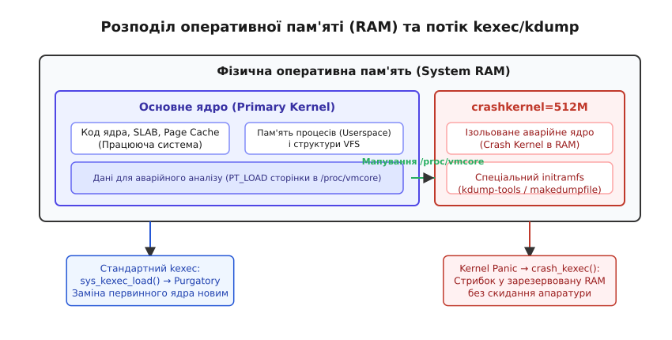
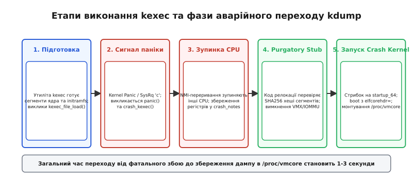

# kexec: завантаження нового ядра без прошивки, і kdump

<preknowlist>
- [Ланцюг завантаження](root:sys-unix/boot-chain) — від прошивки до першого процесу керування передають по черзі.
- [Ядро й простір користувача](root:sys-unix/kernel-and-userspace) — межі виконання та обробка катастрофічних помилок.
- [Initramfs: тимчасовий корінь](root:sys-unix/initramfs) — архів, що працює коренем до змонтування справжнього.
- [Псевдо-ФС: procfs, sysfs, tmpfs, devtmpfs](root:sys-unix/pseudo-filesystems) — каталоги й файли, що генеруються ядром у пам'яті.
</preknowlist>

Коли корпоративний сервер із кількома терабайтами оперативної пам'яті, багатоклітинними процесорними сокетами (NUMA) та десятками контролерів PCIe під час високого навантаження зазнає катастрофічного збою (Kernel Panic), стандартне апаратне перезавантаження перетворюється на тривалу проблему для всієї інфраструктури. Ззвичайний цикл живлення вимагає повного проходження прошивки UEFI або BIOS: перевірки цілісності оперативної пам'яті (DRAM training), ініціалізації таблиць ACPI, опитування контролерів шин PCI Express, скидання масивів NVMe та ініціалізації контролерів SAS/SATA. На сучасних серверах цей апаратний процес займає від 5 до 15 хвилин простою.

Найгіршим наслідком апаратного перезавантаження є повна і безповоротна втрата стану оперативної пам'яті у мить падіння. Струм на мікросхемах RAM скидається, і всі внутрішні структури ядра, таблиці сторінок віртуальної пам'яті та вміст системного буфера повідомлень зникають. Інженери залишаються наодинці з панікуючою системою без жодного шансу з'ясувати root cause — точну причинно-наслідкову ланку збою.

Для розв'язання цієї проблеми в ядрі Linux було створено двоєдиний інженерний механізм: **kexec** та **kdump**. Механізм kexec забезпечує гарячий запуск нового ядра безпосередньо з оперативної пам'яті без звернення до апаратної прошивки, а технологія kdump використовує цю можливість для ізольованого запуску аварійного ядра (Crash Kernel) і збереження точного дампу пам'яті померлої системи.


*Розподіл оперативної пам'яті між первинним ядром та зарезервованою областю crashkernel, а також потік читання /proc/vmcore.*

## Анатомія kexec: заміна ядра прямо в RAM

Концепція **kexec** (Kernel Execution) полягає в тому, що працююче ядро Linux сприймає новий образ ядра та його initramfs просто як набір звичайних даних у оперативній пам'яті. Замість передачі управління прошивці плати, поточне ядро підготовлює апаратуру, зупиняє периферійні пристрої та виконує прямий ассемблерний стрибок на точку входу нового ядра.

### Системні виклики kexec_load та kexec_file_load

На межі між простором користувача та ядром підсистема kexec надає два системні виклики. Початковий системний виклик `kexec_load()` приймає від утиліти `kexec` (з пакету `kexec-tools`) вже сформований масив сегментів пам'яті. У цій схемі розпакування образу ядра `vmlinuz`, розбір його заголовків bzImage чи ELF та створення ассемблерних інструкцій покладаються на утиліти простору користувача.

```c
long syscall(SYS_kexec_load, unsigned long entry, unsigned long nr_segments,
             struct kexec_segment *segments, unsigned long flags);
```

Однак під час впровадження механізму UEFI Secure Boot класичний `kexec_load()` створив серйозну загрозу безпеці. Оскільки утиліта користувацького простору передає в ядро вже сирі сегменти пам'яті, користувач із правами root міг передати модифіковані байти ядра або довільний модифікований код. Це дозволяло виконати шкідливий код у режимі ядра (ring 0) в обхід перевірок цифрових підписів Secure Boot.

Для усунення цієї проблеми був створений системний виклик **`kexec_file_load()`**.

```c
long syscall(SYS_kexec_file_load, int kernel_fd, int initrd_fd,
             unsigned long cmdline_len, const char *cmdline,
             unsigned long flags);
```

На відміну від свого попередника, `kexec_file_load()` приймає лише відкритий файловий дескриптор підписаного образу ядра (`vmlinuz`). Ядро Linux самостійно розбирає файл у ядерному просторі, витягує цифровий підпис із сертифікатної таблиці PE/COFF і перевіряє його за допомогою ключів із системного рингу ядра (`.builtin_trusted_keys`). Якщо підпис відсутній або недійсний, системний виклик повертає помилку `EKEYREJECTED` і відмовляється завантажувати ядро. Детальний структурний аналіз обох викликів та їхніх прапорців наведений у [довіднику системних викликів та файлів sysfs/procfs](root:sys-unix/kexec-and-kdump/api-kexec-interface.md).

Сегменти пам'яті нового ядра описуються структурою `struct kexec_segment`:

```c
struct kexec_segment {
    const void *buf;     // Буфер із даними у просторі користувача
    size_t bufsz;        // Розмір даних у буфері в байтах
    const void *mem;     // Цільова фізична адреса у пам'яті (вирівняна по PAGE_SIZE)
    size_t memsz;        // Загальний виділений розмір сегмента у RAM
};
```

Розмір `memsz` зобов'язаний бути не меншим за `bufsz`. Якщо `memsz > bufsz`, ядро автоматично заповнює різницю байтів нулями, що використовується для ініціалізації секції `.bss` нового ядра.

### Проміжний код релокації: Purgatory Stub

Головна технічна вимога kexec полягає у заміні коду поточного ядра новим кодом. Проте нове ядро має завантажуватися за тими самими фізичними адресами у пам'яті, які в цю мить займає поточне працююче ядро. Поточне ядро не здатне записати нові байти поверх власного виконуваного коду, оскільки це призведе до негайного падіння процесора при виконанні наступної інструкції.

Для вирішення цієї суперечності ядро під час виконання системного виклику kexec виділяє спеціальну «контрольну сторінку» (Control Page). Ця сторінка розташовується поза межами зон майбутньої перезапису новою системою. У цю сторінку розміщується проміжний ассемблерний код релокації — **purgatory** («чистилище»).


*Послідовність фаз від ініціації kexec або настання Kernel Panic до завантаження аварійного ядра та генерації дампу.*

Послідовність дій коду purgatory при виконанні переходу:
1. **Перевірка SHA256-контрольних сум**: Purgatory обчислює SHA256-хеші всіх сегментів нового ядра, розміщених у тимчасових буферах пам'яті, і порівнює їх із контрольною сумою, сформованою на етапі `kexec_load`. Це гарантує, що пам'ять не була пошкоджена під час очікування.
2. **Переключення в ідентичне відображення (Identity Mapping)**: Таблиці сторінок переключаються у режим, де віртуальна адреса точно дорівнює фізичній адресі. Це дозволяє безпечно вимкнути MMU без втрати виконання наступної інструкції.
3. **Перезапис фізичної пам'яті**: Purgatory копіює підготовлені сегменти нового ядра з тимчасових буферів на їхні фінальні фізичні адреси, фізично затираючи старе ядро у RAM.
4. **Скидання апаратного стану CPU**: Purgatory очищує кеші процесора (L1/L2/L3), скидає системні регістри `CR0`, `CR3`, `CR4` та `EFER`, вимикає блокування блоків MMU та очищає глобальну таблицю дескрипторів GDTR і таблицю переривань IDTR, повертаючи CPU у початковий 64-бітний режим, на який розраховує точка входу нового ядра.
5. **Підготовка системних параметрів**: На архітектурі x86_64 у регістр `RSI` записується адреса структури `boot_params` (zero-page), а на ARM64 у регістр `X0` записується адреса скомпільованого дерева пристроїв (DTB).
6. **Прямий стрибок**: Процесор виконує інструкцію `jmp` на фізичну адресу точки входу нового ядра (`startup_64` або `primary_entry`).

### Зупинка периферії: device_shutdown та IOMMU

Найбільш критичною ланкою гарячого завантаження kexec є периферійне залізо з підтримкою прямого доступу до пам'яті (DMA). Якщо контролер мережевої карти, мережевий адаптер Fibre Channel або RAID-контролер продовжить виконувати DMA-транзакції запису під час копіювання коду в purgatory, він перезапише дані нового ядра та спричинить апаратний краш шини (Bus Fault).

Для запобігання цьому ядро перед переходом виконує процедуру `kernel_kexec()`, яка по черзі викликає метод `.shutdown()` для кожного драйвера у системному дереві пристроїв sysfs. Драйвери посилають апаратурі команди зупинки, скасовують активні Ring-буфери DMA та деактивують обробники переривань.

Окремо ядро деактивує апаратні розширення віртуалізації (KVM із VMX на Intel чи SVM на AMD), оскільки процесор, заблокований у режимі VMX Root Operation, відмовиться виконувати старт нового ядра. Також повністю вимикаються або скидаються трансляції контролера IOMMU (VT-d / AMD-Vi).

Всі допоміжні процесорні ядра (Secondary CPUs) отримують міжпроцесорне переривання IPI (Inter-Processor Interrupt) високого пріоритету і переходять у стан зупинки (`halt`). Весь процес kexec виконується виключно на одному первинному процесорі.

## kdump: захоплення дампу при Kernel Panic

У той час як kexec розроблявся для планового гарячого перезавантаження, технологія **kdump** застосовує механіку kexec для виклику аварійного ядра (Crash Kernel) у випадку настання фатальних збоїв (Kernel Panic, Oops, NMI watchdog timeout).

### Ненадійність панікуючого ядра

Коли ядро Linux викликає функцію `panic()`, внутрішні структури даних системи вважаються зіпсованими. Таблиці сторінок віртуальної пам'яті можуть вказувати на звільнені сторінки, м'ютекси підсистеми VFS або драйверів дисків можуть перебувати у стані взаємного блокування (deadlock), а списки вільної пам'яті (buddy allocator) — зруйновані.

З огляду на це, спроба збійного ядра самостійно записати дамп на диск або відправити його через мережевий стек призводить до повторного падіння (double panic) або руйнування метаданих файлових систем на дисках. Повний історичний контекст відмови від старих рішень на користь kdump викладено в [історії створення kexec та kdump](root:sys-unix/kexec-and-kdump/hist-kexec-origin.md).

Архтектурне рішення kdump полягає в тому, щоб панікуюче ядро взагалі не виконувало операцій із дисками чи мережею. Воно робить лише один мінімальний виклик `crash_kexec()`, який миттєво перемикає процесор на абсолютно чисте, заздалегідь завантажене аварійне ядро (Crash Kernel).

### Резервування пам'яті crashkernel

Щоб Crash Kernel гарантовано завантажилося після паніки, воно повинно знаходитися в оперативній пам'яті заздалегідь. Під час звичайного завантаження первинного ядра розміщується застереження пам'яті за допомогою параметра командного рядка `crashkernel=`:

```text
# Зарезервувати фіксовані 512 МБ RAM під Crash Kernel
crashkernel=512M

# Динамічна схема резервування залежно від обсягу RAM
crashkernel=4G-64G:256M,64G-:512M

# Двокомпонентна розкладка для багатьох ГБ RAM на x86_64
crashkernel=512M,high crashkernel=128M,low
```

Розподільник пам'яті ядра (Memblock) під час старту системи вирізає вказану ділянку з загального використання. Параметр `crashkernel=128M,low` гарантує виділення 128 МБ пам'яті у нижньому 32-бітному просторі (нижче 4 ГБ) для задоволення вимог застарілих пристроїв з 32-бітним DMA, тоді як основний код аварійного ядра поміщається вище 4 ГБ через `crashkernel=512M,high`.

Первинне ядро ніколи не виділяє з цієї зони сторінки для системних процесів чи кешів. За допомогою прапорця `KEXEC_ON_CRASH` служба `kdump.service` завантажує образ аварійного ядра та його initramfs у цю зарезервовану ділянку. Перевірити стан готовності kdump можна переглянувши вміст псевдофайлу `/sys/kernel/kexec_crash_loaded`.

```c
/* Алгоритм роботи функції panic() у ядрі Linux */
void panic(const char *fmt, ...)
{
    // 1. Вимкнення переривань на локальному CPU
    local_irq_disable();
    
    // 2. Надсилання NMI іншим CPU для збереження їхніх регістрів
    crash_smp_send_stop();
    
    // 3. Негайне виконання kexec у Crash Kernel
    crash_kexec(NULL);
    
    // 4. Запасний нескінченний цикл, якщо kdump не налаштований
    for (;;) ;
}
```

Під час паніки функція `crash_smp_send_stop()` надсилає всім іншим процесорам немасковане переривання NMI (Non-Maskable Interrupt). Отримавши NMI, процесори зупиняють виконання завдань, зберігають поточний стан своїх регістрів (RAX, RBX, RIP, RSP) у спеціальні ядерні буфери `crash_notes` і переходять у режим зупинки. Після цього первинний CPU стрибає у зарезервовану область Crash Kernel.

## Мапування /proc/vmcore та роль VMCOREINFO

Аварійне ядро (Crash Kernel) завантажується у своїх зарезервованих 512 МБ пам'яті із параметром завантаження `elfcorehdr=`. Цей параметр містить фізичну адресу ELF-заголовка, сформованого первинним ядром перед виконанням панічного стрибка.

Після монтування псевдофайлової системи `procfs` у середовищі Crash Kernel з'являється об'єкт **`/proc/vmcore`**.

### Внутрішня структура /proc/vmcore

Файл `/proc/vmcore` не займає фізичного місця на носіях і не копіює дані в RAM. Це прозорий віртуальний інтерфейс, який представляє всю оперативну пам'яті померлого первинного ядра у форматі 64-бітного ELF Core Dump (`ET_CORE`).

```text
+-------------------------------------------------------------------+
| ELF Header (Elf64_Ehdr)                                           |
+-------------------------------------------------------------------+
| Program Header: PT_NOTE  ----> Посилання на crash_notes (Регістри)|
| Program Header: PT_NOTE  ----> Посилання на блок VMCOREINFO       |
| Program Header: PT_LOAD  ----> Фізичний блок RAM 0x0000 - 0x10000 |
| Program Header: PT_LOAD  ----> Фізичний блок RAM 0x1000 - 0x80000 |
+-------------------------------------------------------------------+
| Байти фізичної пам'яті померлого ядра (доступні для читання)      |
+-------------------------------------------------------------------+
```

Програмні заголовки `PT_LOAD` відповідають суцільним діапазонам фізичної пам'яті померлої системи. Коли зовнішня програма читає байти з `/proc/vmcore` за певним зсувом, аварійне ядро мапує відповідні фізичні сторінки старого ядра і повертає їх у користувацький простір.

### Метадані VMCOREINFO

Для аналізу дампу інструментам розшифровки необхідна інформація про точні зсуви структур даних конкретної збірки ядра. Первинне ядро перед панікою записує в пам'ять текстову нотатку **`VMCOREINFO`**.

Ключові параметри блока `VMCOREINFO`:
- **`OSRELEASE`**: Версія ядра (наприклад, `6.8.0-40-generic`).
- **`PAGESIZE`**: Розмір сторінки віртуальної пам'яті (4096 байтів).
- **`SYMBOL(init_task)`**: Віртуальна адреса головного процесу системи.
- **`OFFSET(task_struct.tasks)`**: Зсув елемента списку процесів у структурі `task_struct`.
- **`KERNELOFFSET`**: Величина зміщення KASLR (Kernel Address Space Layout Randomization). Оскільки сучасні ядра завантажуються за рандомізованими адресами у віртуальному просторі, `KERNELOFFSET` описує точний зсув між адресами у файлі `vmlinux` та реальними адресами у дампі пам'яті.

## Фільтрація та збереження за допомогою makedumpfile

Якщо сервер мав 512 ГБ оперативної пам'яті, повне збереження `/proc/vmcore` вимагатиме 512 ГБ дискового простору та тривалого часу на запис. Однак переважна більшість сторінок пам'яті містить дисковий кєш (Page Cache), буфери користувацьких процесів або вільні сторінки, які не мають значення для визначення причин паніки ядра.

Для оптимізації розміру дампу в initramfs аварійного ядра виконується утиліта **`makedumpfile`**.

```bash
# Типова команда фільтрації та стиснення дампу
makedumpfile -l --message-level 1 -d 31 /proc/vmcore /var/crash/2026-08-14/vmcore.dump
```

Параметр `-d 31` задає маску фільтрації (Dump Level `0x1F`):

```text
0x01 (1)  — Виключити сторінки, заповнені нулями (Zero pages)
0x02 (2)  — Виключити сторінки кєшу дискових операцій (Cache pages)
0x04 (4)  — Виключити приватні сторінки кєшу (Cache private)
0x08 (8)  — Виключити сторінки пам'яті користувацьких процесів (User pages)
0x10 (16) — Виключити вільні незайняті сторінки (Free pages)
-----------------------------------------------------------------
Маска = 31 (0x1F) — Залишити виключно сторінки коду та даних ядра
```

Двоетапний алгоритм обробки `makedumpfile`:
1. **Перший прохід (Bitmap Scanning)**: Утиліта аналізує блок `VMCOREINFO` та сканує масив `mem_map` (структури `struct page`). Вона будує двобітову маску в пам'яті, позначаючи сторінки, що підлягають виключенню (zero pages, free pages, page cache).
2. **Другий прохід (Compression & Transport)**: Утиліта читає лише відмічені корисні сторінки з `/proc/vmcore`, стискає їх алгоритмом LZO або zlib та записує у локальний файл або передає через мережу (NFS, SFTP, iSCSI).

Завдяки такій фільтрації підсумковий дамп сервера з 512 ГБ RAM зменшується до 300–800 Мегабайтів, а час його збереження на диск або мережеве сховище NFS/SSH скорочується до кількох секунд. Створення власних системних утиліт завантаження та викликів описує [практичний проект завантаження ядра з C та C++](root:sys-unix/kexec-and-kdump/proj-kexec-reboot.md).

## Конфігурація та тестування у виробничому середовищі

У корпоративних дистрибутивах Linux (RHEL, Rocky Linux, Ubuntu Server) керування kdump автоматизовано через системну службу `kdump.service` та конфігураційний файл `/etc/kdump.conf`.

Конфігураційний файл `/etc/kdump.conf` визначає цільове місце збереження дампу та додаткові параметри завантаження аварійного ядра:

```text
# Варіанти сховища дампу: локальний диск, NFS або SSH
path /var/crash
# nfs mydump-server.local:/srv/crash
# ssh user@mydump-server.local

# Утиліта збору та рівень фільтрації
core_collector makedumpfile -l --message-level 1 -d 31

# Дії у разі невдалого збереження дампу (reboot, halt, shell)
default_action reboot
```

Під час запуску служби `kdump.service` вона використовує утиліту `dracut` або `kdump-config` для збірки спеціалізованого аварійного `initramfs` (у `/var/lib/kdump/initramfs.img`). Цей initramfs містить виключно ті драйвери дискових контролерів або мережевих карт, які необхідні для запису за вказаним у `/etc/kdump.conf` шляхом, мінімізуючи обсяг споживання пам'яті у зарезервованій зоні `crashkernel`.

### Симуляція паніки для тестування (SysRq)

Для перевірки коректності конфігурації та автоматичного завантаження Crash Kernel у тестовому середовищі використовують симуляцію штучної паніки через інтерфейс SysRq ядра:

```bash
# Перевірити, чи Crash Kernel завантажено у RAM (має повернути 1)
cat /sys/kernel/kexec_crash_loaded

# Увімкнути обробку команд SysRq
echo 1 > /proc/sys/kernel/sysrq

# Ініціювати штучний NULL pointer dereference (Спричинить негайну panic)
echo c > /proc/sysrq-trigger
```

Виконання команди `echo c > /proc/sysrq-trigger` розіменовує нульовий вказівник у контексті ядра. Система негайно припиняє виконання нормального ядра, виводить роздруківку Oops на системну консоль, виконує NMI-зупинку допоміжних CPU і через `crash_kexec` завантажує Crash Kernel. За кілька секунд у каталозі `/var/crash/` з'являється новий підкаталог з готовим файлом `vmcore.dump`.

## Крайові випадки, NUMA-архітектура та виклики перезавантаження

При впровадженні kexec та kdump у масштабах великих інфраструктур виникають специфічні апаратні та архітектурні крайові випадки, які вимагають додаткового налаштування ядра.

### 1. Багатосокетні NUMA-сервери

На серверах із кількома процесорними сокетами оперативна пам'ять фізично розподілена між вузлами NUMA (Non-Uniform Memory Access). Якщо зарезервувати область `crashkernel=` виключно у пам'яті сокета Node 0, а катастрофічний збій станеться на процесорі сокета Node 3, первинний CPU зобов'язаний передати переривання NMI та скопіювати стан регістрів через міжсокетну шину (Intel UPI / AMD Infinity Fabric).

Для запобігання паніці під час міжсокетної передачі ядро використовує спеціальні безапаратні атомарні кільцеві буфери для `crash_notes`. Якщо збій стався у самій підсистемі контролера пам'яті NUMA, ядро намагається задіяти локальний вузол пам'яті для виконання аварійного завантаження.

### 2. Пастка застрягання контролерів NVMe (`reset_devices`)

Коли Crash Kernel стартує після паніки, периферійні пристрої PCIe залишаються у тому стані, в якому їх застала паніка первинного ядра. Контролери NVMe можуть утримувати активні черги команд (Submission/Completion Queues) у пам'яті померлого ядра.

Якщо Crash Kernel спробує ініціалізувати новий драйвер NVMe без системного скидання контролера, пристрій поверне помилку або заблокує шину PCIe. Для усунення цієї проблеми в командний рядок Crash Kernel обов'язково додається параметр **`reset_devices`**. Отримавши цей параметр, всі драйвери пристроїв під час ініціалізації в аварійній системі виконують примусовий апаратний скид (PCIe Function Level Reset, FLR) для кожного під'єднаного контролера.

## Постмортем аналіз утилітою crash

Отриманий стиснутий файл дампу (`vmcore.dump`) аналізується за допомогою інтерактивного інструмента **`crash`**. Ця утиліта поєднує інтерфейс відлагоджувача GDB із розумінням внутрішніх типів даних Linux.

Для роботи утиліти потрібні два файли:
1. Збережений дамп пам'яті (`vmcore.dump`).
2. Файл ядра `vmlinux` із відлагоджувальними символами DWARF (із пакетів `kernel-debuginfo` або `linux-image-debug`).

```bash
crash /usr/lib/debug/boot/vmlinux-6.8.0-40-generic /var/crash/2026-08-14/vmcore.dump
```

```text
      KERNEL: /usr/lib/debug/boot/vmlinux-6.8.0-40-generic
    DUMPFILE: /var/crash/2026-08-14/vmcore.dump
        CPUS: 64
        DATE: Fri Aug 14 08:30:00 EEST 2026
      UPTIME: 14 days, 03:22:11
LOAD AVERAGE: 1.15, 1.08, 0.95
pxs > bt
PID: 41205  TASK: ffff8801a3b48000  CPU: 3  COMMAND: "bad_driver_worker"
 #0 [ffff8801a3b4bca0] panic at ffffffff810931e0
 #1 [ffff8801a3b4bd28] oops_end at ffffffff810174a0
 #2 [ffff8801a3b4bd50] no_context at ffffffff81061930
 #3 [ffff8801a3b4bda0] __bad_area_nosemaphore at ffffffff81061bf0
 #4 [ffff8801a3b4bdf0] page_fault at ffffffff818012e0
    [exception RIP: my_faulty_function+0x34]
    RIP: ffffffffa0112034 RSP: ffff8801a3b4bea8 RFLAGS: 00010246
    RAX: 0000000000000000 RBX: ffff880190b23000 RCX: 0000000000000001
```

### Основні команди діагностики в утиліті crash:

- **`bt` (Backtrace)**: Друк стека викликів функцій процесу, що викликав аварію. Вказує точну значення інструкційного вказівника (`RIP`) та послідовність викликів.
- **`ps`**: Список усіх процесів у системі на момент паніки із позначенням їхнього стану (`RUNNING`, `UNINTERRUPTIBLE`).
- **`log`**: Вивід вмісту системного буфера повідомлень ядра (`dmesg`), де збережені первинні повідомлення Oops.
- **`kmem -i`**: Загальна статистика використання оперативної пам'яті, SLAB-кешів та витоків пам'яті.
- **`struct <name> <address>`**: Форматований вивід вмісту будь-якої структури ядра за її віртуальною адресою (наприклад, `struct task_struct ffff8801a3b48000`).
- **`dis <symbol/address>`**: Дисасемблювання інструкцій ядра на місці аварії для локалізації проблемного місця в ассемблерному коді.
- **`files`**: Список усіх відкритих файлових дескрипторів та інодів для вибраного процесу.

Системний дует `kexec` та `kdump` формує основу високої надійності та швидкого відновлення сервісів Linux. Завдяки `kexec` операційні системи виконують гарячу заміну ядра за кілька секунд, а `kdump` надає інженерам вичерпну інформацію для точного локалізації та виправлення складних помилок ядра.
