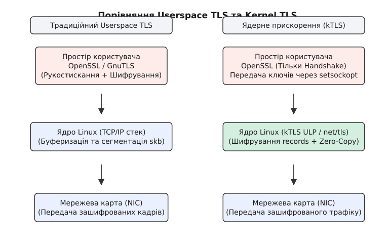
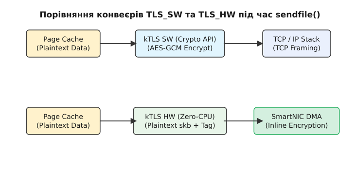
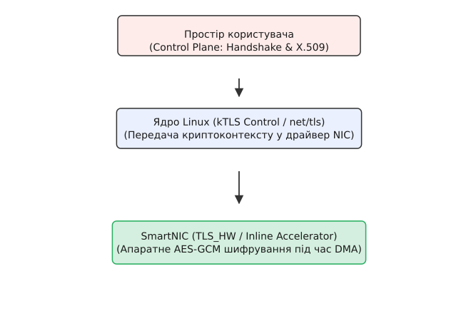

# Ядерне прискорення TLS (kTLS / TLS_HW / TLS_SW)

<preknowlist>
- [Сокети в Linux](root:sys-unix/socket-api-linux) — створення TCP-сокетів, виклики `setsockopt` та конфігурація опцій розширення.
- [Мережевий стек ядра Linux](root:sys-unix/network-stack-architecture) — проходження `sk_buff` крізь підсистему ULP та TCP-стек.
- [Передача без копіювання: sendfile і splice](root:sys-unix/zero-copy) — передача сторінок Page Cache без виходу у простір користувача.
- [Протокол TLS](root:sf-security/tls) — формат TLS-записів (Record Header), симетричні шиفري AEAD та розмежування Handshake і Data Plane.
</preknowlist>

Коли мережевий трафік глобального інтернету стає повністю шифрованим, навантаження на сервери доставки контенту (CDN), стримінгові відеоплатформи та базовані на Linux балансувальники навантаження зростає по експоненті. Традиційна модель обробки протоколу Transport Layer Security (TLS), у якій вся шифрувальна робота відбувається всередині користувацьких бібліотек у просторі користувача (userspace), створює фатальне вузьке місце для продуктивності системного вводу-виводу.

Для подолання цих обмежень у ядрі Linux було впроваджено технологію **Kernel TLS (kTLS)**. kTLS виносить симетричне шифрування та дешифрування TLS-записів безпосередньо у стек мережевих сокетів ядра. Це усуває зайве копіювання пам'яті, повертає ефективність системному виклику `sendfile()` і відкриває можливість повного апаратного розвантаження шифрування (Hardware Offload) на сучасні мережеві карти SmartNIC.

Детальний перебіг розробки kTLS та виклики 100-гігабітних мереж висвітлено у вставці [Історія виникнення kTLS](root:sys-unix/ktls-hw-offload-and-enablement/hist-ktls-evolution.md).

---

## 1. Фундаментальний конфлікт між TLS та Zero-Copy VFS

Щоб зрозуміти, чому виникла потреба перенести TLS у ядро, необхідно розібрати внутрішній шлях даних (data path) при передачі статичного файлу (наприклад, відеосегмента 4K) по мережі.

### Традиційна модель обробки HTTP (без шифрування)

У часи незашифрованого HTTP вебсервер передавав файли за допомогою системного виклику `sendfile()`:

1. Мережевий сервер викликає `sendfile(socket_fd, file_fd, &offset, count)`.
2. Ядро Linux ініціює DMA-передачу з диска в операційну пам'ять — у дисковий кеш (Page Cache).
3. Мережева підсистема ядра створює структури `sk_buff` (socket buffers), які містять прямі вказівники (Scatter-Gather vectors) на сторінки Page Cache.
4. Мережева карта (NIC) за допомогою контролера DMA зчитує ці сторінки безпосередньо з оперативної пам'яті та випромінює Ethernet-кадри в дріт.

У цій схемі центральний процесор (CPU) **взагалі не торкається байтів даних**: дані не копіюються між ядром і простіром користувача. Це і є класична концепція Zero-Copy.

### Руйнування Zero-Copy при переході на HTTPS

Як тільки до каналу додається шифрування TLS у користувацькому просторі (OpenSSL, BoringSSL, GnuTLS), ця елегантна схема ламається. Оскільки симетричне шифрування (наприклад, AES-GCM) модифікує кожен байт даних і додає до кожного кадру заголовок (TLS Record Header) та аутентифікаційний теґ (Auth Tag), файл не може бути переданий у сокет як є.

```
Шлях даних при традиційному Userspace TLS:

[ NVMe Диск ]
      │ (DMA)
      ▼
[ Kernel Page Cache ] ──(Copy 1: System Call read)──> [ Userspace Memory ]
                                                              │
                                                      (Crypto AES-NI)
                                                              │
[ NIC Hardware ] <──(DMA)── [ Kernel skb ] <──(Copy 2: send/write)──┘
```

Процес передачі зашифрованих даних перетворюється на виснажливий ланцюг операцій:
1. `read()`: Ядро копіює дані з Page Cache у буфер користувацького простору (перше копіювання).
2. `SSL_write()`: Бібліотека OpenSSL виконує шифрування у користувацькому просторі, витрачаючи крім тактів шифрування процесорний кеш (L1/L2 cache pollution).
3. `write()` / `send()`: Ядро копіює зашифрований буфер із користувацького простору назад у нові буфери ядра `sk_buff` (друге копіювання).
4. Перемикання контексту: Кожна транзакція вимагає щонайменше двох системних викликів на блок даних, генеруючи шторм переривань ядра.

При швидкостях мережі 100 Гбіт/с і вище (що відповідає передачі ~12.5 Гігабайт даних на секунду) шифрування у користувацькому просторі створює колосальний оверхед. Процесор витрачає до 70% свого часу не на самі обчислення AES, а на переміщення байтів між регіонами пам'яті, обслуговування переривань системних викликів та перезавантаження ліній процесорного кешу (cache thrashing).

> 🔧 **Навіщо це.** Якщо ваш сервер віддає зашифрований трафік на швидкості понад 10 Гбіт/с, традиційний Userspace TLS блокує лінійне масштабування через пропускну здатність шини пам'яті та оверхед системних викликів. kTLS повертає можливість передавати дані прямо з Page Cache через `sendfile()`.

---

## 2. Архітектурна концепція kTLS: Control Plane проти Data Plane

Головний концептуальний прорив kTLS полягає в тому, що ядро Linux **не намагається реалізувати весь протокол TLS повністю**. Творці kTLS чітко розділили життя сокета на дві фази:


*Рис. 1. Архітектурне порівняння Userspace TLS та Kernel TLS (kTLS)*

### 1. Control Plane (Фаза рукостискання) — Користувацький простір

Встановлення з'єднання (Handshake) — це надзвичайно складна процедура, що включає обмін сертифікатами X.509, розбір ASN.1, перевірку ланцюжків довіри, асиметричну криптографію (RSA, ECDSA, ECDHE, X25519) та узгодження великої кількості розширень TLS Extensions.

Цей процес відбувається відносно рідко (один раз на з'єднання) і вимагає гнучкості. Тому фаза Handshake **повністю залишається у користувацькому просторі** в бібліотеці OpenSSL, GnuTLS або BoringSSL. Ядро Linux абсолютно нічого не знає про сертифікати та публічні ключі.

### 2. Data Plane (Симетрична обробка записів) — Ядро Linux

Після успішного завершення Handshake криптографічна бібліотека виводить підсумкові симетричні ключі (Session Keys), ініціалізаційні вектори (IV), соляні значення (Salt) та початкові номери послідовностей (Sequence Numbers) для вихідного (TX) та вхідного (RX) напрямків.

У цей момент додаток робить виклик `setsockopt()`, передаючи ці симетричні параметри ядру Linux. Бібліотека OpenSSL відключає власне симетричне шифрування, а сокет у ядрі стає "TLS-обізнаним". Усі наступні операції `write()`, `read()`, `sendfile()` або `splice()` виконуються так, ніби сокет є звичайним незашифрованим TCP-сокетом, а ядро прозоро шифрує та дешифрує TLS-записи (TLS Records) «на льоту».

---

## 3. Внутрішня будова kTLS у ядрі Linux: Підсистема ULP (`net/tls`)

Усередині ядра Linux підсистема kTLS реалізована у вигляді модуля `net/tls` із використанням механізму **ULP (Upper Layer Protocol)**.

### Розміщення kTLS у мережевому стеку

У класичній системі сокетів BSD структура `struct sock` спілкується з транспортним протоколом `struct tcp_sock` безпосередньо. Підсистема ULP дозволяє вклинитися між сокетним шаром VFS та TCP-стеком:

```
[ VFS System Call Surface: write / sendfile / read ]
                         │
                         ▼
             [ struct socket / struct sock ]
                         │
                         ▼
        [ kTLS ULP Layer (net/tls/tls_sw.c) ]
           ├── TX: tls_sw_sendmsg() / tls_sw_sendpage()
           └── RX: tls_sw_recvmsg() / strparser
                         │
                         ▼
     [ Linux Kernel Crypto API (crypto_aead) ]
                         │
                         ▼
               [ TCP Stack (tcp_sendmsg) ]
                         │
                         ▼
                 [ IP / Device Driver ]
```

Коли на TCP-сокеті активовано ULP `"tls"`, ядро замінює стандартні таблиці операцій сокета `sk_prot` на спеціалізовані kTLS-функції:
- Замість `tcp_sendmsg()` викликається `tls_sw_sendmsg()`.
- Замість `tcp_sendpage()` викликається `tls_sw_sendpage()`.
- Замість `tcp_recvmsg()` викликається `tls_sw_recvmsg()`.

### Контекст сокета: `struct tls_context`

Для кожного kTLS-сокета ядро виділяє структуру `struct tls_context`, яка зберігає повний стан TLS-з'єднання:

:::tabs
```c
/* Спрощена концептуальна схема структур ядра з net/tls */
struct tls_sw_context_tx {
    struct crypto_aead *aead_send;  /* Хендл симетричного шифру з Crypto API */
    struct scatterlist sg_tx_data[MAX_SKB_FRAGS]; /* SG-список незашифрованих сторінок */
    u64 rec_seq;                    /* 64-бітний порядковий номер запису TLS TX */
    char iv[TLS_CIPHER_AES_GCM_128_IV_SIZE];
    char rec_seq_size;
};

struct tls_context {
    struct sock *sk;
    enum tls_offload_mode tx_conf;  /* TLS_SW або TLS_HW */
    enum tls_offload_mode rx_conf;
    void *priv_ctx_tx;              /* Вказує на struct tls_sw_context_tx */
    void *priv_ctx_rx;
};
```
```cpp
// C++20 представлення внутрішніх структур ядра
struct tls_sw_context_tx {
    struct crypto_aead *aead_send;
    struct scatterlist sg_tx_data[MAX_SKB_FRAGS];
    uint64_t rec_seq;
    char iv[TLS_CIPHER_AES_GCM_128_IV_SIZE];
    char rec_seq_size;
};

struct tls_context {
    struct sock *sk;
    enum tls_offload_mode tx_conf;  // TLS_SW або TLS_HW
    enum tls_offload_mode rx_conf;
    void *priv_ctx_tx;
    void *priv_ctx_rx;
};
```
:::

### Взаємодія з Linux Kernel Crypto API та механіка Scatterlist

Для програмного шифрування kTLS використовує підсистему **Linux Kernel Crypto API**. Під час налаштування ключів модуль `net/tls` викликає `crypto_alloc_aead()` (наприклад, для `"gcm(aes)"` або `"rfc7539(chacha20,poly1305)"`).

Коли програма передає дані у сокет через `tls_sw_sendmsg()` або `tls_sw_sendpage()`, kTLS не виділяє нові суцільні буфери пам'яті у кілобайтах. Натомість він будує список розсіяння-збирання (`struct scatterlist`), у якому вказує вказівники на фізичні сторінки пам'яті (Page Cache або буфери ядра).

1. **Додавання TLS Record Header:** На початку кожного запису (максимальний розмір `16384` байти) kTLS додає 5-байтний заголовок TLS Record Header (ContentType, Version, Length).
2. **Аутентифіковане додаткове корисне навантаження (AAD):** 5-байтний заголовок TLS та 8-байтний номер послідовності `rec_seq` подаються на вхід алгоритму AEAD як Additional Authenticated Data (AAD).
3. **Виконання криптографії:** Метод `crypto_aead_encrypt()` викликається над `scatterlist`. Якщо процесор підтримує інструкції AES-NI та AVX-512, шифрування здійснюється за один прохід векторними регістрами.
4. **Додавання Auth Tag:** У кінець кадру додається 16-байтний аутентифікаційний теґ (Auth Tag / MAC).

---

## 4. Механізм прийому трафіку RX (TLS_SW / TLS_HW RX)

Окрім відправки даних (TX), kTLS забезпечує високоефективне дешифрування вхідного трафіку (RX). Це критично для систем зворотного проксі (Reverse Proxy), СУБД та сервісів обробки запитів.

### Роль підсистеми `strparser` (Stream Parser) у напрямку RX

На відміну від вихідного потоку, де ядро чітко знає кордони записів, вхідний TCP-потік є безперервною послідовністю байтів, у якій TLS-записи можуть бути розбиті на декілька TCP-сегментів або, навпаки, декілька записів можуть бути упаковані у один TCP-пакет.

Для вирішення цієї проблеми у ядрі використано підсистему **`strparser` (Stream Parser)**:
1. `strparser` перехоплює вхідні TCP-пакети `sk_buff` на рівні сокета.
2. Він зчитує перші 5 байтів заголовка TLS Record Header, щоб визначити довжину поточного TLS-запису.
3. `strparser` накоплює необхідну кількість TCP-сегментів у буфері прийому доти, доки повний TLS-запис (включаючи Auth Tag) не буде зібраний у пам'яті.
4. Після цього розпарсений запис передається у `tls_sw_recvmsg()`, де за допомогою Kernel Crypto API виконується перевірка Auth Tag та дешифрування.
5. Захищені корисні байти розблоковуються для зчитування користувацьким викликом `read()` або `recv()`.

---

## 5. Режими розвантаження: TLS_SW проти TLS_HW (Hardware Offload)

Залежно від можливостей обладнання, kTLS може працювати у двох основних режимах розвантаження.


*Рис. 2. Схема проходження даних через конвеєр sendfile() у режимах TLS_SW та TLS_HW*

### 5.1. Режим TLS_SW (Software Kernel Acceleration)

У режимі **TLS_SW** симетричне шифрування здійснюється центральним процесором (CPU), але всередині ядра ОС через Kernel Crypto API.

Хоча обчислення криптографії все ще виконуються на CPU, цей режим дає колосальні переваги:
- **Усунення копіювання користувацького простору:** Дані копіюються нуль разів між ядром та userspace.
- **Відсутність перемикання контекстів:** Передача файлу розміром 1 Гігабайт здійснюється кількома системними викликами `sendfile()`, замість сотень тисяч викликів `read()`/`write()`.
- **Ефективне використання CPU cache:** Зчитування та шифрування здійснюються в рамках єдиного проходу ядра по сторінках оперативної пам'яті.

### 5.2. Режим TLS_HW / TLS_DEVICE (Hardware Inline Offload)

Якщо у сервері встановлено сучасний мережевий адаптер класу SmartNIC (наприклад, Nvidia/Mellanox ConnectX-6/7 або Chelsio T6), ядро Linux може піти ще далі і повністю звільнити CPU від шифрування.


*Рис. 3. Апаратне розвантаження TLS_HW на рівні мережевої карти SmartNIC*

У режимі **TLS_HW (Inline TLS Offload)**:
1. Під час виконання `setsockopt(TLS_TX)` ядро викликає драйвер мережевої карти через функцію `ndo_tls_dev_add()`. Драйвер програмує апаратні таблиці контекстів у пам'яті SmartNIC.
2. Програма викликає `sendfile()`.
3. Ядро формує TCP-пакети, що містять **незашифровані (plaintext)** дані з Page Cache, але додає до буфера `sk_buff` спеціальний мета-прапорець апаратного розвантаження (`skb->decrypted = 0`, TLS HW context ID).
4. Мережева карта SmartNIC під час виконання DMA-читання оперативної пам'яті за допомогою власного криптографічного процесора **«на льоту» (inline)** шифрує корисне навантаження TCP-пакета, обчислює Auth Tag, замінює незашифровані байти на шифротекст і випромінює Ethernet-кадр у дріт.

При режимі **TLS_HW** досягається **абсолютний Zero-Copy + Zero-CPU Crypto**: процесор сервера витрачає точно таку ж кількість енергії та тактів, як при передачі звичайного незашифрованого HTTP-трафіку!

### 5.3. Обробка ретрансляцій та фолбек (Hardware Resync & Fallback)

Мережа TCP не є ідеальною: пакети можуть втрачатися, а порядкові номери ретрансляцій (TCP Retransmissions) можуть приходити з відхиленням від послідовності. Як SmartNIC обробляє випадок, коли втрачено пакет у середині TLS-запису?

1. **Retransmission у TLS_HW:** Сучасні SmartNIC підтримують таблицю станів TCP. Якщо ядро повторно відправляє пакет TCP, NIC витягує необхідний порядковий номер TLS-запису та IV з апаратної таблиці та виконує повторне шифрування саме цього сегмента.
2. **Протокол Hardware Resync:** Якщо у напрямку прийому RX мережева карта втратила кадри і не може визначити кордон TLS-запису, вона надсилає драйверу запит ресинхронізації `ndo_tls_dev_resync()`. Драйвер ядра відновлює поточний `rec_seq` та повертає картку в робочий стан.
3. **Переповнення таблиці картки:** Якщо у SmartNIC закінчується пам'ять для зберігання сесій TLS (наприклад, на сервері понад 100 000 активних з'єднань), драйвер повідомляє ядро, і kTLS прозоро перемикає цей конкретний сокет у режим **TLS_SW**. З'єднання не розривається — шифрування просто тимчасово повертається на CPU ядра.

---

## 6. Програмування kTLS (API сокетів та Socket Options)

Повний довідник структур даних, прапорців та опцій сокетів можна знайти у вставці [Інтерфейс сокетів kTLS](root:sys-unix/ktls-hw-offload-and-enablement/api-ktls-ulp-and-setsockopt.md).

Нижче наведено базовий алгоритм налаштування сокета.

### Крок 1. Переведення сокета у стан ULP `"tls"`

Спочатку відкритомий і підключений TCP-сокет необхідно перевести під управління ULP-модуля `"tls"`:

:::tabs
```c
/* Приклад на C */
#include <sys/socket.h>
#include <netinet/tcp.h>

int sock_fd = accept(listen_fd, NULL, NULL);

/* Реєструємо ULP 'tls' для TCP сокета */
if (setsockopt(sock_fd, SOL_TCP, TCP_ULP, "tls", sizeof("tls")) < 0) {
    perror("Помилка активації ULP tls");
}
```
```cpp
// Приклад на C++20 (із перевіркою помилок через std::error_code)
#include <sys/socket.h>
#include <netinet/tcp.h>
#include <system_error>
#include <iostream>

void enable_tls_ulp(int sock_fd) {
    if (::setsockopt(sock_fd, SOL_TCP, TCP_ULP, "tls", sizeof("tls")) < 0) {
        throw std::system_error(errno, std::generic_category(), "Не вдалося встановити TCP_ULP tls");
    }
}
```
:::

### Крок 2. Передача симетричних ключів (`TLS_TX` / `TLS_RX`)

Після ініціалізації ULP сокет починає приймати опції рівня `SOL_TLS`. Заповнюється структура відповідного шифру (наприклад, AES-GCM 128 біт):

:::tabs
```c
/* Приклад на C: Встановлення ключів TX */
#include <linux/tls.h>
#include <string.h>

struct tls12_crypto_info_aes_gcm_128 crypto_info;
memset(&crypto_info, 0, sizeof(crypto_info));

crypto_info.info.version = TLS_1_2_VERSION; /* Або TLS_1_3_VERSION */
crypto_info.info.cipher_type = TLS_CIPHER_AES_GCM_128;

/* Копіюємо ключі, вилучені з OpenSSL після Handshake */
memcpy(crypto_info.key, aes_key, TLS_CIPHER_AES_GCM_128_KEY_SIZE);
memcpy(crypto_info.iv, gcm_iv, TLS_CIPHER_AES_GCM_128_IV_SIZE);
memcpy(crypto_info.salt, gcm_salt, TLS_CIPHER_AES_GCM_128_SALT_SIZE);
memcpy(crypto_info.rec_seq, seq_number, TLS_CIPHER_AES_GCM_128_REC_SEQ_SIZE);

/* Активуємо шифрування вихідного потоку */
if (setsockopt(sock_fd, SOL_TLS, TLS_TX, &crypto_info, sizeof(crypto_info)) < 0) {
    perror("Помилка setsockopt TLS_TX");
}
```
```cpp
// Приклад на C++20 з використанням std::span
#include <linux/tls.h>
#include <cstring>
#include <span>
#include <system_error>

void set_ktls_tx_keys(int sock_fd, 
                      std::span<const uint8_t, 16> key,
                      std::span<const uint8_t, 8> iv,
                      std::span<const uint8_t, 4> salt,
                      uint64_t seq_num) {
    struct tls12_crypto_info_aes_gcm_128 info{};
    info.info.version = TLS_1_2_VERSION;
    info.info.cipher_type = TLS_CIPHER_AES_GCM_128;

    std::memcpy(info.key, key.data(), key.size());
    std::memcpy(info.iv, iv.data(), iv.size());
    std::memcpy(info.salt, salt.data(), salt.size());
    std::memcpy(info.rec_seq, &seq_num, sizeof(seq_num));

    if (::setsockopt(sock_fd, SOL_TLS, TLS_TX, &info, sizeof(info)) < 0) {
        throw std::system_error(errno, std::generic_category(), "Помилка передачі TLS_TX ключів");
    }
}
```
:::

### Крок 3. Обробка контрольних повідомлень через `cmsg`

За замовчуванням будь-який виклик `write()` або `sendfile()` створює TLS-запис типу `Application Data` (код `23`). Але як відправити TLS Alert (наприклад, `close_notify`, код `21`) або повідомлення переузгодження ключів (Handshake, код `22`)?

Для цього використовується системний виклик `sendmsg()` із допоміжним блоком **`cmsg` (Control Message)**:

:::tabs
```c
/* Приклад на C: Відправка TLS Alert (close_notify) */
#include <sys/socket.h>
#include <linux/tls.h>

void send_tls_close_notify(int sock_fd) {
    char alert_payload[2] = {1, 0}; /* close_notify alert */
    struct iovec iov = { .iov_base = alert_payload, .iov_len = sizeof(alert_payload) };
    
    char cmsgbuf[CMSG_SPACE(sizeof(unsigned char))];
    struct msghdr msg = {0};
    msg.msg_iov = &iov;
    msg.msg_iovlen = 1;
    msg.msg_control = cmsgbuf;
    msg.msg_controllen = sizeof(cmsgbuf);

    struct cmsghdr *cmsg = CMSG_FIRSTHDR(&msg);
    cmsg->cmsg_level = SOL_TLS;
    cmsg->cmsg_type = TLS_SET_RECORD_TYPE;
    cmsg->cmsg_len = CMSG_LEN(sizeof(unsigned char));
    *((unsigned char *)CMSG_DATA(cmsg)) = 21; /* Тип 21 = TLS Alert */

    sendmsg(sock_fd, &msg, 0);
}
```
```cpp
// Приклад на C++20
#include <sys/socket.h>
#include <linux/tls.h>
#include <array>
#include <system_error>

void send_tls_alert_cpp(int sock_fd, uint8_t alert_code) {
    std::array<uint8_t, 2> payload{1, alert_code};
    struct iovec iov{ .iov_base = payload.data(), .iov_len = payload.size() };

    alignas(struct cmsghdr) std::array<char, CMSG_SPACE(sizeof(uint8_t))> cmsg_buffer{};
    struct msghdr msg{};
    msg.msg_iov = &iov;
    msg.msg_iovlen = 1;
    msg.msg_control = cmsg_buffer.data();
    msg.msg_controllen = cmsg_buffer.size();

    struct cmsghdr* cmsg = CMSG_FIRSTHDR(&msg);
    cmsg->cmsg_level = SOL_TLS;
    cmsg->cmsg_type = TLS_SET_RECORD_TYPE;
    cmsg->cmsg_len = CMSG_LEN(sizeof(uint8_t));
    *reinterpret_cast<uint8_t*>(CMSG_DATA(cmsg)) = 21; // TLS Alert record

    if (::sendmsg(sock_fd, &msg, 0) < 0) {
        throw std::system_error(errno, std::generic_category(), "Не вдалося відправити TLS Alert cmsg");
    }
}
```
:::

---

## 7. Практичне застосування: Синергія kTLS + `sendfile()`

Найбільший практичний ефект kTLS дає у зв'язці з викликом `sendfile()`. Повний практичний проект із початковим кодом сервера та конфігурацією OpenSSL 3.0 наведено у вставці [Практична реалізація kTLS](root:sys-unix/ktls-hw-offload-and-enablement/proj-ktls-c-cpp-socket.md).

Коли сокет переведено в режим kTLS, програміст викликає `sendfile()` звичним чином:

:::tabs
```c
off_t offset = 0;
ssize_t bytes_sent = sendfile(socket_fd, file_fd, &offset, file_size);
```
```cpp
off_t offset = 0;
ssize_t bytes_sent = ::sendfile(socket_fd, file_fd, &offset, file_size);
```
:::

### Внутрішня поведінка ядра при `sendfile()` над kTLS:

1. **Пошук у Page Cache:** Ядро знаходить сторінки файлу в пам'яті (або завантажує їх з диска через DMA).
2. **Побудова Scatter-Gather списку:** Ядро створює масив вказівників на ці сторінки без їхнього копіювання.
3. **Шифрування (TLS_SW):** Модуль `net/tls` передає цей масив у підсистему Crypto API. Процесор шифрує дані «на місці» або зберігає зашифровані тексти у виділені ядерні сторінки `skb`.
4. **Формування кадрів (TLS_HW):** Якщо увімкнено апаратне розвантаження, ядро взагалі не змінює байти у сторінках, а відправляє в драйвер SmartNIC вказівники на вихідні plaintext-сторінки. Картка виконує DMA та шифрування безпосередньо перед випромінюванням у фізичне середовище.

---

## 8. Інтеграція з високорівневими бібліотеками та вебсерверами

Програмістам високого рівня рідко доводиться викливати `setsockopt(SOL_TLS)` вручну. Сучасна інфраструктурна екосистема Linux уже підтримує kTLS "з коробки".

### Інтеграція в OpenSSL 3.0+

Починаючи з версії OpenSSL 3.0, підтримку kTLS інтегровано безпосередньо в бібліотеку `libssl`. Вона вмикається прапорцем `SSL_OP_ENABLE_KTLS`:

:::tabs
```c
SSL_CTX *ctx = SSL_CTX_new(TLS_server_method());

/* Дозволяємо OpenSSL делегувати шифрування ядру */
SSL_CTX_set_options(ctx, SSL_OP_ENABLE_KTLS);
```
```cpp
auto ctx = std::unique_ptr<SSL_CTX, decltype(&SSL_CTX_free)>(
    SSL_CTX_new(TLS_server_method()), SSL_CTX_free);

// Активація kTLS у C++ контексті OpenSSL
SSL_CTX_set_options(ctx.get(), SSL_OP_ENABLE_KTLS);
```
:::

Після успішного виконання handshake OpenSSL автоматично перевіряє підтримку ядра, викликає `setsockopt(TCP_ULP)` і передає симетричні ключі. Перевірити, чи активний kTLS для даного сокета, можна через API BIO:

:::tabs
```c
BIO *wbio = SSL_get_wbio(ssl);
if (BIO_get_ktls_send(wbio)) {
    printf("kTLS активний для передачі (TX)!\n");
    /* Можна використовувати sendfile() безпосередньо на сокеті */
}
```
```cpp
BIO *wbio = SSL_get_wbio(ssl);
if (wbio && BIO_get_ktls_send(wbio)) {
    std::cout << "kTLS активний для вихідного потоку (TX)!\n";
}
```
:::

### Налаштування вебсервера NGINX

Для активації kTLS у вебсервері NGINX необхідно:
1. Зібрати NGINX із підтримкою OpenSSL 3.0+ та Linux ядра 4.18+.
2. Додати у конфігураційний файл `nginx.conf`:

```nginx
http {
    sendfile on;
    tcp_nopush on;

    server {
        listen 443 ssl reuseport;
        ssl_certificate /etc/ssl/certs/server.crt;
        ssl_certificate_key /etc/ssl/certs/server.key;

        # Увімкнення kTLS через конфігурацію OpenSSL
        ssl_conf_command Options KTLS;
    }
}
```

---

## 9. Діагностика, Моніторинг та Налагодження kTLS

Для перевірки роботи підсистеми kTLS на продакшн-серверах ядро Linux надає багатий інструментарій моніторингу.

### 1. Перевірка підтримки hardware offload через `ethtool`

```bash
# Перевіряємо прапорці мережевої карти
ethtool -k eth0 | grep tls

# Очікуваний вивід для SmartNIC:
# tls-hw-tx-offload: on
# tls-hw-rx-offload: on
```

### 2. Моніторинг системної статистики `/proc/net/tls_stat`

Ядро веде лічильники всіх kTLS-сокетів у псевдофайлі `/proc/net/tls_stat`:

```bash
cat /proc/net/tls_stat
```

Приклад результату інтерпретації метрик:
- `TlsTxSw`: Кількість активних програмних сокетів kTLS TX.
- `TlsTxDevice`: Кількість сокетів, що працюють у режимі апаратного розвантаження `TLS_HW`.
- `TlsTxSwFallback`: Кількість пакетів, для яких апаратура попросила програмний fallback.

### 3. Аналіз стану сокетів через утиліти `ss` та `bpftrace`

Утиліта `ss` (Socket Statistics) з прапорцем `-i` показує внутрішню інформацію ядра про TLS-контекст сокета:

```bash
ss -tneoi 'sport = :443'
```

Вивід міститиме додаткові суфікси `tls:tx_sw`, `tls:rx_sw` або `tls:tx_device`, що підтверджує успішне приєднання kTLS ULP до сокета.

---

## 10. Обмеження, Безпека Ключів та Перспективи (QUIC / HTTP/3)

Попри вражаючі показники продуктивності, kTLS має певні технологічні межі та особливості:

1. **Непридатність для L7-інспекції (WAF / Deep Packet Inspection):** Якщо ваш проксі-сервер повинен модифікувати заголовки HTTP (наприклад, додавати `X-Forwarded-For`) або аналізувати тіло запиту на наявність вірусів/SQL-ін'єкцій, дані все одно доведеться прочитати у простір користувача. kTLS ідеально підходить для віддачі статичного контенту (CDN, відео, файли), але не замінює користувацьку обробку L7-логіки.
2. **Обмеження підтримуваних шифрів:** kTLS підтримує найбільш сучасні та безпечні шифри AEAD (AES-128-GCM, AES-256-GCM, ChaCha20-Poly1305). Застарілі шифри (наприклад, 3DES, RC4 або CBC-режими з явним IV) свідомо не реалізовувалися в ядрі з міркувань безпеки.
3. **Безпека ключів у пам'яті ядра:** Симетричні ключі зберігаються у структурі `struct tls_context` у невидимій для користувачів пам'яті ядра. Права доступу до `setsockopt(SOL_TLS)` контролюються стандартною моделлю сокетів POSIX, що захищає ключі від витоків між процесами користувачів.
4. **Виклик QUIC та HTTP/3:** Протокол QUIC побудовано поверх UDP, а не TCP. Оскільки kTLS прив'язаний до TCP ULP, він не може шифрувати QUIC-пакети безпосередньо. Для розвантаження QUIC спільнота Linux розробляє спеціалізовані розширення eBPF XDP та підсистему PSP (Penumbra Security Protocol).

---

## Висновки

**Kernel TLS (kTLS)** — це фундаментальна еволюція мережевого стека Linux, яка вирішила давній конфлікт між безпекою (обов'язковим шифруванням TLS) та продуктивністю вводу-виводу (Zero-Copy VFS).

Завдяки розділенню складної фази Handshake (Userspace) та масової обробки даних Data Plane (Kernel Space), kTLS повертає вебсерверам можливість використовувати `sendfile()` для зашифрованого трафіку. А в поєднанні з режимом **TLS_HW** на SmartNIC шифрування стає повністю «безкоштовним» для центрального процесора, дозволяючи будувати гіпермасштабовані сервери з пропускною здатністю 200+ Гбіт/с.
