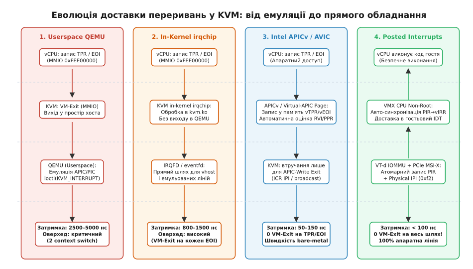
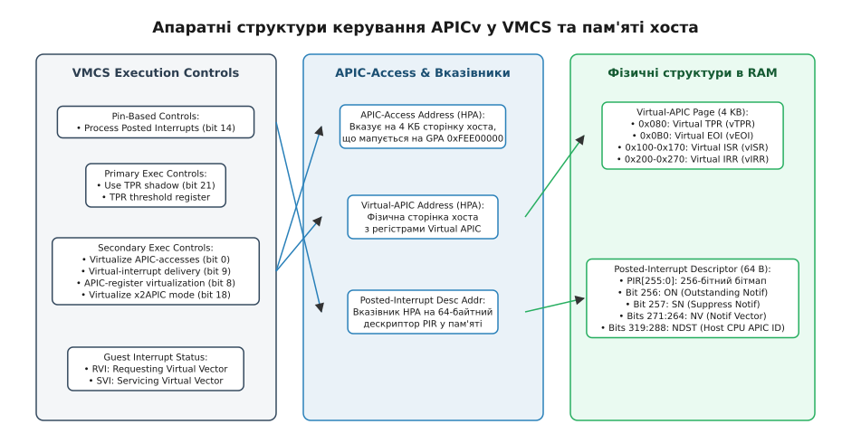
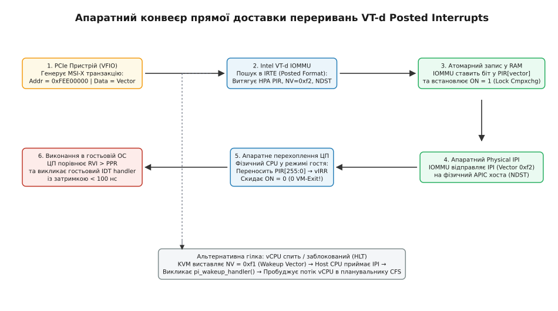

# Віртуалізація переривань у KVM: vAPIC, APICv і posted interrupts

<preknowlist>
- [Архітектура KVM і QEMU](root:sys-unix/kvm-and-qemu-architecture) — життєвий цикл vCPU, цикл віртуалізації та перемикання контексту VM-Exit / VM-Entry.
- [Контролер переривань: irqchip і irq_domain](root:sys-unix/irq-chip-and-domain) — апаратна ієрархія контролерів переривань, вектори IDT та доставка сигналів процесору.
- [Переривання MSI та MSI-X](root:sys-unix/msi-x-interrupts) — доставка сигналів подій через транзакції запису в пам'ять на шині PCIe.
- [Парапрохідність пристроїв (VFIO)](root:sys-unix/vfio-passthrough) — прямий доступ віртуальної машини до апаратних пристроїв та ізоляція IOMMU.
</preknowlist>

Сучасний мережевий адаптер 100 GbE або масив накопичувачів NVMe генерує від 500 000 до кількох мільйонів переривань за секунду. На фізичному сервері процесор приймає кожен сигнал через транзакцію запису в пам'ять MSI-X, виконує обробник у таблиці дескрипторів переривань (IDT, Interrupt Descriptor Table), записує підтвердження в локальний контролер переривань (Local APIC) і повертається до виконання робочого коду менш ніж за 100 наносекунд. У віртуалізованому середовищі наївна програмна емуляція переривань руйнує цю продуктивність: кожна спроба гостьової системи звернутися до регістрів контролера переривань викликає апаратне перехоплення процесора (VM-Exit), примусово перемикає контекст у гіпервізор KVM або простір користувача QEMU і витрачає до 2500 наносекунд процесорного часу. Під високим навантаженням введення-виведення віртуальна машина витрачає понад 70% обчислювальних ресурсів процесора виключно на цикл виходу й повернення з гіпервізора, перетворюючи потужний багатоядерний вузол на неефективний емулятор.

Щоб подолати цей розрив, інженери ядра Linux та розробники мікропроцесорів Intel і AMD створили багаторівневу систему апаратної акселерації переривань: від перенесення емуляції в ядро хоста (in-kernel irqchip) та асинхронних ліній IRQFD до повної апаратної віртуалізації контролера (Intel APICv / AMD AVIC) та прямої доставки сигналів у пам'ять без участі гіпервізора (Posted Interrupts).

---

## 1. Анатомія Local APIC та криза перехоплення регістрів

Щоб зрозуміти джерело втрат продуктивності, необхідно розглянути структуру локального контролера переривань (**Local APIC**, Advanced Programmable Interrupt Controller) в архітектурі x86. Кожне фізичне або віртуальне процесорне ядро (vCPU) має власний екземпляр Local APIC, який керує пріоритетами подій, маскуванням ліній, таймерами та міжпроцесорною взаємодією (IPI, Inter-Processor Interrupts).

У класичній архітектурі x86 доступ до регістрів Local APIC здійснюється через діапазон фізичної пам'яті **MMIO (Memory-Mapped I/O)** за базовою адресою `0xFEE00000` (розмір області 4 КБ). В архітектурі x2APIC доступ було розширено на спеціальні регістри моделі (MSR, Model-Specific Registers) у діапазоні `0x800`–`0x8FF`.

```
Регістри Local APIC (базова адреса MMIO: 0xFEE00000):
┌──────────┬─────────────────────────────────┬──────────────────────────────────────────┐
│ Зсув     │ Регістр                         │ Функціональне призначення                │
├──────────┼─────────────────────────────────┼──────────────────────────────────────────┤
│ 0x020    │ APIC ID                         │ Унікальний ідентифікатор процесора       │
│ 0x080    │ TPR (Task Priority Register)    │ Поточний поріг пріоритету виконання ядра │
│ 0x0A0    │ PPR (Processor Priority Reg)    │ Ефективний пріоритет (max(TPR, ISR))     │
│ 0x0B0    │ EOI (End of Interrupt)          │ Підтвердження завершення обробки IRQ     │
│ 0x100..  │ ISR (In-Service Register)       │ Бітова маска (256 біт) активних IRQ      │
│ 0x180..  │ TMR (Trigger Mode Register)     │ Режим спрацьовування (Edge vs Level)     │
│ 0x200..  │ IRR (Interrupt Request Reg)     │ Бітова маска (256 біт) очікуваних IRQ    │
│ 0x300    │ ICR Low (Interrupt Command)     │ Відправка IPI / команди доставки         │
│ 0x310    │ ICR High (Destination)          │ Цільовий процесор або маска ядер         │
└──────────┴─────────────────────────────────┴──────────────────────────────────────────┘
```

Гостьова операційна система взаємодіє з цими регістрами безперервно:
1. **Зміна пріоритету завдань (TPR):** Ядро ОС змінює TPR для блокування переривань з нижчим пріоритетом під час виконання критичних секцій коду (наприклад, у Windows зміна `IRQL` через `CR8` або зсув `0x080` відбувається при кожному захопленні спінлока).
2. **Підтвердження переривання (EOI):** Після завершення функції обробника (ISR) операційна система зобов'язана виконати запис нуля в регістр EOI (`0x0B0`), щоб контролер зняв поточний активний вектор з бітової маски ISR і дозволив доставку наступного переривання з черги.
3. **Міжпроцесорні сигнали (ICR):** Для планування потоків на сусідніх ядрах або інвалідації сторінок TLB ядро записує цільовий вектор та номер процесора в регістри `ICR Low` / `ICR High`.

### Ціна VM-Exit на неакселерованій системі

Коли віртуальна машина працює без апаратної віртуалізації APIC, область пам'яті `0xFEE00000` позначається в таблицях трансляції сторінок другого рівня (Intel EPT або AMD NPT) як відсутня або заблокована для запису. 

Будь-яка спроба виконання інструкції `mov [0xFEE000B0], 0` (запис EOI) або `mov cr8, rax` (зміна TPR) миттєво генерує вихід у гіпервізор з кодом `EXIT_REASON_EPT_VIOLATION` або `EXIT_REASON_CR_ACCESS`.

```
Хронометраж доставки одного переривання без акселерації:
1. Надходження зовнішнього сигналу (MSI-X)   ──> 0 нс
2. VM-Exit фізичного процесора (trap)         ──> 500–1200 нс (скидання конвеєра, збереження VMCS)
3. Виконання коду обробника KVM на хості      ──> 300–600 нс (дизасемблювання інструкції, пошук стану)
4. VM-Entry назад у гостьовий режим          ──> 500–1000 нс (завантаження регістрів vCPU)
5. Виконання обробника ISR у гостьовій ОС    ──> 100–300 нс
6. Запис гостем у регістр EOI (новий VM-Exit) ──> 500–1200 нс
7. Оновлення емульованого стану APIC в KVM    ──> 200–400 нс
8. Повернення в гостя (новий VM-Entry)        ──> 500–1000 нс
─────────────────────────────────────────────────────────────────────────────
Сумарна затримка: 2600–5700 нс на ОДНЕ переривання!
```

При потоці в 200 000 пакетів/с два виходи на кожне переривання (один на інжекцію, другий на EOI) вимагають 400 000 операцій VM-Exit/VM-Entry за секунду. Процесор фізично не встигає виконувати корисну роботу, проводячи весь час у збереженні та відновленні керуючих структур віртуалізації.

Історичний контекст боротьби з цим явищем та виникнення проблеми «шторму TPR» у ранніх гіпервізорах детально розкрито у вставці [Еволюція віртуалізації переривань: від штормів TPR до кремнієвих конвеєрів](root:sys-unix/kvm-irq-virtualization-apicv/hist-evolution-of-virtual-interrupts.md).

---

## 2. Еволюція програмної архітектури: QEMU, In-Kernel IRQChip та IRQFD

Розв'язання проблеми продуктивності відбувалося поетапно — від оптимізації програмних меж між ядром хоста та процесом емулятора до побудови асинхронних каналів передачі подій.


*Еволюція архітектури доставки переривань: від подвійного перемикання контексту в просторі користувача до повної апаратної прямої доставки без виходу в гіпервізор.*

### Етап 1: Емуляція в просторі користувача (Userspace QEMU)
На початковому етапі розвитку KVM уся логіка контролерів 8259 PIC, I/O APIC та Local APIC перебувала в коді QEMU. 

Коли віртуальний процесор виконував запис у MMIO APIC, KVM перехоплював подію і завершував системний виклик `ioctl(vcpu_fd, KVM_RUN)` з кодом повернення `KVM_EXIT_MMIO`. Потік QEMU прокидався у просторі користувача, аналізував адресу, змінював змінні стану емулятора і знову викликав `KVM_RUN`. Доставка сигналів від емульованих пристроїв вимагала виклику `ioctl(vcpu_fd, KVM_INTERRUPT)`. Це призводило до подвійного перемикання контексту (гість → ядро хоста → простір користувача QEMU → ядро хоста → гість), що робило продуктивність неприйнятною для будь-яких мережевих чи дискових навантажень.

### Етап 2: Внутрішньоядерний контролер (In-Kernel IRQChip)
Переломним кроком стало перенесення повної емуляції PIC, I/O APIC та Local APIC безпосередньо в модуль ядра `kvm.ko` (`arch/x86/kvm/lapic.c`, `ioapic.c`, `i8259.c`).

Простір користувача ініціалізує цей режим один раз під час створення віртуальної машини за допомогою виклику `ioctl(vm_fd, KVM_CREATE_IRQCHIP, 0)`.

Переваги in-kernel irqchip:
* Виходи `VM-Exit`, спричинені доступом до MMIO APIC (`0xFEE00000`), перехоплюються та обробляються безпосередньо в циклі виконання vCPU в ядрі хоста (`handle_apic_access()`).
* Потік виконання не повертається в простір користувача QEMU, заощаджуючи тисячі тактів на зміні таблиць сторінок процесу та копіюванні регістрів.
* Таймери vCPU (APIC Timer, TSC deadline timer) обробляються за допомогою високоточних таймерів ядра Linux `hrtimer`, мінімізуючи джиттер таймінгу гостя.

### Етап 3: Асинхронний механізм IRQFD
Навіть з in-kernel irqchip емульованим або напіввіртуалізованим пристроям (наприклад, драйверам Virtio) був потрібен спосіб сигналізувати про готовність даних без виконання важких системних викликів `ioctl` з простору користувача.

Для цього було розроблено механізм **IRQFD** (`virt/kvm/eventfd.c`). Гіпервізор зв'язує дескриптор `eventfd` ядра Linux з конкретною лінією переривання (Global System Interrupt, **GSI**) віртуальної машини через виклик `ioctl(vm_fd, KVM_IRQFD, &irqfd)`.

```
                   Ядро Linux (Host Kernel)
┌───────────────────────────────────────────────────────────────┐
│                                                               │
│ [vhost-net / vfio-pci] ──(write 8 байт)──> [ eventfd ]       │
│                                                   │           │
│                                           (poll callback)     │
│                                                   ▼           │
│                                            [ KVM IRQFD ]      │
│                                                   │           │
│                                            (kvm_set_irq)      │
│                                                   ▼           │
│                                            [ In-Kernel ]      │
│                                            [  IO-APIC  ]      │
│                                                   │           │
│                                                   ▼           │
│                                            [ Local APIC ]     │
│                                            [  vIRR біт  ]     │
│                                                   │           │
│                                            (kvm_vcpu_kick)    │
│                                                   ▼           │
│                                            [ vCPU Thread ] ───┼──> Інжекція в гостя
│                                                               │
└───────────────────────────────────────────────────────────────┘
```

Коли модуль прискорювача введення-виведення (наприклад, `vhost-net` або драйвер прямого доступу `vfio-pci`) завершує обробку пакета, він записує 8-байтне ціле число в дескриптор `eventfd`. Функція зворотного виклику KVM негайно знаходить цільовий номер GSI у попередньо налаштованій таблиці маршрутизації (`KVM_SET_GSI_ROUTING`), виставляє відповідний біт у віртуальному регістрі запитів переривань (`vIRR`) цільового vCPU і за потреби надсилає міжпроцесорний сигнал `kvm_vcpu_kick()`.

Практична реалізація створення VM, налаштування таблиць GSI та керування лініями переривань через C та C++ наведена у вставці [Налаштування KVM IRQFD та маршрутизації переривань у просторі користувача](root:sys-unix/kvm-irq-virtualization-apicv/proj-irqfd-kvm-setup.md).

Повний перелік параметрів викликів `ioctl`, бітових прапорців та форматів системних структур ядра задокументовано у вставці [Інтерфейс керування віртуалізацією переривань: ioctl, структури та параметри KVM](root:sys-unix/kvm-irq-virtualization-apicv/api-kvm-irq-ioctls.md).

---

## 3. Апаратна акселерація APIC: Intel APICv та AMD AVIC

Хоча in-kernel irqchip та IRQFD прискорили доставку подій від хоста до гостя, вони не могли усунути фундаментальну проблему: гостьова ОС продовжувала генерувати виходи `VM-Exit` при кожному внутрішньому зверненні до регістрів TPR, EOI та ICR.

Розв'язання цієї проблеми зажадало радикальної модернізації мікроархітектури самого кремнію процесора: технологій **Intel APICv (APIC-virtualization)** та **AMD AVIC (Advanced Virtual Interrupt Controller)**.


*Співвідношення бітів керування VMCS, сторінки доступу APIC-access, тіньової пам'яті Virtual-APIC Page та дескриптора Posted Interrupts.*

### Керуючі поля структури VMCS в Intel VT-x

Для керування апаратною віртуалізацією переривань процесори Intel використовують спеціальні біти у структурі керування віртуальною машиною (**VMCS**, Virtual Machine Control Structure):

1. **`Use TPR shadow` (Primary Processor-Based Controls, біт 21):**
   Дозволяє процесору підтримувати апаратний тіньовий регістр `vTPR`. Читання та запис у `CR8` або зсув `0x080` виконуються апаратно без VM-Exit.
2. **`TPR threshold` (VMCS поле 0x401C):**
   Встановлює числовий поріг: якщо значення `vTPR` стає меншим за поріг, процесор генерує відкладений вихід `EXIT_REASON_TPR_BELOW_THRESHOLD`, дозволяючи гіпервізору оцінити очікувані низькопріоритетні переривання.
3. **`Virtualize APIC-accesses` (Secondary Processor-Based Controls, біт 0):**
   Активує перехоплення доступу до сторінки MMIO APIC (`0xFEE00000`) на апаратному рівні контролера шини пам'яті без генерування помилок сторінки EPT.
4. **`APIC-register virtualization` (Secondary Controls, біт 8):**
   Дозволяє прямому апаратному блоку процесора читати більшість регістрів APIC безпосередньо з виділеної 4-кілобайтної сторінки пам'яті хоста (**Virtual-APIC Page**).
5. **`Virtual-interrupt delivery` (Secondary Controls, біт 9):**
   Передає апаратному забезпеченню ЦП повний контроль над оцінкою пріоритетів, інжекцією переривань у потік виконання гостя та автоматичним оновленням регістрів vISR/vEOI без виходу в гіпервізор.

### Сторінки APIC-access та Virtual-APIC Page

Ключовий механізм Intel APICv базується на розведенні концепції адреси доступу та фізичної пам'яті:

* **Сторінка доступу APIC (APIC-access Address, HPA):** Фізична сторінка хоста, адреса якої записується у відповідне поле VMCS. Коли гостьовий vCPU намагається виконати читання або запис за гостьовою фізичною адресою GPA `0xFEE00000`, блок апаратної віртуалізації процесора виявляє збіг з адресою APIC-access. Замість генерування сторінкової помилки процесор перенаправляє операцію на сторінку Virtual-APIC Page.
* **Тіньова сторінка регістрів (Virtual-APIC Address, HPA):** Реальна 4-кілобайтна область оперативної пам'яті, виділена ядром KVM для кожного vCPU (`vcpu->arch.apic->regs`). Вона містить дзеркало всіх регістрів Local APIC.

```
Гостьовий vCPU виконує інструкцію:
mov eax, [0xFEE00080]  (Читання TPR)
         │
         ▼
[ Апаратний блок Intel VT-x ]
Виявлено доступ до APIC-access Address!
         │
         ├───────────────────────────────────────────────┐
         ▼                                               ▼
[ Регістр без побічних ефектів ]            [ Регістр запису з побічною дією ]
(TPR, ISR, IRR, EOI)                        (ICR Low — відправка IPI)
         │                                               │
         ▼                                               ▼
Апаратне читання/запис безпосередньо       Апаратний запис у Virtual-APIC Page,
у Virtual-APIC Page в RAM хоста            після чого легкий вихід:
         │                                 EXIT_REASON_APIC_WRITE (56)
         ▼                                               │
0 VM-Exit!                                               ▼
Затримка: 1–5 тактів процесора             KVM читає готове значення з пам'яті
                                           без дизасемблювання інструкції
```

### Механізм доставки віртуальних переривань (Virtual-Interrupt Delivery)

При увімкненому прапорці `Virtual-interrupt delivery` процесор бере на себе функції арбітражу переривань, використовуючи два нових апаратних поля у структурі VMCS — **Guest Interrupt Status**:

* **RVI (Requesting Virtual Interrupt, біти 0–7):** Вектор переривання з найвищим пріоритетом, яке очікує на обробку (максимальний встановлений біт у `vIRR`).
* **SVI (Servicing Virtual Interrupt, біти 8–15):** Вектор переривання, яке зараз виконується обробником гостя (максимальний встановлений біт у `vISR`).

Алгоритм апаратної доставки переривання в гостя працює так:
1. Процесор апаратно обчислює поточний пріоритет процесора `PPR = max(vTPR & 0xF0, SVI & 0xF0)`.
2. Якщо пріоритет очікуваного вектора `RVI > PPR`, у гостьовій системі дозволені переривання (прапорець `RFLAGS.IF == 1`), і процесор перебуває на межі виконання інструкції, апаратна логіка негайно:
   * Копіює значення `RVI` в `SVI` (позначаючи вектор як активний).
   * Очищає відповідний біт вектора у `vIRR` та встановлює його у `vISR` на сторінці Virtual-APIC Page.
   * Передає керування на відповідний запис у гостьовій таблиці IDT.
3. Коли гостьовий обробник завершує роботу і виконує запис нуля в регістр EOI (`0x0B0`), апаратний блок процесора:
   * Автоматично знаходить і скидає найвищий біт у `vISR`.
   * Перераховує значення `SVI` (наступний активний біт у `vISR` або 0).
   * Миттєво перевіряє, чи не очікують інші переривання у `vIRR` (`RVI > PPR`), і за наявності одразу інжектує наступне переривання!
4. **Увесь цей цикл відбувається без жодного виходу VM-Exit.**

### Селективне перехоплення EOI та бітова маска EOI Exit Bitmap

Для більшості переривань (імпульсні MSI/MSI-X та міжпроцесорні IPI) операція EOI обробляється повністю апаратно всередині vCPU. Однак для рівневих переривань (Level-triggered INTx) від емульованих пристроїв контролер I/O APIC хоста повинен знати про завершення обробки, щоб виконати ресемплінг лінії або повідомити інші пристрої, спільні на цій лінії (shared interrupt lines).

Для цього структура VMCS надає 256-бітне поле **EOI Exit Bitmap** (чотири 64-бітних регістри). Якщо біт для вектора `V` встановлено в `1`, апаратне забезпечення ЦП скидає активний біт у `vISR`, але після цього генерує спеціальний вихід `EXIT_REASON_EOI_INDUCED` (код 45). KVM перехоплює цей сигнал і негайно сповіщає внутрішньоядерний контролер I/O APIC без потреби в дизасемблюванні інструкцій гостя. Для решти 99.9% імпульсних векторів біт у карті дорівнює `0`, і вихід не відбувається.

### Архітектура AMD AVIC та x2AVIC

Компанія AMD реалізувала аналогічну функціональність у межах розширення **AVIC (Advanced Virtual Interrupt Controller)** для архітектури AMD-V (SVM), починаючи з мікроархітектури Zen / Carrizo.

На відміну від підходу Intel з адресою доступу до сторінки, AVIC використовує табличну модель маршрутизації в оперативній пам'яті хоста, структури якої вказуються в керуючому блоці **VMCB (Virtual Machine Control Block)**:

1. **APIC-BAR та AVIC Backing Page:** 4-кілобайтна фізична сторінка, що зберігає стан регістрів vAPIC.
2. **Physical APIC ID Table:** Таблиця трансляції віртуальних ідентифікаторів vCPU в фізичні APIC ID хоста. Кожен запис містить:
   * `Host Physical APIC ID`: номер фізичного процесорного ядра, на якому зараз виконується даний vCPU.
   * `IsRunning`: біт активності vCPU на фізичному ядрі.
   * `Backing Page Pointer`: фізична адреса пам'яті сторінки vAPIC.
3. **Logical APIC ID Table:** Таблиця для підтримки групових та логічних режимів адресації (Flat / Cluster).
4. **Апаратний IPI Doorbell:** Коли vCPU A відправляє міжпроцесорне переривання (IPI) для vCPU B через запис у регістр `ICR`:
   * Апаратний контролер AMD AVIC шукає запис vCPU B у таблиці `Physical APIC ID Table`.
   * Якщо `IsRunning == 1`, процесор A самостійно генерує апаратний фізичний IPI (doorbell) на фізичне ядро хоста процесора B.
   * Процесор B апаратно синхронізує біт переривання у своїй Backing Page та доставляє вектор гостю без виходу в гіпервізор KVM на обох ядрах!
   * Якщо `IsRunning == 0` (vCPU B спить або витіснений планувальником хоста), процесор генерує вихід `AVIC_INCOMPLETE_IPI`, передаючи завдання планувальнику KVM.

Розширення **x2AVIC** додало підтримку 32-розрядних ідентифікаторів APIC ID та оптимізувало роботу з MSR-регістрами x2APIC (`0x800`–`0x8FF`).

---

## 4. Пряма доставка апаратних переривань: Posted Interrupts

Технології APICv та AVIC усунули накладні витрати на роботу з регістрами vAPIC та міжпроцесорними перериваннями між віртуальними ядрами. Однак залишалася остання, найбільш критична проблема: **доставка зовнішніх апаратних переривань від фізичних пристроїв**.

У конфігураціях парапрохідності (PCIe Device Passthrough / SR-IOV через VFIO) фізичний пристрій (наприклад, 100 GbE мережева карта Mellanox ConnectX або NVMe-диск) виділяється віртуальній машині напряму. 

Без прямої доставки схема обробки зовнішнього сигналу виглядала так:
1. Пристрій генерує транзакцію MSI-X на шині PCIe.
2. Контролер переривань хоста спрямовує сигнал на фізичне процесорне ядро.
3. Фізичний процесор, який у цей момент виконує гостьовий код, отримує апаратне переривання хоста і виконує вихід `EXIT_REASON_EXTERNAL_INTERRUPT`.
4. Ядро хоста Linux перехоплює подію, викликає обробник `vfio-pci`, визначає цільовий vCPU, оновлює структуру `vIRR` і повторно входить у гостьовий режим через VM-Entry.

Кожен прийнятий мережевий пакет або дисковий блок примусово переривав роботу віртуальної машини та перемикав контекст у хост.

Розв'язанням цієї проблеми стала технологія **Intel VT-d Posted Interrupts (PI)**, що об'єднала можливості процесора (APICv) та контролера введення-виведення (IOMMU).


*Конвеєр прямої доставки переривань: від транзакції MSI-X на шині PCIe через IOMMU безпосередньо у віртуальне ядро vCPU з нульовим VM-Exit.*

### Структура дескриптора Posted-Interrupt Descriptor (PIR)

В основі технології лежить 64-байтна структура даних в оперативній пам'яті хоста, вирівняна по 64-байтовій межі (розмір кеш-лінії ЦП) — **Posted-Interrupt Descriptor (`struct pi_desc`)**:

```c
struct pi_desc {
    __u32 pir[8];        /* PIR[255:0]: 256-бітний бітмап очікуваних переривань */
    union {
        struct {
            __u32 on : 1;      /* Bit 256: Outstanding Notification (є нові IRQ) */
            __u32 sn : 1;      /* Bit 257: Suppress Notification (придушити IPI) */
            __u32 rsvd_1 : 14;
            __u32 nv : 8;      /* Bits 271:264: Notification Vector (наприклад 0xF2) */
            __u32 rsvd_2 : 8;
            __u32 ndst;        /* Bits 319:288: Notification Destination (Physical APIC ID) */
        };
        __u64 control;
    };
    __u32 rsvd[6];
} __aligned(64);
```

Поля дескриптора виконують такі функції:
* **`PIR[255:0]` (Posted Interrupt Request):** 256-бітова маска векторів переривань. Коли для гостя надходить переривання з вектором `V`, відповідний біт `PIR[V]` встановлюється в `1`.
* **`ON` (Outstanding Notification, біт 256):** Прапорець наявності необроблених повідомлень. Встановлюється в `1` під час додавання вектора. Якщо `ON` уже дорівнює `1`, це означає, що процесор уже сповіщений про наявність переривань, і відправляти повторні сповіщення не потрібно.
* **`SN` (Suppress Notification, біт 257):** Прапорець придушення сповіщень. Використовується гіпервізором для оптимізації, коли vCPU не потребує термінового переривання (наприклад, під час міграції або очікування).
* **`NV` (Notification Vector, біти 264–271):** Спеціальний фізичний вектор переривання хоста (у KVM це зазвичай вектор `POSTED_INTR_VECTOR = 0xF2`), призначений для сповіщення процесора про надходження нових подій у PIR.
* **`NDST` (Notification Destination, біти 288–319):** Фізичний ідентифікатор Local APIC того процесорного ядра хоста, на якому зараз запущено цільовий vCPU.

### Апаратний конвеєр доставки: крок за кроком

Коли фізичний пристрій PCIe генерує переривання, апаратний ланцюг обробки працює повністю автономно без участі центрального процесора хоста:

```
[ PCIe Device ] ───( MSI-X Write )───> [ Intel VT-d IOMMU ]
                                                │
                                                ▼ (Пошук в IRTE)
                                        [ Posted Format Entry ]
                                                │
                 ┌──────────────────────────────┴──────────────────────────────┐
                 ▼                                                             ▼
       (1. Атомарний запис у RAM)                                    (2. Фізичне сповіщення)
  IOMMU виконує LOCK CMPXCHG16B                                IOMMU надсилає Physical IPI
  за адресою дескриптора PIR:                                  Vector = 0xF2 (POSTED_INTR_VECTOR)
  • Встановлює біт PIR[vector] = 1                             Target = Host Physical APIC ID
  • Встановлює біт ON = 1                                                      │
                 │                                                             │
                 └──────────────────────────────┬──────────────────────────────┘
                                                ▼
                                   [ Host Physical CPU Core ]
                              (Виконує код vCPU в Non-Root режимі)
                                                │
                                                ▼
                               [ Апаратний мікрокод Intel VMX ]
                               Перехоплює вектор 0xF2 БЕЗ VM-Exit:
                               • Атомарно блокує PIR
                               • Переносить біти PIR[255:0] ──> Virtual-APIC Page (vIRR)
                               • Скидає прапорець ON ──> 0
                                                │
                                                ▼
                               [ Апаратний блок APICv ]
                               Порівнює RVI > PPR
                                                │
                                                ▼
                               [ Гостьова операційна система ]
                               Прямий виклик функції ISR у таблиці IDT
                               Сумарна затримка: < 100 наносекунд!
```

1. Фізичний пристрій надсилає пакет транзакції MSI-X на системну шину PCIe.
2. Контролер **Intel VT-d IOMMU** перехоплює транзакцію і знаходить відповідний запис у таблиці перепризначення переривань (**IRTE**, Interrupt Remapping Table Entry), налаштований у спеціальному форматі *Posted Interrupt Format*.
3. Контролер IOMMU витягує з IRTE фізичну адресу дескриптора `PIR`, вектор переривання гостя, вектор сповіщення `NV` та цільовий `NDST`.
4. IOMMU за допомогою атомарної операції прямого доступу до пам'яті (DMA із префіксом блокування шини) встановлює біт цільового вектора в масиві `PIR` та переводить біт `ON` у значення `1`.
5. Якщо біт `ON` до цього був рівний `0` і сповіщення не придушені (`SN == 0`), IOMMU генерує фізичний міжпроцесорний сигнал IPI з вектором `0xF2` на фізичне ядро процесора `NDST`.
6. Фізичний процесор, перебуваючи в гостьовому режимі (VMX Non-Root Operation), отримує вектор `0xF2`. Оскільки в полі VMCS *Pin-Based VM-Execution Controls* встановлено біт `Process posted interrupts`, а вектор сповіщення у VMCS збігається з `0xF2`, процесор **не виконує вихід у гіпервізор (0 VM-Exit)**!
7. Мікрокод процесора апаратно зчитує біти з дескриптора `PIR`, виконує операцію логічного `OR` із регістром `vIRR` на сторінці Virtual-APIC Page, скидає біт `ON` у нуль і за наявності пріоритету негайно викликає гостьовий обробник переривань.

### Обробка сплячих vCPU: механізм PI Wakeup

Що відбувається, коли переривання надходить для vCPU, який у цей момент заблокований інструкцією `HLT` (спить в очікуванні подій) або витіснений планувальником CFS ядра Linux?

Для цього в KVM реалізовано механізм **PI Wakeup**:
1. Коли віртуальний процесор переходить у стан сну (`kvm_vcpu_block()`), KVM викликає функцію `vmx_pre_block()`.
2. KVM змінює вектор сповіщення `NV` у дескрипторах PIR з робочого `0xF2` на спеціальний вектор пробудження `POSTED_INTR_WAKEUP_VECTOR = 0xF1`, а дескриптор додається до глобального списку сплячих vCPU ядра хоста (`pi_wakeup_list`).
3. Коли IOMMU записує нове переривання в PIR і відправляє IPI з вектором `0xF1`, фізичний процесор хоста перериває свій поточний стан і викликає зареєстрований обробник ядра Linux `pi_wakeup_handler()`.
4. Обробник знаходить відповідну структуру `struct kvm_vcpu` і викликає стандартну функцію планувальника `kvm_vcpu_kick()`, миттєво переводячи потік vCPU у чергу виконання (`TASK_RUNNING`).
5. Під час наступного входу в гостьовий режим (`vmx_post_block()`) KVM повертає вектор `NV` назад у значення `0xF2`, і всі накопичені в PIR переривання апаратно інжектуються у vCPU в момент виконання інструкції `VMLAUNCH` / `VMRESUME`.

---

## 5. Внутрішня реалізація в KVM: структури даних та життєвий цикл

У вихідному коді ядра Linux реалізація віртуалізації переривань зосереджена в підсистемах `arch/x86/kvm/lapic.c`, `arch/x86/kvm/vmx/posted_intr.c` та `arch/x86/kvm/svm/avic.c`.

### Структура `struct kvm_lapic`
Кожен екземпляр vCPU містить структуру локального контролера переривань:

```c
struct kvm_lapic {
    unsigned long base_address;
    struct kvm_io_device dev;
    struct kvm_timer lapic_timer;
    u32 divide_count;
    struct kvm_vcpu *vcpu;
    bool sw_enabled;
    bool irr_pending;
    /* Вказівник на сторінку Virtual-APIC Page */
    void *regs;
    gfn_t vapic_gfn;
    struct page *vapic_page;
    /* Тіньові копії для швидкого доступу */
    u32 highest_isr_cache;
    void (*deliver)(struct kvm_lapic *apic, int delivery_mode, int trig_mode, int vector);
};
```

Поле `regs` вказує на виділену сторінку фізичної пам'яті розміром 4096 байтів, яка напряму монтується у VMCS як Virtual-APIC Page.

### Оновлення маршрутизації в IOMMU (`kvm_pi_update_irte`)
Коли драйвер VFIO налаштовує або змінює прив'язку фізичного переривання MSI-X до гостьового vCPU, KVM взаємодіє з підсистемою ядра `irq_bypass` (`virt/lib/irq_bypass.c`):

```c
int kvm_irq_delivery_to_apic(struct kvm *kvm, struct kvm_lapic *src,
                             struct kvm_lapic_irq *irq,
                             struct dest_map *dest_map)
{
    /* Перевірка можливості доставки через Posted Interrupts */
    if (kvm_x86_ops.deliver_posted_interrupt &&
        kvm_x86_ops.deliver_posted_interrupt(vcpu, irq->vector))
        return 1;

    /* Резервний шлях через програмне виставлення біта vIRR */
    return kvm_apic_set_irq(vcpu, irq, dest_map);
}
```

Підсистема `irq_bypass` реєструє виробника подій (драйвер `vfio-pci` зі структурою `struct irq_bypass_producer`) та споживача подій (модуль KVM зі структурою `struct irq_bypass_consumer`). Щойно KVM підтверджує готовність дескриптора `struct pi_desc`, функція `kvm_arch_irq_bypass_add_producer()` викликає драйвер контролера Intel IOMMU. Контролер IOMMU переналаштовує відповідний запис IRTE у таблицях перепризначення переривань, переводячи його з переривального формату в прямий формат Posted Interrupt.

З цього моменту ядро KVM повністю вимикається з контуру обробки переривань цього пристрою: усі пакети або транзакції потрапляють у гостьову пам'ять на апаратній швидкості лінії зв'язку.

---

## 6. Вкладена віртуалізація (Nested APICv та Nested PI)

Особливої складності віртуалізація переривань набуває в сценаріях вкладеної віртуалізації (**Nested Virtualization**), коли гіпервізор першого рівня L0 (KVM на хості) запускає віртуальну машину L1, яка, своєю чергою, запускає вкладену віртуальну машину L2.

Якщо обидва гіпервізори (L0 і L1) намагаються використовувати апаратну віртуалізацію APICv:
1. **Злиття карт EOI Exit Bitmap:** Гіпервізор L0 будує тіньову структуру VMCS02 для виконання L2. Бітова маска перехоплення `EOI Exit Bitmap` у VMCS02 формується як побітове `OR` вимог L0 та вимог L1 (`vmcs02.eoi_exit_bitmap = vmcs01.eoi_exit_bitmap | vmcs12.eoi_exit_bitmap`).
2. **Віртуалізація сторінок APIC-access:** Якщо L2 виконує звернення до свого віртуального контролера APIC, апаратне забезпечення використовує тіньову сторінку доступу, підготовлену L0, уникаючи виходу у простір L1.
3. **Вкладені Posted Interrupts (Nested PI):** Сучасні процесори підтримують апаратну переадресацію дескрипторів PIR для L2. Якщо фізичний пристрій прокинуто напряму з хоста L0 у вкладеного гостя L2, дескриптор IRTE вказує безпосередньо на дескриптор PIR машини L2, забезпечуючи нульові накладні витрати навіть через два рівні віртуалізації.

---

## 7. Порівняння продуктивності та накладних витрат

Щоб кількісно оцінити вплив кожного з етапів еволюції, розглянемо вимірювання затримок та накладних витрат процесора під час обробки 1 000 000 переривань на секунду (типовий профіль навантаження 100 GbE мережевого адаптера або сховища NVMe over Fabrics):

| Режим віртуалізації | Затримка обробки (Latency) | Кількість VM-Exit на 1 млн IRQ | Завантаження CPU хоста на обслуговування переривань |
| :--- | :--- | :--- | :--- |
| **Userspace QEMU** | 3500–6000 нс | 2 000 000 (MMIO + IRQ) | > 95% (повна деградація) |
| **In-Kernel IRQChip** | 1200–2200 нс | 1 000 000 (лише EOI) | 40% – 60% |
| **Intel APICv / AMD AVIC** | 150–350 нс | < 5 000 (лише ICR IPI) | 5% – 8% |
| **VT-d Posted Interrupts** | **60–100 нс** | **0 (повністю апаратно)** | **< 1% (рівень bare-metal)** |

```
Затримка обробки переривання (нс, менше — краще):
Userspace QEMU  [████████████████████████████████████████] 4500 нс
In-Kernel IRQ   [████████████████] 1600 нс
Intel APICv     [██] 220 нс
Posted IRQ      [█] 80 нс  <── Рівень фізичного процесора (Bare-metal: 75 нс)
```

Завдяки комбінації Virtual-APIC Page та Posted Interrupts затримка доставки скоротилася у 50 разів порівняно з програмною емуляцією, а накладні витрати хост-процесора практично зникли.

> 🔧 **Навіщо це.**
>
> У сучасних хмарних центрах обробки даних (AWS Nitro, Google Cloud, Azure) та телекомунікаційних мережах 5G (NFV, DPDK) технологія Posted Interrupts є обов'язковою умовою для досягнення продуктивності лінійної швидкості (Line-Rate). Без APICv та Posted Interrupts неможливо побудувати розподілене сховище NVMe-oF з мільйонами IOPS або забезпечити роботу програмних комутаторів Open vSwitch/SR-IOV із затримками менше 10 мікросекунд.
>
> Для системного інженера та адміністратора перевірка статусу `/sys/module/kvm_intel/parameters/enable_apicv` та налагодження таблиць IOMMU є першим кроком під час діагностики деградації мережевого стека у високонавантажених віртуальних машинах.

---

## 8. Підсумковий синтез

Віртуалізація переривань в архітектурі x86 пройшла шлях від повної програмної емуляції, що паралізувала роботу процесора штормами перехоплення TPR/EOI, до прямої взаємодії кремнію контролерів периферійних шин і процесорних ядер.

Сучасний конвеєр доставки переривань у KVM будується на трьох взаємодоповнюючих стовпах:
1. **IRQFD та In-Kernel IRQChip:** Забезпечують ефективний асинхронний міст між віртуальними пристроями Virtio, фоновими потоками хоста та планувальником KVM без виходу у простір користувача.
2. **Intel APICv / AMD AVIC:** Апаратно усувають виходи `VM-Exit` під час повсякденної взаємодії гостьової ОС з власним локальним контролером переривань, перетворюючи операції зміни TPR, підтвердження EOI та міжпроцесорні сигнали IPI на атомарні операції з оперативною пам'яттю.
3. **VT-d Posted Interrupts:** Повністю виключають гіпервізор KVM з контуру доставки апаратних сигналів прямого обладнання (VFIO), дозволяючи контролеру IOMMU та мікрокоду процесора доставляти пакети безпосередньо в таблицю IDT гостьового ядра з продуктивністю та затримками фізичного сервера.
