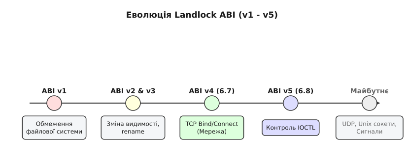

# Еволюція Landlock LSM: ABI v4/v5 (мережеві обмеження та ioctl)

<preknowlist>
- [Модель Landlock LSM та безпривілейоване сандбоксування](root:sys-unix/landlock-kernel-internals-and-abi) — створення наборів правил (ruleset), обмеження доступу до VFS та успадкування прав у Linux.
- [Фільтрація системних викликів Seccomp](root:sys-unix/seccomp-filter-mechanism) — різниця між обмеженням системних викликів на рівні регістрів та доменною ізоляцією об'єктів VFS/мережі.
- [Каркас Linux Security Modules (LSM)](root:sys-unix/lsm-framework) — архітектура безпекових хуків у ядрі Linux та мандатний контроль доступу.
- [Ідентифікатори процесів та атрибути привілеїв](root:sys-unix/process-credential-checks-and-transitions) — прапорець `PR_SET_NO_NEW_PRIVS`, успадкування прав та межі привілеїв.
</preknowlist>

При компрометації безпривілейованого мережевого сервісу в Linux зловмисник, обмежений файловими правилами Landlock ABI v1–v3, збереже змогу ініціювати вихідні TCP-з'єднання на зовнішній сервер керування (Command & Control) через системний виклик `connect()` або відкрити новий слухаючий TCP-порт за допомогою `bind()` для підняття зворотного шелу (reverse shell). Одночасно доступ до відкритих псевдопристроїв у `/dev/` відкриває вектор локального підвищення привілеїв (LPE) через виклики `ioctl()`, які надсилають специфічні керуючі структури драйверам обладнання в оминання файлових масок доступу. Версії Landlock ABI v4 (Linux 6.7) та v5 (Linux 6.8) усувають ці прогалини ізоляції, розширюючи безпривілейований мандатний контроль із VFS на підсистему BSD-сокетів та символьних/блочних пристроїв у ядрі.

Революційна цінність розширення Landlock полягає в тому, що програма може зменшувати власний вектор атаки у динаміці виконання без залучення привілеїв `CAP_SYS_ADMIN` чи конфігурування системним адміністратором зовнішніх профілів SELinux та AppArmor. Хронологічний шлях розвитку цієї підсистеми — від перших BPF-патчів до стабілізації мережевих та ioctl-хуків — описує [історія еволюції версій Landlock](root:sys-unix/landlock-abi-v4-v5-features/hist-landlock-evolution.md).

## 1. Архітектурні межі VFS-ізоляції та поява багатодоменного контролю

У перших трьох випусках ABI (v1 у Linux 5.13, v2 у Linux 5.19, v3 у Linux 6.2) підсистема Landlock оперувала виключно об'єктами віртуальної файлової системи (VFS). Правила дозволяли маскувати операції читання, запису, виконання, створення вузлів, усічення файлів та перейменування між каталогами. Проте у реальних сценаріях експлуатації мережеві сервіси та контейнери взаємодіють із зовнішнім світом через три незалежні підсистеми ядра:

1. **Віртуальна файлова система (VFS)**: Файли конфігурацій, бази даних, тимчасові каталоги `/tmp`.
2. **Мережевий стек (BSD Sockets)**: Мережеві інтерфейси, таблиці маршрутизації, порти TCP/UDP.
3. **Підсистема пристроїв (DevFS та Ioctl)**: Драйвери символьних і блочних пристроїв у `/dev/`, GPU-контексти, TTY-термінали.

Якщо процес у пісочниці позбавлений права запису у VFS, але має змогу виконувати системний виклик `connect()`, він може передати викрадені з пам'яті секрети (наприклад, ключі шифрування чи токени доступу) через мережу. Аналогічно, якщо процес має відкритий файловий дескриптор пристрою `/dev/tty` чи `/dev/dri/renderD128`, виклик `ioctl()` передає керуючі команди безпосередньо в драйвер пристрою, минаючи стандартні перевірки прав `read()` та `write()`.

Для вирішення цієї проблеми у ядрі Linux було змінено внутрішню архітектуру Landlock: набір правил (ruleset) перетворився з суто файлового контексту на багатодоменну структуру мандатного контролю.

```
+-------------------------------------------------------------------+
|                   Неревілейований процес (User Space)             |
+-------------------------------------------------------------------+
                                  |
            системні виклики: openat, bind, connect, ioctl
                                  v
+-------------------------------------------------------------------+
|                      LSM Hooks у ядрі Linux                       |
|   +-------------------+ +-------------------+ +-----------------+ |
|   | security_file_open| |security_socket_bind| |security_file_ioctl|
|   +-------------------+ +-------------------+ +-----------------+ |
+-------------------------------------------------------------------+
                                  |
                                  v
+-------------------------------------------------------------------+
|                    Landlock Domain Evaluation                     |
|                                                                   |
|   [ VFS Domain ]         [ Network Domain ]     [ Device IOCTL ]  |
|  (ABI v1 / v2 / v3)         (ABI v4)               (ABI v5)       |
+-------------------------------------------------------------------+
                                  |
               Дозволено чи EACCES (Permission Denied)
```

### 1.1. Внутрішня структура даних ядра (`struct landlock_ruleset`)

Усередині ядра Linux кожен активний domain Landlock описується структурою `struct landlock_ruleset`, яка зв'язується з креденшелами процесу `struct cred`:

:::tabs
@tab C
```c
struct landlock_ruleset {
    refcount_t usage;
    struct landlock_ruleset *num_layers;
    struct rb_root root_net_ports;   /* Дерево мережевих правил TCP */
    struct rb_root root_inodes;      /* Дерево VFS правил */
    u64 access_masks[];              /* Маски мандатних обмежень */
};
```
@tab C++
```cpp
struct landlock_ruleset {
    refcount_t usage;
    struct landlock_ruleset *num_layers;
    struct rb_root root_net_ports;   // Дерево мережевих правил TCP
    struct rb_root root_inodes;      // Дерево VFS правил
    u64 access_masks[];              // Маски мандатних обмежень
};
```
:::

Внутрішня перевірка правил Landlock для кожного домену працює за принципом об'єднання заборон. Якщо для поточного процесу задекларовано обробку конкретного домену (наприклад, `handled_access_net`), будь-яка дія у цьому домені за замовчуванням забороняється, якщо для неї немає явного дозволяючого правила в таблиці `landlock_ruleset`.

### 1.2. Нашарування доменів (Domain Stacking & Inheritance)

Ключовою властивістю Landlock є монотонне звуження прав (monotonic reduction of privileges). Коли процес у пісочниці породжує дочірній процес через `fork()`, `vfork()`, `clone()` або виконує нову програму через `execve()`, уся ієрархія правил Landlock автоматично успадковується дочірнім процесом.

Якщо дочірній процес створює та застосовує свій власний новий `landlock_ruleset`, ядро не замінює батьківські правила, а накладає новий шар (layer) поверх існуючих. У результаті процес стає обмеженим логічним перетином усіх активних шарів від першого до поточного. Це унеможливлює вихід дочірнього процесу з батьківської пісочниці: жодне додаткове правило у новому шарі не може скасувати або розширити заборони, встановлені на вищих рівнях ієрархії.

## 2. Landlock ABI v4: Контроль та обмеження мережевого стеку TCP

Введений у ядрі Linux 6.7, **Landlock ABI v4** вперше надав прикладним програмам можливість обмежувати свої мережеві операції на рівні конкретних портів протоколу TCP.

### 2.1. Бітові маски та операції мережевого доступу

ABI v4 вводить два нові прапорці у структурі `landlock_ruleset_attr` у полі `handled_access_net`:

- `LANDLOCK_ACCESS_NET_BIND_TCP`: Контролює здатність процесу прив'язувати TCP-сокет до конкретного локального порту за допомогою системного виклику `bind()`.
- `LANDLOCK_ACCESS_NET_CONNECT_TCP`: Контролює ініціалізацію вихідних TCP-з'єднань до віддалених портів за допомогою системного виклику `connect()`.

При додаванні правил за допомогою `landlock_add_rule()` з типом `LANDLOCK_RULE_NET_PORT` використовується структура `landlock_net_port_attr`, у якій вказується номер порту та дозволена маска дій:

:::tabs
@tab C
```c
struct landlock_net_port_attr net_attr = {
    .allowed_access = LANDLOCK_ACCESS_NET_BIND_TCP,
    .port = 8080,
};
int res = landlock_add_rule(ruleset_fd, LANDLOCK_RULE_NET_PORT, &net_attr, 0);
```
@tab C++
```cpp
landlock_net_port_attr net_attr{
    .allowed_access = LANDLOCK_ACCESS_NET_BIND_TCP,
    .port = 8080
};
int res = landlock_add_rule(ruleset_fd, LANDLOCK_RULE_NET_PORT, &net_attr, 0);
```
:::

Важливою деталлю реалізації є те, що номер порту `port` у структурі `landlock_net_port_attr` приймається у звичайному порядку байтів (host byte order), а не у мережевому (network byte order), що спрощує конфігурування та усуває необхідність виклику `htons()`.

### 2.2. Механізм перехоплення в ядрі (LSM Hooks)

Під час виконання викликів `bind()` чи `connect()` ядро Linux передає керування LSM-хукам `security_socket_bind()` та `security_socket_connect()`. Landlock перевіряє домен активного процесу за наступним алгоритмом:

1. Якщо по потоку відсутній активний Landlock domain або у полі `handled_access_net` не виставлено відповідний прапорець access, перевірка завершується успішно за час `O(1)`.
2. Якщо прапорець виставлено, ядро отримує номер порту із переданої структури `struct sockaddr_in` або `struct sockaddr_in6`.
3. Виконується пошук номеру порту у червоно-чорному дереві (red-black tree) мережевих правил поточного `ruleset`.
4. Якщо порт знайдено і його `allowed_access` містить необхідну бітову маску, виклик дозволяється. В іншому разі ядро перериває системний виклик і повертає код помилки `-EACCES`.

### 2.3. Крайові випадки та тонкощі мережевого обмеження

Практична реалізація ABI v4 має низку специфічних нюансів, які важливо враховувати розробникам:

- **Динамічні (ефемерні) порти (Port 0)**: При виклику `bind()` із номером порту `0` ядро автоматично виділяє вільний порт із діапазону `net.ipv4.ip_local_port_range`. У Landlock ABI v4 для дозволу автовиділення портів необхідно явно додати правило для конкретного порту, або виклик із початковим `port = 0` буде відхилено, якщо `LANDLOCK_ACCESS_NET_BIND_TCP` є задекларованим у `handled_access_net`.
- **IPv4-Mapped IPv6 Адреси**: При роботі з сокетами `AF_INET6` ядро може обробляти IPv4-адреси у форматі `::ffff:192.168.1.1`. Landlock перевіряє виключно номер TCP-порту, незалежно від того, чи використовується сімейство `AF_INET` чи `AF_INET6`.
- **UNIX Domain Sockets та UDP**: ABI v4 обмежує виключно протокол **TCP**. Сокети UNIX-домену (`AF_UNIX`) контролюються через файлову систему (якщо вони представлені вузлами VFS через `LANDLOCK_ACCESS_FS_MAKE_SOCK`), а обмеження протоколу UDP на рівні портів винесено у майбутні версії ABI.

Точні сигнатури всіх викликів та полів описує [довідник системних викликів та структур ABI v4/v5](root:sys-unix/landlock-abi-v4-v5-features/api-landlock-v4-v5-structs.md).

## 3. Landlock ABI v5: Контроль та обмеження системних викликів `ioctl()`

У ядрі Linux 6.8 було представлено **Landlock ABI v5**, який ввів прапорець `LANDLOCK_ACCESS_FS_IOCTL_DEV`. Цей реліз ліквідував один із найнебезпечніших векторів обходу сандбоксів у Linux.

### 3.1. Природа вразливості `ioctl()` та проблема "чорної скриньки"

Системний виклик `ioctl()` (Input/Output Control) призначений для виконання специфічних операцій керування пристроями.

:::tabs
@tab C
```c
int ioctl(int fd, unsigned long request, ...);
```
@tab C++
```cpp
int ioctl(int fd, unsigned long request, ...);
```
:::

На відміну від стандартних викликів `read()` та `write()`, де ядро чітко розуміє семантику переданих байтів, параметр `request` в `ioctl()` є довільним 32- або 64-бітним кодом команди, який обробляється драйвером конкретного пристрою. У ядрі Linux існують тисячі унікальних команд `ioctl`.

Ця різноманітність створює серйозні проблеми для ізоляції:
1. **TIOCSTI TTY Injection**: Якщо процес у пісочниці має доступ до файлового дескриптора терміналу `/dev/tty`, він може за допомогою команди `ioctl(fd, TIOCSTI, &byte)` підкинути символи в чергу вводу батьківської оболонки (shell), що дозволяє виконати довільні команди поза пісочницею від імені батьківського користувача.
2. **GPU & DRM Escapes**: Графічні пристрої (`/dev/dri/renderD128`) приймають складні ioctl-структури для управління пам'яттю GEM та сабміту команд GPU. Вразливості у драйверах відеокарт (NVIDIA, AMD, Intel) є популярним вектором LPE.
3. **KVM & Vhost Attack Surface**: Файли пристроїв `/dev/kvm` та `/dev/vhost-net` надають розширений ioctl-інтерфейс, компрометація якого дозволяє вийти за межі віртуалізації.

### 3.2. Механізм `LANDLOCK_ACCESS_FS_IOCTL_DEV` у ABI v5

До появи ABI v5 Landlock перевіряв права лише під час відкриття файла (`openat`). Якщо процес мав право прочитати чи записати у вузол пристрою, він автоматично отримував право виконувати **будь-які** виклики `ioctl()` на цьому дескрипторі.

З появою ABI v5 розробник може вказати `LANDLOCK_ACCESS_FS_IOCTL_DEV` у масці `handled_access_fs`. 

```
        Перевірка ioctl() у Landlock ABI v5
                         |
                         v
       Чи є об'єкт символьним або блочним
            пристроєм (S_ISCHR / S_ISBLK)?
                      /     \
                    Так      Ні
                    /         \
                   v           v
  Чи задекларовано            Дозволити ioctl()
  LANDLOCK_ACCESS_FS_IOCTL_DEV  (звичайний файл / сокет)
  у handled_access_fs?
          /        \
        Так         Ні
        /            \
       v              v
Чи є виклик у        Дозволити ioctl()
базовому білому       (режим сумісності v1-v4)
списку (whitelist)?
     /       \
   Так        Ні
   /           \
  v             v
Дозволити     Блокувати з
 (FIOCLEX,      -EACCES
 TCGETS...)
```

Ядро перевіряє тип inode: якщо дескриптор вказує на символьний (`S_ISCHR`) або блочний (`S_ISBLK`) пристрій, і в domain виставлено `LANDLOCK_ACCESS_FS_IOCTL_DEV`, ядро блокує виклик `ioctl()` із поверненням `-EACCES`, **за винятком безпечного базового списку (whitelist)**.

До базового безпечного списку ядра входять команди, що регулюють загальні властивості файлових дескрипторів:
- `FIOCLEX` / `FIONCLEX`: Встановлення та зняття прапорця close-on-exec.
- `FIONBIO` / `FIONREAD`: Налаштування неблокуючого режиму та читання кількості доступних байтів у буфері.
- `TCGETS` / `TCSETS`: Безпечне читання базових параметрів терміналу.

Усі інші специфічні команди драйверів (зокрема `TIOCSTI`, `DRM_IOCTL_*`, `KVM_*`) за замовчуванням відхиляються.

## 4. Декларування та деградація (Graceful Degradation)

Оскільки Landlock є відносно новим модулем ядра, програми повинні правильно обробляти системи з різними версіями ABI або взагалі без підтримки Landlock.

Зворотна сумісність у Landlock закладена на рівні самого системного виклику `landlock_create_ruleset`. Передаючи прапорець `LANDLOCK_CREATE_RULESET_VERSION`, програма запитує у ядра підтримувану версію ABI:

:::tabs
@tab C
```c
int abi = landlock_create_ruleset(NULL, 0, LANDLOCK_CREATE_RULESET_VERSION);
if (abi < 0) {
    /* Landlock вимкнено у ядрі або не підтримується */
}
```
@tab C++
```cpp
int abi = landlock_create_ruleset(nullptr, 0, LANDLOCK_CREATE_RULESET_VERSION);
if (abi < 0) {
    /* Landlock вимкнено у ядрі або не підтримується */
}
```
:::

Алгоритм адаптивної деградації розробляється за принципом маскування непотрібних прапорців:

:::tabs
@tab C
```c
struct landlock_ruleset_attr attr;
memset(&attr, 0, sizeof(attr));

/* ABI v1: базові файлові операції */
attr.handled_access_fs = LANDLOCK_ACCESS_FS_READ_FILE | 
                         LANDLOCK_ACCESS_FS_READ_DIR | 
                         LANDLOCK_ACCESS_FS_EXECUTE;

/* ABI v5: додаємо контроль ioctl пристроїв */
if (abi >= 5) {
    attr.handled_access_fs |= LANDLOCK_ACCESS_FS_IOCTL_DEV;
}

/* ABI v4: додаємо мережевий контроль */
if (abi >= 4) {
    attr.handled_access_net = LANDLOCK_ACCESS_NET_BIND_TCP | 
                              LANDLOCK_ACCESS_NET_CONNECT_TCP;
}

int ruleset_fd = landlock_create_ruleset(&attr, sizeof(attr), 0);
```
@tab C++
```cpp
landlock_ruleset_attr attr{};

// ABI v1: базові файлові операції
attr.handled_access_fs = LANDLOCK_ACCESS_FS_READ_FILE | 
                         LANDLOCK_ACCESS_FS_READ_DIR | 
                         LANDLOCK_ACCESS_FS_EXECUTE;

// ABI v5: додаємо контроль ioctl пристроїв
if (abi >= 5) {
    attr.handled_access_fs |= LANDLOCK_ACCESS_FS_IOCTL_DEV;
}

// ABI v4: додаємо мережевий контроль
if (abi >= 4) {
    attr.handled_access_net = LANDLOCK_ACCESS_NET_BIND_TCP | 
                              LANDLOCK_ACCESS_NET_CONNECT_TCP;
}

int ruleset_fd = landlock_create_ruleset(&attr, sizeof(attr), 0);
```
:::

Якщо спробувати передати у `landlock_create_ruleset()` маску `handled_access_net` на ядрі з ABI v3 (Linux 6.2), виклик поверне помилку `-EOPNOTSUPP` або `-EINVAL`. Тому динамічна перевірка версії є обов'язковою у виробничому коді.

Повний алгоритм побудови мережевого сервісу з адаптивним обмеженням містить [практичний проєкт мережевого демона з комплексною ізоляцією](root:sys-unix/landlock-abi-v4-v5-features/proj-landlock-network-ioctl-sandbox.md).

## 5. Взаємодія з Seccomp-BPF та іншими механізмами LSM

Landlock не виключає і не замінює Seccomp-BPF або глобальні мандатні підсистеми (SELinux, AppArmor). Натомість вони формують багаторівневий захист (Defense in Depth).

```
   Запити процесу до системних ресурсів
                     |
                     v
   +------------------------------------+
   |            Seccomp-BPF             |  <-- Блокує системні виклики за номерами
   +------------------------------------+      (наприклад: ptrace, kexec, bpf)
                     |
                     v
   +------------------------------------+
   |            Landlock LSM            |  <-- Безпривілейоване сандбоксування
   |       (ABI v1-v5 VFS/Net/Ioctl)    |      контекстних об'єктів (шляхи, порти)
   +------------------------------------+
                     |
                     v
   +------------------------------------+
   |         SELinux / AppArmor         |  <-- Глобальна системна політика
   +------------------------------------+      адміністратора
                     |
                     v
             Виконання в ядрі
```

Головна відмінність між механізмами полягає у точці аналізу та контексті:
- **Seccomp-BPF** працює на самому вході в системний виклик. Він бачить номери регістрів CPU, але не може безпечно розіменувати рядкові вказівники на шляхи VFS.
- **Landlock** працює всередині LSM-хуків. Він бачить уже розпарсені об'єкти ядра — індекси `struct inode`, сокети `struct socket` та порти.
- **AppArmor / SELinux** вимагають привілеїв `root` для завантаження системних політик.

Детальний матричний опис відмінностей наведено у матеріалі [порівняльний аналіз ізоляційних механізмів Linux](root:sys-unix/landlock-abi-v4-v5-features/comp-landlock-vs-seccomp-apparmor.md).

## 6. Трасування, діагностика та аудит у ядрі

При налагодженні та моніторингу процесів під обмеженнями Landlock розробникам та системним адміністраторам доступні стандартні інструменти трасування Linux.

### 6.1. Відстеження через `strace`

Утиліта `strace` дозволяє бачити моменти створення та застосування правил Landlock, а також відловлювати події блокування:

```bash
strace -e trace=landlock_create_ruleset,landlock_add_rule,landlock_restrict_self,bind,connect,ioctl ./my_daemon
```

Типовий вивід заблокованого системного виклику `bind()` на задекларованому, але не дозволеному порті:

```text
landlock_restrict_self(3, 0) = 0
bind(4, {sa_family=AF_INET, sin_port=htons(9090), sin_addr=inet_addr("0.0.0.0")}, 16) = -1 EACCES (Permission denied)
```

### 6.2. Моніторинг через `bpftrace`

Для глибокого моніторингу подій безпеки у виробничому середовищі можна використовувати інструмент `bpftrace`, підключившись до LSM-хуків ядра:

```bash
sudo bpftrace -e '
kprobe:landlock_add_rule {
    printf("Landlock rule added by PID %d (%s)\n", pid, comm);
}
kretprobe:security_socket_bind {
    if (retval == -13) {
        printf("Landlock blocked BIND socket for PID %d (%s)\n", pid, comm);
    }
}
'
```

Оцінка продуктивності перевірки правил Landlock показує, що для мережевих портів витрати часу становлять менше `O(1)`, оскільки перевірка зводиться до швидкого пошуку порту у локальному дереві правил активного домену.


*Рис. 1 — Еволюційне розширення точок перехоплення та можливостей Landlock LSM від ABI v1 до ABI v5.*

## Підсумок

Впровадження Landlock ABI v4 (Linux 6.7) та v5 (Linux 6.8) піднесло безпривілейоване сандбоксування у Linux на новий рівень. Можливість у декілька системних викликів обмежити TCP `bind`/`connect` та заблокувати небезпечні `ioctl()` на пристроях усуває цілий клас атак компрометації ПЗ (reverse shells, backdoor bind sockets, TTY/GPU escapes). Використання адаптивного алгоритму перевірки ABI дозволяє створювати надійні прикладні програми та сервіси, які прозоро захищають себе на нових ядрах Linux, зберігаючи повну працездатність на старіших випусках.
