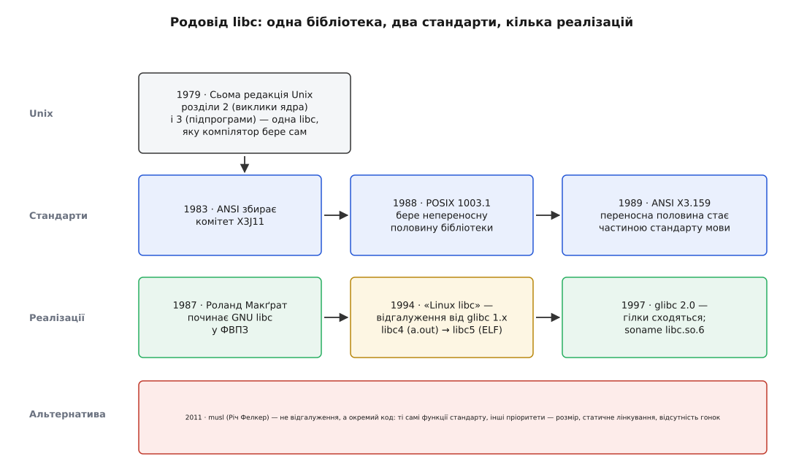

# 📜 Як бібліотека мови C стала окремою річчю

Слово libc сьогодні означає дві речі, які логічно не пов'язані: двері в ядро й середовище виконання мови. Вони лежать в одному файлі не тому, що так задумали, а тому, що на початку не було чого розділяти, — а коли стало, файл уже став тим, від чого залежала вся система. Ця історія пояснює і зрощення, і цифру 6 у назві `libc.so.6`.



*Розділ на «шлюз» і «середовище виконання» відбувся у стандартах наприкінці 1980-х, але жодна реалізація за ним не пішла: бібліотека як була одним файлом, так ним і лишилася.*

## Розділ 2 і розділ 3 в одному файлі

Мова C народилася без бібліотеки. У ній немає ані оператора друку, ані вбудованого читання файлу — на відміну від Фортрана й Кобола, де ввід і вивід були частиною самої мови. Усе, що програмі треба зробити з зовнішнім світом, вона робить викликом функції, а функції треба звідкись узяти.

У Unix їх брали з одного місця. Подивимося, як це описано в довіднику Сьомої редакції (1979), у вступі до розділу 3. Там сказано, що ці функції разом із функціями розділу 2 «constitute library libc, which is automatically loaded by the C compiler» — становлять бібліотеку libc, яку компілятор підключає автоматично.

У цій фразі — весь корінь пізнішої плутанини, тільки тоді ніхто не бачив у ній проблеми. Розділ 2 довідника — це системні виклики: `open`, `read`, `fork`, тобто прохання до ядра. Розділ 3 — підпрограми: `qsort`, `atoi`, пакунок стандартного вводу-виводу з його буферами. Дві геть різні речі. Але зібрані вони в один архів `/lib/libc.a`, і компілятор бере його сам, нічого не питаючи.

Чому так? Бо питання не стояло. Система була одна, компілятор один, машина одна. Ділити бібліотеку на «те, що звертається до ядра» і «те, що не звертається», означало б додати програмістові роботи (два ключі замість нуля) заради розрізнення, яке нікому не було потрібне: ядро Unix і бібліотека Unix постачалися разом і мінялися разом. Розрізнення стає потрібним лише тоді, коли одна половина може існувати без другої. Це сталося набагато пізніше.

## Стандарти розділили те, чого файл не розділив

До початку 1980-х C розповзся далеко за межі Unix, і кожна реалізація підправляла його під себе. У 1983 році Американський національний інститут стандартів зібрав комітет X3J11, щоб описати мову однозначно. Комітет мусив вирішити, що робити з бібліотекою, — і рішення виявилося показовим.

Половину бібліотеки описати було можна: `printf`, `malloc`, `strcmp`, `qsort`, математика, робота з рядками. Ці функції не залежать від того, чи є під ними операційна система взагалі; їх можна реалізувати на мікроконтролері без файлів і без процесів. Ця половина ввійшла в стандарт мови, який завершили 1989 року й затвердили як ANSI X3.159-1989 (роком пізніше той самий текст став міжнародним ISO/IEC 9899:1990).

Другу половину — `fork`, `open`, `pipe`, права доступу, сигнали — описати в стандарті мови було неможливо, бо вона говорить не про мову, а про конкретну систему. Її передали іншому комітетові: непереносну частину бібліотеки Unix віддали робочій групі IEEE 1003, і вона лягла в основу стандарту POSIX 1988 року ([що саме стандартизує POSIX](root:sys-unix/posix-standard) — набір функцій і поведінок, який зобов'язується надати Unix-подібна система, окремо від мови, якою по них звертаються).

Ось момент, коли дві ролі бібліотеки нарешті назвали вголос і розвели по різних документах: перекладач до ядра — в один стандарт, середовище виконання мови — в інший. І ось момент, коли жодна реалізація за цим розділом не пішла. Файл лишився один, бо на Unix обидві половини все одно були потрібні всім і завжди, а ділити готовий архів заради чистоти категорій ніхто не збирався. Розділ стався на папері; на диску його немає й досі.

## GNU пише свою бібліотеку з нуля

Тим часом Фонд вільного програмного забезпечення будував систему, яка мала повторити Unix, не взявши з нього жодного рядка коду AT&T ([інструментарій GNU і звідки взялося «GNU/Linux»](root:sys-unix/gnu-userland)). Компілятор без бібліотеки нікому не потрібен, а взяти чужу libc було не можна саме з юридичних міркувань — тож бібліотеку довелося писати заново.

За усталеним викладом історії проєкту, більшу частину першої GNU libc написав Роланд Макґрат, який працював на Фонд улітку 1987 року, будучи ще підлітком. У лютому 1988-го Фонд повідомляв, що бібліотека вже майже покриває функціональність, якої вимагає ANSI C, — тобто писалася вона прицільно під стандарт, який саме дописували. Ці подробиці (вік автора, точний місяць) походять із життєписів проєкту, а не з первинних документів, тож дату варто вважати достовірною з точністю до року; сам факт авторства Макґрата підтверджений усією подальшою історією проєкту — він лишався в ньому тридцять років і оголосив про відхід тільки в липні 2017-го.

Важливо, чим GNU libc відрізнялася за задумом. Бібліотека Сьомої редакції була бібліотекою **своєї** системи: її писали під одне ядро. GNU libc від початку писали як бібліотеку, яку доведеться переносити на різні ядра — на майбутнє власне ядро GNU, на різні Unix-и, на різні архітектури. Тому в ній з'явився внутрішній поділ на «те, що однакове скрізь» і «те, що залежить від системи». Розділ, якого не робили назовні, зробили всередині — і саме він потім дозволив тій самій бібліотеці працювати на ядрі, про яке 1987 року ніхто не чув.

## Linux не дочекався і пішов своєю гілкою

Коли Linux почав швидко рости, GNU libc розвивалася в іншому темпі й з іншими пріоритетами. Довідник Linux описує те, що сталося, без прикрас: у першій половині 1990-х розробники Linux, вважаючи, що розвиток glibc не задовольняє потреб Linux, відгалузили від glibc 1.x власну бібліотеку — «Linux libc». Була й друга, суто юридична перешкода злиттю: питання про передання авторських прав на код не давало вливати напрацювання гілки назад у GNU.

Ця лінія прожила приблизно до 1998 року, а її нумерація продовжувала нумерацію спільних бібліотек Linux — звідси дві назви, що досі трапляються в старих текстах:

```
libc4   останній випуск для двійкового формату a.out;
        перша (примітивна) підтримка спільних бібліотек
libc5   перший випуск для формату ELF; soname — libc.so.5
```

Цей перехід варто побачити окремо, бо він показує, чому гілка взагалі мала сенс. Linux у ті роки міняв двійковий формат виконуваних файлів: a.out був простий і не давав нормально робити спільні бібліотеки, ELF давав ([будова ELF: сегменти, секції, точка входу](root:sys-unix/elf-structure)). Зміна формату — це зміна того, як програма запускається і як до неї приєднується код бібліотеки під час роботи ([коли код бібліотеки приєднується до програми](root:sys-unix/static-and-dynamic-linking)). Ніщо в цій роботі не стосувалося мови C; вона цілком стосувалася системи. Бібліотека, у якій зрослися дві ролі, мусила бігти за ядром — і бігти швидше, ніж бібліотека мови взагалі має рухатися.

## Чому в libc.so.6 стоїть шістка

До 1997 року GNU libc наздогнала й перегнала гілку: у січні 1997-го Фонд випустив glibc 2.0, і за оцінкою самих же розробників Linux вона була відчутно кращою — повніша відповідність POSIX, інтернаціоналізація, підтримка IPv6, робота з 64-бітними даними. (Найраніший файл серії 2.0 на дзеркалі GNU — це `glibc-2.0.1.tar.gz` від 4 лютого 1997 року, що з датою випуску 2.0 в січні узгоджується.) Дистрибутиви, які були на Linux libc, перейшли назад на glibc, і гілка зупинилася.

Але злиття лишило слід у назві файлу. Гілка вже зайняла ім'я `libc.so.5`, тож щоб на одній машині могли співіснувати старі програми, зібрані з libc5, і нові, зібрані з glibc 2.0, останній довелося взяти наступне вільне число:

```
libc.so.4   Linux libc4   двійковий формат a.out
libc.so.5   Linux libc5   двійковий формат ELF
libc.so.6   glibc 2.0     ELF — і так з 1997 року донині
```

Ім'я спільної бібліотеки, за яким компонувальник і завантажувач упізнають несумісні між собою версії, — це soname, і воно навмисно змінюється рідко: зміна soname означає, що всі старі програми доведеться перезбирати ([soname й версіонування бібліотек](root:sys-unix/soname-versioning)). Тому шістка так і застигла. У 2026 році актуальна glibc має номер 2.44, а файл, з яким зв'язана кожна програма на машині, називається так само, як 1997-го. Число 6 у ньому — не покоління glibc і не версія чогось; це слід від чужого відгалуження, яке скінчилося майже тридцять років тому.

## Хто тримає бібліотеку, від якої залежать усі

Бібліотека, без якої не запускається жодна програма, — це влада, і історія glibc показує, що з цим ніколи не було просто. Ульріх Дреппер зробив перший внесок у вересні 1995-го, а вже до 1997-го писав більшість коду; за наступні п'ятнадцять років на нього припало близько 63 % усіх комітів. З 2001 року проєктом керував комітет із Дреппером як головним супровідником — призначення, яке сам Дреппер вважав спробою Річарда Столмена перебрати проєкт під контроль і публічно так і називав. У березні 2012-го комітет проголосував за власний розпуск і передав справи кільком супровідникам, які працюють за згодою громади.

Був і другий, тихіший конфлікт того ж роду. У 2009-му Debian перейшов на eglibc — варіант glibc, зроблений під потреби вбудованих систем і під архітектури, яких основна гілка не підтримувала. Це знову було відгалуження через темп і пріоритети, а не через код. Розв'язалося воно так само, як попереднє: напрацювання eglibc влили назад у glibc у версії 2.20, і до 2014 року дистрибутиви повернулися до основної гілки.

Візерунок повторюється тричі поспіль. Хтось вирішує, що бібліотека рухається не туди, відгалужується, кілька років живе окремо — і повертається, коли основна гілка доганяє. Тримає всіх укупі не адміністрування, а те, що збиратися має вся система разом: дистрибутив із двома несумісними libc — це два дистрибутиви.

## musl: не відгалуження, а інша відповідь

Перша реалізація, яка не повернулася, з'явилася тому, що не була відгалуженням. 11 лютого 2011 року Річ Фелкер випустив musl 0.5.0 — бібліотеку, написану з нуля, а не з чужого коду. Тому в її історії немає ані питання про передання авторських прав, ані зобов'язань перед чиїмись давніми рішеннями, а ліцензія в неї дозвільна, на відміну від LGPL у glibc ([пермісивні й копілефтні ліцензії](root:sys-notary/permissive-vs-copyleft)) — для вбудованих і статично зібраних продуктів це має цілком практичне значення.

Задекларовані цілі musl — швидка, проста, легка, вільна й **правильна**. Останнє слово тут головне і найсуперечливіше: musl свідомо не повторює хиб glibc заради сумісності. Там, де glibc має інтерфейс із поламаним ABI, musl не відтворює його як є, а вимагає, щоб програми користувалися стандартним інтерфейсом. Ціна очевидна: частина програм, написаних під glibc, під musl не збереться без правок — і саме тому суперечка «musl ламає сумісність» проти «musl не приймає чужих багів» триває донині.

Друга група цілей стосується не стандартів, а поведінки в найгіршому випадку: жодних гонок, жодних внутрішніх відмов через вичерпання ресурсів, передбачуване споживання пам'яті й придатність до статичного лінкування як штатний режим, а не як вправа. Це прямо відповідає на біль, який породжує зрощення двох ролей: у glibc статичний файл усе одно тягне модулі під час роботи, а в musl тягнути нема чого.

І остання деталь, у якій добре видно, як ідеї ходять між реалізаціями. musl від початку клала все в один `libc.a`/`libc.so`, лишаючи `libpthread`, `libm`, `libcrypt` порожніми файлами — тільки щоб не ламалися складальні системи, які досі дописують `-lpthread`. У glibc 2.34, у серпні 2021 року, зробили те саме: `libpthread`, `libdl`, `libutil` і `libanl` переїхали в `libc.so.6`, а від старих бібліотек лишилися порожні архіви заради сумісності зі збірками. Дві бібліотеки, які починали з протилежних міркувань, зійшлися в тому самому рішенні через десять років — бо міркування було одне: якщо взяти шлюз без середовища виконання все одно не можна, ділити їх на файли немає сенсу.

## Що чим підперте

Дати в цій історії — різної надійності, і змішувати їх не варто — тим паче що частина походить із переказів самої спільноти, а не з документів.

- **Єдина libc з розділів 2 і 3** — вступ до розділу 3 довідника Сьомої редакції Unix (1979). *Статус: первинне джерело, цитата дослівна.*
- **Комітет X3J11 з 1983 року, ANSI X3.159-1989, той самий текст як ISO/IEC 9899:1990** — усталена хронологія стандартизації. *Статус: усталено з точністю до року; точного дня затвердження оглядові джерела не подають.*
- **Непереносна частина бібліотеки Unix → робоча група IEEE 1003 → POSIX 1988** — саме цей передавальний акт і є документальним місцем розділу двох ролей. *Статус: усталено.*
- **Роланд Макґрат, ФВПЗ, літо 1987; «майже покриває ANSI C» станом на лютий 1988; відхід у липні 2017** — з життєписів проєкту. *Статус: авторство усталене й підперте тридцятьма роками супроводу; конкретний місяць і подробиця про вік автора — з переказу, надійні приблизно до року.*
- **Linux libc як відгалуження від glibc 1.x, libc4 (a.out) → libc5 (ELF, `libc.so.5`)** — сторінка довідника `libc(7)` з набору Linux man-pages, тобто джерело самої спільноти Linux. *Статус: добре засвідчено. Юридична перешкода злиттю (передання авторських прав) — з переказів проєкту, деталей документами тут не підперто.*
- **glibc 2.0 у січні 1997 і перехід дистрибутивів назад** — оглядові джерела плюс каталог випусків GNU, де найраніший файл серії — `glibc-2.0.1.tar.gz` від 4 лютого 1997 року. *Статус: місяць випуску 2.0 — з переказу, але узгоджений із датою файлу.*
- **musl 0.5.0, 11 лютого 2011, Річ Фелкер; цілі проєкту** — власний список випусків musl і власний FAQ. *Статус: первинне джерело.*
- **Дреппер, 63 % комітів, комітет 2001 року й розпуск у березні 2012; оцінка призначення як спроби Столмена перебрати проєкт** — з оглядових джерел. *Статус: числа й дати усталені; оцінка — позиція однієї зі сторін конфлікту, не встановлений факт.*

Одне з цієї історії лишилося на видноті — назва файлу. `libc.so.6` не позначає ані версію, ані покоління: це порядковий номер, узятий 1997 року, щоб розминутися з чужою гілкою, яка на той час уже зайняла п'ятірку. Усе інше сховалося в поведінку.
