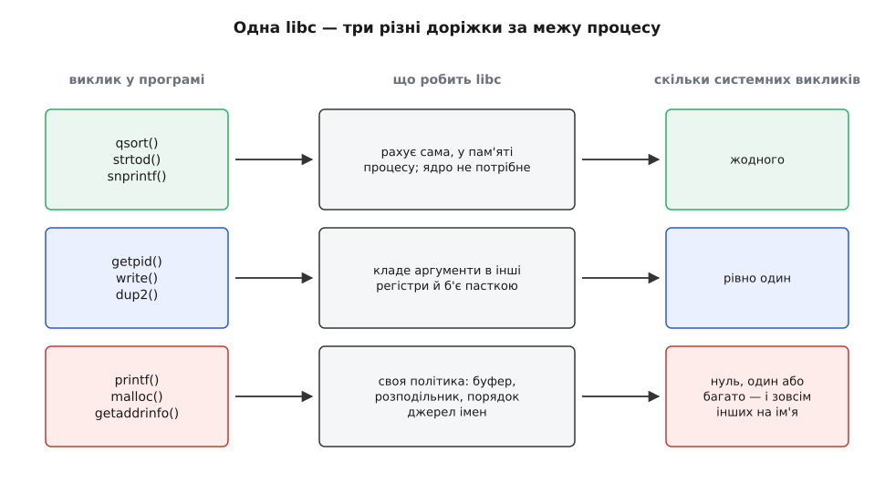
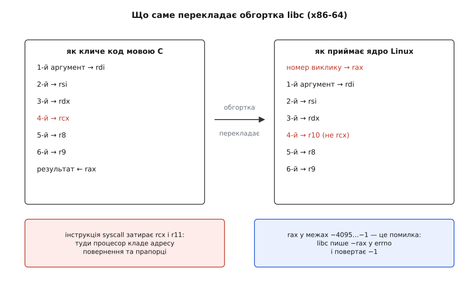
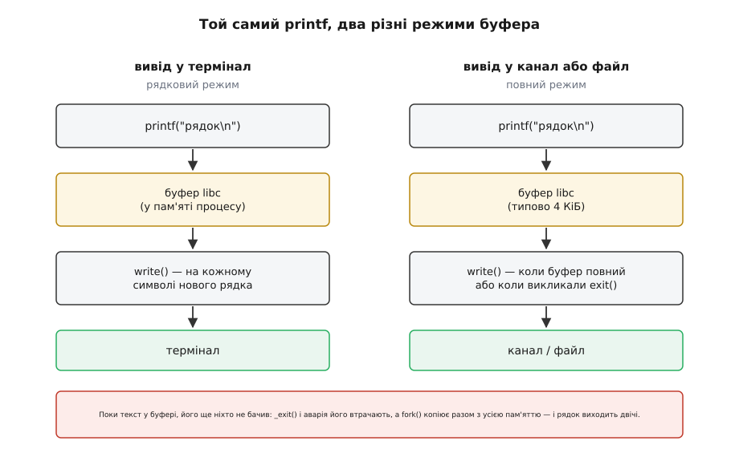
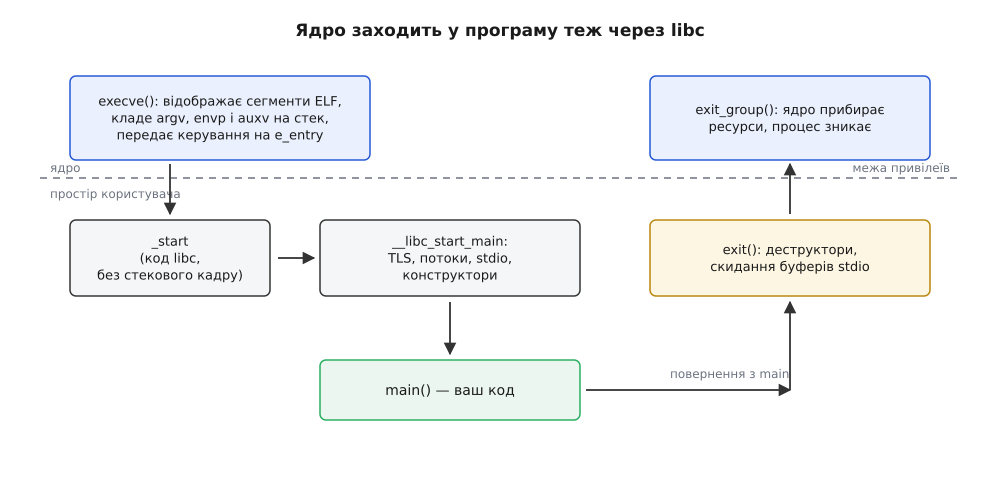

# libc як шлюз до ядра

<preknowlist>
- [Ядро й простір користувача](root:sys-unix/kernel-and-userspace) — дві зони привілеїв і чому код застосунку не дістає до заліза напряму.
- [Системний виклик: як програма просить ядро](root:sys-unix/syscall-mechanics) — інструкція-пастка, перехід у режим ядра й повернення назад.
- [Угода про виклик (ABI)](root:hw-arch/calling-convention) — як аргументи функції розкладаються по регістрах і стеку та хто які регістри зобов'язаний зберегти.
- [Статичне й динамічне лінкування](root:sys-unix/static-and-dynamic-linking) — коли код бібліотеки приєднується до програми: під час збірки чи під час запуску.
- [POSIX: що саме стандартизовано](root:sys-unix/posix-standard) — який перелік функцій і поведінок зобов'язується надати Unix-подібна система.
</preknowlist>

## Розрив, який хтось мусить перекрити

Програма мовою C виводить рядок так:

```c
write(1, "привіт\n", 13);
```

На вигляд це звичайний виклик функції: покласти три аргументи туди, де їх чекає викликана сторона, і стрибнути за адресою. Але вхід у ядро влаштований інакше, і не в дрібницях, а принципово. У ядра немає адреси, на яку можна стрибнути з програми: перехід у привілейований режим робить окрема інструкція процесора — `syscall` на x86-64, `svc #0` на AArch64. Ця інструкція не знає, яку саме послугу просять; послуга називається **числом** у наперед домовленому регістрі. За межею процесу імені `write` не існує взагалі. Існує число 1 на x86-64 і число 64 на AArch64 — для того самого запису в дескриптор.

Звідси видно, що розрив між рядком коду й входом у ядро не один, а трьох різних видів.

**Регістри розкладені інакше.** Мова C має свою угоду про виклик, і компілятор кладе аргументи саме за нею. Ядро приймає їх за іншою угодою — близькою, але не тотожною, і розбіжність тут не косметична: якщо покласти четвертий аргумент туди, куди його кладе `call`, ядро прочитає сміття.

**Помилки описані іншою мовою.** Функція мови C зазвичай каже про невдачу окремим значенням (`-1`) і залишає причину в окремій змінній. Ядро повертає **одне** число, у якому змішані і результат, і причина невдачі.

**Одиниця називання інша.** Виклик має номер, а не ім'я; номери різні на різних архітектурах; сам набір викликів із роками змінюється — щось з'являється, щось перестають радити. Ім'я `open` живе десятиліттями, номер під ним — ні.

Хтось мусить перекрити ці три розриви. Компілятор не годиться: він компілює **мову**, а мова C про операційні системи не знає нічого. Стандарт мови обіцяє, що є `fopen`, і мовчить про те, як дістатися до диска, — бо той самий стандарт має справджуватися й там, де диска немає. Якби компілятор усе-таки вшивав інструкцію-пастку сам, номер виклику застигав би в кожному двійковому файлі в момент збірки, і кожна зміна в ядрі била б по всіх програмах відразу.

Отже, потрібне окреме місце — **одне для всієї системи й змінюване незалежно від програм**, — де мова зустрічається з системою. У Unix це місце називається libc: бібліотека мови C, яку програма отримує, нічого не просячи. Компілятор долінковує її сам, і навіть найкоротша програма на C виявляється зв'язаною з нею:

```
$ echo 'int main(void){return 0;}' > t.c && gcc t.c -o t
$ ldd t
        linux-vdso.so.1 (0x00007ffd4b3fe000)
        libc.so.6 => /lib/x86_64-linux-gnu/libc.so.6 (0x00007f2c7ea00000)
```

Назва тримається з часів, коли бібліотека була одна на всю систему, і саме тому вона сьогодні містить речі, які логічно між собою не пов'язані ([як libc став окремою річчю](root:sys-unix/libc-as-gateway/hist-libc-story.md)). Перше, що варто побачити: те, що для програміста виглядає однорідним набором функцій, зсередини розпадається на три доріжки, які по-різному стосуються ядра.



*Функції з одного заголовкового файлу можуть не мати нічого спільного за поведінкою на межі: одні не залишають простору користувача, інші перетворюються рівно на один системний виклик, треті реалізують власну політику й ходять до ядра, коли самі вважають за потрібне.*

Найпростіша з них — чистий переклад однієї угоди в іншу, і з неї варто почати, бо решта надбудовується саме над нею.

## Перший шар: переклад двох угод

Найтонша обгортка в libc — та, що просто перекладає виклик мовою C у виклик мовою ядра. Подивимося, що саме там перекладається, на x86-64.



*Перші три аргументи лежать однаково, і саме ця схожість обманює: четвертий аргумент ядро чекає в r10, бо rcx у момент пастки вже зайнятий адресою повернення.*

Різниць рівно три, і кожна має причину.

Перша: номер виклику треба покласти в `rax` — регістр, у якому за угодою мови C **повертають** результат. У момент виклику він вільний, тож ядро використовує його двічі: спершу як питання, потім як відповідь.

Друга: четвертий аргумент іде в `r10`, а не в `rcx`. Причина суто апаратна. Інструкція `syscall` не кладе адресу повернення на стек, як `call`, — вона кладе її в `rcx`, а прапорці процесора в `r11`. Отже, обидва ці регістри гарантовано затираються, і покласти туди аргумент не можна. Угода мови C про це не знає й спокійно віддає `rcx` під четвертий аргумент.

Третя: результат повертається одним числом, у якому закодовано й успіх, і невдачу. Ядро домовилося, що значення в діапазоні від −4095 до −1 — це помилка, а її код дорівнює цьому числу зі зміненим знаком.

Ось як виглядає виклик без обгортки — уже не зовсім мовою C, бо назви обмежень `"a"`, `"D"`, `"S"`, `"d"` — це імена конкретних регістрів `rax`, `rdi`, `rsi`, `rdx`:

```c
#include <stddef.h>

static long sys_write(int fd, const void *buf, size_t n)
{
    long ret;
    __asm__ volatile (
        "syscall"
        : "=a"(ret)                                  /* результат — з rax */
        : "a"(1L), "D"((long)fd), "S"(buf), "d"(n)   /* номер, далі rdi, rsi, rdx */
        : "rcx", "r11", "memory");                   /* їх затирає сама інструкція */
    return ret;
}
```

Викличемо його із завідомо хибним дескриптором:

```c
long r = sys_write(-1, "x", 1);
/* r == -9; більше ядро не сказало нічого. 9 — це код EBADF */
```

Число −9 — це вся діагностика, яку дає ядро. Перетворити її на звичну для мови C форму — робота обгортки, і виглядає вона приблизно так:

```c
ssize_t write(int fd, const void *buf, size_t n)
{
    long r = sys_write(fd, buf, n);
    if (r < 0 && r >= -4095) {
        errno = (int)(-r);
        return -1;
    }
    return (ssize_t)r;
}
```

Тут ховається деталь, через яку навіть «тонка» обгортка не буває зовсім тонкою. `errno` — не глобальна змінна. Якби вона була глобальною, два потоки, що одночасно отримали помилку, затирали б одне одному причину, і перевірка після невдалого виклику давала б чужий код. Тому в сучасній libc `errno` — це макрос, який розгортається у звертання за адресою, окремою для кожного потоку:

```c
#define errno (*__errno_location())
```

А щоб `__errno_location()` мала що повернути, у процесі вже має бути налагоджена пам'ять потоку. Хтось мусив її створити ще до того, як програма зробила перший виклик. Тобто найтонша обгортка над системним викликом уже спирається на середовище виконання, яке живе в тій самій бібліотеці. Це перший шов, у якому дві ролі libc торкаються одна одної, — і зрослися вони куди міцніше, ніж видно з цього прикладу. Побудувати повний виклик власноруч і подивитися, що саме доводиться відтворити, можна на невеликому [проєкті без libc](root:sys-unix/libc-as-gateway/proj-syscall-without-libc.md).

## Другий шар: ім'я лишається, коли виклик змінюється

Обгортка не тільки перекладає — вона тримає ім'я нерухомим, поки під ним усе рухається. Три приклади показують три різні напрямки цього руху.

**Виклик може називатися інакше на іншій архітектурі.** На aarch64 ядро свідомо не має системного виклику `open`: замість нього є загальніший `openat`, який приймає ще й дескриптор каталогу, від якого відлічувати відносний шлях. Функція `open()` мовою C там нікуди не поділася — libc реалізує її через `openat` зі спеціальним значенням `AT_FDCWD`, що означає «від поточного каталогу». Той самий вихідний код збирається й працює на обох архітектурах, хоча в одному випадку в ядро йде один виклик, а в другому — інший.

**Виклик може взагалі не дійти до ядра.** Ядро відображає в кожен процес крихітну спільну бібліотеку — vDSO, яку видно в наведеному вище виводі `ldd` окремим рядком. У ній лежить код кількох функцій, що читають дані, які ядро й так оновлює в доступній для читання сторінці: поточний час, номер процесора. Тому `clock_gettime()` у libc спершу пробує код із vDSO і б'є пасткою лише тоді, коли джерело часу цього не дозволяє. Програма викликає ту саму функцію, а переходу в ядро може не бути зовсім.

**Виклик може змінити своє місце в самій libc.** У glibc 2.34 (серпень 2021) те, що раніше лежало в окремих бібліотеках `libpthread`, `libdl`, `libutil` і `libanl`, переїхало в `libc.so.6`. Функції лишилися ті самі, а `-lpthread` у командному рядку компонувальника перестав бути потрібним — порожні архіви лишили тільки для того, щоб старі збірки не ламалися.

За цим стоять дві обіцянки різної природи, і плутати їх не можна. **Ядро обіцяє двійкову сталість**: номер виклику й сенс його аргументів не змінюються ніколи, бо інакше перестане працювати вже зібраний двійковий файл. Це не побажання, а правило розробки Linux, публічно й різко сформульоване Лінусом Торвальдсом наприкінці 2012 року в суперечці про змінений код помилки — «ми не ламаємо простір користувача» ([чому ABI ядра тримають незмінним](root:sys-unix/kernel-abi-stability)). **libc обіцяє сталість на рівні мови**: ім'я функції, її сигнатура й поведінка. Обидві обіцянки потрібні, але вони про різні речі, і саме тому між ними потрібен перекладач, який має право змінюватися.

Що ця конструкція не є єдино можливою, видно з систем, які вибрали інакше. У macOS і Solaris номери системних викликів навмисно **не** стабільні: єдиними офіційними дверима в ядро оголошено libc, і оновлення системи вільно переставляє все, що за нею. Мова Go, яка на Linux звертається до ядра власними пастками, оминаючи libc, на macOS свого часу робила так само — і її двійкові файли час від часу ламалися після оновлень системи; відтоді Go на macOS і Solaris ходить через libc. На Linux вона й далі може дозволити собі власні пастки саме тому, що Linux пообіцяв те, чого не обіцяли інші.

## Третій шар: те, чого в ядрі немає взагалі

Дотепер libc лише передавала прохання далі. Але більша частина її обсягу зайнята речами, яких ядро не надає й не збирається надавати, — і саме тут вона перестає бути обгорткою й починає бути окремою системою зі своєю поведінкою.

### Буфер stdio: чому `printf` — це не `write`

Ядро не знає, що таке рядок тексту. Воно знає байти й дескриптори. Кожен `write` — це пастка з переходом у привілейований режим і назад, і коштує вона на кілька порядків більше, ніж запис у пам'ять. Якби `printf` віддавав байти в ядро одразу, друк одного рядка на двадцять символів коштував би один перехід, а друк того ж рядка посимвольно — двадцять.

Тому libc тримає власний буфер у пам'яті процесу й вирішує сама, коли його віддати ядру.

**Умова: записати у файл 100 000 рядків по 20 байтів.**

```
без буфера:      100000 переходів × ≈ 0.5 мкс   ≈ 50 мс самих лише переходів
буфер 4096 Б:    4096 ÷ 20 = 204 рядки на один write
                 100000 ÷ 204 ≈ 490 переходів × 0.5 мкс ≈ 0.25 мс
```

Різниця у дві сотні разів на порожньому місці — саме тому буфер є завжди. Ціна за нього — те, що момент друку більше не збігається з моментом виклику `printf`, а правило скидання залежить від того, **куди** веде дескриптор.



*Той самий код поводиться по-різному залежно від того, чи веде stdout у термінал: буфер вибирає режим під час першого використання потоку.*

Правило таке: якщо `stdout` веде в термінал, буфер рядковий — його скидають на кожному символі нового рядка; якщо в канал або файл — повний, і його скидають лише коли він заповнився або коли програма нормально завершується. `stderr` не буферизують узагалі, щоб повідомлення про помилку не загубилося.

Наслідки цього рішення бачив кожен, хто налагоджував програму друком:

```c
#include <stdio.h>
#include <unistd.h>

int main(void)
{
    printf("рядок\n");
    fork();
    return 0;
}
```

Запущена в терміналі, ця програма друкує «рядок» один раз: буфер скинуто ще на переводі рядка, і `fork` копіює вже порожній буфер. Запущена як `./t | cat`, вона друкує «рядок» **двічі**: у каналі режим повний, текст на момент розгалуження ще лежить у пам'яті процесу, а `fork` копіює пам'ять разом із ним — і кожен з двох процесів наприкінці чесно віддає ядру свою копію. Ядро тут ні до чого: воно бачить два цілком законні `write`. Так само зникає вивід, якщо процес завершується через `_exit()` або гине від сигналу: `exit()` скидає буфери, а `_exit()` іде в ядро одразу.

> 🔧 **Навіщо це.** Звідси два практичні правила. Перше: коли ви міряєте, скільки програма ходить до ядра (`strace -c`), пам'ятайте, що ви міряєте роботу буфера, а не кількість ваших `printf` — і вимкнений буфер (`setvbuf(stdout, NULL, _IONBF, 0)`) здатен сповільнити вивід у сотні разів. Друге: в обробнику сигналу друкують через `write(2, …)`, а не через `printf` — бо буфер має стан, і сигнал може перервати програму рівно посеред його зміни ([що взагалі можна робити в обробнику сигналу](root:sys-unix/async-signal-safety)).

### Решта того, чого ядро не робить

Буфер — найпомітніший приклад, але не єдиний. Той самий візерунок повторюється всюди, де ядро дає грубий, дорогий і рідкісний засіб, а програмі потрібен дрібний, дешевий і частий.

`malloc()` — не системний виклик. Ядро видає пам'ять сторінками по 4 КіБ і лише через `brk` або `mmap`; просити в нього 24 байти безглуздо. Розподільник усередині libc бере в ядра великими шматками й нарізає їх на запити програми, ведучи власний облік вільних місць ([звідки алокатор бере пам'ять](root:sys-unix/allocator-and-kernel)).

`pthread_create()` — теж не системний виклик. Ядро вміє створити задачу, що поділяє адресний простір із батьківською (`clone`), і вміє приспати задачу на адресі в пам'яті до чужого сигналу (`futex`). Усе інше — стек потоку, пам'ять потоку з тією-таки `errno`, м'ютекси, які в неконкурентному випадку взагалі не ходять до ядра, — робить libc ([потоки як задачі ядра](root:sys-unix/threads-as-tasks), [futex і дешеве очікування](root:sys-unix/eventfd-and-futex)).

`getaddrinfo()` — найяскравіший випадок: ядро не має жодного поняття про доменні імена. Вирішення, де шукати ім'я — у `/etc/hosts`, через DNS, у LDAP чи в службі каталогів, — цілком належить libc, яка читає `/etc/nsswitch.conf` і **на ходу підвантажує** відповідні модулі ([шлях розв'язання імені](root:sys-unix/name-resolution-path)).

І нарешті ціла область, де ядра немає взагалі: `qsort`, `strtod`, `snprintf`, математичні функції, локалі, робота з часовими поясами. Це просто код, який виконується в процесі й до межі не наближається.

Звідси головний висновок про природу libc: **це дві бібліотеки в одному файлі**. Одна — шлюз до ядра, перекладач між двома угодами. Друга — середовище виконання мови C: розподільник, потоки, буфери, форматування, локалі. Історично вони зрослися, бо в ранньому Unix бібліотека була одна й питання не стояло. Логічно вони не пов'язані. А наслідки цього зрощення відчуває кожен, хто збирає програми.

## Ціна зрощення: libc стає ABI самої системи

Оскільки шлюз і середовище виконання лежать в одному файлі, програма не може взяти одне без другого. А оскільки без шлюзу не обходиться ніхто, з libc виявляються зв'язаними майже всі: програми на C і C++, інтерпретатори Python і Ruby, стандартна бібліотека Rust, будь-яка бібліотека, що читає файли. Одна бібліотека, яку неможливо не взяти, перестає бути бібліотекою й стає **фактичним ABI системи**: її версія і є версією системи з погляду двійкового файлу.

Найчастіший спосіб це відчути:

```
$ ./myapp
./myapp: /lib/x86_64-linux-gnu/libc.so.6: version `GLIBC_2.34' not found
```

Програму зібрали на новішій системі й спробували запустити на старішій. Механізм за цим — версіонування символів: коли поведінка функції змінюється, glibc не прибирає стару реалізацію, а додає нову під новою міткою версії, і компонувальник записує в двійковий файл, якої саме мітки той потребує. Старі мітки лишаються назавжди, нових у старій бібліотеці взятися нізвідки. Тому сумісність тут однобічна: зібране на старій glibc працює на новій, зворотне — ні ([SONAME і версіонування бібліотек](root:sys-unix/soname-versioning)).

> 🔧 **Навіщо це.** Практичне правило випливає прямо: збирати треба на **найстарішій** системі з тих, які треба підтримати, — у контейнері з потрібною версією glibc, а не на своїй свіжій машині. Жодні прапорці компілятора цього не замінять, бо мітка версії потрапляє у файл на етапі лінкування. Подивитися, чого саме потребує ваш файл і що вміє ваша система, допомагає [короткий довідник по межі libc](root:sys-unix/libc-as-gateway/api-libc-boundary.md).

Друга ціна зрощення — статичне лінкування glibc не дає того, чого від нього чекають. Здавалося б, вкомпілювати бібліотеку всередину й отримати самодостатній файл. Але частина glibc влаштована так, що **обов'язково** підвантажує код під час роботи: модулі розв'язання імен вибираються за `/etc/nsswitch.conf` уже на запущеній машині. Статично злінкований файл, який кличе `getaddrinfo()` чи `getpwnam()`, або не знайде цих модулів, або підтягне їх із системи, де його запустили, — і компонувальник чесно про це попереджає. Ось чому справді статичні збірки роблять із musl, де такої динаміки немає, — і чому саме її обрав Alpine.

## Ядро заходить у програму теж через libc

Досі ми дивилися лише в один бік — від програми до ядра. Але й зворотний напрямок проходить через ту саму бібліотеку, і саме тут стає видно, наскільки глибоко вона вросла.

Ядро нічого не знає про `main`. Виконуючи `execve`, воно відображає сегменти файлу ELF у пам'ять, будує на стеку аргументи, оточення й службовий вектор `auxv` — і передає керування на адресу, записану в заголовку файлу як точка входу. Ім'я `main` у ядрі не згадується ніде.



*Точка входу програми належить libc; функція main — лише те, що libc викликає, налагодивши середовище, і чиє повернене значення вона перетворює на код виходу.*

За точкою входу стоїть `_start` — крихітний шматок коду з libc, який компонувальник додає до кожної програми. Він не має звичайного стекового кадру, бо повертатися йому нема куди: він забирає зі стека `argc`, `argv` і `envp` та передає їх у `__libc_start_main`. Ось ця функція й робить усе, що потрібно, аби мова C нарешті запрацювала: налагоджує пам'ять потоку (без якої не існує `errno`), готує захисне значення стека, ініціалізує потоки stdio, викликає конструктори глобальних об'єктів — і аж тоді викликає `main`. Коли `main` повертає значення, воно передається в `exit()`, який виконує зареєстровані через `atexit` дії, деструктори, скидає буфери stdio — і **тільки після цього** робить справжній системний виклик `exit_group`.

Це замикає картину. Той факт, що `_exit()` губить вивід, а `exit()` ні, — не примха: перший іде в ядро повз усе перелічене, другий проходить увесь цей шлях. І та ж таки залежність пояснює, чому програма, зібрана з `-nostdlib`, не має ані того, хто покличе `main`, ані `errno`, ані буферів: усе це — не властивості системи, а вміст бібліотеки, яку тоді не взяли.

## Шлюз можна замінити

Раз libc — окремий шар, а не частина ядра, її можна поміняти. Реалізацій кілька, і різняться вони не якістю, а тим, для чого їх зробили.

**glibc** — усталений вибір настільних і серверних дистрибутивів: повна підтримка локалей, розв'язання імен через змінні модулі, версіонування символів заради сумісності зі старими файлами, велика кількість розширень понад POSIX. Плата — розмір і складність.

**musl** — написана з нуля з інших міркувань: мала, строго стандартна, зручна для статичного лінкування, з передбачуваними споживанням пам'яті й поведінкою в умовах конкурентності. Її обрали Alpine та багато вбудованих систем.

**bionic** — libc Android, зроблена під свої обмеження ліцензування й енергоспоживання. **uClibc-ng** і **dietlibc** живуть у глибоко вбудованому світі, де важать сотні кілобайтів.

Заміна libc не безкоштовна саме через зрощення двох ролей: шлюз в усіх однаковий (номери викликів же спільні), а середовище виконання — ні. Ламаються не системні виклики, а розширення поза POSIX, поведінка локалей, подробиці розв'язання імен і все, що спиралося на конкретну реалізацію.

Крайній випадок — не брати libc зовсім. Так робить Go на Linux: власні обгортки над пастками, власний планувальник поверх `clone` і `futex`, власний розподільник поверх `mmap`. Ціну видно одразу, і вона повчальна: разом із libc програма втрачає не шлюз (його легко відтворити), а те, що шлюзом не є. Тому в Go є **два** способи розв'язувати доменні імена — власний клієнт DNS для збірок без libc і звертання до `getaddrinfo` для збірок із нею, — і поводяться вони в складних конфігураціях мережі по-різному.

Ось де сходиться все сказане. libc — це місце зустрічі двох контрактів із різним строком життя: ядро обіцяє незмінні **числа**, мова обіцяє незмінні **імена**, і хтось мусить тримати обидві обіцянки одночасно. Усе, що звично називають «проблемами glibc» — не запускається на старому дистрибутиві, не лінкується статично, поводиться інакше під Alpine, — це наслідки одного факту: в одному файлі живуть перекладач і середовище виконання, і програма не може взяти лише одне з двох. Тому питання «яка тут libc і якої версії» — це питання про систему, а не про бібліотеку.
