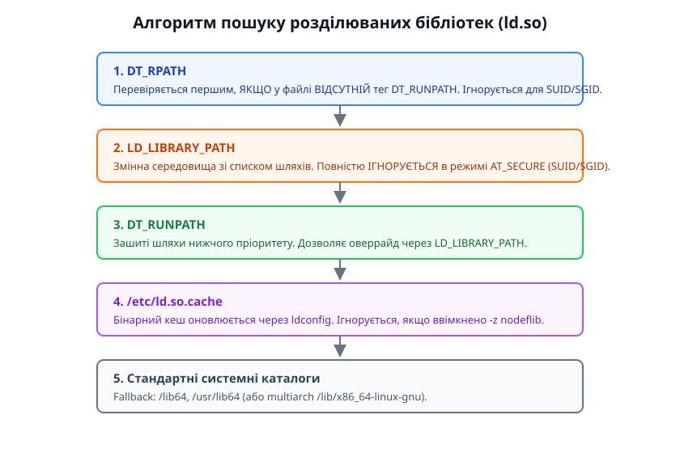
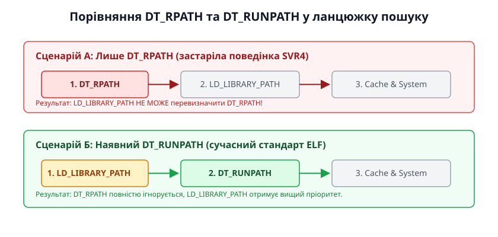

# Порядок пошуку бібліотек: rpath, LD_LIBRARY_PATH, кеш

<preknowlist>
- [ELF: сегменти, секції, точка входу](topic:sys-unix/elf-structure) — структура ELF-файлів, сегменти PT_DYNAMIC та секції .interp і DT_NEEDED.
- [Динамічний завантажувач і його робота](topic:sys-unix/dynamic-loader) — запуск ld.so ядра під час execve та етапи ініціалізації процесу.
- [SONAME і версіонування спільних бібліотек](topic:sys-unix/soname-versioning) — механізм символічних посилань між імені файлу, SONAME та реальним ім'ям бібліотеки.
</preknowlist>

Уявіть виробничий сервер бази даних, на якому після чергового планового оновлення системного пакета перестає запускатися критичний сервіс. У консолі з'являється фатальне повідомлення: `error while loading shared libraries: libssl.so.1.1: cannot open shared object file: No such file or directory`. Інженер перевіряє диск і бачить, що потрібний файл насправді присутній у каталозі `/opt/openssl/lib`. Однак операційна система відмовляється виконувати бінарник, припиняючи процес ще до входу в функцію `main()`.

У зворотній ситуації, коли розробник намагається протестувати виправлення помилки в приватній копії бібліотеки за допомогою встановлення змінної середовища `LD_LIBRARY_PATH=/home/user/test`, програма чомусь уперто продовжує завантажувати стару системну версію з каталогу `/usr/lib64`.

Обидва збої є прямим наслідком недорозуміння того, як динамічний завантажувач (dynamic linker) у Linux будує та здійснює обхід списку каталогів пошуку розділюваних бібліотек.

Динамічне зв'язування (dynamic linking, від грец. *dynamikos* — потужний, рухомий) передбачає, що виконуваний файл ELF (Executable and Linkable Format) не містить у собі повного коду всіх необхідних функцій. Натомість він зберігає лише декларативні посилання на зовнішні розділювані бібліотеки (shared libraries, файли з розширенням `.so`). Коли ядро Linux виконує системний виклик `execve()`, воно зчитує з ELF-заголовка шлях до динамічного завантажувача (зазвичай `/lib64/ld-linux-x86-64.so.2`, вказаний у секції `.interp`) і передає йому управління у просторі користувача.

Першим і найвідповідальнішим завданням завантажувача є швидкий, детермінований та безпечний пошук усіх залежностей, перелічених у тегах `DT_NEEDED`, у файловій системі. Цей процес керується строго визначеним алгоритмом із п'яти послідовних рівнів пріоритету, враховує прапорці безпеки процесу та динамічно розгортає спеціальні макротокені.

## 1. Повний алгоритм пошуку: п'ять рівнів ld.so

Коли динамічному завантажувачу `ld.so` потрібно знайти розділювану бібліотеку за її коротким іменем (наприклад, `libcrypto.so.3`), він не сканує увесь диск наосліп. Суцільний обхід файлової системи створив би велетенські накладні витрати й сповільнив би запуск будь-якої утиліти у десятки разів. Завантажувач покроково опитує п'ять визначених джерел конфігурації. Якщо бібліотеку знайдено на певному кроці, пошук негайно припиняється, файл відкривається через системний виклик `openat()`, і завантажувач переходить до наступної залежності.

Загальний порядок перевірки каталогів у сучасних системах Linux виглядає наступним чином:

1. **Тег DT_RPATH** (використовується лише у тому випадку, якщо у бінарнику повністю відсутній тег `DT_RUNPATH`). Це застарілий шлях пошуку, закарбований у виконуваному файлі під час компіляції.
2. **Змінна середовища LD_LIBRARY_PATH**. Список каталогів, заданий користувачем або скриптом-обгорткою. Цей рівень повністю пропускається завантажувачем, якщо процес виконується у захищеному режимі `AT_SECURE`.
3. **Тег DT_RUNPATH**. Сучасний аналог RPATH із нижчим пріоритетом, який дозволяє перевизначення шляхів через `LD_LIBRARY_PATH`.
4. **Системний бінарний кеш /etc/ld.so.cache**. Швидка хеш-таблиця всіх відомих системних бібліотек, згенерована утилітою `ldconfig`.
5. **Стандартні системні каталоги**. Fallback-каталоги за замовчуванням: `/lib64` та `/usr/lib64` (або відповідні мультиархітектурні шляхи на кшталт `/lib/x86_64-linux-gnu`).


*Послідовність перевірки джерел шляхів динамічним завантажувачем ld.so при вирішенні залежностей.*

Важливо враховувати виняток: якщо ім'я бібліотеки у тегу `DT_NEEDED` містить символ похилої риски `/` (наприклад, `./plugins/libcustom.so` або `/opt/lib/liba.so`), динамічний завантажувач повністю ігнорує весь описаний п'ятирівневий алгоритм і намагається відкрити файл безпосередньо за вказаним відносним або абсолютним шляхом.

## 2. Анатомія DT_RPATH проти DT_RUNPATH: історія та архітектурний конфлікт

Наявність двох схожих за назвою тегів — `DT_RPATH` та `DT_RUNPATH` — у секції `.dynamic` ELF-файлів є наслідком тривалої еволюції Unix-систем.

У перших реалізаціях специфікації ELF у системі System V Release 4 (SVR4) розробники передбачили єдиний тег `DT_RPATH` (Run-Time Search Path). Задум полягав у тому, щоб надати кожній програмі можливість самостійно визначати, де лежать її специфічні бібліотеки, усуваючи потребу в глобальних налаштуваннях операційної системи.

Однак у специфікації SVR4 тег `DT_RPATH` отримав найвищий пріоритет: він оброблявся завантажувачем **раніше** за змінну середовища `LD_LIBRARY_PATH`. Це створило суттєву проблему для розробників та системних адміністраторів. Якщо комерційний бінарник містив зашитий `DT_RPATH=/opt/vendor/lib`, користувач не мав жодної змоги підключити новішу або налагоджувальну версію бібліотеки з домашнього каталогу за допомогою `export LD_LIBRARY_PATH=/tmp/test`, оскільки завантажувач завжди знаходив бібліотеку у `/opt/vendor/lib` і зупиняв пошук.

Щоб повернути гнучкість без втрати автономності програм, у специфікації Solaris 7, а згодом і у GNU toolchain, було введено новий тег — `DT_RUNPATH`. Детальний опис історичного контексту та розбору цієї ELF-кризи наведено у [нарисі еволюції RPATH та RUNPATH](topic:sys-unix/library-search-order/hist-rpath-runpath.md).


*Зміна пріоритету LD_LIBRARY_PATH у випадках використання DT_RPATH та DT_RUNPATH.*

Принцип роботи сучасного динамічного завантажувача glibc щодо цих двох тегів визначається суворим правилом: **якщо у секції `.dynamic` наявний тег `DT_RUNPATH`, завантажувач повністю ігнорує вміст тегу `DT_RPATH` у цьому ж файлі**.

Для керування генерацією цих тегів під час компіляції програми через `gcc` або `clang` компонувальнику GNU `ld` передаються відповідні прапорці:

```bash
# Створення застарілого DT_RPATH (вимагає вимкнення new dtags)
gcc -o app main.c -Wl,-rpath=/opt/mylib -Wl,--disable-new-dtags

# Створення сучасного DT_RUNPATH (типово для більшості сучасних дистрибутивів)
gcc -o app main.c -Wl,-rpath=/opt/mylib -Wl,--enable-new-dtags
```

Перевірити, які саме теги закарбовані у бінарнику, можна за допомогою інструменту `readelf`:

```bash
$ readelf -d ./app | grep -E "RPATH|RUNPATH"
 0x000000000000000f (RPATH)              Library rpath: [/opt/mylib]
 0x000000000000001d (RUNPATH)            Library runpath: [/opt/mylib]
```

Оскільки у наведеному виводі присутній `RUNPATH`, завантажувач проігнорує `RPATH` і дозволить змінній середовища `LD_LIBRARY_PATH` перевизначити шлях `/opt/mylib`.

## 3. Змінна середовища LD_LIBRARY_PATH та межі її застосування

Змінна середовища `LD_LIBRARY_PATH` містить список каталогів, розділених двокрапкою `:`, за аналогією з системною змінною `PATH`. Вона призначена для тимчасової зміни маршрутів пошуку бібліотек без перекомпіляції двійкового файлу.

```bash
export LD_LIBRARY_PATH="/home/developer/lib:/tmp/debug_builds"
./app
```

Незважаючи на високу популярність серед розробників під час локальної збірки, постійне використання `LD_LIBRARY_PATH` у виробничому середовищі (Production) вважається поганою практикою (антипатерном) з трьох причин:

1. **Глобальний ефект побічної дії (Global Pollution)**: Якщо змінну `LD_LIBRARY_PATH` експортовано у системному профілі оболонки (`.bashrc` або `/etc/environment`), вона впливає на *всі* динамічні процеси, які запускаються в цій сесії. Це часто викликає конфлікти версій (так зване «DLL Hell» у світу Unix), коли стандартні системні утиліти на кшталт `ls`, `ps` або `git` падають із помилкою `segmentation fault` через завантаження несумісних версій бібліотек із користувацької теки.
2. **Накладні витрати продуктивності**: Кожен додатковий шлях у `LD_LIBRARY_PATH` змушує `ld.so` робити серію додаткових невдалих системних викликів `openat()` (які повертають помилку `ENOENT` — No such file or directory) для *кожної* залежності *кожної* програми. Для великих програмних комплексів із сотнями бібліотек це відчутно сповільнює час старту процесів.
3. **Безпека**: Неконтрольований `LD_LIBRARY_PATH` є прямим вектором для атак підміни коду (Shared Library Preloading Attack), тому він повністю блокується завантажувачем для привілейованих процесів.

## 4. Динамічні макротокені: $ORIGIN, $LIB, $PLATFORM

Жорстке кодування абсолютних шляхів у `DT_RUNPATH` (наприклад, `/home/user/project/lib`) робить зібрану програму непридатною для перенесення на інші машини або у довільні каталоги файлової системи. Для вирішення цієї проблеми специфікація ELF та завантажувач `ld.so` підтримують спеціальні макротокені (Dynamic String Tokens), які розгортаються безпосередньо у пам'яті під час запуску програми.

### Макротокен $ORIGIN

Токен `$ORIGIN` (або `${ORIGIN}`) автоматично замінюється завантажувачем на абсолютний шлях до каталогу, у якому лежить сам виконуваний файл.

Це дозволяє будувати повністю автономні (relocatable) пакети програмного забезпечення зі своєю ієрархією каталогів:

```text
/opt/mypackage/
├── bin/
│   └── myapp
└── lib/
    └── libinternal.so
```

Щоб бінарник `myapp` завжди знаходив `libinternal.so` незалежно від того, куди розпакують теку `mypackage`, його компонують із відносним `RUNPATH`:

```bash
gcc -o myapp main.c -L../lib -linternal -Wl,-rpath='$$ORIGIN/../lib'
```

> [!NOTE]
> При виклику `gcc` із командного рядка або `Makefile` знак долара необхідно екранувати (`'$$ORIGIN'` або `'\$ORIGIN'`), щоб оболонка `bash` або утиліта `make` не намагалася розкрити його як власну порожню змінну до передачі прапорця компонувальнику.

Коли завантажувач запускає `/home/user/apps/mypackage/bin/myapp`, він розкриває `$ORIGIN/../lib` у `/home/user/apps/mypackage/bin/../lib`, що після нормалізації дає підтверджений шлях `/home/user/apps/mypackage/lib`.

### Макротокені $LIB та $PLATFORM

- **$LIB**: Розгортається у системну назву каталогу бібліотек для поточної архітектури. На 64-бітних системах x86-64 це зазвичай `lib64` (на RHEL/Fedora) або `lib` (на Debian/Ubuntu). Це дозволяє використовувати єдиний рядок `RUNPATH=$ORIGIN/../$LIB` для збірок під різні бінарні архітектури.
- **$PLATFORM**: Розгортається у назву архітектури процесора (наприклад, `x86_64`, `haswell` або `aarch64`), яку завантажувач отримує від ядра через допоміжний вектор. Це використовується для автоматичного вибору бібліотек, оптимізованих під конкретні інструкції процесора (AVX-512, NEON).

## 5. Внутрішня механіка glibc: як ld.so будує список пошуку у коді

Для глибшого розуміння роботи завантажувача корисно розглянути його внутрішній устрій на рівні вихідного коду C-бібліотеки glibc (компонент `elf/dl-load.c`).

Коли `ld.so` ініціалізується, функція `_dl_init_paths()` зчитує змінні середовища та ELF-теги головного модуля, після чого будує зв'язаний список структур `r_searchpath_elem`:

```c
struct r_searchpath_elem {
    const char *dirname;       /* Назва каталогу, наприклад "/usr/lib64" */
    size_t dirnamelen;         /* Довжина рядка */
    enum r_dir_status status;   /* Статус каталогу (не існує, існує, перевірено) */
    dev_t dev;                 /* Ідентифікатор пристрою (для виявлення дублікатів) */
    ino_t ino;                 /* Номер іноди каталогу */
};
```

Під час пошуку конкретного SONAME виконується функція `_dl_map_object()`. Вона ітерується по списку `r_searchpath_elem` і викликає системний виклик `openat()`.

Щоб мінімізувати кількість повільних системних викликів звернення до диска, `ld.so` кешує неіснуючі каталоги. Якщо під час першої перевірки каталог повернув помилку `ENOENT`, завантажувач позначає його у полы `status` як `DIR_NONEXISTENT`. При наступних пошуках для інших бібліотек завантажувач навіть не намагається робити `stat()` або `openat()` для цієї теки.

Крім того, завантажувач порівнює поля `dev_t` та `ino_t` каталогів, щоб автоматично виключати з ланцюжка пошуку дублікати шляхів (наприклад, якщо `/lib` є символічним посиланням на `/usr/lib`).

## 6. Оптимізація доступу: кеш /etc/ld.so.cache та утиліта ldconfig

Якби завантажувач для кожного запуску програми шукав системні бібліотеки (на кшталт `libc.so.6` або `libm.so.6`) шляхом послідовного сканування системних дисків, час запуску будь-якого процесу зростав би у рази.

Для оптимізації цього етапу в Linux використовується механізм бінарного кешу — `/etc/ld.so.cache`. Це спеціально впорядкований двійковий файл, що містить хеш-таблицю, яка зіставляє короткі імені бібліотек (SONAME) із їхніми точними абсолютними шляхами у файловій системі.

Генерацією та підтримкою цього кешу займається системна утиліта **`ldconfig`**.

```text
/etc/ld.so.conf ──► /etc/ld.so.conf.d/*.conf ──► ldconfig ──► /etc/ld.so.cache
```

Конфігураційний файл `/etc/ld.so.conf` зазвичай включає додаткові конфігурації з каталогу `/etc/ld.so.conf.d/`:

```text
# Вміст /etc/ld.so.conf
include /etc/ld.so.conf.d/*.conf

# Вміст /etc/ld.so.conf.d/cuda.conf
/usr/local/cuda/lib64
```

Коли системний адміністратор або пакетний менеджер (dpkg, rpm) встановлює нову бібліотеку у `/usr/local/lib`, він викликає утиліту `ldconfig`. Вона сканує всі каталоги, вказані у `/etc/ld.so.conf`, знаходить реальні файли бібліотек, створює для них необхідні символічні посилання (з SONAME на конкретну версію файлу, наприклад `libssl.so.1.1 -> libssl.so.1.1.1k`) і перезаписує файл `/etc/ld.so.cache`.

Переглянути вміст поточного системного кешу можна за допомогою прапорця `-p`:

```bash
$ ldconfig -p | grep libssl
        libssl.so.3 (libc6,x86-64) => /lib/x86_64-linux-gnu/libssl.so.3
        libssl.so.1.1 (libc6,x86-64) => /opt/openssl1.1/lib/libssl.so.1.1
```

Динамічний завантажувач `ld.so` відображає файл `/etc/ld.so.cache` у свій адресний простір через `mmap()` і виконує пошук потрібного SONAME за час O(1) через бінарний пошук або хеш-таблицю, повністю минаючи сканування файлової системи.

Якщо бінарник скомпільовано з прапорцем компоновщика `-z nodeflib`, завантажувач свідомо ігнорує кеш `/etc/ld.so.cache` та стандартні системні каталоги, покладаючись виключно на `RPATH`/`RUNPATH`.

## 7. Безпека: SUID/SGID бінарники, Capabilities та вектор AT_SECURE

Налаштування шляхів пошуку бібліотек є історично найпопулярнішим вектором для атак підвищення привілеїв (Privilege Escalation) у Unix-подібних системах.

Уявіть системну утиліту `/usr/bin/passwd`, яка належить користувачу `root` і має встановлений SUID-біт (`-rwsr-xr-x`). Коли звичайний користувач запускає її, процес отримує ефективні привілеї `root`. Ця програма динамічно завантажує стандартну бібліотеку C (`libc.so.6`).

Якби завантажувач у цьому випадку зважав на змінну `LD_LIBRARY_PATH`, зловмисник міг би виконати наступні дії:
1. Створити власну шкідливу бібліотеку `libc.so.6` у теці `/tmp/evil`, яка при ініціалізації запускає командну оболонку `/bin/sh`.
2. Запустити привілейовану програму з підміною шляху: `LD_LIBRARY_PATH=/tmp/evil /usr/bin/passwd`.
3. Отримати повноцінний доступ з правами `root`.

### Механізм захисту AT_SECURE

Щоб повністю унеможливити подібні атаки, в ядро Linux та завантажувач `ld.so` вбудовано концепцію захищеного виконання (Secure Execution Mode).

Під час виклику системного виклику `execve()` ядро аналізує credentials нового процесу. Якщо ядро виявляє одну з наступних умов:
- Ефективний UID не дорівнює реальному UID (`euid != ruid`);
- Ефективний GID не дорівнює реальному GID (`egid != rgid`);
- Процес отримує розширені привілеї через Linux Capabilities (наприклад, `setcap`);

Ядро встановлює прапорець `AT_SECURE = 1` у допоміжному векторі (Auxiliary Vector, `auxv`), який передається завантажувачу через стек.

Коли `ld.so` бачить, що `AT_SECURE == 1`, він перемикається в строгий режим безпеки:

1. **Повне відкидання змінних середовища**: Змінні `LD_LIBRARY_PATH`, `LD_PRELOAD`, `LD_AUDIT`, `LD_ORIGIN_PATH` та низка інших повністю ігноруються й очищаються з процесу.
2. **Обмеження на розгортання $ORIGIN**: Завантажувач відмовляється розгортати макротокен `$ORIGIN` для SUID/SGID програм, якщо отриманий каталог не належить до довірених системних шляхів. Це захищає від атаки, коли зловмисник копіює SUID-бінарник у свій каталог і підкладає поруч шкідливу бібліотеку.
3. **Обмеження на системний кеш**: SUID-програми завантажують бібліотеки виключно з перевіреного бінарного кешу `/etc/ld.so.cache` та системних каталогів за замовчуванням (`/lib64`, `/usr/lib64`).

Для безпечного зчитування змінних середовища у системному програмуванні слід використовувати функцію `secure_getenv()`, яка повертає `NULL`, якщо активовано `AT_SECURE`. Детальні специфікації керуючих прапорців та структур наведено у [довіднику інтерфейсів та конфігурації ld.so](topic:sys-unix/library-search-order/api-ld-so.md).

## 8. Динамічне завантаження під час виконання: dlopen(), dlinfo() та ізоляція

Досі ми розглядали випадок, коли залежності програми прописані заздалегідь у тегах `DT_NEEDED` під час збірки. Однак базова модель модульних програм та плагінів вимагає явного завантаження бібліотек прямо під час виконання процесу за допомогою API `dlopen()`.

```c
void *handle = dlopen("libplugin.so", RTLD_LAZY);
```

При виклику `dlopen()` завантажувач повторно запускає алгоритм пошуку бібліотек, однак із двома важливими відмінностями:

1. **Контекст RPATH/RUNPATH**: Якщо `dlopen()` викликається зсередини іншої розділюваної бібліотеки (а не з головного бінарника), завантажувач перевіряє `DT_RPATH` та `DT_RUNPATH` **саме цієї бібліотеки**, яка ініціювала виклик.
2. **Простори назв завантаження (Link-Map Namespaces)**: Використовуючи функцію `dlmopen()`, розробник може завантажити бібліотеку в окремий ізольований простір назв (`LM_ID_NEWLM`). Це дозволяє завантажити дві різні версії однієї й тієї ж бібліотеки в один адресний простір процесу без конфлікту дубльованих символів.

Для інспектування того, які саме шляхи було обрано завантажувачем для конкретного `handle`, використовується функція `dlinfo()` з запитом `RTLD_DI_SERINFO`. Готовий практичний інструмент на C та C++, який програмовано витягує активні шляхи пошуку та перевіряє стан `AT_SECURE`, розібрано у [проєкті-інспекторі завантажувача](topic:sys-unix/library-search-order/proj-search-order-inspector.md).

## 9. Практична діагностика та Troubleshooting

Коли ви стикаєтеся з помилками зв'язування у виробничому середовищі, Linux надає набір інструментів для швидкої діагностики.

### 1. Перевірка залежностей через ldd

Утиліта `ldd` запускає динамічний завантажувач у режимі імітації та виводить список усіх знайдених бібліотек із їхніми абсолютними шляхами:

```bash
$ ldd /usr/bin/git
        linux-vdso.so.1 (0x00007ffe315f6000)
        libz.so.1 => /lib/x86_64-linux-gnu/libz.so.1 (0x00007f9c2d1b5000)
        libc.so.6 => /lib/x86_64-linux-gnu/libc.so.6 (0x00007f9c2cf8c000)
        /lib64/ld-linux-x86-64.so.2 (0x00007f9c2d1e9000)
```

Якщо утиліта виводить `not found`, це означає, що жоден із 5 рівнів алгоритму пошуку не містить потрібної бібліотеки.

> [!CAUTION]
> Утиліта `ldd` насправді виконує аналізований бінарник зі спеціальною змінною середовища (`LD_TRACE_LOADED_OBJECTS=1`). Ніколи не запускайте `ldd` над неперевіреними двійковими файлами з невідомих джерел, оскільки це може призвести до виконання чужого коду! Використовуйте безпечні альтернативи: `readelf -d` або `objdump -p`.

### 2. Глибоке простеження через LD_DEBUG

Найпотужнішим інструментом відлагодження завантажувача є змінна середовища `LD_DEBUG`. Вона змушує `ld.so` друкувати детальний покроковий лог своїх дій у `stderr`.

```bash
$ LD_DEBUG=libs ./myapp
```

При цьому завантажувач виведе кожну спробу відкриття файлу:

```text
 12458: search path=/opt/app/lib/tls/x86_64:/opt/app/lib (RUNPATH from file ./myapp)
 12458:  trying file=/opt/app/lib/libtest.so
 12458: search cache=/etc/ld.so.cache
 12458:  trying file=/lib/x86_64-linux-gnu/libtest.so
```

Це дозволяє миттєво побачити, на якому саме етапі завантажувач підхопив небажану версію бібліотеки або чому він ігнорує обраний шлях.

### 3. Модифікація RPATH без перекомпіляції через patchelf

Якщо у вас є готовий бінарник без сирцевого коду, у якому потрібно змінити `RUNPATH` або додати `$ORIGIN`, можна скористатися утилітою `patchelf`:

```bash
# Зміна RUNPATH у бінарнику
patchelf --set-rpath '$ORIGIN/../lib' ./myapp

# Перевірка результату
patchelf --print-rpath ./myapp
```

> 🔧 **Навіщо це.** 
> При розгортанні програмних продуктів у Linux дотримуйтесь наступних золотих правил:
> 1. Для автономних приватних застосунків завжди збирайте бінарники з `DT_RUNPATH` та макротокеном `$ORIGIN` (`-Wl,-rpath,'$$ORIGIN/../lib' -Wl,--enable-new-dtags`). Це дозволить переносити або розпаковувати проект у будь-який каталог без модифікацій системи.
> 2. Ніколи не експортуйте `LD_LIBRARY_PATH` у глобальних конфігураційних файлах `/etc/profile` або `~/.bashrc`. Використовуйте локальні скрипти-обгортки (wrapper scripts), які встановлюють змінні лише на час роботи конкретного застосунку.
> 3. При встановленні нових системних бібліотек вручну (наприклад, у `/usr/local/lib`) не забувайте оновлювати системний кеш викликом `sudo ldconfig`.
