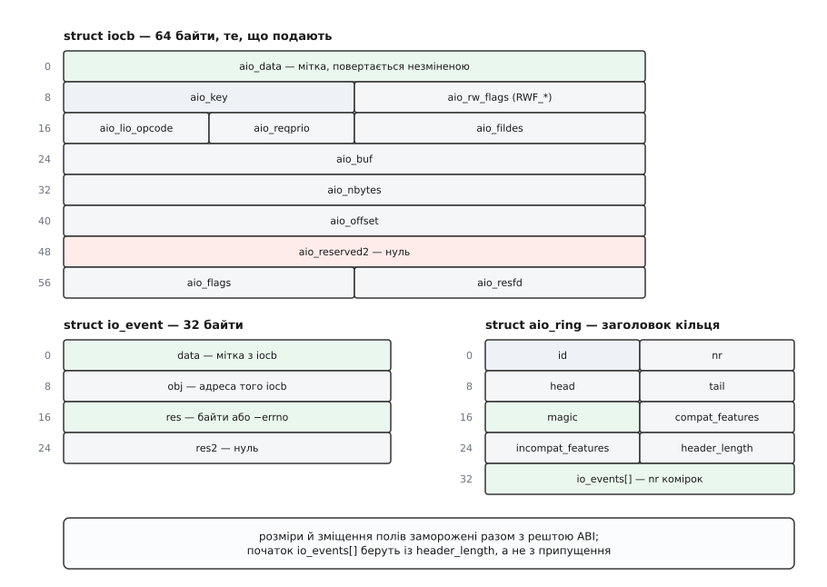

# 📋 Інтерфейс ядерного AIO: п'ять викликів, дві структури й один сисктл

Це контракт, за яким ядерний асинхронний ввід-вивід кличуть з коду: точні прототипи, поля структур байт за байтом, коди операцій, коди помилок і системні параметри. Потреба саме в такому переліку незвична для Linux, і причина конкретна — [libc не подає сюди свого містка](root:sys-unix/libc-as-gateway): у glibc обгорток для цих викликів немає взагалі, тож оголошення доводиться або писати руками, або брати з бібліотеки, чиї прототипи навмисно інші, ніж ядерні.

## Три різні речі, у яких збігаються букви

Перше, у чому треба не помилитися, — що саме ви кличете. Імен з «aio» у системі три набори, і вони не родичі.

| що це | звідки береться | приклади імен |
|---|---|---|
| POSIX AIO | glibc, пул потоків у просторі користувача | `aio_read()`, `aio_write()`, `aio_error()`, `aio_suspend()` |
| ядерний AIO, сирий системний виклик | ядро, через `syscall()` | `SYS_io_submit`, `SYS_io_getevents` |
| ядерний AIO через `libaio` | окремий пакет, збірка з `-laio` | `io_submit()`, `io_getevents()` |

Перший рядок — [стандартний POSIX AIO](root:sys-unix/posix-aio), який до ядерного механізму не має стосунку: жодного з перелічених нижче системних викликів він не робить. Другий і третій ведуть в одне й те саме ядро, але між ними теж є розбіжності, які кусаються:

- **Прототипи інші.** Ядро бере `aio_context_t` (це `__kernel_ulong_t`, тобто число), `libaio` — `io_context_t` (це `struct io_context *`, тобто вказівник). Ядро бере `unsigned nr_events`, `libaio` — `int maxevents`.
- **Структура інша.** `libaio` оголошує власну `struct iocb` з об'єднанням усередині: те саме поле в ядра зветься `aio_buf`, а в бібліотеки — `u.c.buf`. Розкладка по байтах збігається, назви — ні. Коди операцій у бібліотеки теж свої: `IO_CMD_PREAD` замість `IOCB_CMD_PREAD`.
- **Спосіб віддати помилку інший, і це найпідступніше.** Обгортки `libaio` **повертають `-errno` і відновлюють попереднє значення `errno`**:

```c
/* libaio, src/syscall.h */
ret = syscall(__NR_##sname, ## args);
if (ret < 0) {
    ret = -errno;
    errno = saved_errno;
}
return ret;
```

Тобто звична перевірка `if (rc < 0) perror(...)` після виклику `libaio` надрукує щось стороннє — код помилки лежить у самому `rc`, а `errno` навмисно не чіпали. Сирий `syscall()`, навпаки, поводиться як усі: повертає `-1` і виставляє `errno`.

## Прототипи

Так виглядають системні виклики з боку ядра. Саме ці прототипи треба відтворити, кличучи їх через `syscall()`.

```c
typedef __kernel_ulong_t aio_context_t;

int io_setup(unsigned nr_events, aio_context_t *ctx_idp);
int io_submit(aio_context_t ctx_id, long nr, struct iocb **iocbpp);
int io_getevents(aio_context_t ctx_id, long min_nr, long nr,
                 struct io_event *events, struct timespec *timeout);
int io_pgetevents(aio_context_t ctx_id, long min_nr, long nr,   /* ядро 4.18 */
                  struct io_event *events, struct timespec *timeout,
                  const struct __aio_sigset *usig);
int io_cancel(aio_context_t ctx_id, struct iocb *iocb, struct io_event *result);
int io_destroy(aio_context_t ctx_id);
```

| виклик | що повертає при успіху |
|---|---|
| `io_setup` | `0`; у `*ctx_idp` — контекст |
| `io_submit` | скільки `iocb` прийнято — **може бути менше за `nr`** |
| `io_getevents` | скільки завершень зчитано; `0` або менше за `min_nr`, якщо сплив час або прийшов сигнал |
| `io_cancel` | `-EINPROGRESS` — скасування запущено; `*result` **не заповнюють** із ядра 3.9, а звіт однаково прийде в кільце (давні man-сторінки ще обіцяють `0` і подію в `*result`) |
| `io_destroy` | `0` |

Три подробиці, на яких спотикаються найчастіше.

**`io_setup` вимагає нуля.** Ядро починає з перевірки `if (unlikely(ctx || nr_events == 0))` — тобто змінна, на яку ви даєте вказівник, мусить бути нульова, інакше `EINVAL`. Пишіть `aio_context_t ctx = 0;` і не покладайтеся на те, що вона й так порожня.

**`io_destroy` не миттєвий.** Він скасовує все, що ще можна скасувати, **чекає на завершення решти** й лише тоді знищує контекст. Тобто це блокуючий виклик, і його тривалість дорівнює найдовшій операції в польоті.

**`io_pgetevents` бере не маску, а структуру:**

```c
struct __aio_sigset {
    const sigset_t *sigmask;
    size_t          sigsetsize;
};
```

Його зв'язок з `io_getevents()` такий самий, як у `pselect()` із `select()`: він [підміняє маску сигналів](root:sys-unix/signal-mask-signalfd) на час очікування атомарно, щоб між «перевірили прапорець» і «заснули» не проліз сигнал. Пастка тут у другому полі: `sigsetsize` — це розмір **ядерного** `sigset_t` (8 байтів на x86-64), а не того, що оголосив glibc (128 байтів). Підставите `sizeof(sigset_t)` з `<signal.h>` — отримаєте `EINVAL`.

## `struct iocb` поле за полем



*Шістдесят чотири байти запиту, тридцять два байти звіту й тридцять два байти заголовка кільця — усе, з чого складається ABI.*

| поле | що туди кладуть |
|---|---|
| `aio_data` | вісім байтів на розсуд програми; вертаються в `io_event.data` незміненими |
| `aio_key` | службове, ядро пише сюди свій номер запиту; програма лишає нуль |
| `aio_rw_flags` | прапорці `RWF_*` — `RWF_HIPRI`, `RWF_DSYNC`, `RWF_SYNC`, `RWF_NOWAIT`, `RWF_APPEND` (поле з'явилося в ядрі 4.13 на місці колишнього `aio_reserved1`) |
| `aio_lio_opcode` | код операції `IOCB_CMD_*` |
| `aio_reqprio` | пріоритет вводу-виводу у форматі `ioprio_set(2)`; діє **лише** разом з `IOCB_FLAG_IOPRIO` |
| `aio_fildes` | дескриптор |
| `aio_buf` | адреса буфера; для `PREADV`/`PWRITEV` — адреса масиву `struct iovec`; для `POLL` — маска очікуваних подій у молодших 32 бітах |
| `aio_nbytes` | скільки байтів; для векторних операцій — скільки елементів у `iovec` |
| `aio_offset` | зміщення у файлі; спільної поточної позиції тут немає |
| `aio_reserved2` | мусить бути нуль |
| `aio_flags` | `IOCB_FLAG_RESFD`, `IOCB_FLAG_IOPRIO` |
| `aio_resfd` | дескриптор [eventfd](root:sys-unix/eventfd-and-futex), який смикнути на завершення |

Останнє поле разом із прапорцем `IOCB_FLAG_RESFD` — це те, чим контекст AIO вписують у наявну подієву петлю: `eventfd` кладуть в [`epoll`](root:sys-unix/select-poll-epoll) поруч із сокетами.

`memset(&cb, 0, sizeof cb)` перед заповненням — не гігієна, а вимога. Ядро явно перевіряє `aio_reserved2` («enforce forwards compatibility on users» — так підписано в коді) і відповідає `EINVAL` на будь-яке ненульове сміття зі стека.

## Коди операцій

```c
IOCB_CMD_PREAD   = 0    читання за зміщенням
IOCB_CMD_PWRITE  = 1    запис за зміщенням
IOCB_CMD_FSYNC   = 2    скидання даних і метаданих
IOCB_CMD_FDSYNC  = 3    скидання лише даних
/* 4 — колишній експериментальний IOCB_CMD_PREADX, вилучений */
IOCB_CMD_POLL    = 5    чекати готовності дескриптора (ядро 4.18)
IOCB_CMD_NOOP    = 6    у заголовку є, у ядрі не реалізований
IOCB_CMD_PREADV  = 7    векторне читання
IOCB_CMD_PWRITEV = 8    векторний запис
```

Цей перелік треба читати уважніше, ніж здається: присутність коду в заголовку сама собою нічого не гарантує. `IOCB_CMD_NOOP` у `switch`-і подання не має власної гілки й падає в `default` з `EINVAL`. `FSYNC` і `FDSYNC` лежали в заголовку з першого дня, але жодна файлова система їх не реалізовувала — робочими вони стали аж у 4.18, коли Крістоф Гельвіґ завів їх на чергу ядерних робітників. `IOCB_CMD_POLL` з тієї самої серії 4.18: він перевіряє маску з молодших 32 бітів `aio_buf`, спрацьовує **один раз** і повертає в `io_event.res` маску подій, що настали.

## Прапорці

```c
#define IOCB_FLAG_RESFD   (1 << 0)   /* смикнути aio_resfd на завершення */
#define IOCB_FLAG_IOPRIO  (1 << 1)   /* узяти пріоритет з aio_reqprio (4.18) */
```

`IOCB_FLAG_IOPRIO` — це поштучний відповідник `ioprio_set(2)`: пріоритет ставиться на окрему операцію, а не на весь потік. Клас `IOPRIO_CLASS_RT` вимагає [`CAP_SYS_ADMIN`](root:sys-unix/capabilities), інакше `io_submit()` відповість `EPERM`.

## Звіт і кільце

```c
struct io_event {
    __u64 data;   /* мітка з aio_data */
    __u64 obj;    /* адреса поданого iocb */
    __s64 res;    /* передані байти або від'ємний код помилки */
    __s64 res2;   /* другорядний результат; на всіх сучасних шляхах нуль */
};

#define AIO_RING_MAGIC             0xa10a10a1
#define AIO_RING_COMPAT_FEATURES   1
#define AIO_RING_INCOMPAT_FEATURES 0

struct aio_ring {
    unsigned id, nr, head, tail;
    unsigned magic, compat_features, incompat_features, header_length;
    struct io_event io_events[];
};
```

`struct aio_ring` — окремий випадок: її немає в жодному заголовку `uapi`, вона живе у `fs/aio.c`, і програми, які читають кільце напряму, переписують оголошення руками. Тому порядок дій жорсткий: спершу переконатися, що `magic` дорівнює `0xa10a10a1`, і лише тоді довіряти решті полів; початок масиву брати з `header_length`, а не з `sizeof` власної копії структури. Поле `nr` показує **ядерну** кількість комірок, а вона більша за замовлену.

## Як забирають завершення

Два числових параметри `io_getevents()` роблять різні речі: `min_nr` — це поріг, до якого виклик згоден чекати, `nr` — місткість вашого масиву. Ядро перевіряє їх однією умовою, `min_nr <= nr && min_nr >= 0`, і на порушення відповідає `EINVAL`.

Час трактується так:

| `timeout` | поведінка |
|---|---|
| `NULL` | чекати без обмеження, доки не набереться `min_nr` завершень |
| `{0, 0}` | забрати те, що вже є, і повернутися негайно |
| додатний | те саме, але не довше вказаного; **проміжок відносний**, не момент на годиннику |

Повернутися раніше за `min_nr` виклик може з двох причин: сплив час або прийшов сигнал. У другому випадку буде або короткий додатний результат, або `EINTR` — тобто нуль у поверненні ще не означає, що кільце порожнє.

`libaio` додає сюди рівно одну оптимізацію, і варто знати її точні межі:

```c
/* libaio, src/aio_ring.h */
if (!ring || ring->magic != AIO_RING_MAGIC)      return 0;
if (!timeout || timeout->tv_sec || timeout->tv_nsec) return 0;
if (ring->head != ring->tail)                    return 0;
return 1;   /* кільце порожнє — відповідаємо нулем без системного виклику */
```

Тобто бібліотека оминає ядро **лише** в одному випадку: ви просили не чекати, а кільце порожнє. Самі записи вона все одно копіює системним викликом. Читання завершень просто з відображеної пам'яті — те, що робить, скажімо, `fio` з `--userspace_reap`, — програма пише сама.

Симетрична дрібниця на боці подання: коли в одному `io_submit()` більше двох запитів (`AIO_PLUG_THRESHOLD` дорівнює 2), ядро обгортає цикл у `blk_start_plug()` — блоковий шар притримує запити й віддає їх пристрою однією порцією. Пачка з одного-двох `iocb` цього не вмикає.

## Куди приходить помилка

Тут працює правило, яке заощаджує години пошуку. Помилки діляться на дві родини — за тим, де їх помітили.

**Помічені до звернення до файлу** — хибний контекст, невідомий код операції, ненульове `aio_reserved2`, поганий дескриптор, брак вільного слоту — вертаються **з `io_submit()`**. Але тільки з першого `iocb`: цикл подання обриває себе на першій невдачі й повертає `i ? i : ret`, тобто кількість уже прийнятих. Помилка в п'ятому запиті з десяти видна лише як четвірка в поверненні, а який саме зашпортався — з'ясовуйте самі.

**Помічені всередині шляху читання чи запису** — наприклад, порушене вирівнювання при `O_DIRECT` — приходять **у кільце завершень**, як `res = -EINVAL`. `io_submit()` при цьому рапортує повний успіх.

> 🔧 **Навіщо це.** Звідси практичне: не можна вважати, що успішний `io_submit()` означає прийняту операцію. Перевіряти `res` кожного завершення обов'язково, і від'ємне `res` — це саме той `errno`, який ви побачили б від синхронного `read()`, лише з мінусом.

| виклик | можливі коди |
|---|---|
| `io_setup` | `EAGAIN`, `EFAULT`, `EINVAL`, `ENOMEM`, `ENOSYS` |
| `io_submit` | `EAGAIN`, `EBADF`, `EFAULT`, `EINVAL`, `ENOSYS`, `EPERM` |
| `io_getevents` | `EFAULT`, `EINTR`, `EINVAL`, `ENOSYS` |
| `io_cancel` | `EAGAIN`, `EFAULT`, `EINVAL`, `ENOSYS` |
| `io_destroy` | `EFAULT`, `EINVAL`, `ENOSYS` |

`EAGAIN` трапляється в трьох місцях і означає в них три різні речі:

- **з `io_setup`** — вичерпано **загальносистемний** бюджет: сума замовлених подій усіх контекстів усіх процесів перевищила `fs.aio-max-nr`. Це не тиск навантаження, а стеля, і виявляється вона на створенні контексту. Лікується сисктлом;
- **з `io_submit`** — вичерпано слоти **цього** контексту: подано більше запитів, ніж він уміщає. Лікується забиранням завершень або більшим `nr_events`;
- **з `io_cancel`** — узагалі не про ресурси. Це відповідь «не скасовано» з man-сторінки: запит уже пішов у чергу пристрою й звідти не відкликається. На звичайних файлових операціях сучасне ядро відповідає радше `EINVAL` — такий запит навіть не потрапляє до списку скасовуваних. Лікувати нічого в обох випадках: лишається дочекатися завершення.

`ENOSYS` теж варто читати буквально: ядро могло бути зібране без `CONFIG_AIO`, і тоді викликів просто немає.

## Вирівнювання під `O_DIRECT`

Коли файл відкрито з [`O_DIRECT`](root:sys-unix/buffered-and-direct-io), вирівняними мусять бути **три речі** одночасно, і достатньо схибити в одній:

```
aio_buf     — адреса буфера
aio_offset  — зміщення у файлі
aio_nbytes  — довжина
```

Історично міра — логічний розмір блока пристрою: 512 байтів на більшості накопичувачів, 4096 на дисках із власним сектором 4 КіБ і на багатьох NVMe. Але з часом умова обросла винятками — шифрування, стиснення, багатопристроєві томи, — тож із ядра 6.1 її не вгадують, а питають: [`statx()`](root:sys-unix/statx-mask-and-unknown-values) з прапорцем `STATX_DIOALIGN` віддає `stx_dio_mem_align` (для адреси буфера) і `stx_dio_offset_align` (для зміщення й довжини). Нуль у цих полях означає, що прямий ввід-вивід для цього файлу недоступний. Буфер беруть у `posix_memalign()`, а не в `malloc()`.

## Скільки цього дозволено

```
/proc/sys/fs/aio-nr       поточна сума замовлених подій по всій системі (лише читання)
/proc/sys/fs/aio-max-nr   стеля цієї суми; типово 0x10000 = 65 536
```

Підняття `fs.aio-max-nr` [через сисктл](root:sys-unix/sysctl-tunables) нічого не виділяє наперед — воно лише посуває межу.

Число `nr_events`, яке ви дали в `io_setup()`, ядро перетворює по-своєму, і корисно знати, як саме:

```c
unsigned int max_reqs = nr_events;              /* саме це піде в глобальний лічильник */
nr_events = max(nr_events, num_possible_cpus() * 4);
nr_events *= 2;

if (nr_events > (0x10000000U / sizeof(struct io_event)))   /* > 8 388 608 комірок */
        return -EINVAL;
if (!nr_events || (unsigned long)max_reqs > aio_max_nr)
        return -EAGAIN;

nr_events += 2;   /* у aio_setup_ring: компенсація за комірку перекриття head/tail */
```

Отже проти `fs.aio-max-nr` рахують **початкове** число, а комірок у кільці виділяють помітно більше: піднятий мінімум, подвоєння й ще дві згори. Замовили 32 на машині з 16 ядрами — глобальний лічильник виріс на 32, а кільце вийшло на 130 комірок.

## Мінімальний робочий виклик

Усе разом, без бібліотек — одне читання через сирі системні виклики:

```c
#define _GNU_SOURCE
#include <linux/aio_abi.h>
#include <sys/syscall.h>
#include <unistd.h>
#include <fcntl.h>
#include <string.h>
#include <stdio.h>

int main(void)
{
    aio_context_t ctx = 0;                    /* обов'язково нуль */
    if (syscall(SYS_io_setup, 8, &ctx) < 0) { perror("io_setup"); return 1; }

    int fd = open("/etc/hostname", O_RDONLY);
    char buf[4096];

    struct iocb cb;
    memset(&cb, 0, sizeof cb);                /* резервні поля мусять бути нулем */
    cb.aio_lio_opcode = IOCB_CMD_PREAD;
    cb.aio_fildes     = fd;
    cb.aio_buf        = (unsigned long long) buf;
    cb.aio_nbytes     = sizeof buf;
    cb.aio_offset     = 0;
    cb.aio_data       = 0xC0FFEE;             /* мітка, повернеться незміненою */

    struct iocb *list[1] = { &cb };
    if (syscall(SYS_io_submit, ctx, 1L, list) != 1) { perror("io_submit"); return 1; }

    struct io_event ev;
    if (syscall(SYS_io_getevents, ctx, 1L, 1L, &ev, NULL) != 1) {
        perror("io_getevents"); return 1;
    }
    printf("мітка %llx, res %lld\n",
           (unsigned long long) ev.data, (long long) ev.res);

    syscall(SYS_io_destroy, ctx);
    close(fd);
    return 0;
}
```

`cb` тут живе до кінця `main()` — і це не випадковість: структуру не можна ні звільнити, ні перевикористати, доки не прийшов її звіт, бо ядро тримає на неї посилання. Так само не можна чіпати `buf`: це пам'ять, у яку ядро ще пише.
