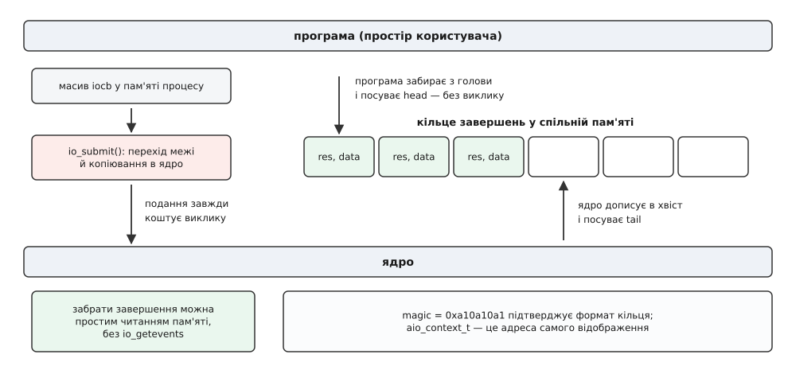
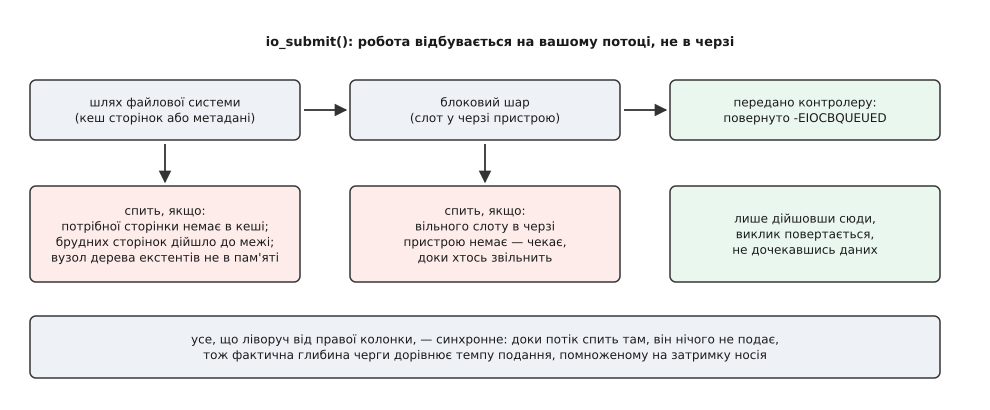

# Асинхронний ввід-вивід ядра: io_submit і його межі

<preknowlist>
- [Файловий дескриптор](topic:sys-unix/file-descriptor) — маленьке число, яким процес називає ядру вже відкритий файл або сокет.
- [Системний виклик](topic:sys-unix/syscall-mechanics) — як програма переходить межу в ядро й скільки коштує сам перехід.
- [Блокуючий і неблокуючий режим](topic:sys-unix/blocking-and-nonblocking) — чому звичайне читання зупиняє потік і що дає `O_NONBLOCK`.
- [Готовність проти завершення](topic:sys-unix/readiness-vs-completion) — дві моделі: «скажи, коли можна діяти» і «зроби й скажи, коли зробив».
- [Буферизований і прямий ввід-вивід](topic:sys-unix/buffered-and-direct-io) — що робить `O_DIRECT` і чим шлях повз кеш відрізняється від звичайного.
- [Кеш сторінок і довговічність](topic:sys-unix/page-cache-durability) — сторінки файлів у пам'яті, брудні сторінки й зворотний запис.
- [mmap](topic:sys-unix/mmap-model) — відображення сторінок у адресний простір процесу.
- [Блоковий пристрій](topic:sys-unix/block-device-model) — сектори, черга запитів і те, що носій обслуговує кілька запитів водночас.
- [Закон Літтла](topic:math-probability/littles-law) — кількість в обробці = темп · час обробки.
</preknowlist>

Візьмімо звичайний NVMe-накопичувач і одну програму, якій треба прочитати з нього мільйон розкиданих по файлу блоків по 4 КіБ. Програма робить це найпростішим способом: цикл із `read()`. Порахуймо, що вийде.

**Одне читання 4 КіБ із NVMe в найкращому випадку відповідає приблизно за 80 мікросекунд.**

```
затримка одного читання      ≈ 80 мкс
читань за секунду в циклі    = 1 / 80 мкс = 12 500
пропускна здатність          = 12 500 · 4 КіБ ≈ 50 МіБ/с
паспортна швидкість носія    ≈ 3 500 МіБ/с
```

Носій простоює приблизно дев'яносто вісім відсотків часу. Причина не в тому, що він повільний, а в тому, що він уміє тримати в роботі десятки запитів одночасно — контролер розкладає їх по каналах і банках флеш-пам'яті й обслуговує паралельно, — а цикл із `read()` дає йому рівно один. Поки триває це одне читання, потік стоїть у ядрі й нічого не подає.

Скільки запитів має бути в польоті, щоб носій працював на повну, каже проста арифметика: якщо кожен обслуговується 80 мкс, а носій витягує 400 тисяч випадкових читань за секунду (паспортні 3 500 МіБ/с — це послідовний потік, на розкиданих 4 КіБ стеля своя), то в роботі мусить постійно перебувати 400 000 · 80 мкс = 32 запити. Це і є те, що треба здобути: не швидший виклик, а **кількість незавершених операцій**.

Здобути її можна двома способами. Перший — тридцять два потоки, кожен зі своїм циклом `read()`. Спосіб робочий і чесний, але кількість виконавців тут дорівнює кількості одночасних очікувань, і коли потрібна глибина не 32, а кілька тисяч (база даних із сотнями файлів на десятку носіїв), ціна стає відчутною: кожен потік — це стек, місце в планувальнику й перемикання контексту на кожне завершення.

Другий спосіб — залишити один потік, але забрати в нього обов'язок стояти над кожним запитом. Для цього треба розчепити те, що в `read()` злите в одне: **опис роботи** і **її виконання**. Саме на цьому побудований асинхронний ввід-вивід ядра Linux — набір із п'яти системних викликів, що з'явився в розробницькій гілці 2.5 у 2002 році й приїхав до користувачів у стабільному ядрі 2.6 наприкінці 2003-го.

## Запит як структура в пам'яті

`read(fd, buf, n)` — це наказ, виконаний негайно й повністю. Розчепити його означає спершу зробити з нього дані: структуру, у якій записано все, що потрібно для виконання, і яку можна заповнити, не заходячи в ядро.

Така структура називається `iocb` (input/output control block — блок керування вводом-виводом) і містить рівно те, чого бракує звичайному виклику, щоб той міг зачекати:

```c
struct iocb {
    __u64  aio_data;        /* мітка: ядро поверне її незміненою */
    __u32  PADDED(aio_key, aio_rw_flags);
    __u16  aio_lio_opcode;  /* IOCB_CMD_PREAD, PWRITE, FSYNC, POLL… */
    __s16  aio_reqprio;
    __u32  aio_fildes;      /* дескриптор */
    __u64  aio_buf;         /* адреса буфера */
    __u64  aio_nbytes;      /* скільки байтів */
    __s64  aio_offset;      /* з якого зміщення у файлі */
    __u64  aio_reserved2;
    __u32  aio_flags;       /* IOCB_FLAG_RESFD, IOCB_FLAG_IOPRIO */
    __u32  aio_resfd;       /* eventfd, який смикнути на завершення */
};
```

Ключове поле тут — перше. `aio_data` — вісім байтів, які ядро не тлумачить ніяк: воно просто поверне їх у звіті про завершення. Це й розв'язує головну задачу асинхронності: коли результати приходять не в тому порядку, у якому їх подавали, програмі потрібен спосіб упізнати, чий саме результат прийшов. Мітка — покажчик на власну структуру з'єднання чи сторінки буферного пулу — і є цим способом.

Зверніть увагу й на те, чого в `iocb` немає: там немає поточної позиції у файлі. Зміщення задано явно, у кожному запиті. Інакше й не могло бути: десятки читань у польоті одночасно не мають спільного «де ми зараз», бо кожне почалося раніше, ніж завершилося попереднє.

Заповнити таку структуру — це кілька записів у пам'ять. Дверей у ядро для цього не треба. А коли структур набралося, скажімо, шістдесят чотири, їх подають одним викликом:

```c
int io_submit(aio_context_t ctx, long n, struct iocb *iocbpp[]);
```

Один перехід межі на шістдесят чотири операції замість шістдесяти чотирьох переходів — це вже друга вигода, окрема від глибини черги. Виклик повертає кількість прийнятих запитів, і вона може бути меншою за `n`: якщо третій з поданих виявився хибним, перші два вже подано, і повернеться двійка, а не помилка.

## Куди складають результати

Тепер симетричне питання: як програма дізнається, що котрась із поданих операцій завершилася.

Черга завершень мусить бути видима обом сторонам — ядро в неї пише, програма з неї читає. Найпростіше було б тримати чергу всередині ядра й видавати записи по одному через системний виклик, але тоді ми повернули б ту саму ціну дверей, від якої щойно втекли на подаванні.

Тому чергу поклали у **спільну пам'ять**. `io_setup()` не просто заводить контекст — він виділяє під нього кільцевий буфер і відображає цей буфер у адресний простір процесу. Структура кільця не має жодних таємниць:

```c
struct aio_ring {
    unsigned  id;
    unsigned  nr;                /* скільки комірок */
    unsigned  head;             /* звідки читає програма */
    unsigned  tail;             /* куди пише ядро */
    unsigned  magic;            /* 0xa10a10a1 */
    unsigned  compat_features;
    unsigned  incompat_features;
    unsigned  header_length;
    struct io_event io_events[];
};
```

І тут ховається деталь, яку легко пропустити, а вона пояснює всю конструкцію. Тип `aio_context_t`, який `io_setup()` повертає програмі, — це не абстрактний номер контексту. У ядрі його присвоюють одним рядком: `ctx->user_id = ctx->mmap_base`. Тобто **ідентифікатор контексту і є адреса відображеного кільця**. Програма тримає в руках не ручку до чогось прихованого, а вказівник на пам'ять, яку може прочитати сама.

Наслідок практичний. Щоб забрати завершені операції, коли поспішати нікуди й чекати не треба, системний виклик не потрібен зовсім: перевір, що `magic` дорівнює `0xa10a10a1` (це підтверджує, що формат кільця той, який ти знаєш), порівняй `head` із `tail`, скопіюй записи з проміжку між ними й посунь `head` звичайним записом у пам'ять. Робити це має сама програма: `libaio` таку можливість лишає невживаною — її `io_getevents()` оминає ядро тільки в одному разі (ви просили не чекати, а кільце порожнє), а самі записи однаково копіює системним викликом. Хто хоче забирати завершення просто з пам'яті, читає кільце руками — так, наприклад, працює `fio` з `--userspace_reap`.



*Асиметрія навмисна: подання йде через системний виклик і копіювання `iocb`, а забирання результатів у сприятливому випадку не коштує нічого, бо кільце видно з обох боків.*

Кожен запис у кільці — `struct io_event` із чотирьох полів: повернута мітка `data`, покажчик на поданий `iocb`, результат `res` (кількість переданих байтів або від'ємний код помилки — той самий, що потрапив би в `errno`) і `res2`, який на всіх сучасних шляхах дорівнює нулю.

> 🔧 **Навіщо це.** Мітка `aio_data` повертається незміненою, а `iocb` мусить лишатися живим і незайманим до самого завершення — ядро тримає на нього посилання. Звідси головна пастка: не можна складати `iocb` на стеку функції, яка подала запит і вийшла, і не можна повторно вжити структуру під новий запит, доки не прийшов звіт про старий. Так само не можна звільнити буфер: адреса в `aio_buf` — це пам'ять, у яку ядро ще пише.

## П'ять викликів і скільки їх поміститься

Повний інтерфейс складається з п'яти системних викликів, до яких у ядрі 4.18 додався шостий:

```
io_setup(nr_events, &ctx)         створити контекст на nr_events операцій
io_submit(ctx, n, iocbs[])        подати n запитів
io_getevents(ctx, min, n, ev, t)  забрати від min до n завершень, чекати не довше t
io_pgetevents(…, sigmask)         те саме, але з атомарною підміною маски сигналів
io_cancel(ctx, iocb, &result)     спробувати скасувати
io_destroy(ctx)                   знищити контекст
```

Одна дрібниця тут коштує людям годин. **У glibc немає обгорток для цих викликів.** Функції `aio_read()`, `aio_write()`, `aio_suspend()`, які glibc таки надає, — це зовсім інша річ: стандартний [POSIX AIO](topic:sys-unix/posix-aio), реалізований у просторі користувача пулом потоків. Спільного між ними лише три букви в назві. Щоб дістатися до ядерного інтерфейсу, треба або кликати `syscall()` вручну, або взяти бібліотеку `libaio`, чиї однойменні обгортки мають інші прототипи, ніж системні виклики під ними. Повний перелік полів, кодів операцій, помилок і системних параметрів зібрано окремо ([інтерфейс ядерного AIO](topic:sys-unix/linux-aio-io-submit/api-aio-syscalls.md) — п'ять викликів із сигнатурами, поля `iocb` та `io_event`, коди `IOCB_CMD_*`, прапорці, вимоги вирівнювання для `O_DIRECT` і параметри `fs.aio-nr` / `fs.aio-max-nr`).

Число `nr_events`, з яким створюють контекст, ядро розуміє по-своєму. Воно піднімає його до розумного мінімуму й подвоює:

```c
nr_events = max(nr_events, num_possible_cpus() * 4);
nr_events *= 2;
```

Подвоєння не примха: кільце має вміщати завершення всіх операцій у польоті плюс запас, інакше ядру нікуди буде класти звіт. А самі операції рахуються глобально, на всю систему: сума `max_reqs` усіх контекстів усіх процесів не може перевищити `fs.aio-max-nr`, типово 65 536. Перевищення дає `EAGAIN` — причому з `io_setup()`, а не з `io_submit()`, тобто на створенні контексту, а не під навантаженням. Поточну суму видно в `/proc/sys/fs/aio-nr`.

## Де io_submit засинає

Тепер до головного. Назва виклику обіцяє «подати»: покласти запит у чергу й негайно повернутися. Реальність інша, і саме вона визначає, для чого цей механізм придатний, а для чого ні.

`io_submit()` копіює `iocb` із простору користувача і **викликає звичайний шлях читання чи запису цього файлу — прямо тут, на вашому потоці, зараз**. Асинхронність виникає лише тоді, коли цей шлях спромігся віддати роботу кудись далі й повернути особливе значення `-EIOCBQUEUED`, що означає «я передав, звіт прийде пізніше». Ось уся розвилка, як вона виглядає в ядрі:

```c
static inline void aio_rw_done(struct kiocb *req, ssize_t ret)
{
    switch (ret) {
    case -EIOCBQUEUED:
        break;                      /* передано далі — завершення прийде згодом */
    ...
    default:
        req->ki_complete(req, ret); /* уже все — звіт пишемо негайно */
    }
}
```

Отже питання «чи асинхронний тут AIO» перетворюється на конкретне: **чи здатен цей шлях повернути `-EIOCBQUEUED`, жодного разу не заснувши дорогою**. Місць, де він засинає, чотири, і кожне має власну причину.

**Буферизоване читання.** Звичайне читання йде через кеш сторінок. Якщо потрібна сторінка в кеші — дані копіюються одразу, операція завершується синхронно, і це навіть добре: швидко, звіт у кільці ще до повернення з виклику. Якщо сторінки немає — шлях запускає читання з носія й стає чекати на замок цієї сторінки. Ніякого `-EIOCBQUEUED`: потік спить рівно так, як спав би у звичайному `read()`. Історично на ext2, ext3, JFS, XFS і NFS буферизований AIO тихо вироджувався в синхронний — без помилки, без попередження, просто `io_submit()` повертався тоді, коли операція вже відбулася.

**Буферизований запис.** Запис лягає в брудну сторінку — і поки брудних сторінок мало, це швидко. Але коли їхня частка доходить до межі, ядро притримує того, хто пише, доки зворотний запис не розвантажить кеш. Тобто затримка з'являється саме під навантаженням, заради якого асинхронність і брали.

**Метадані — навіть з `O_DIRECT`.** Щоб перетворити «зміщення 4 ГіБ у файлі» на номер сектора, файлова система читає своє дерево екстентів. Якщо потрібний вузол дерева не в пам'яті — це синхронне читання, зроблене всередині `io_submit()`. Сюди ж додаються замок inode, виділення блоків, якщо запис виходить за кінець файлу, і чекання на журнал, якщо той зайнятий. Це не кінець шляху даних, а його початок, і він синхронний.

**Заповнена черга пристрою.** Коли в блоковому шарі немає вільного слоту, він типово присипляє того, хто подає, доки слот не звільниться. Тобто найгірша затримка настає тоді, коли в польоті вже багато запитів, — знову ж таки, під навантаженням.



*Асинхронним увесь механізм робить не інтерфейс, а те, чи вдалося пройти від першого рядка до передавання в блоковий шар, не заснувши в жодному з чотирьох місць.*

Ціна одного такого засинання видно з арифметики. Візьмімо програму, яка тримає глибину 128 і читає з носія із затримкою 80 мкс:

**Скільки дає глибина 128, якщо кожне подання синхронно читає метадані по 200 мкс.**

```
бажаний темп = глибина / затримка = 128 / 80 мкс = 1 600 000 оп/с

але подання — послідовне, на одному потоці:
темп подання = 1 / 200 мкс = 5 000 оп/с

фактична глибина = темп · затримка = 5 000 · 80 мкс = 0.4
```

Глибина 128 існувала тільки в намірах програми. Насправді запити стоять у черзі не в носія, а за спиною подавача — і вся конструкція працює гірше за простий цикл `read()`, бо до тієї самої синхронності додано накладні витрати на структури й кільце.

Звідси рецепт, за якого ядерний AIO справді асинхронний, і він доволі вузький: файл відкрито з `O_DIRECT`, файлова система вміє асинхронний прямий ввід-вивід (ext4, XFS), файл заздалегідь створено потрібного розміру через `fallocate()`, щоб на шляху запису не було [виділення блоків](topic:sys-unix/file-block-allocation), а метадані вже прогріті. Це майже дослівний опис того, як влаштована база даних: власний буферний пул замість кешу сторінок, файли даних, розкладені один раз, і робота з ними повз файлову систему. Репутація «AIO працює, якщо ви Oracle» виросла не на порожньому місці.

> 🔧 **Навіщо це.** Перевірити здогад про синхронність можна за хвилину, не читаючи код ядра: заміряйте час самого `io_submit()`. Якщо він стабільно порівнянний із затримкою носія — виклик виконує роботу, а не подає її, і глибина черги у вас лише на папері. У `strace` та сама картина видна як довгий `io_submit`, після якого `io_getevents` повертається миттєво й із повним кільцем.

## Сокети, події й скасування

Ядерний AIO народився заради дисків, але з часом навчився двом речам, які дозволяють вписати його в загальну подієву петлю програми.

Перша — операція `IOCB_CMD_POLL`, додана Крістофом Гельвіґом у ядрі 4.18. Вона подається через той самий `io_submit()`, а завершується тоді, коли на дескрипторі з'явилася очікувана готовність. Тобто в кільце завершень можна складати не лише «прочитано стільки байтів», а й «на цьому сокеті тепер можна читати». Спрацьовує вона один раз: після завершення запит треба подати наново.

Друга — поле `aio_resfd` разом із прапорцем `IOCB_FLAG_RESFD`. Воно каже ядру: коли ця операція завершиться, смикни ось цей [eventfd](topic:sys-unix/eventfd-and-futex). А eventfd — звичайний дескриптор, тож його можна покласти в [`epoll`](topic:sys-unix/select-poll-epoll) поруч із сокетами. Так контекст AIO стає ще одним джерелом подій для наявної петлі: `epoll` каже «у кільці щось є», а програма забирає завершення, уже не ризикуючи заснути в `io_getevents()`.

Наслідок цієї конструкції варто назвати прямо: усередині однієї петлі одночасно живуть дві різні моделі. Файли працюють за завершенням («зроблено»), сокети — за готовністю («можна діяти»), і код обробки в них різний за формою — саме та подвійність, яку [io_uring](topic:sys-unix/io-uring-rings-model) згодом прибрав, звівши обидві до одного кільця.

Лишається `io_cancel()`. Виклик є, але дивитися на нього треба тверезо: скасувати ядро вміє лише те, що завело до свого списку скасовуваних запитів, а звичайні читання й записи туди не потрапляють — вони йдуть у блоковий шар, звідки їх уже не відкликати. Тому `io_cancel()` на них просто відповідає помилкою «не скасовано» (`EINVAL` у сучасних ядрах, `EAGAIN` в описі man-сторінки). Реалістична модель поведінки одна: подане — подане, лишається дочекатися завершення. Тому програми, яким треба вміти передумати, будують скасування самі — позначають операцію непотрібною й викидають результат, коли той прийде.

## Що з цього лишилося

Ядерний AIO нікуди не подівся й не подінеться: він частина замороженого [ABI до простору користувача](topic:sys-unix/userspace-abi-stability), і код, написаний під нього у 2005 році, працює на сьогоднішньому ядрі без єдиної правки. Він і далі стоїть під двигуном `libaio` у `fio`, під прямим вводом-виводом InnoDB і в чималій кількості сховищ, які мусять запускатися на ядрах, старших за 5.1. Там, де умови збігаються — прямий ввід-вивід, попередньо розміщені файли, прогріті метадані, — він робить рівно те, що обіцяє.

Для нового коду вибір інший. [io_uring](topic:sys-unix/io-uring-rings-model), що з'явився в ядрі 5.1, узяв із AIO ідею спільного кільця й доробив саме те, що тут лишилося недоробленим: подання теж стало кільцем у спільній пам'яті, а всі чотири місця засинання закрив пул ядерних робітників, який підхоплює операцію, коли шлях таки збирається заснути. Чому кожна з трьох спроб з'являлася й на чому зупинялася, розібрано окремо ([від POSIX AIO до io_uring](topic:sys-unix/io-uring-rings-model/hist-from-aio-to-uring.md) — три покоління асинхронного вводу-виводу в Linux і причини, з яких перші два не прижилися).

Побачити різницю між «інтерфейс асинхронний» і «шлях асинхронний» найлегше на власному вимірюванні: подати пачку прямих читань, поміряти темп на глибині 1, 8 і 64, а тоді прибрати `O_DIRECT` і подивитися, як усі три числа зійдуться в одне ([вимірювання глибини черги](topic:sys-unix/linux-aio-io-submit/proj-direct-read-depth.md) — робоча програма на C з `libaio`: вирівняні буфери, пачкове подання, забирання завершень і таблиця «глибина → операцій за секунду», разом із типовими пастками вирівнювання й часткового подання).

Урок, який ядерний AIO залишив по собі, коротший за його історію. Зробити асинхронним **інтерфейс** легко: досить перетворити запит на структуру й видати результат окремим викликом. Асинхронним мусить бути **шлях під ним** — від першого рядка обробника до передавання в чергу пристрою, без жодного місця, де можна заснути. AIO зробив перше й не зробив другого, і всі його межі — це просто перелік місць, де друге не було зроблено.
