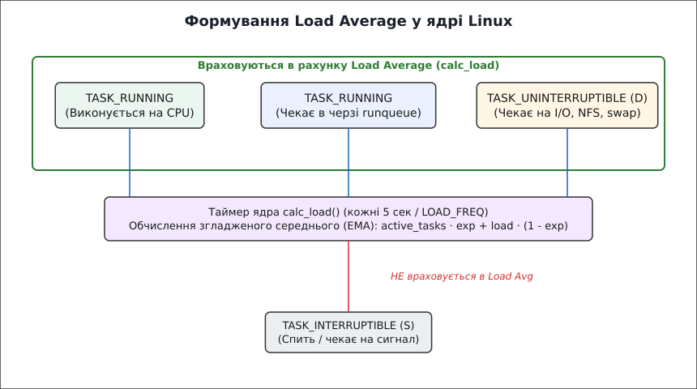
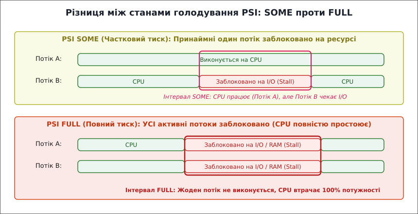
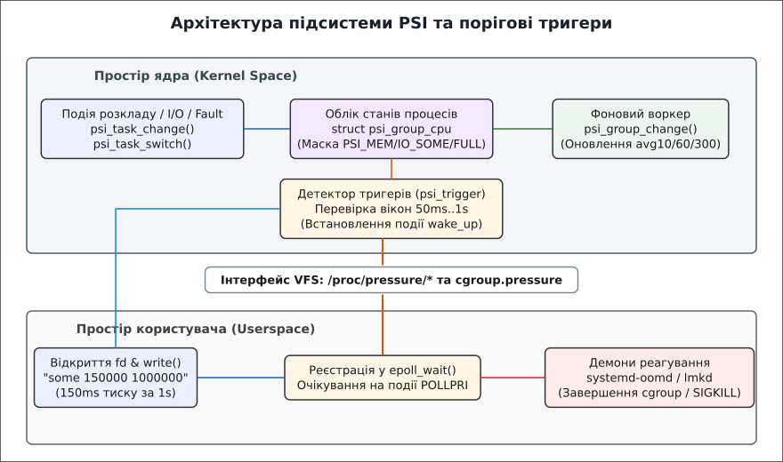

# Середнє навантаження й тиск на ресурси (PSI)

<preknowlist>
- [Архітектура procfs та структура /proc/[pid]](topic:sys-unix/procfs-kernel-implementation) — функціонування псевдофайлової системи та механізми вичитування метрик ядра з простору користувача.
- [cgroupfs v1 та v2](topic:sys-unix/cgroupfs-kernfs-implementation) — ієрархічний розподіл ресурсів, ліміти пам'яті та ізоляція контейнерів.
- [Oops і паніка](topic:sys-unix/kernel-oops-panic) — реакція ядра Linux на критичне голодування оперативної пам'яті та апаратні затримки.
</preknowlist>

Коли на 64-ядерному вебсервері обробка запитів раптово зупиняється з помилкою 504 Gateway Timeout, утиліта `uptime` позначає середнє навантаження значенням `120.45`. Проте системний виклик `getrusage()` показує, що центральний процесор завантажений лише на 4%, а 116 потоків бази даних зависли в стані непереривного сну, чекаючи на зчитування сторінок з оперативної пам'яті, яку системний демон `kswapd` гарячково намагається витіснити на повільний диск. Традиційний показник Load Average у цьому сценарії фіксує сам факт катастрофи, але повністю приховує її першопричину, змушуючи інженера гадати, чи змагаються процеси за CPU, чи застрягли у дисковому блокуванні, чи розтрачують кванти часу на сторінкові збої (page faults). Для вирішення цієї 40-річної проблеми в ядрі Linux було створено підсистему **Pressure Stall Information (PSI)**, яка вимірює не довжину черг, а точний час, втрачений потоками через голодування за конкретним ресурсом.

## 1. Механіка та вирахування Load Average у ядрі Linux

Показник середнього навантаження (Load Average) залишається найпершим інструментом "швидкого огляду", який відображається у виводі утиліт `top`, `htop`, `uptime` та `/proc/loadavg`. Він відображає три числа: усереднене навантаження за останню 1 хвилину, 5 хвилин та 15 хвилин.

### 1.1. Стани процесів, що формують Load Average

У класичних операційних системах Unix (BSD, System V) Load Average враховував лише ті процеси, які безпосередньо виконувалися на процесорі або очікували в черзі розкладу (runqueue). Проте в ядрі Linux, починаючи з версії 0.99.14 (1993 рік), до розрахунку додано процеси у стані непереривного сну.

Формула включення процесів у Linux Load Average:
`Active Tasks = TASK_RUNNING + TASK_UNINTERRUPTIBLE`

Де стани процесів визначаються наступним чином:
- **`TASK_RUNNING`**: потік виконує інструкції на процесорі або перебуває в черзі готових до виконання задач (runqueue) планивальника CFS / EEVDF.
- **`TASK_UNINTERRUPTIBLE`** (стан `D` у виводі `ps` / `top`): потік чекає на апаратну подію (наприклад, завершення зчитування дискового блоку, заблокований виклик `read()` на NFS або очікування сторінки RAM під час swap-in). Цей стан є непереривним: потік не реагує на сигнали (включаючи `SIGKILL`), доки апаратна операція не завершиться.
- **`TASK_INTERRUPTIBLE`** (стан `S`): потік спить в очікуванні події (таймер, мережевий сокет, сигнал) і **категорично виключається** з розрахунку Load Average.


*Формування Load Average у ядрі Linux: об'єднання TASK_RUNNING та TASK_UNINTERRUPTIBLE у таймері calc_load()*

Історію створення цього суперечливого патчу та його вплив на еволюцію моніторингу викладено у вставці [Від Tenex і Unix до Facebook: еволюція метрик навантаження](topic:sys-unix/load-and-pressure/hist-loadavg-to-psi.md).

### 1.2. Математичний алгоритм усереднення (calc_load)

Ядро Linux не зберігає повну історію завантаженості за 15 хвилин, оскільки це вимагало б значних обсягів пам'яті. Натомість використовується **експоненціально згладжене рухоме середнє** (Exponentially Decaying Moving Average, EMA), яке обчислюється таймером ядра у функції `calc_load()` кожні 5 секунд (константа `LOAD_FREQ = 5 * HZ`).

Математична формула оновлення Load Average:

```
load(t) = load(t - 1) · exp + active_tasks · (1 - exp)
```

Де:
- `load(t)` — нове значення середнього навантаження на кроці `t`.
- `load(t - 1)` — попереднє значення середнього навантаження.
- `active_tasks` — миттєва кількість потоків у станах `TASK_RUNNING` та `TASK_UNINTERRUPTIBLE`, зчитана таймером ядра у момент опитування.
- `exp` — коефіцієнт згасання, обчислений для вікон у 1, 5 та 15 хвилин:
  - `exp(1 хв) = e^(-5 / 60) ≈ 0.9200444146`
  - `exp(5 хв) = e^(-5 / 300) ≈ 0.9834714538`
  - `exp(15 хв) = e^(-5 / 900) ≈ 0.9944598480`

Оскільки у просторі ядра заборонені обчислення з плаваючою крапкою (float / double), ядро Linux реалізує цю формулу за допомогою **арифметики з фіксованою крапкою** (fixed-point arithmetic) з використанням цілочисельного зсуву на 11 біт (`FIXED_1 = 1 << 11 = 2048`).

Крок-за-кроком обчислення у ядрі Linux (з вихідного коду `kernel/sched/loadavg.c`):

```
[Крок 1: зчитування миттєвої кількості активних задач]
active_tasks = nr_running() + nr_uninterruptible()

[Крок 2: масштабування активних задач до фіксованої крапки]
active_val = active_tasks · FIXED_1      [де FIXED_1 = 2048]

[Крок 3: розрахунок згладженого значення для 1 хвилини]
load_1m = (load_1m · EXP_1 + active_val · (2048 - EXP_1)) >> 11
```

Значення констант згасання у вихідному коді ядра заздалегідь обчислені й зафіксовані як макроси:
- `EXP_1  = 1884`  (відповідає `0.920044 · 2048`)
- `EXP_5  = 2014`  (відповідає `0.983471 · 2048`)
- `EXP_15 = 2037`  (відповідає `0.994459 · 2048`)

Детальний приклад покрокового розрахунку: якщо система протягом тривалого часу перебувала в спокої (`load_1m = 0`), а потім у ній раптово запустилися 10 активних процесів, значення `load_1m` буде змінюватися на кожному 5-секундному такті ядра наступним чином:

```
[Такт 0 (t = 0s)]:   active = 10, load_1m = 0.00
[Такт 1 (t = 5s)]:   load_1m = (0 · 1884 + 20480 · 164) >> 11 = 1.64
[Такт 2 (t = 10s)]:  load_1m = (3358 · 1884 + 20480 · 164) >> 11 = 3.15
[Такт 3 (t = 15s)]:  load_1m = (6451 · 1884 + 20480 · 164) >> 11 = 4.54
[Такт 12 (t = 60s)]: load_1m ≈ 6.32
```

Як видно з розрахунку, навіть при постійному навантаженні у 10 процесів показник `load 1m` досягне значення 6.32 лише через 1 хвилину, а до значення 9.5 дійде лише через 3 хвилини. Це наочно демонструє інерційність та затримку реагування метрики Load Average.

### 1.3. Фундаментальні недоліки Load Average у сучасних архітектурах

Попри повсюдне використання, Load Average володіє трьома критичними дефектами:

1. **Замилювання першопричини (Resource Ambiguity)**: Значення 20.0 на 4-ядерній системі не дає відповіді, чи обчислювальний процес перевантажив CPU, чи повільний диск заблокував 20 потоків I/O, чи пам'ять вичерпалася і ядро борсається у витісненні сторінок (swap thrashing).
2. **Затримка реагування (Decay Lag)**: Оскільки EMA згасає поступово, піковий сплеск I/O тривалістю 3 секунди відобразиться на показниках `load 1m` лише через 15–20 секунд і продовжуватиме висіти високим значенням ще протягом кількох хвилин після того, як система вже відновила роботу.
3. **Нелінійність відносно ядер CPU**: На 2-ядерному сервері Load Average `4.0` означає 100% перевантаження (дві задачі чекають у черзі). На 128-ядерному сервері Load Average `4.0` означає 97% простою. Це ускладнює написання універсальних скриптів автомасштабування.

## 2. Концепція Pressure Stall Information (PSI)

Розроблена інженерами Facebook підсистема **Pressure Stall Information (PSI)** вирішує проблему оцінки навантаження шляхом зміни принципу вимірювання: замість підрахунку кількості задач у чергах PSI вимірює **абсолютний час голодування (stall time)**, який потоки втратили через брак ресурсів.

### 2.1. Три класи ресурсів

PSI відстежує тиск незалежно для трьох головних системних ресурсів:
1. **`CPU`**: затримки, виниклі через змагання потоків за процесорний час (чекання готовності в runqueue).
2. **`Memory`**: затримки, виниклі через брак оперативної пам'яті (виконання direct reclaim, compaction, чекання сторінок зі swap або файлового кешу).
3. **`I/O`**: затримки, виниклі через очікування завершення операцій читання/запису на блокові пристрої.

### 2.2. Розділення тиску: SOME проти FULL

Фундаментальною інновацією PSI є чітке розділення тиску на два стани: **`some`** та **`full`**.


*Часова діаграма станів PSI: часткове голодування (SOME) проти повного паралічу CPU (FULL)*

#### Стан `SOME` (Частковий тиск)
Стан `some` позначає часові інтервали, протягом яких **принаймні один потік** у системі (або в cgroup) заблоковано в очікуванні даного ресурсу, але при цьому **інші потоки продовжують виконуватися на CPU**.

Високе значення `some` свідчить про те, що окремі завдання відчувають деградацію продуктивності, але центральний процесор виконує корисну роботу.

#### Стан `FULL` (Повний тиск та параліч)
Стан `full` позначає часові інтервали, протягом яких **усі активні потоки** заблоковані в очікуванні ресурсу (пам'яті або I/O), і **процесор повністю простоює**, не маючи жодної задачі для виконання.

Високе значення `full` є індикатором катастрофічного стану системи: обчислювальна потужність процесора марнується на 100%, оскільки всі програми застрягли у стані сну `TASK_UNINTERRUPTIBLE`.

> 🔧 **Особливість ресурсу CPU:** Для ресурсу CPU існує **лише стан `some`**. Стан `full` для CPU неможливий за означенням: якщо процесор простоює, це означає, що на нього ніхто не чекає, і голодування за CPU відсутнє.

### 2.3. Структура метрик PSI: avg10, avg60, avg300 та total

Читання файлів `/proc/pressure/{cpu,memory,io}` повертає дані у наступному форматі:

```
some avg10=1.25 avg60=0.80 avg300=0.20 total=15420310
full avg10=0.00 avg60=0.00 avg300=0.00 total=0
```

- **`avg10`, `avg60`, `avg300`**: відсоток часу (від `0.00`% до `100.00`%), протягом якого система перебувала у стані тиску за останні 10, 60 та 300 секунд відповідно.
- **`total`**: монотонний лічильник у мікросекундах (μs), який накопичує точний час голодування з моменту старту ядра.

## 3. Внутрішня архітектура та реалізація PSI у ядрі

Облік тиску PSI інтегровано безпосередньо в гарячі шляхи планивальника задач та підсистеми управління пам'яттю ядра Linux.


*Архітектура ядра: попроцесорний облік станів, фоновий агрегатор та тригери реального часу*

Детальний опис заголовочних файлів ядра, структур даних та специфікацій файлової системи procfs/sysfs наведено у вставці [Інтерфейси системного тиску: /proc/pressure та cgroup v2](topic:sys-unix/load-and-pressure/api-proc-pressure-interface.md).

### 3.1. Перехоплення станів у підсистемах ядра

Для забезпечення високої точності ядро Linux розставило хуки PSI у ключових точках виконання:

1. **Планувальник задач (Scheduler Hooks)**:
   При кожній зміні стану потоку (наприклад, перехід у сон або повернення в runqueue) викликається функція `psi_task_change()`. Вона оновлює прапорці стану для поточного CPU.

2. **Підсистема пам'яті (Memory Reclaim & Page Faults)**:
   Коли процес потрапляє у стан direct reclaim (ядро змушене негайно звільняти сторінки для задоволення `alloc_pages()`), викликається функція `psi_memstall_enter()`. При завершенні звільнення сторінок викликається `psi_memstall_leave()`. Інтервал між цими двома викликами точно зараховується у лічильники `PSI_MEM_SOME` або `PSI_MEM_FULL`.

3. **Блоковий шар та I/O (Block Layer & Swap)**:
   Під час синхронного очікування завершення I/O (`io_schedule_prepare()` / `io_schedule_finish()`) ядро маркує потік як заблокований на I/O і додає час очікування до метрик `PSI_IO_SOME` / `PSI_IO_FULL`.

### 3.2. Попроцесорний облік без блокувань (per-CPU tracking)

Щоб мінімізувати накладні витрати на контекстні перемикання, ядро зберігає стани задач у попроцесорних структурах `struct psi_group_cpu`.

При кожному переключенні контексту або зміні стану потоку планивальник оновлює бітову маску прапорців задач для даного CPU:

- `PSI_MEM_SOME` — потік чекає на виділення пам'яті / reclaim.
- `PSI_MEM_FULL` — усі потоки на CPU чекають на пам'ять.
- `PSI_IO_SOME` — потік чекає на зчитування/запис диска.
- `PSI_IO_FULL` — усі потоки на CPU чекають на диск.
- `PSI_CPU_SOME` — потік чекає в runqueue на вільне ядро CPU.

### 3.3. Агрегація та обчислення згладжених значений

Окремий фоновий воркер ядра (`psi_group_change`) з періодичністю в 2 секунди опитує попроцесорні лічильники `times[]`, підсумовує накопичені мікросекунди і оновлює згладжені значення `avg10`, `avg60` та `avg300` за допомогою швидких цілочисельних формул згасання.

Якщо жоден потік у системі не змінював стан протягом тривалого часу, фоновий таймер PSI вимикається (переходить у стан `sleep`), запобігаючи зайвим пробудженням процесора при простої системи.

## 4. Подієва модель та тригери реального часу

Найпотужнішою можливістю PSI є не просто зчитування статистичних метрик, а можливість реєстрації **подієвих тригерів реального часу** у просторі користувача.

### 4.1. Відмова від polling на користь epoll

Традиційні демони моніторингу змушені були щосекунди читати файли `/proc/`, витрачаючи ресурси CPU. З PSI програма описує ядру критерій тиску і засинає в системному виклику `epoll_wait()`.

Синтаксис налаштування тригера шляхом запису у fd `/proc/pressure/memory` або `cgroup.pressure`:

```
"some 150000 1000000"
```

Цей запис розшифровується так: *"Спробудити демон через epoll, якщо процеси проведуть у стані голодування пам'яті щонайменше 150 мс (150 000 μs) протягом будь-якого рухомого вікна в 1 секунду (1 000 000 μs)"*.

Приклад розробки повноцінного системного демона на C та C++ з використанням `epoll()` та тригерів PSI наведено у вставці [Демон очікування ресурсів на базі PSI та epoll](topic:sys-unix/load-and-pressure/proj-psi-monitor.md).

### 4.2. Демони реагування нового покоління: systemd-oomd та lmkd

Завдяки тригерам PSI системні розробники змогли відмовитися від застарілого вбудованого Linux Kernel OOM Killer, який спрацьовував лише тоді, коли система вже перебувала у стані повного паралічу.

Сучасні демони реагування:
- **`systemd-oomd`**: демон дистрибутивів Linux (Ubuntu, Fedora, Arch), який слухає тригери `memory.pressure` для кожної cgroup. Якщо контейнер починає зазнавати тиску пам'яті (наприклад, `memory/some > 60%` протягом 30 секунд), `systemd-oomd` достроково завершує (`SIGKILL`) лише цей контейнер, не допускаючи зависання всього сервера.
- **`lmkd` (Low Memory Killer Daemon)**: демон операційної системи Android, який використовує PSI тригери для превентивного завершення фонових додатків до того, як користувач відчує затримки інтерфейсу.

## 5. cgroup v1 проти cgroup v2: Переломний етап для PSI

Підсистема PSI найпотужніше розкривається в середовищах контейнеризації (Docker, Kubernetes, LXC). Однак існує фундаментальна різниця між застарілою ієрархією cgroup v1 та сучасною уніфікованою ієрархією cgroup v2.

### 5.1. Чому PSI не підтримується у cgroup v1

У cgroup v1 кожна підсистема (контролер) мала власну незалежну файлову ієрархію (`/sys/fs/cgroup/cpu/`, `/sys/fs/cgroup/memory/`, `/sys/fs/cgroup/blkio/`). Це робило неможливим зв'язати голодування за пам'яттю з процесорним часом конкретної групи процесів, оскільки процес міг перебувати у групі `A` для CPU і групі `B` для Memory.

### 5.2. Повна інтеграція у cgroup v2

У cgroup v2 реалізовано єдине уніфіковане дерево процесів (unified hierarchy). Кожна контрольна група містить власні вузли тиску:
- `/sys/fs/cgroup/docker/<container_id>/memory.pressure`
- `/sys/fs/cgroup/docker/<container_id>/io.pressure`
- `/sys/fs/cgroup/docker/<container_id>/cpu.pressure`

Це дозволяє оркестраторам контейнерів (наприклад, Kubernetes Kubelet) аналізувати тиск ресурсів на рівні кожного Pod'а і приймати рішення про горизонтальне автопідкачування (Horizontal Pod Autoscaler, HPA) або перенесення контейнерів до того, як виникне відмова сервісу.

## 6. Порівняльний аналіз та сценарії діагностики

У таблиці нижче наведено порівняння метрик Load Average та PSI під час реальних інцидентів на виробничих серверах:

| Сценарій інциденту | Поведінка Load Average | Поведінка PSI метрик | Діагностичний висновок та дія інженера |
| :--- | :--- | :--- | :--- |
| **Компіляція коду (CPU-bound)** | Зростає пропорційно кількості потоків (наприклад, 32.0) | `cpu/some` зростає до 80–90%; `memory` та `io` залишаються біля `0.00` | Змагання за CPU. Система працює нормально, потрібно більше ядер або налаштування `nice` |
| **Шторм читання з диска (I/O-bound)** | Зростає до високих значень (наприклад, 45.0) через `TASK_UNINTERRUPTIBLE` | `io/some` та `io/full` зростають до 70–90%; `cpu/some` низький | Пляшкове горлечко — дисковий накопичувач. Потрібна заміна на NVMe або оптимізація дискових індексів |
| **Виснаження RAM та swap thrashing** | Стрімко зростає (наприклад, 80.0+) за рахунок `kswapd` | `memory/some` та `memory/full` досягають 100%; `cpu/some` падає до 0% | Критична нестача RAM. Система витрачає 100% часу на swap. Потрібен негайний OOM kill або додати RAM |

## 7. Простеження, метрики Prometheus та тюнінг

### 7.1. Моніторинг PSI у Prometheus та Grafana

Офіційний інструмент збору метрик `node_exporter` підтримує збір метрик PSI за допомогою колектра `pressure`.

Основні Prometheus-метрики:
- `node_pressure_cpu_waiting_seconds_total` — лічильник `cpu/some` total.
- `node_pressure_memory_waiting_seconds_total` — лічильник `memory/some` total.
- `node_pressure_memory_stalled_seconds_total` — лічильник `memory/full` total.
- `node_pressure_io_waiting_seconds_total` — лічильник `io/some` total.
- `node_pressure_io_stalled_seconds_total` — лічильник `io/full` total.

Приклад Prometheus-запиту (PromQL) для розрахунку відсотка затримок пам'яті за останні 5 хвилин:
```promql
rate(node_pressure_memory_stalled_seconds_total[5m]) * 100
```

### 7.2. Інструменти простеження та eBPF

Для глибокого аналізу подій PSI інженери можуть використовувати утиліту `bpftrace` для перехоплення внутрішніх функцій ядра:

```bash
# Відстеження тривалості затримок у функціях PSI за допомогою bpftrace
$ bpftrace -e 'kprobe:psi_task_change { @[comm] = count(); }'
```

Також події PSI інтегровані в системну підсистему `tracefs`:
```bash
$ echo 1 > /sys/kernel/tracing/events/psi/psi_event/enable
$ cat /sys/kernel/tracing/trace_pipe
```

### 7.3. Накладні витрати підсистеми (Performance Overhead)

Завдяки використанню попроцесорних структур data-path подій PSI у ядрі оптимізовано за допомогою неблокуючих атомарних масок. Накладні витрати на виконання коду PSI при контекстних перемиканнях становлять **менше 0.2%–0.5% продуктивності CPU**.

Для систем із надвисокими вимогами до затримок (Low-Latency High-Frequency Trading) підсистему PSI можна повністю вимкнути під час завантаження ядра за допомогою параметра `psi=0` у командному рядку завантажувача:

```bash
# Перевірка стану PSI у запущеній системі
$ cat /sys/module/PSI/parameters/enabled
Y
```

## Висновки

Показник Load Average залишається зручним історичним індикатором "першого погляду", але він є занадто грубим для діагностики сучасних багатоядерних та контейнеризованих систем. Підсистема Pressure Stall Information (PSI) надає точні квантифіковані метрики втраченого часу окремо для CPU, оперативної пам'яті та дискового введення-виведення, відрізняючи часткову деградацію (`some`) від повного паралічу системи (`full`) та надаючи механізм порігових тригерів реального часу для автоматичного управління ресурсами.
