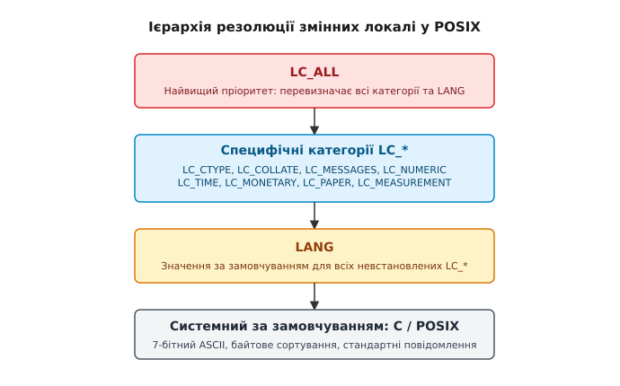
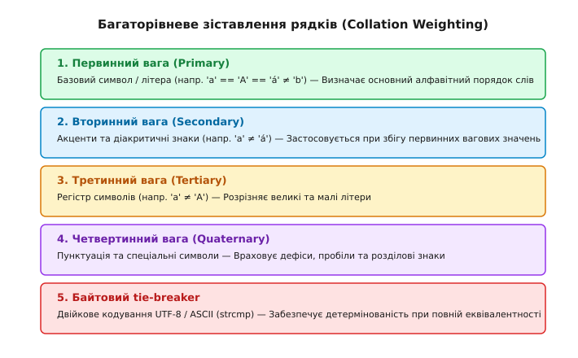
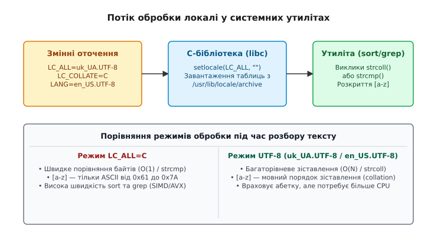

# Локаль: як мова змінює поведінку програм

<preknowlist>
- [Аргументи, оточення й що успадковує дитина](topic:sys-unix/argv-and-environment) — передача масиву environ під час системного виклику execve.
- [Оточення сеансу: profile, rc і пошук у PATH](topic:sys-unix/session-environment) — експорт змінних у файлах конфігурації оболонки.
- [Стандартні потоки даних](topic:sys-unix/standard-streams) — передача текстових даних між процесами у конвеєрі.
</preknowlist>

Виконання команди `sort log.txt` на двох ідентичних серверах Linux із однаковим початковим файлом дає абсолютно різний порядок вихідних рядків. На сервері розробника рядок `"Apple"` передує рядку `"apple"`, а числові ідентифікатори розміщуються перед будь-яким текстом. На сервері продуктивного середовища ті ж самі рядки `"Apple"` та `"apple"` опиняються поруч, кириличні записи сортуються за українською абеткою, а спроба відфільтрувати файли регулярним виразом `grep '[a-z]'` несподівано вибирає рядки з великими латинськими літерами. Більше того, той самий сценарій обробки текстових файлів на другому сервері працює у п'ять разів повільніше та споживає помітно більше ресурсів процесора.

Джерелом цієї розбіжності є не версія ядра Linux і не особливості компіляції утиліт. У філософії Unix програма не розбирає текст у порожнечі: кожен процес під час запуску через системний виклик `execve()` отримує від батьківського середовища масив змінних оточення `environ`. Серед них лежить група конфігураційних параметрів, яка називається **локаль** (locale). Локаль визначає культурні, мовні та орфографічні правила, за якими системна бібліотека C (`libc`) інтерпретує байти у пам'яті як символи, виконує порівняння рядків, форматує числа та виводить повідомлення про помилки.

## 1. Анатомія мовної небезпеки: від байтів до культурного контексту

У центрі архітектури Unix лежить концепція байтового потоку: файл чи пайп розглядається як послідовність 8-бітних байтів від `0x00` до `0xFF`. Проте для людини текст — це не байти, а послідовність абстрактних символів (літер, цифр, розділових знаків), які підпорядковуються правилам конкретної мови та абетки.

Коли програма на C викликає функцію порівняння рядків `strcmp()`, вона виконує пряме арифметичне віднімання числових кодів двох байтів:

```
'A' (0x41 = 65)  <  'a' (0x61 = 97)
```

За цим двійковим правилом будь-яка велика латинська літера передує малій, а кириличний символ у кодуванні UTF-8 складається з двох байтів (наприклад, українська 'А' кодується як `0xD0 0x90`), які розглядаються як дві незалежні числові величини.

Проте людська мова влаштована інакше:
1. **Регістрова еквівалентність**: Словниковий порядок вимагає групувати слова `"Apple"` та `"apple"` поруч, розглядаючи відмінність між великою й малою літерами як другорядну.
2. **Діакритика та акценти**: У багатьох мовах літери з діакритичними знаками (наприклад, `'é'` або `'è'`) мають розміщуватися поруч із базовою літерою `'e'`, але йти після неї за умови однакового тексту.
3. **Національний алфавітний порядок**: В українській мові літера `'Ґ'` має йти одразу після `'Г'`, а не в кінці Unicode-таблиці. В іспанській мові традиційне сортування розглядає двобуквенну комбінацію `"ch"` як єдину неподільну сутність (collating element), що йде після літери `"c"`.
4. **Складне форматування**: Роздільником дробової частини числа в англомовних країнах є крапка (`1.5`), тоді як у більшості країн Європи — кома (`1,5`).

Для того щоб утиліти оболонки (`ls`, `sort`, `grep`, `awk`, `sed`) не хардкодили мовні правила всередині власного коду, POSIX розробив інфраструктуру локалей. Програма не обробляє мовні правила самостійно — вона запитує системну бібліотеку C про правила поточного середовища.

Детальний аналіз історичного шляху від 7-бітного ASCII через хаос 8-бітних кодових сторінок 1980-х років до створення єдиного стандарту POSIX та кодування UTF-8 висвітлено у вставці [Історія стандартизації локалей](topic:sys-unix/locale-and-collation/hist-locale-standards.md).

## 2. Категорії POSIX-локалі: розділення сфер відповідальності

Локаль у POSIX не є монолітним налаштуванням. Вона розділена на специфічні категорії, кожна з яких керує окремим аспектом поведінки системної бібліотеки `libc`. 

Основні категорії локалі, визначені стандартом POSIX.1-2008:

- **`LC_CTYPE` (Character Classification and Case Conversion)**:
  Визначає кодування символів у системі (наприклад, ASCII, ISO-8859-1 чи UTF-8) та класифікує байти у пам'яті. Вона відповідає на запитання: чи є даний байт (або послідовність байтів) літерою, цифрою, пробілом, друкованим або керуючим символом. Впливає на класичні C-функції `isalpha()`, `isdigit()`, `isspace()`, `toupper()`, `tolower()`, макрос `MB_CUR_MAX`, а також на визначення меж багатобайтових символів у UTF-8 (`mblen`, `mbrtowc`, `wcwidth`).

- **`LC_COLLATE` (String Collation and Regular Expressions)**:
  Визначає правила алфавітного сортування рядків та розкриття діапазонів у регулярних виразах. Саме ця категорія керує роботою утиліти `sort`, оператором порівняння у `ls`, а також діапазонами символів `[a-z]` у `grep`, `sed` та `awk`.

- **`LC_MESSAGES` (System Messages and Responses)**:
  Визначає мову системних повідомлень про помилки (вивід `strerror()`, `perror()`, утиліти `gettext`, каталоги `catopen`) та правила інтерпретації стверджувальних чи заперечних відповідей користувача в інтерактивних термінальних програмах (наприклад, регулярні вирази для відповідей `"yes/no"`).

- **`LC_NUMERIC` (Numeric Formatting)**:
  Визначає символ-розділювач дробової частини (крапка чи кома), символ групування триад цифр (пробіл, апостроф, кома) та кількість цифр у групах під час форматованого введення-виведення (`printf`, `scanf`, `awk`).

- **`LC_TIME` (Date and Time Formatting)**:
  Визначає текстовий формат відображення дати й часу, назви місяців та днів тижня для утиліти `date` та системних функцій `strftime()`, `strptime()`.

- **`LC_MONETARY` (Monetary Formatting)**:
  Визначає правила форматування грошових сум: національний символ валюти, його позицію (перед чи після числа), роздільники та знаки від'ємних значень.

- **`LC_PAPER`, `LC_NAME`, `LC_ADDRESS`, `LC_TELEPHONE`, `LC_MEASUREMENT`**:
  Додаткові категорії (поширені у GNU libc), що визначають дефолтний розмір паперу (A4 проти Letter), формат звернення до людей, поштові адреси та одиниці вимірювання (метрична проти імперської системи).

Кожна категорія може налаштовуватися незалежно від інших. Наприклад, системний адміністратор може встановити англомовні повідомлення про помилки (`LC_MESSAGES=en_US.UTF-8`), але залишити українські правила сортування рядків (`LC_COLLATE=uk_UA.UTF-8`) та європейське форматування дати (`LC_TIME=uk_UA.UTF-8`).

## 3. Ієрархія резолюції змінних середовища

Коли процес починає виконання, C-бібліотека не зчитує конфігураційні файли з диска автоматично. Програма повинна явно ініціалізувати локаль викликом `setlocale(LC_ALL, "")`. Порожній рядок `""` вказує бібліотеці зчитати налаштування з масиву змінних оточення процесу (`environ`).

Визначення активного значення для кожної категорії відбувається за чітким чотирирівневим алгоритмом пріоритету:

1. **`LC_ALL` (Абсолютний перемикач)**:
   Якщо змінна середовища `LC_ALL` встановлена й не порожня, її значення **перекриває значення всіх інших категорій `LC_*` та змінної `LANG`**. Вона слугує глобальним вимикачем і використовується переважно для тимчасової зміни локалі у скриптах чи під час налагодження.

2. **Специфічні змінні `LC_<CATEGORY>`**:
   Якщо `LC_ALL` не встановлена, система перевіряє змінну для конкретної категорії (наприклад, `LC_CTYPE`, `LC_COLLATE`, `LC_NUMERIC`). Якщо значення знайдено, воно застосовується суто до цієї категорії.

3. **`LANG` (Загальне значення за замовчуванням)**:
   Якщо `LC_ALL` не встановлена і для певної категорії відсутня специфічна змінна `LC_<CATEGORY>`, система використовує значення з загальної змінної `LANG`. Змінна `LANG` задає базову локаль для всього середовища користувача.

4. **Системний дефолт (`C` / `POSIX`)**:
   Якщо жодна зі змінних `LC_ALL`, `LC_<CATEGORY>` чи `LANG` не задана у середовищі процесу, C-бібліотека автоматично падає на базову системну локаль **`C`** (синонім `POSIX`).


*_Ієрархія резолюції змінних середовища: від перевизначення LC_ALL до базового значення LANG та системної локалі C/POSIX._*

Приклад резолюції значень категорій у пам'яті процесу наведено у таблиці:

| Змінні оточення у `environ` | `LC_CTYPE` у пам'яті | `LC_COLLATE` у пам'яті | `LC_MESSAGES` у пам'яті |
| :--- | :--- | :--- | :--- |
| `LANG=uk_UA.UTF-8` | `uk_UA.UTF-8` | `uk_UA.UTF-8` | `uk_UA.UTF-8` |
| `LANG=uk_UA.UTF-8`, `LC_COLLATE=C` | `uk_UA.UTF-8` | **`C`** | `uk_UA.UTF-8` |
| `LANG=uk_UA.UTF-8`, `LC_COLLATE=C`, `LC_ALL=en_US.UTF-8` | **`en_US.UTF-8`** | **`en_US.UTF-8`** | **`en_US.UTF-8`** |
| *(жодної змінної не задано)* | **`C`** | **`C`** | **`C`** |

⚠️ **Типова помилка**: Встановлення `LANG=uk_UA.UTF-8` **не матиме жодного впливу** на сортування чи класифікацію символів, якщо у середовищі вже висить `LC_ALL=C`. `LC_ALL` примусово домінує над усім.

## 4. Локалі C та POSIX проти UTF-8: двійкове бачення проти мовного

Фундаментальний розкол у обробці даних у Unix пролягає між двома режимами роботи: двійковою локаллю `C` (POSIX) та багатобайтовими мовними локалями на базі `UTF-8`.

### Локаль C (POSIX)
У локалі `C`:
- Множина символів обмежена 7-бітним ASCII (`0x00–0x7F`).
- Будь-який байт із встановленим старшим бітом (`0x80–0xFF`, від 128 до 255) розглядається як невідомий або недрукований символ.
- Розмір одного символу **завжди дорівнює 1 байту** (`MB_CUR_MAX == 1`).
- Сортування в `LC_COLLATE=C` є суто байтовим: від меншого числового коду до більшого.

Для системних утиліт це означає максимальну обчислювальну простоту. Порівняння двох рядків зводиться до порівняння машинного слова у регістрі процесора, а пошук підрядка у `grep` виконується через високооптимізовані SIMD-інструкції (AVX2/AVX-512).

### Локалі UTF-8 (наприклад, uk_UA.UTF-8 чи en_US.UTF-8)
У локалі `UTF-8`:
- Один символ кодується змінною кількістю байтів — від 1 до 4 (`MB_CUR_MAX == 4`).
- Символ 'A' займає 1 байт (`0x41`), українська 'А' — 2 байти (`0xD0 0x90`), ієрогліф — 3 байти, емодзі — 4 байти.
- Категорія `LC_CTYPE` повідомляє системній бібліотеці, що розривати рядок посередині багатобайтової послідовності заборонено.

### Механіка ширини символів у терміналі (wcwidth та wcswidth)
Окрім розрізнення байтів і символів, категорія `LC_CTYPE` вирішує задачу розміщення символів на моноширинній сітці термінала:
- Латинські та кириличні літери займають **1 колонку** (ширина 1).
- Ієрогліфи (CJK — Chinese, Japanese, Korean) та широкі символи займають **2 колонки** (ширина 2).
- Поєднувальні діакритичні знаки (Combining Marks) мають **ширину 0**, адже вони накладаються на попередній символ.

Функції `wcwidth(wchar_t wc)` та `wcswidth(const wchar_t *pwcs, size_t n)` запитують у таблиць `LC_CTYPE` ширину кожного символу. Якщо термінальний емулятор і C-бібліотека утиліти обчислюють ширини символів за різними версіями Unicode-таблиць, віконні рамки утиліт на кшталт `ncurses` чи `htop` розповзаються, створюючи візуальні дефекти.

Це фундаментально змінює роботу стандартних CLI-утиліт:

1. **Довжина рядка та зсуви (`wc`, `cut`, `awk`)**:
   У локалі `C` команда `wc -c` (кількість байтів) та `wc -m` (кількість символів) повертають однакові значення. У локалі `uk_UA.UTF-8` для тексту `"Привіт"` команда `wc -m` поверне **6 символів**, тоді як `wc -c` поверне **12 байтів** (бо кожна кирилична літера займає 2 байти).
   Аналогічно команда `cut -c1-3` у локалі `C` виріже перші 3 байти, що пошкодить перший кириличний символ і перетворить вивід на біті байти, тоді як у `UTF-8` вона виріже 3 цілісні символи.

2. **Регулярні вирази та пастка діапазонів `[a-z]`**:
   Найнебезпечніший наслідок локалі проявляється у регулярних виразах `grep`, `sed` та оболонки Bash під час розширення імен файлів (globbing).

   У локалі `C` діапазон `[a-z]` означає "усі байти з кодами від 97 (`'a'`) до 122 (`'z'`)". Сюди входять виключно малі латинські літери.

   Проте у мовних локалях (наприклад, `en_US.UTF-8` або `uk_UA.UTF-8`) порядок зіставлення `LC_COLLATE` чергує малі та великі літери у послідовності зіставлення (collating sequence):

   ```
   a -> A -> b -> B -> c -> C ... -> y -> Y -> z
   ```

   У такій локалі діапазон `[a-z]` розкривається від `'a'` до `'z'` уздовж цієї послідовності. В результаті до діапазону `[a-z]` **потрапляють великі літери B, C, D ..., Y**!

   ```bash
   # Демонстрація небезпеки розкриття діапазону в оболонці
   $ LC_ALL=en_US.UTF-8
   $ [[ "B" =~ [a-z] ]] && echo "Match!" || echo "No match"
   Match!  # Несподівано! Вважається, що 'B' належить діапазону [a-z]

   $ LC_ALL=C
   $ [[ "B" =~ [a-z] ]] && echo "Match!" || echo "No match"
   No match # Передбачувана двійкова поведінка
   ```

   Щоб написати переношувальний скрипт, який не залежить від локалі користувача, POSIX забороняє використовувати прямолінійні діапазони `[a-z]` та `[A-Z]`. Замість них слід використовувати **POSIX-класи символів**:

   - `[[:lower:]]` — малі літери поточної локалі.
   - `[[:upper:]]` — великі літери поточної локалі.
   - `[[:alpha:]]` — будь-які літери (малі й великі).
   - `[[:alnum:]]` — літери та цифри.
   - `[[:xdigit:]]` — шістнадцяткові цифри (`0-9`, `a-f`, `A-F`).

   Якщо скрипт повинен перевіряти суворо латинський ASCII-ідентифікатор (наприклад, назву змінної або ключ конфігурації), єдиним надійним рішенням є явне встановлення `LC_ALL=C` у тілі скрипта.

## 5. Механіка зіставлення (Collation): як працює сортування рядків

Сортування рядків природною мовою у категорій `LC_COLLATE` спирається на алгоритм багаторівневого порівняння (Unicode Collation Algorithm, UCA / POSIX Collation Weighting).

Коли утиліта `sort` або C-функція `strcoll()` порівнює два рядки, вона не просто порівнює числові коди. Для кожного символу з таблиць локалі витягується вектор вагових коефіцієнтів (weights), порівняння яких відбувається послідовними кроками (Passes).


*_Структура багаторівневого сортування Unicode Collation Algorithm (UCA) у системній бібліотеці C._*

Алгоритм виконує порівняння на п'яти фундаментальних рівнях:

1. **Первинний рівень (Primary Level)**:
   Порівнює базове значення літери, ігноруючи регістр та акценти. На цьому рівні символи `'a'`, `'A'`, `'á'`, `'À'` є повністю еквівалентними між собою, але відрізняються від літери `'b'`. Якщо первинні ваги двох рядків відрізняються, результат сортування визначається негайно.

2. **Вторинний рівень (Secondary Level)**:
   Застосовується лише тоді, коли первинні ваги рядків повністю збіглися. Враховує наявність акцентів та діакритичних знаків. На цьому рівні символ `'a'` відрізняється від `'á'`.

3. **Третинний рівень (Tertiary Level)**:
   Застосовується при збігу первинних і вторинних ваг. Розрізняє регістр символів (мала літера проти великої, `'a'` проти `'A'`).

4. **Четвертинний рівень (Quaternary Level)**:
   Враховує наявність розділових знаків, дефісів та пробілів, які ігнорувалися на перших трьох рівнях (наприклад, розрізняє `"head-end"` та `"headend"`).

5. **Двоковий tie-breaker (Byte-by-byte comparison)**:
   Якщо рядки виявилися еквівалентними на всіх чотирьох рівнях (наприклад, за наявності двох абсолютно однакових юнікод-рядків у різній нормалізованій формі NFC vs NFD), C-бібліотека виконує звичайне байтове порівняння `strcmp()`, щоб гарантувати сувору детермінованість порядку.

Розглянемо приклад сортування трьох слів у мовній локалі `en_US.UTF-8`:
- `"apple"`
- `"Apple"`
- `"banana"`

Під час порівняння `"apple"` та `"Apple"` на Первинному рівні обидва слова дають однаковий вектор `[a, p, p, l, e]`. На Вторинному рівні акценти відсутні. Але на Третинному рівні програма помічає відмінність регістру першої літери, і слово `"apple"` (мала літера) встановлюється перед `"Apple"`. Водночас слово `"banana"` відпадає ще на Первинному рівні, бо вага літери `'b'` більша за вагу літери `'a'`.

### Складні елементи зіставлення: Collating Elements та Equivalence Classes

Стандарт POSIX.1 дозволяє описувати у файлах джерел локалей (що розбираються утилітою `localedef`) дві спеціальні конструкції зіставлення:

1. **Багатосимвольні елементи зіставлення (Collating Elements)**:
   Послідовність кількох символів, яка розглядається як один елемент сортування. Наприклад, у чеській та іспанській мовах двосимвольна комбінація `"ch"` має власну вагу в абетці і сортується після `"h"` (або після `"c"`). У регулярних виразах такий елемент записується через `[.ch.]`.
2. **Класи еквівалентності (Equivalence Classes)**:
   Множина символів, які мають однакову первинну вагу зіставлення. У регулярних виразах синтаксис `[=a=]` збігається із символами `a`, `à`, `á`, `â`, `ä`.

## 6. Внутрішні механізми libc: компилятор localedef, системний архив та setlocale

У сучасних дистрибутивах Linux (Debian, Ubuntu, RHEL, Arch) текстові вихідні файли опису локалей зберігаються у каталозі `/usr/share/i18n/locales/` (наприклад, `/usr/share/i18n/locales/uk_UA`).

Ці текстові файли містять визначення категорій у спеціальному форматі POSIX:

```
escape_char /
comment_char %

LC_COLLATE
copy "iso14651_t1"
collating-symbol <uk-ya>
...
END LC_COLLATE
```

Системна утиліта `localedef` трансює ці текстові правила у бінарні таблиці:

```bash
$ localedef -i uk_UA -f UTF-8 uk_UA.UTF-8
```

Замість того щоб тримати тисячі окремих бінарних файлів на диску, сучасна C-бібліотека (`glibc`) об'єднує їх у єдиний відображуваний файл-архів — `/usr/lib/locale/locale-archive` (або `/usr/share/locale/`).

Коли програма викликає `setlocale(LC_ALL, "")`, C-бібліотека виконує системний виклик `openat()` для відкриття цього архіву та відображає його у віртуальний адресний простір процесу через системний виклик `mmap()`.

Простежимо роботу команди `sort` за допомогою `strace`:

```bash
$ strace -e openat,mmap sort input.txt
openat(AT_FDCWD, "/usr/lib/locale/locale-archive", O_RDONLY|O_CLOEXEC) = 3
mmap(NULL, 2248192, PROT_READ, MAP_SHARED, 3, 0) = 0x7f8a12000000
```

Бібліотека `libc` отримує прямий доступ до таблиць сортування та категорій CTYPE у пам'яті без додаткового очікування введення-виведення з диска.

### C та C++ API: Від setlocale до thread-safe uselocale

У системному програмуванні існують два підходи до керування локаллю.

Класичний C API використовує глобальну функцію `setlocale()`. Вона змінює локаль для всього процесу.

:::tabs
```c
/* Класичний виклик setlocale у C */
#include <stdio.h>
#include <locale.h>
#include <string.h>

int main(void) {
    // Ініціалізація локалі із середовища користувача
    if (setlocale(LC_ALL, "") == NULL) {
        fprintf(stderr, "Помилка встановлення локалі з оточення\n");
    }

    const char *s1 = "апельсин";
    const char *s2 = "банан";

    // Порівняння з урахуванням LC_COLLATE
    int res = strcoll(s1, s2);
    if (res < 0) {
        printf("%s передує %s\n", s1, s2);
    }
    return 0;
}
```
```cpp
// Ідіоматичний C++ підхід з використанням std::locale та std::collate
#include <iostream>
#include <string>
#include <locale>

int main() {
    try {
        // Створення об'єкта локалі без зміни глобального стану процесу
        std::locale loc("uk_UA.UTF-8");
        
        // Витягування фасету сортування
        const auto& coll = std::use_facet<std::collate<char>>(loc);

        std::string s1 = "апельсин";
        std::string s2 = "банан";

        int res = coll.compare(s1.data(), s1.data() + s1.size(),
                               s2.data(), s2.data() + s2.size());
        if (res < 0) {
            std::cout << s1 << " передує " << s2 << "\n";
        }
    } catch (const std::exception& e) {
        std::cerr << "Помилка локалі: " << e.what() << "\n";
    }
    return 0;
}
```
:::

Проте виклик `setlocale()` **не є потікобезпечним** (not thread-safe). Якщо один потік у багатотоковому веб-сервері виконає `setlocale(LC_ALL, "uk_UA.UTF-8")`, а інший потік паралельно виконує `printf()` або `strcoll()`, у програмі виникає стан ґонки (data race).

Для розв'язання цієї проблеми стандарт POSIX.1-2008 ввів тип `locale_t` та функцію `uselocale()`, яка встановлює локаль **суто для поточного потоку виконання** (thread-local locale).

Повний контракт системних викликів та функцій `setlocale()`, `uselocale()`, `newlocale()`, `strcoll()`, `strxfrm()` та їхніх C++ аналогів наведено у довіднику [Системний інтерфейс libc та POSIX locale API](topic:sys-unix/locale-and-collation/api-locale-libc.md).

## 7. Практичні пастки, продуктивність і правила побудови надійних скриптів

Нехтування змінними локалі є однією з найпоширеніших причин прихованих багів у системному адмініструванні, CI/CD пайплайнах та бекенд-розробці.

### Пастка 1: Парсинг чисел у LC_NUMERIC
У мовних локалях Європи (`uk_UA.UTF-8`, `fr_FR.UTF-8`, `de_DE.UTF-8`) десятковим роздільником є кома `,`.

Якщо C-програма або скрипт `awk` зчитує конфігураційний файл, де числа записані у стандартному форматі IEEE 754 (наприклад, `TIMEOUT=1.5`), за наявності `LC_NUMERIC=uk_UA.UTF-8` виклики `sscanf()`, `strtod()` або `awk` зчитають число `1.5` як ціле число `1`, а дробову частину `.5` просто відріжуть або видадуть синтаксичну помилку!

```bash
# Пастка LC_NUMERIC в awk
$ LC_NUMERIC=uk_UA.UTF-8 awk 'BEGIN { print 1.5 + 2 }'
3  # Дробова частина відрізана, бо awk чекав кому "1,5"!

$ LC_NUMERIC=C awk 'BEGIN { print 1.5 + 2 }'
3.5 # Математично коректний результат
```

### Пастка 2: Продуктивність конвеєрів та утиліти sort / grep
Мовне сортування `strcoll()` вимагає складного обчислення вагових коефіцієнтів та дає масові промахи кєш-пам'яті процесора.

Експериментальні вимірювання показують, що сортування 500 000 рядків логів у локалі `LC_ALL=uk_UA.UTF-8` працює у **8 разів повільніше**, ніж у локалі `LC_ALL=C`.

Детальний бенчмарк із вимірюванням тактів процесора, аналізом SIMD-векторизації та прикладами коду наведено у проектній вставці [Бенчмарк і механіка сортування](topic:sys-unix/locale-and-collation/proj-collation-bench.md).


*_Архітектура обробки даних у libc та утилітах оболонки під час роботи з локаллю._*

### Пастка 3: Безпека SetUID програм
У привілейованих програмах з встановленим бітом SetUID (наприклад, `sudo`, `passwd`, `su`) змінні оточення `LOCPATH` (шлях до сторонніх бінарних локалей) та `LC_MESSAGES` розглядаються ядром та `libc` як потенційний вектор атаки. Якщо звичайний користувач підсуне SetUID-програмі модифікований файл локалі через `LOCPATH`, це могло б призвести до переповнення буфера у `libc`. Тому C-бібліотека примусово ігнорує нестандартні шляхи локалей, якщо процес працює з підвищеними привілеями (`getuid() != geteuid()`).

> 🔧 **Навіщо це.**
> Для побудови детермінованих, швидких та безпечних системних скриптів дотримуйтеся трьох золотих правил:
> 
> 1. **Технічні конвеєри та парсинг логів**: Усі скрипти, які розбирають лог-файли, JSON, CSV, IP-адреси чи код, повинні починатися з явного експорту **`export LC_ALL=C`**. Це гарантує 5-кратне прискорення `sort`/`grep` та захищає від розширення діапазонів `[a-z]`.
> 2. **Форматування для користувача**: Якщо утиліта формує підсумковий звіт для людини, вимикайте `LC_ALL=C` і залишайте `LC_COLLATE=uk_UA.UTF-8` суто на етапі виводу.
> 3. **Регулярні вирази**: Ніколи не використовуйте діапазони `[a-z]` у скриптах, які можуть запускатися у довільному середовищі. Завжди замінюйте їх на POSIX-класи `[[:lower:]]`, `[[:upper:]]`, `[[:alpha:]]`, `[[:alnum:]]`.
