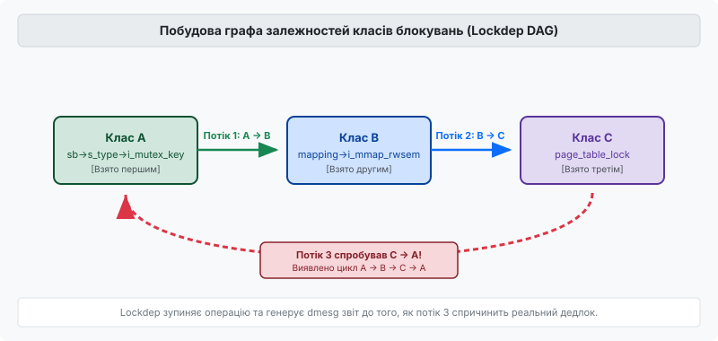
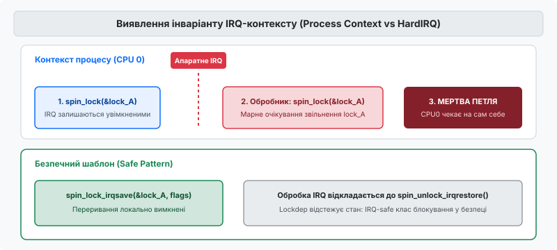

# Валідатор блокувань Lockdep

<preknowlist>
- [futex та синхронізація в ядрі](topic:sys-unix/futex-fast-userspace-mutex) — м'ютекси, спінлоки, семафори та відмінності між ними.
- [Атомарні операції та бар'єри пам'яті](topic:sf-tasks/memory-barriers) — впорядкування інструкцій та атомарні стани при паралельному доступі.
- [Блокування в ядрі Linux](topic:sys-unix/kernel-locking) — примітиви синхронізації ядра, класична проблема ABBA-дедлоку та переривання.
</preknowlist>

Коли операційна система стає багатопотоковою та багатиядерною, кількість блокувань у її ядрі зростає експоненційно. Ядро Linux містить десятки тисяч окремих м'ютексів та спінлоків, що захищають різноманітні структури даних — від дескрипторів файлів до сторінок пам'яті. З таким обсягом примітивів синхронізації неминуче виникає проблема взаємних блокувань (дедлоків), які повністю зупиняють роботу системи, змушуючи розробників витрачати дні на аналіз дампів пам'яті.

Класичний дедлок у багатиядерній системі спричиняє катастрофічний стан: два або більше потоків ядра застрягають назавжди, кожен чекаючи на звільнення блокування, яке утримується іншим. Операційна система зупиняє виконання на відповідних ядрах, обробка переривань блокується, консольний вивід припиняється, а системний журнал не отримує жодного запису, бо потік записи логів сам потрапляє в чергу очікувачів. Ззвичайне тестування не дає гарантій виявлення таких збоїв: імовірність того, що два потоки спробують захопити блокування у протилежному порядку в один і той самий мікросекундний інтервал часу, може становити один випадок на мільйони годин роботи.

Щоб подолати цю проблему, у ядрі Linux створили підсистему **Lockdep** (Lock Dependency Validator). Її головний принцип — не просто знаходити дедлоки постфактум після аварійної зупинки, а виявляти *потенційну можливість* дедлоку під час нормального виконання коду ще до того, як помилковий порядок блокувань призведе до реального зависання системи. Завдяки цьому Lockdep перетворює невизначені спорадичні аварії на детерміновані звіти з точними стеками викликів. Детальніше про передумови створення та еволюцію цієї підсистеми описано у вставці [📜 Історія створення Lockdep](topic:sys-unix/lockdep-lock-validator/hist-lockdep-history.md).

## Концепція класів блокувань (Lock Classes)

Головна математична та інженерна інновація Lockdep полягає в тому, як саме він відстежує примітиви синхронізації. Якби валідатор стежив за кожним окремим екземпляром м'ютекса (наприклад, м'ютексом кожного окремого відкритого файлу, кожної іноди чи кожного мережевого сокета), йому б знадобилися гігабайти оперативної пам'яті для зберігання графа, а накладні витрати на обхід мільйонів вузлів повністю зупинили б процесор.

Замість цього Lockdep оперує абстракцією **класу блокування (lock class)**. Клас об'єднує всі екземпляри блокувань, які мають однакову природу, лексичне місце оголошення та семантику використання у вихідному коді ядра.

За замовчуванням клас блокування визначається місцем у коді, де замок було ініціалізовано. Для цього ядро використовує статичний ключ `struct lock_class_key`. Наприклад, якщо у структурі `struct inode` оголошено спінлок `i_lock`, і він ініціалізується в одному місці функцією `spin_lock_init(&inode->i_lock)`, то всі м'ютекси та спінлоки у всіх мільйонах інод у пам'яті належать до *одного і того ж класу*.

```
Екземпляр inode 1 (&inode1->i_lock)  ──┐
Екземпляр inode 2 (&inode2->i_lock)  ──┼─► Клас блокування: &(&ip->i_lock)#3
Екземпляр inode N (&inodeN->i_lock)  ──┘
```

Lockdep виходить із фундаментального припущення: логіка коду ядра працює однаково з будь-яким екземпляром класу `i_lock`. Якщо в одному місці коду ядро бере м'ютекс іноди `A`, а потім спінлок сторінки пам'яті `B`, Lockdep фіксує це як загальне правило для класів: «Клас блокування іноди може бути взятий *до* класу блокування сторінки пам'яті».

Ця абстракція зменшує кількість об'єктів для стеження у графі з мільйонів екземплярів до кількох тисяч класів. Завдяки цьому обчислювальна складність алгоритмів перевірки на графах зменшується до рівня, який дозволяє виконувати аналіз у реальному часі без відчутної деградації продуктивності розробницької системи.

Звісно, існують випадки, коли динамічно створені об'єкти вимагають окремих класів (наприклад, різні типи файлових систем або мережеві сокети різних протоколів). Для цього розробники використовують спеціальні анотації, такі як `lockdep_set_class()`, які дозволяють присвоїти окремому екземпляру власний унікальний ключ класу під час виконання.

## Побудова графа залежностей та виявлення циклів ABBA

Під час роботи ядра, кожного разу, коли потік бере таке блокування `L2`, вже утримуючи інше блокування `L1`, Lockdep фіксує **залежність**. У внутрішній пам'яті валідатора створюється спрямоване ребро графа від класу `L1` до класу `L2`: `L1 → L2`. Появою цього ребра ядро засвідчує, що порядок захоплення «спочатку `L1`, потім `L2`» є спостережуваним і дозволеним у системі.

Сукупність усіх спостережуваних класів та ребер утворює орієнтований граф залежностей блокувань (Lock Dependency Graph). Головне завдання Lockdep під час додавання кожного нового ребра — перевірити, чи не порушує воно властивість орієнтованого ациклічного графа (DAG). Створення циклу в графі означає виявлення потенційного дедлоку.


*Рис. 1. Ілюстрація виявлення циклічної залежності в графі Lockdep.*

Розглянемо механіку виявлення класичного ABBA-дедлоку за кроками:

1. **Потік 1** виконує код у системній системі файлів: спочатку бере блокування класу `A` (`sb->s_type->i_mutex_key`), а потім усередині критичної секції бере блокування класу `B` (`mapping->i_mmap_rwsem`). Lockdep додає до графа спрямоване ребро `A → B`.
2. Через декілька годин **Потік 2** у зовсім іншій підсистемі виконує операцію зчитування: бере блокування класу `B`, а потім намагається взяти блокування класу `C` (`page_table_lock`). Lockdep перевіряє граф і додає ребро `B → C`. У графі існує шлях `A → B → C`.
3. **Потік 3** намагається взяти блокування класу `C`, а потім усередині критичної секції бере блокування класу `A`.

У момент, коли Потік 3 запитує блокування `A`, маючи в руках `C`, Lockdep викликає алгоритм пошуку в ширину (BFS) по існуючих ребрах графа від `A` до `C`. Валідатор знаходить, що шлях `A → B → C` вже спостерігався раніше. Спроба додати ребро `C → A` утворить замкнений цикл: `A → B → C → A`.

Як тільки цикл виявлено, Lockdep миттєво робить три дії:
- Зупиняє виконання поточної операції захоплення замка.
- Генерує розлогий детальний звіт у системний журнал (`dmesg`) із виведенням точних стеків викликів (stack traces) усіх потоків, які брали участь у формуванні кожного ребра циклу.
- Переводить валідатор у заблокований стан (`lockdep_off()`), припиняючи подальші перевірки в цій сесії, щоб уникнути заспамлювання системного логу та мінімізувати подальший ризик нестабільності.

Сила цього підходу полягає у **часовій незалежності**. Потоку 1, Потоку 2 і Потоку 3 необов'язково виконуватися одночасно чи перетинатися на різних процесорних ядрах! Потік 1 міг створити ребро вранці під час монтування диска, Потік 2 — вдень під час інтенсивного введення-виведення, а Потік 3 — увечері при завершенні процесу. Навіть якщо дедлок фізично жодного разу не стався, Lockdep сигналізує про помилку в архітектурі коду, ліквідуючи загрозу до того, як вона проявиться у продакшені.

## Контекст переривань та інваріанти IRQ

Окрім перевірки порядків викликів між звичайними потоками, Lockdep розв'язує ще складнішу категорію проблем синхронізації ядра: правильність використання блокувань відносно апаратних (`HARDIRQ`) та програмних (`SOFTIRQ`) переривань.

У ядрі Linux потік процесу, який утримує звичайний спінлок (`spin_lock()`), може бути апаратно перерваний перериванням від мережевої карти або дискового контролера на тому самому процесорному ядрі. Якщо обробник цього апаратного переривання спробує взяти той самий спінлок, виникне нерозв'язний взаємний затор (self-deadlock):

```
Процесор CPU0:
 1. Контекст процесу бере spin_lock(&lock_A) [IRQ НЕ вимкнено]
 2. Надходить апаратне переривання від пристрою на CPU0
 3. Обробник IRQ бере spin_lock(&lock_A)
 4. Обробник чекає на звільнення lock_A...
 5. АЛЕ процес, який має звільнити lock_A, НЕ МАТИМЕ CPU, бо його перервав обробник!
 ──► МЕРТВА ПЕТЛЯ НА CPU0
```

Щоб запобігти цьому, розробник мусить брати спінлоки, які використовуються в обробниках переривань, виключно з вимкненням переривань на локальному ядрі — за допомогою функцій `spin_lock_irqsave()` або `spin_lock_irq()`.


*Рис. 2. Збій інваріанту переривань при взятті спінлока в процесному та IRQ контекстах.*

Lockdep автоматично стежить за контекстами виконання кожного класу блокування і підтримує динамічний матричний стан для кожного класу. Класи діляться за 4 фундаментальними прапорцями:

- **`hardirq-safe`**: Блокування хоча б один раз було узято всередині контексту апаратного переривання (`in-hardirq`).
- **`hardirq-unsafe`**: Блокування хоча б один раз було узято у звичайному процесному контексті з *увімкненими* апаратними перериваннями.
- **`softirq-safe`**: Блокування утримувалося у контексті обробника softirq/tasklet.
- **`softirq-unsafe`**: Блокування утримувалося з увімкненими softirq.

Звідси Lockdep виводить правила фундаментальних інваріантів переривань:

> **Інваріант IRQ-безпеки:** Клас блокування не може бути одночасно `hardirq-safe` та `hardirq-unsafe`. Якщо клас зачеплений обробником IRQ, його *заборонено* брати у процесному контексті без вимкнення переривань.

Крім того, Lockdep перевіряє комбіновані залежності. Якщо Потік 1 бере `Lock A` (який є `hardirq-unsafe`), а потім бере `Lock B`, то `Lock B` не може бути взятий всередині обробника переривань (`hardirq-safe`), адже це утворить опосередкований ланцюжок дедлоку через IRQ!

## Спеціальні випадки: Рекурсія, Read-Write замки, Cross-Release та Chains

Практичне застосування валідатора блокувань виходить далеко за межі базових спінлоків. У ядрі існує багато складніших примітивів синхронізації та патернів їх використання, які вимагають додаткової логіки перевірки.

### 1. Рекурсивне взяття замків

Більшість спінлоків та м'ютексів у ядрі Linux є нерекурсивними (non-recursive). Якщо той самий потік спробує двічі поспіль викликати `spin_lock(&L)` для одного й того ж екземпляра `L`, процесор увійде в нескінченний цикл очікування самого себе. Lockdep миттєво ловить таку рекурсію, перевіряючи списки вже утримуваних блокувань поточного завдання (`current->held_locks`).

### 2. Read-Write блокування (`rwlock_t`, `rw_semaphore`)

Розділювані блокування дозволяють багатьом читачам (`read_lock()`) одночасно перебувати у критичній секції, але вимагають монопольного доступу для писача (`write_lock()`). Тут виникає специфічна інверсія:
- Двоє читачів не створюють дедлок між собою: ребро `Read(A) → Read(B)` є повністю безпечним і не утворює конфлікту з `Read(B) → Read(A)`.
- Спроба взяти `Write(A)` під час утримання `Read(A)` спричиняє негайний self-deadlock.

Lockdep підтримує окремі прапорці режимів читання/запису для кожного ребра графа, відстежуючи конфлікти типу Read-to-Write Upgrade та заборонені вкладеності.

### 3. Оптимізація через ланцюжки (`lock_chain`)

Щоб не виконувати повний обхід графа при кожному виклику `spin_lock()`, Lockdep обчислює 64-бітне хеш-значення для поточної послідовності блокувань потоку. 

Якщо потік послідовно бере `Lock A → Lock B → Lock C`, валідатор формує унікальний ланцюжок `lock_chain`. Після першої успішної перевірки цього ланцюжка його хеш зберігається у глобальній хеш-таблиці `lock_chains`. При наступних виконаннях цього коду Lockdep здійснює швидку перевірку `O(1)` в хеш-таблиці. Граф обходиться повторно лише тоді, коли потік формує новий, раніше не спостережуваний ланцюжок захоплення.

### 4. Усунення хибних спрацьовувань (False Positives) та підкласи

Найскладнішою проблемою при розробці Lockdep були хибні тривоги. Класичний приклад — операція перейменування файлу або переміщення каталогу у VFS, де ядро мусить взяти м'ютекс батьківського каталогу `dir_parent->i_mutex`, а потім м'ютекс дочірнього каталогу `dir_child->i_mutex`.

Оскільки обидва м'ютекси належать до одного класу `i_mutex`, Lockdep бачитиме спробу взяти лок класу `A`, маючи вже взятий лок класу `A`. З точки зору валідатора це рекурсія і потенційний дедлок.

Для розв'язання цієї проблеми в ядрі впроваджено механізм **ієрархічних підкласів (subclasses)**:

```c
/* Вказівка рівня вкладеності у VFS */
mutex_lock_nested(&dir_parent->i_mutex, I_MUTEX_PARENT);
mutex_lock_nested(&dir_child->i_mutex, I_MUTEX_CHILD);
```

Аргумент `subclass` вказує Lockdep, що м'ютекси беруться на різних рівнях строгої ієрархії (згори донизу), що гарантує відсутність циклу. Детальний довідник усіх анотацій та макросів наведено у вставці [📋 Інтерфейси анотацій Lockdep та статистика /proc](topic:sys-unix/lockdep-lock-validator/api-lockdep-interfaces.md).

---

## Внутрішні структури даних ядра та послідовність виклику `lock_acquire()`

Для того щоб зрозуміти, як Lockdep працює на найнижчому рівні ядра, розглянемо його ключові структури даних та алгоритм роботи головної вхідної функції `lock_acquire()`.

### Головні структури даних ядра

Усі об'єкти валідатора визначені у внутрішніх заголовочних файлах ядра `<linux/lockdep_types.h>` та `kernel/locking/lockdep.c`:

1. **`struct lock_class`**: Описує один клас блокувань.
   - `key`: Статичний ключ класу `struct lock_class_key *`.
   - `name`: Текстова назва класу для звітів.
   - `usage_mask`: Бітова маска спостережуваних контекстів (`LOCK_USED_IN_HARDIRQ`, `LOCK_ENABLED_HARDIRQ`, `LOCK_USED_IN_SOFTIRQ` тощо).
   - `locks_after`: Список усіх ребер прямих залежностей (`struct lock_list`), де цей клас береться *першим*.
   - `locks_before`: Список ребер, де цей клас береться *другим*.
2. **`struct lock_list`**: Елемент спрямованого графа, що зв'язує один `struct lock_class` з іншим. Містить вказівники `trace` на стек викликів, під час якого ця залежність була вперше зафіксована.
3. **`struct held_lock`**: Описує замок, який потік утримує *прямо зараз*. Масив цих структур розміщено у `current->held_locks[MAX_LOCK_DEPTH]`.
4. **`struct lock_chain`**: Захешований ланцюжок послідовно утримуваних блокувань.

### Алгоритм виконання виклику `lock_acquire()`

Кожен виклик `spin_lock()`, `mutex_lock()` або `read_lock()` при ввімкненому `CONFIG_PROVE_LOCKING` розгортається у виклик інструментальної функції `lock_acquire()`. Послідовність її виконання складається з 7 кроків:

```
[spin_lock()]
    │
    ▼
lock_acquire()
    │
    ├─► 1. Перевірка lockdep_recursion (уникнення рекурсії валідатора)
    ├─► 2. Локальне вимкнення переривань (raw_local_irq_save)
    ├─► 3. Отримання lock_class з dep_map
    ├─► 4. Перевірка IRQ-інваріантів (hardirq/softirq safe vs unsafe)
    ├─► 5. Обчислення 64-бітного chain_key для поточного стану held_locks
    ├─► 6. Пошук у хеш-таблиці lock_chains:
    │       ├─► [ЗНАЙДЕНО]: Пропуск перевірки (O(1) fast path)
    │       └─► [НОВИЙ ЛАНЦЮЖОК]: Виклик check_noncircular() (BFS по графу)
    └─► 7. Запис нового замка у current->held_locks[depth++]
```

Якщо функція `check_noncircular()` знаходить шлях у графі від нового класу до будь-кого з вже утримуваних у `held_locks`, викликається процедура `print_circular_bug()`, яка друкує звіт `dmesg` та вимикає валідатор.

---

## Простеження через sysfs, procfs та Tracepoints

Lockdep інтегрований із підсистемою трасування ядра (`ftrace` та `tracepoints`), що дозволяє спостерігати за станом блокувань без редагування коду.

### Корисні точки трасування (Tracepoints)

У ядрі Linux оголошено набір трасувальних точок підсистеми блокувань:

- **`lock:lock_acquire`**: Спрацьовує перед початком спроби захоплення блокування.
- **`lock:lock_acquired`**: Спрацьовує в момент, коли потік реально отримав замок.
- **`lock:lock_release`**: Спрацьовує при звільненні замка.

Ввімкнути трасування цих точок через `tracefs` можна командами:

```bash
# Увімкнення подій трасування блокувань
echo 1 > /sys/kernel/debug/tracing/events/lock/lock_acquire/enable
echo 1 > /sys/kernel/debug/tracing/events/lock/lock_release/enable

# Перегляд поточного трасувального буфера
cat /sys/kernel/debug/tracing/trace_pipe
```

Вивід трасування відображає точні часові мітки, PID потоку, назву класу та час, витрачений на очікування у мікросекундах.

---

## Накладні витрати, внутрішня структура й аналіз dmesg

Динамічний аналіз кожного захоплення примітиву синхронізації вимагає виділення додаткових ресурсів CPU та RAM.

При виклику `spin_lock()` або `mutex_lock()` ядро виконує перевірку:
1. Записує інформацію про новий лок до `held_locks`.
2. Перевіряє інваріанти IRQ відносно поточного стану переривань CPU.
3. Шукає ланцюжок у хеш-таблиці `lock_chains`.
4. Якщо ланцюжок новий — виконує обхід графа.

Це додає від 20% до 50% накладних витрат на обчислювальну потужність процесора. З цієї причини Lockdep умикається прапорцем конфігурації `CONFIG_PROVE_LOCKING` виключно у збірках для розробників, у тестових середовищах та на тестових фермах під безперервною інтеграцією (CI), і вимикається у продуктивних (production) дистрибутивах.

Ось приклад того, як розробник читає звіт Lockdep у `dmesg` при виявленні помилки:

```text
[ INFO: possible circular locking dependency detected ]
6.6.0-rc1+ #1 Not tainted
------------------------------------------------------
my_daemon/4512 is trying to acquire lock:
ffff888104b28118 (&sb->s_type->i_mutex_key#2){+.+.}-{3:3}, at: vfs_write+0xb4/0x290

but task is already holding lock:
ffff888107c14030 (&mm->mmap_lock){hhhh}-{3:3}, at: sys_madvise+0x120/0x450
```

Рядок `({+.+.}-{3:3})` відображає внутрішній стан прапорців Lockdep для кожного з чотирьох контекстів (hardirq, softirq, process, read/write). Знаки `+` сигналізують про спостереження незахищеного виконання, а `-` — про безпечне.

Оцінивши цей звіт, розробник бачить: потік `my_daemon` намагається взяти `i_mutex_key`, вже тримаючи `mmap_lock`, тоді як в іншій частині ядра спостерігався зворотний порядок. Практичний модуль ядра з демонстрацією генерування такого звіту розібрано у вставці [⚙️ Практика: емуляція перевіряча та усунення дедлоків](topic:sys-unix/lockdep-lock-validator/proj-lockdep-validation.md).

---

## Межі застосування та фундаментальні обмеження Lockdep

Попри свою революційну ефективність, Lockdep не є універсальною срібною кулею і має чіткі межі застосування, визначені його архітектурою.

### Що Lockdep бачить і гарантовано знаходить:
- Усі види ABBA-дедлоків між спінлоками, м'ютексами та rw-семафорами.
- Порушення інваріантів переривань (взяття `hardirq-unsafe` замка без вимкнення IRQ).
- Спроби рекурсивного захоплення нерекурсивних блокувань.
- Випуск блокування у некоректному порядку або з іншого потоку.
- Неініціалізовані примітиви синхронізації.

### Чого Lockdep НЕ бачить:

1. **Неспостережувані гілки коду:** Оскільки Lockdep є *динамічним* аналізатором, він будує граф лише на основі тих шляхів виконання коду, які були реально пройдені під час даного запуску системи. Якщо конфліктний виклик знаходиться у рідкісній гілці обробки помилок, яку жоден тест не активував, Lockdep не дізнається про існування відповідного ребра в графі.
2. **Гонки даних (Data Races) без примітивів синхронізації:** Якщо два потоки одночасно модифікують одну й ту саму змінну пам'яті без використання спінлоків чи м'ютексів (або плутають атомарні бар'єри пам'яті), Lockdep це ігнорує. Для таких задач використовуються інші інструменти, такі як KCSAN (Kernel Concurrency Sanitizer).
3. **Умовні дедлоки очікування подій (`wait_event`, `completion`):** Якщо Потік 1 чекає на прапорець через `wait_event()`, а Потік 2, який має встановити цей прапорець, чекає на завершення IO, Lockdep не зможе побудувати граф, оскільки тут не використовуються класи `struct lock_class`.
4. **Витоки пам'яті та use-after-free:** Для виявлення пошкоджень пам'яті призначені KASAN та KMEMLEAK.

Розуміння цих меж дозволяє розробникам ядра ефективно комбінувати Lockdep із засобами статичного аналізу (sparse, Clang Thread Safety Analysis) та іншими санітайзерами ядра, забезпечуючи високий рівень надійності операційної системи Linux.
