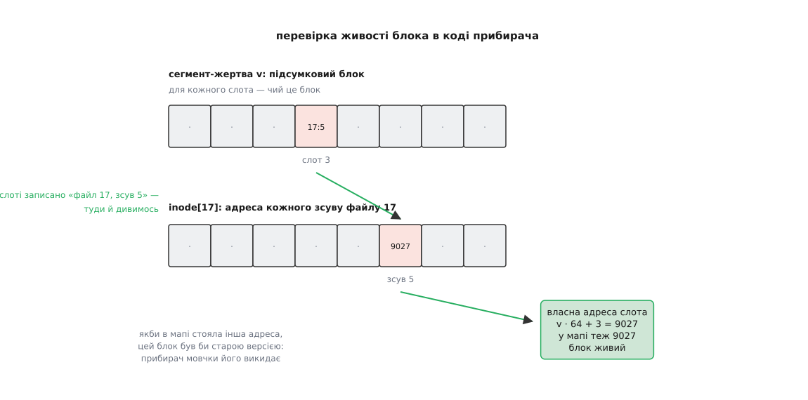

# ⚙️ Робочий прибирач сегментів на C та C++

Формула вартості прибирання каже, що вся ціна лог-структурованого тому сидить в одній величині — у заповненості тих сегментів, які прибирач вибрав собі в жертви. Але формула мовчить про головне: якої заповненості жертв досягне конкретна політика вибору на конкретному навантаженні. Це не виводиться на папері — це міряється. Нижче — імітований том із прибирачем, що вміщується у двісті рядків C та C++ і друкує потрібні числа для двох політик і п'яти рівнів заповненості тому.

## Що саме імітуємо

Том — масив сегментів однакового розміру. Сегмент — масив слотів під блоки плюс **підсумковий блок**: для кожного слота записано, чий це блок, тобто номер файлу й зсув усередині файлу. Мапа блоків файлу — масив адрес: для кожного зсуву сказано, де зараз лежить актуальна версія цього блока. Дописувач кладе блок у поточну голову лога й повертає адресу, куди поклав.

Одне спрощення варто назвати вголос, бо воно єдине. У справжній системі шлях від номера файлу до адреси блока має три ланки: мапа inode дає адресу inode, inode дає карту блоків, карта дає адресу. Тут мапа inode й самі inode злиті в один двовимірний масив у пам'яті, бо в імітації метадані нікуди не мандрують і їхнього перезапису ми не рахуємо. Це занижує посилення запису на кілька відсотків — і не змінює нічого в тому, заради чого програма пишеться: перевірка живості робить ту саму операцію («візьми номер і зсув, спитай у карти адресу, порівняй»), а політики вибору жертви бачать рівно ті самі сегменти.

Лічильник живих блоків у сегменті — це кеш, а не істина. Істина лежить у підсумковому блоці разом із даними й переживає збій; лічильник (у справжніх системах — таблиця стану сегментів) просто позбавляє прибирача потреби перераховувати сегмент, щоб оцінити його. Тому лічильник вільно зменшується при перезаписі, а підсумковий блок ніколи не змінюється після запису.

:::tabs
```c
/* cleaner.c — імітований лог-структурований том і його прибирач на C.
 * Збірка: cc -O2 -o cleaner cleaner.c
 */
#include <stdio.h>
#include <stdint.h>

#define SEG_BLOCKS   64      /* слотів у сегменті                       */
#define NSEGS       512      /* сегментів на томі                       */
#define FILE_BLOCKS  64      /* блоків у файлі                          */
#define WARMUP   100000L     /* перезаписів на розігрів                 */
#define MEASURE  200000L     /* перезаписів під вимірюванням            */

#ifndef LOW_FREE
#define LOW_FREE      8      /* нижче — вмикаємо прибирача              */
#endif
#ifndef RESERVE
#define RESERVE       4      /* сегменти, які бере лише прибирач        */
#endif

enum { GREEDY, COSTBEN };

typedef struct { int32_t ino, off; } Sum;     /* рядок підсумкового блока */

typedef struct {
    Sum      sum[SEG_BLOCKS];   /* чий кожен слот: файл і зсув у ньому   */
    int32_t  written;           /* скільки слотів уже зайнято            */
    int32_t  live;              /* кеш живих: таблиця стану сегментів    */
    uint64_t sealed;            /* час останнього запису в цей сегмент   */
    int32_t  is_free;
} Segment;

static Segment  seg[NSEGS];
static int32_t  inode[NSEGS][FILE_BLOCKS];    /* файл × зсув → адреса    */
static int32_t  nfiles, nhot, free_segs;
static int32_t  head[2];            /* 0 — голова програми, 1 — прибирача */
static uint64_t now_;               /* лічильник записаних блоків = час   */
static int      policy, sep_head;

static long long user_writes, clean_writes, clean_reads, victims, stalls;
static double    u_sum;
```

```cpp
// cleaner.cpp — імітований лог-структурований том на C++20.
// Збірка: g++ -std=c++20 -O2 -o cleaner cleaner.cpp
#include <iostream>
#include <vector>
#include <array>
#include <cstdint>
#include <iomanip>
#include <algorithm>

constexpr std::size_t SEG_BLOCKS  = 64;   // слотів у сегменті
constexpr std::size_t NSEGS       = 512;  // сегментів на томі
constexpr std::size_t FILE_BLOCKS = 64;   // блоків у файлі
constexpr std::int64_t WARMUP     = 100000L;
constexpr std::size_t MEASURE    = 200000L;

constexpr std::int32_t LOW_FREE   = 8;    // поріг увімкнення прибирача
constexpr std::int32_t RESERVE    = 4;    // резерв лише для прибирача

enum class Policy { Greedy, CostBenefit };

struct SummaryEntry {
    std::int32_t ino{-1};
    std::int32_t off{-1};
};

struct Segment {
    std::array<SummaryEntry, SEG_BLOCKS> sum{};
    std::int32_t written{0};
    std::int32_t live{0};
    std::uint64_t sealed{0};
    bool is_free{true};
};

struct LogVolumeState {
    std::array<Segment, NSEGS> seg{};
    std::vector<std::array<std::int32_t, FILE_BLOCKS>> inode{};
    std::int32_t nfiles{0};
    std::int32_t nhot{0};
    std::int32_t free_segs{static_cast<std::int32_t>(NSEGS)};
    std::array<std::int32_t, 2> head{-1, -1};
    std::uint64_t now_{0};
    Policy policy{Policy::Greedy};
    bool sep_head{true};

    std::int64_t user_writes{0};
    std::int64_t clean_writes{0};
    std::int64_t clean_reads{0};
    std::int64_t victims{0};
    std::int64_t stalls{0};
    double u_sum{0.0};
};

static LogVolumeState state;
```
:::

## Дописувач у голову

Дописувач — найпростіша частина, і саме в ній ховаються два рішення, які потім вирішать долю вимірювання.

Перше: **дві голови, а не одна**. Голова `0` приймає записи програми, голова `1` — живі блоки, які переписує прибирач. Розділення виглядає дрібницею, а важить більше за вибір політики — це буде видно на числах.

Друге: **резерв**. Сегменти, яких лишилося менше за `RESERVE`, програмі не віддаються ні за яких умов — вони тільки для прибирача. Це той самий запас, що його реальні системи тримають під назвою [надлишкова місткість](root:sf-algorithms/over-provisioning): частина носія, яку ніколи не віддають під дані, щоб прибирачеві завжди було куди покласти те, що він урятував.

:::tabs
```c
static int32_t alloc_segment(int cleaner)
{
    int32_t s, i;
    if (!cleaner && free_segs <= RESERVE) return -1;   /* резерв прибирача */
    for (s = 0; s < NSEGS; s++) {
        if (!seg[s].is_free) continue;
        seg[s].is_free = 0;
        seg[s].written = 0;
        seg[s].live    = 0;
        for (i = 0; i < SEG_BLOCKS; i++) seg[s].sum[i].ino = -1;
        free_segs--;
        return s;
    }
    return -1;
}

static int32_t log_append(int32_t ino, int32_t off, int cleaner)
{
    int32_t s = head[cleaner], slot;
    if (s < 0 || seg[s].written == SEG_BLOCKS) {   /* голова заповнилась */
        s = alloc_segment(cleaner);
        if (s < 0) return -1;                      /* класти нікуди      */
        head[cleaner] = s;
    }
    slot = seg[s].written++;
    seg[s].sum[slot].ino = ino;                    /* підсумковий блок   */
    seg[s].sum[slot].off = off;
    seg[s].live++;
    seg[s].sealed = ++now_;
    return s * SEG_BLOCKS + slot;
}

static int file_write(int32_t ino, int32_t off)
{
    int32_t old = inode[ino][off];
    int32_t na  = log_append(ino, off, 0);
    if (na < 0) { stalls++; return 0; }
    inode[ino][off] = na;
    if (old >= 0) seg[old / SEG_BLOCKS].live--;    /* стара версія вмерла */
    user_writes++;
    return 1;
}
```

```cpp
static std::int32_t alloc_segment(bool is_cleaner) {
    if (!is_cleaner && state.free_segs <= RESERVE) return -1;
    for (std::size_t s = 0; s < NSEGS; ++s) {
        if (!state.seg[s].is_free) continue;
        state.seg[s].is_free = false;
        state.seg[s].written = 0;
        state.seg[s].live    = 0;
        for (auto& entry : state.seg[s].sum) entry.ino = -1;
        state.free_segs--;
        return static_cast<std::int32_t>(s);
    }
    return -1;
}

static std::int32_t log_append(std::int32_t ino, std::int32_t off, bool is_cleaner) {
    std::size_t h_idx = is_cleaner ? 1 : 0;
    std::int32_t s = state.head[h_idx];
    if (s < 0 || state.seg[s].written == static_cast<std::int32_t>(SEG_BLOCKS)) {
        s = alloc_segment(is_cleaner);
        if (s < 0) return -1;
        state.head[h_idx] = s;
    }
    std::int32_t slot = state.seg[s].written++;
    state.seg[s].sum[slot] = SummaryEntry{ino, off};
    state.seg[s].live++;
    state.seg[s].sealed = ++state.now_;
    return s * static_cast<std::int32_t>(SEG_BLOCKS) + slot;
}

static bool file_write(std::int32_t ino, std::int32_t off) {
    std::int32_t old_addr = state.inode[ino][off];
    std::int32_t new_addr = log_append(ino, off, false);
    if (new_addr < 0) {
        state.stalls++;
        return false;
    }
    state.inode[ino][off] = new_addr;
    if (old_addr >= 0) {
        state.seg[old_addr / SEG_BLOCKS].live--;
    }
    state.user_writes++;
    return true;
}
```
:::

Адреса блока тут — просто `сегмент · SEG_BLOCKS + слот`, тож із адреси однаково легко дістати і сегмент, і зсув у ньому. Поле `sealed` запам'ятовує «час» останнього запису в сегмент, а роль часу тут грає лічильник записаних блоків. Це й буде вік сегмента для другої політики.

## Живий чи мертвий

Тепер шість найважливіших рядків усієї програми. Бітової карти зайнятості в лозі немає й бути не може — її довелося б переписувати на місці. Замість неї працює зовсім інше правило: **блок живий рівно тоді, коли хтось згори на нього посилається**.

:::tabs
```c
static int block_is_live(int32_t s, int32_t slot)
{
    int32_t ino = seg[s].sum[slot].ino;
    if (ino < 0) return 0;                        /* слот не заповнювався */
    return inode[ino][seg[s].sum[slot].off] == s * SEG_BLOCKS + slot;
}
```

```cpp
static bool block_is_live(std::int32_t s, std::int32_t slot) {
    std::int32_t ino = state.seg[s].sum[slot].ino;
    if (ino < 0) return false;
    std::int32_t current_addr = state.inode[ino][state.seg[s].sum[slot].off];
    return current_addr == (s * static_cast<std::int32_t>(SEG_BLOCKS) + slot);
}
```
:::

Підсумковий блок каже, чий це блок; карта блоків того файлу каже, де зараз лежить актуальна версія; якщо вона лежить не тут — ми дивимося на перекриту стару копію. Ніякого окремого обліку, ніяких лічильників посилань, нічого, що треба тримати узгодженим із даними: відповідь щоразу обчислюється наново з двох структур, кожна з яких потрібна й без прибирача.



*Живість не зберігається ніде — вона щоразу виводиться з підсумкового блока й карти блоків файлу.*

## Дві політики й саме прибирання

Вибір жертви — єдине місце, де політики різняться. Жадібна бере найпорожніший сегмент. Політика вигоди на одиницю витрат зважує ту саму порожнечу на вік: сегмент, у який давно не писали, устоявся, і звільнене в ньому місце протримається довше, тож те саме прибирання окупиться краще.

:::tabs
```c
static int32_t pick_victim(void)
{
    int32_t s, best = -1;
    double  best_score = -1.0;
    for (s = 0; s < NSEGS; s++) {
        double u, score;
        if (seg[s].is_free) continue;
        if (s == head[0] || s == head[1]) continue;   /* відкриті голови */
        if (seg[s].written == 0) continue;
        u = (double)seg[s].live / (double)SEG_BLOCKS;
        if (policy == GREEDY) {
            score = 1.0 - u;                           /* найпорожніший  */
        } else {
            double age = (double)(now_ - seg[s].sealed);
            score = (1.0 - u) * age / (1.0 + u);       /* вигода/витрати */
        }
        if (score > best_score) { best_score = score; best = s; }
    }
    return best;
}

static int clean_one(void)
{
    int32_t v = pick_victim(), slot;
    if (v < 0) return 0;
    u_sum += (double)seg[v].live / (double)SEG_BLOCKS;   /* статистика   */
    victims++;
    clean_reads += seg[v].written;

    for (slot = 0; slot < seg[v].written; slot++) {
        int32_t ino, off, na;
        if (!block_is_live(v, slot)) continue;          /* перекритий    */
        ino = seg[v].sum[slot].ino;
        off = seg[v].sum[slot].off;
        na  = log_append(ino, off, sep_head);
        if (na < 0) return 0;                           /* немає куди    */
        inode[ino][off] = na;             /* карта показує на нову копію */
        clean_writes++;
    }
    seg[v].is_free = 1;                   /* аж тепер сегмент вільний    */
    seg[v].live    = 0;
    seg[v].written = 0;
    free_segs++;
    return 1;
}

static void ensure_free(void)
{
    while (free_segs < LOW_FREE)
        if (!clean_one()) break;
}
```

```cpp
static std::int32_t pick_victim() {
    std::int32_t best_seg = -1;
    double best_score = -1.0;
    for (std::size_t s = 0; s < NSEGS; ++s) {
        if (state.seg[s].is_free) continue;
        if (static_cast<std::int32_t>(s) == state.head[0] ||
            static_cast<std::int32_t>(s) == state.head[1]) continue;
        if (state.seg[s].written == 0) continue;

        double u = static_cast<double>(state.seg[s].live) / static_cast<double>(SEG_BLOCKS);
        double score = 0.0;
        if (state.policy == Policy::Greedy) {
            score = 1.0 - u;
        } else {
            double age = static_cast<double>(state.now_ - state.seg[s].sealed);
            score = (1.0 - u) * age / (1.0 + u);
        }
        if (score > best_score) {
            best_score = score;
            best_seg = static_cast<std::int32_t>(s);
        }
    }
    return best_seg;
}

static bool clean_one() {
    std::int32_t v = pick_victim();
    if (v < 0) return false;

    state.u_sum += static_cast<double>(state.seg[v].live) / static_cast<double>(SEG_BLOCKS);
    state.victims++;
    state.clean_reads += state.seg[v].written;

    for (std::int32_t slot = 0; slot < state.seg[v].written; ++slot) {
        if (!block_is_live(v, slot)) continue;
        std::int32_t ino = state.seg[v].sum[slot].ino;
        std::int32_t off = state.seg[v].sum[slot].off;
        std::int32_t na  = log_append(ino, off, state.sep_head);
        if (na < 0) return false;
        state.inode[ino][off] = na;
        state.clean_writes++;
    }
    state.seg[v].is_free = true;
    state.seg[v].live    = 0;
    state.seg[v].written = 0;
    state.free_segs++;
    return true;
}

static void ensure_free() {
    while (state.free_segs < LOW_FREE) {
        if (!clean_one()) break;
    }
}
```
:::

Зверніть увагу на порядок у циклі: спершу перевірка живості, потім запис копії, і **аж потім** оновлення карти. Переставити останні два кроки не можна — карта мусить показувати на нову копію лише після того, як копія існує. І сегмент-жертва оголошується вільним не на початку, а в кінці: поки прибирач із нього читає, `alloc_segment` не має права видати цей самий сегмент під запис.

## Навантаження та запуск

Прибирача не можна оцінити на рівномірному навантаженні: там усі сегменти старіють однаково, і всі політики вироджуються в одну. Сенс з'являється там, де дані діляться на гарячі й холодні. Тут десята частина файлів отримує дев'ять записів із десяти — та сама форма «гаряче й холодне», на якій прибирачів перевіряють від часів першої лог-структурованої системи.

:::tabs
```c
static uint32_t rng;
static uint32_t rnd(void)                     /* xorshift32, щоб прогін   */
{                                             /* відтворювався точно      */
    uint32_t x = rng;
    x ^= x << 13; x ^= x >> 17; x ^= x << 5;
    return rng = x;
}

static void step(void)
{
    int32_t ino, off;
    ensure_free();
    if (rnd() % 100 < 90) ino = (int32_t)(rnd() % (uint32_t)nhot);
    else ino = nhot + (int32_t)(rnd() % (uint32_t)(nfiles - nhot));
    off = (int32_t)(rnd() % FILE_BLOCKS);
    file_write(ino, off);
}

static void run(int pol, int sep, double rho)
{
    int32_t s, ino, off;
    long    k;

    policy = pol; sep_head = sep;
    nfiles = (int32_t)(rho * NSEGS);          /* файл завбільшки з сегмент */
    nhot   = nfiles / 10; if (nhot < 1) nhot = 1;
    for (s = 0; s < NSEGS; s++) {
        seg[s].is_free = 1; seg[s].written = 0;
        seg[s].live = 0;    seg[s].sealed  = 0;
    }
    for (ino = 0; ino < nfiles; ino++)
        for (off = 0; off < FILE_BLOCKS; off++) inode[ino][off] = -1;
    free_segs = NSEGS; head[0] = head[1] = -1; now_ = 0; rng = 2463534242u;

    /* 1. заповнення: файли ростуть упереміш, а не один за одним */
    for (off = 0; off < FILE_BLOCKS; off++)
        for (ino = 0; ino < nfiles; ino++) { ensure_free(); file_write(ino, off); }

    /* 2. розігрів: вибиваємо початкову розкладку, доходимо до сталого режиму */
    for (k = 0; k < WARMUP; k++) step();

    /* 3. вимірювання зі свіжими лічильниками */
    user_writes = clean_writes = clean_reads = victims = stalls = 0;
    u_sum = 0.0;
    for (k = 0; k < MEASURE; k++) step();
}

int main(void)
{
    static const double rhos[] = { 0.50, 0.70, 0.80, 0.90, 0.95 };
    static const struct { int pol, sep; const char *name; } var[] = {
        { GREEDY,  1, "greedy"         },
        { COSTBEN, 1, "cost-benefit"   },
        { COSTBEN, 0, "cost-ben 1head" }
    };
    int r, v;

    printf("  rho  policy           u_vict  WA_write  WA_total  2/(1-u)  stall\n");
    for (r = 0; r < 5; r++)
        for (v = 0; v < 3; v++) {
            double ub, wa_w, wa_t;
            run(var[v].pol, var[v].sep, rhos[r]);
            if (user_writes == 0) {
                printf(" %.2f  %-15s   том став: прибирачеві нема куди писати\n",
                       rhos[r], var[v].name);
                continue;
            }
            ub   = victims ? u_sum / (double)victims : 0.0;
            wa_w = (double)(user_writes + clean_writes) / (double)user_writes;
            wa_t = (double)(user_writes + clean_writes + clean_reads)
                   / (double)user_writes;
            printf(" %.2f  %-15s  %6.3f  %8.2f  %8.2f  %7.2f  %5lld\n",
                   rhos[r], var[v].name, ub, wa_w, wa_t,
                   2.0 / (1.0 - ub), stalls);
        }
    return 0;
}
```

```cpp
static std::uint32_t rng_state = 2463534242u;
static std::uint32_t rnd() {
    std::uint32_t x = rng_state;
    x ^= x << 13; x ^= x >> 17; x ^= x << 5;
    return rng_state = x;
}

static void step() {
    ensure_free();
    std::int32_t ino = 0;
    if (rnd() % 100 < 90) {
        ino = static_cast<std::int32_t>(rnd() % static_cast<std::uint32_t>(state.nhot));
    } else {
        ino = state.nhot + static_cast<std::int32_t>(rnd() % static_cast<std::uint32_t>(state.nfiles - state.nhot));
    }
    std::int32_t off = static_cast<std::int32_t>(rnd() % FILE_BLOCKS);
    file_write(ino, off);
}

static void run_simulation(Policy pol, bool sep, double rho) {
    state.policy = pol;
    state.sep_head = sep;
    state.nfiles = static_cast<std::int32_t>(rho * NSEGS);
    state.nhot = std::max(1, state.nfiles / 10);
    state.free_segs = static_cast<std::int32_t>(NSEGS);
    state.head = {-1, -1};
    state.now_ = 0;
    rng_state = 2463534242u;

    for (auto& s : state.seg) {
        s.is_free = true;
        s.written = 0;
        s.live = 0;
        s.sealed = 0;
    }
    state.inode.assign(state.nfiles, std::array<std::int32_t, FILE_BLOCKS>{});
    for (auto& fn : state.inode) fn.fill(-1);

    for (std::size_t off = 0; off < FILE_BLOCKS; ++off) {
        for (std::int32_t ino = 0; ino < state.nfiles; ++ino) {
            ensure_free();
            file_write(ino, static_cast<std::int32_t>(off));
        }
    }

    for (std::int64_t k = 0; k < WARMUP; ++k) step();

    state.user_writes = state.clean_writes = state.clean_reads = 0;
    state.victims = state.stalls = 0;
    state.u_sum = 0.0;

    for (std::size_t k = 0; k < MEASURE; ++k) step();
}

int main() {
    constexpr double rhos[] = { 0.50, 0.70, 0.80, 0.90, 0.95 };
    struct Variant { Policy pol; bool sep; const char* name; };
    constexpr Variant vars[] = {
        { Policy::Greedy,      true,  "greedy" },
        { Policy::CostBenefit, true,  "cost-benefit" },
        { Policy::CostBenefit, false, "cost-ben 1head" }
    };

    std::cout << "  rho  policy           u_vict  WA_write  WA_total  2/(1-u)  stall\n";
    for (double rho : rhos) {
        for (const auto& v : vars) {
            run_simulation(v.pol, v.sep, rho);
            if (state.user_writes == 0) {
                std::cout << " " << std::fixed << std::setprecision(2) << rho 
                          << "  " << std::left << std::setw(15) << v.name 
                          << "   том став: прибирачеві нема куди писати\n";
                continue;
            }
            double ub = state.victims ? state.u_sum / static_cast<double>(state.victims) : 0.0;
            double wa_w = static_cast<double>(state.user_writes + state.clean_writes) / static_cast<double>(state.user_writes);
            double wa_t = static_cast<double>(state.user_writes + state.clean_writes + state.clean_reads) / static_cast<double>(state.user_writes);
            
            std::cout << " " << std::fixed << std::setprecision(2) << rho 
                      << "  " << std::left << std::setw(15) << v.name 
                      << "  " << std::setw(6) << std::setprecision(3) << ub 
                      << "  " << std::setw(8) << std::setprecision(2) << wa_w 
                      << "  " << std::setw(8) << std::setprecision(2) << wa_t 
                      << "  " << std::setw(7) << std::setprecision(2) << (2.0 / (1.0 - ub)) 
                      << "  " << std::setw(5) << state.stalls << '\n';
        }
    }
    return 0;
}
```
:::

Заповнення навмисно йде по зсувах, а не по файлах: якби файли створювалися один за одним, кожен ліг би точно у свій сегмент, гаряче й холодне відразу опинилися б розділені, і прибирач дістав би ідеальну розкладку задарма. Реальний том так не виглядає — файли ростуть упереміш, і розділяти гаряче з холодним доводиться саме прибирачеві. Розігрів потрібен із тієї самої причини: перші тисячі перезаписів іще живуть на початковій розкладці, і рахувати їх — означало б міряти не сталий режим, а перехідний.

## Що воно друкує

```
  rho  policy           u_vict  WA_write  WA_total  2/(1-u)  stall
 0.50  greedy            0.333      1.50      3.00     3.00      0
 0.50  cost-benefit      0.203      1.26      2.51     2.51      0
 0.50  cost-ben 1head    0.422      1.73      3.46     3.46      0
 0.70  greedy            0.560      2.27      4.55     4.55      0
 0.70  cost-benefit      0.319      1.47      2.94     2.94      0
 0.70  cost-ben 1head    0.617      2.61      5.22     5.22      0
 0.80  greedy            0.687      3.19      6.39     6.39      0
 0.80  cost-benefit      0.498      1.99      3.98     3.98      0
 0.80  cost-ben 1head    0.723      3.61      7.22     7.22      0
 0.90  greedy            0.834      6.02     12.05    12.05      0
 0.90  cost-benefit      0.724      3.63      7.26     7.26      0
 0.90  cost-ben 1head    0.846      6.51     13.02    13.02      0
 0.95  greedy            0.919     12.30     24.60    24.60      0
 0.95  cost-benefit      0.874      7.95     15.89    15.89      0
 0.95  cost-ben 1head    0.924     13.13     26.27    26.27      0
```

`u_vict` — середня заповненість вибраних жертв; `WA_write` — у скільки разів більше блоків насправді записано, ніж просила програма (це і є [посилення запису](root:sf-data/write-amplification) — відношення роботи носія до роботи, яку йому замовили); `WA_total` рахує ще й прочитане при прибиранні.

Перше, що впадає в око: **стовпчики `WA_total` і `2/(1−u)` збігаються до сотих у кожному рядку**, хоч рахувалися незалежно — один із лічильників записів і читань, удруге за формулою від виміряної заповненості жертв. Це не збіг і не підганяння, а тотожність, яку легко довести:

```
на один прибраний сегмент із заповненістю u:
  прочитано       = 64
  переписано      = 64·u        (живі блоки жертви)
  звільнено       = 64·(1 − u)

у сталому режимі програма записує рівно стільки, скільки звільнено:
  корисних записів = Σ 64·(1 − uᵢ) = 64·V·(1 − ū)
  усієї роботи     = Σ (64 + 64·uᵢ + 64·(1 − uᵢ)) = 128·V

  WA_total = 128·V ÷ (64·V·(1 − ū)) = 2 ÷ (1 − ū)
  WA_write =  64·V ÷ (64·V·(1 − ū)) = 1 ÷ (1 − ū)
```

Звідси головний висновок про політики взагалі: **єдине, на що політика впливає, — це середня заповненість жертв**. Усе інше в арифметиці вже зафіксовано. Тож питання «яка політика краща» повністю зводиться до «яка вміє знаходити порожніші сегменти», і програма перетворюється на прилад для вимірювання однієї величини `ū`.

Друге: вигода на одиницю витрат виграє скрізь, і виграє рівно так, як обіцяно теорією, — не швидшим кодом, а нижчою заповненістю жертв. При 70 % заповненості тому вона знаходить жертви із заповненістю 0.32 там, де жадібна бере 0.56, і носій робить у півтора раза менше роботи. Причина в тому, що жадібність не має пам'яті про майбутнє: сегмент із трьома живими холодними блоками вона прибере просто тому, що він зараз найпорожніший, — а холодні блоки нікуди не подінуться, і за десять хвилин той самий сегмент знову проситиметься в жертви. Вік у формулі — це груба, але дієва здогадка про те, чи впаде заповненість сегмента сама, якщо трохи почекати.

Третє й найтверезіше: при 95 % заповненості обидві політики погані. Вигода на одиницю витрат перетворює 24-кратну роботу носія на 16-кратну — це не порятунок, а відтермінування. Вільне місце на лог-структурованому томі не зручність, а ресурс, який прибирач витрачає замість роботи носія; коли ресурс скінчився, ніяка кмітливість вибору його не замінить.

## Одна голова замість двох з'їдає всю перевагу

Найцікавіший рядок у таблиці — третій у кожній групі. Це та сама політика вигоди на одиницю витрат, у якої відібрали власну голову: прибирач пише врятовані блоки в ту саму голову, куди пише програма. Результат при 80 % заповненості: 7.22 замість 3.98 — гірше, ніж у простої жадібної політики з двома головами (6.39). Окремим прогоном жадібна політика з однією головою дає 7.31 — тобто **обидві політики сходяться в одну точку**, і вибір між ними перестає щось означати.

Механізм прозорий, щойно його побачити. Прибирач рятує переважно холодні блоки — саме вони й лишаються живими в старих сегментах. Дописуючи їх у спільну голову, він змішує холодне з гарячим у кожному новому сегменті. Незабаром гаряча половина такого сегмента перекриється, холодна лишиться — і сегмент застрягне на заповненості близько половини: замало, щоб його не чіпати, забагато, щоб прибрати дешево. Прибирач сам, власними руками, виробляє собі дорогих жертв.

> 🔧 **Навіщо це.** Це рівно та причина, з якої F2FS має окремі відкриті сегменти під різні типи даних, а не одну голову на все, і чому вона розводить «гарячі» та «холодні» потоки записів. Розділення потоків дає більше, ніж будь-яка кмітливість у виборі жертви, — і коштує один додатковий відкритий сегмент.

## Пастки

**Живість треба перевіряти в останню мить.** У наведеному коді прибирач працює сам, тому перевірка й копіювання неподільні. У справжній системі програма пише паралельно, і між «блок живий» та «копія записана» той блок може вмерти. Якщо після цього наосліп записати в карту адресу своєї копії, ви затрете посилання на **новішу** версію — тиха втрата даних, найгірший вид помилки в цьому коді. Правильний порядок — друга перевірка перед оновленням карти:

:::tabs
```c
if (inode[ino][off] != addr) continue;   /* мертвий — навіть не читаємо */
na = log_append(ino, off, 1);
if (inode[ino][off] != addr) {           /* поки писали — перезаписали  */
    seg[na / SEG_BLOCKS].live--;         /* копія народилася мертвою    */
    continue;                            /* карту НЕ чіпати             */
}
inode[ino][off] = na;
```

```cpp
if (state.inode[ino][off] != addr) continue;
std::int32_t na = log_append(ino, off, true);
if (state.inode[ino][off] != addr) {
    state.seg[na / SEG_BLOCKS].live--;
    continue;
}
state.inode[ino][off] = na;
```
:::

Порівняння й запис у карту мусять бути неподільні щодо записів програми — під тим самим замком, під яким виконується `file_write`. Копію, що народилася мертвою, викидати не треба: вона просто лежить у новому сегменті як мертвий блок, і наступне прибирання її прибере.

**Відкриті голови не можна брати в жертви.** Приберіть із `pick_victim` рядок `if (s == head[0] || s == head[1]) continue;` — і рано чи пізно прибирач вибере власну голову. Якщо це його власна голова, він копіює живий блок жертви в неї ж, `written` росте, межа циклу росте разом із ним, і прибирач ганяється за власним хвостом, доки не заб'є сегмент по вінця, — марна робота, яка не звільняє нічого. Якщо це голова програми — гірше: сегмент піде у вільні, а `head[0]` і далі показуватиме на нього, тож наступні записи програми ляжуть у сегмент, який `alloc_segment` уже має право видати іншій голові, і дві голови почнуть затирати одна одну на тих самих слотах. Тому позначати сегмент вільним слід тільки після того, як його дочитано, і тільки якщо в нього ніхто не пише.

**Поріг вмикання прибирача мусить бути вищим за резерв.** Це найпідступніша з пасток, бо виглядає як питання смаку. Резерв `RESERVE` не пускає програму до останніх сегментів; поріг `LOW_FREE` каже, коли будити прибирача. Якщо прибирач прокидається не раніше, ніж програму вже спинили, — вільних сегментів не лишилося взагалі, і йому теж нема куди класти врятоване. Том замерзає назавжди. Перезбирання з іншими порогами (`cc -DLOW_FREE=1 -DRESERVE=0 …`, короткі прогони по 20 000 перезаписів) дає це в чистому вигляді:

```
LOW_FREE=1  RESERVE=0   том став: 0 записів із 20000 — і при 50 %, і при 90 %
LOW_FREE=1  RESERVE=1   том став: 0 записів із 20000
LOW_FREE=2  RESERVE=1   жодної зупинки
LOW_FREE=8  RESERVE=0   жодної зупинки
```

Замерзає не переповнений том, а **половинно заповнений** — умова взагалі не про кількість даних, а про співвідношення двох порогів: прибирач мусить прокидатися, поки вільний лишається щонайменше один сегмент, у який він покладе врятоване. Класичне «прибирачеві потрібне вільне місце, щоб зробити вільне місце» тут видно на числах.

**Ціна вибору жертви.** `pick_victim` — лінійний прохід по всіх сегментах, і викликається він на кожну жертву, тобто на кожні кілька десятків записів програми. У цій імітації 512 сегментів, і прохід губиться серед іншого. На томі в терабайт із сегментами по 2 МіБ сегментів уже пів мільйона, а прохід стоїть на шляху запису — тому справжні реалізації повного перебору не роблять: тримають таблицю стану сегментів у вигляді, з якого кандидати дістаються без огляду всього тому, і шукають не найкращу жертву, а достатньо добру.

**Ціна самої імітації.** Уся модель — 512 сегментів по 64 слоти й 512 карт по 64 адреси, разом близько 400 КіБ статичних даних, які цілком уміщуються в кеш процесора; уся робота — цілочислові дії над масивами. Це та рідкісна задача, де можна вимкнути здогади й просто прокрутити варіанти: змініть частку гарячих файлів, розмір сегмента, поріг вмикання прибирача — і подивіться, куди зсунеться `u_vict`. Усе інше в таблиці порахується з нього саме.
