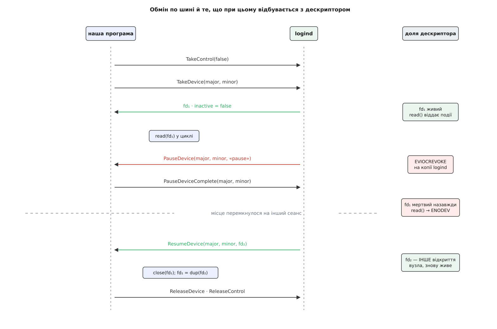

# ⚙️ Взяти клавіатуру з рук logind: програма, що переживає перемикання місця

Напишімо на C сотню рядків, які роблять те саме, з чого починає роботу будь-який сучасний компонувальник: стають розпорядником свого сеансу, дістають клавіатуру готовим дескриптором по шині, читають натиски — і не ламаються, коли людина перемкнулася на інше місце й повернулася назад. Дорогою стане видно річ, яку інакше доводиться приймати на віру: **дескриптор тут не власність, а позичка**, і мить її відкликання можна побачити на власні очі в помилці `read()`.

## Що робимо

Програма знаходить свій сеанс logind, заявляє себе його розпорядником, просить клавіатуру за [старшим і молодшим номерами](topic:sys-unix/major-minor-numbers) — бо шина оперує самим пристроєм, а не іменем вузла, — читає з отриманого дескриптора події вводу в циклі, на сигнал `PauseDevice` чемно відпускає пристрій, на `ResumeDevice` бере натомість новий дескриптор — і на виході віддає все назад.

Мова тут не обирається: `sd-bus` і `sd-login` — частини `libsystemd`, а вся суть прикладу лежить у файлових дескрипторах і `ioctl`, тобто на рівні системних викликів. Збірка одна:

```bash
cc take-keyboard.c -o take-keyboard $(pkg-config --cflags --libs libsystemd)
```

## Ідея: одне відкриття на двох

Ключ до всього — те, що logind **сам** відкриває вузол пристрою й пересилає нам копію дескриптора [по шині](topic:sys-unix/dbus), а копія їде тим самим способом, яким дескриптори взагалі ходять між процесами: полем допоміжних даних сокета домену Unix, механізмом [`SCM_RIGHTS`](topic:sys-unix/unix-domain-sockets).

Наслідок неочевидний, доки не згадати, що дублювання дескриптора не подвоює відкриття. У нас з logind **різні номери дескрипторів, але один [опис відкритого файлу](topic:sys-unix/open-file-description)** — один об'єкт у ядрі. Тому все, що logind зробить зі своєю копією, миттю стає правдою й для нашої. Він викликає `EVIOCREVOKE` — і мертвим виявляється не «його» дескриптор, а саме відкриття, спільне: наше читання після цього повертає `ENODEV`, і жоден `dup` не рятує.

Звідси й уся форма протоколу. Ми не просимо дозволу й не віддаємо пристрій добровільно — нам **повідомляють**, а забирають незалежно від нашої згоди. Наша частка домовленості маленька, але обов'язкова: вчасно перестати читати й сказати, що ми готові.



*Після відкликання перший дескриптор не «тимчасово недоступний» — він мертвий назавжди; програма отримує на заміну інше відкриття того самого вузла.*

## Цикл читання й два сигнали

Почнімо з того, заради чого все затівалося, — з читання. Події [підсистеми вводу](topic:sys-unix/input-subsystem-event-model) приходять як масив структур `input_event`, і нас цікавить `EV_KEY`: код клавіші та `1`/`0` для натиску й відпускання.

```c
#include <errno.h>
#include <fcntl.h>
#include <linux/input.h>
#include <stdio.h>
#include <stdlib.h>
#include <string.h>
#include <sys/epoll.h>
#include <sys/stat.h>
#include <sys/sysmacros.h>
#include <unistd.h>
#include <systemd/sd-bus.h>
#include <systemd/sd-event.h>
#include <systemd/sd-login.h>

#define LOGIND    "org.freedesktop.login1"
#define MGR_PATH  "/org/freedesktop/login1"
#define MGR_IFACE "org.freedesktop.login1.Manager"
#define SES_IFACE "org.freedesktop.login1.Session"

typedef struct {
    sd_bus          *bus;
    sd_event        *event;
    sd_event_source *io;        /* стеження за пристроєм; NULL, поки пауза */
    char            *path;      /* об'єктний шлях НАШОГО сеансу */
    uint32_t         major, minor;
    int              fd;        /* робочий дескриптор пристрою, -1 — немає */
} Ctx;

static int on_readable(sd_event_source *s, int fd, uint32_t revents, void *userdata) {
    struct input_event ev[32];

    ssize_t n = read(fd, ev, sizeof ev);
    if (n < 0) {
        if (errno == EAGAIN)
            return 0;
        printf("read() → %s\n", strerror(errno));   /* ENODEV після відкликання */
        return 0;
    }
    for (size_t i = 0; i < (size_t) n / sizeof ev[0]; i++)
        if (ev[i].type == EV_KEY)
            printf("клавіша %u %s\n", ev[i].code,
                   ev[i].value ? "натиснуто" : "відпущено");
    return 0;
}

static int arm(Ctx *c) {
    c->io = sd_event_source_unref(c->io);
    return sd_event_add_io(c->event, &c->io, c->fd, EPOLLIN, on_readable, c);
}
```

Тепер обробник паузи. Тут єдине місце всієї програми, де помилка коштує не збою, а **зависання всього місця**, — і тому воно варте окремої уваги. Аргумент `type` каже, у якому саме становищі ми опинилися: `«force»` — logind уже відібрав пристрій і просто ставить нас до відома; `«pause»` — він чекає на нашу відповідь і **не піде далі без неї**; `«gone»` — пристрою більше немає, повернення не буде.

```c
static int on_pause(sd_bus_message *m, void *userdata, sd_bus_error *e) {
    Ctx *c = userdata;
    uint32_t maj, min;
    const char *type;

    int r = sd_bus_message_read(m, "uus", &maj, &min, &type);
    if (r < 0 || maj != c->major || min != c->minor)
        return r < 0 ? r : 0;

    printf("PauseDevice(%s)\n", type);
    c->io = sd_event_source_unref(c->io);        /* більше не чекаємо на цьому fd */

    if (strcmp(type, "gone") == 0) {
        close(c->fd);
        c->fd = -1;
        return sd_event_exit(c->event, 0);
    }

    if (strcmp(type, "pause") == 0) {
        /* БЕЗ цієї відповіді перемикання місця не завершиться ніколи */
        r = sd_bus_call_method(c->bus, LOGIND, c->path, SES_IFACE,
                               "PauseDeviceComplete", NULL, NULL, "uu", maj, min);
        if (r < 0)
            return r;
    }

    unsigned char probe;                          /* показово: дескриптор уже мертвий */
    if (read(c->fd, &probe, 1) < 0)
        printf("  read() після паузи → %s\n", strerror(errno));
    return 0;
}
```

Обробник повернення коротший, але містить пастку, на якій горять усі, хто пише таке вперше. Дескриптор у повідомленні **належить повідомленню**: щойно `sd-bus` його звільнить, номер закриється, і подальші читання дадуть `EBADF`. Забрати дескриптор собі можна лише копією.

```c
static int on_resume(sd_bus_message *m, void *userdata, sd_bus_error *e) {
    Ctx *c = userdata;
    uint32_t maj, min;
    int fd;

    int r = sd_bus_message_read(m, "uuh", &maj, &min, &fd);
    if (r < 0 || maj != c->major || min != c->minor)
        return r < 0 ? r : 0;

    int keep = fcntl(fd, F_DUPFD_CLOEXEC, 3);     /* власна копія, не з повідомлення */
    if (keep < 0)
        return -errno;
    fcntl(keep, F_SETFL, O_NONBLOCK);

    if (c->fd >= 0)
        close(c->fd);                             /* для evdev він уже ні на що не годен */
    c->fd = keep;
    printf("ResumeDevice: новий дескриптор\n");
    return arm(c);
}
```

## Головна функція

Порядок дій тут не декоративний — кожен крок вимагає попереднього, а два з них ще й мусять статися саме в такій черзі.

```c
#define TRY(expr, what) do { int _r = (expr); if (_r < 0) {                 \
        fprintf(stderr, "%s: %s\n", (what), strerror(-_r)); return 1; } } while (0)

int main(int argc, char **argv) {
    Ctx c = { .fd = -1 };
    const char *node = argc > 1 ? argv[1] : "/dev/input/event0";
    sd_bus_message *reply = NULL;
    char *session = NULL;
    const char *path;
    struct stat st;
    int devfd, inactive;

    /* 1. котрий сеанс наш: читається з cgroup процесу, шину не питаємо */
    TRY(sd_pid_get_session(0, &session), "не в сеансі logind");

    TRY(sd_event_default(&c.event), "sd_event_default");
    TRY(sd_bus_open_system(&c.bus), "sd_bus_open_system");   /* ВЛАСНЕ з'єднання */
    TRY(sd_bus_attach_event(c.bus, c.event, 0), "sd_bus_attach_event");

    /* 2. об'єктний шлях сеансу — саме він, а не /session/self */
    TRY(sd_bus_call_method(c.bus, LOGIND, MGR_PATH, MGR_IFACE, "GetSession",
                           NULL, &reply, "s", session), "GetSession");
    TRY(sd_bus_message_read(reply, "o", &path), "read path");
    c.path = strdup(path);
    sd_bus_message_unref(reply);

    /* 3. підписка ДО TakeDevice, інакше перша ж пауза пролетить повз */
    TRY(sd_bus_match_signal(c.bus, NULL, LOGIND, c.path, SES_IFACE,
                            "PauseDevice", on_pause, &c), "match PauseDevice");
    TRY(sd_bus_match_signal(c.bus, NULL, LOGIND, c.path, SES_IFACE,
                            "ResumeDevice", on_resume, &c), "match ResumeDevice");

    /* 4. розпорядник сеансу; force=false — інакше треба бути root */
    TRY(sd_bus_call_method(c.bus, LOGIND, c.path, SES_IFACE, "TakeControl",
                           NULL, NULL, "b", 0), "TakeControl");

    /* 5. номери пристрою беремо з самого вузла */
    if (stat(node, &st) < 0) { perror(node); return 1; }
    c.major = major(st.st_rdev);
    c.minor = minor(st.st_rdev);

    /* 6. пристрій приходить уже відкритим */
    TRY(sd_bus_call_method(c.bus, LOGIND, c.path, SES_IFACE, "TakeDevice",
                           NULL, &reply, "uu", c.major, c.minor), "TakeDevice");
    TRY(sd_bus_message_read(reply, "hb", &devfd, &inactive), "read fd");
    c.fd = fcntl(devfd, F_DUPFD_CLOEXEC, 3);
    sd_bus_message_unref(reply);
    if (c.fd < 0) { perror("dup"); return 1; }
    fcntl(c.fd, F_SETFL, O_NONBLOCK);

    if (inactive)
        printf("сеанс неактивний: дескриптор мертвий, чекаємо на ResumeDevice\n");
    else
        TRY(arm(&c), "sd_event_add_io");

    TRY(sd_event_loop(c.event), "sd_event_loop");

    sd_bus_call_method(c.bus, LOGIND, c.path, SES_IFACE, "ReleaseDevice",
                       NULL, NULL, "uu", c.major, c.minor);
    sd_bus_call_method(c.bus, LOGIND, c.path, SES_IFACE, "ReleaseControl",
                       NULL, NULL, NULL);
    return 0;
}
```

## Що видно на живій машині

Запустіть на текстовій консолі, від свого імені, без `sudo` — правами тут нічого не досягається, потрібен саме сеанс із місцем. Вузол клавіатури зручно взяти за стійким іменем із `/dev/input/by-path/`. Натиснули клавішу — програма надрукувала код. Перемкнулися на іншу консоль і назад — у виводі з'явилося

```
PauseDevice(force)
  read() після паузи → No such device
ResumeDevice: новий дескриптор
```

`No such device` — це `ENODEV` від `read()` на відкликаному відкритті: рівно те, що робить пароль, набраний на чужому місці, недосяжним для нашої програми.

Але зверніть увагу на слово `force`, а не `pause`. Це не дрібниця, і саме тут більшість описів помиляється. На місці з віртуальними консолями перемикання веде **ядро**: logind лише підтверджує його — а перед тим безумовно відбирає всі пристрої й аж потім розсилає сповіщення. Домовлятися нема коли й нема з ким. Тип `«pause»`, з очікуванням нашої відповіді, приходить на іншому шляху — на місці **без** консолей, яке заводять `loginctl attach`: там перемикання виконує сам logind, і виконує в два такти.

## Пастки

**Підписатися після `TakeDevice`.** Проміжок між отриманням дескриптора й появою обробника — реальний: сповіщення, надіслане в цю мить, ніхто не підбере, і програма далі читатиме мертвий дескриптор, не розуміючи чому. Спершу обробники, потім `TakeControl`, потім `TakeDevice`. Порядок двох останніх теж жорсткий: `TakeDevice` без розпорядництва відмовляє з `NotInControl` — і повідомлення про помилку природно списують на пристрій, а не на пропущений крок.

**Підписатися на `/org/freedesktop/login1/session/self`.** Зручний шлях-псевдонім працює для викликів методів, але **сигнали на ньому не надсилаються** — logind випромінює їх лише на справжньому шляху конкретного сеансу. Програма мовчки не отримає жодної паузи. Тому в коді й стоїть `GetSession`.

**Проігнорувати `inactive`.** Другий вихідний аргумент `TakeDevice` — не діагностика, а стан: якщо сеанс на ту мить неактивний, дескриптор приходить **уже мертвим**, і `PauseDevice` для нього не буде надіслано ніколи, бо паузити нема чого. Чекати на сповіщення, якого не буде, — найпідступніший з тутешніх способів зависнути.

**Забути `PauseDeviceComplete`.** Спокуса думати, що logind постоїть і забере силою, — хибна: у нього на цьому шляху немає таймера. Перемикання завершує функція, яку викликає **тільки** підтвердження останнього пристрою; поки хоч один не відповів, нове місце не активується. Одна забудькувата програма підвішує перемикання для всіх, і зовні це має вигляд «система не реагує на перехід».

**Поводитися з відеокартою, як із клавіатурою.** Для [DRM](topic:sys-unix/drm-kms-object-model) logind не відкликає нічого — він знімає з дескриптора звання майстра пристрою, а при поверненні надає його знову тому самому відкриттю. Дескриптор весь час живий, `read()` не помиляється, і всі виділені на ньому буфери переживають паузу; ламаються лише [виклики `ioctl`](topic:sys-unix/ioctl-interface), що вимагають майстра. Значить, для evdev пауза видима в помилці читання, а для DRM — **не видима ніяк**, окрім самого сигналу. Програма, яка визначає паузу «на око», по помилках, для екрана працювати не буде.

**Взяти спільне з'єднання.** Розпорядництво прив'язане до **імені з'єднання** на шині, а не до процесу: зникло ім'я — logind миттю звільняє всі пристрої й повертає консоль. `sd_bus_default_system()` віддає спільне кешоване з'єднання, яке може закрити зовсім інша частина програми чи бібліотека, — і пристрої зникнуть без жодної видимої причини. Тому `sd_bus_open_system()`, своє.

**Списати `ReleaseControl` як зайвий.** Правда, що при виході процесу logind усе прибере сам, — і саме тому виклик легко викинути. Але він потрібен там, де процес не помирає: коли компонувальник передає керування іншому або тимчасово складає повноваження, лишаючись на шині. Без явного звільнення наступний охочий отримає відмову, і причина буде в програмі, яка вже нічим не керує, але формально ще розпоряджається.
