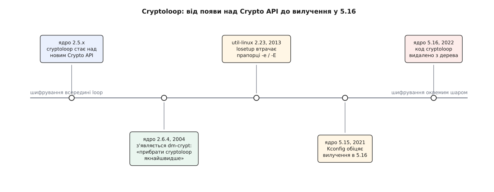

# 📜 Як файл навчився бути диском

Ідея «хай звичайний файл прикидається блоковим пристроєм» не має одного винахідника: вона з'явилася окремо в кожній родині Unix, бо в кожній були ті самі складники — файловий шар, блоковий шар і порожнє місце між ними. Цікаве починається далі: у Linux цьому драйверові одного разу дописали шифрування, і вісімнадцять років ішло на те, щоб визнати помилку й прибрати код.

## Рядок, якому понад тридцять років

Відкрийте `drivers/block/loop.c` у будь-якому сьогоднішньому ядрі — над першим `#include` стоять два рядки, один для машини, другий для людини:

```
// SPDX-License-Identifier: GPL-2.0-only
/*
 * Copyright 1993 by Theodore Ts'o.
 */
```

Теодор Цо (Theodore Ts'o) — американський програміст, багаторічний супровідник ext2/ext3/ext4 та `e2fsprogs` і автор початкової реалізації `/dev/random` у Linux. Рядок про авторське право — документальний слід, а не запис у журналі: він доводить авторство й рік, з якого автор рахує код, і не більше. Але дата промовиста сама по собі. У 1993-му Linux ще не мав ні першої стабільної версії, ні пристойного набору драйверів — а потреба «змонтувати образ, який лежить файлом» уже була, бо саме так збирали дискети й компакт-диски для розповсюдження системи.

## Одну річ назвали чотирма іменами

Приблизно в ті ж роки те саме зробили в BSD. Довідник NetBSD про драйвер `vnd` («vnode disk») каже прямо: він «дає файлові інтерфейс, схожий на дисковий», а сам «первісно написаний в Університеті Юти». Керує ним утиліта `vnconfig`; в OpenBSD є той самий пристрій і та сама назва команди, причому сторінка `vnconfig(8)` OpenBSD датує появу **своєї** реалізації випуском OpenBSD 4.2 — успадкована лінія від `vn` значно старша, просто її переписали. Хто про кого знав — Цо про Юту чи навпаки — документів під рукою немає, і вигадувати першість тут нічого: складники всюди були однакові, тож і винахід виходив однаковий.

FreeBSD пішла іншим шляхом і злила «файл як диск» із «пам'ять як диск» в один пристрій. Довідник `mdconfig(8)` формулює це без дипломатії: утиліта «вперше з'явилася у FreeBSD 5.0 як чистіша заміна зв'язці з модуля ядра `vn` та утиліти `vnconfig`». Той самий `md` уміє чотири різні підкладки — файл (`-t vnode`), пам'ять із `malloc`, свопований буфер і порожнечу, що ковтає записи й повертає нулі. Solaris назвав це `lofi` (loopback file driver) з утилітою `lofiadm`, і туди ж додав стиснення й шифрування образів.

Чотири родини — чотири імені для однієї арифметики: узяти номер сектора, помножити на розмір блока, додати початковий зсув і сходити за цим числом у файл. Розбіжність в іменах — не випадковість і не примха: кожна система називала пристрій за тим, що вважала суттю. Linux — за петлею запиту всередині ядра, BSD — за vnode, тобто за об'єктом файлового шару, FreeBSD — за диском у пам'яті, Solaris — за зворотним заходом у файл.

## Шифрування, вбудоване не туди

У Linux драйвер `loop` мав гачок для «перетворення» даних дорогою між пристроєм і файлом — спершу зовсім іграшковий XOR. Коли в ядрі 2.5.45 з'явився загальний Crypto API, гачок здався готовим місцем для справжнього шифрування: дані й так проходять крізь драйвер, лишалося підставити шифр. Так постав `cryptoloop`, і кілька років він був стандартним способом зашифрувати розділ у Linux.

Проблема була не в шифрі, а в тому, чим його годували. Блоковий шифр у режимі CBC потребує на кожен сектор вектора ініціалізації — числа, що робить шифротекст різним навіть для однакового відкритого тексту. Взяти цей вектор нема звідки, крім номера сектора: секторів мільйони, зберігати для кожного окреме число ніде. `cryptoloop` брав номер сектора просто як він є:

```
cryptoloop:  IV = номер_сектора
ESSIV:       IV = E(SHA(ключ), номер_сектора)
```

Різниця між цими рядками — уся безпека. У верхньому випадку вектор відомий будь-кому, хто дивиться на диск, і відомий наперед. Отже, той самий відкритий текст, записаний у той самий сектор, дає той самий шифротекст — завжди й у всіх. Звідси росте **watermark-атака**: зловмисник готує файл, у якому блоки повторюються за наперед обраним візерунком із певним кроком, і чекає, поки жертва збереже цей файл на зашифрований том. Файлова система кладе файл вирівняно, візерунок лягає на сектори, а рівність шифротекстів зберігає його впізнаваним. Тепер, маючи в руках лише зашифрований образ і жодного ключа, можна довести: цей файл тут є. Для шифрування диска це поразка — воно обіцяло, що про вміст не видно нічого.

Був і другий, тихіший ґандж, і `Kconfig` ядра писав про нього великими літерами до самого кінця: «WARNING: This device is not safe for journaled file systems like ext3 or Reiserfs» — шар перетворення не тримав тих обіцянок про порядок і завершеність записів, на які спирається журнал.

Розв'язок надійшов у березні 2004-го з ядром 2.6.4: Крістоф Заут (Christophe Saout) додав `dm-crypt` — шифрування як окрему ціль [device mapper](root:sys-unix/device-mapper), а не як домішок у драйвері. Супровідний текст патча в журналі змін 2.6.4 не приховує наміру: «The intent here is to remove cryptoloop ASAP» — прибрати `cryptoloop` якнайшвидше, витягти перетворення з драйвера `loop` і перевести людей на нову ціль, лишаючись сумісним із наявними томами на рівні диска. Далі [dm-crypt](root:sys-unix/dm-crypt) обріс режимами, які саме цю діру й закривають: ESSIV, LRW, XTS.

«Якнайшвидше» розтягнулося на вісімнадцять років, і розтягнулося з поважної причини: заміна була сумісною, тобто нікому нічого не ламало, а старий код нікому не заважав — класичний рецепт того, як мертва річ живе в дереві десятиліттями. Спершу відрізали користувацький бік: `util-linux` 2.23 (2013) оголосив, що «cryptoloop support in the commands mount(8) and losetup(8) has been REMOVED», забравши прапорці `-e`/`-E` в `losetup` і опцію `encryption=` у `mount`. Потім, у серпні 2021-го, у драйвер додали гучне попередження при завантаженні, а `Kconfig` 5.15 уже прямо назвав дату страти: «cryptoloop support will be removed in Linux 5.16». У жовтні 2021-го Крістоф Гельвіг (Christoph Hellwig) вилучив і сам файл — комітом «block: remove support for cryptoloop and the xor transfer», який приїхав у 5.16 на початку 2022 року.



*Порядок вимирання типовий: спершу зникає спосіб цим скористатися, потім — код.*

Урок тут архітектурний, а не криптографічний. Робота драйвера `loop` — переклад координат, і вона повна сама по собі. Шифрування — інше перетворення, зі своїми вимогами до векторів, режимів і поводження з ключем. Зшиті в один драйвер, вони змусили криптографію жити за чужими правилами: вектор бере звідти, звідки зручно драйверові, а не звідки треба шифру. Device mapper дозволив кожному перетворенню бути окремим шаром, який складається з іншими — і саме тому виправлення векторів у `dm-crypt` не потребувало жодних змін у тому, хто подає йому байти.

## Гонитва за вільним номером

Друга правка, яку історія внесла в цей драйвер, стосується не даних, а обліку. Довгий час loop-пристрої існували наперед: скільки їх зробило ядро на старті (параметр `max_loop`), стільки й було, а вільний доводилося шукати перебором — з усією гонитвою, яку такий пошук за собою тягне. Помітили її аж тоді, коли скрипти складання образів почали ходити паралельно.

Відповідь прийшла з ядром 3.1 (жовтень 2011): окремий пристрій керування `/dev/loop-control`. Довідник `loop(4)` описує його так: ядро дає застосункові змогу «динамічно знайти вільний пристрій, а також додавати й вилучати loop-пристрої в системі». Запит `LOOP_CTL_GET_FREE` не повертає порад — він виділяє номер усередині ядра, під його ж блокуванням, створивши пристрій за потреби.

Хід загальний і трапляється всюди, де користувацький простір шукає щось у спільному просторі імен перебором: доки пошук і захоплення — два окремі кроки, атомарності не буде хоч би скільки старанно писали цикл. Її мусить дати той, хто цим простором володіє.
