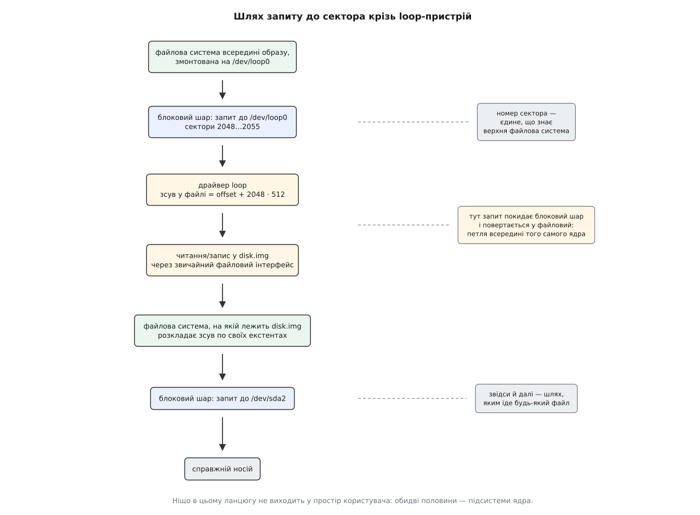
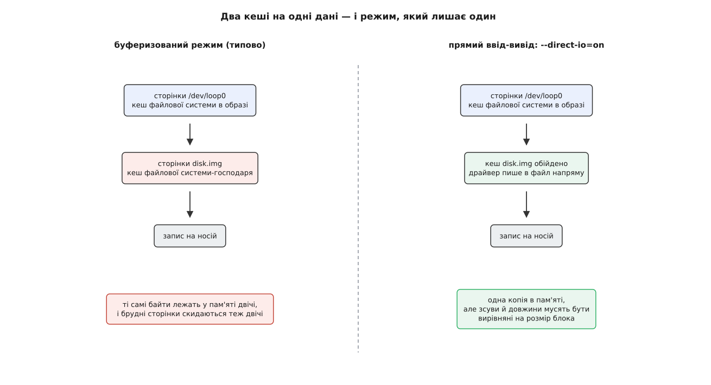
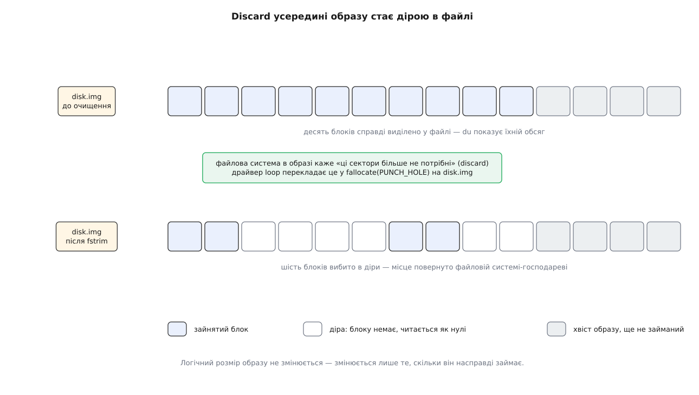

# Loop-пристрій: файл у вигляді блокового пристрою

<preknowlist>
- [Блоковий пристрій: сектори, блоки й черга запитів](root:sys-unix/block-device-model) — пристрій як пронумерований масив секторів сталого розміру, до якого йдуть запити на читання й запис.
- [Файл пристрою: символьний і блоковий](root:sys-unix/device-file-model) — що таке `/dev/…` і як через нього говорять із драйвером.
- [Монтування й дерево монтувань](root:sys-unix/mount-model) — що робить `mount` і чому йому потрібен саме пристрій.
- [Файловий дескриптор](root:sys-unix/file-descriptor) — число, за яким процес тримає відкритий файл.
- [Кеш сторінок, fsync і довговічність запису](root:sys-unix/page-cache-durability) — чому дані з диска й на диск ідуть через сторінки в пам'яті.
</preknowlist>

Ви завантажили образ інсталяційного диска — один файл на кілька гігабайтів. Усередині нього є каталоги й файли, це видно з будь-якого опису формату. Але `mount` бере не файл, а пристрій: дайте йому `/dev/sr0`, і він змонтує диск, дайте той самий файл — і він відмовиться. Причому байти в файлі до єдиного ті самі, що були б на реальному носії; ніхто нічого не переписував і не перекодовував. Заважає не вміст, а форма звертання.

Варто розібрати, у чому саме ця форма полягає — бо звідти видно і розв'язок.

## Що насправді обіцяє блоковий пристрій

Драйвер файлової системи ніколи не торкається заліза. Він оперує номерами: «прочитай мені вісім секторів, починаючи з 2048-го», «запиши оці 4096 байтів у сектор 33 554 432». Він складає такі запити, віддає їх нижче й чекає, поки хтось відзвітує «зроблено». Усе, на що він спирається, — це три обіцянки: носій є пронумерований масив блоків сталого розміру; будь-який блок доступний одразу, без огляду на попередній; запис у блок переживає повернення з виклику настільки, наскільки це гарантує скидання кешів.

У цьому переліку немає жодного слова про магнітні пластини, комірки флеш-пам'яті чи шину SATA. Обіцянка суто числова. А тепер погляньте на звичайний файл: він теж є пронумерованою послідовністю байтів, теж дозволяє читати й писати з довільного місця через `pread`/`pwrite`, теж має розмір і теж переживає `fsync`. Різниця між файлом і носієм зводиться до того, хто до кого звертається і якою одиницею: до пристрою — номером сектора, до файлу — зсувом у байтах.

Отже, бракує тільки перекладача координат. Потрібен драйвер, який зареєструється в системі як блоковий пристрій, прийматиме звичайні запити на сектори — і замість того, щоб смикати контролер, читатиме й писатиме той самий діапазон у наперед указаному файлі. Заліза під ним не буде взагалі. Такий драйвер у Linux зветься `loop`, а пристрої, які він створює, — `/dev/loop0`, `/dev/loop1` і далі; це блокові пристрої зі старшим номером 7 ([старший і молодший номери](root:sys-unix/major-minor-numbers) розрізняють драйвер і конкретний примірник).



*Один запит проходить блоковий шар двічі: спершу до вигаданого пристрою, потім — уже як файловий ввід-вивід — до справжнього носія під образом.*

Ось звідки назва. Запит виходить із блокового шару ядра, повертається до файлового шару того самого ядра й уже звідти спускається до справжнього носія — виходить петля всередині одного ядра. З мережевою петлею (`lo`, 127.0.0.1) це не має нічого спільного, крім слова; збіг неприємний, але усталений.

> 🔧 **Навіщо це.** Образ файлової системи стає повноцінним об'єктом, з яким працюють звичайними інструментами. Зібрати кореневу файлову систему для вбудованого пристрою, перевірити її `fsck`, залити туди файли, зняти копію — усе це робиться на файлі в теці збірки, без жодного справжнього диска й без ризику помилитися літерою в `/dev/sd*`.

Народився цей драйвер у Linux дуже рано — файл `drivers/block/loop.c` донині носить рядок «Copyright 1993 by Theodore Ts'o», і подібні речі незалежно з'явилися в усіх Unix-родинах. Історію самої ідеї, її назв в інших системах і те, чим закінчилася спроба вбудувати в цей драйвер шифрування, розібрано окремо: [як з'явився loop-пристрій](root:sys-unix/loop-device/hist-loop-origins.md).

## Приєднання: пристрій тримає дескриптор, а не шлях

Зв'язок між пристроєм і файлом установлює `losetup`:

```sh
losetup --find --show disk.img      # /dev/loop3 — вільний номер знайдено й зайнято
mount /dev/loop3 /mnt
```

Під цим одним рядком є два різні механізми, і плутати їх не варто.

Перший — пошук вільного номера. Колись його робили перебором: програма відкривала `/dev/loop0`, питала стан, бачила «зайнято», йшла до `/dev/loop1`. Гонитва тут очевидна — два процеси, які шукають одночасно, знаходять той самий вільний номер і намагаються зайняти його обидва. Тому з ядра 3.1 є окремий пристрій керування `/dev/loop-control`: запит `LOOP_CTL_GET_FREE` повертає номер вільного пристрою, створюючи його за потреби, і робить це атомарно. Пристрої більше не мусять існувати наперед — вони з'являються на вимогу.

Другий механізм — власне прив'язка, і вона робиться [через `ioctl`](root:sys-unix/ioctl-interface) на файлі пристрою. Історично це був `LOOP_SET_FD` (передати дескриптор), а далі окремими викликами доводилося доналаштовувати зсув, розмір і решту; проміжок між викликами породжував пристрій із неправильними параметрами, який `udev` устигав побачити й обробити. З ядра 5.8 є `LOOP_CONFIGURE`, який ставить дескриптор і всі параметри одним викликом. Повний перелік викликів, прапорців і полів структур, а також те, що з цього видно в `sysfs`, зібрано окремо: [контракт loop-пристрою](root:sys-unix/loop-device/api-losetup-and-ioctls.md). Як цим користуються без `losetup` — коротка програма мовою C, що бере вільний номер, налаштовує пристрій, читає з нього сектор і коректно відчіплюється: [приєднати образ власноруч](root:sys-unix/loop-device/proj-loop-attach.md).

Головне в обох випадках — що саме передається ядру. Передається **дескриптор**, тобто вже відкритий файл, а не шлях до нього. Наслідки з цього ростуть прямі. Перейменуйте `disk.img` — пристрій працюватиме далі. Видаліть його з каталогу — пристрій теж працюватиме далі, бо посилання ядра на файл нікуди не поділося, а в `/sys/block/loop3/loop/backing_file` до старого шляху додасться позначка `(deleted)`; місце звільниться лише коли відчепиться пристрій. Ім'я в `sysfs` — це пам'ятка про те, звідки взявся файл, а не жива адреса.

З дескриптора успадковується і право на запис. Якщо файл відкрито тільки для читання — бо `losetup --read-only` попросили самі, бо файл лежить на носії лише для читання чи бо прав на запис у вас немає, — пристрій виходить захищеним від запису, і монтування скаржиться саме на це: `mount: /mnt: WARNING: source write-protected, mounted read-only`. Причина не в драйвері й не в образі, а в тому, як відкрили файл; полагодити її можна лише перевідкриттям, тобто новою прив'язкою.

## Вікно у файл

Прив'язка не зобов'язана накривати весь файл. Драйвер зберігає два числа: `offset` — з якого байта файлу починається сектор нуль, і `sizelimit` — скільки байтів від цієї точки видно. Переклад координат виглядає так:

```
зсув_у_файлі    = offset + номер_сектора · розмір_блока
розмір_пристрою = min(розмір_файлу − offset, sizelimit)   ; sizelimit = 0 — увесь залишок файлу
```

**Образ цілого диска, у якому треба дістатися до першого розділу.** Розділ починається з сектора 2048 — так кладе більшість сучасних розміток, лишаючи місце під [таблицю розділів](root:sys-fw/partition-table) і завантажувач:

```
розмір блока    = 512 байтів
offset          = 2048 · 512 = 1048576 байтів
сектор 0 на /dev/loop3   →   зсув 1048576 у disk.img
сектор 7 на /dev/loop3   →   зсув 1048576 + 7 · 512 = 1052160
```

`losetup --find --show --offset 1048576 disk.img` дає пристрій, який починається рівно з початку розділу, — і `mount` бачить там файлову систему, ніби це окремий носій. Рахувати вручну потрібно не завжди: `losetup --partscan` (прапорець `LO_FLAGS_PARTSCAN`, з ядра 3.2) змушує ядро прочитати таблицю розділів на новому пристрої й створити `/dev/loop3p1`, `/dev/loop3p2` — точнісінько так, як воно робить для справжнього диска.

## Ті самі байти двічі в пам'яті

Тепер про ціну. Файлова система, змонтована на `/dev/loop3`, кешує свої сторінки — вона ж не знає, що під нею не диск, і поводиться як завжди. Але й читання самого `disk.img` іде через кеш сторінок файлової системи-господаря. Виходить, кожен блок образу лежить у пам'яті двічі: один раз як сторінка блокового пристрою, другий — як сторінка файлу.



*Ліворуч — типовий режим: два незалежні кеші на ті самі байти. Праворуч — прямий ввід-вивід: драйвер працює з файлом повз кеш господаря.*

Подвоєння б'є не лише по пам'яті. Скидання брудних сторінок теж відбувається двічі: спершу кеш пристрою віддає дані драйверові, той пише їх у файл — і вони знову осідають брудними сторінками, які потім скидає вже господар. На системі з десятками змонтованих образів (а таке буває частіше, ніж здається) це помітно.

Є й пастка з узгодженістю. Якщо змінити `disk.img` напряму — записати в нього щось, доки він приєднаний, — файлова система на `/dev/loop3` про це не дізнається: у її кеші лежать старі сторінки, і жодного механізму сповіщення між двома кешами немає. Правило просте: доки образ приєднаний, він належить драйверові, і чіпати його інакше як через пристрій не можна.

Окремо варто спитати, чи означає щось `fsync` усередині образу. Означає — і саме тому, що ланцюг замкнений на обох кінцях. Коли файлова система в образі хоче гарантувати запис, вона надсилає пристроєві запит на скидання кешів; драйвер `loop` перекладає його у `fsync` на файлі-носії, а той уже змушує господаря скинути свої брудні сторінки й наказати справжньому носієві зафіксувати запис. Тобто довговічність не втрачається на межі шарів — вона просто йде довшим шляхом і коштує двох скидань замість одного. Ламається це лише там, де хтось у ланцюгу свідомо бреше: віртуальна машина з увімкненим кешуванням «unsafe» або файлова система господаря з вимкненими бар'єрами запису розірвуть гарантію не в loop-пристрої, а в собі.

Розв'язок для подвоєння кешу — [прямий ввід-вивід](root:sys-unix/buffered-and-direct-io): у режимі `losetup --direct-io=on` (з ядра 4.10) драйвер читає й пише файл повз кеш господаря, і копія лишається одна. За це доводиться платити вирівнюванням: прямий ввід-вивід вимагає, щоб зсуви й довжини були кратні логічному розміру блока, тому поруч живе `losetup --sector-size 4096` (з ядра 4.14), який задає розмір блока емульованого пристрою. Якщо файл лежить на носії з 4-кілобайтовими секторами, а пристрій оголошує 512-байтові, вирівнювання не збігається — і прямий режим або не ввімкнеться, або з'їсть виграш на дочитуваннях.

## Роботу робить не той, хто попросив

Здавалося б, найпростіше було б виконувати запит просто в тому потоці, який його подав: прийшов запит на сектор — тут-таки викликали читання файлу. Так не роблять, і причина принципова.

Запис у файл — це виклик у файлову систему господаря. Вона може захотіти виділити нові блоки, для цього — виділити пам'ять під власні структури, а виділення пам'яті під тиском запускає [витіснення](root:sys-unix/swap-and-reclaim): ядро шукає, що скинути, знаходить брудні сторінки й починає їх записувати. Куди? Можливо, на той самий loop-пристрій, з якого все почалося. Виходить рекурсія у виклик, який ще не завершився й тримає замки.

Тому драйвер `loop` кладе запити у власну чергу — окрему на кожен пристрій — а виконують їх робітники ядра: саме тому під час роботи з образом у `top` видно потоки, підписані іменем цієї черги, на кшталт `kworker/u8:2-loop0`. Це розриває стек: потік, що подав запит, повертається, а файловий ввід-вивід відбувається в контексті, де рекурсія вже не замикається. Механізм тут той самий, що й для інших відкладених робіт ядра — [робочі черги](root:sys-unix/interrupts-bottom-halves).

Повністю проблему це не знімає, лише робить керованою. Класичне джерело клопоту досі те саме: образ на файловій системі, яка сама лежить на іншому loop-пристрої, чи образ на `tmpfs`, сторінки якої під тиском ідуть у своп. Кожен шар додає ланку, якою тиск пам'яті може повернутися до початку; на глибоких стеках це закінчується не помилкою, а зависанням.

## Видалення всередині образу віддає місце назовні

Найгарніший наслідок того, що під пристроєм лежить файл, — доля звільненого місця.

Файлова система всередині образу час від часу повідомляє носієві, що певні сектори більше не потрібні: або одразу на видаленні (`-o discard`), або пакетно через `fstrim`. Для SSD [така команда](root:sf-data/discard-and-trim) означає «ці комірки можеш стирати наперед». А що вона означає для файлу?

У драйвера `loop` є чесний відповідник: вибити в файлі діру — `fallocate` з режимом `FALLOC_FL_PUNCH_HOLE`. Блоки, які тримали ці сектори, повертаються файловій системі господаря, а на місці даних лишається діра — область, якої фізично немає й яка читається як нулі ([розріджені файли](root:sys-unix/sparse-files)). Логічний розмір образу не міняється ні на байт; міняється те, скільки він займає насправді.



*Місце, звільнене всередині образу, справді повертається зовнішній файловій системі — блоки вибиваються, логічний розмір лишається сталим.*

**Образ на 4 ГіБ, у якому попрацювали й прибрали.** Числа з `du` залежать від файлової системи в образі, але порядок саме такий:

```
truncate -s 4G disk.img
du -h --apparent-size disk.img     →  4.0G   (стільки «видно»)
du -h disk.img                     →  0      (стільки зайнято)

mkfs.ext4 -qF disk.img             # -F: mke2fs інакше перепитає про звичайний файл
mount -o loop disk.img /mnt
cp -r ~/дані /mnt                  (близько 1.5 ГіБ)
du -h disk.img                     →  1.6G

rm -rf /mnt/дані
fstrim -v /mnt                     →  /mnt: 3.9 GiB (4177526784 bytes) trimmed
du -h disk.img                     →  0.1G   (лишилися метадані ФС)
```

Число в рядку `fstrim` більше за обсяг видаленого не через помилку: пакетна команда віддає все вільне місце файлової системи, а не лише щойно звільнене. З `-o discard` кожне видалення пробиває діру одразу, і окремий прохід не потрібен.

Працює це не всюди: господарева файлова система мусить уміти вибивати діри. `ext4`, `XFS` і `Btrfs` уміють (уміє й `tmpfs`), а `FAT` — ні, і тоді драйвер просто вимикає підтримку discard на пристрої. Дізнатися можна заздалегідь: у `/sys/block/loop3/queue/discard_max_bytes` буде нуль.

## Час життя прив'язки

Пристрій тримає файл відкритим, а на самому пристрої може стояти монтування й висіти відкриті дескриптори. Відчепити його посеред усього цього — це висмикнути підлогу з-під працюючої файлової системи, і ядро на таке не йде: `losetup --detach` на зайнятому пристрої не звільняє його негайно, а ставить прапорець «відчепитися на останньому закритті» (`LO_FLAGS_AUTOCLEAR`, з ядра 2.6.25). Прив'язка розпадається сама, коли зникає останній користувач.

Той самий прапорець стоїть за зручністю `mount -o loop disk.img /mnt`: `mount` сам знаходить вільний пристрій, приєднує файл, вмикає автоочищення й монтує. Розмонтували — пристрій звільнився, окремо прибирати нічого не треба.

## Із чого це складають

Тепер видно, чому loop-пристрій опинився в основі речей, які на нього ніби не схожі.

Кожен пакунок `snap` — це стиснений образ [файлової системи лише для читання](root:sys-unix/read-only-image-filesystems), який під час завантаження приєднують до loop-пристрою й монтують. Звідси й довгий стовпчик `/dev/loop*` у виводі `lsblk` на такій системі: це не «сміття», а рівно стільки пристроїв, скільки встановлено пакунків.

Далі шари складаються: зашифрований контейнер у файлі — це loop-пристрій, поверх якого стоїть [dm-crypt](root:sys-unix/dm-crypt); підписаний образ, цілісність якого перевіряють на кожному читанні, — loop-пристрій під [dm-verity](root:sys-unix/dm-verity). Складаються вони саме тому, що обидва кінці кожного шва говорять одним контрактом: [device mapper](root:sys-unix/device-mapper) робить із блокових пристроїв інші блокові пристрої, а loop додає в цю систему єдиний вхід ззовні — з боку звичайних файлів.

Межа теж окреслюється сама. Драйвер уміє звертатися до файлу, який здатне читати саме ядро, і тільки так. Образ, що лежить по мережі, розпаковується на льоту чи зберігається у власному форматі, він обслужити не може: там потрібен блоковий пристрій, запити якого виконує програма в просторі користувача — [NBD або ublk](root:sys-unix/userspace-block-devices).

Є й межа з іншого боку. Приєднати образ і змонтувати його — означає згодувати розбирачеві файлової системи в ядрі байти, яким ви не обов'язково довіряєте; помилка в розбиранні пошкодженого суперблока — це помилка в ядрі, а не в програмі. Тому непривілейованому користувачеві приєднати образ так, щоб із цього вийшла користь, не дають — хоч ворота стоять не в самому драйвері: перші — це права на вузли `/dev/loop-control` і `/dev/loop*` (`root:disk`, режим 0660), другі — `CAP_SYS_ADMIN`, без якого не пройде вже `mount` ([де саме стоять ці ворота](root:sys-unix/loop-device/proj-loop-attach.md)). А системи, які все-таки монтують чужі образи, беруть формати з простішим розбиранням і накривають їх перевіркою цілісності.

Урешті найцікавіше в цій конструкції — зміщення, яке вона робить непомітно. Доки «диск» означав залізо, образ був копією диска. Коли контракт блокового пристрою перестав вимагати заліза, ролі помінялися місцями: первинним артефактом став файл, який версіонують, копіюють, підписують і роздають, а пристрій перетворився на тимчасове вікно, крізь яке цей файл дивиться на систему.
