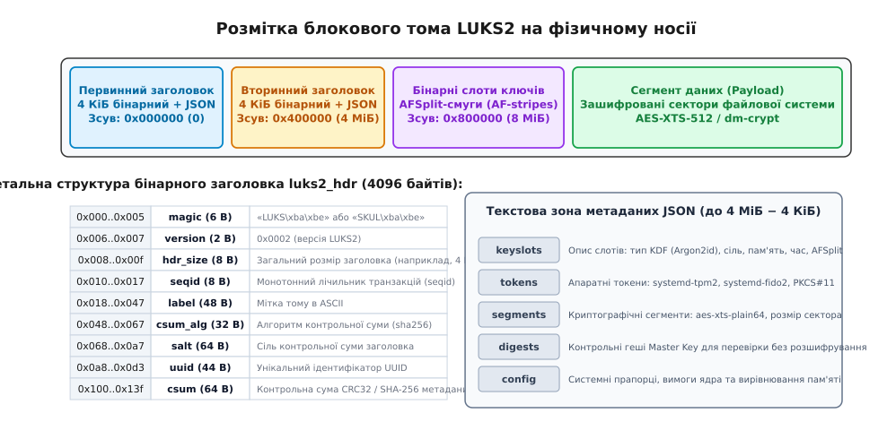
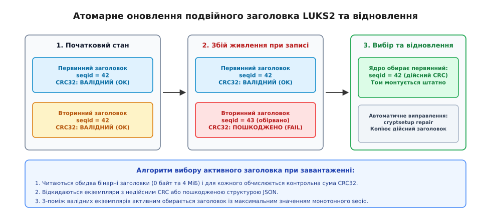
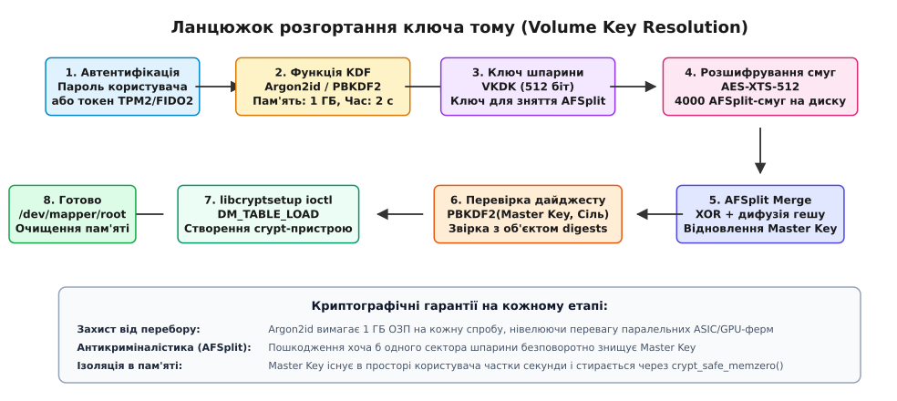
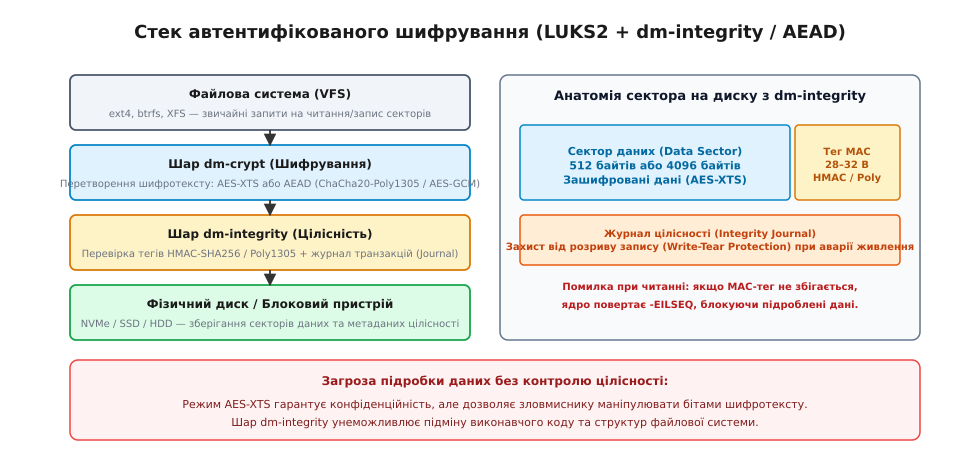

# LUKS2: формат заголовка шифрованого тому

<preknowlist>
- [dm-crypt: прозоре шифрування блокового пристрою](topic:sys-unix/dm-crypt) — як підсистема Device Mapper перетворює операції вводу-виводу на льоту за допомогою симетричних блокових шифрів.
- [Device mapper: блоковий пристрій, зібраний із шарів](topic:sys-unix/device-mapper) — механізм створення віртуальних блокових пристроїв через таблиці відображення секторів та перехоплення біо-структур.
- [Блоковий пристрій: сектори, блоки й черга запитів](topic:sys-unix/block-device-model) — адресний простір носія як послідовність секторів LBA, вирівнювання запитів і межі транзакцій.
- [Блоковий шифр](topic:sf-security/block-cipher) — принципи функціонування симетричних алгоритмів блокового перетворення та режими зчеплення.
- [Геш-функції](topic:algorithms/hash-functions) — односторонні криптографічні перетворення, стійкість до колізій і генерація дайджестів.
- [Виміряне завантаження і TPM PCR](topic:sys-unix/measured-boot-pcr) — апаратна фіксація стану платформи та запечатування ключів шифрування в мікросхемі безпеки.
</preknowlist>

## Втрачений сектор і крах криптографічного сховища

Під час аварійного вимкнення живлення серверний накопичувач пошкодив рівно один сектор на початку дискового розділу. Якщо цей розділ був зашифрований сирим модулем `dm-crypt` без збереження параметрів або старою версією LUKS1, цей єдиний збій призводив до повної втрати доступу до всіх записаних на носії терабайтів даних. У сирому режимі ядро не знає ані алгоритму шифрування, ані розміру ключа, ані зсуву секторів; у форматі LUKS1 бінарний заголовок розміром 592 байти містився виключно в нульовому секторі й не мав жодної резервної копії на диску. Втрата перших 4096 байтів означала безповоротне знищення головного ключа тому (Master Key).

Друга проблема проявилася з розвитком обчислювальної техніки. Алгоритми захисту паролів, спроєктовані на початку 2000-х років (зокрема PBKDF2), покладалися суто на обчислювальне навантаження процесора. Коли зловмисники отримали масивні паралельні ферми з графічних процесорів (GPU) та спеціалізованих мікросхем ASIC, злам паролів через PBKDF2 став справою кількох годин. Оскільки PBKDF2 практично не використовує оперативну пам'ять, відеокарта може паралельно перевіряти сотні мільйонів паролів на секунду, нівелюючи будь-яке збільшення кількості ітерацій.

Третє фундаментальне обмеження полягало в жорсткій структурі носія. Фіксований бінарний заголовок не дозволяв підтримувати різні розміри секторів (512 байтів та 4096 байтів), унеможливлював онлайн-перешифрування томів без перерозмітки та не містив місця для збереження криптографічних прив'язок до апаратних чипів TPM2 або ключів FIDO2. Щоб подолати ці архітектурні глухі кути, було створено стандарт **LUKS2** (Linux Unified Key Setup версії 2, від латинського *formatio* — утворення, та англійського *setup* — налаштування).

Як відбувався історичний перехід від жорстких бінарних блоків до модульної архітектури, чому PBKDF2 поступився пам'ятемістким алгоритмам і хто саме проєктував ці стандарти в ядрі Linux — докладно: [еволюція від LUKS1 до LUKS2](topic:sys-unix/luks-format/hist-luks1-to-luks2.md).

---

## Подвійний бінарний заголовок: стійкість до збоїв живлення

Специфікація LUKS2 відмовляється від єдиної точки відмови й запроваджує архітектуру з **двома незалежними заголовками**: первинним (Primary Header) та вторинним (Secondary Header). Кожен екземпляр заголовка складається з 4-кілобайтної бінарної структури `luks2_hdr_disk` та текстової зони метаданих у форматі JSON. За замовчуванням повний розмір кожного заголовка з метаданими становить 4 МіБ (4 194 304 байти).

Первинний заголовок розташований за нульовим зсувом (байт 0), а вторинний — одразу за ним, за зсувом 4 МіБ (0x400000).


*Розмітка блокового тома LUKS2: первинний і вторинний заголовки по 4 МіБ, бінарна область смуг AFSplit та сегмент зашифрованих даних*

### Структура бінарного дескриптора `luks2_hdr_disk`

Бінарна частина заголовка займає рівно 4096 байтів і має наступний макет полів (усі багатобайтові цілі числа зберігаються у форматі зі старшим байтом попереду, Big-Endian):

:::tabs
```c
struct luks2_hdr_disk {
    char     magic[6];        /* Сигнатура: "LUKS\xba\xbe" або тимчасова "SKUL\xba\xbe" */
    uint16_t version;         /* Версія формату: 0x0002 */
    uint64_t hdr_size;        /* Повний розмір зони метаданих у байтах (4 МіБ) */
    uint64_t seqid;           /* Монотонний 64-бітний лічильник послідовності транзакцій */
    char     label[48];       /* Текстова мітка тома (ASCII/UTF-8) */
    char     csum_alg[32];    /* Алгоритм контрольної суми ("sha256", "sha512", "crc32") */
    uint8_t  salt[64];        /* Криптографічна сіль контрольної суми */
    char     uuid[44];        /* Унікальний ідентифікатор тома UUID */
    char     subsystem[48];   /* Назва підсистеми-власника (наприклад, "systemd") */
    uint64_t hdr_offset;      /* Фізичний зсув цього заголовка від початку диска */
    uint8_t  _padding[184];   /* Вирівнювання структури до зміщення контрольної суми */
    uint8_t  csum[64];        /* Контрольна сума бінарного заголовка та JSON-метаданих */
    uint8_t  _pad_to_4k[3584];/* Доповнення нулями до розміру сторінки 4096 байтів */
} __attribute__((packed));
```
```cpp
struct alignas(1) HeaderDisk {
    char     magic[6];        // Сигнатура "LUKS\xba\xbe" або "SKUL\xba\xbe"
    uint16_t version;         // Версія формату: 0x0002
    uint64_t hdr_size;        // Розмір зони метаданих у байтах (4 МіБ)
    uint64_t seqid;           // Монотонний лічильник транзакцій
    char     label[48];       // Мітка тома (ASCII/UTF-8)
    char     csum_alg[32];    // Алгоритм гешу ("sha256", "sha512", "crc32")
    uint8_t  salt[64];        // Криптографічна сіль
    char     uuid[44];        // Унікальний ідентифікатор UUID
    char     subsystem[48];   // Назва підсистеми
    uint64_t hdr_offset;      // Фізичний зсув заголовка на носії
    uint8_t  padding[184];    // Вирівнювання до поля контрольної суми
    uint8_t  csum[64];        // Контрольна сума дескриптора та JSON
    uint8_t  pad_to_4k[3584]; // Доповнення до розміру сторінки 4096 байтів
};
static_assert(sizeof(HeaderDisk) == 4096, "Розмір HeaderDisk мусить дорівнювати 4096 байтам");
```
:::

Поле `magic` містить 6 байтів: символи `'L'`, `'U'`, `'K'`, `'S'` та два шістнадцяткові байти `0xBA`, `0xBE`. Якщо під час запису заголовок тимчасово інвалідується, сигнатура інвертується на `'S'`, `'K'`, `'U'`, `'L'`, `0xBA`, `0xBE`, що запобігає розпізнаванню недописаного блоку іншими процесами.

Поле `seqid` (Sequence Identifier) — це 64-бітне беззнакове число, яке інкрементується на `1` при кожній модифікації метаданих (додавання ключа, зміна токена, зміна розміру сегмента).

Поле `hdr_offset` фіксує очікуване абсолютне зміщення поточного заголовка на пристрої: `0` для первинного дескриптора та `4194304` (4 МіБ) для вторинного. Якщо системний адміністратор виконує поблокове копіювання розділу утилітою `dd` із помилковим зсувом або якщо таблиця розділів GPT зміщується, ядро негайно виявляє невідповідність між реальною точкою читання та полем `hdr_offset`, запобігаючи руйнуванню суміжних секторів носія.

Контрольна сума `csum` обчислюється за вказаним у `csum_alg` алгоритмом (за замовчуванням SHA-256). Вона накриває перші 4096 байтів структури (зі штучно зануленим полем `csum`) разом із прилеглою текстовою областю JSON-метаданих розміром `hdr_size - 4096` байтів.

### Протокол атомарного оновлення

Оновлення метаданих у LUKS2 є суворо транзакційним і захищеним від раптового знеструмлення:

1. У просторі користувача бібліотека `libcryptsetup` готує новий стан метаданих JSON і формує бінарний заголовок із номером `seqid_new = seqid_current + 1`.
2. Обчислюється нова контрольна сума `csum` за вказаним алгоритмом `csum_alg` (за замовчуванням SHA-256).
3. Новий блок метаданих записується у **вторинну область** (зсув 4 МіБ).
4. Виконується системний виклик скидання буферів на фізичний носій (`fsync` або операція FUA — Force Unit Access).
5. Лише після підтвердження успішного запису вторинного заголовка новий блок записується у **первинну область** (зсув 0 байтів) і знову скидається на диск.


*Стійкість до аварії живлення: вибір екземпляра заголовка з максимальним валідним seqid при пошкодженні одного з блоків*

Якщо живлення зникає під час запису вторинного заголовка, первинний заголовок лишається неушкодженим із версією `seqid`. Якщо живлення зникає під час запису первинного заголовка, вторинний уже містить повністю валідний блок із версією `seqid + 1`. Під час монтування драйвер перевіряє контрольні суми обох заголовків і автоматично обирає екземпляр із валідним CRC/SHA-256 та найвищим номером `seqid`.

Практичну реалізацію низькорівневого аналізатора, що виконує арбітраж подвійного заголовка мовами C та C++, подано у вставці: [розбір та валідація бінарного заголовка LUKS2](topic:sys-unix/luks-format/proj-luks2-header-dumper.md).

---

## Текстова зона метаданих JSON

Безпосередньо за 4096-байтним дескриптором `luks2_hdr_disk` починається область текстових метаданих JSON. Вона займає весь простір до кінця зони заголовка (`hdr_size - 4096`, тобто 4 190 208 байтів) і доповнюється байтами `0x00`.

Метадані описують конфігурацію сховища як спрямований граф об'єктів. Кореневий документ містить п'ять базових словників:

```json
{
  "keyslots": { ... },
  "tokens": { ... },
  "segments": { ... },
  "digests": { ... },
  "config": { ... }
}
```

```
┌───────────────────────────────────────────────────────────┐
│                       JSON METADATA                       │
│                                                           │
│  ┌──────────────┐         ┌─────────────┐                 │
│  │   tokens     │────────▶│  keyslots   │                 │
│  │ (tpm2/fido2) │         │ (Argon2id)  │                 │
│  └──────────────┘         └──────┬──────┘                 │
│                                  │                        │
│                                  ▼                        │
│                           ┌─────────────┐                 │
│                           │   digests   │                 │
│                           │  (PBKDF2)   │                 │
│                           └──────┬──────┘                 │
│                                  │                        │
│                                  ▼                        │
│                           ┌─────────────┐                 │
│                           │  segments   │                 │
│                           │(dm-crypt/XTS│                 │
│                           └─────────────┘                 │
└───────────────────────────────────────────────────────────┘
```

1. **`keyslots` (Слоти ключів):** кожен елемент описує окремий спосіб отримання доступу. Він визначає функцію розтягування пароля KDF (Argon2id, Argon2i або PBKDF2), криптографічну сіль, обсяг пам'яті, кількість потоків, а також фізичне розташування та параметри шифрування області розщеплених смуг AFSplit на диску.
2. **`digests` (Контрольні дайджести):** словник містить криптографічні геші головного ключа (Master Key). Дайджест дозволяє перевірити, чи правильний пароль ввів користувач, без розшифрування терабайтного розділу. Об'єкт `digests` містить масиви `keyslots` та `segments`, пов'язуючи конкретні слоти ключів із відповідними сегментами даних.
3. **`segments` (Сегменти носія):** описує структуру шифрованого простору. Типовий сегмент має тип `"crypt"`, зсув початку корисних даних у байтах (наприклад, 16 МіБ = 16 777 216 байтів), розмір (`"dynamic"` для заповнення всього залишку розділу), розмір сектора (512 або 4096 байтів) та шифр ядра (`"aes-xts-plain64"`).
4. **`tokens` (Апаратні токени):** містить конфігурацію модулів інтеграції зовнішньої автентифікації. Токени типів `systemd-tpm2`, `systemd-fido2` або `systemd-pkcs11` зберігають запечатані ключі, номери регістрів PCR та ідентифікатори облікових записів WebAuthn, пов'язуючи їх із номерами слотів у `keyslots`.
5. **`config` (Конфігурація):** зберігає загальні вимоги драйвера, виділені ліміти розміру пам'яті під JSON (`json_size`) та бінарну область слотів (`keyslots_size`).

Повний опис усіх обов'язкових та опціональних полів JSON-схеми з прикладами наведено у довіднику: [специфікація JSON-метаданих формату LUKS2](topic:sys-unix/luks-format/api-luks2-json-metadata.md).

---

## Функції розтягування ключів: захист від паралельного перебору

Функція формування ключа KDF (від англійського *Key Derivation Function*) перетворює довільний пароль користувача слабкої ентропії на криптографічно стійкий симетричний ключ довжиною 256 або 512 бітів. Її головне завдання — штучно сповільнити процес обчислення, зробивши перебір паролів методом грубої сили економічно та апаратно неможливим.

### Чому PBKDF2 зазнав поразки перед ASIC та GPU

Алгоритм PBKDF2, стандартизований у RFC 2898, реалізує послідовне багаторазове застосування псевдовипадкової функції (зазвичай HMAC-SHA256):

```
DK = PBKDF2(Password, Salt, Iterations, KeyLength)
```

Він є суто **обчислювально містким** (compute-bound). Для обчислення одного кроку PBKDF2 процесору потрібно лише кілька десятків регістрів для зберігання поточного стану SHA-256 (менше 256 байтів пам'яті). Спеціалізований чип ASIC або сучасний графічний процесор може розмістити десятки тисяч таких обчислювальних ядер на одному кристалі. Зловмисник будує паралельний конвеєр, який перебирає мільярди паролів за секунду без затримок на доступ до пам'яті.

### Пам'ятемісткий алгоритм Argon2

LUKS2 використовує як KDF за замовчуванням алгоритм **Argon2** (переможець міжнародного конкурсу Password Hashing Competition 2015 року, RFC 9106).

Argon2 є **пам'ятемістким** (memory-hard) алгоритмом. Він створює в оперативній пам'яті великий двовимірний масив блоків (за замовчуванням 1 ГБ = 1 048 576 КіБ) і виконує багаторазове заповнення та перемішування цих блоків за допомогою псевдовипадкових перестановок:

```
┌─────────────────────────────────────────────────────────────┐
│                 ОПЕРАТИВНА ПАМ'ЯТЬ (1 ГБ)                   │
│                                                             │
│  [Блок 0] ──▶ [Блок 1] ──▶ [Блок 2] ──▶ ... ──▶ [Блок M]   │
│     ▲                        │                     │        │
│     │                        ▼                     │        │
│     └──────────────── [Псевдовипадкове] ◀──────────┘        │
│                       [ перемішування ]                     │
└─────────────────────────────────────────────────────────────┘
```

Внутрішня матриця пам'яті Argon2 розбивається на паралельні смуги (lanes) та часові зрізи (slices). На кожному кроці алгоритм обчислює стиснення 1024-байтового блоку функцією на основі перестановки Blake2b, обираючи адресу попереднього блоку з пам'яті. Щоб обчислити один пароль, обчислювальний вузол зобов'язаний виділити 1 ГБ фізичної оперативної пам'яті з високою пропускною здатністю. Навіть найпотужніша відеокарта з 24 ГБ пам'яті може одночасно виконувати не більше 24 паралельних потоків перебору Argon2. Спроба зменшити використання пам'яті призводить до експоненційного зростання кількості обчислювальних операцій (Time-Memory Trade-Off penalty).

Специфікація розрізняє дві модифікації:
* **Argon2i:** використовує адресацію пам'яті, що не залежить від вхідного пароля (data-independent addressing). Це повністю захищає алгоритм від атак за сторонніми каналами часу доступу до кеш-пам'яті (side-channel cache timing attacks).
* **Argon2id (стандарт LUKS2):** гібридний режим. Перший прохід пам'яті виконується за схемою Argon2i для захисту від сторонніх каналів, а наступні проходи — за схемою Argon2d (data-dependent), що забезпечує абсолютну стійкість проти атак із використанням дешевої пам'яті на GPU/FPGA.

Під час створення тома утиліта `cryptsetup` запускає динамічний тест швидкодії (бенчмарк), який підбирає параметри пам'яті, часу та кількості ядер так, щоб розгортання ключа займало на цільовому процесорі рівно 2000 мілісекунд (2 секунди).

---

## AFSplit: антикриміналістичне розщеплення ключів

Після того, як пароль розтягнуто через Argon2id, утворюється проміжний ключ розшифрування шпарини — **VKDK** (Volume Key Decryption Key). Проте Master Key не шифрується цим ключем безпосередньо у вигляді єдиного 64-байтового блоку.

### Загроза локального збереження ключа на SSD

Сучасні носії на базі флешпам'яті (SSD, NVMe) використовують мікроконтролери з алгоритмами вирівнювання зношування (wear-leveling) та прихованими резервними блоками (over-provisioning). Коли операційна система перезаписує один 512-байтовий сектор, контролер SSD не стирає старі комірки фізично, а записує нові дані у вільний блок, змінюючи внутрішню таблицю трансляції LBA. Старий ключ лишається у флешпам'яті у відкритому або напівстертому вигляді, звідки може бути вилучений криміналістичним обладнанням (chip-off forensics).

### Механізм дифузії AFSplit

Щоб унеможливити відновлення Master Key при частковому збереженні комірок, автор оригінального LUKS Клеменс Фрувірт розробив схему **AFSplit** (Anti-Forensic Information Splitting, від грецького *ἀντί* — проти, та латинського *forensis* — судовий).

Master Key `K` довжиною 64 байти розщеплюється на `N` смуг (зазвичай `N = 4000`), що сумарно займають 256 КіБ (262 144 байти) на диску:

```
[Master Key K] (64 байти)
       │
       ▼  AFSplit
[Смуга 1] [Смуга 2] [Смуга 3] ... [Смуга 3999] [Смуга 4000] (разом 256 КіБ)
       │
       ▼  AES-XTS (під ключем VKDK)
[Зашифрована область keyslot на диску]
```

1. Генеруються 3999 псевдовипадкових блоків `S[1], S[2], ..., S[3999]` по 64 байти кожен.
2. Обчислюється дифузійний ланцюг, де кожен наступний блок є результатом криптографічного гешу від суми попередніх:
```
I[0] = 0
I[i] = SHA256(I[i-1] ⊕ S[i])   для i = 1 .. 3999
```
3. Остання смуга формується як `S[4000] = K ⊕ I[3999]`.
4. Усі 4000 смуг шифруються алгоритмом AES-XTS-512 під ключем VKDK і записуються в область шпарини.

### Властивість тотальної ентропії

Щоб відновити Master Key, необхідно розшифрувати й скласти **всі 4000 смуг без винятку**. Якщо зловмиснику не вдалося прочитати або розшифрувати хоча б одну смугу `S[m]`, відсутній блок має 512 бітів абсолютної випадкової ентропії. Ймовірність вгадати відсутній сектор становить `2⁻⁵¹² ≈ 7.45 · 10⁻¹⁵⁵`, що перетворює відновлення ключа на математично нездійсненну задачу.

Ба більше, стирання навіть одного довільного сектора (512 байтів) у зоні шпарини гарантовано знищує вісім смуг AFSplit, безповоротно стираючи Master Key з носія.

Математичне виведення дифузійних рівнянь та оцінку інформаційної ентропії за Шенноном наведено у вставці: [математична модель та розрахунок ентропії AFSplit](topic:sys-unix/luks-format/math-afsplit-information-dispersion.md).

---

## Підсистема ядра: повний цикл розгортання та dm-crypt

Коли користувач монтує зашифрований розділ, простір користувача (`cryptsetup` / `systemd-cryptsetup`) та ядро Linux взаємодіють через чітко визначену послідовність етапів.


*Послідовність відкриття тому: автентифікація, KDF Argon2id, зняття AFSplit, верифікація дайджесту та активація через DM_TABLE_LOAD*

### Життєвий цикл активації тома:

1. **Зчитування метаданих:** `libcryptsetup` відкриває пристрій `/dev/nvme0n1p3`, читає бінарний заголовок за зсувом 0 (або 4 МіБ), перевіряє сигнатуру `LUKS\xba\xbe`, звіряє контрольну суму SHA-256 та парсить текстовий JSON-документ.
2. **Автентифікація користувача:** запитується парольна фраза або виконується звернення до апаратного токена (TPM2 / FIDO2).
3. **Обчислення VKDK:** за допомогою Argon2id з параметрами, вказаними в об'єкті `keyslots[0].kdf` (сіль, пам'ять 1 ГБ, 4 потоки), генерується 512-бітний ключ шпарини VKDK.
4. **Зчитування та дешифрування смуг:** із диска за вказаним в `area.offset` зміщенням зчитуються 256 КіБ бінарних даних і розшифровуються алгоритмом AES-XTS-512 за допомогою VKDK.
5. **Злиття AFSplit:** обчислюється дифузійний ланцюг над 4000 смугами, відновлюючи 64-байтовий Master Key.
6. **Верифікація через Digest:** від отриманого кандидата Master Key обчислюється PBKDF2 із сіллю та параметрами з об'єкта `digests[0]`. Якщо обчислений геш збігається з полем `digest`, ключ вважається автентичним. Якщо не збігається — перевіряється наступний слот або повертається помилка невірного пароля без монтування диска.
7. **Конструювання таблиці Device Mapper:** `libcryptsetup` відкриває керівний файл `/dev/mapper/control` і надсилає системний виклик `ioctl` із командою `DM_DEV_CREATE`, створюючи віртуальний вузол (наприклад, `/dev/mapper/root`).
8. **Завантаження криптографічної таблиці (`DM_TABLE_LOAD`):** передається конфігураційний рядок таблиці відображення:
```
0 104857600 crypt aes-xts-plain64 0123456789abcdef... 0 /dev/nvme0n1p3 32768
```
де вказано початковий сектор, довжину в секторах, тип цілі `crypt`, шифр, Master Key у шістнадцятковому вигляді, початковий зсув IV, фізичний пристрій та зсув корисного навантаження (32768 секторів = 16 МіБ).
9. **Ініціалізація `dm-crypt` у ядрі:** драйвер `dm-crypt` викликає підсистему Kernel Crypto API (`crypto_alloc_skcipher`), аллокує структуру конфігурації `struct crypt_config`, створює черги обробки запитів `kcryptd` та переводить пристрій у робочий стан (`DM_DEV_RESUME`).
10. **Безпечне очищення пам'яті:** бібліотека `libcryptsetup` викликає функцію `crypt_safe_memzero()`, негайно перезаписуючи нулями всі змінні, буфери AFSplit та копії Master Key у просторі користувача.

### Робота підсистеми `dm-crypt` усередині ядра

Коли ядро отримує команду `DM_TABLE_LOAD`, функція конструктора цілі `crypt_ctr` (у файлі ядра `drivers/md/dm-crypt.c`) виділяє структуру `struct crypt_config`. Вона ініціалізує симетричний шифр через підсистему Kernel Crypto API:

```c
cc->tfms[i] = crypto_alloc_skcipher(cipher_name, 0, 0);
crypto_skcipher_setkey(cc->tfms[i], key, key_size);
```

Для кожного запиту на читання або запис блоків `struct bio`:
* Під час запису `dm-crypt` виділяє сторінки-клони в пулі пам'яті (mempool), шифрує дані через апаратні інструкції CPU (AES-NI на x86 або ARMv8-CE на AArch64) у робочій черзі `kcryptd` і відправляє клонований `bio` на фізичний накопичувач.
* Під час читання запит спершу читає зашифровані сектори з фізичного носія у сторінки пам'яті ядра, після чого обробник завершення вводу-виводу перенаправляє `bio` у чергу `kcryptd`, де дані розшифровуються на місці (in-place) перед тим, як потрапити у системний сторінковий кеш файлової системи.

Для оптимізації продуктивності на високошвидкісних NVMe-накопичувачах `libcryptsetup` підтримує прапорці тюнінгу черг ядра:
* `same_cpu_crypt`: змушує виконувати шифрування на тому самому ядрі CPU, яке ініціювало запис, зменшуючи затримки міграції кешу L1/L2.
* `submit_from_crypt_cpus`: відправляє зашифрований біо-запит безпосередньо у чергу контролера NVMe без повернення в початковий потік.
* `no_read_workqueue` / `no_write_workqueue`: обробляє криптографічні операції синхронно в контексті переривання, усуваючи накладні витрати на перемикання контексту планувальника для надшвидких накопичувачів.

---

## Апаратна автентифікація: TPM2, FIDO2 та системні токени

LUKS2 стандартизував механізм інтеграції з апаратними модулями безпеки через системний словник `tokens`. Замість введення статичного пароля користувач може прив'язати розблокування диска до фізичного чипа безпеки.

```
┌─────────────────────────────────────────────────────────────┐
│                    АПАРАТНІ ТОКЕНИ LUKS2                    │
│                                                             │
│  ┌───────────────┐   ┌─────────────────┐   ┌─────────────┐  │
│  │     TPM2      │   │      FIDO2      │   │   PKCS#11   │  │
│  │(Запечатування │   │ (Апаратний ключ │   │ (Смарткарта │  │
│  │   до PCR)     │   │   hmac-secret)  │   │  з RSA/ECC) │  │
│  └───────┬───────┘   └────────┬────────┘   └──────┬──────┘  │
│          │                    │                   │         │
│          └────────────────────┼───────────────────┘         │
│                               ▼                             │
│                  ┌─────────────────────────┐                │
│                  │ systemd-cryptenroll /   │                │
│                  │    libcryptsetup        │                │
│                  └────────────┬────────────┘                │
│                               ▼                             │
│                  ┌─────────────────────────┐                │
│                  │  Розблокування Keyslot  │                │
│                  └─────────────────────────┘                │
└─────────────────────────────────────────────────────────────┘
```

### Запечатування ключів у TPM2 (`systemd-tpm2`)

Модуль довіреної платформи TPM 2.0 (Trusted Platform Module) дозволяє запечатати (seal) секрет розблокування шпарини до поточного стану конфігураційних регістрів платформи (Platform Configuration Registers, PCR):

```bash
systemd-cryptenroll --tpm2-device=auto --tpm2-pcrs=0+7+14 /dev/nvme0n1p3
```

* **PCR 0:** фіксує криптографічний геш коду прошивки UEFI материнської плати.
* **PCR 7:** контролює стан режиму безпечного завантаження (Secure Boot) та сертифікатів підпису ядра.
* **PCR 14:** фіксує базу даних додаткових ключів безпечного завантаження Shim (MokListRT).

Під час виконання команди `systemd-cryptenroll` генерується випадковий 256-бітний симетричний ключ, який запечатується командою `TPM2_Create` всередині первинного сховища TPM2 під політикою авторизації `TPM2_PolicyPCR`. Запечатаний двійковий блоб (`tpm2-blob`) записується в об'єкт токена LUKS2, а відкритий секрет шифрує призначений слот ключів.

Під час завантаження служба `systemd-cryptsetup` зчитує `tpm2-blob`, надсилає його до чипа TPM2 і викликає `TPM2_Unseal`. Мікросхема TPM2 перевіряє поточні значення регістрів PCR SHA-256 банку. Якщо код прошивки або сертифікати Secure Boot не змінювалися, TPM2 повертає розпечатаний ключ, і том монтується повністю автоматично без запиту пароля. Спроба завантажити стороннє непідписане ядро або підключити диск до іншої материнської плати призводить до невідповідності значень PCR, і чип блокує видачу ключа.

Якщо прошивку материнської плати було законно оновлено адміністратором, значення PCR 0 зміниться, і TPM2 відмовиться розпечатати ключ. У такому випадку LUKS2 автоматично переходить до аварійного відновлення: запитується резервна парольна фраза (recovery passphrase), збережена в паралельному слоті ключів, після чого адміністратор повторно запечатує токен під новими значеннями регістрів PCR.

### Апаратні ключі FIDO2 (`systemd-fido2`)

Прив'язка до фізичних ключів безпеки (YubiKey, SoloKey) використовує криптографічне розширення стандарту WebAuthn/CTAP2 — `hmac-secret`.

Під час реєстрації через `systemd-cryptenroll --fido2-device=auto` у токені LUKS2 зберігається випадкова сіль. Під час завантаження ця сіль передається на ключ FIDO2. Ключ вимагає фізичного дотику користувача (User Presence, UP) або введення апаратного PIN-коду (User Verification, UV), обчислює HMAC від солі на своєму внутрішньому незмінному секреті та повертає вихідне значення, яке використовується для відкриття keyslot. Викрадення самого комп'ютера без фізичного USB-ключа унеможливлює розшифрування.

### Смарткарти та токени PKCS#11 (`systemd-pkcs11`)

Для корпоративних середовищ LUKS2 підтримує інтеграцію зі смарткартами PKCS#11 (смарткарти з апаратними криптомодулями). У токені зберігається URI сертифіката (згідно з RFC 7512), а секрет шпарини зашифровано асиметричним відкритим ключем RSA-4096 або ECC. Розшифрування відбувається безпосередньо на захищеному чипі смарткарти після введення PIN-коду користувачем.

---

## Захист цілісності: автентифіковане шифрування з dm-integrity

Класичні симетричні алгоритми шифрування дисків (зокрема AES-XTS та AES-CBC) забезпечують **конфіденційність** (confidentiality), але принципово не захищають від **порушення цілісності** (integrity).

### Проблема модифікації шифротексту (Bit-Flipping)

Якщо зловмисник має фізичний доступ до носія, він не може прочитати зашифровані файли. Проте він може цілеспрямовано змінити окремі біти в секторах файлової системи або виконавчих бінарних файлів (наприклад, у демоні `sshd` або файлі `/etc/shadow`). Під час розшифрування пошкоджений сектор перетвориться на локальне сміття, але ядро не розпізнає підміну й передасть ці байти системі, що дозволяє виконувати атаки на обхід автентифікації.

### Стек LUKS2 та dm-integrity

Стандарт LUKS2 вперше в екосистемі Linux реалізував повноцінне **автентифіковане шифрування** (Authenticated Encryption with Associated Data, AEAD) на рівні блокового пристрою шляхом наскрізної інтеграції з підсистемою `dm-integrity`.


*Стек автентифікованого шифрування: шари dm-crypt та dm-integrity з per-sector автентифікаційними тегами та захисним журналом транзакцій*

При форматуванні тома з контролем цілісності:

```bash
cryptsetup luksFormat --type luks2 --integrity hmac-sha256 /dev/nvme0n1p3
```

Створюється двошаровий стек:

1. **Шар `dm-integrity`:** розбиває носій на сектори даних та службову область метаданих. Для кожного сектора (512 або 4096 байтів) виділяється додаткове поле тегу автентифікації (28–32 байти), куди записується HMAC-SHA256 або Poly1305.
2. **Журнал цілісності (Integrity Journal):** усі операції запису спершу фіксуються в лінійному кільцевому журналі на диску, що запобігає розриву запису (write-tear) при аварії живлення, коли дані сектора вже оновилися, а контрольний тег — ще ні.
3. **Шар `dm-crypt` / AEAD:** використовує об'єднаний шифр ядра `capi:authenc(hmac(sha256),xts(aes))-plain64` або прямий AEAD-шифр (ChaCha20-Poly1305 / AES-GCM), обчислюючи криптографічний тег від номера сектора та зашифрованого вмісту.

Під час кожної операції читання підсистема `dm-integrity` перевіряє валідність тегу. Якщо хоча б один біт у секторі було модифіковано ззовні, ядро негайно перериває операцію вводу-виводу з помилкою `-EILSEQ` (*Illegal byte sequence*), блокуючи потрапляння сфальсифікованих даних у сторінковий кеш.

---

## Практичне адміністрування та онлайн-перешифрування

Формат LUKS2 кардинально розширив діапазон операцій технічного обслуговування шифрованих накопичувачів без зупинки роботи сервісів.

### Діагностика метаданих через `luksDump`

Перегляд повного стану заголовків, слотів та прив'язаних токенів виконується командою:

```bash
cryptsetup luksDump /dev/nvme0n1p3
```

Утиліта виводить бінарні параметри заголовків, значення `seqid` обох копій, тип алгоритму Argon2id, розмір виділеної пам'яті та розпарсений JSON-документ.

### Онлайн-перешифрування тома (Online Reencryption)

Однією з найскладніших інженерних задач у LUKS1 була зміна головного ключа або зміна алгоритму шифрування (наприклад, міграція з `aes-cbc-essiv` на `aes-xts-plain64`). У LUKS1 це вимагало повного копіювання файлової системи на резервний диск.

У LUKS2 реалізовано вбудований механізм **онлайн-перешифрування на льоту** (Online Reencryption):

```bash
cryptsetup reencrypt --resilience-mode=journal /dev/nvme0n1p3
```

1. У JSON-метаданих створюється спеціальний слот типу `"reencrypt"`, який описує два одночасно існуючі сегменти: старий шифрований сегмент та новий сегмент.
2. Демон `cryptsetup` покроково зчитує діапазони секторів (наприклад, по 4 МіБ), записує їх у транзакційний журнал захисту від збоїв (resilience journal), розшифровує старим ключем, зашифровує новим ключем і записує назад на диск.
3. Зсув кордону між сегментами атомарно оновлюється в JSON-метаданих зі збільшенням лічильника `seqid`.
4. Якщо посеред процесу перешифрування сервер вимкнеться, після перезавантаження ядро прочитає стан журналу з метаданих LUKS2 і продовжить процес з останнього збереженого сектора без втрати даних.

### Відновлення пошкодженого заголовка

Якщо внаслідок збою носія первинний заголовок пошкоджено, відновлення структури зі збереженої вторинної копії виконується командою:

```bash
cryptsetup repair /dev/nvme0n1p3
```

Команда перевіряє валідність обох заголовків і дзеркально відновлює пошкоджену копію зі збереженням повної структури слотів ключів та токенів.

> 🔧 **Навіщо це.**
> Розуміння формату LUKS2 є критичним для проектування захищених хмарних серверів, вбудованих пристроїв та робочих станцій. Воно дозволяє будувати автоматизовані схеми безпарольного завантаження через TPM2, надійно захищати накопичувачі від апаратних атак перебору на GPU через Argon2id, гарантувати цілісність системних файлів за допомогою `dm-integrity` та безпечно виконувати міграцію ключів і оновлення алгоритмів на працюючих продуктових серверах.
