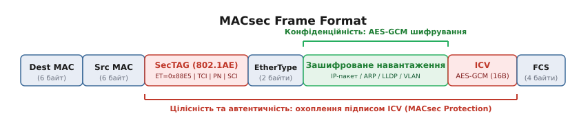
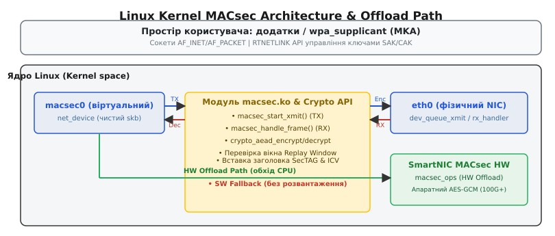

# Захист канального рівня MACsec (IEEE 802.1AE) у ядрі

<preknowlist>
- [Інтерфейси, адреси й стан лінка](topic:sys-unix/interfaces-and-addresses) — керування мережевими пристроями net_device та RTNetlink у ядрі.
- [IPsec у Linux: каркас перетворень xfrm](topic:sys-unix/ipsec-xfrm) — шифрування на рівні L3 (IP) та відмінності від L2 (MACsec).
- [Драйвери Macvlan та Macvtap](topic:sys-unix/macvlan-macvtap-drivers) — робота віртуальних надбудов над мережевими інтерфейсами.
</preknowlist>

Коли операційна система передає дані через фізичну або віртуальну мережу, більшість інженерів звикли покладатися на протоколи безпеки вищих рівнів: TLS/HTTPS на прикладному рівні (L7) або IPsec (XFRM) на мережевому рівні (L3). Проте ці протоколи залишають повністю незахищеним сам канальний рівень (L2 — Data Link Layer). Усі кадри Ethernet, що курсують між комутаторами, серверами та маршрутизаторами, передаються в прозорому вигляді. Це означає, що транзитний зловмисник, який отримав доступ до фізичного кабелю, оптичного відгалужувача (optical TAP) або спровокував атаку на комутатор (ARP-spoofing, MAC-flooding, LLDP/STP poisoning чи VLAN hopping), може перехоплювати або підміняти службовий трафік, який взагалі не містить IP-заголовків (наприклад, кадри ARP, DHCP, LLDP, LACP або промислові протоколи profinet чи RoCEv2).

Для розв'язання цієї фундаментальної проблеми безпеки було створено стандарт **IEEE 802.1AE**, відомий як **MACsec (Media Access Control Security)**. MACsec реалізує криптографічний захист канонічних Ethernet-кадрів "на дроті" безпосередньо над фізичним рівнем (PHY). У ядрі Linux починаючи з версії 4.6 підсистему MACsec інтегровано як модульний віртуальний мережевий пристрій, що працює в тісному зв'язку з підсистемою Crypto API, сокетами Netlink та механізмами апаратного розвантаження (Hardware Offload) на сучасних мережевих картах.

## 1. Чому L3 та L7 не рятують канальний рівень: першопричини появу MACsec

Щоб зрозуміти необхідність криптографічного захисту на канальному рівні, слід проаналізувати, де саме виникає сліпа зона у класичній захищеній мережевій інфраструктурі.

Протокол TLS (HTTPS, SSH) шифрує лише корисне навантаження транспортного сокета (TCP/UDP). Усі заголовки IP, MAC-адреси, номери портів та службовий трафік залишаються відкритими. Протокол IPsec (ESP), що працює на L3, шифрує IP-пакети, проте він принципово не бачить кадрів, які не є IP-пакетами.

Розглянемо типову ситуацію в центрі обробки даних (ЦОД) або магістральній мережі між двома площадинками (Data Center Interconnect — DCI):

1. **Атаки на службові протоколи L2**: Комутатори та сервери обмінюються кадрами ARP (Address Resolution Protocol), ND (Neighbor Discovery), LACP (Link Aggregation Control Protocol для бондингу) та LLDP (Link Layer Discovery Protocol). Якщо зловмисник впорскує фальшивий ARP-пакет з MAC-адресою свого обладнання, він перенаправляє весь трафік хоста на себе (Man-in-the-Middle) ще до того, як спрацюють будь-які правила IP-маршрутизації.
2. **Пасивний знімання даних з оптичних ліній**: Підключення оптичного призма-відгалужувача до ліній зв'язку між будівлями дозволяє копіювати 100% Ethernet-кадрів без розриву фізичного зв'язку. Якщо трафік не зашифрований на L2, атакуючий отримує повну топологію мережі, заголовки VLAN та вміст незахищених пакетів.
3. **Безпека мультиарендних середовищ (Multi-tenant)**: У хмарних інфраструктурах кадри різних віртуальних машин або контейнерів ізолюються за допомогою VLAN (802.1Q) або VXLAN. Проте за відсутності криптографічного підпису зловмисник із доступом до гіпервізора або неконтрольованого комутатора може сформувати кадр із фальшивим VLAN ID (VLAN hopping) і проникнути в ізольований сегмент іншого клієнта.

MACsec закриває цю сліпу зону. Він інкапсулює вихідний Ethernet-кадр, додає криптографічний заголовок SecTAG, шифрує корисне навантаження за допомогою алгоритму AES-GCM і додає вектор перевірки цілісності ICV (Integrity Check Value). Будь-який кадр, що не має валідного криптографічного підпису, негайно знищується мережевим адаптером або ядром Linux на найраннішому етапі прийому.

Детальніше про шлях стандартизації MACsec, появу 256-бітного шифрування та розширеного лічильника XPN викладено у довіднику [📜 Історія стандартизації MACsec: від 802.1AE-2006 до високошвидкісного захисту у ядрі Linux](topic:sys-unix/macsec-ieee-802-1ae/hist-802-1ae-evolution.md).

## 2. Анатомія кадру MACsec та криптографічний трансформат IEEE 802.1AE

При ввімкненні MACsec оригінальний Ethernet-кадр зазнає структуризації. Заголовок MACsec (SecTAG) вставляється негайно після MAC-адрес джерела та призначення.


*Формат кадру MACsec (IEEE 802.1AE) із розкриттям полів заголовка SecTAG, зашифрованого навантаження та вектора цілісності ICV.*

### Структура заголовка SecTAG (Security Tag)

Заголовок SecTAG має змінну довжину **8 або 16 байт** залежно від того, чи включено до нього ідентифікатор захищеного каналу SCI (Secure Channel Identifier). До складу SecTAG входять наступні поля:

1. **MACsec EtherType (2 байти)**: Завжди дорівнює `0x88E5`. Це сигналить мережевим картам та комутаторам, що далі йде заголовок MACsec, а не стандартний EtherType (наприклад, `0x0800` для IPv4 або `0x8100` для VLAN).
2. **TCI / AN (Tag Control Information / Association Number, 1 байт)**:
   - `V` (Version bit): версія протоколу (наразі 0).
   - `ES` (End Station): підтверджує, що кадр згенеровано кінцевим хостом.
   - `SC` (Secure Channel): прапорець наявності поля SCI у заголовку. Якщо `SC=1`, заголовок розширюється на 8 байт (SCI присутній). Якщо `SC=0`, SCI вилучається для економії оверхеду, а MAC-адреса джерела вважається складовою частини SCI.
   - `SCB` (Single Copy Broadcast): прапорець використання групової адреси.
   - `E` (Encryption bit): `1` — корисне навантаження зашифроване; `0` — трафік передається у відкритому вигляді, але із підписом цілісності ICV (Integrity-only mode).
   - `C` (Changed Text): `1` — початковий текст був змінений.
   - `AN` (Association Number, 2 біти): номер активної криптографічної асоціації (`0..3`), який вказує на один із чотирьох слотів ключів SAK, використаний для шифрування цього кадру.
3. **Short Length (SL, 1 байт)**: Задає довжину корисного навантаження, якщо вона менша за 46 байт (для виявлення падінгу в мінімальних кадрах). Якщо навантаження більше 46 байт, `SL` встановлюється в `0`.
4. **Packet Number (PN, 4 байти у 802.1AE або 8 байт у XPN)**: Унікальний зростаючий лічильник кадрів. Використовується як мотив для генерації вектора ініціалізації (IV) в AES-GCM та для захисту від атак повторного відтворення.
5. **Secure Channel Identifier (SCI, 8 байт, опціонально)**: Унікальний ідентифікатор передавача, що складається з 48-бітної MAC-адреси відправника та 16-бітного номера порта (`MAC + Port`).

### Режим шифрування AES-GCM та обчислення ICV

MACsec опирається на симетричний криптографічний режим **AES-GCM (Galois/Counter Mode)** з довжиною ключа 128 або 256 біт. Алгоритм GCM відноситься до класу AEAD (Authenticated Encryption with Associated Data).

Перетворення відбувається наступним чином:
- **Зашифрований текст (Ciphertext)**: Всі байти оригінального кадру після SecTAG (включаючи оригінальний EtherType та корисне навантаження IP/ARP) шифруються режимом AES-CTR.
- **Відкриті автентифіковані дані (AAD — Additional Authenticated Data)**: MAC-адреса призначення, MAC-адреса джерела та увесь заголовок SecTAG передаються відкритим текстом на дроті, але залучаються до математичного розрахунку Galois Hash.
- **Integrity Check Value (ICV, 16 байт)**: У кінець кадру додається 128-бітний аутентифікаційний штамп. Прийомна сторона обчислює Galois Hash над отриманими AAD та зашифрованим текстом. Якщо хоча б один біт MAC-адреси джерела, SecTAG чи даних був змінений зловмисником, обчислений ICV не співпаде з переданим, і ядро відкине кадр без розшифрування.

## 3. Модель каналів і асоціацій: SC, SA, SAK та захист від атак відтворення (Replay Window)

Архітектура IEEE 802.1AE оперує чітко розмежованими поняттями каналів та сесійних ключів.

```
                  +-----------------------------------+
                  |  Secure Channel (SC) [Напрямок]   |
                  |  SCI: AA:BB:CC:DD:EE:FF:0001      |
                  +-----------------------------------+
                                    |
         +--------------------------+--------------------------+
         |                          |                          |
+------------------+       +------------------+       +------------------+
| SA 0 (SLOT 0)    |       | SA 1 (SLOT 1)    |       | SA 2 (SLOT 2)    |
| SAK_0 (Key 128b) |       | SAK_1 (Key 128b) |       | SAK_2 (Key 128b) |
| PN: 4294967000   |       | PN: 1 (Active TX)|       | PN: 0 (Standby)  |
+------------------+       +------------------+       +------------------+
```

### Напрямки зв'язку: SC (Secure Channel)

Для організації захищеної обробки кадрів підсистема MACsec розділяє вхідний і вихідний трафік на окремі ізольовані потоки.

**Secure Channel (SC)** — це однонаправлений віртуальний зв'язок між передавачем та одним або кількома отримувачами. SC однозначно ідентифікується значенням **SCI** (`MAC-адреса + Port`). На кожному інтерфейсі MACsec існує принаймні один вихідний канал (TX SC) та стільки вхідних каналів (RX SC), скільки сусідніх хостів підключено до даного L2-сегмента.

### Сесійні асоціації: SA (Secure Association) та ротація ключів SAK

Всередині одного Secure Channel (SC) у кожен момент часу може існувати до **4 асоціацій захисту (SA — Secure Association)**, кожній з яких відповідає свій номер **AN (Association Number: 0, 1, 2, 3)**.

Кожна SA містить:
- Конкретний криптографічний ключ **SAK (Secure Association Key)**;
- Поточний стан лічильника пакетів **PN (Packet Number)**;
- Прапорець активності (Active/Inactive).

Чому стандарт визначає саме 4 слоти SA? Відповідь полягає в забезпеченні **безшовного перемикання ключів (Seamless Rekeying)**. Коли лічильник `PN` у поточній активній `SA 0` наближається до свого ліміту (`2^32 - 1`), демон управління MKA генерує новий ключ `SAK_1`, завантажує його в ядро в слот `SA 1` і перемикає вихідний індекс `IFLA_MACSEC_ENCODING_SA` на `1`. Передавач починає шифрувати кадри ключем `SAK_1`, вказуючи в SecTAG `AN=1`. Приймач, маючи в пам'яті завантажені ключі для обох слотів (`AN=0` та `AN=1`), миттєво переходить на дешифрування новим ключем без скидання з'єднання та без втрати жодного кадру.

### Захист від атак відтворення (Replay Protection Window)

Атака повторного відтворення (Replay Attack) полягає в тому, що зловмисник перехоплює легітимний зашифрований кадр (наприклад, команду авторизації або грошовий переказ) і пізніше повторно відправляє його в мережу. Оскільки кадр зашифрований правильним ключем і має валідний ICV, ззвичайне дешифрування пропустило б його.

Для протидії цьому MACsec використовує лічильник `PN` та алгоритм **Replay Protection Window**:
1. Передавач збільшує `PN` на 1 для кожного наступного кадру.
2. Приймач зберігає значення `Next_PN` — найменший очікуваний номер пакета.
3. У суворому режимі (`Window = 0`) приймач приймає лише кадри з `PN >= Next_PN`. Якщо надходить кадр із меншим `PN`, він негайно відкидається.
4. У багатьох реальних мережах (особливо при використанні багатопотокового підключення RSS або агрегації ліній LACP) кадри можуть незначно переупорядковуватися (Reordering) в дорозі. Для цього в ядрі задається розмір вікна `IFLA_MACSEC_WINDOW` (наприклад, `Window = 64`).

Якщо отримано кадр із `PN`, який задовольняє умову `PN >= Next_PN - Window`, ядро вважає його припустимим переупорядкуванням, дешифрує його та позначає відповідний біт у бітовій карті отриманих пакетів. Якщо ж `PN < Next_PN - Window` або цей `PN` вже був оброблений раніше, ядро відкидає кадр і збільшує лічильник помилок `InPktsLate`.

## 4. Внутрішня архітектура MACsec у ядрі Linux: від sk_buff до Crypto API

Реалізація MACsec у ядрі Linux виконана у вигляді модуля ядра `macsec.ko`. Архітектурно MACsec функціонує як віртуальний пристрій-надбудова (stacked netdevice) над базовим фізичним інтерфейсом (наприклад, `eth0`).


*Архітектура підсистеми MACsec у ядрі Linux: проходження sk_buff між віртуальним пристроєм macsec0, модулем macsec.ko та апаратним розвантаженням SmartNIC.*

### Життєвий цикл вихідного пакета (TX Path: `macsec_start_xmit`)

Передача даних через захищений інтерфейс передбачає підготовку буфера сокета, вставку системного заголовка SecTAG та криптографічне запечатування корисного навантаження перед виходом на фізичний дріт.

1. **Отримання пакета від вищих рівнів**: Застосунок або IP-стек відправляє пакет через пристрій `macsec0`. Драйвер викликає функцію `macsec_start_xmit(struct sk_buff *skb, struct net_device *dev)`.
2. **Перевірка місця під заголовок та клонування skb**: Ядро перевіряє, чи має `sk_buff` достатньо вільного місця в голівці (`skb_headroom`) під заголовок SecTAG (8-16 байт) та в хвості (`skb_tailroom`) під ICV (16 байт). Якщо місця бракує або буфер розшарений (`skb_shared`), виконується перевиділення пам'яті через `pskb_expand_head()` або `skb_cow_head()`.
3. **Формування SecTAG**: З контексту активної вихідної асоціації (`struct macsec_sa`) витягується поточний `PN` та індекс `AN`. Заголовок SecTAG записується безпосередньо перед вихідним EtherType.
4. **Формування списку розсіювання-збирання (Scatterlist)**: Якщо пакет містить фрагментовані сторінки в пам'яті (`skb_shinfo(skb)->frags`), ядро створює масив `struct scatterlist` для передачі фрагментів у криптографічний двигун без зайвого копіювання байтів у суцільний буфер.
5. **Виклик Crypto API**: Драйвер готує асинхронний запит до криптографічного каркаса ядра `crypto_aead_encrypt()`. Створюється `struct aead_request`, де як AAD вказуються MAC-адреси та SecTAG, а як область шифрування — корисне навантаження.
6. **Шифрування**: Crypto API задействує апаратні прискорювачі процесора (інструкції `AES-NI` на x86_64 або `ARMv8 Crypto Extensions` на ARM). Обчислений ICV дописується у хвіст пакета.
7. **Відправка у базовий пристрій**: Модифікована структура `skb` змінює свій `skb->dev` на базовий пристрій (`eth0`) і передається нижчим рівням через `dev_queue_xmit()`.

### Життєвий цикл вхідного пакета (RX Path: `macsec_handle_frame`)

Прийом захищеного кадру вимагає зворотного перетворення: ідентифікації вхідного каналу, перевірки цілісності та вилучення криптографічних заголовків перед передачею даних у мережевий стек.

1. **Перехоплення на базовому пристрої**: Коли фізична мережева карта `eth0` отримує кадр із EtherType `0x88E5`, спрацьовує перехоплювач `rx_handler`, зареєстрований модулем MACsec через `netdev_rx_handler_register()`.
2. **Витягнення SecTAG та пошук RX SC**: Драйвер розбирає SecTAG, витягує `SCI` та `AN`. За значенням `SCI` ядро шукає відповідну структуру вхідного каналу `struct macsec_rx_sc`. Якщо `SCI` вилучено з SecTAG, `SCI` збирається з MAC-адреси джерела кадру та порта.
3. **Перевірка Replay Window**: Перевіряється значення `PN` кадру проти вікна `IFLA_MACSEC_WINDOW`.
4. **Дешифрування та валідація ICV**: Викликається `crypto_aead_decrypt()`. Crypto API перевіряє 16-байтний ICV. Якщо підпис не збігається, кадр знищується, а лічильник `InPktsInvalid` збільшується.
5. **Очищення заголовка та передача нагору**: Заголовок SecTAG та ICV вилучаються з `sk_buff`, параметр `skb->dev` переписується на віртуальний інтерфейс `macsec0`, і пакет передається в стандартний мережевий стек через `netif_rx()` або `napi_gro_receive()`.

## 5. Апаратне розвантаження (Hardware Offload) у мережевих адаптерах

Програмне шифрування MACsec на центральному процесорі (CPU) створює колосальне навантаження на систему при високих швидкостях мережі. На інтерфейсах 40 GbE або 100 GbE один процесорний коруїн просто не встигає виконувати AES-GCM шифрування мільйонів пакетів за секунду, що призводить до падіння пропускної здатності та високої затримки (latency).

Для усунення цього "вузького місця" сучасні мережеві карти (SmartNIC, ASIC) підтримують **апаратне розвантаження MACsec (Hardware Offload)**.

```
Програмний шлях (SW Fallback):
[skb] -> macsec_start_xmit() -> CPU Crypto API (AES-NI) -> eth0 xmit -> [Дріт]

Апаратний шлях (HW Offload):
[skb] -> macsec_start_xmit() -> eth0 xmit -> [SmartNIC ASIC HW AES] -> [Дріт]
```

### Режими розвантаження та структура `macsec_ops`

Ядро Linux підтримує два типи апаратного розвантаження:
1. `MACSEC_OFFLOAD_PHY` (`offload phy`): Шифрування виконується на зовнішньому чіпі фізичного рівня (PHY transceiver).
2. `MACSEC_OFFLOAD_MAC` (`offload mac`): Шифрування виконується безпосередньо в інтегрованому контролері мережевої карти (MAC layer).

Коли адміністратор вмикає розвантаження (`ip link add ... type macsec offload mac`), ядро викликає функцію драйвера мережевого адаптера через спеціальний інтерфейс `struct macsec_ops`, зареєстрований у `struct net_device`:

:::tabs
```c
/* Інтерфейс апаратного розвантаження MACsec у ядрі Linux (<net/macsec.h>) */
struct macsec_ops {
    int (*mdo_dev_open)(struct macsec_context *ctx);
    int (*mdo_dev_stop)(struct macsec_context *ctx);
    int (*mdo_add_secy)(struct macsec_context *ctx);
    int (*mdo_upd_secy)(struct macsec_context *ctx);
    int (*mdo_del_secy)(struct macsec_context *ctx);
    int (*mdo_add_rxsc)(struct macsec_context *ctx);
    int (*mdo_upd_rxsc)(struct macsec_context *ctx);
    int (*mdo_del_rxsc)(struct macsec_context *ctx);
    int (*mdo_add_rxsa)(struct macsec_context *ctx);
    int (*mdo_upd_rxsa)(struct macsec_context *ctx);
    int (*mdo_del_rxsa)(struct macsec_context *ctx);
    int (*mdo_add_txsa)(struct macsec_context *ctx);
    int (*mdo_upd_txsa)(struct macsec_context *ctx);
    int (*mdo_del_txsa)(struct macsec_context *ctx);
};
```
```cpp
// C++-інтерфейс обгортки драйвера апаратного розвантаження (Offload Interface)
struct IMacsecOffloadOps {
    virtual ~IMacsecOffloadOps() = default;
    virtual int dev_open(void* ctx) = 0;
    virtual int dev_stop(void* ctx) = 0;
    virtual int add_rx_sc(void* ctx) = 0;
    virtual int add_rx_sa(void* ctx) = 0;
    virtual int add_tx_sa(void* ctx) = 0;
    virtual int del_tx_sa(void* ctx) = 0;
};
```
:::

При підключенні розвантаження ядро Linux передає ключі `SAK`, значення `SCI` та параметри `PN` безпосередньо в апаратні таблиці адаптера (Hardware Security Tables). Після цього підсистема ядра переходить у транзитний режим: вихідні пакети передаються на `eth0` без програмного шифрування, а мережева карта "на льоту" під час видачі кадрів у фізичний канал вставляє SecTAG, шифрує корисне навантаження і розраховує ICV в кремнії ASIC зі швидкістю лінії (Line-rate 100G+).

Якщо апаратні таблиці мережевої карти вичерпуються або драйвер не підтримує певну комбінацію прапорців, ядро повертає помилку `EOPNOTSUPP` або прозоро повертається до програмного режиму обробки (SW Fallback).

## 6. Динамічний обмін ключами (MKA) через EAPOL та `wpa_supplicant`

У реальних виробничих мережах використання статично сконфігурованих ключів SAK через утиліту `ip macsec` є небажаним, оскільки це унеможливлює ротацію ключів і створює ризики людського фактора.

Для автоматизації цього процесу використовується протокол **MKA (MACsec Key Agreement)** відповідно до стандарту **IEEE 802.1X-2010**. У Linux підтримку MKA реалізовано всередині системного демона `wpa_supplicant` (або `wpad`).

```
[Хост A (wpa_supplicant)] <--- EAPOL-MKA Frames ---> [Хост B (wpa_supplicant)]
          |                                                   |
    Узгодження SAK                                      Узгодження SAK
          |                                                   |
    RTNETLINK Socket                                    RTNETLINK Socket
          v                                                   v
 [Ядро Linux: macsec0] <=== Зашифрований MACsec трафік ===> [Ядро Linux: macsec0]
```

### Принцип роботи MKA, алгоритм вибору Key Server та CAK/CKN

Автоматичне узгодження ключів MKA забезпечує динамічне створення безпечного контексту між учасниками з'єднання без ручного втручання адміністратора.

1. **Автентифікація через EAPOL**: Двоє вузлів конфігуруються майстер-ключем підключення **CAK (Connectivity Association Key)** та його ідентифікатором **CKN (Connectivity Association Key Name)**. CAK може бути задано статично (PSK mode) або отримано динамічно через RADIUS-сервер за допомогою 802.1X EAP-TLS.
2. **Обмін повідомленнями MKA**: Демон `wpa_supplicant` надсилає спецкадри EAPOL (EtherType `0x888E`) на групову MAC-адресу `01:80:C2:00:00:03`.
3. **Вибір сервера ключів (Key Server Election)**: Учасники групи MKA аналізують пріоритет (Key Server Priority). Вузол із найнижчим числовим значенням пріоритету (або найменшою MAC-адресою при рівному пріоритеті) обирається сервером ключів.
4. **Генерація та обмін SAK**: Сервер ключів генерує випадковий симетричний ключ `SAK`, шифрує його за допомогою ключа `CAK` і розсилає іншим учасникам групи MKA у бінарних атрибутах MKA PDU.
5. **Програмування ядра через Netlink**: Отримавши `SAK`, `wpa_supplicant` відкриває сокет `NETLINK_ROUTE` і викликає команду додавання нової SA у ядро Linux.

Приклад конфігураційного файла `/etc/wpa_supplicant/macsec.conf`:

```text
eapol_version=3
ap_scan=0
fast_reauth=1

network={
    ssid="MACsec-Peer-Link"
    key_mgmt=MACSEC
    macsec_policy=1          # 1 = вимагати MACsec (strict mode)
    macsec_integ_only=0      # 0 = увімкнути шифрування + цілісність
    mka_cak=00112233445566778899aabbccddeeff
    mka_ckn=0123456789abcdef0123456789abcdef0123456789abcdef0123456789abcdef
}
```

Запуск демона виконується командою:

```bash
# wpa_supplicant -i eth0 -D macsec_linux -c /etc/wpa_supplicant/macsec.conf -B
```

Після запуску `wpa_supplicant` самостійно виявить сусідній вузол, узгодить сесійні ключі, створить віртуальний інтерфейс `macsec0` і контролюватиме ротацію SAK без переривання трафіку.

Специфікацію низькорівневих атрибутів ядра та практичне програмування Netlink сокетів для MACsec у C та C++ деталізовано в матеріалах [📋 Інтерфейс Netlink та атрибути IFLA_MACSEC для управління MACsec](topic:sys-unix/macsec-ieee-802-1ae/api-rtnetlink-macsec.md) та [⚙️ Програмування MACsec: налаштування SA та ключів через Netlink](topic:sys-unix/macsec-ieee-802-1ae/proj-macsec-netlink-ctl.md).

## 7. Крайові випадки: розрахунок оверхеду MTU та фрагментація

Однією з найпоширеніших пасток при практичному розгортанні MACsec у виробничих мережах є ігнорування криптографічного оверхеду заголовка.

Стандартний розмір максимальної одиниці передачі (MTU) для Ethernet становить **1500 байт**. Додавання заголовка MACsec збільшує підсумковий розмір кадру на дроті:
- Заголовок SecTAG: **8 або 16 байт** (залежно від включення 8-байтного SCI);
- Аутентифікаційний штамп ICV: **16 байт**.

Таким чином, повний оверхед MACsec складає **від 24 до 32 байт** на кожен кадр.

```
Ззвичайний Ethernet: [Dest MAC (6B)][Src MAC (6B)][Payload 1500B][FCS 4B] -> Всього 1516B
З MACsec (SCI inc):  [Dest MAC (6B)][Src MAC (6B)][SecTAG 16B][Payload 1500B][ICV 16B][FCS 4B] -> Всього 1548B
```

Якщо базовий фізичний пристрій `eth0` має MTU `1500`, а віртуальний інтерфейс `macsec0` також налаштовано на MTU `1500`, спроба передати IP-пакет розміром 1500 байт призведе до того, що підсумковий Ethernet-кадр матиме розмір 1532 байти. Якщо комутатори в мережі не налаштовані на прийом кадрів збільшеного розміру (Baby Jumbo frames), вони тишкома відкинуть такі пакети як надмірні (Oversized frames).

Щоб уникнути цього, адміністратор повинен застосувати одне з двох рішень:
1. **Зменшити MTU на віртуальному інтерфейсі `macsec0`**: встановити MTU значення `1468` байт (`1500 - 32 = 1468`). У такому разі IP-стек та TCP MSS Clamping регулюватимуть розмір IP-пакетів так, щоб підсумковий зашифрований кадр точно вміщався у 1500 байт на `eth0`.
2. **Збільшити MTU на базовому пристрої `eth0`**: підняти MTU фізичного порту `eth0` до значення `1532` або `9000` (Jumbo Frames), зберігши значення MTU `1500` на пристрої `macsec0`.

## 8. Простеження та відлагодження MACsec через eBPF, ftrace та tcpdump

При розслідуванні мережевих аварій інженери часто виявляють розбіжності у показах утиліт дампа трафіку. Зрозуміти поведінку ядра допомагає чітке усвідомлення точки зняття дампів інструментом `tcpdump`:

1. **Дамп на пристрої `macsec0` (`tcpdump -i macsec0`)**: Утиліта знімає пакети *після* дешифрування на прийомі (RX) та *до* шифрування на передачі (TX). Інженер бачить чистий розшифрований IP-трафік, ICMP-пакети та корисне навантаження.
2. **Дамп на базовому пристрої `eth0` (`tcpdump -i eth0`)**: Утиліта знімає сирі кадри "на дроті". На передачі (TX) видно зашифрований блок даних із EtherType `0x88E5`, заголовком SecTAG та підписом ICV.

Для глибшого простеження роботи ядра без перезапуску мережевого стека використовується механізм **ftrace** або інструменти на базі **eBPF (bpftrace)**. У ядрі можна простежити виклики ключових функцій модуля `macsec.ko`:

```bash
# bpftrace -e 'kprobe:macsec_start_xmit { printf("TX MACsec pkt dev=%s\n", arg1->name); }'
```

Ця команда відстежує кожен виклик функції передачі кадрів у ядрі, дозволяючи виміряти точну затримку програмного шифрування Crypto API або зафіксувати момент передачі пакетів у драйвер апаратного розвантаження `macsec_ops`.

## 9. Практична конфігурація та діагностика за допомогою `iproute2` та `ethtool`

Для адміністрування підсистеми MACsec вручну використовується утиліта `ip macsec` з пакета `iproute2`.

### Крок 1. Створення віртуального інтерфейсу

Створимо інтерфейс `macsec0` поверх фізичного адаптера `eth0` з увімкненим шифруванням та вікном проти повторів на 64 пакети:

```bash
# ip link add link eth0 macsec0 type macsec port 1 encrypt on validate strict window 64
```

### Крок 2. Налаштування вихідного каналу TX SA

Додаємо вихідну асоціацію `SA 0` з індексом `pn 1` та ключ 128 біт:

```bash
# ip macsec add macsec0 tx sa 0 pn 1 on key 01 00112233445566778899aabbccddeeff
```

### Крок 3. Налаштування вхідного каналу RX SC та RX SA

Реєструємо сусідній хост за його MAC-адресою та додаємо для нього ключ дешифрування:

```bash
# ip macsec add macsec0 rx port 1 address aa:bb:cc:dd:ee:ff
# ip macsec add macsec0 rx port 1 address aa:bb:cc:dd:ee:ff sa 0 pn 1 on key 01 00112233445566778899aabbccddeeff
```

### Крок 4. Призначення IP-адреси та підняття інтерфейсу

Після налаштування ключів та асоціацій віртуальний пристрій інтегрується в мережеву маршрутизацію шляхом присвоєння IP-адреси та переведення в робочий стан:

```bash
# ip addr add 10.0.100.1/24 dev macsec0
# ip link set macsec0 up
```

### Діагностика та аналіз лічильників помилок

Для перевірки поточного стану ключів, активних `AN` та статистики використовується команда з прапорцем деталізації `-s`:

```bash
# ip -s macsec show dev macsec0
```

Приклад детального виводу утиліти:

```text
5: macsec0: protect on encrypt on validate strict psk on inc sci on encodingsa 0
    cipher suite: GCM-AES-128, window 64, icvlen 16
    TX sc: 00:11:22:33:44:55:0001 sa 0 pn 45210 on key 01 ...
        stats: OutPktsProtected OutPktsEncrypted OutOctetsProtected OutOctetsEncrypted
                            0            45210                 0        5425200
    RX sc: aa:bb:cc:dd:ee:ff:0001 lab on
        rx sa 0 pn 45198 on key 01 ...
        stats: InPktsOK InPktsInvalid InPktsLate InPktsNotValid InPktsUntagged
                 45198              0          0              0              0
```

### Аналіз відхилень у лічильниках:

1. `InPktsInvalid > 0`: Вказує на криптографічну помилку. Спільний ключ `SAK` на хості А та хості Б не збігається, або дані зазнали пошкодження під час транспортування фізичною лінією.
2. `InPktsLate > 0`: Вказує на те, що кадри надходять із запізненням, яке перевищує розмір `window 64`. Для усунення слід збільшити параметр `window` до `128` або `256`.
3. `InPktsUntagged > 0`: На фізичний інтерфейс надходять відкриті кадри без SecTAG, які віддаються в жертву і знищуються в режимі `validate strict`.
4. `InPktsUnknownSCI > 0`: Вказує на те, що ядро отримує зашифрований трафік від вузла, для якого в конфігурації не створено відповідного `rx sc` (незареєстрована MAC-адреса).

У разі використання апаратного розвантаження статус роботи контролера перевіряється утилітою `ethtool`:

```bash
# ethtool -k eth0 | grep macsec
macsec-hw-offload: on
```

Впровадження MACsec у ядрі Linux забезпечує надійний захист канального рівня, роблячи Ethernet-мережі стійкими до атак перехоплення та спотворення даних на найнижчому рівні системного стека.
