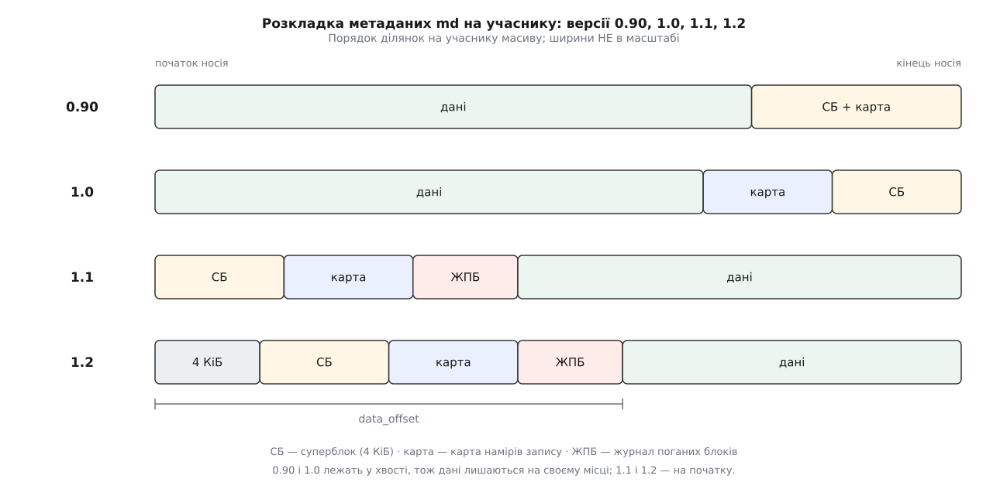

# 📋 Метадані md: суперблок, mdstat і файли керування

Це формальний бік md: точні поля суперблока з розкладкою за зсувами, точний формат рядків `/proc/mdstat` і точні імена керуючих файлів у `/sys/block/mdX/md/`. Довідка потрібна тому, що всі три поверхні читають ті самі величини різними одиницями — суперблок міряє сектори, `mdstat` друкує кілобайти, sysfs плутає одне з одним у сусідніх файлах, — і помилка в одиницях тут коштує дорожче за помилку в синтаксисі.

Усе нижче звірено з мейнлайновими джерелами: `include/uapi/linux/raid/md_p.h` (обидва формати суперблока), `drivers/md/md.c` (завантаження суперблока, `/proc/mdstat`, атрибути sysfs), `drivers/md/raid5.c`, `block/badblocks.c` і `Documentation/admin-guide/md.rst`.

---

## 1. Де на учаснику лежать метадані



*Версія суперблока — це передусім його адреса; поля 1.0, 1.1 і 1.2 однакові до байта.*

```
N — довжина учасника в 512-байтових секторах

0.90   sb = (N & ~127) − 128     останній 64-КіБ блок носія (ужито 4 КіБ із 64 КіБ)
1.0    sb = (N − 16) & ~7        8 КіБ від кінця, вирівняно вниз на 4 КіБ
1.1    sb = 0                    на самому початку носія
1.2    sb = 8                    4 КіБ від початку — місце завантажувальному секторові
```

`1.2` — усталений вибір `mdadm`. У 0.90 суперблок займає рівно 4 КіБ; у 1.x — 256 байтів плюс масив ролей, і при найбільшому дозволеному `max_dev` це дає рівно ті самі 4 КіБ.

## 2. Суперблок 1.x — `struct mdp_superblock_1`

Усі поля little-endian незалежно від машини. Зсуви — від початку суперблока.

**Спільна частина масиву, байти 0–127.** Однакова на всіх учасниках.

| зсув | поле | тип | значення |
| --- | --- | --- | --- |
| 0 | `magic` | le32 | `0xa92b4efc`; на носії — `fc 4e 2b a9` |
| 4 | `major_version` | le32 | `1` |
| 8 | `feature_map` | le32 | набір бітів, таблиця нижче |
| 12 | `pad0` | le32 | завжди `0` |
| 16 | `set_uuid` | u8[16] | UUID масиву — посвідчення, за яким учасники впізнають одне одного |
| 32 | `set_name` | char[32] | ім'я масиву; `mdadm` пише сюди `хост:ім'я` |
| 64 | `ctime` | le64 | нижні 40 бітів — секунди, верхні 24 — мікросекунди або нуль |
| 72 | `level` | le32 | `0`, `1`, `4`, `5`, `6`, `10`; `-1` — linear, `-4` — multipath |
| 76 | `layout` | le32 | розкладка: для raid5 — номер алгоритму, для raid10 — near/far/offset |
| 80 | `size` | le64 | корисна довжина учасника в секторах |
| 88 | `chunksize` | le32 | шматок у секторах (не в байтах!) |
| 92 | `raid_disks` | le32 | повний склад масиву |
| 96 | `bitmap_offset` | le32 **зі знаком** | сектори від початку суперблока до карти намірів; значуще лише з бітом `1` |
| 96 | `ppl.offset` / `ppl.size` | le16 + le16 | те саме поле в об'єднанні, коли стоїть біт `1024` |
| 100 | `new_level` | le32 | далі до 127 — параметри перебудови геометрії, значущі лише з бітом `4` |
| 104 | `reshape_position` | le64 | докуди дійшла перебудова, в адресах масиву |
| 112 | `delta_disks` | le32 | зміна числа учасників |
| 116 | `new_layout` | le32 | |
| 120 | `new_chunk` | le32 | у секторах |
| 124 | `new_offset` | le32 **зі знаком** | поправка до `data_offset` у новій розкладці; своя на кожному учасникові |

**Про цей носій, байти 128–191.** Своє на кожному учасникові.

| зсув | поле | тип | значення |
| --- | --- | --- | --- |
| 128 | `data_offset` | le64 | сектор, з якого починаються дані |
| 136 | `data_size` | le64 | скільки секторів по тому віддано під дані |
| 144 | `super_offset` | le64 | сектор, де лежить **цей** суперблок |
| 152 | `recovery_offset` / `journal_tail` | le64 | докуди відбудовано учасника; на журнальному носії — хвіст журналу |
| 160 | `dev_number` | le32 | сталий номер носія; **не** роль у масиві |
| 164 | `cnt_corrected_read` | le32 | скільки помилок читання виправлено перезаписом |
| 168 | `device_uuid` | u8[16] | ставить простір користувача, ядро не дивиться |
| 184 | `devflags` | u8 | біт 0 — `WriteMostly1`, біт 1 — `FailFast1` |
| 185 | `bblog_shift` | u8 | зсув від секторів до одиниці журналу поганих блоків |
| 186 | `bblog_size` | le16 | скільки секторів відведено під журнал |
| 188 | `bblog_offset` | le32 **зі знаком** | сектори від суперблока до журналу; `0` — журналу немає |

**Стан масиву, байти 192–255, і ролі.**

| зсув | поле | тип | значення |
| --- | --- | --- | --- |
| 192 | `utime` | le64 | час останнього оновлення, у тій самій пакованій формі |
| 200 | `events` | le64 | **лічильник подій** — те число, за яким збирання обирає свіжий стан |
| 208 | `resync_offset` | le64 | дані до цього зсуву відомо синхронні; усі одиниці — масив чистий |
| 216 | `sb_csum` | le32 | контрольна сума |
| 220 | `max_dev` | le32 | скільки чарунок у масиві ролей; ядро вимагає `max_dev ≤ 1920` |
| 224 | `logical_block_size` | le32 | логічний блок масиву; поле додано нещодавно, на старших ядрах ці байти — просто заповнення |
| 256 | `dev_roles[]` | le16 × `max_dev` | роль кожного носія, індекс — `dev_number` |

Контрольна сума рахується так: поле `sb_csum` обнуляють, складають 32-бітні слова від початку до `256 + 2·max_dev`, згортають 64-бітну суму в 32 біти додаванням половин.

| `feature_map` | значення | що означає |
| --- | --- | --- |
| `MD_FEATURE_BITMAP_OFFSET` | 1 | `bitmap_offset` значущий — карта намірів усередині метаданих |
| `MD_FEATURE_RECOVERY_OFFSET` | 2 | `recovery_offset` треба поважати: учасник відбудований не весь |
| `MD_FEATURE_RESHAPE_ACTIVE` | 4 | триває перебудова геометрії |
| `MD_FEATURE_BAD_BLOCKS` | 8 | журнал поганих блоків не порожній |
| `MD_FEATURE_REPLACEMENT` | 16 | носій заміщає чинного учасника |
| `MD_FEATURE_RESHAPE_BACKWARDS` | 32 | перебудова йде з кінця до початку |
| `MD_FEATURE_NEW_OFFSET` | 64 | `new_offset` треба поважати |
| `MD_FEATURE_RECOVERY_BITMAP` | 128 | відбудова часткова, за картою |
| `MD_FEATURE_CLUSTERED` | 256 | масив кластерний |
| `MD_FEATURE_JOURNAL` | 512 | у масиві є журнальний носій |
| `MD_FEATURE_PPL` | 1024 | журнал часткової парності; поле `96` читається як `ppl` |
| `MD_FEATURE_MULTIPLE_PPLS` | 2048 | кілька таких журналів |
| `MD_FEATURE_RAID0_LAYOUT` | 4096 | у raid0 поле `layout` значуще |

| значення в `dev_roles[]` | зміст |
| --- | --- |
| `0x0000`…`0xff00` | номер ролі в масиві |
| `0xfffd` | `MD_DISK_ROLE_JOURNAL` — журнальний носій |
| `0xfffe` | `MD_DISK_ROLE_FAULTY` — визнаний несправним |
| `0xffff` | `MD_DISK_ROLE_SPARE` — запасний, ролі не має |

## 3. Суперблок 0.90 — `mdp_super_t`

4096 байтів = 1024 32-бітні слова, чотири блоки: спільна незмінна частина (слово 0), стан масиву (слово 32), параметри рівня (слово 64), 27 дескрипторів носіїв (слово 128) і копія власного дескриптора (слово 992). Головна відмінність від 1.x — **поля в порядку байтів машини**, тому масив, створений на big-endian, на little-endian без `mdadm --assemble --update=byteorder` не читається.

| зсув | поле | зсув | поле |
| --- | --- | --- | --- |
| 0 | `md_magic` — `0xa92b4efc` | 128 | `utime` |
| 4 | `major_version` = 0 | 132 | `state` — біти нижче |
| 8 | `minor_version` = 90 | 136 | `active_disks` |
| 12 | `patch_version` | 140 | `working_disks` |
| 16 | `gvalid_words` | 144 | `failed_disks` |
| 20 | `set_uuid0` | 148 | `spare_disks` |
| 24 | `ctime` | 152 | `sb_csum` |
| 28 | `level` | 156 | `events_lo` |
| 32 | `size` — учасник **у кілобайтах** | 160 | `events_hi` |
| 36 | `nr_disks` | 164 | `cp_events_lo` |
| 40 | `raid_disks` | 168 | `cp_events_hi` |
| 44 | `md_minor` | 172 | `recovery_cp` |
| 48 | `not_persistent` | 176 | `reshape_position` (u64) |
| 52 | `set_uuid1` | 184 | `new_level` |
| 56 | `set_uuid2` | 188 | `delta_disks` |
| 60 | `set_uuid3` | 192 | `new_layout` |
| | | 196 | `new_chunk` — **у байтах** |

Далі йдуть параметри рівня (зсув 256 — `layout`, 260 — `chunk_size` **у байтах**, 264 — `root_pv`, 268 — `root_block`), таблиця з 27 дескрипторів носіїв від зсуву 512 і копія власного дескриптора на зсуві 3968.

UUID тут розірваний: перша чверть у слові 5 (зсув 20), решта — у словах 13–15 (зсуви 52–63). Лічильник подій теж складається з двох слів, і порядок половин залежить від порядку байтів машини.

Дескриптор носія (128 байтів): `number` +0, `major` +4, `minor` +8, `raid_disk` +12 (роль), `state` +16.

| біти `state` масиву | | біти `state` носія | |
| --- | --- | --- | --- |
| `MD_SB_CLEAN` | 0 | `MD_DISK_FAULTY` | 0 |
| `MD_SB_ERRORS` | 1 | `MD_DISK_ACTIVE` | 1 |
| `MD_SB_CLUSTERED` | 5 | `MD_DISK_SYNC` | 2 |
| `MD_SB_BITMAP_PRESENT` | 8 | `MD_DISK_REMOVED` | 3 |
| | | `MD_DISK_WRITEMOSTLY` | 9 |
| | | `MD_DISK_FAILFAST` | 10 |
| | | `MD_DISK_JOURNAL` | 18 |

Межі формату: у структурі 27 дескрипторів (`MD_SB_DISKS`), довідка `mdadm` називає стелю 28 учасників; `size` — 32-бітове поле в кілобайтах, і `mdadm` обмежує учасника 2 ТБ. Ролі й дані про носіїв записані таблицею, а не масивом ролей, тому формат не переживає ані широких масивів, ані великих носіїв — саме тому усталеним став 1.2.

## 4. Журнал поганих блоків

На носії — суцільний масив 64-бітних чарунок за адресою `bblog_offset` (сектори від суперблока), довжиною `bblog_size` секторів; ядро читає не більш як одну сторінку, тобто 4 КіБ = 512 записів. `mdadm` типово резервує 8 секторів.

```
запис на носії (le64):
   біти 0…9    довжина в одиницях (1 << bblog_shift) секторів
   біти 10…63  початковий сектор, теж в одиницях (1 << bblog_shift)
   0xFFFFFFFFFFFFFFFF — кінець списку (вільні чарунки залиті одиницями)

той самий запис у пам'яті ядра (block/badblocks.c):
   біти 0…8    довжина − 1  (BB_LEN_MASK, отже 1…512 секторів)
   біти 9…62   початковий сектор (BB_OFFSET_MASK)
   біт  63     підтверджено (BB_ACK_MASK) — запис уже ліг на носій
```

Дві розкладки різні, і плутати їх не можна: на носії довжина записана як є, у пам'яті — на одиницю менша. Читає список `mdadm --examine-badblocks <пристрій>`, живий вигляд — у sysfs-файлах `bad_blocks` і `unacknowledged_bad_blocks` учасника, парами «початок довжина» в секторах.

## 5. `/proc/mdstat`

Текстовий знімок, який ядро складає в момент читання ([псевдо-ФС](root:sys-unix/pseudo-filesystems) — файл існує лише як виклик функції). Машинних гарантій формат не дає; для програм є sysfs.

```
Personalities : [raid1] [raid6] [raid5] [raid4]
md0 : active raid5 sdf1[5] sde1[4] sdd1[3](W) sdc1[2] sdb1[1] sda1[0](F)
      7813772800 blocks super 1.2 level 5, 512k chunk, algorithm 2 [5/4] [_UUUU]
      [==>..................]  recovery = 12.7% (248651392/1953443200) finish=97.4min speed=291640K/sec
      bitmap: 3/15 pages [12KB], 4096KB chunk

unused devices: <none>
```

| елемент | зміст |
| --- | --- |
| `Personalities` | які рівні зараз завантажені як модулі |
| `md0 :` | ім'я масиву |
| `active` / `inactive` / `broken` | чи є в масиві драйвер рівня; `(read-only)`, `(auto-read-only)` — режим |
| `sdb1[1]` | учасник і його `dev_number` у квадратних дужках — **не** роль; у прикладі `sdf1[5]` саме відбудовується на місце вибулого `sda1[0]` |
| `7813772800 blocks` | обсяг у **кілобайтах** (ядро ділить сектори навпіл) |
| `super 1.2` | версія метаданих; для 0.90 не друкується взагалі, для чужих — `super external:imsm` |
| `[5/4]` | повний склад / скільки учасників справді в строю |
| `[_UUUU]` | по символу на роль: `U` — синхронний, `_` — бракує |

| позначка після імені | зміст |
| --- | --- |
| `(W)` | write-mostly — читати з нього лише за потреби |
| `(J)` | журнальний носій |
| `(F)` | несправний |
| `(S)` | запасний (ролі в масиві не має) |
| `(R)` | заміщувач чинного учасника |

Хвіст другого рядка складає сам рівень: `raid0` друкує ` 512k chunks`, `linear` — ` 64k rounding`, `raid1` — лише `[n/m] [UU]`, `raid5` і `raid6` — ` level 5, 512k chunk, algorithm 2` перед складом, `raid10` — ` 512K chunks 2 near-copies` або ` 2 far-copies` / ` 2 offset-copies`.

Рядок поступу з'являється лише під час роботи: смужка на 20 позицій, потім слово операції — `resync`, `recovery`, `check` або `reshape`, — відсоток, пара «зроблено/усього» **в кілобайтах**, оцінка часу в хвилинах і швидкість у КіБ/с. Замість смужки може стояти `resync=DELAYED` (черга за іншим масивом на тих самих носіях) або `resync=PENDING` (масив ще не запущено на запис).

Рядок карти намірів: `bitmap: <сторінок ужито>/<усього> pages [<пам'яті>KB], <розмір>KB chunk`; для карти в окремому файлі додається `, file: <шлях>`.

## 6. `/sys/block/mdX/md/`

Один файл — одна величина, [як і скрізь у моделі пристроїв sysfs](root:sys-unix/sysfs-device-model). Це єдина поверхня, придатна для програм.

| файл | одиниця | зміст |
| --- | --- | --- |
| `level`, `raid_disks`, `layout` | — | рівень, повний склад, розкладка |
| `chunk_size` | байти | шматок |
| `array_size`, `component_size` | кілобайти | обсяг масиву й корисна частина одного учасника |
| `metadata_version` | — | `0.90`, `1.0`…`1.2`, `none`, `external:imsm` |
| `uuid` | — | UUID масиву |
| `degraded` | — | скільки учасників бракує; `0` — повний склад |
| `array_state` | — | `clear`, `inactive`, `suspended`, `readonly`, `read-auto`, `clean`, `active`, `write-pending`, `active-idle`, `broken` |
| `safe_mode_delay` | секунди | скільки простою чекати, перш ніж позначити масив чистим (усталено `0.200`) |
| `consistency_policy` | — | `none`, `resync`, `bitmap`, `journal`, `ppl` |
| `max_read_errors` | — | стеля виправлених помилок читання, по якій учасника виключають (усталено `20`) |
| `resync_start`, `reshape_position` | сектори | звідки починати синхронізацію; докуди дійшла перебудова |

Кожен запис у `safe_mode_delay` варто зважувати: перехід «брудний → чистий» коштує запису суперблока на **всіх** учасниках, тому нуль тут означає постійне переписування метаданих.

| керування синхронізацією | одиниця | зміст |
| --- | --- | --- |
| `sync_action` | — | читання: `idle`, `resync`, `recover`, `check`, `repair`, `reshape`, `frozen`; запис — ті самі слова, якими операцію запускають і спиняють |
| `last_sync_action` | — | що робилося востаннє |
| `sync_completed` | сектори | `<зроблено> / <усього>` або `none` |
| `sync_speed` | КіБ/с | поточна швидкість, усереднена |
| `sync_speed_min`, `sync_speed_max` | КіБ/с | межі; слово `system` повертає загальносистемне значення |
| `sync_min`, `sync_max` | сектори | звузити `check`/`repair` до діапазону |
| `mismatch_cnt` | сектори | скільки розбіжностей знайшов `check` або переписав `repair` |
| `suspend_lo`, `suspend_hi` | сектори | вікно, у якому ввід-вивід затримується (raid4/5/6) |

Дросель має три режими: доки швидкість нижча за `sync_speed_min`, синхронізацію не гальмують ніколи; між мінімумом і максимумом її притримують лише тоді, коли масив зайнятий чужим уводом-виводом; вище максимуму — завжди. Загальносистемні значення живуть у `/proc/sys/dev/raid/speed_limit_min` (усталено `1000`) і `speed_limit_max` (`200000`) — звичайні [параметри ядра, які крутять на ходу](root:sys-unix/sysctl-tunables).

> 🔧 **Навіщо це.** Ненульовий `mismatch_cnt` на дзеркалі сам собою ще не діагноз. Якщо в мить, коли `check` читав ту саму адресу з двох носіїв, туди йшов запис — типово зі свопу або з `O_DIRECT`, — копії законно розійдуться на час польоту запису, і лічильник це чесно порахує. Тривожним він стає тоді, коли росте від проходу до проходу на спокійному масиві або коли з ним разом ідуть помилки читання в журналі ядра.

| raid5/raid6 | одиниця | зміст |
| --- | --- | --- |
| `stripe_cache_size` | смуг | розмір кешу смуг, від `17` до `32768`, усталено `256`; пам'ять ≈ значення × 4 КіБ × число учасників |
| `stripe_cache_active` | смуг | скільки з них зараз зайнято (лише читання) |
| `preread_bypass_threshold` | — | лічильник справедливості між чергою повного запису смуги й чергою смуг із передчитанням; усталено `1`, `0` вимикає обхід |
| `journal_mode` | — | `write-through` або `write-back` для журнального носія |
| `group_thread_cnt`, `skip_copy`, `rmw_level` | — | важелі продуктивності: потоки обробки, обхід зайвого копіювання, вибір між «прочитати-змінити-записати» й «дочитати смугу» |

| `bitmap/` | одиниця | зміст |
| --- | --- | --- |
| `location` | — | `none`, `file` або `+N`/`-N` — сектори від суперблока, зі знаком; запис сюди додає або знімає карту на живому масиві |
| `chunksize` | байти | скільки даних покриває один біт |
| `time_base` | секунди | як часто демон скидає біти |
| `backlog` | запитів | стеля відкладених записів на write-mostly учасників; `0` вимикає |
| `metadata` | — | `internal` або `external:…` |
| `can_clear` | — | `true`/`false` — чи вільно зараз чистити біти |
| `max_backlog_used`, `space` | — | пік відкладених записів; скільки секторів відведено під карту |

| `dev-<носій>/` | одиниця | зміст |
| --- | --- | --- |
| `state` | — | `faulty`, `in_sync`, `writemostly`, `blocked`, `spare`, `write_error`, `want_replacement`, `replacement`, `journal`, `external_bbl`, `failfast`; запис вмикає прапорець, запис із `-` спереду знімає, а слова `remove` й `re-add` виймають і повертають носія |
| `slot` | — | роль у масиві або `none` |
| `offset` | **сектори** | те саме, що `data_offset` у суперблоці |
| `size` | **кілобайти** | скільки по тому віддано під дані |
| `errors` | — | лічильник помилок читання, який звіряють із `max_read_errors` |
| `recovery_start` | сектори | докуди відбудовано; `none` рівносильне «синхронний» |
| `bad_blocks`, `unacknowledged_bad_blocks` | сектори | пари «початок довжина» |
| `ppl_sector`, `ppl_size` | сектори | де на цьому носії лежить журнал часткової парності |
| `block` | — | символьне посилання на сам блоковий пристрій |

Поруч із теками `dev-sdb1` лежать посилання `rd0`, `rd1`, … — по одному на зайняту роль. Пастка з одиницями тут найгрубіша: `offset` рахує сектори, а сусідній `size` — кілобайти.

## 7. Прочитати метадані без mdadm

```bash
# суперблок 1.2 — на 8-му секторі; магія у перших чотирьох байтах
dd if=/dev/sdb1 bs=512 skip=8 count=1 2>/dev/null | od -An -tx1 -N 16
#  fc 4e 2b a9 01 00 00 00 01 00 00 00 00 00 00 00
#  └ magic ──┘ └ version ┘ └ feature_map = 1 — карта намірів

# лічильник подій: 8 байтів зі зсуву 200 всередині суперблока
dd if=/dev/sdb1 bs=1 skip=$((8 * 512 + 200)) count=8 2>/dev/null | od -An -tu8

# те саме з розшифруванням усіх полів
mdadm --examine /dev/sdb1
mdadm --examine-badblocks /dev/sdb1
```

Для форматів `1.0` і `0.90` зсув суперблока рахують від кінця носія за формулами з §1, а не шукають магію перебором: та сама сигнатура може лишитися від попереднього, розібраного масиву й збити пошук з пантелику.
