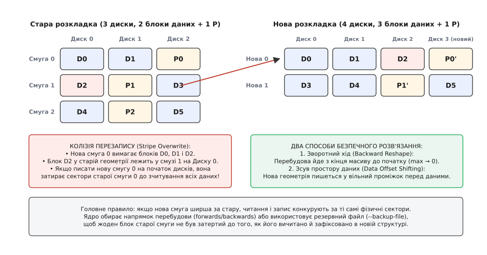
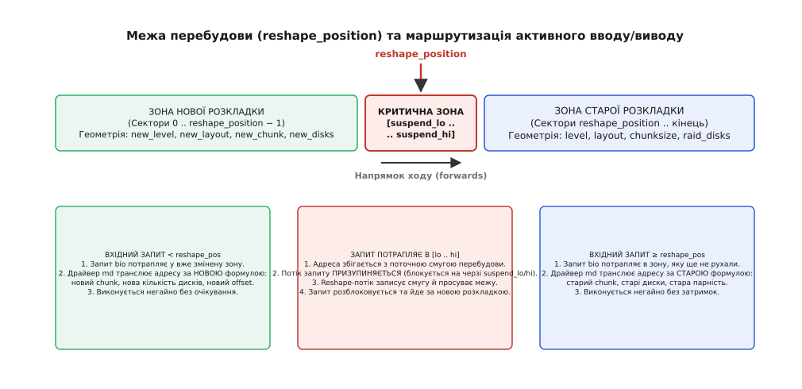
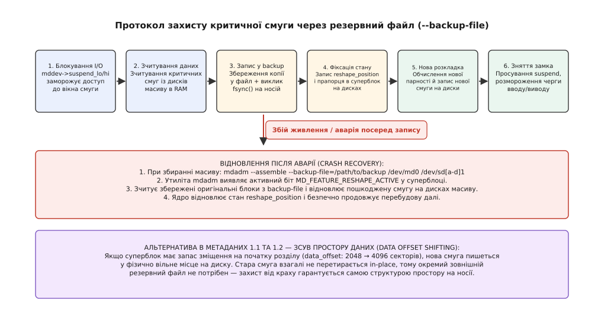
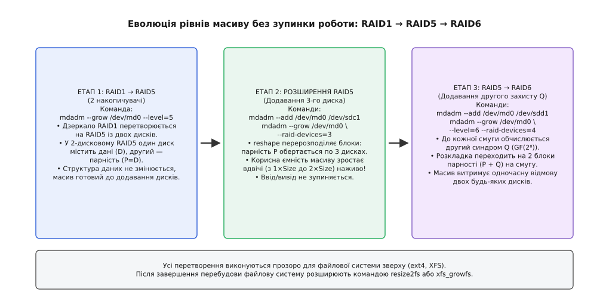

# Перебудова масиву md наживо: --grow, reshape_position і резервний файл

<preknowlist>
- [Програмний RAID у Linux: md, рівні масиву й відновлення](topic:sys-unix/md-raid) — базові структури масиву md, суперблок, механіка парності XOR та синдрому Q Ріда–Соломона.
- [Блоковий пристрій: сектори, блоки й черга запитів](topic:sys-unix/block-device-model) — модель блокового вводу/виводу, структури `bio`, трансляція секторів.
- [Файл пристрою: символьний і блоковий](topic:sys-unix/device-file-model) — файловий інтерфейс до накопичувачів і робота з сирими розділами.
- [Кеш сторінок, fsync і довговічність запису](topic:sys-unix/page-cache-durability) — бар'єри запису, скидання кешів диска та збереження стану при аваріях.
- [Модель пристроїв у sysfs](topic:sys-unix/sysfs-device-model) — керування станом підсистем ядра через віртуальні файли в `/sys`.
- [Розділи диска: таблиця розділів і вирівнювання](topic:sys-unix/disk-partitions) — зміщення секторів і резервування місця на початку розділу.
</preknowlist>

## Зміна фундаменту під навантаженням

Сервер баз даних вичерпує дисковий простір. Масив із трьох накопичувачів RAID5 заповнений на дев'яносто дев'ять відсотків, але в дисковому кошику сервера є вільні слоти, а на складі лежать нові накопичувачі. Класичне розв'язання цієї проблеми відоме десятиліттями: зупинити базу даних, демонтувати файлову систему, зробити повний резервний архів на зовнішнє сховище, перерозмітити масив на чотири диски, відформатувати нову файлову систему й розгорнути бекап назад.

Для сховища на двадцять терабайтів така процедура означає п'ятнадцять-двадцять годин повного простою сервісу. У сучасному цілодобовому виробництві подібна розкіш неприпустима. Єдина прийнятна вимога — вставити четвертий накопичувач у слот і виконати розширення без жодної секунди відключення бази даних, без розмонтування файлової системи та зі збереженням повної гарантії цілісності кожного байта навіть у разі раптового зникнення електроживлення.

На перший погляд, це завдання здається майже нездійсненним. Масив RAID5 розподіляє блоки даних та контрольні суми парності смугами (stripes) за жорсткою математичною формулою. У масиві з трьох дисків кожна смуга містить два блоки корисних даних та один блок парності. Якщо додати четвертий диск, кожна нова смуга повинна містити вже три блоки даних та один блок парності.

Це означає, що зміщення кожного окремого блоку даних у межах усього дискового простору має змінитися. Блок, який раніше лежав на першому диску в десятій смузі, у новій геометрії повинен переїхати на другий диск у сьому смугу. І цей глобальний перерахунок та фізичне переписування мільйонів секторів на дисках мають відбуватися одночасно з тим, як прикладні програми продовжують читати й записувати дані у випадкові адреси того самого масиву.

Драйвер ядра Linux `md` (від англ. *multiple devices* — множинні пристрої) вирішує це завдання за допомогою механізму динамічної перебудови — `reshape`. Як цей механізм еволюціонував від перших експериментів Ніла Брауна до сучасної безшовної підсистеми ядра, докладно описано в історичному нарисі: [звідки взялася жива перебудова](topic:sys-unix/md-reshape/hist-reshape-evolution.md).

## Виміри перебудови: що і куди змінюється

Операція перебудови в Linux не обмежується простим збільшенням кількості дисків. Утиліта `mdadm` із прапорцем `--grow` реалізує ціле сімейство перетворень геометрії дискового масиву, кожне з яких вимагає специфічного математичного алгоритму реорганізації блоків.

Розглянемо основні типи перебудови, які підтримує драйвер `md`:

### 1. Зміна кількості дисків-учасників (`--raid-devices`)

Найпоширеніший сценарій — розширення масиву RAID5 або RAID6 додаванням нових накопичувачів. При додаванні дисків корисна ємність масиву збільшується, а ширина смуги (stripe width) стає більшою. Можлива й зворотна операція — зменшення кількості дисків (наприклад, для виведення застарілих накопичувачів з експлуатації), за умови що файлова система зверху була попередньо зменшена й обсяг даних уміщається в нові межі.

### 2. Міграція рівнів RAID (`--level`)

Драйвер `md` дозволяє змінювати рівень надлишковості без знищення наявних даних:
* **RAID1 → RAID5:** Дзеркало з двох накопичувачів перетворюється на 2-дисковий RAID5, де один диск несе дані, а другий — парність XOR. Оскільки парність двох дисків дорівнює даним першого диска, структура блоків не вимагає переміщення. Після цього до масиву додається третій диск, і запускається повноцінна перебудова, що подвоює доступну ємність.
* **RAID5 → RAID6:** До наявного масиву RAID5 додається ще один накопичувач, і драйвер обчислює для кожної смуги другий незалежний синдром парності Q на основі коду Ріда–Соломона в скінченному полі Галуа GF(2⁸). Це підвищує надійність сховища до стійкості проти одночасної відмови двох дисків.
* **RAID0 → RAID4/RAID5/RAID6:** Ненадлишковий масив зі смугами (stripe set) отримує додаткові диски парності без переривання роботи, набуваючи відмовостійкості.
* **RAID4 ↔ RAID5:** Зміна схеми розміщення парності між виділеним диском (RAID4) та циклічним обертанням по всіх дисках (RAID5).

### 3. Зміна розміру блоку чергування (`--chunk`)

Розмір чанка визначає, скільки послідовних секторів записується на один диск перед тим, як потік даних перейде на наступний накопичувач смуги. Якщо початково масив було створено з чанком 64 Кілобайти для дрібних файлів, а згодом характер навантаження змінився на потокове відео або великі аналітичні бази даних, розмір чанка можна змінити наживо (наприклад, збільшити до 512 КіБ або 1 Мегабайта). Це оптимізує швидкість послідовного читання за рахунок зменшення кількості звернень до контролерів дисків.

При зміні розміру чанка загальна кількість фізичних рядків смуг на накопичувачах змінюється у зворотно пропорційному відношенні. Збільшення чанка вчетверо означає, що кожна нова смуга вміщує вчетверо більше даних, що вимагає тотального перерахунку зсувів кожного блоку за новою модульною сіткою.

### 4. Зміна внутрішньої розкладки (`--layout`)

Для масивів RAID5 існують різні алгоритми розподілу парності між накопичувачами: `left-symmetric`, `right-symmetric`, `left-asymmetric` та `right-asymmetric`. Найбільш продуктивною для послідовного доступу в Linux є симетрична ліва схема (`left-symmetric`), де блоки даних ідуть послідовно через усі диски, перериваючись лише блоком парності. Під час перебудови драйвер може змінити застарілу або неоптимальну розкладку на сучасну.

Повний довідник параметрів командного рядка утиліти `mdadm` та керуючих атрибутів ядра зібрано в окремому документі: [параметри --grow, sysfs і суперблок](topic:sys-unix/md-reshape/api-md-reshape.md).

## Колізія перезапису та геометрія смуг

Щоб зрозуміти, чому жива перебудова масиву є однією з найскладніших задач системного програмування ядра, розглянемо фізичне розміщення секторів на накопичувачах під час розширення 3-дискового RAID5 до 4-дискового масиву.

У масиві з трьох дисків (диски 0, 1, 2) дані розбиті на смуги по 2 блоки даних та 1 блок парності P.
Розглянемо перші три смуги старої розкладки:
* **Стара смуга 0:** Блок даних `D0` на диску 0, `D1` на диску 1, парність `P0` на диску 2.
* **Стара смуга 1:** Блок даних `D2` на диску 0, парність `P1` на диску 1, блок даних `D3` на диску 2.
* **Стара смуга 2:** Парність `P2` на диску 0, блок даних `D4` на диску 1, блок даних `D5` на диску 2.

Тепер ми додаємо диск 3. У 4-дисковому масиві кожна смуга повинна містити вже 3 блоки даних та 1 блок парності:
* **Нова смуга 0:** Повинна містити блоки `D0`, `D1`, `D2` та нову парність `P0' = D0 ⊕ D1 ⊕ D2`.
* **Нова смуга 1:** Повинна містити блоки `D3`, `D4`, `D5` та нову парність `P1' = D3 ⊕ D4 ⊕ D5`.



*Нова смуга ширша за стару: запис нової геометрії на початок масиву затирає блоки старих смуг ще до їхнього зчитування, якщо не використовувати зворотний напрямок ходу або зсув зміщення даних.*

Погляньмо на те, що станеться, якщо ядро почне записувати нову розкладку з нульового сектора дисків у звичайному прямому напрямку (forward):

1. Для формування нової смуги 0 ядру потрібні блоки `D0`, `D1` та `D2`.
2. Блоки `D0` та `D1` лежать на дисках 0 та 1 у фізичному зміщенні смуги 0.
3. Але блок `D2` лежить на диску 0 у фізичному зміщенні старої смуги 1!
4. Коли нова смуга 0 записується на диски 0, 1, 2, 3 за нульовим зміщенням, вона переписує фізичні сектори старої смуги 0.
5. Але на наступному кроці, коли формується нова смуга 1, їй потрібні блоки `D3`, `D4`, `D5`.
6. Блок `D3` лежав на диску 2 у старій смузі 1. Але якщо розмір нової смуги менший або зміщений, запис нових блоків неминуче затре сектори старої смуги 1 ще до того, як ядро встигне зчитати звідти оригінальні дані!

Це явище зветься **колізією перекриття смуг** (stripe overlapping collision). Оскільки нова геометрія упаковує дані щільніше (3 блоки даних на смугу замість 2), нова позиція даних випереджає стару позицію на фізичному носії.

### Вибір напрямку перебудови (Reshape Direction)

Щоб уникнути руйнівного перезапису незчитаних даних, ядро аналізує співвідношення старої та нової геометрії й обирає напрямок руху:

* **Зворотний хід (`backwards`):** Застосовується при розширенні кількості дисків або збільшенні розміру чанка. Перебудова починається з найвищого сектора адресного простору масиву і рухається до нульового. Оскільки в кінці масиву на новому диску є вільне, ще не задіяне місце, остання нова смуга записується у сектори, які раніше взагалі не містили корисних даних. Завдяки цьому запис нової смуги ніколи не затирає старі дані, що лежать нижче за адресою.
* **Прямий хід (`forwards`):** Застосовується при зменшенні кількості дисків (стисканні масиву) або зменшенні розміру чанка. У цьому випадку нова смуга стає вужчою, і дані переміщуються вперед, тому безпечно починати переписування з нульового сектора.

## Межа перебудови: `reshape_position` і маршрутизація I/O

Поки фоновий потік ядра переміщує гігабайти даних між дисками, масив `/dev/mdX` зобов'язаний безперервно обслуговувати звичайні операції читання та запису від операційної системи.

Для цього драйвер `md` запроваджує поняття динамічної межі — координати `reshape_position`. Ця величина вимірюється в абсолютних 512-байтових секторах масиву й зберігається у двох місцях одночасно: в оперативній пам'яті ядра (`mddev->reshape_position`) та в двійковому суперблоці на кожному диску-учаснику.

Координата `reshape_position` розділяє весь адресний простір масиву на дві ізольовані зони:
1. **Зона нової розкладки:** Сектори, які вже пройшли повну перебудову. Для них діють нові параметри (`new_level`, `new_layout`, `new_chunk`, `raid_disks + delta_disks`).
2. **Зона старої розкладки:** Сектори, до яких черга перебудови ще не дійшла. Вони обслуговуються за вихідними правилами (`level`, `layout`, `chunksize`, `raid_disks`).



*Драйвер md розділяє вхідний потік запитів: дані за межею перебудови транслюються за новою геометрією, перед нею — за старою, а запити до активної смуги блокуються в черзі suspend.*

### Алгоритм маршрутизації вхідних запитів (`bio`)

Коли шар файлової системи відправляє запит на блоковий пристрій `/dev/md0`, функція маршрутизації драйвера (наприклад, `raid5_make_request`) перевіряє сектор призначення відносно поточної межі:

```
ЯКЩО (адреса_запиту + розмір_запиту < reshape_position):
    Транслювати запит за НОВОЮ геометрією (new_chunk, new_disks, new_layout)
    Виконати ввід/вивід негайно

ІНАКШЕ ЯКЩО (адреса_запиту ≥ reshape_position + розмір_критичного_вікна):
    Транслювати запит за СТАРОЮ геометрією (chunk, raid_disks, layout)
    Виконати ввід/вивід негайно

ІНАКШЕ (запит потрапляє безпосередньо у критичне вікно перебудови):
    Призупинити потік запиту (блокування на черзі mddev->sb_wait)
    Дочекатися, поки потік reshape перепише цю смугу й оновить межу
    Розбудити потік і виконати запит за новою геометрією
```

Якщо великий запит блокового вводу/виводу (наприклад, читання розміром 1 Мегабайт) частково потрапляє в зону нової геометрії, а частково — в зону старої, драйвер `md` автоматично розщеплює структуру `bio` на два незалежні підзапити. Перша частина запиту транслюється за новими правилами, друга частина — за старими, а після завершення обох операцій підсистема `bio_endio` повертає єдиний успішний статус шару файлової системи.

### Заморожування вводу/виводу: `suspend_lo` та `suspend_hi`

Щоб виключити стан гонитви (race condition), коли програма користувача намагається оновити сектор саме в ту мікросекунду, коли ядро зчитує його для перерахунку нової парності, ядро реалізує механізм точкового блокування.

У структурі масиву виділяється вікно блокування — змінні `mddev->suspend_lo` та `mddev->suspend_hi`. Перед початком перенесення чергової порції смуг потік перебудови встановлює ці межі на відповідний діапазон секторів. Усі запити користувача, що перетинають цей вузький діапазон (зазвичай від кількох мегабайтів до кількох десятків мегабайтів), тимчасово призупиняються. Щойно нова смуга записана на диски, межі блокування зміщуються вперед, а сплячі процеси миттєво повертаються до роботи на черзі очікування `mddev->sb_wait`. Затримка для конкретного запиту користувача не перевищує кількох мілісекунд, що абсолютно непомітно для прикладного софту.

## Вікно катастрофи та резервний файл (`--backup-file`)

Найбільш критичний момент у житті дискового масиву — це фізичний запис нової смуги на місце старої.

Уявімо послідовність подій без додаткового захисту:
1. Ядро вичитало стару смугу 100 в оперативну пам'ять.
2. Ядро обчислило нові блоки даних та нову парність.
3. Драйвер відправив команду запису на диски 0, 1, 2, 3.
4. Диск 0 та диск 1 встигли записати нові сектори у свої магнітні пластини або флеш-пам'ять.
5. **У цю саму мить у серверній кімнаті зникає електроживлення або спрацьовує кнопка аварійного відключення.**
6. Сервер вимикається. Диск 2 та диск 3 не встигли записати нічого.

Що ми маємо в момент наступного ввімкнення сервера?
* Стара смуга 100 частково знищена: на дисках 0 та 1 записано нові дані, а на дисках 2 та 3 залишилися старі дані.
* Нова смуга 100 не сформована: половина її блоків відсутня, контрольна сума парності не відповідає дійсності.
* Відновити дані неможливо: стара інформація затерта, нова не дозаписана. Дані цієї смуги безповоротно втрачені!

Для запобігання цій катастрофі Ніл Браун розробив двофазний протокол транзакційного захисту за допомогою зовнішнього **резервного файлу** (`--backup-file`).



*Резервний файл гарантує збереження оригінальних блоків на незалежному носії перед перезаписом смуг: у разі раптового зникнення живлення масив відновлює пошкоджену смугу під час збирання.*

### Протокол роботи з `--backup-file`

Резервний файл являє собою невеликий тимчасовий буфер (розміром від кількох мегабайтів до кількох десятків мегабайтів), який обов'язково розміщується на **зовнішньому носії** (наприклад, на окремому системному SSD, флеш-накопичувачі або іншому масиві):

1. **Блокування:** Ядро фіксує діапазон секторів у змінних `suspend_lo`/`suspend_hi`.
2. **Зчитування:** Усі оригінальні блоки старої смуги зчитуються з дисків масиву в пам'ять.
3. **Збереження резервної копії:** Утиліта простору користувача записує зчитані старі блоки у `--backup-file` і виконує системний виклик `fsync()`. Потік ядра чекає, поки контролер зовнішнього носія підтвердить фізичне скидання кешу запису на енергонезалежний носій.
4. **Фіксація в суперблоці:** Ядро оновлює суперблок на дисках масиву, записуючи нове значення `reshape_position` та прапорець активної критичної транзакції.
5. **Запис на масив:** Тільки після того, як копія гарантовано зафіксована у файлі бекапу, ядро записує нові блоки та нову парність на фізичні диски масиву.
6. **Звільнення:** Межі блокування розсуваються, буферний слот у резервному файлі звільняється для наступної смуги.

### Відновлення після аварії (Crash Recovery)

Якщо живлення зникне на будь-якому з цих етапів, масив не зруйнується:
* При повторному старті системи адміністратор або скрипт ініціалізації запускає збирання масиву з вказуванням того самого резервного файлу:
  ```bash
  mdadm --assemble --backup-file=/root/raid-reshape.bak /dev/md0 /dev/sd[a-d]1
  ```
* Утиліта `mdadm` зчитує суперблок, бачить активний біт `MD_FEATURE_RESHAPE_ACTIVE`, відкриває `/root/raid-reshape.bak`, знаходить там збережені оригінальні блоки пошкодженої смуги, записує їх назад на диски, відновлюючи цілісність початкового стану, і безпечно продовжує перебудову з відомої точки.

## Зсув простору даних у метаданих 1.1/1.2 (`data_offset`)

Хоча схема з `--backup-file` надійно захищає дані, вона має серйозний експлуатаційний недолік: адміністратор зобов'язаний знайти зовнішній диск під резервний файл. Якщо вказати файл на тому самому масиві, виникне взаємне блокування (deadlock): запис у файл вимагатиме запису на масив, який очікує завершення операції з файлом.

Щоб позбутися потреби у зовнішньому файлі, у версіях метаданих `1.1` та `1.2` було реалізовано технологію **зсуву простору даних** (Data Offset Shifting).

У форматах 1.1 і 1.2 суперблок розміщується на початку диска, але перші блоки даних записуються не впритул до нього, а з певним системним зміщенням — `data_offset`. За замовчуванням `mdadm` встановлює це зміщення рівним 2048 секторам (1 Мегабайт) або 16384 секторам (8 Мегабайтів).

Коли запускається перебудова масиву на метаданих 1.2:
1. Утиліта `mdadm` призначає нове зміщення даних — `new_data_offset` (наприклад, 4096 секторів замість 2048).
2. Завдяки цій різниці всі нові смуги записуються у фізично вільні сектори диска, розташовані у проміжку між старим і новим зміщенням.
3. Новий запис **ніколи не накладається** на фізичні сектори старої смуги.
4. Оскільки стара смуга залишається недоторканою до повного запису нової, будь-який збій живлення є безпечним: масив просто має стару копію на старому зміщенні й частково записану нову копію на новому зміщенні.
5. Після того як усі смуги перенесені, ядро змінює робоче значення `data_offset` на `new_data_offset`, а старе місце вивільняється.

Завдяки цьому сучасні дискові масиви під керуванням Linux перебудовуються наживо без вказування прапорця `--backup-file` — захист від аварій забезпечується геометрією самого дискового простору.

## Еволюція рівнів: покрокова міграція RAID1 → RAID5 → RAID6

Розглянемо практичний життєвий цикл масиву, який починає своє існування як просте дводобове дзеркало для невеликого проекту, а згодом еволюціонує у високонадійне 4-дискове сховище корпоративного класу.



*Міграція рівнів відбувається послідовно: від дзеркала до обчислюваної парності XOR та додавання другого захисного полінома Q без зупинки доступу до файлової системи.*

### Крок 1: Перетворення RAID1 на 2-дисковий RAID5

Початковий стан: масив `/dev/md0` зібрано з дисків `/dev/sda1` та `/dev/sdb1` у режимі RAID1. На масиві працює файлова система ext4 або XFS.

Адміністратор виконує команду:
```bash
mdadm --grow /dev/md0 --level=5
```

Драйвер ядра миттєво перемикає внутрішню логіку:
* Рівень RAID1 стає рівнем RAID5 із параметром `raid_disks = 2`.
* У 2-дисковому RAID5 диск 0 несе дані, а диск 1 несе парність. Оскільки парність є сумою XOR усіх дисків даних, для одного диска даних `P = D0 ⊕ 0 = D0`. Тобто вміст диска парності повністю ідентичний диску даних — це те саме дзеркало.
* Жоден байт на дисках не переміщується. Перемикання займає кілька мілісекунд.

### Крок 2: Додавання третього диска та розширення RAID5

Тепер адміністратор підключає третій диск `/dev/sdc1` і розширює кількість активних дисків:
```bash
mdadm --add /dev/md0 /dev/sdc1
mdadm --grow /dev/md0 --raid-devices=3
```

Запускається рушій `reshape`:
1. Ядро створює потік перебудови, який починає перерозподіляти блоки за алгоритмом `left-symmetric` на 3 диски.
2. Парність P починає циклічно обертатися між трьома накопичувачами.
3. Корисний простір масиву зростає з 1×Size до 2×Size.
4. Після завершення фонового процесу адміністратор розширює файлову систему поверх блокового пристрою без розмонтування:
   ```bash
   resize2fs /dev/md0    # для ext4
   xfs_growfs /mnt/data  # для XFS
   ```

### Крок 3: Міграція з RAID5 у RAID6 (подвійна парність)

Коли обсяг даних зростає, ризик виходу з ладу другого диска під час відновлення першого стає критичним. Адміністратор додає четвертий диск `/dev/sdd1` і переводить масив у RAID6:
```bash
mdadm --add /dev/md0 /dev/sdd1
mdadm --grow /dev/md0 --level=6 --raid-devices=4
```

Драйвер ядра виконує такі операції:
1. Масив тимчасово переходить у режим RAID6 зі спеціальною проміжною розкладкою `parity-last`, де блок Q записується на новий диск без зміни положення старих блоків P та даних.
2. Потім потік перебудови проходить по кожній смузі, вичитує наявні блоки даних, обчислює стандартну парність `P = D0 ⊕ D1` та генерує другий синдром `Q` за поліномами Ріда–Соломона:
   ```
   Q = (g⁰ ⊗ D0) ⊕ (g¹ ⊗ D1)
   ```
   де `⊗` — операція множення в полі Галуа GF(2⁸), а `g` — генератор поля.
3. Блоки P та Q записуються на диски з переходом на повноцінну циклічну розкладку `left-symmetric-6`.
4. Масив отримує здатність витримувати одночасну відмову будь-яких двох накопичувачів.

Практичний сценарій виконання цих перетворень із перевіркою контрольних сум та симуляцією аварій розібрано у покроковому керівництві: [покроковий дослід із міграцією та аварійним збоєм](topic:sys-unix/md-reshape/proj-md-grow-lab.md).

## Взаємодія з картою намірів (Write-Intent Bitmap)

У звичайному режимі роботи для прискорення синхронізації після збоїв масиви md часто використовують карту намірів запису — бітмап (Write-Intent Bitmap). Бітмап ділить простір масиву на великі блоки (зазвичай по кілька мегабайтів) і встановлює біт перед кожним записом. Якщо сервер раптово перезавантажується, драйвер не перевіряє всі терабайти дисків, а пересинхронізовує лише ті ділянки, біти яких були підняті.

Проте під час перебудови масиву (`reshape`) внутрішня геометрія блоків та межі смуг кардинально змінюються. Старий бітмап, розрахований під стару кількість дисків та старий розмір чанка, стає повністю недійсним.

Тому утиліта `mdadm` під час ініціалізації `--grow` автоматично видаляє наявний внутрішній бітмап перед стартом перебудови. Намагання запустити розширення з активним зовнішнім або внутрішнім бітмапом завершується помилкою. Після того як перебудова досягає ста відсотків і статус `sync_action` повертається в `idle`, адміністратор може заново створити карту намірів під нову геометрію:

```bash
mdadm --grow /dev/md0 --bitmap=internal
```

## Керування швидкістю, sysfs і поведінка при відмовах

Жива перебудова масиву на великих дисках (наприклад, масив із шести дисків по 16 Терабайтів) може тривати від кількох десятків годин до кількох діб. Увесь цей час масив створює додаткове навантаження на дискову шину та процесор.

### Регулювання пропускної здатності

Ядро Linux балансує навантаження між фоновою перебудовою та призначеним для користувача вводом/виводом за допомогою двох регуляторів у `/sys/block/mdX/md/`:

* `sync_speed_min` (за замовчуванням 1000 КіБ/с) — гарантована нижня швидкість перебудови. Якщо дискова підсистема перевантажена запитами користувача, ядро виділяє перебудові принаймні цю смугу, щоб процес не зупинився.
* `sync_speed_max` (за замовчуванням 200 000 КіБ/с) — верхня межа швидкості. Запобігає повній монополізації дискової шини фоновим процесом у періоди нічного простою системи.

Для прискорення перебудови на потужних серверах зі швидкими накопичувачами NVMe адміністратор може збільшити ці ліміти наживо:
```bash
echo 500000 > /sys/block/md0/md/sync_speed_max
echo 100000 > /sys/block/md0/md/sync_speed_min
```

### Що відбувається при відмові накопичувача під час перебудови?

Поведінка системи в разі апаратного збою диска посеред активного процесу `reshape` залежить від поточного рівня надлишковості:

* **Відмова диска в RAID5 під час перебудови:** Оскільки розширення RAID5 вимагає повної наявності всіх блоків для перерахунку смуг, втрата одного диска переводить масив у деградований стан (degraded). Рушій `reshape` негайно **зупиняється** і переводить `sync_action` у стан очікування. Масив продовжує обслуговувати читання та запис користувача, відновлюючи втрачені блоки на льоту через операцію XOR. Проте сам процес перебудови буде заморожено доти, доки несправний диск не буде замінено новим справним накопичувачем і не завершиться відновлення деградованого масиву (`recovery`).
* **Відмова диска в RAID6 під час перебудови:** Оскільки RAID6 має два незалежні рівняння надлишковості (P та Q), втрата одного диска не зупиняє процес перебудови. Ядро продовжує обчислювати нову геометрію, відновлюючи відсутні блоки на льоту через збережений синдром парності.

## Баланс надійності та цілісності

Динамічна перебудова масиву md у Linux демонструє, як суворі математичні принципи та продумана архітектура структур даних дозволяють змінювати фундаментальні основи зберігання інформації без зупинки виробничих систем.

Поєднання точного контролю координат `reshape_position`, зонного заморожування запитів через `suspend_lo`/`suspend_hi` та захисту від збоїв живлення через технологію зміщення `data_offset` перетворило підсистему програмного RAID ядра Linux на еталон надійності для сучасних дата-центрів та хмарних інфраструктур.
