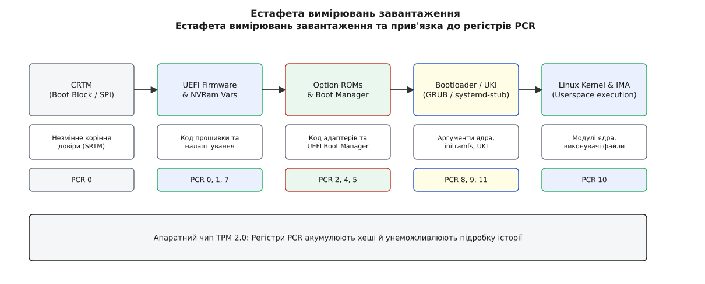
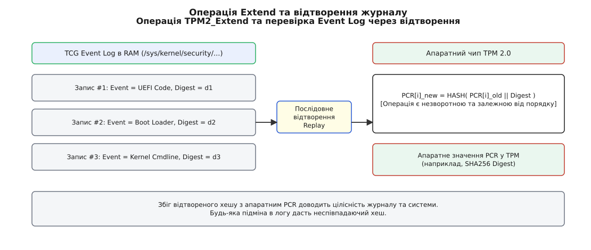
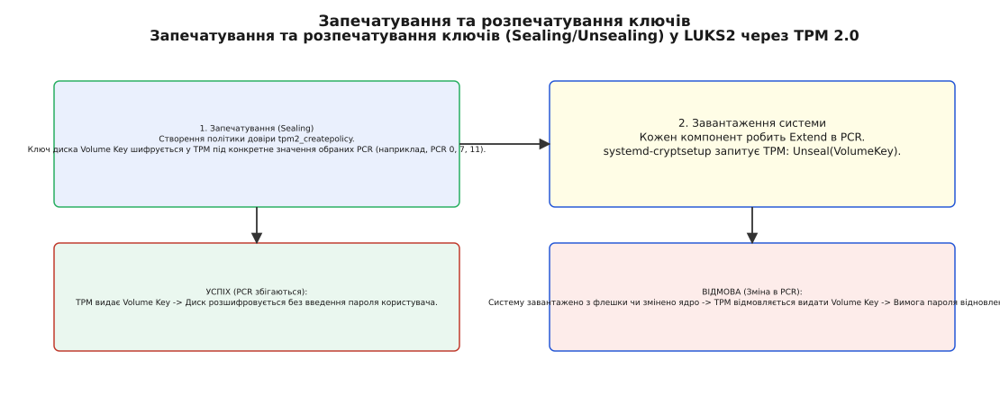

# Виміряне завантаження: регістри PCR і журнал подій

<preknowlist>
- [Secure Boot: перевірений ланцюг завантаження](topic:sys-unix/secure-boot) — перевірене завантаження забороняє виконання непідписаного коду, але не фіксує сам стан системи для сторонніх перевірок.
- [UEFI: прошивка як середовище виконання](topic:sys-unix/uefi-firmware) — прошивка керує енергонезалежною пам'яттю, таблицями ACPI та передає таблиці завантаження ядру.
- [Завантажувач і командний рядок ядра](topic:sys-unix/bootloader-and-cmdline) — завантажувач формує аргументи ядра та готує початкове середовище в пам'яті.
- [Хеш і цифровий підпис](topic:sf-security/hash-and-digital-signature) — одновимірні криптографічні функції хешування забезпечують стійкість до пошуку прообразу та колізій.
</preknowlist>

Коли комп'ютерна система вмикається, вона по черзі передає керування від одного програмного компонента до іншого: від первинної прошивки материнської плати до розширень адаптерів, далі до завантажувача ОС, від нього до ядра Linux, і нарешті — до першого процесу простору користувача `init`. У системі із захистом Secure Boot кожна ланка перевіряє криптографічний підпис наступного файлу перед його запуском. Якщо підпис дійсний — завантаження продовжується. Однак у цій схемі є фундаментальна сліпа зона: Secure Boot дає відповідь лише на питання «чи підписаний цей файл довіреним ключем», але абсолютно нічого не знає про те, **з якими саме параметрами та в якому оточенні** він був запущений.

Зловмисник із фізичним доступом або правами адміністратора може взяти абсолютно легальне, підписане дистрибутивом ядро Linux, але передати йому через завантажувач шкідливий параметр командного рядка `init=/bin/sh`, підключити модифікований початковий образ пам'яті initramfs або змінити конфігурацію прошивки UEFI. Оскільки само ядро підписане, Secure Boot успішно пропустить таку систему. Більше того, якщо віддалений сервер або контролер доступу Zero Trust запитає у працюючої машини «чи завантажилася ти у безпечному, непошкодженому стані», операційна система всередині комп'ютера не зможе це довести — адже будь-яку відповідь із простору користувача може підробити зловмисний код з правами root.

Щоб розв'язати цю проблему, було створено механізм **виміряного завантаження (Measured Boot)**. Замість того, щоб зупиняти процес при виявленні відхилень (як це робить Secure Boot), виміряне завантаження діє як криптографічний реєстратор: воно обчислює хеш (вимірює) кожного компонента перед передачею йому керування і фіксує цей хеш у спеціальному апаратному модулі, який унеможливлює підробку історії.

## Принципова відмінність: Активна відсіч проти Криптографічного запису

Щоб уявити різницю між Secure Boot та Measured Boot, звернемося до аналогії з пропускним пунктом на режимом об'єкті:

- **Secure Boot — це охоронець на дверях.** Він дивиться на перепустку (підпис) кожного, хто входить. Якщо перепустка підроблена чи відсутня — він фізично не пропускає людину всередину. Але охоронець не веде записів про те, у якій послідовності входили люди, що саме вони мали у валізах (аргументи ядра) і чи не змінили вони свій одяг у гардеробі.
- **Measured Boot — це незламний бортовий самописець («чорний ящик»).** Він не забороняє вхід і не зупиняє систему, навіть якщо людина зайшла без перепустки чи з дивною валізою. Проте перед виконанням кожного кроку система зобов'язана зняти відбиток пальця (прохешувати код та конфігурацію) і записати цей відбиток у сейф, ключ від якого скидається тільки при повному знеструмленні машини.

Якщо зловмисник пробереться в систему, його дії неминуче змінять фінальний цифровий відбиток у сейфі. Далі операційна система або віддалений сервер можуть перевірити цей відбиток: якщо він не збігається з еталонним — диск з даними відмовиться розшифровуватися, а хмарний сервер відмовить у доступі до корпоративної мережі.

Звідси випливає головне правило: **Secure Boot забезпечує локальну цілісність запуску, а Measured Boot створює криптографічний доказ стану системи для запечатування ключів та віддаленої атестації.**

## Апаратне ядро довіри: Модуль TPM 2.0 та регістри PCR

Зберігати вимірювання в звичайній оперативній пам'яті чи на жорсткому диску неможливо: будь-яка програма з правами ядра (ring 0) або зловмисний модуль могли б просто переписати збережені хеші на «правильні». Збереження відбитків має здійснюватися в ізольованому апаратному середовищі, яке не підпорядковується командній системі операційної системи.

Таким середовищем є **Trusted Platform Module (TPM 2.0)** — спеціалізований захищений мікроконтролер (або ізольований апаратний анклав всередині центрального процесора, такий як Intel PTT або AMD fTPM).

Усередині TPM розташовані спеціальні осередки пам'яті — **Platform Configuration Registers (PCR)** (регістри конфігурації платформи).

### Чому в PCR не можна просто записати значення?

Регістр PCR має принципову апаратну особливість: у нього **неможливо** виконати пряму команду запису виду `write(PCR, value)`. Якби така команда існувала, зловмисник після завантаження шкідливого коду просто відправив би чипу TPM команду «запиши в PCR 0 хеш легітимного ядра».

Єдиною апаратною операцією, якою можна змінити вміст регістра PCR під час роботи системи, є операція **TPM2_Extend**.

Математично операція `Extend` приймає номер регістра `i` та вхідний дайджест даних `Data_Digest` (наприклад, SHA-256 хеш завантажуваного ядра) і обчислює нове значення регістра шляхом конкатенації попереднього значення з новим дайджестом:

```
PCR[i]_new = HASH( PCR[i]_old || Data_Digest )
```

де `||` позначено операцію злиття байтових послідовностей (конкатенацію), а `HASH` — криптографічну функцію хешування (SHA-256 або SHA-384).

Ця операція має три ключові криптографічні властивості:

1. **Незворотність (One-Way Accumulator):** Оскільки функція `HASH` є однонапрямленою, знаючи `PCR[i]_new`, неможливо математично вирахувати попередній стан `PCR[i]_old` або "видалити" з регістра конкретне вимірювання.
2. **Некомутативність (Залежність від порядку):** Якщо змінити порядок вимірювань (наприклад, спочатку виміряти завантажувач A, а потім ядро B, чи навпаки), підсумкове значення `PCR[i]_new` буде абсолютно різним. Порядок завантаження криптографічно зафіксовано.
3. **Скидання тільки при ввімкненні (Power-On Reset):** Регістри PCR ініціалізуються нулями лише при апаратному скиданні живлення чипа. Жодний процес у просторі користувача чи ядрі не може скинути PCR у нуль під час роботи.

Детальний математичний аналіз стійкості акумулятора та доведення некомутативності операції `Extend` наведено у [математичних властивостях акумулятора PCR](topic:sys-unix/measured-boot-pcr/math-pcr-extend.md).

## Естафета вимірювань: Від CRTM до операційної системи

Процес завантаження нагадує естафету: кожна ланка перед тим, як передати керування наступній, повинна її виміряти (прохешувати) та виконати операцію `Extend` у відповідний регістр PCR чипа TPM.



*Естафета вимірювань розгортається послідовно: кожна ланка вимірює наступну перед запуском і розширює відповідні регістри PCR апаратного модуля TPM.*

Розглянемо, як розгортається цей ланцюжок від моменту подачі живлення:

### 1. Початкове коріння довіри (CRTM)
Коли ви натискаєте кнопку живлення, найперший код, який починає виконуватися на процесорі — це **Core Root of Trust for Measurement (CRTM)**. Це невеликий блок коду прошивки, що лежить у неперезаписуваній частині SPI flash-пам'яті материнської плати. Оскільки CRTM виконується першим, його нікому виміряти. Йому довіряють за умовчанням (Static Root of Trust — SRTM).

CRTM вимірює основний код прошивки UEFI та мікрокод процесора, робить `Extend` у **PCR 0** і передає керування основній прошивці UEFI.

### 2. Прошивка UEFI та Option ROM
Прошивка UEFI ініціалізує компоненти плати та продовжує естафету:
- Код прошивки та мікрокод CPU фіксуються в **PCR 0**.
- Конфігурація прошивки, налаштування SMBIOS та змінні налаштувань плати вимірюються в **PCR 1**.
- Драйвери периферійних адаптерів (Option ROM відеокарт, RAID-контролерів, мережевих карт) вимірюються в **PCR 2**, а їхні налаштування — в **PCR 3**.

### 3. Стан Secure Boot та завантажувач ОС
Перед тим як передати керування завантажувачу з диска, UEFI вимірює стан самої системи захисту:
- Змінні Secure Boot (`PK`, `KEK`, `db`, `dbx`) та статус увімкнення перевірки підписів вимірюються в **PCR 7**.
- Виконуваний файл завантажувача (наприклад, `bootx64.efi` або `grubx64.efi`) вимірюється в **PCR 4**.
- Таблиця розділів диска (GPT) та змінні завантаження UEFI (`BootOrder`) вимірюються в **PCR 5**.

### 4. Завантажувач Linux (GRUB / systemd-boot / systemd-stub)
Отримавши керування, завантажувач Linux вимірює те, що він готує для ядра:
- Командний рядок ядра (параметри `/proc/cmdline`) вимірюється в **PCR 8**.
- Образ початкової файлової системи у пам'яті (`initramfs` / `initrd`) вимірюється в **PCR 9**.
- При використанні єдиних образів ядра (Unified Kernel Image, UKI) завантажувальний модуль `systemd-stub` вимірює комбінований образ ядра, initramfs та cmdline у **PCR 11**.

### 5. Ядро Linux та простір користувача (IMA)
Після старту ядра підсистема **Integrity Measurement Architecture (IMA)** продовжує ланцюжок у простір користувача, вимірюючи бінарні файли, що запускаються через `execve`, динамічні бібліотеки `libc.so` та конфігураційні файли, записуючи їхні хеші в **PCR 10**.

Повний довідковий розподіл усіх 24 регістрів PCR специфікації TCG зібрано у [довіднику розподілу регістрів PCR](topic:sys-unix/measured-boot-pcr/api-pcr-registry.md).

> 🔧 **Навіщо це.** Якщо після оновлення конфігурації завантажувача або прошивки система раптово перестала розшифровувати диск або відхиляє атестацію, аналіз конкретного номера PCR дозволяє миттєво визначити ланку, де зламався ланцюг: зміна PCR 0/1 вказує на оновлення BIOS, PCR 7 — на зміну ключів Secure Boot, PCR 8/9 — на модифікацію параметрів ядра або образу initramfs, а PCR 11 — на оновлення UKI.

## Двошарова архітектура: Журнал подій (TCG Event Log) проти апаратного підсумку

Тут виникає практичне питання. Значення регістра PCR після завантаження являє собою один-єдиний 256-бітний криптографічний хеш (наприклад, `0x7a3f8b...`). Якщо цей хеш не збігається з очікуваним, сам по собі регістр PCR **не може відповісти**, що саме змінилося в системі — який конкретно модуль прошивки, яка змінна чи який параметр ядра спричинив розходження.

Для вирішення цієї проблеми специфікація TCG передбачає двошарову архітектуру: **апаратний акумулятор (PCR)** + **програмний журнал подій (TCG Event Log)**.



*Апаратний чип TPM зберігає лише підсумковий акумульований хеш PCR, тоді як у пам'яті RAM ведеться детальний журнал подій. Перевірка цілісності полягає у відтворенні журналу (Replay) та порівнянні з апаратним PCR.*

### Як працює журнал подій (Event Log)?

1. У процесі завантаження кожен компонент (UEFI, GRUB, systemd-stub), перш ніж виконати `TPM2_Extend`, будує в звичайній оперативній пам'яті (RAM) текстово-бінарний запис у журналі подій.
2. Запис журналу (структура `TCG_PCR_EVENT2`) містить: номер PCR, тип події, сирий хеш виміряного блоку та людську назву або шлях до файлу (наприклад, `"Kernel command line: root=/dev/nvme0n1p2 ro"`).
3. Після завантаження Linux ядро надає доступ до цього журналу через інтерфейс SecurityFS: `/sys/kernel/security/tpm0/binary_bios_measurements`.

### Механізм відтворення (Replay Verification)

Щоб перевірити, чи є журнал подій справжнім і що саме завантажилося в системі, операційна система або віддалена сторона виконують алгоритм **Replay**:

1. Перевіряльник бере нульовий вектор і послідовно читає записи з логу в RAM.
2. Для кожного запису логу перевіряльник симулює операцію `Extend`: `PCR_sim = HASH(PCR_sim || Event_Digest)`.
3. Наприкінці перевіряльник зчитує з апаратного чипа TPM дійсне значення `PCR` командою `TPM2_ReadPCR`.
4. Якщо підраховане значення `PCR_sim` точнісінько дорівнює апаратному `PCR` з чипа TPM — **журнал подій вважається автентичним**.

Якщо зловмисник спробує підробити журнал подій у пам'яті RAM (наприклад, видалить із логу згадку про шкідливий параметр ядра), відтворений хеш `PCR_sim` не збіжиться з апаратним значенням регістра TPM. А підробити апаратне значення TPM зловмисник не може через математичну незворотність операції `Extend`.

Практична реалізація власного парсера журналу подій та алгоритму відтворення мовами C і C++ розібрана у [практикумі з парсингу журналу подій](topic:sys-unix/measured-boot-pcr/proj-tpm2-eventlog-parser.md).

## Запечатування ключів (Key Sealing) та дискове шифрування LUKS2

Найбільш масовим практичним застосуванням виміряного завантаження в Linux є **запечатування ключів (Key Sealing)** для шифрування дискових розділів (LUKS2 / BitLocker).

Класичне шифрування диска вимагає від користувача введення парольної фрази (Passphrase) при кожному ввімкненні комп'ютера. Якщо пароль простий — його можна підібрати; якщо комп'ютер працює як безмоніторний сервер у дата-центрі — ввести пароль вручну при перезавантаженні взагалі неможливо.

Запечатування у TPM 2.0 дозволяє довірити збереження ключа шифрування самому апаратному чипу:



*При запечатуванні ключ шифрування диска прив'язується до конкретних регістрів PCR. TPM видає ключ для автоматичного розшифрування диска тільки в тому разі, якщо поточні вимірювання завантаження збігаються з політикам довіри.*

### Схема запечатування та розпечатування (Sealing / Unsealing):

1. **Запечатування (Sealing):** Утиліта шифрування (`systemd-cryptenroll` або `tpm2_createpolicy`) генерує випадковий майстер-ключ диска (Volume Key), передає його в TPM і задає політику: «Зашифруй цей ключ і віддавай його назад тільки тоді, коли регістри `PCR 0, 7, 11` мають конкретні значення X, Y, Z».
2. **Розпечатування (Unsealing):** Під час наступного завантаження компонент `systemd-cryptsetup` в initramfs звертається до TPM із запитом `TPM2_Unseal`.
3. **Апаратна перевірка:** TPM всередині власного кристала порівнює поточний стан регістрів `PCR 0, 7, 11` із запеченими значеннями.
   - **Якщо стан збігається** (прошивку не міняли, Secure Boot увімкнений, ядро та initramfs ті самі) — TPM віддає Volume Key, і диск розшифровується автоматично без введення пароля.
   - **Якщо стан змінився** (систему завантажили з флешки, підкинули інший initramfs або змінили налаштування BIOS) — TPM відмовляє у видачі ключа. Система зупиняється й вимагає введення резервного пароля відновлення (Recovery Key).

### Проблема ламких PCR (Fragile PCRs) та її вирішення

Класичне запечатування безпосередньо під номери `PCR 8, 9` (де GRUB вимірює командний рядок та initramfs) має серйозну практичну ваду. Щоразу, коли дистрибутив оновлює ядро чи збирає новий initramfs, вміст `PCR 8` та `PCR 9` змінюється. У результаті після звичайного оновлення системи (`apt upgrade` / `dnf upgrade`) TPM відмовляється розшифровувати диск, вважаючи оновлення атакою.

Для розв'язання цієї проблеми в екосистемі Linux застосовують два підходи:

1. **Єдині образи ядра (Unified Kernel Image, UKI):** Ядро Linux, initramfs, командний рядок та `os-release` збираються в один двійковий файл `.efi`, підписаний ключем дистрибутива. Модуль `systemd-stub` вимірює весь UKI в **PCR 11**. Це усуває розсинхронізацію між окремими файлами.
2. **Підписані політики PCR (Signed PCR Policies):** Замість запечатування під конкретне числове значення PCR, утиліта `systemd-measure` створює політику `TPM2_PolicySigned`. Дистрибутив підписує своїм приватним ключем майбутнє значення PCR 11 для нового UKI. Під час оновлення TPM перевіряє підпис політики відкритим ключем дистрибутива й дозволяє розпечатування нового ядра без перевидання секретів чи ручного введення паролів.

## Віддалена атестація (Remote Attestation) та довіра у моделі Zero Trust

Запечатування ключів працює локально на самій машині. Проте у хмарних інфраструктурах та корпоративних мережах Zero Trust виникає інша задача: віддалений сервер авторизації мусить переконатися, що клієнтський вузол завантажив безпечне ядро й не містить руткітів, **перш ніж** видати йому секретні ключі доступу до бази даних чи мережевого тунелю.

Цей процес зветься **віддаленою атестацією (Remote Attestation)**.

### Протокол віддаленої атестації TPM 2.0:

1. **Ключ засвідчення (Endorsement Key, EK):** Кожен чип TPM 2.0 має унікальну пару ключів EK, зашиту на заводі виробника (Infineon, STMicroelectronics, Intel). Виробник додає сертифікат (EK Certificate), підтверджуючи, що це справжній апаратний TPM.
2. **Ключ атестації (Attestation Key, AK / AIK):** Операційна система створює оперативний ключ атестації AK, прикріплений до EK. Сервер-засвідчувач підтверджує належність AK чипу TPM за допомогою процедури запечатування челенджу `TPM2_MakeCredential`.
3. **Запит від чекера (Nonce Challenge):** Віддалений сервер-чекер надсилає клієнту криптографічний одноразовий випадковий числове значення (Nonce) для захисту від атак повторного відтворення (Replay Attack).
4. **Команда TPM2_Quote:** Клієнтська машина викликає команду чипа `TPM2_Quote(AK, PCR_Selection, Nonce)`. Чип TPM зчитує поточні значення обраних PCR, конкатенує їх із Nonce і підписує цей блок приватною частиною ключа AK.
5. **Перевірка на сервері:** Клієнт відправляє на сервер підписаний `Quote` та свій `TCG Event Log`. Сервер перевіряє підпис AK, відтворює Event Log і переконується, що машина завантажила саме те ядро й ті налаштування, які дозволені політикою безпеки інфраструктури.

## Integrity Measurement Architecture (IMA) у просторі користувача

Виміряне завантаження не закінчується на моменті, коли ядро Linux отримує керування. Якщо після старту ядра зловмисник підмінить бінарний файл `/usr/sbin/sshd` або модифікує бібліотеку `/lib/x86_64-linux-gnu/libc.so.6`, система стане скомпрометованою.

Для поширення ланцюжка довіри на весь час роботи операційної системи в ядро Linux вбудовано підсистему **Integrity Measurement Architecture (IMA)**.

IMA перехоплює системні виклики виконання та відкриття файлів (`execve`, `mmap`, `open_exec`):
1. Перед тим як дозволити запуск будь-якої програми чи завантаження бібліотеки, IMA обчислює SHA-256 хеш файлу на диску.
2. IMA виконує операцію `Extend` цього хешу в спеціальний осередок **PCR 10** чипа TPM.
3. Запис про факт запуску програми додається до системного журналу IMA: `/sys/kernel/security/ima/ascii_runtime_measurements`.

Таким чином, у **PCR 10** акумулюється криптографічна історія абсолютно всіх програм та бібліотек, які виконувалися в системі з моменту старту ядра. Віддалений сервер під час атестації може перевірити не лише конфігурацію завантаження, а й те, чи не запускалися на машині відомі утиліти атакуючих (наприклад, `gdb`, `mimikatz` або неавторизовані сканери).

Детальний аналіз створення специфікації TCPA, еволюції від застарілого стандарту TPM 1.2 до TPM 2.0 та трансформації сприйняття технології у спільноті розкрито у [історичному нарисі розвитку Trusted Computing](topic:sys-unix/measured-boot-pcr/hist-tpm-evolution.md).

---

Виміряне завантаження перетворює процес старту комп'ютера з віроломного ланцюжка припущень на криптографічно строгий доказ. Спираючись на апаратну незворотність операції `Extend` у регістрах PCR чипа TPM 2.0 та двошарову перевірку журналу подій, сучасні системи Linux забезпечують надійний захист дискових ключів та можливість суворої атестації стану системи в архітектурах Zero Trust.
