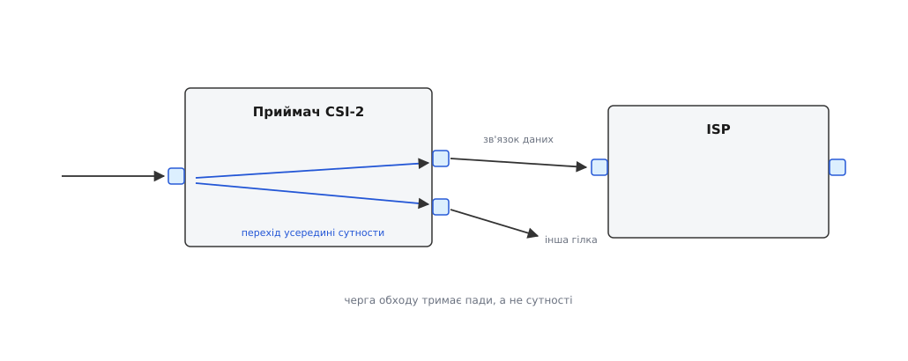
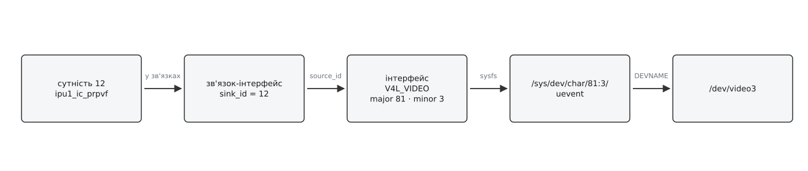

# ⚙️ Пройти граф і скласти тракт: програма на C

Ця програма робить те саме, що дві команди `media-ctl`, — вмикає зв'язки й кладе формати, — але не знає наперед жодного імені: вона читає топологію з `/dev/media0`, сама знаходить дорогу від сенсора до потрібного `/dev/videoN` і налаштовує все, що дорогою трапилося. Тобто запускається на платі, якої автор ніколи не бачив.

## Чому не сценарій із media-ctl

Сценарій із командного рядка складає тракт швидше за будь-яку програму. Але в ньому написано `'ov5640 1-003c':0 -> 'imx6-mipi-csi2':0[1]` — імена сутностей конкретної плати з конкретним сенсором на конкретній адресі I²C. Поставили сенсор іншого виробника — сценарій мовчки перестав збігатися; перенесли код на інший процесор — переписувати геть усе, включно з номерами падів.

Тим часом у самому графі є все, щоб нічого не називати поіменно. Сенсор впізнається за функцією `MEDIA_ENT_F_CAM_SENSOR`, відеовузол — за номером пристрою, під яким його відкриває програма, а між ними лежать зв'язки, кожен зі своїми кінцями. Отже, замість «увімкни оцей зв'язок» можна сказати: «знайди дорогу від того, хто знімає, до того вузла, з якого я читатиму кадри, і зроби її робочою». Це вже задача про граф.

## Граф, по якому йдемо, зроблений не з сутностей

Перша спокуса — вважати вузлами графа сутності, а ребрами зв'язки. Так робити не можна, і причина суто практична: усе, що програма потім робитиме, адресується падом. `MEDIA_IOC_SETUP_LINK` вимагає пару «сутність + номер пада» на кожному кінці, `VIDIOC_SUBDEV_S_FMT` — номер пада, на який лягає формат. Ідучи по сутностях, ми на кожному кроці губимо саме ту половину даних, заради якої йшли: яким падом увійшли й яким виходимо.

Тому вузли обходу — пади, і ребер виходить два різні види:



*Зовнішнє ребро — це зв'язок із графа; внутрішнє в графі не записане, ми додаємо його самі, бо блок, що прийняв дані, віддає їх своїми виходами.*

Внутрішнє ребро — припущення, і чесно це визнати. Ми вважаємо, що всередині сутности кожен вхід дістає кожен вихід; складніші блоки з власною комутацією описують дозволені пари окремо (`VIDIOC_SUBDEV_G_ROUTING`), і для них наш обхід знайде дорогу, якої в залізі немає. Для звичайного тракту «сенсор — приймач — ISP — пам'ять» припущення виконується.

## Витягнути топологію: два проходи

`MEDIA_IOC_G_TOPOLOGY` віддає весь граф одним викликом, але пам'ять під нього виділяє програма — ядро не має куди покласти масиви, які потім ніхто не звільнить. Звідси двопрохідний виклик: перший раз структуру подають обнуленою, і ядро заповнює саму лише кількість сутностей, падів, зв'язків та інтерфейсів; далі програма виділяє масиви, кладе на них покажчики й питає вдруге.

Між проходами граф може змінитися — доїхав модуль сенсора, хтось перемкнув зв'язок. Ядро це помічає й повертає `ENOSPC`, тому другий прохід загорнутий у петлю:

```c
/* mcwalk.c — прочитати граф, знайти тракт «сенсор → /dev/videoN», скласти його.
 * Збірка: cc -O2 -Wall -o mcwalk mcwalk.c
 * Запуск:  ./mcwalk /dev/media0 /dev/video0 1920 1080                          */
#define _GNU_SOURCE
#include <errno.h>
#include <fcntl.h>
#include <stdint.h>
#include <stdio.h>
#include <stdlib.h>
#include <string.h>
#include <unistd.h>
#include <sys/ioctl.h>
#include <sys/stat.h>
#include <sys/sysmacros.h>
#include <linux/media.h>
#include <linux/media-bus-format.h>
#include <linux/v4l2-subdev.h>
#include <linux/videodev2.h>

static int xioctl(int fd, unsigned long req, void *arg)
{
    int r;
    do { r = ioctl(fd, req, arg); } while (r < 0 && errno == EINTR);
    return r;
}

static void *xcalloc(size_t n, size_t sz)
{
    void *p = calloc(n ? n : 1, sz);
    if (!p) { perror("calloc"); exit(1); }
    return p;
}

struct graph {
    struct media_v2_entity    *ent;  __u32 nent;
    struct media_v2_interface *itf;  __u32 nitf;
    struct media_v2_pad       *pad;  __u32 npad;
    struct media_v2_link      *lnk;  __u32 nlnk;
};

static int graph_read(int fd, struct graph *g)
{
    struct media_v2_topology t;

    for (int attempt = 0; attempt < 4; attempt++) {
        memset(&t, 0, sizeof t);
        if (xioctl(fd, MEDIA_IOC_G_TOPOLOGY, &t) < 0)   /* прохід 1: самі кількості */
            return -1;

        free(g->ent); free(g->itf); free(g->pad); free(g->lnk);
        g->nent = t.num_entities;   g->ent = xcalloc(g->nent, sizeof *g->ent);
        g->nitf = t.num_interfaces; g->itf = xcalloc(g->nitf, sizeof *g->itf);
        g->npad = t.num_pads;       g->pad = xcalloc(g->npad, sizeof *g->pad);
        g->nlnk = t.num_links;      g->lnk = xcalloc(g->nlnk, sizeof *g->lnk);

        t.ptr_entities   = (__u64)(uintptr_t)g->ent;
        t.ptr_interfaces = (__u64)(uintptr_t)g->itf;
        t.ptr_pads       = (__u64)(uintptr_t)g->pad;
        t.ptr_links      = (__u64)(uintptr_t)g->lnk;

        if (xioctl(fd, MEDIA_IOC_G_TOPOLOGY, &t) == 0)  /* прохід 2: масиви */
            return 0;
        if (errno != ENOSPC)         /* ENOSPC — граф змінився, читаємо його заново */
            return -1;
    }
    errno = ENOSPC;
    return -1;
}
```

Ідентифікатори з цих масивів — непрозорі числа, а не індекси. Спокуса написати `g->pad[id]` велика й помилка тиха: на одній платі числа збігатимуться з позиціями, на іншій — ні. Тому всюди пошук:

```c
static struct media_v2_entity *ent_by_id(struct graph *g, __u32 id)
{
    for (__u32 i = 0; i < g->nent; i++) if (g->ent[i].id == id) return &g->ent[i];
    return NULL;
}

static struct media_v2_pad *pad_by_id(struct graph *g, __u32 id)
{
    for (__u32 i = 0; i < g->npad; i++) if (g->pad[i].id == id) return &g->pad[i];
    return NULL;
}

static struct media_v2_interface *itf_by_id(struct graph *g, __u32 id)
{
    for (__u32 i = 0; i < g->nitf; i++) if (g->itf[i].id == id) return &g->itf[i];
    return NULL;
}

static int is_type(const struct media_v2_link *l, __u32 type)
{
    return (l->flags & MEDIA_LNK_FL_LINK_TYPE) == type;
}
```

Остання функція важливіша, ніж здається. В одному масиві `lnk` лежать зв'язки двох різних сортів: справжні зв'язки даних між падами й службові зв'язки-інтерфейси, що прив'язують сутність до її вузла в `/dev`. Хто не подивиться на `MEDIA_LNK_FL_LINK_TYPE`, того обхід поведе з пада в інтерфейс — і зламається не одразу, а через кілька плат.

## Хто є хто: від сутности до вузла в /dev

Ось перша по-справжньому неприємна річ. У графі немає жодного рядка `/dev/video3`. Інтерфейс — це [старший і молодший номери пристрою](root:sys-unix/major-minor-numbers), і більше нічого; ім'я у файловій системі роздає [udev](root:sys-unix/udev-rules) і може роздати інше. Тож дорога від сутности до вузла складається з двох перекладів: спершу зв'язком-інтерфейсом до номерів, потім номерами — до імені, і це вже питання до [моделі пристроїв у sysfs](root:sys-unix/sysfs-device-model), де для кожної пари є готовий каталог.



*У зв'язку-інтерфейсі `source_id` — це інтерфейс, а `sink_id` — сутність; напрямок тут не про течію даних, а про те, хто ким керує.*

```c
/* Ім'я вузла за номерами: /sys/dev/char/<major>:<minor>/uevent, рядок DEVNAME. */
static int devnode_name(__u32 maj, __u32 min, char *out, size_t n)
{
    char path[64], line[256];
    FILE *f;

    snprintf(path, sizeof path, "/sys/dev/char/%u:%u/uevent", maj, min);
    if (!(f = fopen(path, "r")))
        return -1;
    while (fgets(line, sizeof line, f))
        if (!strncmp(line, "DEVNAME=", 8)) {
            line[strcspn(line, "\n")] = '\0';
            snprintf(out, n, "/dev/%s", line + 8);
            fclose(f);
            return 0;
        }
    fclose(f);
    return -1;
}

/* Сутність → її вузол. want == 0 — будь-який інтерфейс. */
static int entity_devnode(struct graph *g, __u32 ent, __u32 want, char *out, size_t n)
{
    for (__u32 i = 0; i < g->nlnk; i++) {
        struct media_v2_link *l = &g->lnk[i];
        struct media_v2_interface *it;

        if (!is_type(l, MEDIA_LNK_FL_INTERFACE_LINK) || l->sink_id != ent)
            continue;
        it = itf_by_id(g, l->source_id);
        if (it && (!want || it->intf_type == want))
            return devnode_name(it->devnode.major, it->devnode.minor, out, n);
    }
    return -1;
}

/* Зворотний бік: /dev/video0 → сутність, до якої він веде (0 — не знайшли). */
static __u32 entity_of_devnode(struct graph *g, const char *path)
{
    struct stat st;

    if (stat(path, &st) < 0 || !S_ISCHR(st.st_mode))
        return 0;
    for (__u32 i = 0; i < g->nitf; i++) {
        if (g->itf[i].devnode.major != major(st.st_rdev) ||
            g->itf[i].devnode.minor != minor(st.st_rdev))
            continue;
        for (__u32 k = 0; k < g->nlnk; k++)
            if (is_type(&g->lnk[k], MEDIA_LNK_FL_INTERFACE_LINK) &&
                g->lnk[k].source_id == g->itf[i].id)
                return g->lnk[k].sink_id;
    }
    return 0;
}
```

Зворотний бік — через `stat`, а не через порівняння рядків: користувач має право передати `/dev/v4l/by-path/…`, симлінк чи взагалі інший шлях до того самого вузла, і номери пристрою розсудять це самі.

Маючи обидва переклади, роздрук графа пишеться майже дослівно за структурами — і цінний тим, чого не дає `ls /dev`: біля кожної сутности стоїть її вузол, а біля кожного зв'язку — чи він увімкнений.

```c
static void graph_print(struct graph *g)
{
    char node[64];

    for (__u32 i = 0; i < g->nent; i++) {
        struct media_v2_entity *e = &g->ent[i];

        if (entity_devnode(g, e->id, 0, node, sizeof node) < 0)
            strcpy(node, "—");
        printf("сутність %u: %.64s  функція 0x%08x  вузол %s\n",
               e->id, e->name, e->function, node);

        for (__u32 j = 0; j < g->npad; j++) {
            struct media_v2_pad *p = &g->pad[j];

            if (p->entity_id != e->id)
                continue;
            printf("  пад %u %s%s\n", p->index,
                   (p->flags & MEDIA_PAD_FL_SINK) ? "приймач" : "джерело",
                   (p->flags & MEDIA_PAD_FL_MUST_CONNECT) ? " (обов'язковий)" : "");

            for (__u32 k = 0; k < g->nlnk; k++) {
                struct media_v2_link *l = &g->lnk[k];
                struct media_v2_pad *s;
                struct media_v2_entity *se;

                if (!is_type(l, MEDIA_LNK_FL_DATA_LINK) || l->source_id != p->id)
                    continue;
                s = pad_by_id(g, l->sink_id);
                se = s ? ent_by_id(g, s->entity_id) : NULL;
                printf("    -> \"%.64s\":%u %s%s\n", se ? se->name : "?",
                       s ? s->index : 0,
                       (l->flags & MEDIA_LNK_FL_ENABLED) ? "[увімкнено]" : "[вимкнено]",
                       (l->flags & MEDIA_LNK_FL_IMMUTABLE) ? " [незмінний]" : "");
            }
        }
    }
}
```

## Обхід у ширину

Далі — [пошук у ширину](root:sf-algorithms/breadth-first-search) по падах. Ширина тут не випадкова: вона дає найкоротшу дорогу, а найкоротша дорога — це найменше блоків у тракті. Кожен зайвий блок додає затримку, споживання й ще одне місце, де формати можуть розійтися, тож «найкоротший» — розумний вибір за замовчуванням.

Початок обходу — усі пади-джерела сенсора; кінець — будь-який пад-приймач сутности, до якої веде потрібний відеовузол.

```c
/* path[] — індекси падів від сенсора до відеовузла; повертає їхню кількість. */
static int find_path(struct graph *g, __u32 from_ent, __u32 to_ent, int *path)
{
    int *prev  = xcalloc(g->npad, sizeof *prev);
    int *queue = xcalloc(g->npad, sizeof *queue);
    int head = 0, tail = 0, found = -1, n = 0;

    for (__u32 i = 0; i < g->npad; i++)
        prev[i] = -2;                                    /* -2 — ще не бачили */

    for (__u32 i = 0; i < g->npad; i++)
        if (g->pad[i].entity_id == from_ent && (g->pad[i].flags & MEDIA_PAD_FL_SOURCE)) {
            prev[i] = -1;                                /* -1 — початок дороги */
            queue[tail++] = (int)i;
        }

    while (head < tail && found < 0) {
        int cur = queue[head++];
        struct media_v2_pad *p = &g->pad[cur];

        if ((p->flags & MEDIA_PAD_FL_SINK) && p->entity_id == to_ent) {
            found = cur;
            break;
        }

        if (p->flags & MEDIA_PAD_FL_SINK) {              /* ребро всередині сутности */
            for (__u32 i = 0; i < g->npad; i++)
                if (g->pad[i].entity_id == p->entity_id && prev[i] == -2 &&
                    (g->pad[i].flags & MEDIA_PAD_FL_SOURCE)) {
                    prev[i] = cur;
                    queue[tail++] = (int)i;
                }
        } else {                                         /* ребро-зв'язок даних */
            for (__u32 k = 0; k < g->nlnk; k++) {
                struct media_v2_pad *s;
                int si;

                if (!is_type(&g->lnk[k], MEDIA_LNK_FL_DATA_LINK) ||
                    g->lnk[k].source_id != p->id)
                    continue;
                if (!(s = pad_by_id(g, g->lnk[k].sink_id)))
                    continue;
                si = (int)(s - g->pad);
                if (prev[si] != -2)
                    continue;
                prev[si] = cur;
                queue[tail++] = si;
            }
        }
    }

    for (int cur = found; cur >= 0; cur = prev[cur])     /* назад по слідах */
        path[n++] = cur;
    for (int i = 0; i < n / 2; i++) {                    /* розвертаємо: від сенсора */
        int t = path[i]; path[i] = path[n - 1 - i]; path[n - 1 - i] = t;
    }
    free(prev); free(queue);
    return n;
}
```

Обхід свідомо не дивиться на прапорець `MEDIA_LNK_FL_ENABLED`: він шукає дорогу серед усього, що залізо взагалі вміє, а вмикати її буде наступний крок. Якби ми ходили лише ввімкненими зв'язками, програма вміла б тільки те, що хтось налаштував до неї.

## Увімкнути зв'язки й розкласти формат

Тепер дорога є, і по ній треба двічі пройтися. Перший прохід вмикає зв'язки: сусідні пади в різних сутностях — це зовнішнє ребро, і йому відповідає зв'язок, який `MEDIA_IOC_SETUP_LINK` переводить у стан «увімкнено». Уже ввімкнені не чіпаємо: зайвий виклик на зв'язку, по якому саме йде потік, поверне `EBUSY` без жодної на те потреби.

```c
static struct media_v2_link *data_link(struct graph *g, __u32 src, __u32 sink)
{
    for (__u32 i = 0; i < g->nlnk; i++)
        if (is_type(&g->lnk[i], MEDIA_LNK_FL_DATA_LINK) &&
            g->lnk[i].source_id == src && g->lnk[i].sink_id == sink)
            return &g->lnk[i];
    return NULL;
}

static int enable_path(int mfd, struct graph *g, const int *path, int n)
{
    for (int i = 0; i + 1 < n; i++) {
        struct media_v2_pad *a = &g->pad[path[i]], *b = &g->pad[path[i + 1]];
        struct media_v2_link *l;
        struct media_link_desc d;

        if (a->entity_id == b->entity_id)
            continue;                            /* перехід усередині сутности */
        l = data_link(g, a->id, b->id);
        if (!l || (l->flags & MEDIA_LNK_FL_ENABLED))
            continue;

        memset(&d, 0, sizeof d);
        d.source.entity = a->entity_id; d.source.index = a->index;
        d.source.flags  = MEDIA_PAD_FL_SOURCE;
        d.sink.entity   = b->entity_id; d.sink.index   = b->index;
        d.sink.flags    = MEDIA_PAD_FL_SINK;
        d.flags         = MEDIA_LNK_FL_ENABLED;

        if (xioctl(mfd, MEDIA_IOC_SETUP_LINK, &d) < 0) {
            fprintf(stderr, "SETUP_LINK %u:%u -> %u:%u: %s\n", a->entity_id,
                    a->index, b->entity_id, b->index, strerror(errno));
            return -1;
        }
    }
    return 0;
}
```

Другий прохід кладе формат — на кожен пад окремо й строго за течією даних. Порядок не косметичний: у більшості драйверів формат, покладений на вхід сутности, тягне за собою її вихід, тому налаштоване проти течії буде затерте тим, що поставлять пізніше. І кожен пад проходимо двічі: `V4L2_SUBDEV_FORMAT_TRY` питає драйвер, що з такого прохання вийде, той підправляє під свої обмеження й повертає виправлене — це вже й ставимо як `ACTIVE`. Далі несемо не те, що просили, а те, що драйвер справді поставив: наступний блок має отримати опис того, що прийде на його вхід.

```c
static int set_fmt_along(struct graph *g, const int *path, int n,
                         struct v4l2_mbus_framefmt *fmt)
{
    for (int i = 0; i < n; i++) {
        struct media_v2_pad *p = &g->pad[path[i]];
        struct v4l2_subdev_format sf;
        char node[64];
        int fd;

        if (entity_devnode(g, p->entity_id, MEDIA_INTF_T_V4L_SUBDEV,
                           node, sizeof node) < 0)
            continue;                        /* відеовузол — не субпристрій, його потім */
        if ((fd = open(node, O_RDWR)) < 0) {
            perror(node);
            return -1;
        }

        memset(&sf, 0, sizeof sf);
        sf.pad = p->index;
        sf.format = *fmt;
        sf.which = V4L2_SUBDEV_FORMAT_TRY;
        if (xioctl(fd, VIDIOC_SUBDEV_S_FMT, &sf) < 0)
            sf.format = *fmt;                /* TRY не всі підтримують — ставимо як є */

        sf.which = V4L2_SUBDEV_FORMAT_ACTIVE;
        if (xioctl(fd, VIDIOC_SUBDEV_S_FMT, &sf) < 0) {
            fprintf(stderr, "%s пад %u: %s\n", node, p->index, strerror(errno));
            close(fd);
            return -1;
        }
        *fmt = sf.format;                    /* далі несемо погоджене драйвером */
        printf("%s пад %u: %ux%u code 0x%04x\n", node, p->index,
               fmt->width, fmt->height, fmt->code);
        close(fd);
    }
    return 0;
}
```

Лишається зібрати все докупи. Перевірка версії тут не для краси: поле `index` у падах з'явилося в ядрі 4.19, і на старішому воно просто нуль — усі звʼязки вмикатимуться на пад 0, тихо й неправильно.

```c
int main(int argc, char **argv)
{
    const char *mdev  = argc > 1 ? argv[1] : "/dev/media0";
    const char *video = argc > 2 ? argv[2] : "/dev/video0";
    struct media_device_info info;
    struct v4l2_mbus_framefmt fmt;
    struct graph g;
    __u32 sensor = 0, sink;
    int mfd, n, *path;

    memset(&g, 0, sizeof g);
    if ((mfd = open(mdev, O_RDWR)) < 0) { perror(mdev); return 1; }

    memset(&info, 0, sizeof info);
    if (xioctl(mfd, MEDIA_IOC_DEVICE_INFO, &info) < 0) { perror("DEVICE_INFO"); return 1; }
    if (!MEDIA_V2_PAD_HAS_INDEX(info.media_version)) {
        fprintf(stderr, "ядро старіше за 4.19: у падах немає index\n");
        return 1;
    }
    if (graph_read(mfd, &g) < 0) { perror("G_TOPOLOGY"); return 1; }
    graph_print(&g);

    for (__u32 i = 0; i < g.nent; i++)
        if (g.ent[i].function == MEDIA_ENT_F_CAM_SENSOR) { sensor = g.ent[i].id; break; }
    sink = entity_of_devnode(&g, video);
    if (!sensor || !sink) { fprintf(stderr, "не знайшов кінців тракту\n"); return 1; }

    path = xcalloc(g.npad, sizeof *path);
    n = find_path(&g, sensor, sink, path);
    if (!n) { fprintf(stderr, "дороги від сенсора до %s у графі немає\n", video); return 1; }
    if (enable_path(mfd, &g, path, n) < 0) return 1;

    memset(&fmt, 0, sizeof fmt);
    fmt.width  = argc > 3 ? strtoul(argv[3], NULL, 0) : 1920;
    fmt.height = argc > 4 ? strtoul(argv[4], NULL, 0) : 1080;
    fmt.code   = MEDIA_BUS_FMT_SGRBG10_1X10;
    fmt.field  = V4L2_FIELD_NONE;
    return set_fmt_along(&g, path, n, &fmt) < 0;
}
```

## Складність і пастки

За часом усе безкоштовно. Обхід у ширину коштує стільки, скільки в графі ребер, а сам граф — це десятки об'єктів; навіть наші лінійні пошуки за ідентифікатором, які формально дають добуток кількостей падів і зв'язків, вимірюються мікросекундами. Ціна тут не в тактах, а в кількості місць, де можна тихо збрехати самому собі, тож на кожній розвилці ми вибирали простіший, зате чесніший варіант.

**`EBUSY` від `SETUP_LINK`** буває з двох різних причин, і плутати їх дорого. Перша: потік уже йде, а зв'язок не позначений `MEDIA_LNK_FL_DYNAMIC` — тоді нічого не вдієш, треба спершу зупинити знімання. Друга: у пада-приймача вже є інший увімкнений зв'язок, і другий він не прийме — ось цей випадок лікується вимкненням старого. Окремо стоїть `EINVAL` на зв'язку з прапорцем `MEDIA_LNK_FL_IMMUTABLE`: він розведений у кремнії, і ядро відмовляє не через стан, а назавжди.

**`EPIPE` від `VIDIOC_STREAMON`** означає, що на якомусь стику формати не збіглися. Шукати навпомацки не треба: пройдіть тим самим `path[]` іще раз із `VIDIOC_SUBDEV_G_FMT` і надрукуйте, що реально стоїть на кожному паді. Стик, де вихід одного блока не дорівнює входу наступного, знайдеться очима за секунду. Найчастіша причина — блок, який мовчки не вміє запитаної роздільности й округлив її до своєї; саме тому ми несемо далі відповідь драйвера, а не власне прохання.

**Кінці тракту** теж уміють підвести. Сутностей із функцією `MEDIA_ENT_F_CAM_SENSOR` на платі з двома камерами буде дві, і взяти першу-ліпшу — підкинути монетку; у справжній програмі сенсор вибирають за іменем або за вузлом у дереві пристроїв. А відеовузол варто перевірити на `V4L2_CAP_IO_MC` у `VIDIOC_QUERYCAP`: без цього прапорця вузол самодостатній, і всю нашу роботу він просто проігнорує.

**Останній формат** — на самому відеовузлі. Наш обхід ставить формати лише на субпристроях, а `VIDIOC_S_FMT` на `/dev/videoN` лишається за викликачем, і там теж є де спіткнутися: код шини (`MEDIA_BUS_FMT_…`) і формат пікселів (`V4L2_PIX_FMT_…`) — різні переліки, відповідність між ними знає драйвер, а багатоплощинні формати вимагають типу буфера `…_MPLANE`. Далі починається звичайна [робота з чергою буферів](root:sys-unix/v4l2-video-devices/proj-capture-loop.md) — така сама, як на будь-якій веб-камері.
