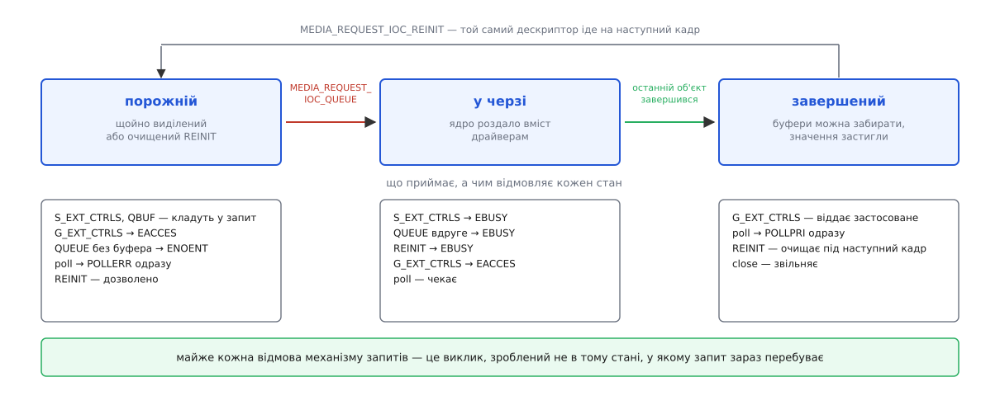

# 📋 Механізм запитів: команди, поля структур і коди відмов

Весь контракт Request API в одному місці: три команди `ioctl`, поля, якими буфер і керування прив'язують до запиту, прапорці, якими драйвер оголошує підтримку, і таблиця відмов — на кожен `errno` тут видно, який саме рядок його спричинив. Звірено з `include/uapi/linux/media.h`, `include/uapi/linux/videodev2.h`, кодом `drivers/media/mc/mc-request.c`, `drivers/media/v4l2-core/v4l2-ctrls-request.c` і документацією ядра `userspace-api/media/`.

## Три команди

```c
/* <linux/media.h> */
#define MEDIA_IOC_REQUEST_ALLOC   _IOR('|', 0x05, int)   /* на /dev/mediaN */
#define MEDIA_REQUEST_IOC_QUEUE   _IO ('|', 0x80)        /* на дескрипторі запиту */
#define MEDIA_REQUEST_IOC_REINIT  _IO ('|', 0x81)        /* на дескрипторі запиту */
```

`MEDIA_IOC_REQUEST_ALLOC` бере вказівник на `int` і кладе туди новий дескриптор; сам виклик повертає 0 або −1. Дескриптор ядро створює **з уже поставленим `O_CLOEXEC`** — за `exec` запит не переживає, і його не треба закривати руками перед запуском іншої програми ([що саме `exec` зберігає, а що викидає](root:sys-unix/exec-semantics)).

Дві інші команди аргументу не мають: третім параметром `ioctl` передають `NULL`. `QUEUE` віддає вміст запиту драйверам, `REINIT` очищає його до порожнього стану.

## Стан вирішує все

Майже кожна відмова тут — це виклик, зроблений не в тому стані, у якому запит зараз перебуває.



*Насправді `enum media_request_state` має шість значень: до цих трьох додано короткочасні `VALIDATING`, `UPDATING` і `CLEANING` — стани, у яких запит перебуває всередині одного виклику. Назовні розрізняються саме три.*

## Прив'язка буфера

```c
/* <linux/videodev2.h> */
#define V4L2_BUF_FLAG_REQUEST_FD            0x00800000
#define V4L2_BUF_FLAG_M2M_HOLD_CAPTURE_BUF  0x00000200

struct v4l2_buffer {
    /* … index, type, bytesused, flags, field, timestamp, … */
    __u32 reserved2;
    union {
        __s32 request_fd;   /* дійсне лише при V4L2_BUF_FLAG_REQUEST_FD */
        __u32 reserved;
    };
};
```

`request_fd` лежить в об'єднанні зі старим полем `reserved` — місця під нього в структурі не було, тож поле дописали поверх зарезервованого. Звідси вимога занулювати `struct v4l2_buffer` перед заповненням: незанулена приносить сміття і в `flags`, і сюди, і `QBUF` відмовить через дескриптор, якого програма не називала. Прапорець і поле ставлять разом: прапорець без поля дає `EINVAL` (нуль — теж дескриптор, і майже напевно не запит), поле без прапорця драйвер просто не подивиться.

Поле дивиться тільки `VIDIOC_QBUF`; `VIDIOC_DQBUF` і решта команд його ігнорують. Для пристроїв «пам'ять у пам'ять» прив'язати можна лише буфер черги `OUTPUT` — черга `CAPTURE`, куди лягає результат, жодних параметрів не несе, і спроба дає `EBADR`.

`V4L2_BUF_FLAG_M2M_HOLD_CAPTURE_BUF` ставлять **на вихідний буфер**, а не на буфер результату: він каже драйверові не віддавати готовий кадр назад, доки не зміниться мітка часу наступного буфера `OUTPUT`. Так кадр із кількох зрізів збирається кількома запитами в один буфер. Утримання скидає ще й команда `V4L2_DEC_CMD_FLUSH`.

## Прив'язка керувань

```c
#define V4L2_CTRL_WHICH_CUR_VAL      0
#define V4L2_CTRL_WHICH_DEF_VAL      0x0f000000
#define V4L2_CTRL_WHICH_REQUEST_VAL  0x0f010000

struct v4l2_ext_controls {
    union { __u32 ctrl_class; __u32 which; };
    __u32 count;
    __u32 error_idx;                  /* заповнює драйвер: індекс керування, що не пройшло */
    __s32 request_fd;                 /* дійсне лише при which = REQUEST_VAL */
    __u32 reserved[1];
    struct v4l2_ext_control *controls;
};
```

`which = V4L2_CTRL_WHICH_REQUEST_VAL` міняє зміст усіх трьох команд:

| команда | зі звичайним `which` | з `REQUEST_VAL` |
|---|---|---|
| `VIDIOC_S_EXT_CTRLS` | пише в пристрій «щойно зможу» | складає значення в запит; заліза не чіпає |
| `VIDIOC_G_EXT_CTRLS` | читає поточне значення пристрою | читає значення **цього** запиту після виконання |
| `VIDIOC_TRY_EXT_CTRLS` | перевіряє значення без запису | перевіряє їх у контексті запиту, нічого туди не кладучи |

Замок на всі три однаковий: складати значення й пробувати їх можна лише в запиті, який ще не поставлено в чергу; читати — навпаки, лише в завершеному.

Читання після завершення — не формальність. Драйвер підтягує прохані значення до дозволених сенсором меж, а в декодера частина керувань класу `V4L2_CID_STATELESS_*` взагалі є виходом, а не входом: іншого способу дізнатися, що вийшло, немає.

Викликати треба на **тому вузлі, якому належить керування**: витримку — на дескрипторі підпристрою сенсора, обтинання — на дескрипторі блока обробки. Дескриптори різні, `request_fd` у них один, і саме тому запит виділяють на медіапристрої, а не на відеовузлі.

## Оголошення підтримки

```c
#define V4L2_BUF_CAP_SUPPORTS_REQUESTS                0x00000008
#define V4L2_BUF_CAP_SUPPORTS_M2M_HOLD_CAPTURE_BUF    0x00000020
```

Обидва прапорці драйвер виставляє в полі `capabilities` структури `v4l2_requestbuffers` — тобто у відповіді на `VIDIOC_REQBUFS`. Запитувати можливості можна безпечно: `count = 0` звільняє раніше виділені буфери й нічого не виділяє, а поле `capabilities` драйвер заповнює однаково. Нуль у ньому означає драйвер настільки старий, що про це поле не знає, — тоді запитів там немає напевно.

Прапорці належать **черзі**, а не пристрою: підтримка на `OUTPUT` нічого не обіцяє про `CAPTURE`. Другий прапорець стосується лише декодерів без власного стану.

## Таблиця відмов

| `errno` | де | причина |
|---|---|---|
| `ENOTTY` | `MEDIA_IOC_REQUEST_ALLOC` | медіапристрій не має операцій `req_validate`/`req_queue` — запитів цей драйвер не знає взагалі |
| `ENOMEM` | `ALLOC`, `QUEUE` | не вистачило пам'яті на внутрішні структури запиту |
| `ENOENT` | `MEDIA_REQUEST_IOC_QUEUE` | у запиті немає жодного буфера; прив'язати мить застосування нема до чого |
| `EINVAL` | `QUEUE` | вміст не пройшов перевірку драйвера (`req_validate`) |
| `EINVAL` | `QBUF`, `S/G/TRY_EXT_CTRLS` | `request_fd` від'ємний або не є дескриптором запиту саме цього медіапристрою; для керувань — ще й вузол без медіапристрою |
| `EBADR` | `QBUF` | прапорець `REQUEST_FD` на черзі без підтримки запитів (зокрема на `CAPTURE` декодера) — **або навпаки**: драйвер вимагає запиту, а прапорця немає |
| `EBUSY` | `QBUF` | змішування: у цю чергу вже клали буфери прямо, а тепер через запит, чи навпаки |
| `EBUSY` | `S_EXT_CTRLS`, `TRY_EXT_CTRLS` | запит уже в черзі — вміст замкнено, доповнити чи спробувати вже не можна |
| `EBUSY` | `QUEUE`, `REINIT` | запит не в тому стані: поставити в чергу вдруге або очистити те, що ядро зараз виконує |
| `EACCES` | `G_EXT_CTRLS` | запит ще не завершився, або `REQUEST_VAL` на пристрої без підтримки запитів |
| `EIO` | `QUEUE` | залізо в критичній помилці; лікується зупинкою потоку й перезапуском |

Одна розбіжність варта уваги. Оглядовий текст `request-api.rst` обіцяє на читанні керувань незавершеного запиту `EBUSY`, а код `v4l2_g_ext_ctrls_request()` віддає `EACCES` — і сторінка `VIDIOC_G_EXT_CTRLS` перелічує обидва. Правда за кодом; програма, яка розбирає `errno`, має приймати обидва значення як «ще рано».

## Очікування й звільнення

`poll` на дескрипторі запиту працює **тільки** з `POLLPRI`. Функція `media_request_poll()` починається з перевірки запитаних подій: якщо `POLLPRI` серед них немає, вона одразу повертає нуль і навіть не стає в чергу очікування — `poll` із самим `POLLIN` на запиті не прокинеться ніколи.

| стан запиту | що поверне `poll` |
|---|---|
| завершений | `POLLPRI` одразу |
| у черзі | чекає |
| ще не поставлений у чергу | `POLLERR` одразу |

Останній рядок зручний: `POLLERR` без затримки — це майже завжди забутий `MEDIA_REQUEST_IOC_QUEUE`.

`close` на дескрипторі робить його непридатним негайно, але сам запит ядро звільняє лічильником посилань — коли ним перестануть користуватися і драйвер, і об'єкти всередині. Закрити дескриптор поставленого в чергу запиту дозволено: кадр усе одно буде знято, просто результат нікому буде забрати.

## Мінімальний повний виклик

```c
/* 1. чи має ця черга право приймати буфери в запитах */
struct v4l2_requestbuffers rb = {
    .count = 0, .type = V4L2_BUF_TYPE_VIDEO_CAPTURE, .memory = V4L2_MEMORY_MMAP,
};
ioctl(video_fd, VIDIOC_REQBUFS, &rb);
if (!(rb.capabilities & V4L2_BUF_CAP_SUPPORTS_REQUESTS))
    return -1;

/* 2. запит живе на медіапристрої */
int req_fd;
if (ioctl(media_fd, MEDIA_IOC_REQUEST_ALLOC, &req_fd) < 0)
    return -1;                                   /* ENOTTY */

/* 3. наповнення: керування — на вузлі сенсора, буфер — на відеовузлі */
struct v4l2_ext_control c = { .id = V4L2_CID_EXPOSURE_ABSOLUTE, .value = 120 };
struct v4l2_ext_controls ctrls = {
    .which = V4L2_CTRL_WHICH_REQUEST_VAL, .request_fd = req_fd,
    .count = 1, .controls = &c,
};
ioctl(subdev_fd, VIDIOC_S_EXT_CTRLS, &ctrls);    /* EBUSY, якщо запит уже в черзі */

struct v4l2_buffer buf = {                       /* занулення обов'язкове */
    .type = V4L2_BUF_TYPE_VIDEO_CAPTURE, .memory = V4L2_MEMORY_MMAP, .index = 0,
    .flags = V4L2_BUF_FLAG_REQUEST_FD, .request_fd = req_fd,
};
ioctl(video_fd, VIDIOC_QBUF, &buf);              /* EBADR / EINVAL / EBUSY */

/* 4. пуск і очікування */
ioctl(req_fd, MEDIA_REQUEST_IOC_QUEUE, NULL);    /* ENOENT, якщо буфера немає */
struct pollfd p = { .fd = req_fd, .events = POLLPRI };
poll(&p, 1, -1);

/* 5. що драйвер справді застосував (до завершення — EACCES) */
ioctl(subdev_fd, VIDIOC_G_EXT_CTRLS, &ctrls);
ioctl(video_fd, VIDIOC_DQBUF, &buf);

/* 6. той самий дескриптор — на наступний кадр */
ioctl(req_fd, MEDIA_REQUEST_IOC_REINIT, NULL);
```

Усередині наповнення порядок довільний: керування можна класти й після буфера, і в кілька заходів на різних вузлах. А от `REINIT` між кадрами пропускати не можна — вміст завершеного запиту нікуди не дівається, і повторний `QUEUE` на ньому поверне `EBUSY`.
