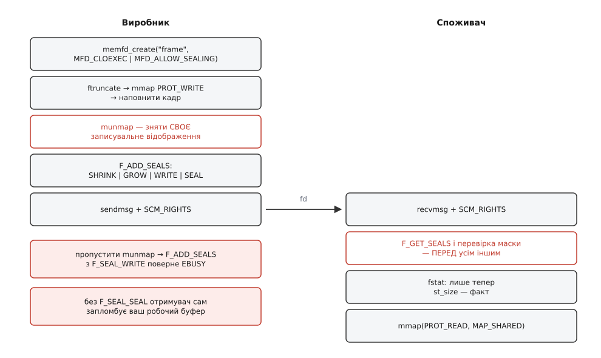

# ⚙️ Обмін запломбованим буфером: два процеси, один кадр, жодної копії

Тут зібрана робоча програма на C, у якій один процес готує кадр у безіменному файлі, назавжди заморожує його пломбами й віддає дескриптор сусідові, а сусід **сам питає ядро**, чи справді все заморожено, перш ніж торкнутися бодай байта. Виклики тут прості; уся суть — у **порядку**, бо майже кожна помилка в цій схемі є помилкою порядку, і кожна має свій окремий код відмови або свій сигнал.

## Що будуємо

Два процеси зв'язані `socketpair` — парою вже з'єднаних сокетів домену Unix, якими можна [переслати відкритий дескриптор допоміжними даними повідомлення](root:sys-unix/unix-domain-sockets). Батьківський процес — виробник: створює файл на кадр 640×360, малює в ньому зелений градієнт, пломбує й віддає дескриптор. Дочірній — споживач: питає пломби, і лише переконавшись, що вміст і розмір заморожені, відображає файл на читання й розбирає його просто у відображенні, нікуди не копіюючи.



*Обидві сторони мусять робити своє саме в цьому порядку: виробник знімає власне відображення перед пломбуванням, споживач питає пломби перед розміром і відображенням.*

Програма одна й розгалужується через `fork`, тож зібрати й запустити її можна однією командою, а вивід обох сторін лягає в один потік.

## Дескриптор поштою

Дескриптор — число, дійсне лише в межах свого процесу, тож переслати треба не число, а сам об'єкт ядра. Це вміє один-єдиний механізм — допоміжні дані `SCM_RIGHTS` на сокеті домену Unix.

```c
static int send_fd(int sock, int fd)
{
    char byte = 'F';                       /* хоч один байт звичайних даних */
    struct iovec iov = { .iov_base = &byte, .iov_len = 1 };
    union {                                /* вирівнювання під cmsghdr */
        char buf[CMSG_SPACE(sizeof(int))];
        struct cmsghdr align;
    } u = { 0 };
    struct msghdr msg = {
        .msg_iov = &iov, .msg_iovlen = 1,
        .msg_control = u.buf, .msg_controllen = sizeof u.buf,
    };

    struct cmsghdr *cm = CMSG_FIRSTHDR(&msg);
    cm->cmsg_level = SOL_SOCKET;
    cm->cmsg_type  = SCM_RIGHTS;
    cm->cmsg_len   = CMSG_LEN(sizeof(int));
    memcpy(CMSG_DATA(cm), &fd, sizeof fd);

    return sendmsg(sock, &msg, 0) == 1 ? 0 : -1;
}

static int recv_fd(int sock)
{
    char byte;
    struct iovec iov = { .iov_base = &byte, .iov_len = 1 };
    union {
        char buf[CMSG_SPACE(sizeof(int))];
        struct cmsghdr align;
    } u = { 0 };
    struct msghdr msg = {
        .msg_iov = &iov, .msg_iovlen = 1,
        .msg_control = u.buf, .msg_controllen = sizeof u.buf,
    };

    if (recvmsg(sock, &msg, MSG_CMSG_CLOEXEC) != 1) return -1;
    if (msg.msg_flags & MSG_CTRUNC) return -1;      /* не все влізло */

    struct cmsghdr *cm = CMSG_FIRSTHDR(&msg);
    if (!cm || cm->cmsg_len != CMSG_LEN(sizeof(int))
            || cm->cmsg_level != SOL_SOCKET || cm->cmsg_type != SCM_RIGHTS)
        return -1;                                  /* дескриптора не прислали */

    int fd;
    memcpy(&fd, CMSG_DATA(cm), sizeof fd);
    return fd;
}
```

Три деталі тут неочевидні. Разом із дескриптором надсилають хоч один звичайний байт: на потоковому сокеті повідомлення без даних може не піти взагалі, та й отримувачеві потрібен привід повернутися з `recvmsg` — дескриптор приїде причепом до цього байта. Буфер під допоміжні дані оголошено через об'єднання з `struct cmsghdr` не з любові до трюків: `CMSG_DATA` рахує зсуви від правильно вирівняного початку, а масив `char` сам собою такого вирівнювання не має. І `MSG_CMSG_CLOEXEC` — щоб щойно отриманий дескриптор не проліз у наступний `exec`; для дескрипторів, що приходять ззовні, це має бути звичкою.

Прапорець `MSG_CTRUNC` перевіряють не для краси: якщо буфера забракло, частина дескрипторів не доїде, а ті, що доїхали, лишаться відкритими без вашого відома.

## Виробник: наповнити, прибрати руки, запломбувати

```c
#define WIDTH  640
#define HEIGHT 360
struct frame { uint32_t w, h; uint32_t px[]; };
#define FRAME_BYTES (sizeof(struct frame) + (size_t)WIDTH * HEIGHT * 4)

static void producer(int sock, int with_shrink)
{
    int fd = memfd_create("frame", MFD_CLOEXEC | MFD_ALLOW_SEALING);
    if (fd < 0) die("memfd_create");
    if (ftruncate(fd, FRAME_BYTES) < 0) die("ftruncate");

    struct frame *f = mmap(NULL, FRAME_BYTES, PROT_READ | PROT_WRITE,
                           MAP_SHARED, fd, 0);
    if (f == MAP_FAILED) die("mmap");

    f->w = WIDTH; f->h = HEIGHT;
    for (size_t i = 0; i < (size_t)WIDTH * HEIGHT; i++) {
        uint32_t g = (uint32_t)((i % WIDTH) * 255 / (WIDTH - 1));
        f->px[i] = 0xff000000u | (g << 8);
    }

    /* пастка: пломбуємо, поки живе власне записувальне відображення */
    if (fcntl(fd, F_ADD_SEALS, F_SEAL_WRITE) < 0)
        printf("[виробник] F_SEAL_WRITE до munmap → %s\n", strerror(errno));

    if (munmap(f, FRAME_BYTES) < 0) die("munmap");

    int seals = F_SEAL_GROW | F_SEAL_WRITE | F_SEAL_SEAL;
    if (with_shrink) seals |= F_SEAL_SHRINK;
    if (fcntl(fd, F_ADD_SEALS, seals) < 0) die("F_ADD_SEALS");

    printf("[виробник] пломби 0x%x, %zu байтів → віддаю дескриптор\n",
           fcntl(fd, F_GET_SEALS), FRAME_BYTES);
    if (send_fd(sock, fd) < 0) die("send_fd");

    char ack;
    if (read(sock, &ack, 1) != 1) die("read");     /* сусід уже відобразив */
    if (ftruncate(fd, 0) == 0)
        puts("[виробник] ftruncate(fd, 0) пройшов — файл тепер порожній");
    else
        printf("[виробник] ftruncate(fd, 0) → %s\n", strerror(errno));
    if (write(sock, "T", 1) != 1) die("write");
    close(fd);
}
```

Перший `fcntl` тут навмисно приречений: поки в таблицях сторінок процесу стоять записи з дозволом на запис, ядро не має як пообіцяти, що ніхто більше не пише — процесор пише в пам'ять напряму, ядра не питаючи ([відображення й таблиці сторінок](root:sys-unix/mmap-model)). Тому `F_SEAL_WRITE` за наявного спільного записувального відображення відмовляє з `EBUSY`, і `munmap` — не прибирання за собою, а обов'язковий крок протоколу.

Друга навмисність — `ftruncate(fd, 0)` наприкінці. Пломба `F_SEAL_WRITE` заморожує **вміст**, але не **довжину**: скорочення забороняє тільки `F_SEAL_SHRINK`. Так виробник грає роль недбалого сусіда й показує, що саме купує кожна з двох пломб окремо.

## Споживач: спершу спитати ядро

```c
static void consumer(int sock)
{
    const int need = F_SEAL_SHRINK | F_SEAL_WRITE;

    int fd = recv_fd(sock);
    if (fd < 0) die("recv_fd");

    int seals = fcntl(fd, F_GET_SEALS);            /* ПЕРЕД усім іншим */
    if (seals < 0) {                               /* EINVAL: файл без пломб */
        printf("[споживач] F_GET_SEALS → %s — це не memfd\n", strerror(errno));
        _exit(1);
    }
    printf("[споживач] пломби 0x%x%s\n", seals,
           (seals & need) == need ? " — усе на місці" : " — БРАКУЄ потрібних");

    if (fcntl(fd, F_ADD_SEALS, F_SEAL_FUTURE_WRITE) < 0)
        printf("[споживач] моя спроба допломбувати → %s\n", strerror(errno));

    struct stat st;
    if (fstat(fd, &st) < 0) die("fstat");          /* лише тепер розмір — факт */
    size_t bytes = (size_t)st.st_size;

    const struct frame *f = mmap(NULL, bytes, PROT_READ, MAP_SHARED, fd, 0);
    if (f == MAP_FAILED && errno == EPERM)         /* ядра до 6.7 */
        f = mmap(NULL, bytes, PROT_READ, MAP_PRIVATE, fd, 0);
    if (f == MAP_FAILED) die("mmap");

    uint32_t w = f->w, h = f->h;
    printf("[споживач] кадр %ux%u, перший піксель 0x%08x\n", w, h, f->px[0]);

    char t;
    if (write(sock, "A", 1) != 1) die("write");
    if (read(sock, &t, 1) != 1) die("read");       /* сусід уже спробував різати */

    puts("[споживач] торкаюся останнього пікселя...");
    printf("[споживач] останній піксель 0x%08x\n", f->px[(size_t)w * h - 1]);
    munmap((void *)f, bytes);
    close(fd);
}
```

`F_GET_SEALS` стоїть першим не з педантизму. Він відповідає на два питання разом: чи це взагалі об'єкт із пломбами (на звичайному файлі повернеться `-1` і `EINVAL`) і які саме гарантії на ньому вже незворотні. Доти жоден інший виклик не має сенсу — зокрема `fstat`, бо `st_size` до `F_SEAL_SHRINK` є не властивістю файлу, а миттєвим знімком числа, яке сусід перепише через такт. Після пломби те саме число стає фактом, і на ньому вже можна будувати довжину відображення.

Спроба споживача додати `F_SEAL_FUTURE_WRITE` — перевірка дзеркального боку. Дескриптор, що приїхав `SCM_RIGHTS`, відкритий на читання-запис, тож пломбувати ним **можна**; єдине, що зупиняє гостя, — поставлена виробником `F_SEAL_SEAL`. Без неї отримувач одним викликом заморозив би чужий робочий буфер назавжди.

Саме тут і окупається вся конструкція. Споживач читає `f->w`, `f->h`, а далі пікселі просто за вказівником у чужу пам'ять — і не мусить копіювати їх до себе, щоб перевірка не застаріла між читанням і використанням. Без пломби довелося б робити навпаки: спершу копію, потім перевірку, потім роботу з копією. Ціна цієї обережності на кадрі 640×360 виглядає так:

```
кадр               = 8 + 640·360·4 = 921 608 байтів
при 60 кадрах/с    = 921 608 · 60  ≈ 55.3 МБ/с на КОЖНОГО клієнта
```

Для однієї програми це дрібниця, але множиться воно на кількість клієнтів, іде подвійно (запис копії, потім читання копії) і щоразу вимиває з кешу те, що композиторові справді потрібне. А головне — це рівно те копіювання, заради усунення якого спільну пам'ять і брали: інакше кадр так само пересилається, просто не каналом, а через пам'ять. Пломба знімає його одним викликом `fcntl` на весь буфер.

Запасний `MAP_PRIVATE` — не забобон: до Linux 6.7 ядро відхиляло **будь-яке** нове спільне відображення запломбованого на запис файлу, навіть суто читальне, бо лічильник записувальних відображень збільшувався на кожне `MAP_SHARED` (виправлено 2023 року, коли `VM_MAYWRITE` для читальних відображень почали просто гасити). На старіших ядрах `PROT_READ | MAP_SHARED` повертає `EPERM`, і читачеві лишається приватне відображення — для незмінного вмісту воно так само безкопійне.

## Каркас

Лишилося зшити все в один файл `sealed.c`: заголовки й `die` згори, далі `send_fd`/`recv_fd`, `producer`, `consumer`, а `main` — останнім.

```c
#define _GNU_SOURCE
#include <errno.h>
#include <fcntl.h>
#include <stdint.h>
#include <stdio.h>
#include <stdlib.h>
#include <string.h>
#include <sys/mman.h>
#include <sys/socket.h>
#include <sys/stat.h>
#include <sys/wait.h>
#include <unistd.h>

static void die(const char *what) { perror(what); _exit(1); }

int main(int argc, char **argv)
{
    int with_shrink = !(argc > 1 && strcmp(argv[1], "--no-shrink") == 0);
    setvbuf(stdout, NULL, _IOLBF, 0);          /* щоб рядки не злипалися */

    int sv[2];
    if (socketpair(AF_UNIX, SOCK_SEQPACKET | SOCK_CLOEXEC, 0, sv) < 0)
        die("socketpair");

    pid_t pid = fork();
    if (pid < 0) die("fork");
    if (pid == 0) { close(sv[0]); consumer(sv[1]); _exit(0); }

    close(sv[1]);
    producer(sv[0], with_shrink);

    int st;
    if (waitpid(pid, &st, 0) > 0 && WIFSIGNALED(st))
        printf("[батько] споживач загинув від сигналу %d (%s)\n",
               WTERMSIG(st), strsignal(WTERMSIG(st)));
    return 0;
}
```

`memfd` створюється **після** `fork`, тож дочірній процес не успадковує його випадково — єдина його дорога до файлу лежить через сокет. Пара сокетів узята `SOCK_SEQPACKET`: межі повідомлень зберігаються, тож однобайтові підтвердження не зіллються в потік.

## Складання й запуск

```
$ cc -O2 -Wall -Wextra -o sealed sealed.c
```

Обгортку `memfd_create` glibc має з версії 2.27; на старішій системі виклик роблять напряму — `syscall(SYS_memfd_create, "frame", flags)`. Перший запуск — усе запломбовано як слід:

```
$ ./sealed
[виробник] F_SEAL_WRITE до munmap → Device or resource busy
[виробник] пломби 0xf, 921608 байтів → віддаю дескриптор
[споживач] пломби 0xf — усе на місці
[споживач] моя спроба допломбувати → Operation not permitted
[споживач] кадр 640x360, перший піксель 0xff000000
[виробник] ftruncate(fd, 0) → Operation not permitted
[споживач] торкаюся останнього пікселя...
[споживач] останній піксель 0xff00ff00
```

Маска `0xf` — це `F_SEAL_SEAL | F_SEAL_SHRINK | F_SEAL_GROW | F_SEAL_WRITE` (0x1, 0x2, 0x4 і 0x8). Другий запуск — те саме, але виробник «забув» `F_SEAL_SHRINK`:

```
$ ./sealed --no-shrink
[виробник] F_SEAL_WRITE до munmap → Device or resource busy
[виробник] пломби 0xd, 921608 байтів → віддаю дескриптор
[споживач] пломби 0xd — БРАКУЄ потрібних
[споживач] моя спроба допломбувати → Operation not permitted
[споживач] кадр 640x360, перший піксель 0xff000000
[виробник] ftruncate(fd, 0) пройшов — файл тепер порожній
[споживач] торкаюся останнього пікселя...
[батько] споживач загинув від сигналу 7 (Bus error)
```

Останній рядок і є ціна пропущеної пломби. Адреса лишилася законною, відображення нікуди не поділося — але сторінки, яку туди підставляти, у файлі більше немає, і [сторінковий збій](root:sf-os/page-fault) нема чим закрити. Ядро шле `SIGBUS`, типова дія якого — убити процес. Зверніть увагу, хто загинув: **читач**, а не той, хто вкоротив файл.

Наш споживач помітив брак пломби, надрукував попередження й пішов читати далі — навмисно, щоб показати наслідок. Справжній читач на цьому місці закриває дескриптор і відмовляється від буфера: після `F_GET_SEALS` перевірка коштує одне порівняння масок, а її відсутність коштує процес.

> 🔧 **Навіщо це.** Той самий кістяк — `memfd` під кадр, пломби, дескриптор сокетом, перевірка на боці читача — лежить під буферами Wayland і аудіобуферами PipeWire. Різниця лише в наборі пломб: буфер, який віддають раз і назавжди, замикають `SHRINK | WRITE`, а той, що клієнт переписує щокадру, — самим `SHRINK | GROW`, лишаючи «хто зараз пише» на відповідальність протоколу.

## Пастки, зібрані в одному місці

**`EBUSY` замість пломби.** `F_SEAL_WRITE` не поставити, поки живе бодай одне спільне записувальне відображення — власне теж. Якщо буфер потрібно тримати відображеним і далі, пломба не та: беріть `F_SEAL_FUTURE_WRITE` (Linux 5.1), яка лишає чинними наявні відображення. Тільки й гарантія в неї слабша — «нових записувачів не буде», а не «вміст незмінний», і читач мусить розуміти цю різницю.

**`F_SEAL_WRITE` без `F_SEAL_SHRINK`.** Ця пара розділяє дві незалежні властивості: вміст і довжину. Одна без одної не рятує — саме це показує другий запуск.

**`st_size` до перевірки.** Число, прочитане `fstat`, стає надійним лише після `F_SEAL_SHRINK`; інакше воно застаріває просто між викликами. Порядок «пломби → розмір → відображення» — не стиль, а єдина послідовність, у якій кожен наступний крок спирається на вже незворотний факт.

**Забута `F_SEAL_SEAL`.** Дескриптор, який ви віддали, дає гостю право пломбувати ваш файл. Якщо буфер робочий і має ще заповнюватися — замикайте набір, інакше отримувач заморозить його вам першим же `F_SEAL_WRITE`.

**`MFD_ALLOW_SEALING` при створенні.** Без цього прапорця файл народжується вже з `F_SEAL_SEAL`, і жодної пломби на нього не поставити ніколи. Помилка виявиться аж на `F_ADD_SEALS`, кодом `EPERM`, — за кілька сотень рядків від справжньої причини.
