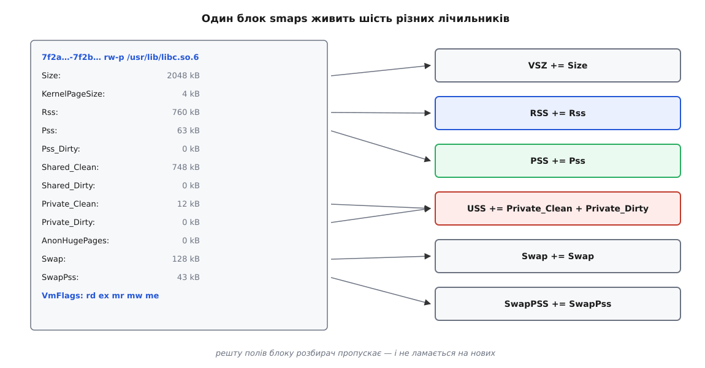
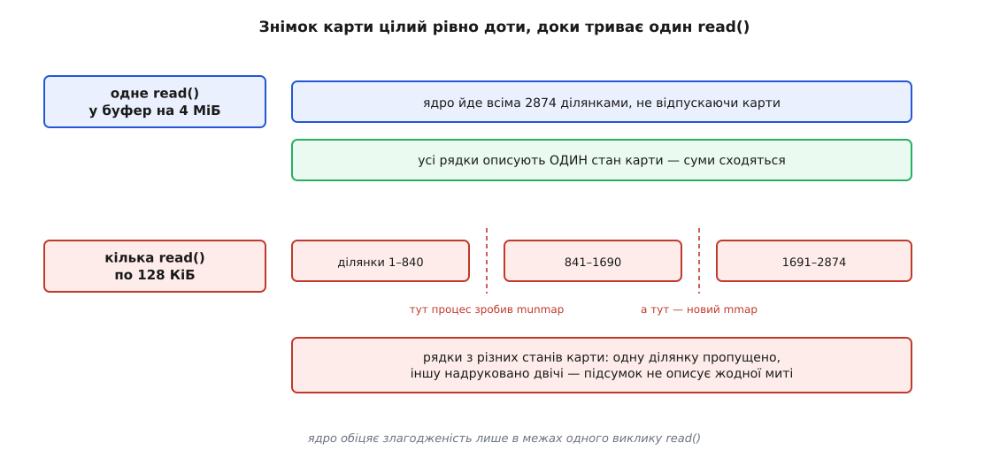

# ⚙️ Лічильник пам'яті власноруч

Двісті рядків C, які читають `/proc/<pid>/smaps` і кладуть VSZ, RSS, PSS, USS, своп і `SwapPss` в одну таблицю, посортовану за внеском ділянки в PSS. Писати таке доводиться тому, що жоден стандартний інструмент не показує ці шість чисел разом: `ps` знає два з них, `top` — теж два, а `smem` знає всі, але він на Python і на процесі з трьома тисячами ділянок гальмує. До того ж власний розбирач — єдиний спосіб побачити, де саме числа перестають сходитися, а вони перестають, і не в одному місці.

## Що саме ми складаємо

`smaps` віддає по блоку на кожну ділянку карти, і кожен блок починається з того самого рядка, що й у `maps`, — діапазон адрес, права, зсув, пристрій, інод та ім'я файлу. Далі йдуть два з половиною десятки полів, з яких нам потрібні сім.



*З двадцяти з гаком полів блоку розбирач бере сім і складає з них шість підсумків; решту пропускає — саме тому він не ламається, коли в наступному ядрі полів побільшає.*

Один нюанс, який задає всю форму програми: ділянок у живому процесі бувають тисячі, і більшість із них — безіменні шматки купи, кожен по кілька сотень кілобайтів. Таблиця з трьох тисяч рядків нікому не допомагає. Тому ділянки треба **звести за іменем**: усі відображення `libc.so.6` в одну строку, всі анонімні — в другу, стек — у третю. Тоді перші десять рядків посортованої таблиці і є відповідь на питання «за що заплачено».

## Знімок живе рівно один `read()`

Перше, що ламає наївний розбирач, — це не розбір, а читання. `/proc` не файлова система в звичайному сенсі: за кожним файлом там стоїть не блок на диску, а функція ядра, яка друкує текст у мить звернення. Механіку цього описано окремо — [/proc як інтерфейс ядра](root:sys-unix/proc-reading-process-and-kernel-state); тут важливий один її наслідок, зафіксований у документації ядра прямим текстом: читання `maps` і `smaps` за своєю природою гоночне, і злагоджений вивід можна дістати лише в межах **одного виклику** `read()`.



*Одне велике читання проходить усі ділянки, поки карта під замком; кілька дрібних — це кілька різних обходів, між якими карта встигла змінитися.*

Звідси три правила, які не виводяться з жодного підручника про файли.

`stat()` тут марний: `st_size` у `/proc` дорівнює нулю, тож розмір буфера з нього не візьмеш. Треба брати завідомо великий і, якщо не влізло, починати спочатку з удвічі більшим.

`lseek()` тут не перемотує, а **перезапускає**. Позиції в байтах у генератора тексту немає; зсув ядро відтворює, обійшовши ділянки з початку — по новому, вже зміненому стану карти. Схема «прочитати шматок, запам'ятати зсув, дочитати решту» дає суміш двох обходів: одну ділянку пропущено, іншу надруковано двічі, а підсумок не описує жодної миті.

І сигнал може обірвати читання: обхід карти чекає на замок, який ядро бере в режимі, що переривається фатальним сигналом, тож `read()` цілком законно повертає `EINTR`. Дочитувати після цього не можна — тільки починати спочатку; загальна дисципліна перезапуску розібрана в темі про [переривані виклики](root:sys-unix/eintr-and-restart).

```c
/* pssmap.c — зведення пам'яті процесу з /proc/<pid>/smaps.
 *   cc -O2 -Wall -o pssmap pssmap.c
 *   ./pssmap <pid> [рядків]   таблиця ділянок, зведених за іменем
 *   ./pssmap -a               уся система + перевірка балансу
 */
#define _GNU_SOURCE
#include <dirent.h>
#include <errno.h>
#include <fcntl.h>
#include <stddef.h>
#include <stdio.h>
#include <stdlib.h>
#include <string.h>
#include <unistd.h>

/* Забирає файл ОДНИМ read(): лише так знімок карти злагоджений.
   Не влізло — усе спочатку, з удвічі більшим буфером. */
static char *slurp(const char *path, size_t *out_len)
{
    size_t cap = 1u << 20;

    for (;;) {
        int fd = open(path, O_RDONLY | O_CLOEXEC);
        if (fd < 0)
            return NULL;                     /* ENOENT — процес уже помер */

        char *buf = malloc(cap);
        if (!buf) { close(fd); return NULL; }

        ssize_t n = read(fd, buf, cap - 1);
        int err = errno;
        close(fd);

        if (n >= 0 && (size_t)n < cap - 1) { /* влізло цілком */
            buf[n] = '\0';
            *out_len = (size_t)n;
            return buf;
        }
        free(buf);

        if (n < 0) {                         /* ESRCH — помер посеред читання */
            if (err != EINTR) { errno = err; return NULL; }
            continue;                        /* сигнал: той самий буфер, з нуля */
        }
        if (cap >= (256u << 20)) { errno = EFBIG; return NULL; }
        cap *= 2;
    }
}
```

## Зведення за іменем: розкрита адресація на 200 рядків

Різних імен у процесі — від кількох десятків до кількох сотень, а ділянок — тисячі. Отже, потрібне відображення «ім'я → шість лічильників» із дешевим пошуком, і найпростіше, що тут працює, — [хеш-таблиця](root:sf-algorithms/hash-table) фіксованого розміру з розкритою адресацією: масив комірок, у якому за зайнятого місця просто йдуть до наступного. Хеш беремо [FNV-1a](root:sf-algorithms/non-cryptographic-hash) — п'ять рядків, жодних таблиць, і для коротких імен файлів його якості вистачає з надлишком.

```c
struct region {
    char name[128];
    unsigned long size, rss, pss, priv_clean, priv_dirty, swap, swap_pss;
};

#define TAB_SZ 2048u                         /* степінь двійки, з великим запасом */
static struct region tab[TAB_SZ];
static unsigned      tab_used;

/* Комірка для імені (створює за потреби). NULL — таблиця переповнена. */
static struct region *bucket(const char *name, size_t n)
{
    if (n >= sizeof tab[0].name)
        n = sizeof tab[0].name - 1;

    unsigned long h = 1469598103934665603UL;             /* FNV-1a */
    for (size_t i = 0; i < n; i++) {
        h ^= (unsigned char)name[i];
        h *= 1099511628211UL;
    }

    for (unsigned i = (unsigned)(h & (TAB_SZ - 1)); ; i = (i + 1) & (TAB_SZ - 1)) {
        if (tab[i].name[0] == '\0') {
            if (tab_used * 4 >= TAB_SZ * 3)
                return NULL;                             /* заповнення > 75 % */
            memcpy(tab[i].name, name, n);
            tab[i].name[n] = '\0';
            tab_used++;
            return &tab[i];
        }
        if (strncmp(tab[i].name, name, n) == 0 && tab[i].name[n] == '\0')
            return &tab[i];
    }
}

/* Поле smaps → лічильник у struct region. Ключ порівнюємо ЦІЛКОМ. */
static const struct { const char *key; unsigned char len; size_t off; } FIELDS[] = {
    { "Size",           4, offsetof(struct region, size)       },
    { "Rss",            3, offsetof(struct region, rss)        },
    { "Pss",            3, offsetof(struct region, pss)        },
    { "Private_Clean", 13, offsetof(struct region, priv_clean) },
    { "Private_Dirty", 13, offsetof(struct region, priv_dirty) },
    { "Swap",           4, offsetof(struct region, swap)       },
    { "SwapPss",        7, offsetof(struct region, swap_pss)   },
};
```

Слово «цілком» у коментарі — не педантизм, а виправлення найпопулярнішої помилки в розбирачах `smaps`. Ключі полів перекриваються префіксами: `Swap` є початком `SwapPss`, `Pss` — початком `Pss_Dirty`, `Pss_Anon` і `Pss_Shmem`, `Private_Clean` і `Private_Dirty` різняться шостою літерою з кінця. Розбирач, написаний через `strncmp(line, "Swap", 4)`, тихо додає пропорційний своп до звичайного й завищує його рівно вдвічі на всьому, що вміє свопитися. Порівняння за довжиною ключа до двокрапки цю родину помилок відрізає одним рядком.

## Серце: розбір рядків

Тепер сам обхід тексту. Треба відрізняти заголовок ділянки від рядка поля, і критерій тут напрочуд простий: адреси ядро друкує **малими** шістнадцятковими літерами, а назви полів усі починаються з великої. Один порівняльний тест на першому символі — і жодних регулярних виразів.

Ім'я ділянки — шосте поле заголовка, і його може не бути взагалі: у анонімного відображення після номера інода немає нічого, крім пробілів. Такі зводимо під спільним ярликом `[anon]`.

:::tabs

```c
/* Ім'я ділянки — шосте поле заголовка; його може не бути. */
static const char *vma_name(const char *line, size_t len, size_t *out_n)
{
    size_t i = 0;
    for (int field = 0; field < 5; field++) {
        while (i < len && line[i] != ' ') i++;
        while (i < len && line[i] == ' ') i++;
    }
    if (i >= len) { *out_n = 6; return "[anon]"; }
    *out_n = len - i;
    return line + i;
}

/* Розбирає весь smaps у таблицю tab[]. */
static void parse_smaps(char *buf, size_t len)
{
    struct region *cur = NULL;
    char *p = buf, *end = buf + len;

    while (p < end) {
        char  *line = p;
        char  *nl   = memchr(p, '\n', (size_t)(end - p));
        size_t llen = nl ? (size_t)(nl - p) : (size_t)(end - p);
        p = nl ? nl + 1 : end;
        if (llen == 0)
            continue;

        /* Адреси — малими літерами, назви полів — з великої. */
        if (line[0] < 'A' || line[0] > 'Z') {
            size_t n;
            const char *nm = vma_name(line, llen, &n);
            cur = bucket(nm, n);
            continue;
        }
        if (!cur)
            continue;

        const char *colon = memchr(line, ':', llen);
        if (!colon)
            continue;
        size_t klen = (size_t)(colon - line);

        for (size_t k = 0; k < sizeof FIELDS / sizeof FIELDS[0]; k++) {
            if (FIELDS[k].len != klen || memcmp(line, FIELDS[k].key, klen) != 0)
                continue;
            const char *v = colon + 1;
            while (*v == ' ') v++;
            *(unsigned long *)((char *)cur + FIELDS[k].off) += strtoul(v, NULL, 10);
            break;
        }
    }
}
```

```cpp
#include <algorithm>
#include <charconv>
#include <cstdint>
#include <string>
#include <string_view>
#include <unordered_map>

struct Region {
    std::uint64_t size{}, rss{}, pss{},
                  privClean{}, privDirty{}, swap{}, swapPss{};
};

using Counter = std::uint64_t Region::*;

/* Ключ порівнюється ЦІЛКОМ — про це дбає сам unordered_map. */
static const std::unordered_map<std::string_view, Counter> kFields{
    { "Size",          &Region::size      },
    { "Rss",           &Region::rss       },
    { "Pss",           &Region::pss       },
    { "Private_Clean", &Region::privClean },
    { "Private_Dirty", &Region::privDirty },
    { "Swap",          &Region::swap      },
    { "SwapPss",       &Region::swapPss   },
};

static std::string_view vmaName(std::string_view head)
{
    for (int field = 0; field < 5; ++field) {
        const auto sp = head.find(' ');
        if (sp == std::string_view::npos)
            return "[anon]";
        head.remove_prefix(sp);
        head.remove_prefix(std::min(head.find_first_not_of(' '), head.size()));
    }
    return head.empty() ? std::string_view{"[anon]"} : head;
}

void parseSmaps(std::string_view text,
                std::unordered_map<std::string, Region> &byName)
{
    Region *cur = nullptr;

    while (!text.empty()) {
        const auto nl   = text.find('\n');
        const auto line = text.substr(0, nl);
        text = (nl == std::string_view::npos) ? std::string_view{}
                                              : text.substr(nl + 1);
        if (line.empty())
            continue;

        // Адреси — малими літерами, назви полів — з великої.
        if (line.front() < 'A' || line.front() > 'Z') {
            cur = &byName[std::string(vmaName(line))];
            continue;
        }
        if (!cur)
            continue;

        const auto colon = line.find(':');
        if (colon == std::string_view::npos)
            continue;

        const auto it = kFields.find(line.substr(0, colon));
        if (it == kFields.end())
            continue;

        auto tail = line.substr(colon + 1);
        tail.remove_prefix(std::min(tail.find_first_not_of(' '), tail.size()));

        std::uint64_t value{};
        std::from_chars(tail.data(), tail.data() + tail.size(), value);
        cur->*(it->second) += value;
    }
}
```

:::

Варіант на C++ коротший і безпечніший: `string_view` ріже рядки без жодного копіювання, `from_chars` розбирає число без локалі й без `errno`, а вказівник на член класу замінює арифметику зі зсувами, яку в C доводиться писати руками через `offsetof`. За це він платить одну рядкову алокацію на кожен заголовок ділянки — `operator[]` в `unordered_map<std::string, …>` інакше не вміє. На одному процесі це не видно, а на обході всієї системи, де заголовків сотні тисяч, різниця вже помітна. Тому головна програма далі — на C.

## Решта: сортування й вивід

```c
static int by_pss(const void *a, const void *b)
{
    const struct region *x = a, *y = b;
    if (x->pss == y->pss) return 0;
    return x->pss < y->pss ? 1 : -1;         /* спадання */
}

static void report_pid(long pid, int top)
{
    char path[64];
    snprintf(path, sizeof path, "/proc/%ld/smaps", pid);

    size_t len;
    char *buf = slurp(path, &len);
    if (!buf) {
        fprintf(stderr, "pid %ld: %s\n", pid, strerror(errno));
        return;
    }

    memset(tab, 0, sizeof tab);
    tab_used = 0;
    parse_smaps(buf, len);
    free(buf);

    if (tab_used == 0)
        return;                              /* ядрова нитка: карти немає */

    struct region *list = malloc(tab_used * sizeof *list);
    if (!list) return;

    unsigned m = 0;
    unsigned long vsz = 0, rss = 0, pss = 0, uss = 0, swap = 0, spss = 0;

    for (unsigned i = 0; i < TAB_SZ; i++) {
        if (tab[i].name[0] == '\0')
            continue;
        list[m++] = tab[i];
        vsz  += tab[i].size;
        rss  += tab[i].rss;
        pss  += tab[i].pss;
        uss  += tab[i].priv_clean + tab[i].priv_dirty;
        swap += tab[i].swap;
        spss += tab[i].swap_pss;
    }
    qsort(list, m, sizeof *list, by_pss);

    printf("pid %ld  ділянок зведено в %u імен\n", pid, m);
    printf("VSZ %lu кБ   RSS %lu кБ   PSS %lu кБ   USS %lu кБ"
           "   Swap %lu кБ   SwapPSS %lu кБ\n\n",
           vsz, rss, pss, uss, swap, spss);

    printf("%10s %10s %10s %10s  %s\n", "PSS", "RSS", "USS", "Swap", "ділянка");
    for (unsigned i = 0; i < m && i < (unsigned)top; i++)
        printf("%10lu %10lu %10lu %10lu  %s\n",
               list[i].pss, list[i].rss,
               list[i].priv_clean + list[i].priv_dirty,
               list[i].swap, list[i].name);
    free(list);
}
```

На живому переглядачі це виглядає так:

```
$ ./pssmap $(pgrep -n firefox) 8
pid 4471  ділянок зведено в 214 імен
VSZ 12844032 кБ   RSS 921604 кБ   PSS 612880 кБ   USS 528640 кБ   Swap 20480 кБ   SwapPSS 14336 кБ

       PSS        RSS        USS       Swap  ділянка
    431216     431216     431216      18944  [anon]
     52104      52104      52104          0  [heap]
     26980     108392       1204          0  /usr/lib/firefox/libxul.so
     18744      18744      18744          0  /memfd:mozilla-ipc (deleted)
      9832      12488       8600          0  /usr/lib/firefox/firefox
      6120      24408        612       1536  /usr/lib/libc.so.6
      4396      17280        128          0  /usr/lib/libfreetype.so.6
      2048       2048       2048          0  [stack]
```

Один погляд на цю таблицю дає більше, ніж три стовпчики `top`. Анонімна пам'ять — це 421 МіБ і з них усі 421 приватні: не звільниться нічого, поки процес живий. `libxul.so` присутній на 106 МіБ, а «свій» внесок — лише 26, бо в ті самі кадри дивляться ще троє процесів того самого переглядача. `libc` присутній на 24 МіБ, а коштує шість — і саме тому в підсумку системи його не варто рахувати двадцять разів.

> 🔧 **Навіщо це.** Стовпчик USS поруч із PSS відповідає на питання, яке в проді ставлять найчастіше: «якщо цей процес прибити, скільки повернеться». Тут це видно порядково — 421 МіБ анонімної повернеться, а зі 106 МіБ `libxul.so` — майже нічого, бо решта процесів тримають ті самі кадри. Жоден стандартний інструмент цих двох чисел поруч не показує.

## Скільки коштує спитати

Тепер виміряймо ціну самого питання. Ділянок у цьому процесі майже три тисячі:

```
$ awk '/^Size:/ {n++} END {print n}' /proc/4471/smaps
2874

$ time (for i in $(seq 50); do cat /proc/4471/smaps > /dev/null; done)
real    0m10.9s                    → 218 мс на читання

$ time (for i in $(seq 50); do cat /proc/4471/smaps_rollup > /dev/null; done)
real    0m2.1s                     →  42 мс на читання
```

Для `statm` цей спосіб уже не годиться: форк і запуск `cat` коштують більше, ніж саме читання, тож міряти доводиться циклом усередині програми.

```c
/* bench.c — ціна одного open+read+close. cc -O2 -o bench bench.c */
struct timespec t0, t1;
clock_gettime(CLOCK_MONOTONIC, &t0);
for (long i = 0; i < n; i++) {
    int fd = open(path, O_RDONLY);
    while (read(fd, buf, cap) > 0) { }      /* дочитуємо до кінця */
    close(fd);
}
clock_gettime(CLOCK_MONOTONIC, &t1);
printf("%.1f мкс\n", ((t1.tv_sec - t0.tv_sec) * 1e9 +
                      (t1.tv_nsec - t0.tv_nsec)) / n / 1e3);
```

```
$ ./bench /proc/4471/statm 100000
9.1 мкс
```

Розкид у двадцять чотири тисячі разів між `smaps` і `statm` не випадковий, і з нього видно природу кожного джерела.

```
statm         O(1)              лічильники з mm_struct, таблиць не чіпає
smaps_rollup  O(сторінок)       обхід усіх таблиць сторінок + один блок тексту
smaps         O(сторінок) + O(ділянок · 26 рядків)
```

`statm` дешевий, бо ядро друкує готові числа. `smaps_rollup` дорогий на тій самій величині, на якій дорогий і повний `smaps`, — на обході таблиць сторінок, бо `Pss` інакше не порахуєш: треба для кожної сторінки заглянути в її `mapcount`. А різниця вп'ятеро між `smaps` і `smaps_rollup` — це вже не обхід, а друк: 2874 ділянки по два з половиною десятки рядків дають понад сімдесят тисяч рядків тексту, які ядро форматує й порціями віддає в буфер `read()`.

Практичний висновок для інструмента: підсумок беремо з `smaps_rollup`, і лише коли треба знати винну ділянку, платимо за повний `smaps` — один раз.

## Уся система за раз і перевірка балансу

Тепер найцікавіше. PSS цінують за те, що його можна додавати: сума по всіх процесах має дорівнювати кількості реально зайнятих кадрів. Це не побажання, а перевірна тотожність, і власний інструмент дає змогу її перевірити, а не взяти на віру.

Порівнювати є з чим. У `/proc/meminfo` є два рядки, які рахують ті самі кадри, але з боку ядра й кожен рівно раз: `AnonPages` — анонімні сторінки, вписані в чиїсь таблиці сторінок, `Mapped` — файлові (разом із tmpfs і `memfd`), вписані в чиїсь таблиці сторінок. Разом вони і є множина кадрів, у які дивиться хоч хтось.

```
Σ PSS(процес)  =  кадри, відображені хоч в одну таблицю сторінок
               =  AnonPages + Mapped        (обидва — з /proc/meminfo)
```

```c
/* PSS процесу одним числом. −1 — не прочитали, 0 — процес без карти. */
static long rollup_pss(long pid)
{
    char path[64];
    snprintf(path, sizeof path, "/proc/%ld/smaps_rollup", pid);

    size_t len;
    char *buf = slurp(path, &len);
    if (!buf)
        return -1;

    long pss = 0;
    for (char *p = buf; p && *p; ) {
        if (strncmp(p, "Pss:", 4) == 0) {    /* саме "Pss:", не "Pss_Anon:" */
            pss = strtol(p + 4, NULL, 10);
            break;
        }
        p = strchr(p, '\n');
        if (p) p++;
    }
    free(buf);
    return pss;
}

static unsigned long meminfo(const char *key)
{
    size_t len, klen = strlen(key);
    char *buf = slurp("/proc/meminfo", &len);
    if (!buf)
        return 0;

    unsigned long v = 0;
    for (char *p = buf; p && *p; ) {
        if (strncmp(p, key, klen) == 0 && p[klen] == ':') {
            v = strtoul(p + klen + 1, NULL, 10);
            break;
        }
        p = strchr(p, '\n');
        if (p) p++;
    }
    free(buf);
    return v;
}

static void scan_all(void)
{
    DIR *d = opendir("/proc");
    if (!d) { perror("/proc"); return; }

    unsigned long sum = 0;
    unsigned counted = 0, nomm = 0, denied = 0;

    for (struct dirent *e; (e = readdir(d)); ) {
        if (e->d_name[0] < '1' || e->d_name[0] > '9')
            continue;                        /* "self", "meminfo", "." — не pid */

        long pss = rollup_pss(strtol(e->d_name, NULL, 10));
        if (pss < 0)       denied++;         /* ENOENT, ESRCH, EACCES */
        else if (pss == 0) nomm++;           /* ядрова нитка */
        else { sum += (unsigned long)pss; counted++; }
    }
    closedir(d);

    unsigned long expect = meminfo("AnonPages") + meminfo("Mapped");
    printf("пораховано процесів  %8u   (ядрових ниток %u, недоступних %u)\n",
           counted, nomm, denied);
    printf("Σ PSS                %8lu кБ\n", sum);
    printf("AnonPages + Mapped   %8lu кБ\n", expect);
    printf("розбіжність          %11.2f %%\n",
           expect ? 100.0 * ((double)sum - (double)expect) / (double)expect : 0.0);
}

int main(int argc, char **argv)
{
    if (argc == 2 && strcmp(argv[1], "-a") == 0) { scan_all(); return 0; }
    if (argc >= 2) {
        report_pid(strtol(argv[1], NULL, 10),
                   argc > 2 ? (int)strtol(argv[2], NULL, 10) : 12);
        return 0;
    }
    fprintf(stderr, "вжиток: pssmap <pid> [рядків] | pssmap -a\n");
    return 2;
}
```

```
$ ./pssmap -a
пораховано процесів       287   (ядрових ниток 143, недоступних 11)
Σ PSS                 9812344 кБ
AnonPages + Mapped    9866120 кБ
розбіжність             -0.54 %
```

Півпроцента — і це вже добрий результат, бо кожна крихта розбіжності має ім'я. Одинадцять процесів ми не прочитали (чужі, і прав не вистачило). Поки обхід тривав, кількадесят процесів народилися й померли. А `sudo ./pssmap -a` дає −0.02 % — рівно тому, що зникає перша з причин.

Але сходиться воно не завжди й не в усіх, і причини нижче варто знати заздалегідь.

## Пастки

**Процес помирає посеред обходу.** Це не рідкість, а норма: на робочій машині щосекунди народжується й гине кілька процесів. Помирає до `open()` — дістанете `ENOENT`; помирає після — `read()` поверне `ESRCH`. Обидві помилки означають те саме («вже нема») і обидві не є приводом зупинятися: рахуємо й ідемо далі.

Тут же ховається й захист від повторного використання PID. Номери процесів у Linux [видають по колу](root:sys-unix/pid-and-hierarchy), і між `readdir()` та `open()` номер міг перейти до зовсім іншої програми. Але відкритий дескриптор на `/proc/<pid>/…` прив'язаний саме до тієї задачі, для якої його відкрили: якщо вона померла, дії з дескриптором дають `ESRCH`, а не тихо переадресовуються новому мешканцю того самого номера. Отже, «відкрити раз і читати через цей самий дескриптор» — не лише спосіб дістати цілісний знімок, а й спосіб не приписати чужі числа не тому процесові.

**Права.** Свої процеси читаються без питань, чужі — ні: `smaps` перевіряє доступ у режимі читання пам'яті, і без [`CAP_SYS_PTRACE`](root:sys-unix/capabilities) чуже вам не покажуть. Тут варто розрізняти два різні замки. Yama (`kernel.yama.ptrace_scope`) обмежує лише те, що йде через режим приєднання, — власне `ptrace`; читанню `smaps` вона не заважає, бо там режим інший. А от `PR_SET_DUMPABLE(0)`, який процес ставить собі сам або дістає автоматично після виконання setuid-програми, віддає файли в `/proc/<pid>/` під власність `root` — і тоді свій же процес стає нечитабельним для свого ж користувача. Різницю між цими режимами доступу розібрано в темі про [ptrace](root:sys-unix/ptrace-model). Окремо: `/proc`, змонтований із `hidepid=2`, ховає чужі процеси взагалі — їх не буде навіть у `readdir()`.

**Нитки — не процеси.** Усі нитки одного процесу [ділять одну карту](root:sys-unix/threads-as-tasks), тож `smaps` кожної з них показує ту саму пам'ять. Обхід `/proc/*/task/*` замість `/proc/*` помножить підсумок на кількість ниток — а це на сучасному застосунку легко десять разів. Тому в `scan_all()` ми йдемо тільки верхнім рівнем `/proc`, де живуть лише лідери груп ниток.

**Кілобайти вже обрізані.** Усередині ядро рахує PSS у дробах: розмір зсуває ліворуч на 12 біт, ділить на `mapcount`, накопичує — і лише під час друку перетворює на кілобайти, відкидаючи залишок. Для одного блоку `smaps` це втрата до кілобайта, а блоків три тисячі: сума ділянок може виявитися на кілька мебібайтів меншою за `smaps_rollup`, який ділить один раз наприкінці. Не панікуйте, побачивши цю розбіжність, і не беріть суму ділянок за підсумок процесу: підсумок — у `rollup`, а розклад по ділянках — у `smaps`.

**Великі сторінки рахуються не так, як здається.** Прозорі великі сторінки (THP) розмір сторінки в полі `KernelPageSize` **не** змінюють — там і далі 4 кБ; THP видно в окремому полі `AnonHugePages`, а в PSS велика сторінка входить цілим шматком на 2 МіБ, поділеним на свій `mapcount`. Тому PSS процесу з THP рухається стрибками по два мебібайти, і дрібні розбіжності балансу тут нормальні. А от `hugetlbfs` — інша річ і справжня пастка: його сторінки, як прямо сказано в документації ядра, з історичних причин **не входять** ані в `Rss`, ані в `Pss`, а живуть в окремих полях `Shared_Hugetlb` і `Private_Hugetlb`. База даних із вісьмома гігабайтами на великих сторінках покаже скромний RSS, і рівно цих восьми гігабайтів вашому балансу бракуватиме. Механіка обох різновидів — у темі про [великі сторінки](root:sys-unix/huge-pages-tlb-reach).

**Ядро саме перестає рахувати `mapcount` посторінково.** Починаючи з 6.15 є експериментальна конфігурація `NO_PAGE_MAPCOUNT`, яка прибирає посторінковий лічильник відображень у великих фоліо. Разом із ним неминуче падає й точність усього, що на ньому трималося: `Pss` і `Pss_Dirty` стають наближеними для частково відображених фоліо. Якщо ваш баланс перестав сходитися до останнього кілобайта на свіжому ядрі — спершу перевірте цей параметр збірки, а вже потім свій розбирач.

**Вимірювання збурює виміряне.** `./pssmap -a` — це повний обхід таблиць сторінок усієї системи, тобто секунда-дві ядрового процесора й короткий замок карти на кожному процесі по черзі. Опитувати це щосекунди на завантаженому сервері не можна: моніторинг із такою частотою бере `statm`, а `smaps_rollup` — раз на хвилину або на вимогу.

## Складність

З боку програми все дешеве: розбір лінійний за обсягом тексту, `O(N)`, з одним проходом і без жодного копіювання рядків; пошук комірки за іменем — `O(1)` в середньому; сортування — `O(U log U)`, де `U` — кількість різних імен, тобто кілька сотень. Пам'яті — буфер під `smaps` (одиниці мебібайтів на найтовщому процесі) плюс фіксована таблиця.

Уся справжня ціна — на боці ядра, і вона пропорційна не тексту, а кількості заселених сторінок процесу: обхід таблиць не можна ані скоротити, ані закешувати, бо `mapcount` живе в описі кожного фізичного кадру й змінюється щомиті. Це й є причина, чому «показати PSS» коштує на чотири порядки більше, ніж «показати RSS», — і чому в системах, які мусять питати про пам'ять часто, облік урешті перенесли з процесів на групи, де ядро тримає підсумок готовим.
