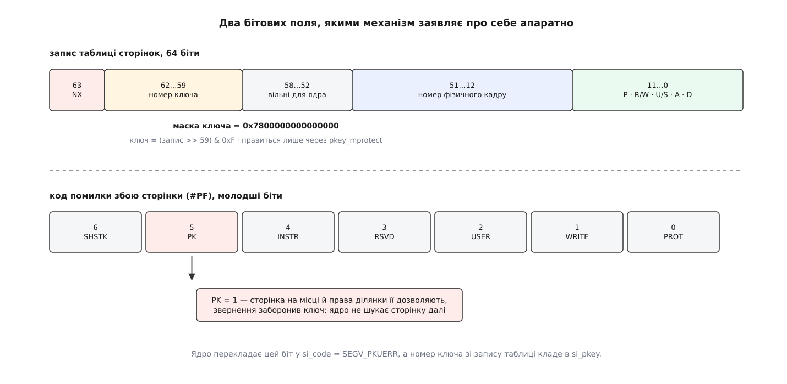

# 📋 Контракт ключів захисту: виклики, регістри, біти й помилки

Уся поверхня, якою механізм ключів дотикається до програми, вміщується в короткий перелік: три системні виклики, дві обгортки glibc, дві команди процесора, два бітових поля в апаратурі й одне значення в `siginfo`. Тут вони зібрані з точними сигнатурами, повними списками помилок і тими межами, за які виходити не можна.

Числа й імена нижче звірено з чинним деревом ядра, з glibc і з описом команд в Intel SDM. Де поведінка залежить від архітектури — це сказано окремо; де архітектуру не названо, ідеться про x86-64.

## Заголовки, версії, збірка

```c
#define _GNU_SOURCE      /* без нього оголошення pkey_* сховані */
#include <sys/mman.h>    /* pkey_alloc, pkey_free, pkey_mprotect, pkey_set, pkey_get */
#include <signal.h>      /* siginfo_t, SEGV_PKUERR, поле si_pkey                     */
```

Ніяких додаткових бібліотек лінкувати не треба: усе живе в libc.

| Що саме | Де реалізовано | З якої версії |
|---|---|---|
| `SEGV_PKUERR`, поле `si_pkey` | ядро | Linux 4.6 |
| `pkey_alloc`, `pkey_free`, `pkey_mprotect` | ядро | Linux 4.9 |
| рядок `ProtectionKey` у `smaps` | ядро, лише x86 | Linux 4.9 |
| обгортки `pkey_*` у заголовку `<sys/mman.h>` | glibc | 2.27 |
| ті самі виклики на powerpc (регістр `AMR`) | ядро | Linux 4.16 |
| ті самі виклики на arm64 (регістр `POR_EL0`) | ядро | Linux 6.12 |

Номери системних викликів на x86-64: `pkey_mprotect` — 329, `pkey_alloc` — 330, `pkey_free` — 331. Вони знадобляться, якщо доводиться писати правило [фільтра системних викликів](root:sys-unix/seccomp-filter-mechanism) — набору умов, за якими ядро дозволяє або відхиляє виклик ще до входу в обробник.

## pkey_alloc: узяти номер ключа

```c
int pkey_alloc(unsigned int flags, unsigned int access_rights);
```

| Аргумент | Що приймає |
|---|---|
| `flags` | **лише 0**; поле зарезервоване, будь-яке інше значення відхиляється |
| `access_rights` | початкові права ключа: побітове «або» з констант `PKEY_DISABLE_*`; `0` — нічого не заборонено |

Повертає **номер ключа** (мале додатне число) або `-1` з `errno`.

| Помилка | Коли саме |
|---|---|
| `EINVAL` | `flags != 0` **або** в `access_rights` є біт поза `PKEY_ACCESS_MASK` |
| `ENOSPC` | усі доступні процесові ключі роздано **або** механізму немає взагалі |

Друга комірка — головна пастка цього виклику. Окремої помилки на кшталт `ENOSYS` чи `ENOTSUP` не існує: ядро без підтримки ключів (не та архітектура, не той конфіг, механізм вимкнено параметром завантаження) відповідає тим самим `ENOSPC`, що й процес, який справді витратив усі п'ятнадцять номерів. Розрізнити ці два випадки за `errno` не можна — і не треба: обидва означають «ключа не буде, працюйте без нього».

Порядок перевірок у ядрі теж вартий уваги, бо він арифметичний, а не апаратний: спершу відхиляється ненульовий `flags`, потім `access_rights` із зайвими бітами, і лише після цього ядро йде шукати вільний номер. Отже, `EINVAL` від цього виклику ви дістанете й на машині, де ключів немає зовсім, — тобто `EINVAL` **не** є свідченням того, що механізм працює. Пробою на наявність служить лише вдалий виклик.

Ще одна властивість, яка ламає інтуїцію: `access_rights` записуються в регістр **того потоку, що викликав**. Сусідні потоки цього не бачать; їхні права на новий ключ визначає те значення, з яким вони починали життя.

## pkey_mprotect: причепити ключ до пам'яті

```c
int pkey_mprotect(void *addr, size_t len, int prot, int pkey);
```

Це `mprotect` із четвертим аргументом. Він робить обидві речі одразу — виставляє звичайні права `PROT_*` **і** записує номер ключа в ділянку та в кожен запис таблиці сторінок цього діапазону. Окремого виклику «поставити тільки ключ, прав не чіпати» немає, тому чинні `PROT_*` доводиться передавати наново щоразу.

| Аргумент | Вимоги |
|---|---|
| `addr` | вирівняний на межу сторінки |
| `len` | у байтах; округлюється вгору до сторінки |
| `prot` | той самий набір, що в `mprotect`: `PROT_NONE`, `PROT_READ`, `PROT_WRITE`, `PROT_EXEC` |
| `pkey` | номер, виданий `pkey_alloc` **цьому ж процесові**, `0` (типовий ключ) або `-1` |

`pkey = -1` — це legacy-форма: виклик поводиться точно як `mprotect`, а звичайний `mprotect` наявний ключ ділянки **зберігає**. Щоб ключ відчепити, передають `0` — типовий ключ, який ядро завжди вважає виділеним.

| Помилка | Коли саме |
|---|---|
| `EINVAL` | `pkey` не `-1` і не був виданий `pkey_alloc` цьому процесові |
| `EINVAL` | `addr` не вирівняний на сторінку, або в `prot` невідомі біти |
| `EACCES` | права суперечать походженню відображення (наприклад, `PROT_WRITE` на файл, відкритий тільки на читання) |
| `ENOMEM` | у діапазоні є невідображені сторінки, або ядру бракує пам'яті на розсічення ділянки, або перевищено межу кількості окремих ділянок |

Важливо, чого тут **немає**: `prot`, який ви передаєте, ключ не звужує й не розширює. Ключ уміє лише віднімати від того, що дозволив запис таблиці сторінок. Ділянка з `PROT_NONE` лишиться недоступною за будь-якого стану регістра, а ділянка з `PROT_READ | PROT_WRITE` дає ключеві повний діапазон для маневру. Тому в парі «`pkey_mprotect` + заборона в регістрі» саме перший виклик має бути щедрим.

## pkey_free: повернути номер

```c
int pkey_free(int pkey);
```

| Помилка | Коли саме |
|---|---|
| `EINVAL` | `pkey` не з тих, що видано цьому процесові: від'ємний, поза межею архітектури або вже звільнений |

Виклик знімає біт у побітовій мапі процесу — і більше нічого. Він **не** обходить ділянки й не прибирає ключ із записів таблиці сторінок. Звідси правило, яке в довідці описано як «поведінка невизначена»: звільнити ключ, який ще причеплений до пам'яті, — значить лишити в таблиці номер, що от-от дістанеться наступному `pkey_alloc`. Дві незв'язані ділянки мовчки поділять один рядок прав, і зачинивши одну, ви зачините й другу.

Правильний порядок звільнення завжди двоступеневий:

```c
pkey_mprotect(addr, len, PROT_READ | PROT_WRITE, 0);    /* спершу відчепити */
pkey_free(pkey);                                        /* потім повернути номер */
```

Окремо про арифметику доступних номерів. На x86 апаратура дає шістнадцять ключів, нульовий зайнятий типовим і програмі не видається — лишається п'ятнадцять. Але якщо в процесі з'явилася хоч одна ділянка з правами «тільки виконувати», ядро витрачає ще один номер на службовий ключ для неї. Цей ключ позначено зайнятим у мапі, проте жоден інтерфейс простору користувача його не бачить: `pkey_free` на нього поверне `EINVAL`, а `pkey_alloc` його ніколи не видасть. Практично це просто означає, що доступних ключів стало чотирнадцять.

## Права: константи й що вони значать

| Константа | Значення | Де є |
|---|---|---|
| `PKEY_UNRESTRICTED` | `0x0` | скрізь (сама назва додана пізно; на старіших заголовках пишуть просто `0`) |
| `PKEY_DISABLE_ACCESS` | `0x1` | скрізь |
| `PKEY_DISABLE_WRITE` | `0x2` | скрізь |
| `PKEY_DISABLE_EXECUTE` | `0x4` | arm64, powerpc — **не x86** |
| `PKEY_DISABLE_READ` | `0x8` | лише arm64 |
| `PKEY_ACCESS_MASK` | «або» всіх чинних для архітектури | скрізь, значення різне |

Ядро звіряє `access_rights` саме з `PKEY_ACCESS_MASK`, тому спроба передати `PKEY_DISABLE_EXECUTE` на x86 дає `EINVAL` — і дає його на етапі компіляції теж, бо константи там просто немає. Портативний код мусить ховати її під `#ifdef`.

Що ці біти означають на x86 у поєднанні:

```
0                                          читати й писати можна
PKEY_DISABLE_WRITE           (2)           читати можна, писати ні
PKEY_DISABLE_ACCESS          (1)           ні читати, ні писати
PKEY_DISABLE_ACCESS | _WRITE (3)           те саме, що 1 — заборона доступу переважає
```

Виконання команд ключ на x86 не обмежує за жодного значення. Сторінка, яку запис таблиці дозволяє виконувати, лишається виконуваною навіть під найсуворішим ключем.

## pkey_set і pkey_get: зміна прав без ядра

```c
int pkey_set(int pkey, unsigned int rights);
int pkey_get(int pkey);
```

Це **не** системні виклики. Обидві функції живуть цілком у libc, у ядро не заходять і діють лише на потік, що їх викликав. `pkey_set` повертає `0` або `-1`, `pkey_get` — саме значення прав (`0…3` на x86) або `-1`.

Перевірки в x86-версії glibc дослівно такі:

```
pkey_set:  pkey < 0 || pkey > 15 || rights > 3   →  -1, errno = EINVAL
pkey_get:  pkey < 0 || pkey > 15                 →  -1, errno = EINVAL
```

Далі йде чиста арифметика над одним регістром:

```
маска      = 3 << (2·pkey)
PKRU       = (PKRU & ~маска) | (rights << (2·pkey))    ← pkey_set
результат  = (PKRU >> (2·pkey)) & 3                    ← pkey_get
```

З цих чотирьох рядків випливають три речі, які варто знати наперед.

**Аргумент `rights` — це буквально двобітове поле регістра.** Нумерація констант `PKEY_DISABLE_*` збігається з розкладкою бітів не випадково: `PKEY_DISABLE_ACCESS` — молодший біт пари, `PKEY_DISABLE_WRITE` — старший. Тому `pkey_get` можна порівнювати з тими самими константами, якими ви ключ виділяли.

**Жодного номера ключа тут не перевіряють на «виділений».** Аргумент `pkey` — це просто індекс у регістрі. `pkey_set(7, …)` на ключ, якого ви не брали, спрацює й нічого не поверне про помилку; ядро при цьому має право будь-коли переписати біти невиділених ключів на свій розсуд. Ці два факти разом означають одне: поза виділеними номерами покладатися на вміст регістра не можна.

**Перевірки на наявність механізму немає теж.** x86-версія glibc після валідації аргументів одразу виконує `RDPKRU`/`WRPKRU`. На машині, де `CR4.PKE` не виставлено, це недійсна команда — процес дістане `SIGILL`, а не помилку в `errno`. Звідси залізне правило порядку: спершу вдалий `pkey_alloc`, і лише потім будь-який `pkey_set` або `pkey_get`.

Поза x86 ці дві обгортки в glibc можуть бути заглушками, що повертають `ENOSYS`, — на відміну від трьох системних викликів, які працюють на всіх підтриманих архітектурах однаково.

## Команди процесора

| | `WRPKRU` | `RDPKRU` |
|---|---|---|
| байти | `0F 01 EF` | `0F 01 EE` |
| вхід | `EAX` — нове значення PKRU | — |
| вихід | — | `EAX` ← PKRU, `EDX` ← 0 |
| вимога до `ECX` | мусить бути 0 | мусить бути 0 |
| вимога до `EDX` | мусить бути 0 | немає (регістр затирається) |
| `#GP(0)` | `ECX ≠ 0` або `EDX ≠ 0` | `ECX ≠ 0` |
| `#UD` | `CR4.PKE = 0`, або вжито префікс `LOCK` | те саме |
| привілей | будь-який, зокрема третє кільце | будь-який |

Старші 32 біти `RAX`, `RCX`, `RDX` в 64-бітному режимі ігноруються або обнуляються; прапорців команди не чіпають.

Написані руками, вони виглядають так:

```c
static inline unsigned int rdpkru(void)
{
    unsigned int pkru;
    __asm__ volatile(".byte 0x0f,0x01,0xee" : "=a"(pkru) : "c"(0) : "edx");
    return pkru;
}

static inline void wrpkru(unsigned int value)
{
    __asm__ volatile(".byte 0x0f,0x01,0xef"
                     :: "a"(value), "c"(0), "d"(0) : "memory");
}
```

Байти замість мнемонік — щоб не вимагати свіжого асемблера; сучасні `binutils` розуміють і `rdpkru`/`wrpkru`. Обов'язкові нулі в `ECX` та `EDX` тут не декоративні: без них команда не виконається, а впаде в `#GP`.

Позначку `"memory"` у списку зіпсованого варто ставити свідомо. Компілятор про існування PKRU не знає нічого й має повне право винести читання із захищеної сторінки за межі відчиненого вікна — тоді звернення відбудеться при зачиненому ключі й дасть збій. Позначка забороняє йому переставляти звернення до пам'яті через цю команду.

Про сам процесор турбуватися не треба, і це записано в описі команди прямо: `WRPKRU` **ніколи не виконується спекулятивно**, а жодне звернення до пам'яті, на яке впливає PKRU, не виконається — навіть спекулятивно — доти, доки всі попередні `WRPKRU` не завершилися й не оновили регістр. Отже, ні `lfence`, ні `mfence` довкола неї не потрібні.

## Розкладка PKRU

Регістр 32-бітний, на кожен із шістнадцяти ключів припадає рівно два біти:

```
біт 2i      —  AD (access disable):  забороняє будь-яке звернення до даних
біт 2i + 1  —  WD (write disable):   забороняє лише запис

поле ключа i  =  (PKRU >> 2i) & 3
```

**Приклад: обчислити слово PKRU для політики «ключ 0 — усе можна, ключ 2 — тільки читання, решта — зачинена».**

```
ключ 0   →  00   (біти 1…0)
ключ 2   →  10   (біти 5…4: WD = 1, AD = 0)
ключі 1, 3…15  →  01   (по одному біту AD)

усі AD для ключів 1…15  =  Σ 1 << 2i, i = 1…15  =  0x55555554
переставити ключ 2 з AD на WD:  − (1 << 4) + (1 << 5)  =  + 0x10

PKRU = 0x55555554 + 0x10 = 0x55555564
```

Значення `0x55555554` тут не випадкове — саме воно є типовим початковим станом регістра в Linux, і трапиться ще раз нижче.

## Де лежить номер ключа

На x86-64 номер ключа займає біти **62…59** запису таблиці сторінок — чотири біти, які апаратура раніше лишала операційній системі.

```
номер ключа  =  (запис таблиці сторінок >> 59) & 0xF
маска ключа  =  0x7800000000000000
```

Записати туди щось може лише `pkey_mprotect`. Інтерфейсу, який переставив би ключ на готовій ділянці збоку — через `/proc` чи `ioctl`, — не існує.



*Два бітових поля, якими механізм заявляє про себе: одне зберігає ключ, друге повідомляє, що саме ключ і спрацював.*

## Виявлення механізму

| Прикмета | Де читати | Що означає |
|---|---|---|
| `PKU` | `CPUID.(EAX=07H, ECX=0):ECX` біт 3 | апаратура вміє ключі |
| `OSPKE` | `CPUID.(EAX=07H, ECX=0):ECX` біт 4 | ядро виставило `CR4.PKE` (біт 22) і механізм працює |
| `pku`, `ospke` | рядок `flags` у `/proc/cpuinfo` | ті самі два біти в придатному до читання вигляді |
| `CONFIG_X86_INTEL_MEMORY_PROTECTION_KEYS` | конфіг ядра | без нього механізму немає, хай яка апаратура |
| `nopku` | [рядок параметрів ядра](root:sys-unix/bootloader-and-cmdline) — той текстовий рядок, який завантажувач кладе поряд з образом і ядро розбирає до появи першого процесу | ключі вимкнено адміністративно: `PKU` є, `OSPKE` немає |

Останній рядок пояснює, чому програмі не варто читати `CPUID` самій. Апаратна прикмета `PKU` каже лише про залізо; механізм може бути вимкнений і рядком завантаження, і конфігом ядра, і — на віртуальній машині — гіпервізором. Єдина відповідь, якій можна вірити, — це результат виклику:

```c
int pkey = pkey_alloc(0, 0);
if (pkey < 0) {
    /* errno == ENOSPC: механізму немає або ключі вичерпано.
       Обидва випадки означають те саме — план Б без ключів.   */
}
```

## Порушення ключа: що бачить програма

| Рівень | Що відбувається |
|---|---|
| апаратура | збій сторінки `#PF`, у коді помилки виставлено біт 5 (`X86_PF_PK`) |
| ядро | побачивши цей біт, не шукає й не підвантажує сторінку: причина не в її відсутності |
| програма | `SIGSEGV` з `si_code = SEGV_PKUERR`, `si_addr` — адреса звернення, `si_pkey` — номер ключа |

Поле оголошено так:

```c
int si_pkey;   /* номер ключа в записі таблиці, що спричинив збій */
```

Воно заповнене **лише** при `si_code == SEGV_PKUERR`; за інших кодів читати його не варто. Ось повний набір кодів `SIGSEGV`, який доводиться розрізняти на цій архітектурі:

| `si_code` | Значення | Додаткові поля |
|---|---|---|
| `SEGV_MAPERR` | за адресою нічого не відображено | `si_addr` |
| `SEGV_ACCERR` | відображення є, але його права не дозволяють цього звернення | `si_addr` |
| `SEGV_PKUERR` | права ділянки дозволяють, звернення заборонив ключ | `si_addr`, `si_pkey` |
| `SEGV_BNDERR` | не пройшла перевірка меж | `si_addr`, `si_lower`, `si_upper` |
| `SEGV_CPERR` | збій захисту потоку керування | `si_addr` |

Різниця між другим і третім рядком — саме те, заради чого поле `si_pkey` й додали: `SEGV_ACCERR` означає «не дозволяє ділянка», `SEGV_PKUERR` — «ділянка дозволяє, а регістр цього потоку в цю мить — ні».

Щоб дістатися `siginfo`, обробник треба ставити з прапорцем `SA_SIGINFO` — [сигнал приходить асинхронно, і саме цей прапорець просить у ядра розширену форму обробника з описом причини](root:sys-unix/signal-model). У [знімку пам'яті аварійного процесу](root:sys-unix/core-dump) — файлі, куди ядро скидає стан процесу в мить падіння — та сама структура лежить у нотатці `NT_SIGINFO`, тож ключ видно й посмертно.

## Мінімальний повний виклик

Програма проходить увесь цикл: виділяє ключ, чіпляє його до сторінки, відчиняє, читає, зачиняє й натикається на власну заборону.

```c
/* pkey-probe.c — cc -O2 -o pkey-probe pkey-probe.c */
#define _GNU_SOURCE
#include <signal.h>
#include <stdio.h>
#include <string.h>
#include <unistd.h>
#include <sys/mman.h>

static void on_segv(int sig, siginfo_t *si, void *ucontext)
{
    char msg[] = "SEGV_PKUERR, si_pkey = _\n";
    (void)sig; (void)ucontext;

    if (si->si_code != SEGV_PKUERR)
        _exit(2);                       /* звичайне порушення прав ділянки */

    msg[23] = "0123456789abcdef"[si->si_pkey & 0xf];
    ssize_t n = write(STDERR_FILENO, msg, sizeof msg - 1);
    (void)n;
    _exit(0);                           /* повертатися нікуди: звернення повториться */
}

int main(void)
{
    size_t ps = (size_t)sysconf(_SC_PAGESIZE);
    char *page = mmap(NULL, ps, PROT_READ | PROT_WRITE,
                      MAP_PRIVATE | MAP_ANONYMOUS, -1, 0);
    if (page == MAP_FAILED) { perror("mmap"); return 1; }
    page[0] = 'x';

    int pkey = pkey_alloc(0, PKEY_DISABLE_ACCESS);
    if (pkey < 0) { perror("pkey_alloc"); return 1; }   /* ENOSPC — ключів немає */

    if (pkey_mprotect(page, ps, PROT_READ | PROT_WRITE, pkey) < 0) {
        perror("pkey_mprotect"); return 1;
    }

    struct sigaction sa;
    memset(&sa, 0, sizeof sa);
    sa.sa_sigaction = on_segv;
    sa.sa_flags = SA_SIGINFO;
    sigemptyset(&sa.sa_mask);
    sigaction(SIGSEGV, &sa, NULL);

    printf("ключ %d, права зараз %d\n", pkey, pkey_get(pkey));

    pkey_set(pkey, 0);                            /* відчинили — лише цьому потокові */
    printf("крізь відчинений ключ читається: %c\n", page[0]);
    pkey_set(pkey, PKEY_DISABLE_ACCESS);          /* зачинили */
    fflush(stdout);

    volatile char *probe = page;
    (void)*probe;                                 /* тут спрацює ключ */

    puts("сюди виконання не доходить");
    return 0;
}
```

```
$ ./pkey-probe
ключ 1, права зараз 1
крізь відчинений ключ читається: x
SEGV_PKUERR, si_pkey = 1
```

Три деталі, без яких приклад ламається. `volatile` на покажчику потрібен, бо читання, результат якого нікуди не йде, компілятор має право просто викинути. `fflush` перед забороненим зверненням потрібен, бо буфер `stdout` інакше загубиться разом із процесом. І `_exit` в обробнику потрібен, бо повернення з нього означає повторення того самого звернення й нескінченну петлю збоїв.

## Порядок викликів, який не можна переставити

1. **`pkey_alloc` перед `pkey_mprotect`.** Інакше — `EINVAL`: ядро приймає лише той номер, який видало саме цьому процесові.
2. **`pkey_mprotect` із щедрими `PROT_*`.** Ключ уміє лише віднімати; те, що ви не дали в `prot`, він не поверне ніколи.
3. **`pkey_set` — у кожному потоці окремо.** Регістр свій у кожного потоку й успадковується від того, хто потік створив. Права, виставлені в `pkey_alloc`, дісталися тільки викликачеві.
4. **Стек обробника сигналів — до того, як класти пам'ять під ключі**, і під нульовим ключем. Обробник дістає типові права, і якщо його стек лежить під зачиненим ключем, перший же `SIGSEGV` не зможе виконатися.
5. **`pkey_mprotect(…, 0)` перед `pkey_free`.** Інакше номер повернеться в мапу, а в записах таблиці сторінок лишиться. Саме `0`, а не `-1`: `-1` означає «як звичайний `mprotect`», а той наявний ключ зберігає.

## Де ключ видно ззовні

### `/proc/<pid>/smaps`

Кожна ділянка з ненульовим ключем показує його окремим рядком — це єдиний спосіб побачити чужу розкладку ключів, не зупиняючи процес. [Файлова система процесів](root:sys-unix/proc-reading-process-and-kernel-state), яка подає стан ядра як текстові файли, дає це разом з усіма іншими лічильниками ділянки:

```
7f2c1a400000-7f2c1a401000 rw-p 00000000 00:00 0
Size:                  4 kB
Rss:                   4 kB
...
ProtectionKey:         3
VmFlags: rd wr mr mw me ac
```

| Властивість | Значення |
|---|---|
| з якої версії | Linux 4.9 |
| на яких архітектурах | лише x86 |
| від чого залежить | `CONFIG_X86_INTEL_MEMORY_PROTECTION_KEYS` |
| гранулярність | одна ділянка — один рядок |
| у `smaps_rollup` | немає: зведення складає лише те, що можна складати |

Швидкий спосіб знайти всі захищені ділянки процесу:

```sh
$ awk '/^[0-9a-f]/ {vma = $0}
       /^ProtectionKey: +[1-9]/ {print vma, "→", $2}' /proc/1234/smaps
7f2c1a400000-7f2c1a401000 rw-p 00000000 00:00 0 → 3
```

### `/sys/kernel/debug/x86/init_pkru`

Загальносистемна ручка, що задає стартовий вміст PKRU. Живе в debugfs — [псевдо-файловій системі для налагоджувальних інтерфейсів ядра](root:sys-unix/pseudo-filesystems), яку заведено монтувати в `/sys/kernel/debug` і читати з-під адміністратора.

| Властивість | Значення |
|---|---|
| права на файл | `0600`, тобто тільки адміністратор |
| типове значення | `0x55555554` — біт AD виставлено всім ключам від 1 до 15 |
| коли застосовується | на `execve`, до нового образу програми |
| що відхиляється | будь-яке значення, у якому виставлено біт 0 або біт 1 |

Правило відхилення варте окремого пояснення, бо воно рятує машину від миттєвої смерті. Біти 0 і 1 — це права **нульового** ключа, а нульовий ключ дістають усі сторінки, яким ключа не призначали: стек, код, глобальні дані. Заборонити доступ до нього — значить убити кожен новий процес на першій же команді, зокрема й ту оболонку, з якої ви це написали.

Типове значення `0x55555554` — це та сама сувора політика, з якою кожна програма починає життя: усе, крім нульового ключа, зачинено. Її наслідок радше приємний: потік, народжений **до** того, як ваша програма взяла ключ, доступу до майбутніх захищених сторінок не має — не тому, що хтось про нього подбав, а тому, що йому нічого й не давали. Послаблюючи `init_pkru`, ви знімаєте саме цю гарантію, і знімаєте її для всієї системи, а не для однієї програми.

## Що змінюється на інших архітектурах

| | x86-64 (PKU) | arm64 (POE, FEAT_S1POE) | powerpc |
|---|---|---|---|
| регістр прав | `PKRU`, 32 біти | `POR_EL0`, 64 біти | `AMR`, плюс `IAMR` на виконання |
| бітів на ключ | 2: AD, WD | 4: окремо читання, запис, виконання | 2 |
| ключів | 16, програмі — 15 | 8 | залежить від моделі й гіпервізора |
| бітів у записі таблиці | 4 (62…59) | 3 | — |
| діє на вибирання команд | **ні** | **так** | так, через `IAMR` |
| додаткові прапорці | — | `PKEY_DISABLE_EXECUTE`, `PKEY_DISABLE_READ` | `PKEY_DISABLE_EXECUTE` |
| «тільки виконувати» | окремим службовим ключем із заборони доступу | ключі не потрібні: `EPAN`/`FEAT_PAN3` | — |
| у Linux від | 4.9 | 6.12 | 4.16 |

Найважливіший рядок — «діє на вибирання команд». На x86 ключ перевіряється лише на звернення до **даних**, тож фокус із пам'яттю, з якої можна тільки виконувати, робиться ключем із виставленим AD і коштує один номер із п'ятнадцяти. На arm64 права ключа поширюються й на вибирання команд, зате режим «тільки виконувати» апаратура вміє сама, і ключів на нього не витрачає: у ядрі функція, що видає службовий ключ, там просто повертає `-1`.

Друге за важливістю — набір прапорців. Код, який має працювати всюди, тримається трьох правил: не припускати шістнадцяти ключів (запитувати номери в `pkey_alloc`, доки видають); не згадувати `PKEY_DISABLE_EXECUTE` і `PKEY_DISABLE_READ` без `#ifdef`; і не читати регістр прав напряму — лише крізь `pkey_get`, який на кожній архітектурі знає, звідки брати.
